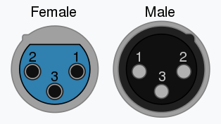
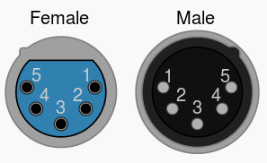

# DMX入門

## はじめに

このチュートリアルでは、DMX512（**D**igital **M**ultiple**x** with **512** pieces of information、512個の情報を多重化するデジタル方式）について扱う。
もともとは照明用調光器どうしの通信を標準化する手段として作られたDMX512だが、現在では[インテリジェントライト](https://ja.wikipedia.org/wiki/Intelligent_lighting)、[ゴボ](https://ja.wikipedia.org/wiki/Gobo_(lighting))、[レーザー](https://ja.wikipedia.org/wiki/%E3%83%AC%E3%83%BC%E3%82%B6%E3%83%BC%E3%82%B7%E3%83%A7%E3%83%BC)、[霧発生装置](https://ja.wikipedia.org/wiki/Fog_machine)など、さまざまなステージ照明・演出機器の制御に使われるようになっている。
DMX512は、建築照明の演出（ラスベガスの街並みを思い浮かべてほしい）にも使われるほどである。
このチュートリアルでは、DMXをどのように、そしてどんな場面で導入すればよいかについて知っておくべきことをまとめる。

### 歴史

DMX512は1986年、USITT（米国劇場技術協会）の技術委員会によって、照明の調光チャンネルを制御する方式として作られた。
1998年にはESTAがDMXをANSI規格として承認してもらうための作業に着手し、2004年にDMX-512Aは「照明機器およびその周辺機器を制御するための非同期シリアルデジタルデータ伝送規格」としてANSIに承認された。

参考になるチュートリアル:

シリアル通信に馴染みがなければ、先に次のチュートリアルを確認しておくとよい。

- [シリアル通信](./serial-communication.md)

## 基本用語

- **フィクスチャー／スレーブ**：DMX入力を受け取るあらゆる機器のこと。DMXパケット全体を受信し、自分に関係するデータだけを取り出して処理する（[インテリジェントライト](https://ja.wikipedia.org/wiki/Intelligent_lighting)、[ゴボ](https://ja.wikipedia.org/wiki/Gobo_(lighting))、[レーザー](https://ja.wikipedia.org/wiki/%E3%83%AC%E3%83%BC%E3%82%B6%E3%83%BC%E3%82%B7%E3%83%A7%E3%83%BC)、[霧発生装置](https://ja.wikipedia.org/wiki/Fog_machine)など）。多くのフィクスチャーには、入力をそのまま複製して出す出力チャンネルが備わっている。
- **ユニバース**：同じデータを読み取るフィクスチャーを数珠つなぎにした集合のこと。1つのユニバースは512バイトの情報からなるため、ユニバースに接続できるフィクスチャーの数は、各フィクスチャーがアドレス指定に必要とするバイト数によって決まる。
- **コントローラー**：DMXデータを生成し、1つまたは複数のユニバースへ送信する機器のこと。たいていはノブやスライダーが多数並んだ大きな操作卓だが、単純なPCをDMXコントローラーとして使うこともできる。

## ハードウェア層

DMX512は、照明ブースとステージの間の距離が長くなりがちなため、比較的長い距離にわたって使われることが多い。
信号を送る距離が長くなるほど、周囲からの電磁的なノイズを拾ってしまう区間も長くなる。
これに加えて、DMXは電気的にノイズの多い環境で使われることが多いという事情もあるため、比較的ノイズに強い方式を選ぶ必要があり、DMXは[RS-485](https://ja.wikipedia.org/wiki/EIA-485)を採用している。

この種の信号は、データを乗せた1本の線（D+）と、その反転データを乗せたもう1本の線（D-）の差を読み取ることで解釈される。
差を読み取ることから、これを**差動信号**と呼ぶ。
RS-485のような差動信号は、2本の信号線にほぼ均等にノイズが乗るため、2つの信号の差そのものは変わらずに保たれる。
2つの信号の差を読み取る方式であるため、長距離での通信がしやすいという利点がある（DMX規格が推奨する最大配線長は1000フィートだが、RS-485自体は4000フィートまで対応している）。

DMXデータはたいていXLR-5ケーブルで伝送されるが、DMX対応のXLR-3ケーブルが使われることもある。
RS-485が必要とする線はグラウンド、Data+、Data-の3本だけであり、多くの用途ではこれだけで十分だった。
しかし将来の拡張に備えてもう一対のデータ線が追加されたため、XLR-5ケーブルが必要になった。
これらのコネクタとそのピン配置を以下に示す。

XLR-3

XLR-5

| ピン | XLR-3 | XLR-5 |
| --- | --- | --- |
| 1 | Common | Common |
| 2 | Data 1 - | Data 1 - |
| 3 | Data 1 + | Data 1 + |
| 4 | N/A | Data 2 - |
| 5 | N/A | Data 2 + |

長距離での通信で問題になるのが、DMX機器どうしが離れた場所でそれぞれ別々に電源を取っていることが多いという点である。
距離が離れているとグラウンドループ、つまり2台の機器のグラウンド電位の差が生じることがあり、この差が十分大きいと機器間に電流が流れてしまう。
こうした事情から、DMX512規格では、DMXフィクスチャー上のマイクロコントローラ部分とDMX部分の間をオプトアイソレータ（フォトカプラ）で絶縁することも定めている。

また、信号の反射を防ぐため、DMX機器の数珠つなぎの末端にある2本のデータ線の間に120Ωの終端抵抗を入れておくことが望ましい。
スイッチで切り替えられる機器もあれば、終端抵抗付きのXLRケーブルを挿すことを推奨する機器もあり、終端抵抗をまったく備えていない機器もある。
終端されていないDMXラインは、ユニバース全体でちらつきを引き起こすことがあるため、ラインが終端されているか必ず確認すること。

## パケット構造

DMXデータは、250kbit/sで送られる非同期シリアルデータであり、ストップビットは2ビット、パリティビットはない。
つまり、送信される1クロックパルス（1ビット）にかかる時間は4µsである。
パケットは、送信されるデータがすべてローになる長い**ブレーク**から始まる。
これに続くのが、短いハイの区間である**MAB**（Mark After Break）である。
その後、11ビットのシリアルフレーム（ロー1ビット、8ビットのデータバイト、ハイ2ビット）からなるスタートコード（**SC**）が続き、ここで送られるデータは通常*0x00*である。
スタートコードには別の値を入れることもでき、パケットに含まれるDMXデータの種類を示すことができる。*0x17*はテキストパケット、*0xCC*はRemote Device Managementパケット（後述）、*0xCF*はシステム情報パケットを表し、さまざまなスタートコードがさまざまな種類のデータを示すために使われる。
スタートコードに続いて、同じ構造を持つフレームが最大512個続く。それぞれ**スロット**と呼ばれ、すべてのDMXデータ（RGB値、CMY値、サーボの位置、霧発生装置の圧力など）を格納する。
各フレームの間には、最大1秒間ハイになるMark Time Between Frames（**MTBF**）を任意で挟むことができる。
データフレームの送信が終わると、さらに最大1秒間のMark Time Between Packets（**MTBP**）が続く。
ただし、フレームレートを保つため、これらが実際に使われることはめったにない。
次の表に、DMXパケットを構成する各部分のタイミングと略称をまとめる。

| パケット | 略称 | クロックパルス数 | タイミング |
| --- | --- | --- | --- |
| Break | BREAK | 22 | 88µs |
| Mark After Break | MAB | 2 | 8µs |
| Start Code | SC | 11 | 44µs |
| Mark Time Between Frames | MTBF | X | 0〜1秒 |
| Slot | SLOT | 11 | 44µs |
| Mark Time Between Packets | MTBP | X | 0〜1秒 |
| DMX512パケット全体 | N/A | 5667 | 23ms |

DMXパケット全体の送信にかかる時間（23ms）に注目してほしい。
この逆数を取ると、最大フレームレートは44Hzになる。

## データのデコード

これまで説明してきたDMXパケットは、数珠つなぎになった機器の列へ送られるが、それぞれの機器はパケットのどのスロットを読み取ればよいと判断しているのだろうか。
DMXフィクスチャーには、どこかにディップスイッチが備わっていることが多く、これで読み取りを開始するスロット番号を選ぶ。フィクスチャーは、そこから決められた数のスロットを読み取る。
たとえば、単純なRGB調光器は3スロットを使う（各色に1スロットずつ）ので、開始スロットを12に設定すると、スロット12、13、14のデータを読み取ることになる。
DMXフィクスチャーは2つ目のストップビットの時点でスロットのカウンタを進める必要があり、これによって次のフレームが始まったとき、マイクロプロセッサはそのデータがどのスロットのものかを把握できる。
このカウンタは、ブレークとマークを検出するたびにリセットされる。
つまり、DMXパケットは必ずしも512スロット全部を持つ必要はなく、カウンタは可変の間隔でリセットできるということである。
ただし、これによって1つのユニバースに収められるフィクスチャーの数は、各フィクスチャーが必要とするスロット数に応じて制限される。

### Remote Device Management（RDM）

Remote Device Management、略してRDMは、DMXを使って照明フィクスチャーから情報を取得するための仕組みである。
このプロトコルでは、RDM用のスタートコード（*0xCC*）を持つDMX512パケットを送り、続けて通信したいフィクスチャーの固有IDを送信する。
コントローラーはその後データ線を解放し、応答を待つ。
一定時間が過ぎても応答がなければ、コントローラーは失敗したと判断し、再試行することがある。
未知のユニバースに接続した際、それぞれのフィクスチャーが何をできるのかを正確に知りたい場合、RDMは非常に便利な手段である。

## まとめ

このガイドが、独自の凝った照明フィクスチャーをDMXで通信させ、誰でも自作の点灯パターンを苦労してコーディングせずに制御できるようにする助けになれば幸いである。
ヒントが欲しければ、DMXを使った次のような実装例も参考にしてほしい（いずれも英語）。

- [Using Artnet DMX and the ESP32 to Drive Pixels](https://learn.sparkfun.com/tutorials/using-artnet-dmx-and-the-esp32-to-drive-pixels)：人気のビデオジョッキーソフトウェアResolume Arenaを使って、ArtNet DMX対応の自作フィクスチャーを制御する方法を紹介する。
- [LuMini Ring Hookup Guide](https://learn.sparkfun.com/tutorials/lumini-ring-hookup-guide)：高解像度LEDリング「LuMini Ring」の使い方ガイド。
- [LuMini 8x8 Matrix Hookup Guide](https://learn.sparkfun.com/tutorials/lumini-8x8-matrix-hookup-guide)：高解像度LEDマトリクス「LuMini 8x8 Matrix」の使い方ガイド。
- [SparkFun ESP32 DMX to LED Shield](https://learn.sparkfun.com/tutorials/sparkfun-esp32-dmx-to-led-shield)：DMX to LED Shieldをさまざまな方法で活用するガイド。

タグ: 通信、概念、DMX

---

出典：[Introduction to DMX](https://learn.sparkfun.com/tutorials/introduction-to-dmx)（SparkFun Learn）を日本語に翻訳し、再構成した。
原文は [CC BY-SA 4.0](https://creativecommons.org/licenses/by-sa/4.0/) ライセンスで公開されており、本ページも同ライセンスの下で提供する。
