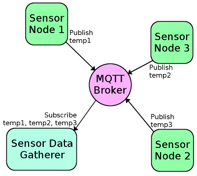
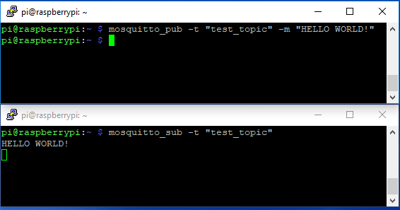
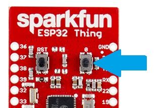
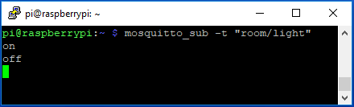
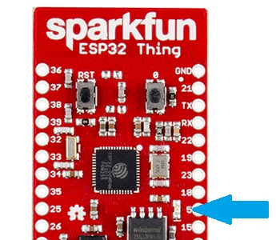
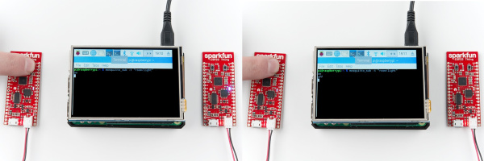

# MQTT入門

## はじめに

このチュートリアルでは、MQTTメッセージングプロトコルについて知っておくべきことをひととおり学ぶ。なぜこれを使いたくなるのか、そしてどう実装するのかについても扱う。
一言で言えば、MQTTは既存のインターネット接続された家庭内ネットワークを使って、IoTデバイスにメッセージを送り、そのメッセージに応答させる仕組みである。



### 簡単な歴史

MQTT（**M**essage **Q**ueuing **T**elemetry **T**ransport）は、TCP/IPプロトコルの上で動作する、パブリッシュ／サブスクライブ型のメッセージングプロトコルである。
最初のバージョンは1999年、IBMのAndy Stanford-ClarkとCirrus LinkのArlen Nipperによって開発された。
MQTTがHTTPリクエストをIoTデバイスから送るより高速である理由の一つは、MQTTのメッセージがわずか2バイトほどに収まりうる点にある。一方HTTPでは、他のデバイスにとってはどうでもよい情報を大量に含むヘッダーが必要になる。
また、HTTPで複数のデバイスがリクエストを待っている場合、それぞれのクライアントに個別にPOSTアクションを送る必要がある。
MQTTでは、サーバーが1つのクライアントから情報を受け取ると、それに関心を持つすべてのクライアントへ自動的に配信してくれる。

### 必要な部品

このチュートリアルの例を実際に試すには、次のハードウェアが必要である。手元にあるものによっては、すべてが必要になるとは限らない。

参考になるチュートリアル:

以下の概念に馴染みがなければ、続きを読む前にこれらのチュートリアルを確認しておくことをおすすめする。

- [Raspberry Pi 3 Starter Kitの使い方](https://learn.sparkfun.com/tutorials/raspberry-pi-3-starter-kit-hookup-guide)
- [ESP32 Thingの使い方](https://learn.sparkfun.com/tutorials/esp32-thing-hookup-guide)
- [Raspberry Pi Zero Wirelessの使い方](./getting-started-with-the-raspberry-pi-zero-wireless.md)
- [Raspberry PiでVNCによるリモートデスクトップを使う](./how-to-use-remote-desktop-on-the-raspberry-pi-with-vnc.md)

## 基礎知識

MQTTネットワークの構築方法を学ぶ前に、そこで使われる専門用語と、それぞれの要素がどうネットワークを構成するのかを理解しておくと役立つ。

- **ブローカー**：サーバーに接続している、関心を持つクライアントに情報を配信する、サーバー側の存在。
- **クライアント**：情報を送受信するためにブローカーへ接続するデバイス。
- **トピック**：メッセージが何についてのものかを示す名前。クライアントは、あるトピックに対してパブリッシュ、サブスクライブ、あるいはその両方を行う。
- **パブリッシュ（publish）**：トピック名に基づいて、関心を持つクライアントへ配信してもらうために、ブローカーへ情報を送ること。
- **サブスクライブ（subscribe）**：クライアントが、自分がどのトピックに関心を持っているかをブローカーに伝えること。あるトピックにサブスクライブすると、ブローカーへパブリッシュされたメッセージはすべて、そのトピックのサブスクライバーに配信される。クライアントは**アンサブスクライブ**して、あるトピックについてのメッセージの受信を止めることもできる。
- **QoS**：サービス品質（Quality of Service）。それぞれの接続は、0〜2の整数値でブローカーに対してサービス品質を指定できる。QoSはTCPのデータ伝送自体の扱いには影響せず、あくまでMQTTクライアント間の話である。*注：後の例では、QoS 0のみを使用する。*
  - **0**は「多くとも1回」、つまり配信の確認応答を必要とせず、1回だけ（届かないこともある）送ることを意味する。これは「撃ちっぱなし（fire and forget）」とも呼ばれる。
  - **1**は「少なくとも1回」を意味する。確認応答を受け取るまでメッセージを複数回送信する。これは確認付き配信と呼ばれる。
  - **2**は「正確に1回」を意味する。送信側と受信側のクライアントは2段階のハンドシェイクを使い、メッセージのコピーがちょうど1つだけ受信されるようにする。これは保証付き配信と呼ばれる。

### MQTTの仕組み

はじめに触れたとおり、MQTTはパブリッシュ／サブスクライブ型のメッセージングプロトコルである。
クライアントはネットワークに接続し、あるトピックにサブスクライブしたり、パブリッシュしたりする。
クライアントがあるトピックにパブリッシュすると、そのデータはブローカーへ送られ、ブローカーはそのトピックにサブスクライブしているすべてのクライアントへ配信する。

トピックは、ディレクトリのような階層構造で表される。
トピックは**"LivingRoom"**のようなものかもしれないし、その親トピックの中に複数のクライアントがある場合は**"LivingRoom/Light"**のようになるかもしれない。
サブスクライバー側のクライアントは、サブスクライブしているトピックからの新着メッセージを待ち受け、**"on"**や**"off"**のようにそのトピックへパブリッシュされた内容に応じて反応する。
クライアントは、あるトピックにサブスクライブしつつ、別のトピックにパブリッシュすることもできる。
たとえば**"LivingRoom/Light"**にサブスクライブしているクライアントが、他のクライアントがその照明の状態を監視できるよう、**"LivingRoom/Light/State"**のような別のトピックにパブリッシュしたい、というようなケースである。

MQTTの動作原理の理論がわかったところで、[Raspberry Pi](https://www.sparkfun.com/products/14643)と[ESP32 Thing](https://www.sparkfun.com/products/13907)を使って、手早く簡単な例を作り、実際に動く様子を見てみよう。
まずはブローカーをセットアップし、正しく動作しているか手早くテストするところから始める。

## ブローカーをセットアップする

リモートサーバー上でも、オフィスのマシンのようなローカル環境でも、あるいは[Raspberry Pi](https://www.sparkfun.com/products/14643)のような専用のコンピュータでも動作する、数多くのMQTTブローカーが存在する。
このチュートリアルの例では、ローカルネットワークに接続したRaspberry Piで、[Mosquitto](http://mosquitto.org/)という無料でオープンソースのブローカーを動かす。

Mosquittoのセットアップは簡単で、[ターミナル](./terminal-basics.md)を開いて次のように入力するだけである。

```bash
sudo apt-get install mosquitto -y
```

インストールが終わったら、Piからテスト用のクライアントを作り、あるトピックを待ち受けさせて、ブローカーが正しく動作しているか確認しよう。
そのために、mosquittoのクライアントをインストールする。

```bash
sudo apt-get install mosquitto mosquitto-clients -y
```

クライアントのインストールが終わったら、次のコマンドで"test_topic"というトピックにサブスクライブする。

```bash
mosquitto_sub -t "test_topic"
```

`mosquitto_sub`と入力することでmosquittoにトピックをサブスクライブしたいことを伝え、`-t`で示す`test_topic`という名前のトピックにサブスクライブしたいことを指定している。
これで、`test_topic`にパブリッシュするたびに、送信されたメッセージがこのウィンドウに表示されるようになる。

このターミナルはブローカーからのメッセージを待ち受けている状態なので、メッセージをパブリッシュするには2つ目のターミナルウィンドウを開く必要がある。
開いたら、次のコマンドで`test_topic`にパブリッシュする。

```bash
mosquitto_pub -t "test_topic" -m "HELLO WORLD!"
```

先ほどと同じように`-t`でトピックを示すが、今回は`mosquitto_pub`を使い、`-m`でパブリッシュしたいメッセージを指定している。
<kbd>Enter</kbd>キーを押すと、以下のようにサブスクライバー側のターミナルウィンドウにメッセージが表示されるはずである。
`-m`の後の文字列を好きな内容に変更すれば、`test_topic`にサブスクライブしているすべてのクライアントに、そのメッセージを送ることができる。



## クライアントをセットアップする

> [!NOTE]
> 注：この例では、デスクトップに最新版のArduino IDEがインストールされていることを前提としている。Arduinoを初めて使う場合は、[Arduino IDEのインストール](https://learn.sparkfun.com/tutorials/installing-arduino-ide)のチュートリアルを確認してほしい。Arduinoのライブラリをインストールしたことがない場合は、[インストールガイド](https://learn.sparkfun.com/tutorials/installing-an-arduino-library)を参照してほしい。

ブローカーが正しく動作していることが確認できたので、次はクライアントを追加していく。
ここでは2つのクライアントを作る。1つ目は、ボタンを押すたびに**"room/light"**というトピックへ**"on"**または**"off"**というメッセージをパブリッシュする。2つ目は**"room/light"**にサブスクライブし、そのメッセージに応じてLEDを点灯・消灯する。

### パブリッシュ側のクライアント：スイッチ

スイッチを作るには、[ESP32 Thing](https://www.sparkfun.com/products/13907)を使う。
ESPでMQTTを動作させるには、**[PubSubClient](https://github.com/knolleary/pubsubclient/)**というライブラリをインストールする必要がある。以下のリンクからダウンロードできる。

[ESP8266/32 MQTT PubSubClient Library（ZIP）](https://github.com/knolleary/pubsubclient/archive/master.zip)

インストールが終わったら、Arduinoを開き、以下のコードを貼り付ける。
自分のルーターのWiFi認証情報と、Raspberry PiブローカーのIPアドレスを必ず入力しておくこと。
ESP32がネットワークに接続すると、ボタンが押されるのを待つ。ボタンが押されると、ESP32は**"room/light"**というトピックへコマンドをパブリッシュする。

```cpp
/******************************************************************************
MQTT_Switch_Example.ino
Example for controlling a light using an MQTT switch
by: Alex Wende, SparkFun Electronics

This sketch connects the ESP32 to a MQTT broker and subcribes to the topic
room/light. When the button is pressed, the client will toggle between
publishing "on" and "off".
******************************************************************************/

#include <WiFi.h>
#include <PubSubClient.h>

const char *ssid =  "-----";   // WiFiネットワークの名前
const char *password =  "-----"; // WiFiネットワークのパスワード

const byte SWITCH_PIN = 0;           // 照明を制御するピン
const char *ID = "Example_Switch";  // このデバイスの名前（一意である必要がある）
const char *TOPIC = "room/light";  // サブスクライブするトピック

IPAddress broker(192,168,1,-); // MQTTブローカーのIPアドレス（例：192.168.1.50）
WiFiClient wclient;

PubSubClient client(wclient); // MQTTクライアントを設定する
bool state=0;

// WiFiネットワークに接続する
void setup_wifi() {
  Serial.print("\nConnecting to ");
  Serial.println(ssid);

  WiFi.begin(ssid, password); // ネットワークに接続する

  while (WiFi.status() != WL_CONNECTED) { // 接続を待つ
    delay(500);
    Serial.print(".");
  }

  Serial.println();
  Serial.println("WiFi connected");
  Serial.print("IP address: ");
  Serial.println(WiFi.localIP());
}

// クライアントに再接続する
void reconnect() {
  // 再接続できるまでループする
  while (!client.connected()) {
    Serial.print("Attempting MQTT connection...");
    // 接続を試みる
    if (client.connect(ID)) {
      Serial.println("connected");
      Serial.print("Publishing to: ");
      Serial.println(TOPIC);
      Serial.println('\n');

    } else {
      Serial.println(" try again in 5 seconds");
      // 5秒待ってから再試行する
      delay(5000);
    }
  }
}

void setup() {
  Serial.begin(115200); // 115200ボーでシリアル通信を開始する
  pinMode(SWITCH_PIN,INPUT);  // SWITCH_Pinを入力として設定する
  digitalWrite(SWITCH_PIN,HIGH);  // プルアップ抵抗を有効にする（負論理）
  delay(100);
  setup_wifi(); // ネットワークに接続する
  client.setServer(broker, 1883);
}

void loop() {
  if (!client.connected())  // 接続が切れていたら再接続する
  {
    reconnect();
  }
  client.loop();

  // スイッチが押されている場合
  if(digitalRead(SWITCH_PIN) == 0)
  {
    state = !state; //状態を切り替える
    if(state == 1) // ON
    {
      client.publish(TOPIC, "on");
      Serial.println((String)TOPIC + " => on");
    }
    else // OFF
    {
      client.publish(TOPIC, "off");
      Serial.println((String)TOPIC + " => off");
    }

    while(digitalRead(SWITCH_PIN) == 0) // スイッチが離されるまで待つ
    {
      // 必要であれば裏側の処理をESPに行わせる
      yield();
      delay(20);
    }
  }
}
```

コードを書き込み、ESP32がネットワークに接続したら、ブローカーが正しく動作していて、ブローカーに接続できていることを確認したい。
これを確認するには、Piのターミナルウィンドウから、次のコマンドで**"room/light"**にサブスクライブする。

```bash
mosquitto_sub -t "room/light"
```

GPIOピン0に接続されているESP32のボタンを押してみよう。



GPIOピン0に接続されたESP32のボタンを押すと、以下のようにon/offのコマンドが表示されるはずである。



### サブスクライブ側のクライアント：照明

スイッチがブローカーに接続できたところで、次はトピックに新しいメッセージが送られたときに反応するデバイスを接続する必要がある。
そのためには、もう1台のESP32を用意し、以下のように5番ピンに接続したLEDを制御する。
先ほどと同様に、WiFiの認証情報とRaspberry PiブローカーのIPアドレスを必ず入力しておくこと。

```cpp
/******************************************************************************
MQTT_Light_Example.ino
Example for controlling a light using MQTT
by: Alex Wende, SparkFun Electronics

This sketch connects the ESP8266 to a MQTT broker and subcribes to the topic
room/light. When "on" is recieved, the pin LIGHT_PIN is toggled HIGH.
When "off" is recieved, the pin LIGHT_PIN is toggled LOW.
******************************************************************************/

#include <WiFi.h>
#include <PubSubClient.h>

const char *ssid = "-----";   // WiFiネットワークの名前
const char *password = "-----"; // WiFiネットワークのパスワード

const byte LIGHT_PIN = 5;           // 照明を制御するピン
const char *ID = "Example_Light";  // このデバイスの名前（一意である必要がある）
const char *TOPIC = "room/light";  // サブスクライブするトピック
const char *STATE_TOPIC = "room/light/state";  // 照明の状態をパブリッシュするトピック

IPAddress broker(192,168,1,-); // MQTTブローカーのIPアドレス（例：192.168.1.50）
WiFiClient wclient;

PubSubClient client(wclient); // MQTTクライアントを設定する

// ブローカーからの受信メッセージを処理する
void callback(char* topic, byte* payload, unsigned int length) {
  String response;

  for (int i = 0; i < length; i++) {
    response += (char)payload[i];
  }
  Serial.print("Message arrived [");
  Serial.print(topic);
  Serial.print("] ");
  Serial.println(response);
  if(response == "on")  // 照明を点灯する
  {
    digitalWrite(LIGHT_PIN, HIGH);
    client.publish(STATE_TOPIC,"on");
  }
  else if(response == "off")  // 照明を消灯する
  {
    digitalWrite(LIGHT_PIN, LOW);
    client.publish(STATE_TOPIC,"off");
  }
}

// WiFiネットワークに接続する
void setup_wifi() {
  Serial.print("\nConnecting to ");
  Serial.println(ssid);

  WiFi.begin(ssid, password); // ネットワークに接続する

  while (WiFi.status() != WL_CONNECTED) { // 接続を待つ
    delay(500);
    Serial.print(".");
  }

  Serial.println();
  Serial.println("WiFi connected");
  Serial.print("IP address: ");
  Serial.println(WiFi.localIP());
}

// クライアントに再接続する
void reconnect() {
  // 再接続できるまでループする
  while (!client.connected()) {
    Serial.print("Attempting MQTT connection...");
    // 接続を試みる
    if(client.connect(ID)) {
      client.subscribe(TOPIC);
      Serial.println("connected");
      Serial.print("Subcribed to: ");
      Serial.println(TOPIC);
      Serial.println('\n');

    } else {
      Serial.println(" try again in 5 seconds");
      // 5秒待ってから再試行する
      delay(5000);
    }
  }
}

void setup() {
  Serial.begin(115200); // 115200ボーでシリアル通信を開始する
  pinMode(LIGHT_PIN, OUTPUT); // LIGHT_PINを出力として設定する
  delay(100);
  setup_wifi(); // ネットワークに接続する
  client.setServer(broker, 1883);
  client.setCallback(callback);// コールバック処理を初期化する
}

void loop() {
  if (!client.connected())  // 接続が切れていたら再接続する
  {
    reconnect();
  }
  client.loop();
}
```

2台目のESP32 ThingのGPIOピン5に接続された内蔵LEDを見つけよう。



2台目のESP32がネットワークに接続すると、自動的に**"room/light"**にサブスクライブし、1台目のESP32のボタンを押すと、2台目のESP32のGPIOピン5に接続された内蔵LEDが反応して点灯・消灯するはずである。
トピックを**"room/light2"**や、単に**"room"**に変更してみて、デバイスが新しいトピックにどう反応するか（あるいは反応しないか）を確認することもできる。



## まとめ

このチュートリアルが、ホームオートメーションのプロジェクトにMQTTを組み込むための出発点になれば幸いである。
LEDを点灯・消灯させるだけでなく、一歩進んで、[IoT Power Relay](https://www.sparkfun.com/products/14236)をESP32に接続し、AC電源で動く機器を制御することもできる。

このチュートリアルでは触れなかったツールとして、[Home Assistant](https://www.home-assistant.io/)がある。
Home Assistantを使えば、MQTTを含む幅広い市販のスマートホームデバイスを制御できる。
つまり、Home Assistantを使えば、既存のスマートホームデバイスを簡単に制御できる独自のMQTTデバイスを作ることもできる。これについては、いずれ別のチュートリアルで扱う予定なので、お楽しみに。
それまでの間、ESP8266とRaspberry Piを使ったMQTTとHome Assistantについてのブログ記事を、以下で読むことができる（いずれも英語）。

- [Enginursday: Light Up Your Home Life](https://news.sparkfun.com/2111)
- [Enginursday: Using an ESP32 for Home Automation](https://news.sparkfun.com/2922)

MQTTについてさらに詳しく知りたい場合は、以下のリンクも参考にしてほしい（いずれも英語）。

- [Wikipedia Article on MQTT](https://ja.wikipedia.org/wiki/MQTT)
- [MQTT Official Documentation](http://mqtt.org/)
- [Mosquitto Documentation and API Reference](https://mosquitto.org/)
- [GitHub Arduino Library: PubSubClient](https://github.com/knolleary/pubsubclient/)

次のプロジェクトのヒントが欲しい場合は、次の関連チュートリアルも参考にしてほしい（いずれも英語）。

- [SparkFun Blocks for Intel® Edison - Arduino Block](https://learn.sparkfun.com/tutorials/sparkfun-blocks-for-intel-edison---arduino-block)：Arduino Blockの機能の概要。
- [Photon Battery Shield Hookup Guide](https://learn.sparkfun.com/tutorials/photon-battery-shield-hookup-guide)：Photonの動作、LiPo電池の充電・監視に必要なものがそろったPhoton Battery Shieldの使い方。
- [nRF52840 Advanced Development With the nRF5 SDK](https://learn.sparkfun.com/tutorials/nrf52840-advanced-development-with-the-nrf5-sdk)：nRF5 C SDKを使ったnRF52840のより本格的な開発方法。
- [Designing with the SparkFun Artemis](https://learn.sparkfun.com/tutorials/designing-with-the-sparkfun-artemis)：Artemisモジュールを使う際のレイアウトと設計上の注意点。

タグ: Arduino、通信、概念、ESP32、ESP8266、IoT、MQTT、Raspberry Pi、WiFi、無線

---

出典：[Introduction to MQTT](https://learn.sparkfun.com/tutorials/introduction-to-mqtt)（SparkFun Learn）を日本語に翻訳し、再構成した。
原文は [CC BY-SA 4.0](https://creativecommons.org/licenses/by-sa/4.0/) ライセンスで公開されており、本ページも同ライセンスの下で提供する。
