# オペアンプ入門（LTspice編）

## はじめに

まだ[LTspice入門](./getting-started-with-ltspice.md)ガイドを見ていない場合は、音質の改善が強く望まれるところなので、少し待ってから見てもらうのがよいかもしれない。
すでに視聴し終えた方には、感謝を伝えたい。
今回は一石二鳥を狙い、LTspiceのチュートリアルを続けながら、オペアンプ（Operational Amplifier、略してop amp）の入門も兼ねることにした。
ここで扱うのはあくまで基礎、すなわちオペアンプとは何か、よく使われる構成、いくつかの実例までであり、最後にはアナログ回路にもう少し取り組んでみたくなるような、簡単なプロジェクトで締めくくる。

始めるにあたって、下のボタンから回路図、シンボル、シミュレーションファイルをダウンロードしてほしい。

[LTspice SIMs DOWNLOAD](https://cdn.sparkfun.com/assets/learn_tutorials/6/5/2/sims2.zip)

### オペアンプとは何か

オペアンプは電圧を増幅する素子である。
いくつかの外部部品と組み合わせることで、**能動**素子であるオペアンプは、加算、減算、乗算、除算、微分、積分といった数学的な演算を行うことができる。
定番の[741](http://www.ti.com/lit/ds/symlink/lm741.pdf)のような一般的なオペアンプのパッケージを見ると、標準的な8ピンDIP（デュアルインラインパッケージ）になっていることがわかる。

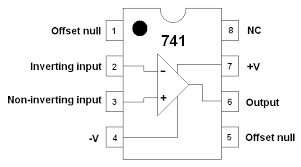

画像提供：Learning About Electronics

ここで扱うのは、主に5本のピンである。
オペアンプの回路記号は、下の図のように5本のピンを持つ三角形で表される。

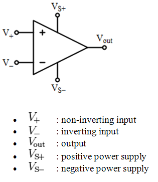

画像提供：Virtual Labs

オペアンプの用途は幅広く、各ピンの接続の仕方によって、次のような回路を組むことができる（これは網羅的な一覧ではない）。

- **コンパレータ（比較器）**
- 加算増幅回路のような**反転増幅回路**
- ボルテージフォロワのような**非反転増幅回路**
- **差動増幅回路**
- **微分回路**または**積分回路**
- **フィルタ**
- **ピーク検出回路**
- **アナログ-デジタル変換回路**
- **発振回路**

このチュートリアルを通じて、ゲイン、帯域幅、誤差、スルーレート、消費電流、出力振幅など、データシートに載っているような典型的なオペアンプの特性をどう測定するかを紹介していく。

## 理想オペアンプ

オペアンプは、入力端子（プラス側のv2とマイナス側のv1、パッケージのピン2とピン3にあたる）にかかる電圧の差を検出するように設計されている。
この差は*差動入力電圧*とも呼ばれる。
出力は、入力で検出された差にある値Aを掛けたもので、このAを**開ループゲイン**と呼ぶ。
オペアンプは電圧制御電圧源として振る舞い、これから実際にモデル化していく。
開ループ構成と**閉ループ**構成の両方の増幅回路をシミュレートする。

理想オペアンプは、次のような特性を持つ。

- **開ループゲイン**が無限大
- **入力抵抗**が無限大
- **出力抵抗**がゼロ
- **同相利得**がゼロ（つまり**同相除去比**が無限大）
- **帯域幅**が無限大
- **ノイズ**がゼロ
- 入力**オフセット**がゼロ

画像提供：Wikipedia

入力抵抗（Rin）が無限大であることから、キルヒホッフの法則を使って、(+)端子（v2）と(-)端子（v1）に流れる電流はゼロであると推論できる。
出力抵抗（Rout）がゼロであるため、出力での電圧損失もない。
上の図にあるひし形の電圧源は電圧制御電圧源と呼ばれ、この場合の電圧はゲイン（G）と入力端子間の差（Vin）を掛け合わせたものになる。
ゲインは通常、文献では（A）と表記され、出力に関する式は次のようになる。

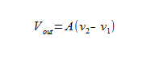

電圧制御電圧源をモデル化し、その振る舞いを理想オペアンプに近づけられるかどうか見てみよう。

[Modeling the Ideal Op Amp（理想オペアンプのモデル化）](https://www.youtube.com/embed/t8vR499dEg8/)

## 増幅回路とフィードバック

オペアンプは、単体で使うことを想定した部品ではない。
先ほどの理想オペアンプの動画では、単にVoutの式を確かめることで、なぜオペアンプが電圧制御電圧源と呼ばれるのかを示しただけである。
ここからは、**フィードバック**と**閉ループ**ゲイン、そしてその応用について見ていく。
フィードバックとは何だろうか。
フィードバックは、あるシステムの出力が、そのシステム自身の入力へ戻されるときに生じる。
フィードバックには正（再生的）と負（減衰的）の2種類がある。
フィードバックは、システムの次のような性質に影響を与えるために使われる。

- **ゲインの感度を下げる**：トランジスタに対する温度の影響のように、回路部品の値のばらつきに対してゲインの値が受ける影響を小さくする。
- **非線形歪みを減らす**：出力が入力に比例するようにする。
- **ノイズの影響を減らす**：出力に乗る望ましくない電気的な干渉（外部由来のものも、回路部品自体から生じるものも含む）を減らす。
- **入力抵抗・出力抵抗を制御する**：適切なフィードバック構成を選べば、入力抵抗と出力抵抗を制御できる。
- **増幅回路の帯域幅を広げる**：ここでは[ゲイン帯域幅積](https://ja.wikipedia.org/wiki/GB%E7%A9%8D)を意識しておく必要がある。帯域幅はある程度まで広げられるが、その代償としてゲインが犠牲になる。ゲイン帯域幅積は一定であり、周波数に対するオペアンプのゲインの振る舞いを表す。

### 単位についての補足

ゲインについて話すとき、これは出力と入力の比を取ったものである。
出力と入力の両方が電圧で表されている場合、単位はVolt/Voltになる。
`.ac`解析では、ゲインはデシベルで表される。次にその変換式を示す。

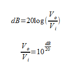

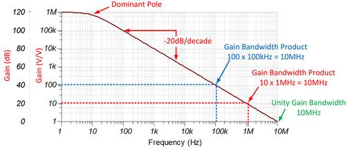

画像提供：Planet Analog

フィードバックにはすべて代償があり、その代償こそがゲインである。
負帰還は、ゲインを差し出す代わりに、より望ましい性質を手に入れる取引である。入力抵抗を大きくすることは、帯域幅を広げることにもつながる。

### 閉ループゲイン

開ループゲインとは異なり、閉ループゲインはフィードバックがあるために外部の回路構成に依存する。
とはいえ、一般的な形で表すことはできる。

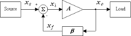

画像提供：<https://paginas.fe.up.pt/~fff/eBook/MDA/Teo_realim.html>

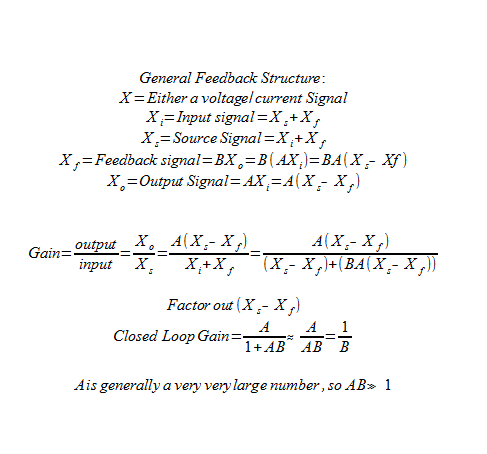

## 反転増幅回路

反転構成の一例は、1個のオペアンプと2個の抵抗R1、R2からなる。
R2は、オペアンプの出力端子から、反転（マイナス）端子へ接続される。
R2によって、オペアンプの周りにループが閉じられる。

[Inverting Amplifiers（反転増幅回路）](https://www.youtube.com/embed/yQur5HqCo_4/)

以下の動画では触れていないが、理想オペアンプを前提としているために*暗黙のうちに*成り立っていることとして、オペアンプ自体には電流が流れないという点がある。
R1を流れる電流（I1）は、そのままR2にも流れる。
もう一つ覚えておきたいのは、R1とR2が同じ値であれば、この回路は通常、-voutを+voutに変換する（位相を反転させる）ために使われるという点である。
これは単位ゲイン反転回路として知られている。

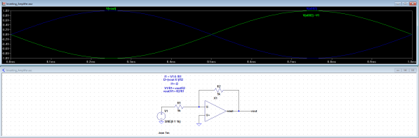

### プロジェクト：加算増幅回路

反転増幅回路の典型的な応用例が、加算増幅回路であり、オーディオミキシングで使われることから「バーチャルアースミキサー」とも呼ばれる。
手元にLM741のオペアンプがたくさんあったので、実際に加算増幅回路を組んでみることにした。
まずはLTspiceでモデル化した。

[Building a Summing Amplifier in LTspice（LTspiceで加算増幅回路を作る）](https://www.youtube.com/embed/ixMhM6GqHwo/)

[Testing the Summing Amplifier（加算増幅回路のテスト）](https://www.youtube.com/embed/m7FYMo3e_3c/)

## 非反転増幅回路

[Non-Inverting Amplifiers（非反転増幅回路）](https://www.youtube.com/embed/W8dQGPCW5cM/)

### ボルテージフォロワ

ボルテージフォロワは、非反転増幅回路のわかりやすい例である。
非常に高い入力インピーダンスという性質は、非反転構成ならではの望ましい特徴である。
ボルテージフォロワは、インピーダンスの高い信号源からインピーダンスの低い回路へつなぐ単位ゲインのバッファ増幅回路として使うことができ、駆動側の回路に負荷がかかる影響を避けるのに役立つ。

## 差動増幅回路

差動増幅回路は、入力にかかる2つの信号の差に反応し、両方の入力に共通する信号は除去する。

### オペアンプ1個による差動増幅回路

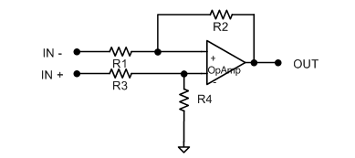

非反転増幅回路のゲインは正の値であり、次の式で表されることを思い出してほしい。

そして反転増幅回路のゲインは負の値であり、次の式で表される。

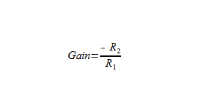

この2つのトポロジーを組み合わせることで、2つの入力信号の差を得られる回路の設計に近づいていく。
これを実現するには、まずそれぞれのゲインの大きさ（常に正の値となる絶対値と考えてほしい）をそろえる必要がある。
プラス側の経路のゲインを(1 + R2/R1)から(R2/R1)へ減衰させることで、ちょうどそれを実現できる。
これで抵抗が4個になったが、ゲインをそろえるには、抵抗の比が重要になる。

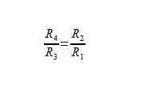

この回路の問題は、高いゲインを得るためにはR1を比較的小さくする必要があるという点である。
これによって入力抵抗が下がってしまう。
もう一つの問題は、この増幅回路のゲインを変化させるのが容易ではないという点である。
どちらの問題も、計装アンプを使うことで解決できる。
オペアンプを3個使うことで、精密に調整された差動増幅回路を作ることができる。
オペアンプ1個では入力抵抗が低くなる問題があったので、それぞれの入力にボルテージフォロワ（バッファ）を追加する。
さらに都合がよいことに、このバッファ自体にゲインを持たせることもでき、2段目の差動増幅回路にかかる負担を軽くできる。

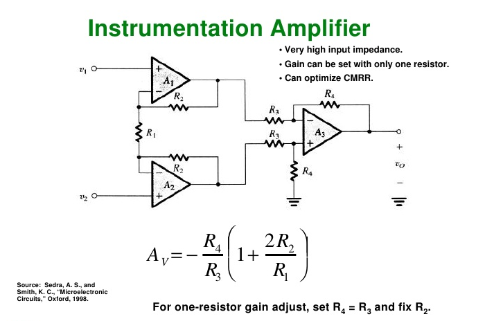

計装アンプは、反転増幅回路と非反転増幅回路を縦続接続するという、ここまでの内容を見事に組み合わせたものである。

このチュートリアルでは、積分回路、微分回路、発振回路、AD変換回路までは扱わない。
コンデンサやインダクタを回路に加え始めると、計算は抵抗ではなくインピーダンスを使ったより専門的で一般化されたものになる。
これらは別のチュートリアルで扱うことにする。

## 性能特性

[LM386オーディオアンプ](http://www.jameco.com/Jameco/Products/ProdDS/839826.pdf)のデータシートを見ると、そのオペアンプの特性を表す数多くのパラメータが載っている。
これらの多くは、LTspiceでのシミュレーションによって確かめることができる。
そこにたどり着く前に、まずはいくつかの特性を定義しておこう。

### 同相除去比（CMRR）

[同相除去比（CMRR）](http://www.analog.com/media/en/training-seminars/tutorials/MT-042.pdf)は、両方の入力に共通する信号のうち、増幅されない成分の量を測る指標である。
同相利得は非常に低い、つまりCMRRは非常に高いことが望ましい。

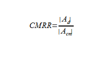

同相除去比は、差動ゲインの絶対値と同相ゲインの絶対値の比である。
差動ゲインは、たいていメーカーが定めたMOSトランジスタの本来のゲインの半分程度になる。
出力抵抗の高いオペアンプほど、優れたCMRRを持つ傾向がある。

### 電源電圧除去比（PSRR）

[電源電圧除去比（PSRR）](http://pallen.ece.gatech.edu/Academic/ECE_6412/Spring_2003/L180-PSRR-2UP.pdf)は、電源のリップルがオペアンプの出力電圧にどれだけ影響を与えるかを測る指標である。
MOSFETデバイスでは、デジタル回路のスイッチングによって電源リップルが増えやすい混載信号ICに搭載されることが多いため、PSRRが重要になる。
設計において絶対に避けたいのは、そのリップルがオペアンプによって増幅されてしまうことである。

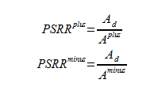

ここで押さえておきたいのは、電源のリップルの影響を最小限に抑えるには、オペアンプに大きなPSRRが求められるということである。
今後のプロジェクトでデータシートを見るときは、この点を意識しておくとよい。

### スルーレート

スルーレートとは、オペアンプの出力で起こりうる最大の変化速度を指す。
たいていのオペアンプはスルーレートによって制限されており、これはオペアンプの出力電圧を時間で微分した値の最大値として計算される。

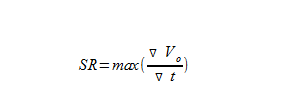

### 全高調波歪率（THD）

オーディオアンプの役割は、小さな信号を受け取り、増幅すること以外の変化を加えずに増幅することである。
これは難しい作業である。というのも、望ましくない信号（リップルなど）まで、目的の信号と一緒に増幅されてしまうことがあるからである。
線形性からのずれは、すべて歪みとみなされる。
[高調波歪み](http://hyperphysics.phy-astr.gsu.edu/hbase/Audio/amp.html#c3)は、オーディオ回路でよく見られる歪みの一種で、出力信号のピークが「クリップ」されることによって生じる。
[THD](http://www.analog.com/en/analog-dialogue/articles/confused-about-amplifier-distortion-specs.html)として示されるパーセンテージは低いほどよいが、ある程度を下回ると人間の耳にはほとんど知覚できなくなる。

[Measuring Total Harmonic Distortion, Part 1（全高調波歪率の測定・前編）](https://www.youtube.com/embed/A2W6qUtOFsQ/)

[Measuring Total Harmonic Distortion, Part 2（全高調波歪率の測定・後編）](https://www.youtube.com/embed/VyCKsGFKbnc/)

## LM386オーディオアンプ

「シミュレートし、確かめ、作る」というのが筆者のモットーである。
今回のミニポータブルギターアンプのプロジェクトでは、少しやりすぎてしまった。
LTspiceにインポートできるモデルが見つからなかったため、ゼロから作ることにしたのである。
下のボタンから、これから紹介するプロジェクトファイルをダウンロードできる。
[LM386](http://www.jameco.com/Jameco/Products/ProdDS/839826.pdf)をベースにしたオペアンプを設計したが、BJTの代わりにMOSFETを使っている。
実際、この設計は元にしたLM386よりもわずかに優れた性能になったが、動作するのは2〜6Vの範囲に限られる。
筆者のLM386モデルは、実際のプロジェクトで使った部品とまったく同じというわけではないが、オペアンプの電気的特性を確認し、LTspiceに慣れるという目的には十分実用的である。

### プロジェクト：ミニポータブルギターアンプ

LM386と最小限の追加部品を使い、ギターのケースに収まる小さな電池駆動のアンプを作った。
製作費用はおよそ5ドルで、組み立てには1時間もかからなかった。
回路は、データシートのアプリケーション例（ゲイン200）からそのまま採用した。

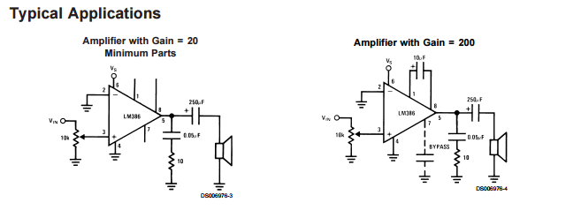

変更したのは出力コンデンサだけである。
手元に250µFのコンデンサがなかったので、470µFに置き換えた。
また、ギターケーブル用の6.35mm（1/4インチ）モノラルオーディオジャックと、動作確認用のステータスLEDも追加した。
筆者のギターケースにはケーブルやピックを収納する小さなスペースがあったので、そこにアンプを組み込んだ。

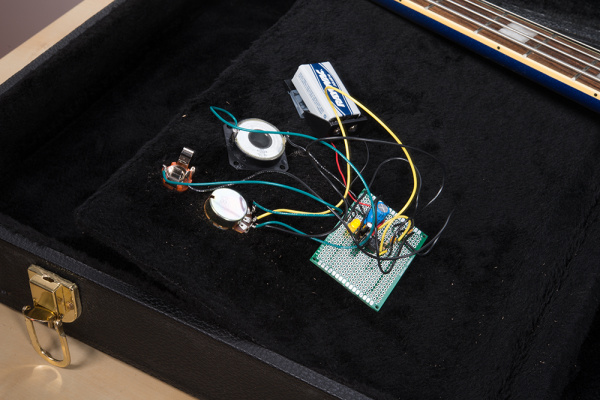

回路図：

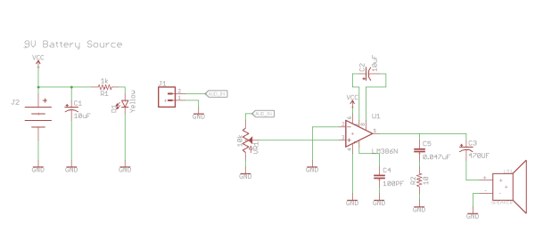

注：J1は6.35mm（1/4インチ）のモノラルオーディオジャックのメス端子である。

実際に動作している様子：

[Mini Portable Guitar Amplifier in Action（ミニポータブルギターアンプの動作例）](https://www.youtube.com/embed/CD7LFcF5WD8/)

## まとめ

### バーチャルオペアンプラボ

Music from Outer Spaceの制作者であるRay Wilson氏が作った[MFOS Virtual Operational Amplifier Application](http://musicfromouterspace.com/index.php?MAINTAB=SYNTHDIY&PROJARG=ELECTRONICS/TECHBENCH/TECHBENCH.php?a=a&VPW=1910&VPH=759)を使うと、シミュレートされたオシロスコープで出力を見ながらオペアンプを試すことができる。

> [!NOTE]
> 注：リンク先でOperational Amp Applicationが見つからないと表示された場合は、ページ上部の「Synth-DIY」タブをクリックすると正しく表示されるはずである。あるいは、左側のメニューから「MFOS In The Classroom」を検索し、「Virtual Op Amp Lab」を選んでもよい。

### Music From Outer Space

DIYシンセサイザーに興味はあるが、何から始めればよいかわからない人には、[Music From Outer Space](http://musicfromouterspace.com/index.php?MAINTAB=HOME&VPW=1024&VPH=795)がおすすめである。Ray Wilson氏が設計した数百点もの回路図が公開されている。

### ホビイスト向け

アナログ電子工作を始めたばかりの人には、[Forrest Mims氏のEngineer's Mini Notebooks](http://www.barnesandnoble.com/w/books/1112118640)を強くおすすめする。

### CMRRの測定

EE Timesに、同相除去比と差動増幅回路についての[素晴らしい記事](http://www.eetimes.com/document.asp?doc_id=1230785)が掲載されている。

タグ: オーディオ、部品、概念、電気工学、ツール

---

出典：[Introduction to Operational Amplifiers with LTSpice](https://learn.sparkfun.com/tutorials/introduction-to-operational-amplifiers-with-ltspice)（SparkFun Learn）を日本語に翻訳し、再構成した。
原文は [CC BY-SA 4.0](https://creativecommons.org/licenses/by-sa/4.0/) ライセンスで公開されており、本ページも同ライセンスの下で提供する。
