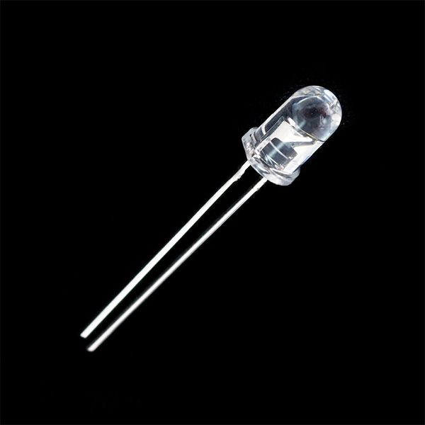
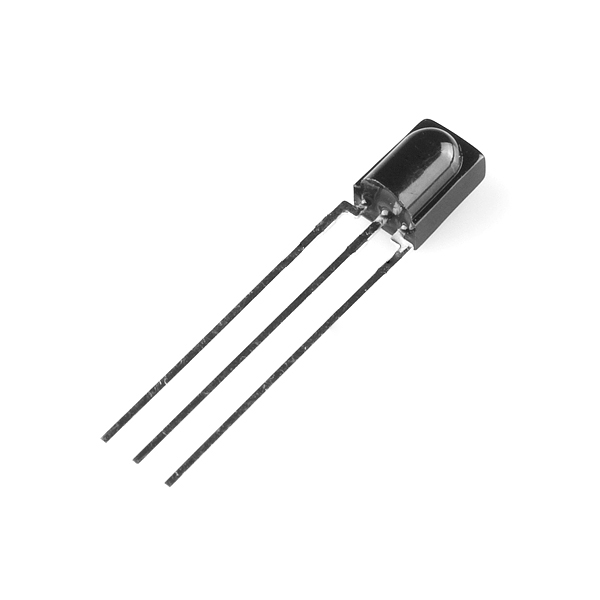
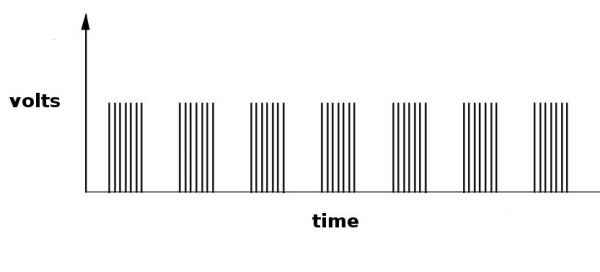
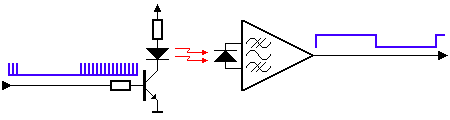
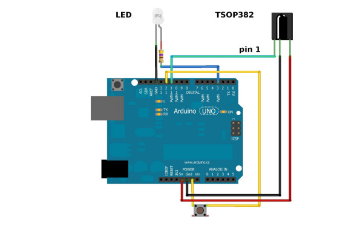
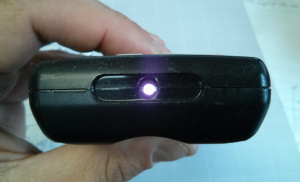
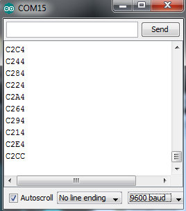
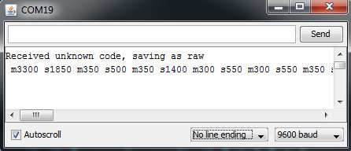

# 赤外線通信

 

*送信用赤外線LED（左）と受信用赤外線フォトセンサー（右）*

IR、つまり[赤外線](./light.md)通信は、一般的で安価、かつ扱いやすい無線通信技術である。
赤外線は可視光と非常によく似ているが、[波長がわずかに長い](./light.md)という違いがある。
つまり赤外線は人間の目には見えないということであり、これが無線通信にうってつけの性質になっている。
たとえばテレビのリモコンのボタンを押すと、赤外線LEDが1秒間に38,000回のペースでオンとオフを繰り返し、音量やチャンネルの操作といった情報をテレビの赤外線フォトセンサーに送信する。

このチュートリアルでは、まず一般的な赤外線通信プロトコルの内部の仕組みを説明する。
そのあとで、Arduinoを使って赤外線データを送受信する2つの例を紹介する。
最初の例では、TSOP382赤外線フォトセンサーを使って、一般的なリモコンから届く赤外線データを読み取る。
次の例では、赤外線LEDからデータを送信して、ホームステレオのような一般的な家電機器を制御する方法を紹介する。

### 必要なソフトウェア

こまごまとした信号処理はすべて、Ken Shirriffによって書かれた優れた[Arduinoライブラリ](https://github.com/shirriff/Arduino-IRremote)が処理してくれるため、赤外線データを簡単に送受信できる。
このライブラリの仕組みについてさらに詳しく知りたい場合は、Ken Shirriffのブログ記事「A Multi-Protocol Infrared remote Library for the Arduino」を参照してほしい。
また、このチュートリアルで使うサンプルコードは、そのライブラリのexamplesディレクトリの中にある。

参考になるチュートリアル:

このチュートリアルで扱う概念には、次のようなものがある。

- [Installing Arduino Library（Arduinoライブラリのインストール）](https://learn.sparkfun.com/tutorials/installing-an-arduino-library)
- [回路図の読み方](./how-to-read-a-schematic.md)
- [光](./light.md)
- [Pulse Width Modulation（パルス幅変調、PWM）](https://learn.sparkfun.com/tutorials/pulse-width-modulation)
- [発光ダイオード（LED）](./light-emitting-diodes-leds.md)
- [はんだ付けの基本（スルーホール編）](./how-to-solder-through-hole-soldering.md)

## 赤外線通信の基礎

[赤外線](./light.md)は、単に私たちの目に見えない光であり、これが通信にとって好都合な理由である。
赤外線の発生源は私たちの周りのいたるところにある。
太陽、電球、あるいは熱を持つあらゆるものは、赤外線のスペクトルにおいて非常に明るい。
テレビのリモコンを使うとき、赤外線LEDがテレビに情報を送信するために使われている。
では、テレビの赤外線受信機は、周囲のあらゆる赤外線の中から、どうやってリモコンからの信号を選び出しているのだろうか。
答えは、赤外線信号が変調されているからである。
信号を変調するとは、データに一定のパターンを割り当てることであり、これにより受信側はどれを聞き取ればよいか分かるようになる。

赤外線通信でよく使われる変調方式は、38kHz変調と呼ばれるものである。
38kHzの信号のような規則性を持つ自然の光源はほとんど存在しないため、その周波数でデータを送る赤外線送信機は、周囲の赤外線の中でも際立つことになる。
38kHzで変調された赤外線データがもっとも一般的だが、他の周波数が使われることもある。

リモコンのボタンを押すと、送信用の赤外線LEDが1秒足らずの間、非常に速く点滅し、符号化されたデータを機器へ送信する。



もしテレビのリモコンの赤外線LEDに[オシロスコープ](https://ja.wikipedia.org/wiki/オシロスコープ)をつなげば、上のような信号が見えるはずである。
この変調された信号こそ、受信側のシステムが実際に目にしているものである。
とはいえ、受信機器の役目は、この信号を復調し、マイクロコントローラが読み取れる2値の波形として出力することである。
先ほどの波形をTSOP382のOUTピンで読み取ると、次のような波形が見えるはずである。


送信される変調信号どうしの間隔を制御することで、この波形はマイクロコントローラの入力ピンで読み取り、シリアルなビット列として復号できるようになる。

赤外線の送受信ペアがどのように機能するかを概念的に示した図を以下に示す。



Arduinoやその他のマイクロコントローラは、このシステムのどちらの側にも接続でき、データを送信すること（左側）も、受信すること（右側）もできる。

## ハードウェアの接続

このチュートリアルのハードウェアには、次のようなものが必要である。
手元にあるものによっては、すべてが必要ではないかもしれない。

- Arduino Uno
- 赤外線LED
- TSOP382赤外線受信機
- 小型プッシュボタンスイッチ
- 330Ω抵抗器
- 赤外線キーチェーンリモコン、あるいは38kHz変調を使う任意の赤外線リモコン

> [!NOTE]
> 赤外線リモコンの代わりに、38kHz変調を使う任意の赤外線リモコンを使うこともできる。

Arduinoを使った2つの別々の回路を組み立てることになる。
最初の例の回路では、[TSOP382](http://www.sparkfun.com/datasheets/Sensors/Infrared/tsop382.pdf)赤外線フォトセンサーを使って、一般的なリモコンからの赤外線信号を受信して復調する。
2つ目の例の回路では、950nmの赤外線LEDと[電流制限抵抗](./resistors.md)を使って、ホームステレオやテレビのような一般的な家電機器に赤外線コードを送信する。

### 回路図

Arduinoへの接続に必要な、完全なセットアップは次のとおりである。



LEDを正しく接続すること。長いほうの脚が正極であり、抵抗器を経てArduinoの出力ピンに接続する。
短いほうの脚が負極であり、グラウンド（GND）に接続する。

また、赤外線は可視スペクトルの外にあるため、赤外線LEDの光を目で見ることはできない。
とはいえ、たいていの携帯電話のカメラは短波長の赤外線を検知できるため、LEDがかすかに光っているのを見ることができる。



また、TSOP382の極性にも注意しよう。
センサーのピン配置については、[TSOP382のデータシート](http://www.sparkfun.com/datasheets/Sensors/Infrared/tsop382.pdf)を参照してほしい。

LEDに接続する電流制限抵抗は、最大出力と最長の通信距離を得るには100Ω（40mA）程度まで下げることができる。
より大きな抵抗値を使うと、LEDはそれほど明るく光らず、通信距離も短くなる。
330Ωの抵抗であれば、薄暗い部屋の中でも赤外線LEDを問題なく動作させられるはずである。

## ライブラリの概要

> [!NOTE]
> この例は、パソコン上で最新版のArduino IDEを使っていることを前提としている。Arduinoを使うのが初めてであれば、Arduino IDEのインストールについてのチュートリアルを確認してほしい。Arduinoライブラリをインストールしたことがなければ、インストールガイドも確認してほしい。

### Ken ShirriffのIRremoteライブラリをダウンロードしてインストールする

ArduinoにすばやくIR制御機能を追加するには、Ken ShirriffのIRremoteライブラリをダウンロードすることをおすすめする。
Shirriffは、赤外線リモコン用のライブラリを書いている。
このライブラリはArduino Library Managerから入手できる。
**IRremote by shirriff**で検索すれば、最新版をインストールできるはずである。
手動でライブラリをダウンロードしたい場合は、[GitHubリポジトリ](https://github.com/shirriff/Arduino-IRremote)から入手できる。

ライブラリのインストールについて助けが必要な場合は、[Installing an Arduino Library](https://learn.sparkfun.com/tutorials/installing-an-arduino-library)のチュートリアルを確認してほしい。
ダウンロードしたフォルダを、Arduinoのスケッチブック内の「libraries」フォルダに展開する必要がある。

> [!NOTE]
> 警告：「libraries」フォルダにコピーするフォルダの名前は、必ず「IRremote」にすること。ディレクトリ名にハイフン（-）が含まれていると、コードのコンパイル時にエラーが起きることがある。

IRremoteライブラリは、プロジェクトに赤外線機能を追加するための強力な道具である。
家電機器に赤外線コードを送信したい場合も、リモコンからArduinoへ赤外線コードを受信したい場合も（あるいはその両方でも）使うことができる。
ここでは、このライブラリでできる簡単なことをいくつか紹介する。
さらに詳しい使い方については、[Ken Shirriffのブログ](http://www.righto.com/2009/08/multi-protocol-infrared-remote-library.html)を参照してほしい。

## 赤外線を受信する例

赤外線リモコンは、対応する家電機器と同じくらいありふれた存在である。
使わなくなった古いリモコンたちを、次のプロジェクトで活用できるとしたらどうだろうか。
この例では、TSOP382赤外線受信機とArduinoを使って、任意の赤外線リモコンからコードを読み取る方法を紹介する。
個々のボタン操作からコードを受信できるようになれば、リモコンとArduinoは汎用の近距離通信インターフェースになる。

*この例で必要なのは、Arduinoに接続した[TSOP382赤外線受信機](http://www.sparkfun.com/datasheets/Sensors/Infrared/tsop382.pdf)と一般的なリモコンだけである。赤外線LEDとボタンは接続したままでよいが、次の例まで使うことはない。*

まず、IR用のArduinoライブラリをインストールする必要がある。
Arduinoライブラリのインストール方法については、[Installing an Arduino Library](https://learn.sparkfun.com/tutorials/installing-an-arduino-library)のチュートリアルを参照してほしい。

IRライブラリを入手したら、Arduinoのプロジェクトディレクトリに移動する。**Arduino/libraries/IRremote/examples/IRrecvDemo**を開き、*IRrecvDemo.ino*を開く。
このスケッチをArduinoに書き込む。

このスケッチは、使っているリモコンの種類を自動的に判別し、どのボタンが押されたかを識別する。
Arduino IDEで[シリアルポート](./terminal-basics.md)を**9600bps**で開き、リモコンのさまざまなボタンを押してみよう。



特定のボタンが押されたとき、その受信値を使ってコードの中で何か別のこと（モーターやLEDのオンオフなど）を行うことができる。

それぞれのボタン操作の結果は、`value()`メソッドを呼び出すことで取得できる。

```cpp
results.value
```

その値をターミナルウィンドウに出力することもできる。

```cpp
Serial.println(results.value, HEX); // ボタン操作の16進数の値を表示する
```

あるいは、条件分岐を実行するためにその値を読み取る必要があるかもしれない。

```cpp
if (irrecv.decode(&results)) // コードを受信したかどうかを確認する
{
    if (results.value == 0xC284) // ボタン操作が16進数の0xC284と一致する場合
    {
        // ここで何か処理を行う
    }
    irrecv.resume(); // 次の値を受信する
}
```

## 赤外線を送信する例

この例では、Arduinoと赤外線LEDを使って赤外線リモコンを模倣し、家電機器（テレビやステレオなど）を制御する。
LEDで家電機器を制御するには、その機器がどの種類の赤外線プロトコルを使っているかを知る必要がある。
これを知るもっとも簡単な方法は、その機器に付属しているリモコンを手元に用意することである。
この例では、[TSOP382赤外線受信機](http://www.sparkfun.com/datasheets/Sensors/Infrared/tsop382.pdf)でリモコンのボタン操作を受信し、そのデータをコピーして、赤外線LEDから送信する。

*この例では、LEDとTSOP382の両方を使う。*

まだの場合は、まずIR用のArduinoライブラリをインストールする。
Arduinoライブラリのインストール方法については、[Installing an Arduino Library](https://learn.sparkfun.com/tutorials/installing-an-arduino-library)のチュートリアルを参照してほしい。

IRremoteライブラリを入手したら、Arduinoのプロジェクトディレクトリに移動する。**Arduino/libraries/IRremote/examples/IRrecord**を開き、*IRrecord.ino*を開く。
このスケッチをArduinoに書き込む。

スケッチを書き込んだら、Arduinoのシリアルモニタを**9600bps**で開く。
リモコンをTSOP382に向けて、ボタンを押してみよう。
ターミナルウィンドウに、押したボタンに対応する特定のコードが表示されるはずである。



今度は、LEDを対象の家電機器に向けて、Arduinoに接続したプッシュボタンを押してみると、リモコンのボタン操作に対応するコードが送信される。
どのコードがどのボタンに対応しているかが分かれば、Arduinoと赤外線LEDを使って独自のリモコンを作ることができる。

たとえば、送信の例の回路では、私のPanasonicリモコンの音量アップボタンを押したときに未知のコードを受信した。
2行目のデータバイトは、音量アップコマンドのマークとスペースのタイミングとして表示された生のコードである。

未知のコードを受信し、それを送信したい場合は、Arduinoのスケッチの中で次の行を使う。

```cpp
irsend.sendRaw(rawCodes, codeLen, 38);
```

家電機器のリモコンを持っていない場合や、幸運にも一般的なプロトコルを使うリモコンを持っている場合は、IRremoteライブラリの*IRSendDemo.ino*の例にあらかじめ用意されているメーカーコードを試してみることもできる。

たとえば、ソニー製のテレビを持っていて、LEDでテレビの電源をオンオフしたい場合は、次のようなコードを使うことができる。

```cpp
for (int i = 0; i < 3; i++)
{
    irsend.sendSony(0xa90, 12); // ソニーテレビの電源コード
    delay(40);
}
```

家電機器のメーカーによって、コマンドを送るプロトコルは異なる。
そのため、このライブラリを使うには機器のメーカーを指定する必要がある。
また、ソニーのコマンドは`for()`ループを使って3回送信する必要があることにも注意してほしい。
どのプロトコルにもそれぞれ細かい癖がある。
一般的な赤外線プロトコルの非公式なコマンドについては、San BergmansのWebサイトが優れた参考資料になる。

一般的な赤外線プロトコルとして、IR用Arduinoライブラリは、NEC、Sony SIRC、Philips RC5、Philips RC6、そして生データ形式に対応している。
それぞれのメーカー向けにArduinoのコードで使えるメソッドは次のとおりである。

```cpp
void sendNEC(unsigned long data, int nbits);
void sendSony(unsigned long data, int nbits);
void sendRC5(unsigned long data, int nbits);
void sendRC6(unsigned long data, int nbits);
void sendDISH(unsigned long data, int nbits);
void sendSharp(unsigned long data, int nbits);
void sendPanasonic(unsigned int address, unsigned long data);
void sendJVC(unsigned long data, int nbits, int repeat);
void sendRaw(unsigned int buf[], int len, int hz);
```

`data`と`nbits`のフィールドには、使用しているプロトコルに固有の情報を入力する必要がある。
この機能の使い方についてさらに詳しくは、IR用ArduinoライブラリのブログのSending libraryの詳細についての節を参照してほしい。

**もっとパワーが欲しい場合は？** 赤外線LEDは素晴らしい部品である。赤外線受信機と組み合わせれば、リモコン制御や、基本的な遠隔データ通信にも使える。
唯一の問題は、Arduinoではその全性能を引き出せないという点である。
LEDの送信距離は最適とは言えないかもしれない。
Arduinoの出力ピンから取り出せる電流は最大でおよそ30mA程度である。
つまりLEDは、フルパワーである50mAでは駆動できないということである。
これにより、送信距離が短くなってしまう。

## まとめ

赤外線LEDや受信機についてのさらなる資料やリソースを探しているなら、次のようなリンクを確認してみてほしい。

- [950nm Infrared LED（データシートPDF）](http://cdn.sparkfun.com/datasheets/Components/LED/YSL-R531FR1C-F1.pdf)
- [TSOP38238 IR Receiver Module（データシートPDF）](http://www.sparkfun.com/datasheets/Sensors/Infrared/tsop382.pdf)
- [Wikipedia: Infrared（赤外線についてのWikipedia記事）](https://en.wikipedia.org/wiki/Infrared)
- [SB-Projects: IR Remote Control Theory（赤外線リモコンの理論）](https://www.sbprojects.net/knowledge/ir/index.php)
- [IRremote Library（IRremoteライブラリのGitHubリポジトリ）](https://github.com/shirriff/Arduino-IRremote)

これで、自分だけの赤外線通信システムを作る準備が整ったはずである。
この目に見えない変調光源で、何を制御してみたいだろうか。
アイデアが必要なら、次のようなチュートリアルも確認してみてほしい。

- [光](./light.md)
- [Illuminate（イルミネート）](http://www.sparkfun.com/tutorials/282)：廃盤
- [TV-B-Gone](https://www.tvbgone.com/)
- [LED Light Bar Hookup（LEDライトバーの使い方）](https://learn.sparkfun.com/tutorials/led-light-bar-hookup)：*見える*光がもっと欲しいなら、このLEDライトバーは特に明るい選択肢である
- [Using the OpenSegment（OpenSegmentの使い方）](https://learn.sparkfun.com/tutorials/using-opensegment)：視認できる表示器という点では、OpenSegmentの4桁7セグメントディスプレイも、プロジェクトにデータ表示を追加する手軽な道具である
- [Rebuilding the Illumitune（Illumituneの再構築）](https://news.sparkfun.com/666)：Illumituneプロジェクトの再構築に、どのように赤外線を組み込んだかを学べる
- [Laser Limbo（レーザーリンボー）](https://www.edn.com/laser-limbo/)：赤外線LEDと赤外線受信機を使って「レーザー」リンボーを作ろう
- [IR Control Kit Hookup Guide（赤外線コントロールキットの使い方）](https://learn.sparkfun.com/tutorials/ir-control-kit-hookup-guide)：IR Control Kitに含まれる赤外線受信機と送信機を最大限に活用する方法
- [Boss Alarm（ボスアラーム）](https://learn.sparkfun.com/tutorials/boss-alarm)：誰かがオフィスに入ってきたことを知らせ、自動的にパソコンの画面を切り替えるボスアラームを作る
- [Roshamglo Hookup Guide（Roshamgloの使い方）](https://learn.sparkfun.com/tutorials/roshamglo-hookup-guide)：Roshamgloバッジを使い始めるために必要なことをすべて解説する
- [Roshamglo Project: TV-B-Gone（Roshamgloプロジェクト：TV-B-Gone）](https://learn.sparkfun.com/tutorials/roshamglo-project-tv-b-gone)：Roshamglo基板を（ほぼ）万能なテレビの電源ボタンに変える

タグ: Arduino、通信、接続ガイド、光、技術、無線

---

出典：[IR Communication](https://learn.sparkfun.com/tutorials/ir-communication)（SparkFun Learn）を日本語に翻訳し、再構成した。
原文は [CC BY-SA 4.0](https://creativecommons.org/licenses/by-sa/4.0/) ライセンスで公開されており、本ページも同ライセンスの下で提供する。
