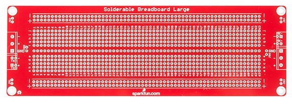
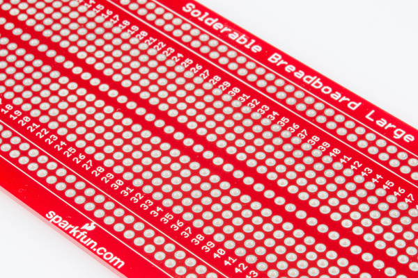
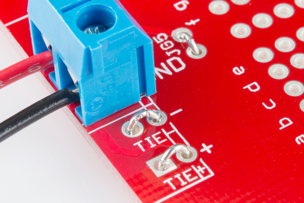
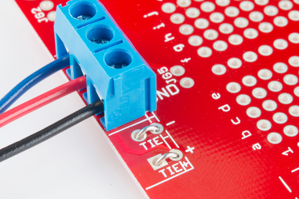
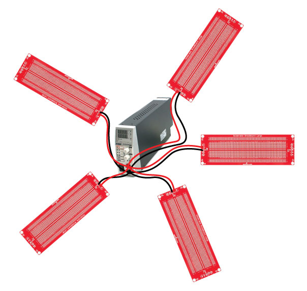
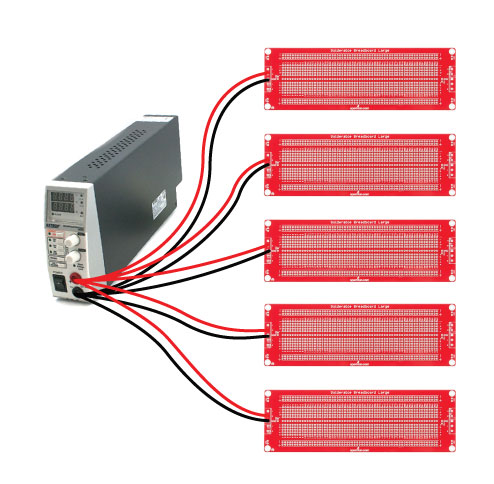

# はんだ付け対応ブレッドボードの使い方

はんだ付け不要のブレッドボードは試作にとても便利である。
しかし、機械的な頑丈さという点では今ひとつである。
どこかしらのパーツが、いつも緩んでしまうものである。
同じ配線パターンを持つはんだ付け対応の基板を使えば、専用のPCBを設計しなくても、試作をより頑丈な形にすることができる。

一見すると、[はんだ付け対応の大型ブレッドボード](https://www.sparkfun.com/products/12699)は、通常の[はんだ付け不要の大型ブレッドボード](https://www.sparkfun.com/products/112)と同じ穴の配置になっている。
しかし、よく見てみると、はんだ付け不要の基板からの移行をスムーズにするための、いくつかの追加機能があることに気づくはずである。

このチュートリアルでは、このはんだ付け対応ブレッドボードの特徴を紹介し、もっとも基本的な使い方を示したうえで、より高度な使用例も紹介する。

参考になるチュートリアル:

- [ブレッドボードの使い方](./how-to-use-a-breadboard.md)
- [配線の基本](./working-with-wire.md)
- [回路とは何か](./what-is-a-circuit.md)

## 概要

これまで長年にわたって、似たようなはんだ付け対応ブレッドボードをいくつも使ってきたが、そのほとんどには物足りなさが残っていた。
よくあるものは、もろいフェノール樹脂製のPCB素材でできている。
銅の配線パターンは薄く、接着も弱いため、基板をやり直すと剥がれてしまいがちである。
そしてもっとも問題なのは、配線パターンがはんだ付け不要のブレッドボードと必ずしも一致していない点である。電源レールの位置が合わなかったり、中央部が5つ穴ではなく4つ穴になっていたりする。
回路をはんだ付け基板に移すには、余計な変換作業が必要になっていた。

この大型のはんだ付け対応ブレッドボードは、こうした問題を解決するために作られている。
本物のFR4ガラス繊維基板であり、ソルダーマスクとめっきスルーホールを備え、レイアウトははんだ付け不要のブレッドボードの接続をそのまま再現している。

このブレッドボードの中央部は、はんだ付け不要のブレッドボードと同じ接続パターンを再現しており、0.3インチ間隔で5つ穴が2列並んだ構成になっていて、DIP ICを取り付けられるようになっている。
対応するはんだ付け不要の基板と同じく、このはんだ付け対応の基板にも63列ある。
行と列の座標ラベルは、はんだ付け不要のブレッドボードと一致している。

はんだ付け不要のブレッドボードと比べて、このはんだ付け対応の基板は電源の配線方法にも柔軟性がある。

### 電源についての基礎知識

一般的な電源は、接続された回路にいくつかの電圧を供給する。
それぞれの電圧は**レール**と呼ばれることが多い。
必要な電源レールの数と、それぞれのレールが供給する電圧は、実際に使う回路の種類によって異なる。

- まず、どの電源にも「グラウンド」レールがある。グラウンドは0Vの基準点として使われ、他の電圧はこの基準点を基に測定される。実際に大地に接続されているとは限らない。
- 長年にわたり、デジタル回路は単一の5Vレールを使ってきた。近年ではより低い供給電圧、主に3.3V、時にはさらに低い1.8Vなどが一般的になっている。
- アナログ設計では、正負が対になったバイポーラ電源がよく使われ、正と負の鏡像のようなレールを供給する。±12Vや±15Vがよく使われる。
- *ミックスドシグナル*設計は、アナログとデジタルの両方のセクションを含み、それぞれの供給電圧の要件を併せ持つ。よい例がパソコンの電源であり、デジタルロジック用に3.3Vと5Vを、ディスクドライブのモーターや冷却ファンのようなもの用に±12Vを供給している。

はんだ付け不要のブレッドボードでは、たいてい基板の両端に沿って1組ずつの電源レールがある（ただし、途中で分断されていて完全には連続していないこともある）。
これらはたいてい「＋」「－」の記号が付けられ、赤と青の色分けがされていることもある。
ブレッドボード自体は、レールがどう使われるかについて何も想定していない。電圧をレールに供給するのは利用者の役目である。

それでは、このブレッドボードの電源レールをどう設定するかを見ていこう。

> 「rail」という用語の由来を確実に特定するのは難しいが、1880年代にさかのぼる、電気鉄道に電圧を供給するための「第三軌条（サードレール）」の用法に由来していると考えられる。

## 任意のジャンパー

追加の設定をしなければ、この基板には基板の長さ全体にわたって伸びる5本の配線パターンがある。
そのうち4本は、基板の上端と下端にある「＋」と「－」の配線であり、はんだ付け不要の基板の対応する箇所を再現している。
5本目の配線パターンは基板中央の「溝」に沿って伸びており、グラウンドとして使うことを意図している。

これらの5本の配線パターンは、基板の両端にある5ピンの5mmネジ端子とつながっている。
端子の並び順は、基板を横切る配線パターンの並び順と一致している。
下の図のように、一番上のネジ端子のピンは上側の「－」レールに、その次のネジ端子は上側の「＋」レールに、というようにつながっている。

この基板は、配線用のジャンパーを使うことで、さまざまな電圧レールの組み合わせに対応できるようになっている。

ジャンパーは次のとおりである。

- JG1、JG2、JG3、JG4は、取り付け穴をグラウンドの配線パターンに接続するために実装できる。基板を金属製の筐体に取り付ける場合、筐体をグラウンドに落とし、回路のグラウンドを筐体に結線しておくのがよい習慣である。
- JG5とJG6は、基板の端にある「－」レールを、基板中央のグラウンド配線に接続するために使える。
- TIE＋とTIE－は、それぞれ基板の両側にある「＋」レールどうし、「－」レールどうしを接続する。はんだ付け不要のブレッドボードと同じく、これらはデフォルトでは接続されていないが、この基板ではそれらを簡単につなげられるようになっている。

この基板は、電源接続用の5mmネジ端子も取り付けられるようになっており、レールの構成に合わせて実装できる。
ネジ端子よりもしっかりした接続を好む場合は、パッドに配線を直接はんだ付けすることもできる。

電源の接続部とジャンパーは、基板の両端にそれぞれ用意されている。
たいていの用途では、どちらか一方の端の接続だけを使えば十分である。

## いくつかの例

### 単一の電源レールを持つデジタル回路

単一の電源レール（たいてい3.3Vまたは5V）を使うデジタル回路を組む場合は、次のように接続する。

- TIE＋とTIE－のジャンパーをブリッジする。
- JG5またはJG6のジャンパーをブリッジする。
- 2極の5mmネジ端子を取り付ける（上の図のとおり）。
  - 赤い配線が供給電圧である。
  - 黒い配線がグラウンドである。

部品を取り付ける際は、どちらかの「＋」レールから供給電圧を、「－」レールまたは中央のグラウンド配線からグラウンドを取ることができる。

### バイポーラレールを持つアナログ回路

バイポーラ電源を使うアナログ回路の場合は、次のようにジャンパーを設定する。

- TIE＋とTIE－のジャンパーをブリッジする。
- 3極の5mmネジ端子を取り付ける（上の図のとおり）。
  - 赤い配線が「＋」の供給電圧である。
  - 青い配線が「－」の供給電圧である。
  - 黒い配線がグラウンドである。

部品は、どちらかの「＋」レールから正の供給電圧を、どちらかの「－」レールから負の供給電圧を、そして中央の配線からグラウンドを取ることができる。

### 複数の基板を使う場合

この基板を複数使ってより大きな回路を組む場合、それらの基板で1つの電源を共有することができる。
もっとも一般的な構成は「スター型電源配電」として知られている。
電源をシステムの中心に据え、それぞれの基板を電源に直接接続する。

シンプルに描き直すと、次のようになる。

この構成では、電源とそれぞれの基板の間が直接つながる。

## まとめ

この基板を手元に置いておくだけで、何かをはんだ付けしたくなってくる。
小さな試作には、[30行のはんだ付け不要ブレッドボード](https://www.sparkfun.com/products/12002)と組み合わせて使える小型版の[中型はんだ付け対応ブレッドボード](https://www.sparkfun.com/products/12070)もある。

この大型はんだ付け対応ブレッドボードについてさらに詳しく知りたい場合は、GitHubリポジトリを確認してほしい。

試作についてさらに学びたいなら、次のようなチュートリアルもおすすめである。

- [プロジェクトへの電源供給](./how-to-power-a-project.md)
- [はんだ付けの基本（スルーホール編）](./how-to-solder-through-hole-soldering.md)
- [PCB基板の基礎](./pcb-basics.md)
- [電子部品の組み立て](./electronics-assembly.md)
- [PCB設計ツールEagleの使い方](./how-to-install-and-setup-eagle.md)

タグ: 接続ガイド、プロトタイピング、はんだ付け

---

出典：[Large Solderable Breadboard Hookup Guide](https://learn.sparkfun.com/tutorials/large-solderable-breadboard-hookup-guide)（SparkFun Learn）を日本語に翻訳し、再構成した。
原文は [CC BY-SA 4.0](https://creativecommons.org/licenses/by-sa/4.0/) ライセンスで公開されており、本ページも同ライセンスの下で提供する。
