# アルゴリズムに学ぶ

## はじめに

今年の初め、SparkFunの創業者であるNathan Seidleは、[Crowdsourcing Algorithms Challenge](https://www.sparkfun.com/news/2115)（通称「スピードバッグ・チャレンジ」）を企画した。
数多くの見事な応募作の中から、1つが選ばれた。
優勝したBarry Hanniganには、この問題を解いた過程を記事にまとめてもらうよう依頼した。
以下は、Barry Hanniganが実際に優勝した手法をもとに、たとえ問題が目の前に具体的な形で存在していなくても、現実の課題をどう解いていくかを語った記事である。

### ファームウェアの参考資料

Barryのコードは、以下のリンクから確認できる。

[Barry's Speed Bag Challenge GitHub Repo](https://github.com/barryhannigan/SpeedBagChallenge)

---

Nateのスピードバッグ・チャレンジの優勝者として、筆者はコロラド州ボルダーにあるSparkFunの本社でNateと直接会うという、素晴らしい機会を得た。
その際の話し合いの中で、非常に短い時間で複雑な問題を解決する方法を説明するチュートリアルを作るのはよい考えだ、ということになった。
このプロジェクトに固有の詳細にも触れるが、ここで語る思考プロセスを、読者の今後のプロジェクト（大きなものでも小さなものでも）に応用してもらえればと願っている。

## どこから始めるか

エンジニアの視点から見ると、本格的なソフトウェアプロジェクトには4つの主要な段階がある。

- **要件定義**
- **設計**
- **実装**
- **テスト**

正直なところ、誰もが面白いと感じ、創造性を発揮でき、いちばん楽しめるのは設計とコーディングの部分である。
自然な流れとして、解こうとしている問題のある一面に固執し、いきなり設計とコーディングに飛び込みたくなる。
しかし筆者は、最初と最後の段階こそが、プロジェクトの規模を問わず、成功のためにもっとも重要になりうると主張したい。
疑うなら、次のことを考えてみてほしい。筆者のスピードバッグ問題への解法は恐ろしく速く設計できたが、テストに使う実物のバッグは手元になかった。
それでも最終的に正しい修正を加え、機能テストを行って正しい結果を出せることを確かめた。
逆に、美しい設計と洗練された実装であっても、求められる機能を満たさなければ、それは間違いなく失敗作とみなされる。

段階の一覧にプロトタイピングを挙げなかったのは、プロジェクトによってそれが異なる段階で、あるいは複数の段階にまたがって発生しうるからである。
たとえば、問題そのものが十分に理解されていない場合、プロトタイプは要件を明らかにする助けになったり、コンセプトを実証したり、新しい技術の使用を検証したりする役目を果たす。
重要ではあるが、プロトタイピングは実のところ、1つあるいは複数の段階の中で行われる活動にすぎない。

スピードバッグ・チャレンジの話に戻ろう。今回はごく小さなプロジェクトではあるが、それでも4つの領域それぞれに少しずつ時間をかけることを勧める。そうしなければ、何か重要なことを見落とす可能性が高くなる。
何が求められているかを十分に理解するために、まずは手元にあった入力情報をすべて確認してみよう。
チャレンジのWeb記事には5つの明示的な要件が挙げられており、[こちら](https://www.sparkfun.com/news/2115#requirements)で確認できる。
続いて、記録データのフォーマットとスピードバッグ装置の仕組みについてのごく簡単な説明が載った、[Nateのgithubリポジトリ](https://github.com/nseidle/BeatBag)へのリンクがあった。

このケースでは、Nateが最初に作ったスピードバッグのカウンター実装は、追加の要件を明らかにするためのプロトタイプだったと位置づけられる。
Nateがシステムをどう構築したかの記述から、スピードバッグの土台に加速度センサーを取り付け、およそ2msごとに得られる振動のサンプルをパンチのカウントに使っていたことがわかる。
また、多項式による平滑化を施してしきい値を超えるピークを探すという方法では、パンチを正確に検出できないこともわかった。

小さなプロジェクトにあまり形式張った進め方をしたくはなかったが、それでも次のような目標（要件）を意識しながら問題に取り組んだ。

- アルゴリズムは、記録されたデータセットから正しいヒット数を算出できなければならない
- 解法は8ビットおよび32ビットのマイコン上で動作しなければならない
- ドキュメントを作成し、他の人がこの解法から学べるようにする
- コードとドキュメントは公開リポジトリまたはWebサイトに置く
- 未知（Mystery）のデータセットについて、パンチ数と導き出した解法を公開する
- 加速度センサーはスピードバッグの土台の上部に取り付けられており、向きは不明。ただし+Zが上、-Zが下であることはわかっている
- 複雑なデータパターンには多項式フィルタだけでは足りず、入力される振幅の変動に合わせて調整する必要がある。Nateが推測しているとおり、共振が原因である可能性が高い
- 完成までに与えられた時間は**15日間**（大変だ！）

## 解法を作る

どんなプロジェクトでもそうだが、何をすべきかがわかったところで、時間が足りないという現実に直面することになる。
実物のハードウェアがなく、アルゴリズムの出力を視覚的に確認できる手段が必要だったので、まずはPC上のJavaで手早く実装を始めることにした。
波形の結果を画面上にプロットできる仕組みを組み込んだ。
筆者は長年[NetBeans](https://netbeans.org/)を使ってJava開発を行ってきたので、今回も新しいスピードバッグプロジェクトを立ち上げた。
データのプロットにはいつも[JFreeChart](http://www.jfree.org/jfreechart/)ライブラリを使っており、今回もプロジェクトに追加した。
NetBeansは非常に優れたIDEで、GUIデザイナーも内蔵している。
JFreeChartを表示したい場所に空のパネルを配置したGUIレイアウトを作り、実行時にJFreeChartオブジェクトを生成してそのパネルに追加するだけでよかった。
この記事に登場するオシロスコープ風の図は、すべてこのJFreeChartの表示によって作成したものである。
以下は、急いで作った簡易オシロスコープのGUI設計画面である。

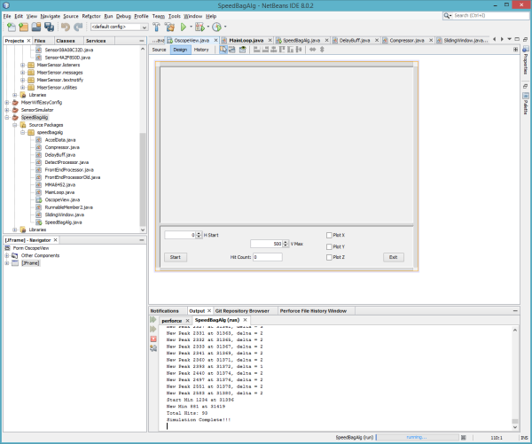

このアルゴリズムは急いで作る必要があったため、最初の実装ではオブジェクト指向を徹底し、Javaが提供するあらゆる近道を活用することにした。
その後、アルゴリズムの流れを固めていく過程で、より C 言語らしい形に近づけていくつもりだった。
早速、記録済みの結果から得られるX、Y、Z軸の波形をそのままプロットしてみた。
生データを確認したところ、まずバイアス（すなわち重力）を取り除き、それぞれの波形の2乗の和を求めてから平方根を取ることにした。
少数の値を平均する平滑化を加え、しきい値を超える回数を数える際にも、スパイクを除去するための最小時間間隔を設けた。
全体としては、これによってプロットのデータはむしろ悪化したように見えた。
どの向きで取り付けられているかわからず、また異なるスピードバッグの台に取り付けたときに同じ向きになるとも限らないため、XとYは捨てることにした。
ところが恐ろしいことに、Z軸だけにしても、依然としてノイズの塊にしか見えなかった。
ピークどうしの間隔が近すぎるのである。
しきい値検出の間の最小時間というゲートだけが、かろうじてパンチ数の辻褄を合わせてくれているだけで、データそのものには確かなものが何もなかった。
何かがおかしい。何を見落としているのだろうか。

以下は`runF1`波形の画像である。
青い信号がフィルタ済みのZ軸、赤い線がパンチをカウントするためのしきい値である。
先ほど触れたとおり、パンチ検出の間の250ms最小間隔がなければ、カウンタは暴走してしまっていただろう。
`runF1()`の処理には5ミリ秒の遅延を2か所導入しており、赤い線を10ミリ秒右にずらせば、しきい値判定はもう少しうまくいくはずである。
信号の時間軸を揃えることについては本記事の後半でさらに触れるが、この画像からも、時間軸を揃えることが正確な結果を得るうえでいかに重要かがわかる。

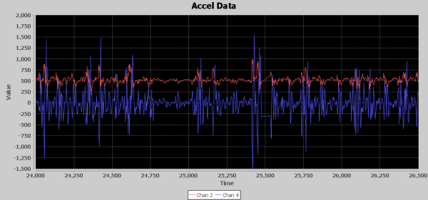

青い信号がフィルタ済みのZ軸、赤い線がパンチをカウントするためのしきい値である。

仮想オシロスコープの出力を見ると、25,000ミリ秒から26,000ミリ秒の間、つまりわずか1秒の間に、9回ほどの明確な加速度イベントが確認できる。
Nateが1秒間に9発もパンチを繰り出しているはずがない。
そもそも、1秒間に何発のパンチが妥当なのだろうか。
振り出しに戻り、別のアプローチが必要だと悟った。
謙虚さは何よりの味方である。調子に乗って突き進めば、たいていすぐに手痛いしっぺ返しを食らうことになる。

## 対象領域を理解する

たいてい、要件は解こうとしている問題の領域（ドメイン）を踏まえて策定されるか、あるいはドメイン知識を踏まえた要件から設計上の判断が導かれる。
筆者はボクシングのスピードバッグについて何も知らなかったので、まずはGoogle検索から始めることにした。

そこで見つけた重要な事実は、ボクサーがスピードバッグを打つと、土台に3回接触するということだった。まず前方（パンチの方向）に向かい、それから完全に元の位置（パンチと反対方向）まで戻って土台に当たり、再び前方へ完全に戻って土台に当たる。
そして、バッグがボクサーの方へ戻ってくるところをもう一度打つ。
つまり、土台に動きを生じさせる機会は実質4回ある。ボクサーがバッグに当たった衝撃が1回、そして土台との接触が3回である。

これで、波形に現れていたものの意味がようやく理解できた。
1回のパンチにつき1回だけバッグが土台に当たる衝撃が生じるわけではなかったのである。
次に考えたのは、ボクサーが1秒間に何発スピードバッグを打てるかということだった。
いろいろ調べてみたが、この問いへの明確な答えは見つからなかった。
シャドーボクシングの最大パンチ数や、実際のパンチの最大数を扱うサイトはたくさん見つかったが、スピードバッグに関する最大値は見つからなかった。
自分なりの結論を導き出すしかなかった。1回のパンチでスピードバッグがどれだけの距離を移動する必要があるかを考え、土台に3回接触するだけの距離を移動させるには最低限の力が必要なはずだと考えた。
ボクサーではないので、できるだけゆっくりとバッグを打ち、それでも3回接触するところを頭の中でイメージするしかなかった。
頭の中の映像から判断するに、1秒間に2回未満の頻度でバッグを打つのは難しそうだった。
これが最小値だとして、では最大値はどうだろうか。
再び頭の中で映像を思い描き、今度は拳を動かして想像上のバッグを打ってみた。
バッグが移動しなければならない距離と、拳をバッグの軌道に出し入れするのにかかる時間を考えると、熟練したボクサーであっても、1秒間に4回程度が限界だろうという結論に達した。
これで決まりである。データの中から、2Hzから4Hzの間で起きているイベントを見つければよい。
再びコーディングと開発に戻る時間である。

## 少し作り、少し試し、多くを学ぶ

人によって考え方は少しずつ違うものだが、特にはっきりと定まった方法論を持たずに問題に取り組む場合は、反復的な戦略を試すことを勧める。
また、**アルゴリズムに大きな変更を加える準備ができたと感じたら、変更を始める前にそのアルゴリズムのコピーを作る**か、あるいは空の関数から始めて前の反復の断片を少しずつ取り込んでいくとよい。
バージョン管理を使って前の反復を保存することもできるが、筆者はコードの中に前の反復（複数のこともある）を残しておくほうを好む。次の反復に取り組む際に簡単に参照できるからである。
たいてい、10行か20行以上コードを書く前には、少なくともコンパイルが通ることを確認するようにしているが、本当にやりたいのは実際に実行し、何かを出力させて、自分のロジックと前提が正しいことを確かめることである。
これはキャリアを通じてずっとやってきたことであり、実際にコーディング中のものを動かせる対象ハードウェアが手元にないと、たいてい不満を漏らすことになる。
2006年ごろ、ある元海軍少将のこんな言葉を耳にした。

**少し作り、少し試し、多くを学べ。**

―Wayne Meyers、米海軍少将

この言葉には強く共感する。書いているものを常に動かし、試したいと思う理由を的確に言い表しているからである。
これによって、自分の前提が正しいことを確認できるか、あるいは間違った方向に進んでいることに気づき、多くの作業を無駄にすることなく素早く正しい道に戻ることができる。
これもまた、実物のスピードバッグのハードウェアがない状態でも、素早くコードを実行・テストし、しかも視覚的にグラフ化できるJavaをプロトタイピングのプラットフォームに選んだ理由の一つである。

さらに、6つの`runFx()`関数すべての中に、現在時刻をミリ秒単位で追跡し、タイムスタンプの差が経過したかどうかを確認して、経過していなければ1ミリ秒だけスリープするというコードが組み込まれている。
これによって、Javaのプロット画面上でデータが流れていく様子を見ながら、フィルタの出力がどうなっているかを確認できた。
X、Y、Z軸の加速度データに加えて、X、Y、Zそれぞれの平均値も渡すようにしていた。
たいていのアルゴリズムではZ軸のデータしか使わなかったため、途中からはズルをして別の値をプロット対象として渡すようになり、1から5までのグラフを見ると、凡例と一致しない箇所があって少しわかりにくくなっている。
とはいえ、リアルタイムでプロットすることで、データを見ながらヒットカウンタが増えていく様子を確認できた。
パンチのリズムがどう定まっていくか、そして一定のリズムが続くことで生じる共振が加速度データにどう影響するかを、実際に目で見て、体感することができた。
Javaの`System.out.println()`関数による視覚的な出力に加えて、NetBeans IDEのウィンドウにもデータを出力できた。

GitHubリポジトリのJavaサブディレクトリを見ると、[MainLoop.java](https://github.com/barryhannigan/SpeedBagChallenge/blob/master/Java/SpeedBagAlg/src/speedbagalg/MainLoop.java)というファイルがある。
このファイルには、`run1()`から`run6()`という名前の関数がいくつか含まれている。
これらは、スピードバッグアルゴリズムのコードにおける6つの主要な反復である。

それぞれの反復のポイントを紹介する。

### runF1

[runF1()](https://github.com/barryhannigan/SpeedBagChallenge/blob/master/Java/SpeedBagAlg/src/speedbagalg/MainLoop.java#L808)はZ軸のみを使い、スライディングウィンドウによる弱いバイアス除去と、フィルタ済みZデータの固定の増幅を行った。
入力データを遅延させる「delay」という要素を作り、平均結果の出力と後で時間軸を揃えられるようにした。
これにより、スライディングウィンドウの平均を、以前の値ではなく周囲の値に基づいてZ軸データから差し引くことができた。
パンチの検出には、増幅済みのフィルタデータが5サンプルの平均を上回るかどうかを単純に比較する方法を使い、検出の間隔は最低250ミリ秒とした。

### runF2

[runF2()](https://github.com/barryhannigan/SpeedBagChallenge/blob/master/Java/SpeedBagAlg/src/speedbagalg/MainLoop.java#L667)もZ軸のみを使い、スライディングウィンドウによる弱いバイアス除去を行ったが、直前のパンチ検出時に除去されたバイアスを超える平均振幅に基づいて、フィルタ済みZデータに動的なベータ増幅を加えた。
また、直前のパンチが検出されてからの経過時間に基づいて、225msから270msの間で動的に変化するパンチ間の最小時間も計算した。
除去したバイアスの量を「ノイズフロア」と呼ぶことにした。
シミュレーションを一時停止・再開できるボタンも追加し、デバッグ出力や波形を確認できるようにした。
これにより、シミュレーションの進行に伴ってベータ増幅がどう使われているかを確認できた。

### runF3

[runF3()](https://github.com/barryhannigan/SpeedBagChallenge/blob/master/Java/SpeedBagAlg/src/speedbagalg/MainLoop.java#L483)はXとZ軸のデータを使った。
パンチの動作による衝撃がZ軸のデータに加算的に作用し、実際のパンチの位置を特定する助けになるのではないか、という仮説を立てたのである。
基本的にはRunF2と同じアルゴリズムに、X軸を追加しただけのものである。
実際にこれはかなりうまく機能し、X軸の動きとZ軸を相関させることで何かが見えてきたのではないかと感じた。
コード中のコメントアウトされた多数の実験からもわかるとおり、さまざまな調整や工夫を試した。
「コンプレッサー」と呼んでいるものも試し始めた。5サンプルの合計を取ることで、パンチが起きるタイミングの周辺にエネルギーの塊が検出できないか調べるものである。
これはアルゴリズムには使わなかったが、しきい値を超えた回数を出力し、フィルタの要素として使える可能性があるか確認した。
最終的には、このアルゴリズムは自壊し始め、ここで学んだことを持って新しいアルゴリズムに取り掛かる時期だと判断した。

### runF4

[runF4()](https://github.com/barryhannigan/SpeedBagChallenge/blob/master/Java/SpeedBagAlg/src/speedbagalg/MainLoop.java#L483)では、バイアス除去の平均を50サンプルに増やした。
減衰とサンプル圧縮に加え、整数の減衰済みデータに小数の精度をいくらか保持するための固定小数点LSBを導入し始めた。
要件の一つに8ビットマイコンで動作させる必要があるという条件があったため、最終的なC/C++コードでは浮動小数点や時間のかかる数学関数の使用を避けたいと考えていた。
これについてはコンポーネントの節で詳しく述べるが、ここではその方向性に着手し始めていたことだけ触れておく。
加速度のバーストを見つけるという方向性が正しいと確信するようになった。
この時点で、ZとX両方の軸からバイアスを除去し、それぞれを2乗している。
それぞれを減衰させて足し合わせるが、X軸の値には10倍のスケールをかけている。
加速度のバーストを平滑化するため、フィルタ済みの11個の値を平均する2段目のステージも追加した。
次に、平滑化された値が固定しきい値の100を超えると、平滑化前のZとXの2乗の組み合わせをコンプレッサーに読み込み始め、100サンプルに達するまで続ける。
コンプレッサーの出力（100サンプル分）が5000を超えると、それがヒットとして記録される。
パンチ間の可変時間ゲートも導入したが、コンプレッサーが100サンプルを使ってパンチ検出をひとまとめにしているため、ゲートの時間ははるかに短く、125msから275msの間になった。
ある程度の見込みは見えたものの、まだ敏感すぎた。
あるデータセットではぴったり合うのに、別のデータセットでは10発以上もずれてしまうこともあった。
多くの調整と実験を重ねた末、このアルゴリズムもまた自壊し始め、再び学んだことを持って一からやり直す時期になった。
この頃には、この問題に満足のいく解がそもそも存在しないのではないかと考え始めていたことも触れておくべきだろう。
バッグの接触とは位相がずれているように見える共振振動が、ボクサーが良いリズムに乗ったときに観測される加速度に、ことごとく悪影響を及ぼしているように思えた。
これはすべて時間の無駄なのではないか、とすら思えた。

### runF5

[runF5()](https://github.com/barryhannigan/SpeedBagChallenge/blob/master/Java/SpeedBagAlg/src/speedbagalg/MainLoop.java#L141)のアルゴリズムは、信号から平均を差し引くのではなく、もっと本格的なハイパスフィルタを導入する必要があるという発想から始まった。
このハイパスフィルタの基本原理は、新しく入力されたサンプルの値の99%と、平均の値の1%を合成するというものである。
runF5の進化の終盤に加えた重要な考え方の一つが、最初の処理段階を独立したファイルに切り出し、後段の処理から分離することでアルゴリズムを単純化するというものだった。
分割統治は昔からある手法だが、何度試してもやはり有効である。
アルゴリズムの中や`FrontEndProcessorOld.java`ファイルにある多数のコメントアウトされた行からもわかるとおり、さまざまな実験を試した。
最終的には、この新しいフロントエンドプロセッサという考え方を持ち越し、分割統治とより本格的なハイパスフィルタという方針で新たに始める時期になった。

### runF6

時間が残り少なくなる中、ここまで学んだことをすべて統合し、JavaコードをC/C++に移植する準備を整え、移動平均ではなく本物のフィルタを実装する時期になった。
[runF6()](https://github.com/barryhannigan/SpeedBagChallenge/blob/master/Java/SpeedBagAlg/src/speedbagalg/MainLoop.java#L72)では、フロントエンドでハイパスフィルタを使ってバイアスを除去し、残った信号にローパスフィルタをかけて2Hzから4Hzの周波数で発生する加速度のバーストを見つける、という理論をまとめ上げていた。
締め切りまでの残り時間で、ハイパスフィルタとローパスフィルタを実装するためのフィルタタップの値を自力で計算する方法を学んでいる余裕はとてもなかった。
幸運にも、[t-filterのWebサイト](http://t-filter.engineerjs.com/)を見つけた。
これは一石三鳥どころではなかった。パラメータを入力するだけでフィルタタップの値が得られただけでなく、生成されたCコードをわずかな調整でJavaコードに活用することもできた。
さらに、タップの値を固定小数点に変換までしてくれた。
分割統治の考え方を全面的に取り入れ、この最終版のアルゴリズムでは、フロントエンドプロセッサと検出処理をそれぞれ独立したサブアルゴリズムとして導入した。
これにより、2つの機能を互いに分離できた。一方の出力信号がもう一方の入力になるという関係だけを残し、両方の段階で共有される可能性のある大量の変数をふるいにかける必要もなく、目の前の作業に集中しやすくなった。

このように役割を分担したことで、フロントエンドプロセッサの役割は、バイアス値を除去し、検出プロセッサへの入力として扱いやすいレベルの出力を作ることに明確に絞り込めるようになった。
そして検出プロセッサは、フィルタリングと、1秒間に2回から4回の間で起こるはずのパンチイベントを検出するステートマシンの実装に、はっきりと集中できるようになった。

一つ触れておきたいのは、この最終版のアルゴリズムは、それ以前のアルゴリズムのいくつかよりもずっと小さく、単純だという点である。
ソフトウェアであっても、開発のどこかの段階で[マンツィング](https://ja.wikipedia.org/wiki/Muntzing)と呼ばれる手法を行うべきである。
マンツィングとは、機能を壊さない範囲で何を取り除けるかを見直す手法である。
取り除いたコードの1行は、バグを含みうるコードの1行が減ることを意味する。
マンツィングの精神をより深く理解したければ、[Earl「Madman」Muntz](https://ja.wikipedia.org/wiki/Madman_Muntz)を調べてみるとよい。

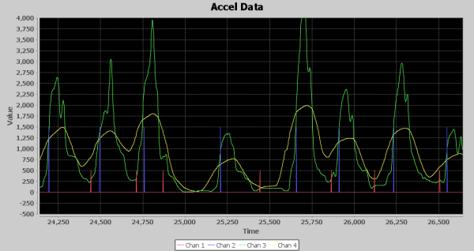

DETの最終出力。

上の図は、runF6の視覚的な出力である。
緑の線はローパスフィルタの出力を45サンプル遅延させたもの、黄色の線はローパスフィルタの出力の99個の値の平均である。
検出プロセッサには、緑の信号が最小値・最大値を横切るタイミングを、黄色の信号を動的なしきい値のテンプレートとして使いながら追跡することでパンチを検出するアルゴリズムが組み込まれている。
それぞれの最小値は赤いスパイク、最大値は青いスパイクとして表示されており、青いスパイクがパンチの検出にあたる。
時間軸の単位はミリ秒である。
予測どおり2〜4Hzの範囲に収まる形で、1秒あたりおよそ3回の青いスパイクが現れていることに注目してほしい。
そして、その後の展開はご存じのとおりである。

## アルゴリズムを構成する要素

ここでは、さまざまなアルゴリズムで使った各要素について簡単に紹介する。

### ディレイ（遅延）

これは、信号をバッファリングして、他の何らかの処理と時間軸を揃えるために使う。
たとえば、9サンプルの平均を取り、その平均を元の信号から差し引きたい場合、元の信号を5サンプル遅延させておけば、その値自体と、前後4サンプルずつを使って計算できる。

### アッテニュエート（減衰）

減衰は単純だが有用な処理であり、フィルタリングなどでゲインを加える前に、信号のスケールを下げておくために使う。
減衰はたいていデシベル（dB）で測られる。用途に応じて、電力を減衰させることも、振幅を減衰させることもできる。
振幅を半分にすると、-6dBの減衰になる。
他のdB値で減衰させたい場合は、[dBスケールの一覧](https://ja.wikipedia.org/wiki/%E3%83%87%E3%82%B7%E3%83%99%E3%83%AB)を参照してほしい。
スピードバッグのアルゴリズムに関して言えば、これは基本的に信号にはっきりとしたギャップを作るために使った。小さい値をゼロに近づけて押しつぶすことで、後で2乗したときにピークをより高く押し上げつつ、ゼロに近い値への影響は小さく抑えられる。
この手法を使って、スピードバッグの台の背景振動に対して、加速度のバーストを際立たせるようにした。

### スライディングウィンドウ平均

スライディングウィンドウ平均は、入力される信号について、あるサンプル数の窓（ウィンドウ）にわたる連続的な平均を計算する手法である。
平均を取るサンプル数のことをウィンドウサイズと呼ぶ。
筆者が好んで実装する方法は、サンプルの合計値を保持しながら、値を追跡するリングバッファを使うというものである。
リングバッファが満杯になったら、もっとも古い値を取り除いて次に入ってきた値に置き換え、リングバッファから取り除いた値を新しい値から差し引く。
その結果を合計値に加える。
必要なときはいつでも、その合計値をウィンドウサイズで割れば現在の平均が得られる。

### レクティファイ（整流）

これは非常に単純な考え方で、値の符号をすべて正、あるいはすべて負にそろえて、足し合わせられるようにするものである。
ここでは、すべての値を正にするために整流を使った。
整流には、他の整流と同様、全波整流と半波整流の方法がある。
全波整流は、値を正の値として返す`abs()`という数学関数を使えば簡単に行える。
値を2乗して正にすることもできるが、その場合は振幅そのものが変わってしまう。
単純な整流であれば、他の影響を与えずに値を正にできる。
半波整流を行うには、0未満の値をすべて0に設定すればよい。

### コンプレッション（圧縮）

DSPの世界では、圧縮とはたいてい、振幅を近い範囲に収めることを指す。
ここでの圧縮の手法は、あるウィンドウ内のサンプルの値を合計するというものである。
ウィンドウが満たされるたびに1個のサンプルしか出力されないという意味では一種のダウンサンプリングだが、値そのものは何も捨てていない。
純粋にウィンドウ内の合計値であり、あるいはウィンドウの平均値として使うこともできる。
これは、静かな時間帯から加速度のバーストを見分けようとする目的で、いくつかのアルゴリズムに取り入れた。
実際には、最終版のアルゴリズムでは使わなかった。

### FIRフィルタ

有限インパルス応答（FIR）フィルタは、それぞれに割り当てられた多項式係数を持つ、いくつかのタップによって実装されるデジタルフィルタである。
タップの数はフィルタの次数と呼ばれる。
FIRの強みの一つは、フィードバックをまったく使わないため、丸め誤差が累積せず、時間とともに大きくなっていかないという点である。
有限インパルス応答とは、単純に言えば、1の後にすべて0が続くサンプル列を入力すると、フィルタの出力は、多くとも次数+1個分の0値サンプルが入力されるまでの間にゼロに落ち着くということである。
つまり、1という単一のサンプルへの応答は、有限個のサンプルの間だけ存在し、その後は消えてなくなる。
これは基本的に、フィードバックを一切使っていないという性質によって実現されている。
DSPの記事の中には、フィルタのタップ数や係数の計算は簡単だと主張するものもあるが、筆者にとっては簡単ではなかった。
最終的に、[tFilter](http://t-filter.engineerjs.com/)というオンラインアプリを見つけ、多くの時間と苦労を省くことができた。
フィルタの種類（ローパス、ハイパス、バンドパス、バンドストップなど）を選び、入力データの周波数範囲とサンプリング周波数を設定するだけでよい。
浮動小数点演算を避けるため、係数を固定小数点で生成させることもできる。
固定小数点の使い方がわからない、あるいは聞いたことがないという場合は、後の「組み込み向け最適化テクニック」の節で説明する。

## 組み込み向け最適化テクニック

### 二乗振幅（Mag Square）

Mag Squareは、平方根の計算にかかる処理コストを省くための手法である。
たとえば、XとZ軸のベクトルを計算したい場合、通常は次のように計算する。`val = sqr((X * X) + (Y * Y))`
しかし、正確なベクトルの値がどうしても必要な場合を除けば、単純に`(X * X) + (Y * Y)`の値のままにしておいてもよい。Mag Squareは、後続のサンプルで計算される他のベクトルと比較するのに使える比率を与えてくれる。
数値はかなり大きくなるので、下流の計算でオーバーフローしないよう、減衰によって値を小さくしたくなるかもしれない。

最終的なアルゴリズムでは、背景振動から加速度のバーストを際立たせるためにこの手法を使った。
計算にはZ * Zのみを使ったが、その後すべての値を半分（-6dB）に減衰させ、後続の処理に適した妥当な水準まで下げた。
たとえば、バイアスを除去した後にいくつかの値が2前後、いくつかの値が10前後だったとすると、それぞれを2乗すると4と100になり、25対1の比率になる。
ここで0.5倍に減衰させると2と50になり、比率は25対1のままだが、扱う数値は小さくなる。

### 固定小数点

固定小数点数を使うことも、特にマイクロコントローラ上で性能を引き出すもう一つの方法である。
固定小数点は基本的には整数演算だが、すべての整数のある特定のビット位置に暗黙の小数点があるものとして扱うことで、精度を保つことができる。
FIRフィルタの場合、tFilterに16ビットの固定小数点値で多項式の値を生成するよう指示した。
これは、32ビットを超える整数を使わないようにするためであり、特に8ビットマイコンでの性能低下を避けたかったからである。

FIRフィルタのコードに立ち入って固定小数点の仕組みを説明する前に、まずは単純な例を使ってみよう。
FIRフィルタのアルゴリズムは多数の多項式を使った複雑なフィルタリングを行うが、ここでは同じ入力信号を、振幅を半分（-6dB）にして出力するだけの単純なフィルタを実装するとしよう。
浮動小数点の世界であれば、これは入力される各サンプルに0.5を掛けるだけの、タップ1個の単純なフィルタになる。
これを16ビットの精度の固定小数点で行うには、0.5を16ビットの固定小数点表現に変換する必要がある。
1.0という値は、1 × (2^16)、つまり65,536で表される。
65536より小さい値は、すべて1未満の値になる。
0.5の固定小数点整数を作るには、同じ式を使って0.5 × (2^16)を計算すればよく、これは32,768になる。
これで、この値を使って入力される各サンプルの振幅を0.5倍に下げることができる。
たとえば、この単純なフィルタに値10のサンプルを入力するとしよう。
フィルタは10 × 32768 = 327,680を計算し、これが固定小数点表現になる。
計算後に精度を保持する必要がなければ、使用している精度のビット数だけ右シフトするだけで、簡単に固定小数点でない整数に戻せる。
つまり、327680 >> 16 = 5である。
このように、フィルタは10を5に変えており、これはもちろん求めていた半分（-6dB）の結果である。
0.5はかなり単純な例だったが、振幅を1/8にしたい場合も同じ手順で、65536 × .125 = 8192となる。
値16のサンプルを入力すると、16 × 8192 = 131072となり、これを整数に戻すと131072 >> 16 = 2になる。
整数に戻す際に精度が失われる様子（浮動小数点数を整数に変換するのと同じ現象）を示すために、この1/8のフィルタに10を入力してみると、10 × 8192 = 81920となり、これを整数に戻すと81920 >> 16 = 1になる。固定小数点表現では実際には1.25だったことに注目してほしい。

FIRフィルタの話に戻ると、16ビットの精度を選んだのは、十分な精度を確保しつつ、扱える整数の範囲とのバランスを取るためである。
通常、符号付き32ビット整数は-2,147,483,648から+2,147,483,647までの範囲を扱えるが、整数部分に使えるビット数が16ビットに制限されると、範囲は-32,768から+32,767になる。
扱える数値の範囲が限られるため、入力される値には注意を払う必要がある。
`FEPFilter_get`関数を見ると、各タップの値を合計する`accZ`というアキュムレータ変数があるのがわかる。
通常、タップの履歴値が32ビットであれば、すべてのタップ値の合計を確実に保持できるよう、アキュムレータは64ビットにする。
しかし、入力値がある最大値より必ず小さいことを保証できれば、32ビットの値でも構わない。
最大入力値を計算する一つの方法は、係数の絶対値の合計を、固定小数点方式で扱える整数部分の最大値で割ることである。
FEPのFIRフィルタの場合、係数の合計は131646だったので、正の整数部分に15ビット、小数部分に16ビットを割り当てられるとすると、(2^31)/131646という式から、FEPの最大入力値は±16,312と求められる。
このケースでは、マイクロコントローラに64ビット演算をさせないという、もう一つの最適化も実現できたことになる。

## 信号処理のチェーンをたどる

### フィルタリングによる遅延

処理チェーンをたどる前に、フィルタリングによって生じる遅延について触れておくべきだろう。
多くの種類のフィルタリングは、処理される信号に遅延を加える。
フィルタリングの経験が豊富であれば、この事実はよく知っているだろうが、信号のフィルタリングにあまり慣れていない場合は、意識しておくべきことである。
遅延とは何を意味するのだろうか。
これは単純に、値Xを入力し、値Yが出力されるとき、Xの影響がもっとも大きく現れるまでにYに届く時間、それが遅延であるということである。
FIRフィルタの場合、フィルタのインパルス応答をプロットすれば簡単に確認できる。FIRフィルタの説明を思い出してほしいが、これは0の連なりの中に1つだけ1が挿入された信号である。
T-Filterはこのインパルス応答を表示してくれるので、XがYの出力にどう影響するかを確認できる。
以下は、[T-Filter](http://t-filter.engineerjs.com/)のWebサイトから取得した、FEPのハイパスフィルタのインパルス応答の画像である。
Xへの影響がもっとも大きいのは、画像のちょうど中央にあり、フィルタの各タップに対応する点があることに注目してほしい。

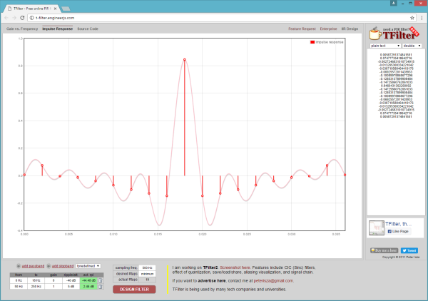

以下は、FEPのハイパスフィルタのいくつかの信号を示した図である。
赤い信号は加速度センサーからの入力、つまりフィルタに入る最新のサンプルであり、青い信号はフィルタのリングバッファの中でもっとも古いサンプルである。
このFIRフィルタには19個のタップがあるため、これはフィルタのウィンドウにおける最初と最後のサンプルのプロットにあたる。
緑の信号は、ハイパスフィルタから出てくる値である。
先ほどのXとYの例に当てはめると、赤い信号がX、緑の信号がYにあたる。
青い信号は、赤い入力信号に対して36ミリ秒遅延している。これはちょうど2ミリ秒間隔の18サンプル分にあたり、これがフィルタが処理対象とするデータのウィンドウ、つまりXがYに影響を与える有限の時間である。

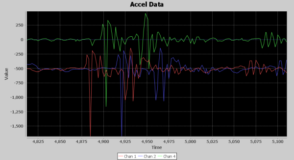

ハイパスフィルタの出力（緑の信号）は、入力の変化を18ミリ秒（2ミリ秒間隔の9サンプル分）遅れて追いかけているように見える点に注目してほしい。
つまり、入力信号からもっとも大きな影響が現れるのはフィルタウィンドウの中央であり、これはインパルス応答のプロットで1の入力による最も強い効果がフィルタウィンドウの中央に現れることとも一致する。

遅延を加えるのはFIRだけではない。
たいてい、あるサンプルのウィンドウに対して行われるフィルタリングはすべて遅延を引き起こし、その遅延はたいていウィンドウの長さの半分になる。
用途によっては、この遅延を設計上考慮する必要がある場合とない場合がある。
しかし、この信号を別のフィルタをかけていない、あるいはあまりフィルタをかけていない信号と時間軸を揃えたい場合は、ディレイという要素を使って、この遅延を考慮に入れる必要がある。

### フロントエンドプロセッサ

ここまで、最終的な解に至るまでの過程と、その解を構成するすべての要素について詳しく述べてきたので、ここからは処理チェーンをたどりながら、信号がパンチを明らかにするものへとどう変換されていくかを見ていこう。
FEPの主な目的は、バイアスを取り除き、加速度のバーストにまたがって滑らかにつながる出力信号を作ることである。加速度が高まっているときは振幅が高く、加速度が低いときは振幅が低くなる波形である。
FEPには、ハイパスFIR、アッテニュエータ（減衰器）、レクティファイア（整流器）、そしてスライディングウィンドウ平均による平滑化という、4つの直列の要素がある。

最初の画像は、ハイパスFIRの入力と出力である。
バイアスの分だけずれているため、それほど重なっては見えない。
赤い信号が加速度センサーからの入力、青がFIRからの出力である。
重力による1gの加速度が取り除かれ、信号のゆっくりとした変化がフィルタで除去されていることに注目してほしい。
24,750ミリ秒から25,000ミリ秒の間を見ると、青い信号はスパイクとわずかなリンギングを伴うほぼ直線に近い形になっているのに対し、元の入力にはそのスパイクに加えて、ゆっくりとしたうねりに沿ってさまよう動きが見られる。

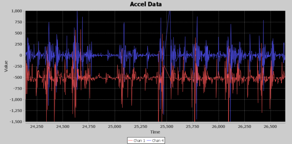

次はアッテニュエータの出力である。
この要素は信号全体に作用するが、信号のピークの値を下げる一方で、もっとも重要な役割は、信号の静かな部分をゼロの値に近づけて押しつぶすことである。
以下の画像はアッテニュエータの出力を示しており、入力はハイパスFIRの出力である。
予想どおり、ピークははるかに低くなっているが、静かな時間帯も同様に低くなっている。
これによって、加速度のバーストが少し見やすくなる。

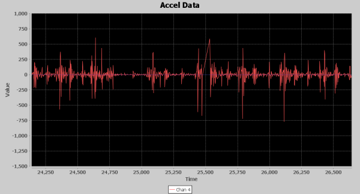

次はレクティファイア要素である。
その役割は、すべての加速度エネルギーを正の方向に揃え、平均化に使えるようにすることである。
たとえば、+1000の正のスパイクの後に-990の負のスパイクが続くと平均は5になるが、+1000の後に+990が続けば平均は995になり、大きな違いが生じる。
以下はレクティファイアの出力の画像である。
加速度のバーストはわずかに見やすくなっているが、まだはっきりとはわかりにくい。
実のところ、この画像はこの問題がこれほど手強い理由をまさに物語っている。台の共振による揺れが、パンチのエネルギーが加わるにつれてパターンをどう変化させるかがはっきりと見て取れる。
左側は低く頻度の高いピーク、右側は高く頻度の低いピークになっている。

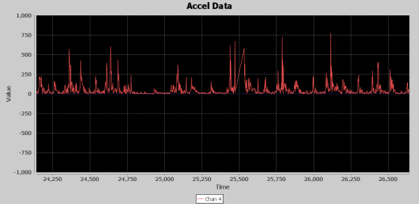

49個の値によるスライディングウィンドウは、FEPの最後のステップである。
ここまでの処理では、画像を見る限りパンチがはっきりと浮かび上がるような大きな変化は与えられていなかったが、この最終段階によって、信号が隠れたパンチの情報をまさに引き出そうとしていることが視覚的にわかるようになる。
これまでの信号処理の成果が、まるで魔法のようにこの段階で姿を現す。
以下はスライディングウィンドウ平均の画像である。
青い信号がその入力、つまりレクティファイアの出力であり、赤い信号がスライディングウィンドウの出力である。
赤い信号は、FEP段階の処理における最終的な出力でもある。
これはウィンドウであるため、それに伴う遅延がある。平均するとおよそ22サンプル、44ミリ秒である。
入力信号のスパイクが突然高く現れ、その後に小さなリンギングが続くことがあるため、常にそのとおりに見えるわけではない。
また、大きなスパイクの前に小さなスパイクがいくつか現れることもあり、そのために出力のピークがどこに現れるかによって、スライディングウィンドウ平均の出力の遅延が一定しないように見えることもある。
これらの小さな盛り上がりは小さいものの、パンチによって新たな加速度エネルギーが加わった場所を表すようになっている。

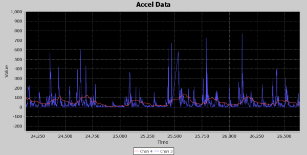

### 検出プロセッサ

いよいよ検出プロセッサ（DET）に話を進めよう。
FEPは、加速度のバーストがどこで起きているかを示し始めた信号を出力する。
DETの役割は、この信号をさらに強調し、アルゴリズムを使ってパンチがどこで起きているかを検出することである。

DETの最初の段階はアッテニュエータである。
最終的には信号にエクスポネンシャルゲインを加えてピークをしっかりと引き上げたいのだが、その前に、まずは低い値を再びゼロに近づけて押しつぶし、DETチェーンの残りの部分で処理しきれないほど大きな値が生じないよう、ピークも下げておく必要がある。
以下はアッテニュエータ段階の出力の画像である。FEPからの出力信号と似た形に見えるが、FEPではピークが100を超えていたのに対し、今回はピークがわずか50を少し超える程度になっている点に注目してほしい。
縦軸は最大振幅500に拡大表示しており、パンチの情報を含む実用的な信号があることが確認できる。

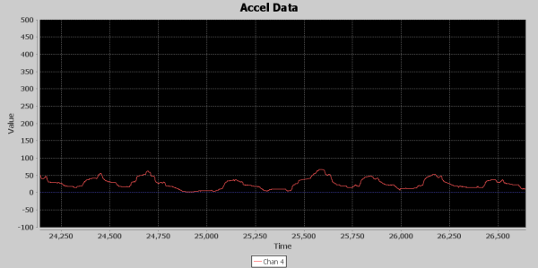

信号を十分に減衰させたところで、ここからが本領発揮である。
すべてが1つにまとまるのが、二乗振幅（Mag Square）関数のところである。
減衰させた信号には、これから育てていく巨大なセコイアの木の小さな種が眠っている。
以下はMag Squareの出力の画像である。赤い信号が減衰済みの入力、青い信号がMag Squareの出力である。
縦軸の最大値を3,000まで拡大表示する必要があったが、見てのとおり、入力信号はほとんど平坦に見えるにもかかわらず、Mag Squareによって検出アルゴリズムがパンチを見分ける助けとなる、見紛いようのないピークを引き出すことができている。
なぜこの巨大なピークをそのままパンチの検出に使わないのかと思うかもしれない。
この区間の信号を分析対象に選んだ理由の一つは、加速度の大きさがいかに大きく変動しうるかを示すためであり、25,000ミリ秒から25,250ミリ秒の間のピークが周囲のピークよりもかなり小さいことがわかる。これは単純なしきい値判定を難しくする要因である。

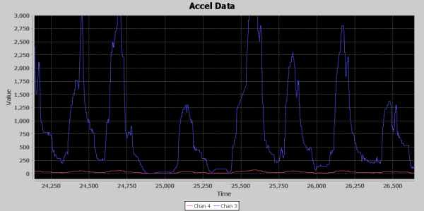

次に、2Hzから4Hzの範囲で起きるイベントを探しているので、素早く変化する部分を取り除こうとローパスフィルタを導入することにした。
0〜5Hzの帯域を持つ厳密なローパスフィルタをT-Filterで作るのは大変だった。生成されるフィルタのタップ数が100を超えてしまい、その処理コストは避けたかったし、それだけの合計を保持するには64ビットのアキュムレータが必要になってしまう。
そこで通過帯域を0〜19Hzに、阻止帯域を100〜250Hzに緩和した。
以下はローパスフィルタの出力の画像である。青い信号が入力、赤い信号が遅延させた出力である。
この画像を選んだのは、入力信号と出力信号が互いに干渉せずに見えるようにするためである。
遅延は、ローパスFIRの6サンプル分の遅延によるものだが、この信号にはさらに49サンプルの遅延も加えており、これは処理チェーンの次の段階にある99サンプルのスライディングウィンドウ平均のちょうど中央に位置を揃えるためである。
つまり、合計で55サンプル、110ミリ秒遅延していることになる。
この画像では、緩やかなピークがその高さによってわずかに増幅されており、より速く変化する要素が減衰することで滑らかになっている様子がわかる。
それほど大きな変化ではないが、信号は少しきれいになっている。Earl Muntzなら、このローパスフィルタを回路から取り除いてしまえと言うかもしれないし、実際それでも動作するかもしれない。

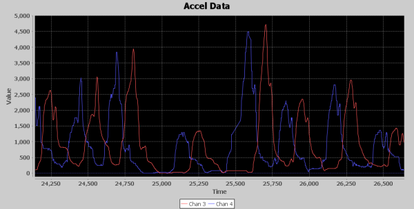

信号処理の最終段階は、99サンプルのスライディングウィンドウ平均である。
このスライディングウィンドウ平均には、新しい値が追加されるたびにウィンドウの中央にあるサンプルを返す機能を組み込んでおり、これが先ほどの画像で示した49サンプル遅延の信号を作り出す方法である。
これが重要なのは、検出アルゴリズムには2つの並行した信号、すなわち99サンプルのスライディングウィンドウ平均の出力と、そのスライディングウィンドウ平均への49サンプル遅延した入力が渡されるからである。
これによって、平均化されていない信号を、スライディングウィンドウ平均のちょうど中央に完璧に揃えることができる。
平均化された信号は、検出アルゴリズムの検出処理で使う動的なしきい値として使われる。
ここでもう一度、DETの最終出力の画像を示す。

この画像では、緑と黄色の信号が検出アルゴリズムへの入力であり、青と赤が出力である。
見てのとおり、49サンプル遅延させた緑の信号は、黄色の99サンプルスライディングウィンドウ平均のピークと完璧に位置が揃っている。
検出アルゴリズムは、緑の信号が黄色の信号を横切るタイミングを監視する。
これは、信号が黄色の信号に対して最小または最大の方向に十分動いたことを確認する開始ガードの状態を、最大側と最小側の両方に用意し、その後、緑の信号が最大値または最小値を宣言できるだけの方向転換を示すかどうかを監視する状態へ切り替えることで実現している。
ピークの開始が検出され、かつ直前に検出したピークから少なくとも260ms経過していれば、状態は緑の信号の新しいピークを監視するモードへ切り替わり、画像に見える青いスパイクも生成される。
これがパンチのカウントとして記録されるタイミングである。
新しいピークが検出されると、状態は新しい最小値の開始を探すモードに切り替わる。
そして、緑の信号が黄色の信号よりも50だけ下回ると、状態は緑の信号の新しい最小値を探すモードに切り替わる。
緑の信号の最小値が確定すると、状態は緑の信号の新しいピークの開始を探すモードに切り替わり、この時点で画像に赤いスパイクが表示される。

この時間帯のデータを選んだ理由をもう一度述べておくと、ピークの振幅が大きく変動する状況でも、このアルゴリズムがパンチを追跡できることを示すためである。
興味深いのは、24,750ミリ秒から25,000ミリ秒の間を見ると、緑の信号がわずかに上向きにスパイクしたことで最小値が検出され（赤いスパイク）、ステートマシンがその時点で次のピークの開始を探し始めていることがわかる点である。
しかし、緑の信号は黄色の線を一度も越えなかったため、ピーク開始の状態は信号が底まで下がり続けるのに合わせてそのまま維持され、25,250付近で黄色の線を越えたところでようやく次のピークの開始を宣言した。
さらに、25,250付近のピークは周囲のピークよりもかなり低いにもかかわらず、問題なく検出できている。
このように、動的なしきい値処理とステートマシンのロジックによって、スピードバッグのパンチ検出アルゴリズムは、いわば「パンチに合わせて揺れながらついていく」ことができるのである。

## おわりに

まとめると、この記事では多くのことを扱ってきた。
第一に、求められる最終成果物との関係で問題を十分に理解することの重要性と、そこにたどり着くために必要なドメイン知識について。
第二に、この種の問題では、アルゴリズムを組み立てるための足場となる環境を作ることが欠かせないということ。今回の場合は、信号を視覚的に表示できるJavaのプロトタイプがそれにあたる。
第三に、対象環境向けの実装について。PCであれば、大量のキャッシュを備えた強力なCPU向けに最適化してくれる素晴らしいコンパイラがあるが、マイクロコントローラでは最適化は実質的に自分自身の仕事になる。処理をできる限り高速に保つため、知っているあらゆる最適化のテクニックを使うべきである。
第四に、反復的な開発は、この種の問題に取り組む助けになるということ。開発の過程で得た知識を取り込みながら、問題への取り組みを繰り返し練り直していく。

このプロジェクトを振り返り、最終的に何が成功につながったのかを考えると、主に2つのことが思い浮かぶ。
仕事に適したツールを作ったことは、非常に価値があった。
自分が組んだ各処理要素が信号にどう影響するかを見られたことは、本当にかけがえのないものだった。
出力信号をプロットするだけでなく、それをリアルタイムで表示できたことで、生じている加速度を十分に理解できた。
まるでNateが部屋の隅でバッグを打っていて、その波形が画面に流れ込んでくるのを見ているようだった。
しかし、最大の要因は、最終的に自分が探しているものが1秒間に2回から4回起きる現象なのだ、と気づいたことだった。
そこに焦点を絞り、生の入力信号をその現象を示すものへとどう変換するかを、粘り強く追い求め続けた。
その答えを見つけるためにGoogleで検索できるものは何もなかった。
知識というものは、実のところ本から生まれるのではなく、本に記録されるだけなのだということを忘れないでほしい。
まず誰かが決まった筋書きから外れて何かを発見し、それが初めて知識になる。
自分が持っている知識、見つけられる知識は活用しつつも、まだ誰も試したことのない方法を、未解決の問題を解くために想像力を使って試すことを恐れないでほしい。
だからこの先、たとえ話として、舗装された道の終わりにたどり着いたときのことを思い出してほしい。
引き返してすでに舗装された別の道を探すだろうか。それとも、ハブをロックして前へ進み続け、自分自身の発見を切り開くだろうか。
筆者は「加速度センサーでパンチを数える方法」をGoogleで検索することはできなかったが、これからは誰かができるようになる。

---

さらに読み物として、SparkFunの他の記事も紹介する（いずれも英語）。

- [How Lithium Polymer Batteries are Made](https://learn.sparkfun.com/tutorials/how-lithium-polymer-batteries-are-made)：Great Power Battery社の工場を見学する機会があった。LiPoがどのように作られているかを紹介する。
- [Teardown: DDC Mobile X900](https://learn.sparkfun.com/tutorials/teardown-ddc-mobile-x900)：Nateが中国で手に入れた、レンガのように分厚い携帯電話を分解してみる。
- [Gas Pump Skimmers](https://learn.sparkfun.com/tutorials/gas-pump-skimmers)：ガソリンスタンドの給油機に仕掛けられたスキマーの分解と、検出・防止の方法。
- [Temperature Sensor Comparison](https://learn.sparkfun.com/tutorials/temperature-sensor-comparison)：アナログとデジタルの温度センサーを比較する。どちらが優れているか。

タグ: 記事、概念、電気工学、モーション、プログラミング、科学

---

出典：[Lessons in Algorithms](https://learn.sparkfun.com/tutorials/lessons-in-algorithms)（SparkFun Learn）を日本語に翻訳し、再構成した。
原文は [CC BY-SA 4.0](https://creativecommons.org/licenses/by-sa/4.0/) ライセンスで公開されており、本ページも同ライセンスの下で提供する。
