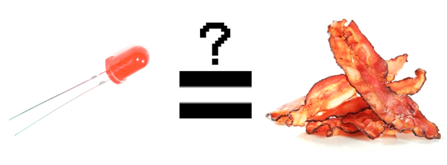
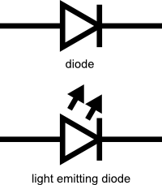
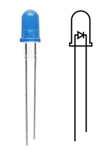
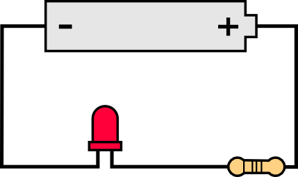
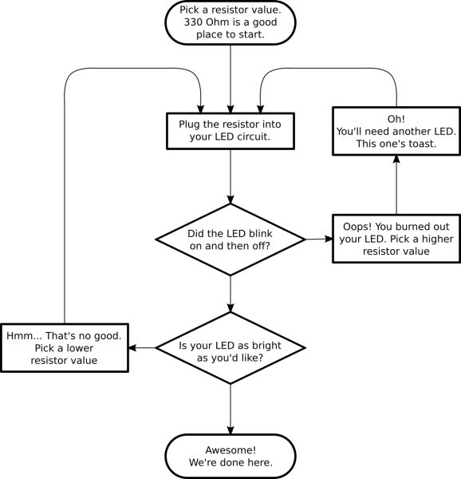
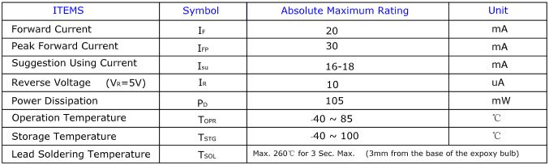
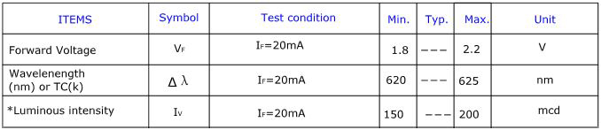
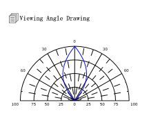
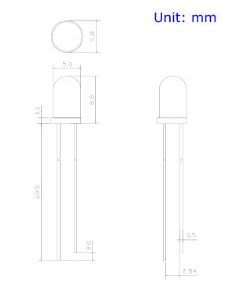

# 発光ダイオード（LED）

**LEDは私たちの身の回りのいたるところにある。**
スマートフォンにも、車にも、家庭の中にも使われている。
何か電子機器が光っているとき、その裏にはたいていLEDがいる。
LEDには実にさまざまな大きさ、形、色があるが、見た目がどうであれ共通点がひとつある。
どんなプロジェクトにも「加えるとうれしくなる」部品だということである。



まずは基本から押さえよう。
そもそもLEDとは何なのか。

LED（エルイーディー）は、電気エネルギーを光に変換する特殊な種類の[ダイオード](./diodes.md)である。
実際、LEDは「Light Emitting Diode（発光ダイオード）」の略であり、名は体を表している。
このことは、ダイオードとLEDの回路図記号がよく似ていることにも表れている。



つまり、LEDは小さな電球のようなものである。
ただし、点灯させるのに必要な電力は電球よりもはるかに少ない。
エネルギー効率も高いため、従来の電球のように熱くなることもあまりない（大電力を流した場合は別だが）。
そのため、モバイル機器のような低消費電力の用途に最適である。
とはいえ、高出力の世界でも侮れない。
高輝度LEDはアクセント照明やスポットライト、さらには自動車のヘッドライトにまで使われるようになっている。

参考になるチュートリアル:

- [電気とは何か](./what-is-electricity.md)
- [回路とは何か](./what-is-a-circuit.md)
- [電圧、電流、抵抗とオームの法則](./voltage-current-resistance-and-ohms-law.md)
- [メートル法の接頭辞とSI単位](./metric-prefixes-and-si-units.md)
- [電力](./electric-power.md)
- [極性](./polarity.md)
- [ダイオード](./diodes.md)

## LEDの使い方

LEDをあらゆるものに取り付けたくなってきただろうか。
そうなるだろうと思っていた。

ここでいくつかのルールを押さえておこう。

### 1. 極性が重要である

電子工学における[極性](./polarity.md)とは、回路部品が対称かどうかを示すものである。
LEDはダイオードの一種であるため、電流を一方向にしか流さない。
そして電流が流れなければ、光も出ない。
幸い、これはLEDを逆向きに接続しても壊れないということでもある。
単に動作しないだけである。



LEDの正極側は**アノード**と呼ばれ、リード線（脚）が長いほうで見分けられる。
もう一方の負極側は**カソード**と呼ばれる。
電流はアノードからカソードへとしか流れない。
LEDが逆向きに取り付けられていると、電流の流れをせき止めてしまい、回路全体が正しく動作しなくなることがある。
LEDを追加したら回路が動かなくなっても慌てず、まずは向きを反転させてみよう。

### 2. 電流が多いほど、光も強くなる

LEDの明るさは、そこに流れる電流量に直接左右される。
これには2つの意味がある。
ひとつは、非常に明るいLEDほど電池を早く消耗させるということである。余分な明るさは余分な電力から生まれているからである。
もうひとつは、LEDに流れる電流量を調整することで、明るさをコントロールできるということである。
とはいえ、電流を抑える理由は雰囲気づくりだけではない。

### 3. 電力にも「かけすぎ」がある

LEDを電流源に直接つなぐと、許される限りの電力を消費しようとして、悲劇の主人公さながらに自らを破壊してしまう。
だからこそ、LEDに流れる電流量を制限することが重要になる。

そのために使うのが抵抗器である。
抵抗器は回路内の電子の流れを制限し、LEDが過大な電流を引き込もうとするのを防いでくれる。
心配は要らない。
最適な抵抗値を求めるには、ちょっとした基本的な計算をするだけでよい。
詳しくは[抵抗器のチュートリアル](./resistors.md)の応用例の節を参照してほしい。

こうした計算に身構える必要はない。
実際には、そこまでひどく失敗することは難しい。
次のセクションでは、電卓を使わずにLED回路を組む方法を紹介する。

## 計算なしでLEDを使う

データシートの読み方を説明する前に、まずはLEDを実際につないでみよう。
これはLEDのチュートリアルであって、読解のチュートリアルではないのだから。

これは数学のチュートリアルでもないので、LEDを動かすための経験則をいくつか紹介する。
前のセクションの内容から察しがついているかもしれないが、必要なのは電池、抵抗器、LEDである。
電源には電池を使う。入手しやすく、危険なほど大きな電流を供給する心配もないからである。

LED回路の基本形は非常にシンプルで、電池、抵抗器、LEDを直列につなぐだけである。
次のようになる。



### 330Ω抵抗器

たいていのLEDには**330Ω**（橙、橙、茶）の抵抗器がちょうどよい値になる。
前のセクションの情報を使って正確な値を求めることもできるが、ここでは計算なしでLEDを扱う方法を紹介しているので、まずは上の回路に330Ωの抵抗器を差し込んで、何が起きるか見てみよう。

### 試行錯誤

抵抗器の興味深い性質は、余分な電力を熱として放出するということである。
そのため、抵抗器が温かくなっているようなら、もう少し小さい抵抗値に変えたほうがよいだろう。
逆に、抵抗値が小さすぎるとLEDを焼き切ってしまう危険がある。
手元にいくつかLEDと抵抗器を用意して試せる場合は、次のようなフローチャートに沿って試行錯誤しながら回路を設計するとよい。



### コイン電池でのLED「スロウィー」

LEDを光らせるもうひとつの方法は、コイン電池に直接つなぐだけというものである。
コイン電池は、LEDを傷めるほどの電流を供給できないため、直接接続してしまってかまわない。
[CR2032コイン電池](https://www.sparkfun.com/products/338)をLEDのリード線の間に挟むだけでよい。
LEDの長いほうの脚が、電池の「+」と表示されている側に触れるようにする。
あとはテープを巻いて磁石を付ければ、どこにでも貼り付けられる「スロウィー」の完成である。

もちろん、試行錯誤の方法でうまくいかない場合は、電卓を取り出してきちんと計算することもできる。
心配はいらない。回路に最適な抵抗値を計算するのはそれほど難しくない。
ただし、最適な抵抗値を求める前に、まずはLEDにとって最適な電流値を知る必要がある。
そのためにデータシートを見てみよう。

## データシートを読み解く

見慣れないLEDをいきなり回路につなぐのは、あまり健全なことではない。
まずはそのLEDのことをよく知ろう。
そのための一番の方法が、データシートを読むことである。

例として、[Basic Red 5mm LED](https://www.sparkfun.com/products/9590)のデータシートを見てみよう。

### LEDの電流

表の上から順に見ていくと、まず次のような表に出会う。



これは何を意味しているのだろうか。

表の1行目は、そのLEDが連続的に許容できる電流の大きさを示している。
この場合、20mA以下であれば安全に使え、20mAでもっとも明るく点灯する。
2行目は、短時間だけ流してよい最大のピーク電流を示している。
このLEDは短時間であれば30mAまでの急な電流上昇に耐えられるが、その電流を長く維持するのは避けたほうがよい。
このデータシートには、上から3行目に16〜18mAという安定した動作電流の範囲まで書かれており、これが抵抗値を計算する際の目標値としてちょうどよい。

その下の数行は、このチュートリアルの目的にとってはそれほど重要ではない。
逆電圧はダイオードの特性のひとつで、たいていの場合気にする必要はない。
消費電力は、LEDが損傷を受けずに使えるミリワット単位の電力量を示している。
LEDを推奨される電圧と電流の範囲内で使っている限り、この点は自然とクリアできるはずである。

### LEDの電圧

他にどんな表があるか見てみよう。



これは便利な表である。
1行目は、LEDにかかる**順方向電圧降下**を示している。
「順方向電圧」という言葉は、LEDを扱う際に頻繁に登場する。
この数値を見れば、回路がLEDに供給すべき電圧の大きさが分かる。
1つの電源に複数のLEDを接続する場合、この数値は特に重要である。
すべてのLEDの順方向電圧を合計した値が、供給電圧を超えることはできないからである。
この点については、このチュートリアルの後半でさらに詳しく扱う。

### LEDの波長

この表の2行目には、光の波長が示されている。
波長とは、光の色を非常に厳密に表現する方法だと考えればよい。
この数値には多少のばらつきがあるため、表には最小値と最大値が示されている。
このLEDの場合は620〜625nmであり、赤色のスペクトル（620〜750nm）の中でも下限に近い波長である。
波長についても、このチュートリアルの後半でさらに詳しく取り上げる。

### LEDの明るさ

表の最後の行（「光度」とラベル付けされている）は、そのLEDがどれだけ明るく光れるかを示す指標である。
単位のmcd、つまり**ミリカンデラ**は、光源の強さを測るための標準的な単位である。
このLEDの最大光度は200mcdであり、これは人の目を引くには十分だが、懐中電灯ほどの明るさではないという程度である。
200mcdであれば、インジケーターとして使うのにちょうどよい。

### 配光角



次に登場するのは、LEDの配光角を表す扇形のグラフである。
LEDのスタイルによって、レンズや反射板を使って光を一点に集中させたり、逆に広範囲に拡散させたりする設計になっている。
あらゆる方向に光子を放つ投光器のようなLEDもあれば、真正面から見ないと光っているかどうか分からないほど指向性の強いLEDもある。
このグラフを読むには、グラフの真下にLEDが直立していると想像するとよい。
グラフの「放射状の線」は配光角を表し、円形の線は最大強度に対する割合（パーセント）で強度を表している。
このLEDは配光角がかなり狭い。
LEDを真上（真下）から見たときにもっとも明るいことが、0度の位置で青い線が一番外側の円と交わっていることから分かる。
光の強さが半分になる角度、つまり50%配光角を求めるには、グラフ上で50%の円をたどっていき、青い線と交わったところから、一番近い放射状の線をたどって角度を読み取る。
このLEDの場合、50%配光角はおよそ20度である。

### 寸法



最後に、機構図がある。
この図には、LEDを実際に筐体に取り付けるために必要な寸法がすべて記載されている。
たいていのLEDと同じく、このLEDにも底部に小さなフランジ（つば）が付いていることに注目してほしい。
これはパネルに取り付けるときに役立つ。
LED本体にぴったり合う大きさの穴をあけておけば、フランジが引っかかってLEDが落ちるのを防いでくれる。

データシートの読み方が分かったところで、世の中にはどんな種類のLEDがあるのか見ていこう。

## LEDの種類

おめでとう、これで基本は身についたはずである。
すでにいくつかLEDを手に入れて、あちこち光らせ始めているかもしれない。
それは素晴らしいことである。
それでは、標準的なLED以外の、もう少し凝ったLEDについても紹介しよう。

### RGB LED

RGB（赤、緑、青）LEDは、実は3つのLEDが1つにまとまったものである。
とはいえ、3色しか作れないというわけではない。
赤、緑、青は加法混色の三原色であるため、それぞれの強度を調整することで、虹のあらゆる色を作り出せる。
たいていのRGB LEDには4本のピンがあり、それぞれの色に1本ずつと、共通ピンが1本ある。
製品によっては共通ピンがアノードのものもあれば、カソードのものもある。

### 集積回路内蔵LED

#### サイクリングLED

LEDの中には、他よりも「賢い」ものもある。
たとえばサイクリングLEDがそうである。
このLEDの内部には実際に[集積回路](./integrated-circuits.md)が組み込まれており、外部の制御回路なしにLED自身が点滅できるようになっている。
これをただ電源につなぐだけで、あとは自動的に動作してくれる。
外部の制御回路を組み込むスペースがないものの、もう少し動きのある演出をしたいプロジェクトに最適である。
何千もの色を巡回するRGBの点滅LEDまである。

#### アドレサブルLED

個別に制御できるタイプのLEDもある。
数珠つなぎにした個々のLEDを制御するために、さまざまなチップセット（WS2812、APA102、UCS1903など）が使われている。

#### 抵抗内蔵LED

抵抗が内蔵されたLEDというものも存在する。
これらのLEDには、電流を制限するための小さな抵抗が組み込まれている。
電源に直接つなぐだけで点灯させることができ、3.3V、5V、9Vでの動作が確認されている。

> [!NOTE]
> 抵抗内蔵LEDのデータシートによれば、推奨される順方向電圧はおよそ5Vである。
> 5Vでテストすると約18mAが流れる。
> 9V電池での負荷テストでは約30mAが流れ、これは入力電圧としてはかなり高めの範囲にあたる。
> 電圧を高くしすぎるとLEDの寿命が縮まる。
> およそ16Vの負荷テストでは、このLEDは焼き切れてしまった。

### 表面実装（SMD）パッケージ

SMD LEDは、特定の種類のLEDというよりはパッケージの形式である。
電子機器がどんどん小型化する中で、メーカーはより小さな空間により多くの部品を詰め込む方法を編み出してきた。
SMD（表面実装部品）は、標準タイプの部品を小型化したものである。
SMD LEDにはさまざまなサイズがあり、かなり大きなものから、米粒より小さなものまである。
非常に小さく、脚ではなくパッドを持つため標準タイプほど扱いやすくはないが、スペースに余裕がない場合には最適な選択肢になりうる。

SMD LEDはまた、ピックアンドプレース装置を使って大量のLEDをPCBやテープにすばやく実装するのにも向いている。
これらすべての部品を手作業ではんだ付けするのは、あまり現実的ではないだろう。

### 高出力LED

LuxeonやCREEといったメーカーの高出力LEDは、桁違いに明るい。
一般に、1ワット以上の電力を消費できるLEDは高出力LEDと見なされる。
これらは、高性能な懐中電灯によく使われる高級なLEDである。
これらを並べた配列は、スポットライトや自動車のヘッドライトにも使われる。
これほど大きな電力が流れるため、放熱板が必要になることが多い。
放熱板とは、表面積の大きな熱伝導性の金属の塊であり、余分な熱をできるだけ多く周囲の空気に逃がす役割を持つ。

高出力LEDは、適切に冷却しないと自らを傷めてしまうほどの熱を発生させることがある。
「余分な熱」という言葉に惑わされないでほしい。
それでも、これらの部品は従来の電球に比べればはるかに効率がよい。
制御には、定電流LEDドライバーを使うとよい。

### 特殊なLED

可視光の範囲外の光を放つLEDも存在する。
たとえば赤外線LEDは、日常的に使っているものが多いはずである。
テレビのリモコンなどで、目に見えない光の形で小さな情報を送るのに使われている。
これらは標準的なLEDと見た目がよく似ているため、区別が難しいこともある。

一方で、スペクトルの反対側には紫外線LEDもある。
紫外線LEDは、ブラックライトのように特定の素材を蛍光させる。
多くの細菌が紫外線に弱いため、表面の消毒にも使われている。
偽造防止（紙幣、クレジットカード、書類など）や日焼けなど、用途は多岐にわたる。
これらのLEDを使うときは、必ず保護メガネを着用すること。

これだけ凝ったLEDが手元にあれば、あらゆるものを光らせない理由はない。
とはいえ、LEDについての知識欲がまだ満たされないなら、続きを読んでほしい。
LED、色、光度についてさらに掘り下げていく。

## さらに深く

LED入門を卒業して、もっと知りたくなっただろうか。
心配は要らない、まだまだ話すことがある。
LEDを動かしている（あるいは点滅させている）科学的な仕組みから見ていこう。
LEDが特殊な種類のダイオードであることはすでに触れたが、それが具体的に何を意味するのかをもう少し掘り下げてみよう。

私たちが「LED」と呼んでいるものは、実際にはLED本体とパッケージを合わせたものだが、LED本体そのものは実はとても小さい。
それは不純物をドープした半導体材料のチップであり、電荷キャリアのための境界（pn接合）を作り出している。
電流が半導体に流れ込むと、電子はこの境界の片側からもう一方へと飛び移り、その過程でエネルギーを放出する。
たいていのダイオードでは、このエネルギーは熱として失われるが、LEDではこのエネルギーが光として放出される。

光の波長、つまり色は、そのダイオードを作る半導体材料の種類によって決まる。
これは、半導体のエネルギーバンド構造が材料ごとに異なり、その結果、放出される光子の周波数も異なってくるためである。

光度を放出する強さは、半導体のバンドギャップに依存する波長とは異なり、ダイオードに流れる電力の大きさに依存する。
光度についてはすでに前のセクションで少し触れたが、単に明るさに数値を付けるだけでは語り尽くせない話がある。

光度を測る単位はカンデラと呼ばれるが、1個のLEDの明るさについて話すときは、たいていミリカンデラの範囲になる。
この単位の興味深い点は、それが単純な光のエネルギー量の測定ではなく、実際の「明るさ」そのものを測る指標だということである。
これは、特定の方向に放出される電力を、その光の視感度関数によって重み付けすることで求められる。
人間の目はある波長の光には敏感で、別の波長にはそれほど敏感ではないが、視感度関数はその感度の違いを考慮した標準化されたモデルである。

LEDの光度は、数十ミリカンデラから数万ミリカンデラまで幅広い。
テレビの電源ランプはおよそ100mcd程度であるのに対し、性能のよい懐中電灯は20,000mcdにも達することがある。
数千ミリカンデラを超える明るさのものを直視するのは目を痛める可能性があるため、試さないほうがよい。

### 順方向電圧降下

先ほど、順方向電圧降下という概念についても説明すると約束していた。
データシートを見ていたときに、回路内のすべてのLEDの順方向電圧を合計した値がシステム電圧を超えることはできないと述べたのを覚えているだろうか。
これは、回路内のすべての部品が電圧を「分け合わなければならない」ためであり、それぞれの部品が使う電圧の合計は、常に利用可能な電圧の総量と等しくなる。
これは[キルヒホッフの電圧則](https://ja.wikipedia.org/wiki/キルヒホッフの回路法則)と呼ばれる。
そのため、5Vの電源があり、それぞれのLEDの順方向電圧降下が2.4Vだとすると、同時に点灯できるLEDは2個までということになる。

キルヒホッフの法則は、他の部品の順方向電圧から、ある部品にかかる電圧を概算したいときにも役立つ。
たとえば先ほどの例で、5Vの電源に2個のLED（それぞれ順方向電圧降下2.4V）を接続する場合を考えてみよう。
もちろん電流制限用の抵抗器も回路に含めたいところである。
その抵抗器にかかる電圧はどう求めればよいだろうか。
これは簡単である。

```
5（システム電圧） = 2.4（LED1） + 2.4（LED2） + 抵抗器
5 = 4.8 + 抵抗器
抵抗器 = 5 - 4.8
抵抗器 = 0.2
```

つまり、抵抗器には0.2Vがかかっていることになる。
これは単純化した例であり、実際にはいつもこれほど簡単というわけではないが、順方向電圧降下がなぜ重要なのかがイメージできたはずである。
キルヒホッフの法則から求めた電圧の値を使えば、オームの法則を使ってある部品に流れる電流を求めることもできる。
要するに、**システム電圧は、回路内のすべての部品の順方向電圧の合計とちょうど等しくなるようにしたい**ということである。

### 電流制限抵抗の計算

LEDに直列に入れる電流制限抵抗の正確な値を計算したい場合は、[抵抗器のチュートリアル](./resistors.md)の応用例を参照してほしい。
より詳しい情報が載っている。

## まとめ

これでLEDについて、ほとんどすべてと言えるほどのことを学んだはずである。
さあ、思う存分あらゆるものにLEDを取り付けてみよう。

LEDに関連する話題についてさらに学びたいなら、次のチュートリアルもおすすめである。

- [光](./light.md)：光は電気工学者にとって役立つ道具である。光と電子工学の関係を理解することは、多くのプロジェクトにとって基本的なスキルである。
- [赤外線通信](./ir-communication.md)：一般的な赤外線（IR）通信の仕組みと、Arduinoを使った簡単な赤外線送受信機の作り方を解説する。
- [LEDはどうやって作られるのか](./how-leds-are-made.md)：LEDメーカーを訪ね、SparkFunのために作られているPTH 5mm LEDがどのように製造されているかを紹介する。

タグ: 部品、電気工学、LED、光、技術

---

出典：[Light-Emitting Diodes (LEDs)](https://learn.sparkfun.com/tutorials/light-emitting-diodes-leds)（SparkFun Learn）を日本語に翻訳し、再構成した。
原文は [CC BY-SA 4.0](https://creativecommons.org/licenses/by-sa/4.0/) ライセンスで公開されており、本ページも同ライセンスの下で提供する。
