# 光

光を操ることは、電子工作愛好家にとって非常に役立つスキルである。
照明から[距離測定](https://www.sparkfun.com/distance_sensing)まで、光は電子的なものと物理的なものを、実にさまざまな有用な形で橋渡ししてくれる。

## 波長

ある光の束を特徴づける鍵となる要素は、その**波長**である。
光は波として空間を伝わり、2つの波の山の間の距離がその光の波長である。
人間にとって、波長は光の色を決める要素である。

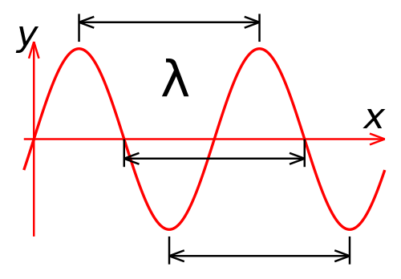

物理学において物事は決して単純にはいかないもので、光の束は**光子**と呼ばれる粒子の流れとしてもふるまう（マゾヒスティックな人は[光の波動粒子二重性についてのこの記事](https://ja.wikipedia.org/wiki/波動と粒子の二重性)を参照してほしい）。
波長が短い光ほど、1つの光子あたりのエネルギーが大きくなる。

## 強度

光の束を特徴づけるもうひとつの要素が強度である。
[放射強度](https://ja.wikipedia.org/wiki/放射強度)は、アイスクリームコーンの先端にある円で囲まれた球面をエネルギーが横切る速さ、つまりワット毎ステラジアンで測定される。
これを理解するために、中心にごく小さな星がある球体を想像してみよう。
光はその星からあらゆる方向に均等に広がっていく。
今度は、その星の中心を頂点とし、球の表面まで伸びるアイスクリームコーンを追加する。
このコーンの底の角度は1ラジアンである（円には2πラジアンが含まれており、1ラジアンはおよそ57.3度である）。
このアイスクリームコーンによって定義される面積を[ステラジアン](https://ja.wikipedia.org/wiki/ステラジアン)と呼ぶ。

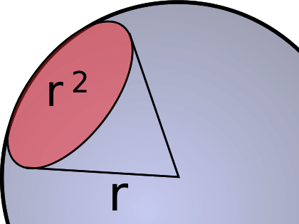

## 可視光と不可視光

光について語るとき、私たちがたいてい思い浮かべるのは**可視光**、つまり虹や日光のあの素晴らしいものである。
しかし光は実際には、非常に幅広い波長の範囲にわたって存在している。
これは電磁スペクトルと呼ばれる。

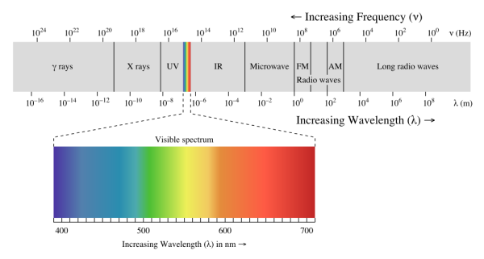

一方の端には、生命とは根本的に相容れない、有害で高エネルギーの電離放射線であるガンマ線やX線がある。
もう一方の端には、非常に低い周波数で波長の長い電波があり、これは広大な距離を越えて情報を運び、宇宙の始まりそのものを垣間見せてくれる。

この記事では、可視光と、それにもっとも近い領域である赤外線と紫外線に絞って扱う。
紫外線から遠赤外線にかけては、光は私たちが可視光で見慣れているのとかなり似たふるまいをする。影ができ、レンズで焦点を合わせられ、白い紙のようなもので拡散できる、といった具合である。
それより長い、あるいは短い波長の領域に踏み込むと、物事は奇妙になり始めるため、それについては別の機会に譲ることにする。

ここでは、光を紫外線、可視光、赤外線という3つのグループに分けて説明する。
紫外線は可視光よりわずかに波長が短い光であり、赤外線はわずかに波長が長い光である。
この3つのグループの中では、可視光と赤外線のほうが電子工学においていくらか使い道が多く一般的であるため、それらについてより多くの時間を割くことにする。

## 紫外線

[紫外線](https://ja.wikipedia.org/wiki/紫外線)は10nmから400nmの間の光であり、X線と可視光の間に位置する。
紫外線は生命体にとって非常に有害なことがあり、もっともよく知られている影響は日焼けだろう。

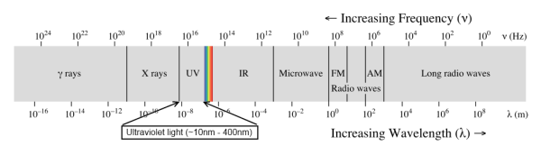

### UVA

UVA（波長315nm〜400nm）は、紫外線の中でもっともエネルギーの低い帯域である。
これは人間にはほぼ見えないが、多くの昆虫、さらには一部の鳥はこの光の帯域を見ることができる。
白色蛍光灯や白色LEDは、UVA光を素材に当てることで、その素材がUVA光子を吸収し、可視スペクトルの光子を放出する（私たちには白く見える）という仕組みで動作している。

UVAは、偽造文書の検出にもよく使われる。
偽造対策として、多くの文書（パスポート、運転免許証、紙幣など）には、UVA放射線を当てると光る透かしが入っている。
ブラックライトポスターも、UVA光に反応するもののひとつの例であり、漂白剤、石鹸、そして多くの生体材料もUVA光を当てると光る。

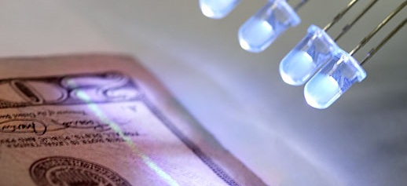

太陽光に含まれるUVA光のほとんどは地表に到達する。

### UVB

UVB（280nm〜315nm）は、UVAよりも高いエネルギーレベルの光である。
これは太陽光に含まれており、日焼けや皮膚がんを引き起こす肌へのダメージだけでなく、人体内でのビタミンDの合成にも関与している。
また溶接トーチからも発生し、たとえ十分な距離があっても、防護なしでその閃光を短時間見ただけで深刻な目の損傷を引き起こすことがある。

UVB光は通常の窓ガラスによってかなりよく遮断される。これが、開いた車の窓から腕を出しているとその腕だけが日焼けしてしまう理由である。
[リチャード・ファインマン](https://ja.wikipedia.org/wiki/リチャード・P・ファインマン)（ノーベル賞受賞者であり、ボンゴ奏者としても知られる）は、トリニティ核実験の爆発を観察する際、爆発が放つ紫外線放射から身を守るため、ピックアップトラックのフロントガラスを使ったという。

太陽が放出するUVB光のうち、地表に到達するのはおよそ10%に過ぎず、残りの90%は大気（主にオゾン層）に吸収される。

#### UVC

UVC（100nm〜280nm）は、私たちにとって興味深い紫外線の限界にあたる帯域である。
太陽が発するUVCのほとんどは地表に到達せず、大気がそれを非常に効果的に遮っている。

電子的に消去や書き換えができるEEPROMやフラッシュメモリが登場する以前の悪しき時代には、不揮発性で非磁気的な電子データストレージの手段はEPROMしかなかった。
一度書き込まれたEPROMは、強力なUVC光源に20〜30分間さらすことでしか消去できなかった。
趣味でやっている人にとって、書き換えたコードがバグを修正できたかどうかを確かめるのに、それだけ待たされるのは長い時間である。

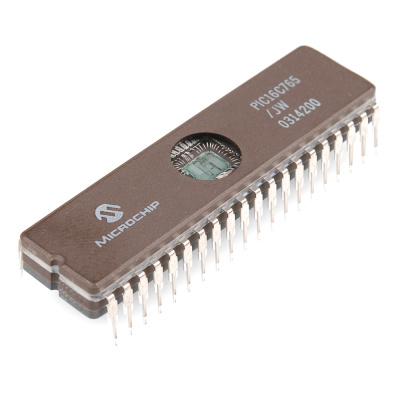

## 可視光

可視光は、およそ380nmから740nmの範囲の光である。
これには個人差があり、これより短い、あるいは長い波長の光を検知できる目を持つ人もいるが、一般にたいていの人の目はこの領域に感度を持っている。

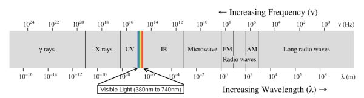

### 人間の目

人間の目が光を知覚する方法には、2つの特異な点がある。目はそれぞれの波長に対して異なる感度を持っていることと、光の強度を線形ではなく対数的に知覚することである。

#### 色の知覚

このグラフに示されているように、私たちの目はそれぞれの波長の光を異なる効率で拾い上げ、知覚された強度を混ぜ合わせることで「色」と呼ぶものを作り出している。
さらに、光量が少ない状況では、私たちの色の知覚が歪んでしまうことも分かる。

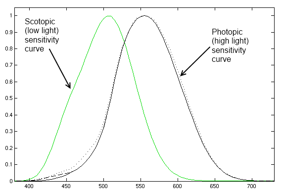

このため、光の強度を表す特別な単位である**カンデラ**が作られた。
カンデラは、光源の色に応じて強度を重み付けしたものであり、人間の目には、波長が違っていても1カンデラの光源はどれも同じくらいの明るさに知覚される。
LEDの明るさはたいていミリカンデラ（mcd）で表され、色によって知覚される強度の違いを示すよい例が、RGB LEDの明るさである。たとえば赤が800mcd、緑が4000mcd、青が900mcdといった具合である。
下のグラフには、この3色の波長（625nm、520nm、467.5nm）を示してある。

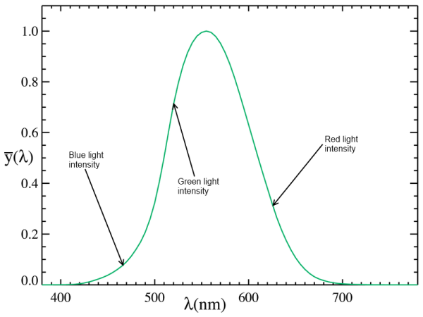

人間の目は、異なる波長の光を混ぜ合わせることで、実際には存在しない波長の光を検知しているかのように錯覚させることができる。たいていのカラーディスプレイはこの原理で動作している。
実際に使われている色はたった3色（何らかの赤、緑、青）だけであり、この3色の光をさまざまな強度で混ぜ合わせることで、自然界のほとんどの色（少なくとも私たちの目にとっては）を再現できる。

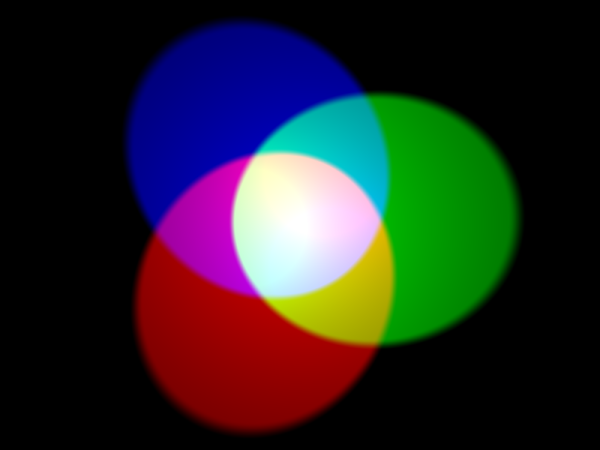

#### 強度の知覚

私たちは自然に、光を線形な現象だと考えがちである。
2つの光源があったとき、片方がもう片方の2倍明るいと感じることは十分にありうる。
これが色によってどう影響を受けるかはすでに見てきたが、今度は単一の色の光の強度と、それに対する私たちの知覚との関係を考えてみよう。
LEDの強度は、それを駆動する電流に対して線形に変化する。

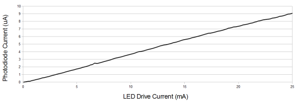

ちょっとした実験をしてみよう。
Arduino、ブレッドボード、抵抗器、LED、プッシュボタンがあれば、次の回路を組んで、コードをダウンロードし、Arduinoに書き込んでみてほしい。

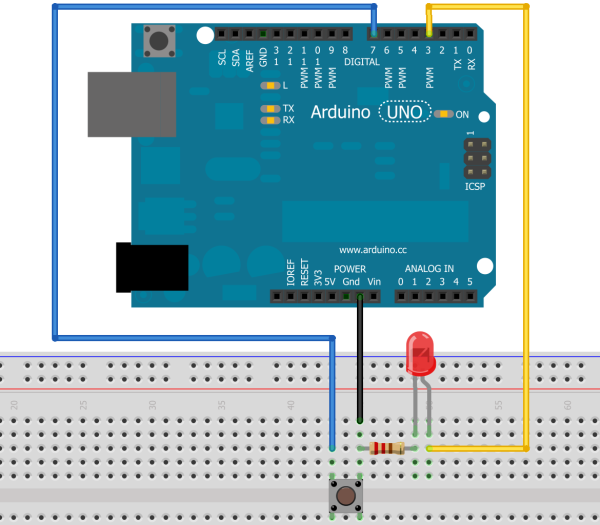

この回路はとても単純である。ボタンを1回押すとLEDが点灯する。
押したまま保持すると、LEDは徐々に明るくなっていく。
離すと、LEDの明るさが増えるのが止まり、Arduinoはシリアルポート経由で、押し始めたときと比べてどれだけ明るくなったかを出力する。
LEDが最初の2倍の明るさになったところで止めてみてほしい。

これがなぜこんなに難しいのだろうか。
LEDの光の出力は線形であるため、LEDに流れる電流を2倍にすれば、放出される光のエネルギー量も2倍になる。
しかし私たちの目は線形には反応せず、対数的に反応する。
理由は単純である。私たちの目は、星明かりから日中の明るさまで、あらゆる照明条件にわたって有用な情報を提供する必要がある。
雲のない満月の夜、光の強度は晴れた日中のわずか44万分の1程度しかないが、それでも私たちの目はその両極端、そしてその間のあらゆる状況で正常に機能しなければならない。
これが、線形な光源の相対的な明るさを判断するのを非常に難しくしている。

#### 色覚異常

色覚異常は、その名前から連想されるような、単純に色を知覚できないという症状ではない。
実際には色覚異常には多くの種類があり、もっとも一般的な赤緑色覚異常は、男性人口のおよそ10%に何らかの形で影響を与えている。

色覚異常は[簡単な検査](http://www.micro.magnet.fsu.edu/primer/java/humanvision/colorblindness/index.html)で診断でき、これは同じような大きさの点で構成された背景の中から、異なる色の点で作られた模様や記号を識別できるかを調べるものである。

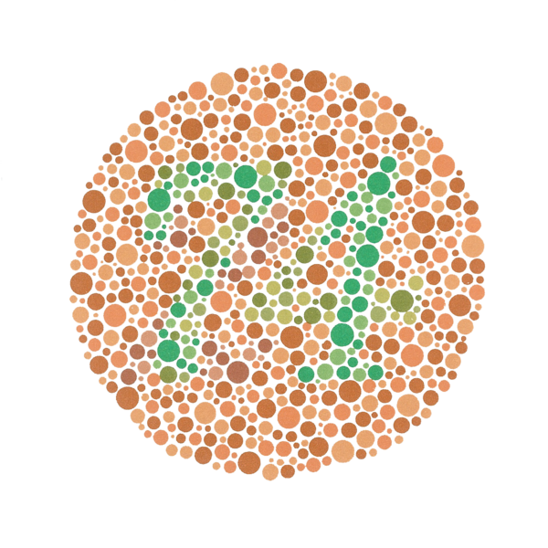

色覚異常を持つ人々への配慮として、情報を伝えるために色だけに頼らないようにしてほしい。
悪い設計の例としては、ある状態を示すために色が変わるLED（緑は「正常」、赤は「失敗」）、数値と地域を結びつけるために色の範囲を使う地図、白地に黒か黒地に白以外の文字色などが挙げられる。

## 赤外線

赤外線は、可視光よりも波長が長く、マイクロ波よりも波長が短い光である。
慣例的に700nmから始まり1mm（1,000,000nm）までとされており、紫外線や可視光よりもはるかに広いスペクトルの領域を占めている。
太陽から地表に届く光エネルギーのおよそ55%は赤外線である。

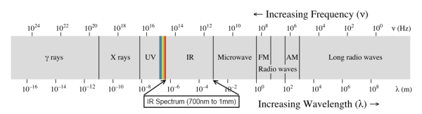

### 近赤外線

**近赤外線**は電子工学において非常に興味深い領域である。これは、赤外線リモコン、物体センサー、距離検出器が動作する領域である。
これは可視光の範囲のすぐ上にあり、半導体技術で作り出すことも検知することも非常に簡単である。

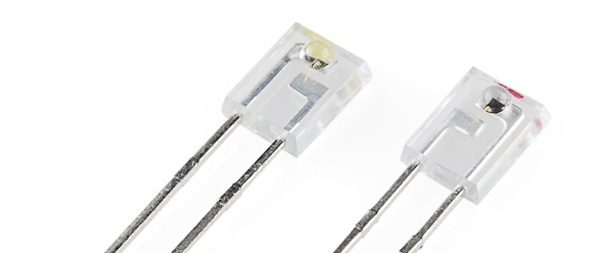

近赤外線の帯域は1400nmまで広がっている。
よく使われる発光波長は850nmと950nmである。
私たちの周りには常に膨大な量の近赤外線が存在しており、赤外線を使った信号伝達やセンシングが干渉を受ける可能性は大きい。
たいていの赤外線信号システム（赤外線リモコンなど）は、望まない波長の光を除去しようとするのではなく、決まった周波数でビームを変調することでこの問題を解決している。

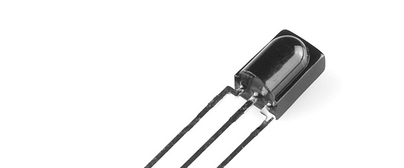

近赤外線はデジタルカメラでもよく検知される。
あまりによく検知されるため、たいていのデジタルカメラには赤外線の波長を遮断する物理的なフィルターが搭載されている。
このフィルターを取り外せば、赤外線領域での感度を高めることができる。
可視光を遮り赤外線だけを通す単純なフィルターは、35mmフィルムのネガから作ることができる。写真の写っていないフィルムロールの端の部分がちょうどよい。

### 長波長赤外線

長波長赤外線は8000nm〜15000nmの範囲の光である。
これはサーモグラフィーの領域であり、物の相対的な温度を示すあの見事な疑似カラー画像はここから生まれている。

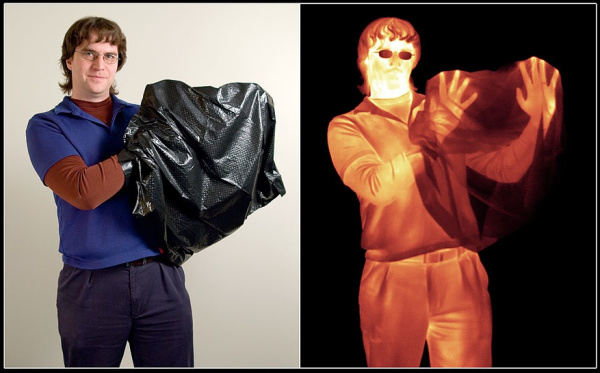

近赤外線イメージングと長波長赤外線イメージングの違いを誤解するのは、よくある間違いである。
近赤外線イメージングは比較的簡単に実現できる。標準的なCMOSやCCDのイメージングチップは、近赤外線領域の光を簡単に検知できる。
一方、長波長赤外線には専用のセンサーが必要である。この光の波長は近赤外線の1000倍も長いため、センサー素子にもそれに応じた大きな構造が必要になる。

この領域のもうひとつの、ますます身近になっている用途がレーザーエッチングとレーザー切断である。
たいていのレーザーカッターは、10640nmの波長でレーザー光を発生させるCO2レーザー管を使っている。

## まとめ

光は魅力的で複雑な存在であり、このチュートリアルではその表面をなぞったにすぎない。
さらに学びたい場合は、次のような優れた情報源を確認してみてほしい。

- [IR Communication（赤外線通信）](./ir-communication.md)
- [IR Control Kit Hookup Guide（赤外線コントロールキットの使い方）](https://learn.sparkfun.com/tutorials/ir-control-kit-hookup-guide)
- [TSL2561 Luminosity Sensor Hookup Guide（TSL2561照度センサーの使い方）](https://learn.sparkfun.com/tutorials/tsl2561-luminosity-sensor-hookup-guide)
- [Wikipediaの紫外線に関する記事](https://ja.wikipedia.org/wiki/紫外線)
- [Wikipediaの可視光に関する記事](https://ja.wikipedia.org/wiki/可視光線)
- [Wikipediaの赤外線に関する記事](https://ja.wikipedia.org/wiki/赤外線)
- [さまざまなレーザーカッターの波長についての記事](http://www.epiloglaser.com/tl_yaginfo.htm)
- [可視光と目にまつわるトリックについての記事](http://www.d.umn.edu/~mharvey/th1501color.html)
- [「Color IQ」テスト：自分の色覚が「正常」にどれだけ近いかを調べられる](http://www.xrite.com/custom_page.aspx?PageID=77)

タグ: 概念、光、物理学

---

出典：[Light](https://learn.sparkfun.com/tutorials/light)（SparkFun Learn）を日本語に翻訳し、再構成した。
原文は [CC BY-SA 4.0](https://creativecommons.org/licenses/by-sa/4.0/) ライセンスで公開されており、本ページも同ライセンスの下で提供する。
