# LilyPadの基礎：導電糸で縫う

## 縫えるエレクトロニクスとは何か

縫えるエレクトロニクス（sewable electronics）は、伝統的な手芸の工程（裁縫、ファッションデザイン、テキスタイルデザイン）と、電気工学、コンピュータサイエンス、ハードウェアのスキルを組み合わせたものである。

縫えるエレクトロニクスを使えば、e-テキスタイル（電子繊維）を作ることができる。
これは、従来の電子工作というよりも手芸やアート作品に近い見た目をした、身に着けられる柔軟なプロジェクトであることが多い。
多くのe-テキスタイルプロジェクトでは、配線の代わりに導電糸や導電性の布のような柔軟な導電性の素材を使う。
このガイドで扱うプロジェクトでは、導電糸を使って回路を縫い合わせていく。

参考になるチュートリアル:

回路という概念に初めて触れるなら、続きを読む前に次のチュートリアルにも目を通しておくとよい。

- [回路とは何か](./what-is-a-circuit.md)
- [電圧、電流、抵抗とオームの法則](./voltage-current-resistance-and-ohms-law.md)
- [電気とは何か](./what-is-electricity.md)
- [極性](./polarity.md)

## LilyPadとは何か

LilyPadシステムは、柔らかく、縫うことができ、インタラクティブなe-テキスタイルプロジェクトを作るために設計された、縫い付け可能な電子部品の集まりである。
LilyPadの部品を使うことは、手芸というレンズを通して電子工作を実験する優れた方法である。
それぞれのLilyPadの部品には、縫いやすいように大きな導電性の縫い付けタブが付いており、布を引っかけたり糸を切ったりしないよう、丸みを帯びた形をしている。

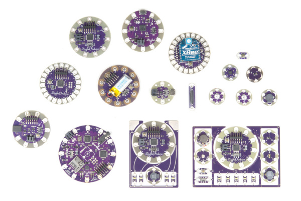

LilyPadシステムは、コロラド大学ボルダー校でコンピュータサイエンスの博士号を取得する過程にあった、Leah Buechleyによって設計された。
2007年に発売された商用版キットは、LeahとSparkFun Electronicsが共同で設計したものである。

一部のLilyPadの部品は、ProtoSnapという構成で提供されている。
これは、LED、電池ホルダー、スイッチ、ボタンといった個々の部品が、あらかじめひとつの機能する回路基板としてつながっている構成である。
これにより、プロジェクトに組み込む前に、その回路を思いどおりにプログラムして試すことができる。
ProtoSnap基板は、LilyPadプロジェクトの制作を始める準備が整ったら、個々の部品に簡単に切り離せるように設計されている。

これは、パネル構成で提供されているLilyPad製品とは少し異なる。
LilyPadのLEDはひとつながりになってはいるものの、機能する回路としてつながっているわけではない。
回路に縫い込む前に、それぞれを切り離す必要がある。

## 導電糸とは何か

導電糸は、ステンレス鋼の繊維で作られた特殊な糸である。
銅線の代わりに使うことで、LilyPad（あるいは他のe-テキスタイル）の部品どうしをつないで回路を作ることができる。

[LilyPad Sewable Electronics Kit](https://www.sparkfun.com/products/13927)のようなキットを使っているなら、導電糸のボビンが同梱されているはずである。

> [!NOTE]
> このチュートリアルでは、手縫いの技法を中心に扱うが、導電糸はミシンや刺しゅうミシンでも使うことができる。

## 導電糸で縫う

> [!NOTE]
> このチュートリアルの例では、LilyPadコイン電池ホルダーとLilyPad LEDを手縫いの導電糸回路でつなぐ手順を紹介する。ここで紹介する技法は、どのLilyPadの部品どうしをつなぐ場合にも応用できる。

たいていのLilyPadプロジェクトでは、導電糸を使って電気回路を完成させる。
以降のセクションでは、基本的な縫い方の技法と、導電糸を使って動作する回路を作るためのちょっとしたコツを紹介する。
針と糸の扱いにすでに慣れている場合でも、特にLilyPadの部品を縫う際に役立つ内容が含まれているはずである。

### 部品を固定する

それぞれのLilyPadの部品には、縫い付けタブと呼ばれる、導電性の銀色のパッドが付いた大きな穴がある。
これらのタブは、針と糸を穴に何度も通せるよう、十分な余裕を持って設計されている。
回路を縫い始める前に、つなぎたい縫い付けタブを確認し、デザインの中で扱いやすい位置になるよう向きを調整しておこう。
SparkFunのテンプレートに沿って作業する場合、各部品は縫いやすさと見た目の両方を考慮した、決まった位置に配置されている。

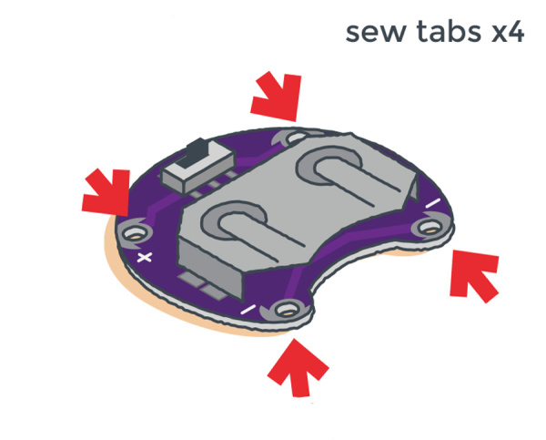

縫っている間にLilyPadの部品がずれないよう、少量のホットグルー（推奨）または布用接着剤で布に固定しておくことをおすすめする。
その際、縫い付けタブの穴を誤ってふさいでしまわないように注意すること。

ステッチをどこに通すか計画するために、マーカーで部品どうしを結ぶ線を描いておくとよい。

### 針に糸を通す

導電糸を60cmほど（およそ2フィート）切り取る。
糸の片端を針の穴（目）に通し、5インチ（約13cm）ほど糸端を残して引き抜く。

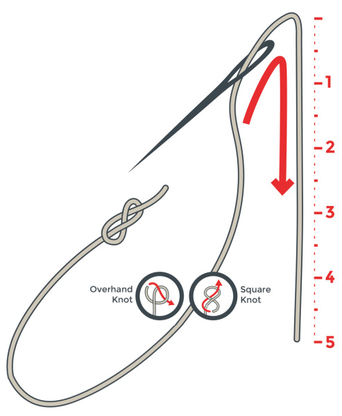

プロジェクトを縫い始める前に、糸が布から完全に抜けてしまわないよう、糸の長いほうの端に結び目を作っておく必要がある。
単純な片結びや本結びでもよい。
次のセクションでは、他にいくつかの結び方も紹介する。

#### スターターノット

スターターノットは、布の上に直接結び目を作って縫い始める方法である。

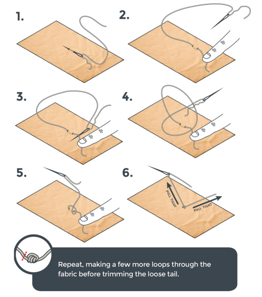

#### キルターズノット

キルターズノットは、もう少し高度な結び方で、糸に手早くしっかりとした結び目を作る方法である。
何度か練習すれば、非常に素早く結べるようになる。

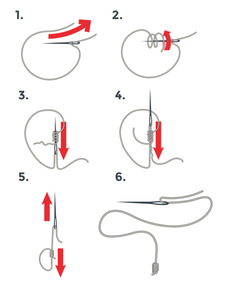

> [!NOTE]
> プロジェクトに取り組んでいる間は、部品を傷めないよう、必ず電池を外しておくこと。

### LilyPadの縫い付けタブへの接続

回路の中でLilyPadの部品どうしをつなぐには、縫い付けタブの周りに導電糸を巻きつけるように縫っていく。
空の縫い付けタブに糸を巻きつけるときは、必ず3〜4回ループさせ、そのたびに糸をしっかりと締めることが重要である。
これにより、糸と縫い付けタブの間に、電気的にも物理的にもしっかりとした接続が生まれる。
次のステッチに進む前に、ループをしっかり締めておくこと。

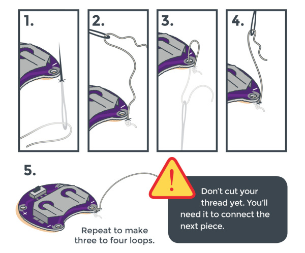

### 縫い方の基本

縫い付けタブの周りにループを縫ったら、ランニングステッチ（並縫い）を使って、1本の連続した導電糸でLilyPadの部品どうしをつないでいく。
次の手順で行う。

1. 針を、縫い進めたい方向へ布の中を約6mm（1/4インチ）進めて刺す。
2. 布にぴったり沿うように、糸のたるみを引いて締める。
3. 縫い進める方向にさらに約6mm、針を布の下から上へ刺す。
4. 布にぴったり沿うように、糸のたるみを引いて締める。

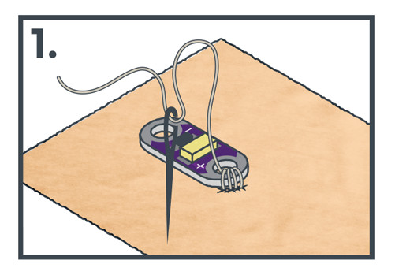

この工程を繰り返しながら、つなぎたい次のLilyPadの部品まで、ステッチの間隔を均一に保ちながら進んでいく。

### ランニングステッチと隠しステッチ

基本的なランニングステッチでは、布の表と裏の両方に均等にステッチが現れる。

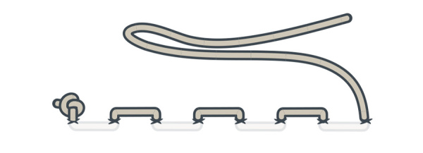

プロジェクトの表面にステッチを見せたくない場合は、プロジェクトの裏側では長めのステッチを、表側では非常に小さなステッチを作るとよい。
この方法は「隠しステッチ」と呼ばれる。

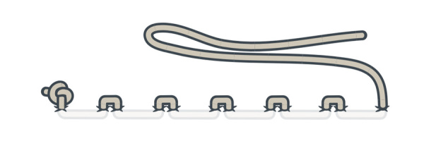

縫っている間は、導電糸が絡まったり結び目ができたりしていないか確認するため、ときどき布を裏返してチェックしよう。
裁縫を始めたばかりであれば、心地よく縫えるようになるまでに多少の練習が必要かもしれない。
焦らず、時間をかけて縫うようにしよう。
もし糸が切れてしまっても、既存の導電糸の上から重ねて縫うことで、電気的な接続を保ちながら続けることができる。

両方のステッチ方法を使えば、1本の導電糸でLilyPadの部品どうしをつなぐことができる。
2つのLilyPadの部品をつなぐには、縫い付けタブの周りに3〜4回ループさせたあと、そのまま縫い続ければよい。

### 複数のLilyPadの部品をつなぐ

3つ以上のLilyPadの部品をつなぐには、糸を切って新しく縫い始めるのではなく、そのまま次の部品まで縫い進め、3〜4回ループさせ、必要な分だけこれを繰り返す。
部品どうしが接続を共有する場合、新しい糸に取り替える必要はない。

### 接続を仕上げる

すべての部品の接続を終えたら、仕上げの結び目を作る。
糸の切れ端が電気的なショートを引き起こすことがあるため、結んだあとは必ず余分な糸を切り取ること。

## 導電糸による短絡（ショート）のチェック

プロジェクトの中に、ほつれた糸や結び目の切れ端が残っていないか注意しよう。
回路の正極（＋）側にある導電糸の切れ端が、うっかり負極（－）側に触れてしまうと、[短絡（ショート）](./what-is-a-circuit.md)が起きることがある。
短絡が起きると、電池が自分自身に接続された状態になり、プロジェクトの残りの部分をバイパスして、電池から望ましくない量の電流が流れ出してしまう。
回路の別の部分のステッチの真上を縫ってしまうことでも、ショートが起きることがある。

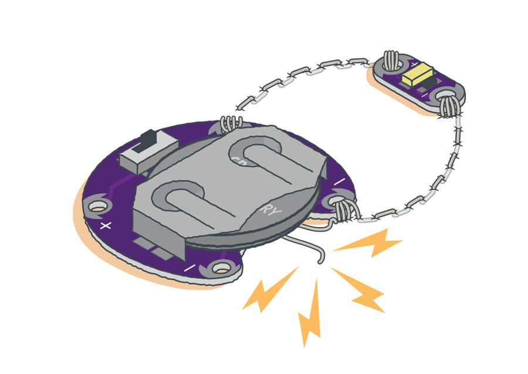

> [!NOTE]
> e-テキスタイルでもっともよくある短絡のひとつは、電池ホルダーの負極タブの近くにあるほつれた糸の切れ端が、電池に触れてしまうことで起きる。プロジェクトに電源を入れる前に、必ず縫い目を確認しよう。

ステッチどうしが交差したり、回路の他の部分に触れたりしないようにすることが重要である。
これらのプロジェクトで使う電池は、短絡しても発火したり感電したりする心配はまずない（熱くなることはある）が、より高い電圧のプロジェクトや電源では危険を伴うこともある。

## 電池を入れて完成した回路をテストする

すべての部品を導電糸でつなぎ終えたら、完成した回路には電源が必要である。
コイン電池を、正極（＋）側を上にして電池ホルダーに入れる。

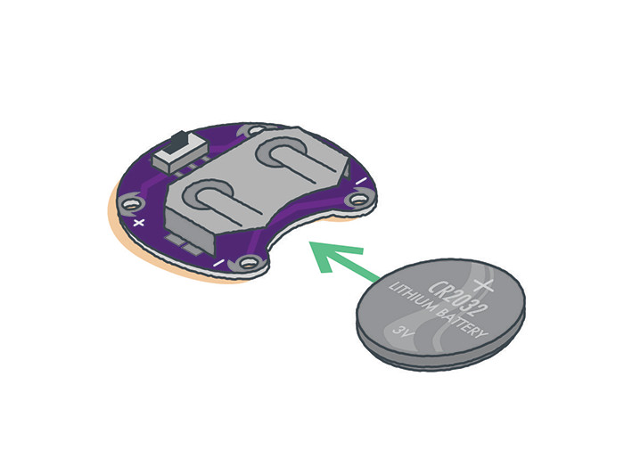

> [!NOTE]
> プロジェクトの作業を続ける必要がある場合は、部品を傷めないよう、必ず電池を取り外しておくこと。

導電糸での接続が終わったら、回路のスイッチを入れて、何が起こるか確認してみよう。
もし回路が動作しない場合は、どこかがショートしているか、接続が緩んでいるか、部品が逆向きになっているか、あるいは単に電池切れかもしれない。

電池ホルダーのスイッチを入れると、導電糸を通じて電流が回路の他の部分へと流れる。

電流と電気についてさらに知りたい場合は、次のチュートリアルも参考になる。

- [What is a Circuit?（回路とは何か）](./what-is-a-circuit.md)
- [What is Electricity?（電気とは何か）](./what-is-electricity.md)

## トラブルシューティング

e-テキスタイルのプロジェクトに取り組んでいると、接続が緩んでLEDが点灯しなかったり、回路が誤動作したりする問題に出会うことがある。

### 回路がときどきしか動かない場合：接続の緩みを確認する

導電糸がLilyPadの部品の縫い付けタブにしっかりと接続されていないと、電流が安定して流れなくなる。
プロジェクトを動かすと、導電糸が縫い付けタブから離れて、回路が切断されてしまうことがある。
対処法としては、可能であればピンセットや針でステッチをしっかりと引き締める。
既存の糸の上から重ねて縫うことで、より強い張力を作り、縫い付けタブにしっかりと糸を固定することもできる。

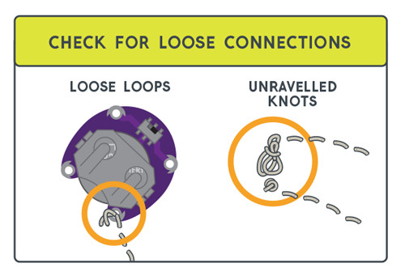

### 回路が動かない場合：極性を再確認する

一部のLilyPadの部品には[極性があり](./polarity.md)、電流が一方向にしか流れない。
回路に誤って縫い込んでしまうと、その部品は機能しない。
縫う前に、縫い付けタブのラベルを再確認し、向きが正しいかどうかを確かめよう。

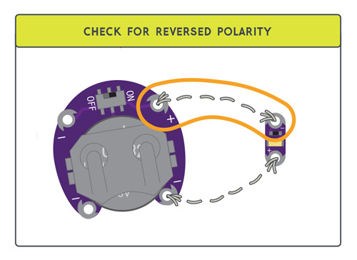

**そのほか確認すべきこと：**

- 電池ホルダーのスイッチがONの位置になっているか確認する
- 電池切れになっていないか確認する。[テスター](./how-to-use-a-multimeter.md)を使って確認できる。予備の電池を試してみるのもよい
- プロジェクトのテンプレートに沿っている場合、部品が正しい構成でつながっているか再確認する

それでも問題が解決しない場合は、テスターを使って導通を確認したり、回路の問題を調べたりすることができる。
[テスターの使い方](./how-to-use-a-multimeter.md)のチュートリアルが助けになるはずである。

## プロジェクトを大切に扱う

被覆のある銅線とは異なり、導電糸には絶縁がされていない。
そのため、糸はむき出しの配線のようにふるまい、はぐれた繊維どうしが触れ合うと誤って短絡してしまうことがある。

縫い終えてテストが済んだあとに誤った短絡が起きないようにするため、糸の上に布用接着剤や布用塗料を薄く塗るか、もう1枚布を重ねることをおすすめする。
これは、身に着けるプロジェクトや立体的なプロジェクトでは特に重要である。
導電糸を扱うときは、金属製の作業台の上で作業しないこと。

### プロジェクトの手入れ

プロジェクトが汚れた場合は、電池を取り外し、中性洗剤を使って手洗いすること。
プロジェクトは自然乾燥させること。乾燥機を使うとLilyPadの部品や縫い目を傷める可能性がある。

## まとめ

これで、導電糸を使った縫い方の基本が身についたはずである。
[LilyPad Sewable Electronics Kit](https://www.sparkfun.com/products/13927)に含まれる、次のようなプロジェクトにもぜひ挑戦してみてほしい（いずれも英語）。

- [Project 1: Glowing Pin（光るピンバッジ）](https://learn.sparkfun.com/tutorials/glowing-pin)
- [Project 2: Illuminated Mask（光るマスク）](https://learn.sparkfun.com/tutorials/illuminated-mask)
- [Project 3: Light-Up Plush（光るぬいぐるみ）](https://learn.sparkfun.com/tutorials/light-up-plush)
- [Project 4: Night-Light Pennant（光るペナント）](https://learn.sparkfun.com/tutorials/night-light-pennant-with-lilymini-protosnap)

タグ: 概念、e-テキスタイル技法、e-テキスタイル、LilyPad、スキル、ウェアラブル

---

出典：[LilyPad Basics: E-Sewing](https://learn.sparkfun.com/tutorials/lilypad-basics-e-sewing)（SparkFun Learn）を日本語に翻訳し、再構成した。
原文は [CC BY-SA 4.0](https://creativecommons.org/licenses/by-sa/4.0/) ライセンスで公開されており、本ページも同ライセンスの下で提供する。
