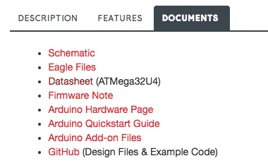
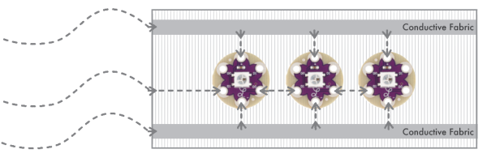
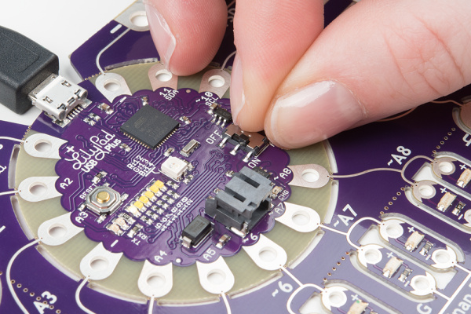
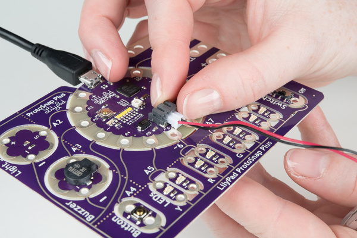
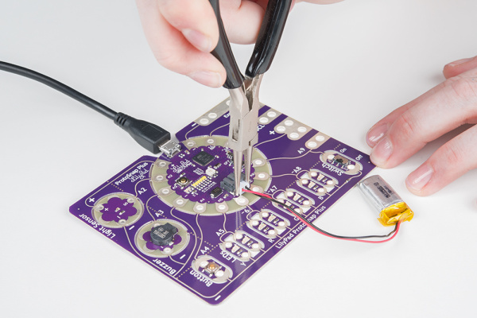
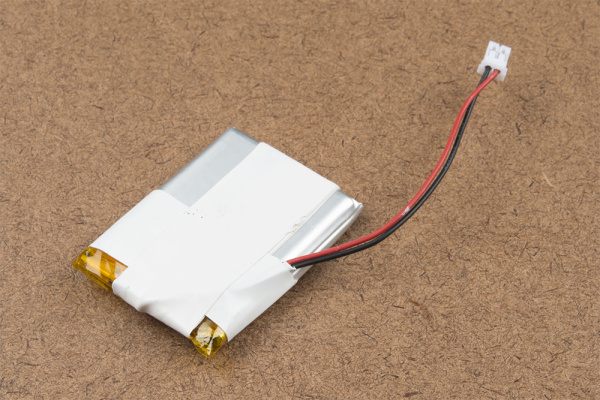

# LilyPadの基礎：プロジェクトへの電源供給

このガイドでは、LilyPadプロジェクト（e-テキスタイルとArduinoベースの両方）への電源供給の選択肢、電池の安全な取り扱いとお手入れ、そしてプロジェクトの消費電力を計算し考慮する方法について解説する。
ウェアラブルや布を使ったプロジェクトには独自の注意点があるため、導電糸による接続から配線による接続へ切り替えたほうがよい場面についても扱う。

LilyPadプロジェクトは身に着けたり持ち運んだりできることが多く、そのため完成したプロジェクトを持ち歩くには電池を使うことになる。
とはいえ、単に電池をつなぐ以外にも、プロジェクトに電源を供給する方法はいくつかある。
以降のセクションで、さまざまな電源とLilyPadシステムで使える選択肢を詳しく見ていこう。

> [!NOTE]
> 警告：LilyPadのエコシステムは3.3Vで動作するように設計されており、このシリーズのたいていの電源基板は3VのCR2032コイン電池か3.7Vのリチウムポリマー電池のどちらかに対応している。一部のLilyPad基板には電圧レギュレータが搭載されており、使用できる電源にもう少し柔軟性がある。代替の電源の選択肢については、このガイド全体を通して解説していく。

どの電源を使うべきか、電池でどれだけの時間動かせるか、そのほかの注意点を判断する助けになるよう、いくつかのコツをまとめた。
プロジェクトに必要な電圧、プロジェクトで使うLilyPad基板の合計消費電流、そして電池容量を把握しておくことが、最適な動作を実現する電源を選ぶ助けになる。

参考になるチュートリアル:

以下の概念に馴染みがなければ、続きを読む前にこれらのチュートリアルを確認しておくことをおすすめする。

- [電圧、電流、抵抗とオームの法則](./voltage-current-resistance-and-ohms-law.md)
- [電池の技術](./battery-technologies.md)
- [プロジェクトへの電源供給](./how-to-power-a-project.md)
- [電力](./electric-power.md)
- [電池とは何か](./what-is-a-battery.md)

## 消費電力の計算：動作電圧

たいていのLilyPadプロジェクトは、**3.7V**の充電式リチウムポリマー電池で問題なく動作する。
それぞれのLilyPad基板の中核となるマイクロコントローラや主要なセンサー、部品には、それぞれ固有の動作電圧が定められており、データシートに記載されている。
製品のデータシートは、SparkFun.comのカタログページの*Documents*タブから見つけられる。

データシートを読む際は、**Operating Voltages**（動作電圧）の項目を探そう。
たいていのドキュメントには最小電圧と最大電圧の範囲が示されている。
製品にデータシートが添付されていない場合は、回路図を確認するという方法もある。

基板に十分な電圧を供給しないと、正しく動作しないことがある（LilyPad Arduino上のコードの動きが不安定になったり、シリアルポートに表示されるセンサーの値がおかしくなったり、LEDが暗くなったりすることがある）。
逆に、推奨範囲を超える電圧をプロジェクトに供給すると、基板を損傷したり、動作時間を大幅に縮めたりする可能性がある。
プロジェクトに選ぶ電源が、基板の推奨範囲に収まっていることを必ず確認しよう。

よく使われるLilyPad基板と、その必要条件の一覧を示す。
中央の列は、入力電圧から基板上で調整された（レギュレートされた）電圧を示している。
内蔵レギュレータのない基板を選ぶ場合は、電源がプロジェクトと互換性があるかどうかに特に注意を払う必要がある。
最後の列は、それぞれの基板が受け付けられる入力電圧を示しており、これはLilyPadプロジェクトの推奨動作電圧である3.3Vを上回ることもある点に注目してほしい。

| 基板                                   | 電圧レギュレーション | 入力電圧                    |
| -------------------------------------- | -------------------- | --------------------------- |
| LilyTiny                               | なし                 | 1.8V〜5.5V                  |
| LilyTwinkle / LilyTwinkle ProtoSnap    | なし                 | 1.8V〜5.5V                  |
| LilyMini ProtoSnap                     | 3.3V                 | 1.62V〜3.63V、USB経由で5.0V |
| LilyPad Arduino Simple                 | なし                 | 2.7V〜5.5V                  |
| LilyPad Arduino SimpleSnap             | 3.3V                 | 2.7V〜5.5V                  |
| LilyPad Arduino USB - ATmega32U4 Board | 3.3V                 | 2.7V〜5.5V                  |
| LilyPad USB Plus                       | 3.3V                 | 1.8V〜5.5V                  |
| LilyPad Arduino 328 Main Board         | なし                 | 2.7V〜5.5V                  |
| LilyPad XBee                           | 3.3V                 | 1.8V〜9V                    |
| LilyPad Simblee BLE Board - RFD77101   | 3.3V                 | 1.8V〜3.6V                  |
| LilyPad MP3                            | 3.3V                 | 3.7V〜6V                    |

> [!NOTE]
> プロジェクトの中の一部の部品が動作に3.3V以上を必要とする場合、それでもLilyPad Arduinoと組み合わせて使えるだろうか。LilyPadシステムのたいていの基板はシステム電圧（3.3V）で動作するように設計されているが、他の縫い付け可能な製品や縫い付けできない製品を組み合わせる場合、5Vを必要とするセンサーや基板に出会うこともある。その場合、まずはその基板の3.3V版を探してみよう。必要であれば、[双方向ロジックレベルコンバータ](./bi-directional-logic-level-converter-hookup-guide.md)を使って接続することもできる。

## 消費電力の計算：消費電流

プロジェクトで使うLilyPad基板の動作電圧を確認するのに加えて、プロジェクトが消費する電流と、マイクロコントローラや電池が供給できる電流も比較しておく必要がある。

プロジェクトの消費電流は、プロジェクトで使用するLilyPad基板の総数によって決まり、これはLilyPad Arduinoで制御する回路にもe-テキスタイルのプロジェクトにも当てはまる。
電源や電池がプロジェクトに必要な電流を供給できない場合、回路が不安定で予測できない動作をすることがある。

_電圧と同じように、それぞれのLilyPad基板のデータシートを確認することで、プロジェクトがどれだけの電流を消費するか見積もることができる。_

LilyPad Arduinoを使うプロジェクトでは、それぞれのI/O（入出力）用の縫い付けタブがどれだけの電流を供給できるかを確認しておこう。LEDのようなLilyPad基板の数は、この値によって制限される。
たいていのLilyPad Arduinoでは、これはI/O用縫い付けタブ1つあたり40mAである。

_また、必要な電流を少なめに見積もるよりも、多めに見積もっておくほうが良い習慣である。_

モーターや大量のLEDのように大きな電流を必要とする部品をプロジェクトで使う場合、電源の選び直しが必要になったり、LilyPad Arduino用と電力を大きく消費する基板用とで別々の電源を用意する必要が出てきたりすることもある。

LilyPad基板を扱う経験を積んでいくにつれて、各基板のデータシートを確認して計算するだけで、プロジェクトに必要な電流量を簡単に見積もれるようになるはずである。
[デジタルマルチメーター](./how-to-use-a-multimeter.md)や、電流を表示できる可変DC電源を使って、プロジェクトが実際に消費する電流を正確に測定することもできる。

#### 実例：LilyPad LEDとLilyTiny

LilyPadプロジェクトについてよく寄せられる質問の例をひとつ見てみよう。
_LilyTiny（あるいはLilyTwinkle）基板には、LEDを何個まで接続できるだろうか。_

典型的な**LilyPad LED**は、最大輝度でおよそ20mAの電流を消費する。
これに使用するLEDの個数を掛け、全体を動かすLilyPad自身の消費分として10mAを加えれば、おおよその平均消費電流が見積もれる。

**例：**

LilyTiny基板に10個のLilyPad LEDを接続したプロジェクトの場合

**20mA × 10 + 10mA = 210mA**

_LilyPad LEDの扱いについてさらに詳しい情報は、Powering LilyPad LED Projectsのチュートリアルを参照してほしい。_

## 導電糸の抵抗を考慮する

ここまでの計算が終わったところで、もうひとつ考慮すべき要素がある。導電糸の抵抗である。
抵抗がほとんどない銅線とは異なり、導電糸の抵抗は、糸を作る金属の種類や糸の太さによって変わってくる。
多くの導電糸は、抵抗値をΩ/フィートという単位で表示している。
この数値は小さいほどよい。抵抗が小さいほど、プロジェクトで使う部品により多くの電気を届けられるからである。

プロジェクトが完璧に動作すると期待していても、接続の距離による抵抗が、回路にさらなる問題を引き起こすことがある。

[オームの法則](./voltage-current-resistance-and-ohms-law.md)という基本的な電気の性質によれば、抵抗の高い素材に電流を流すと電圧が降下する。
電流が大きいほど、電圧の降下も大きくなる。
つまり、LilyPadに電力を供給する[LiPo電池](https://www.sparkfun.com/products/13112)が3.7ボルトを出力していても、糸を通って部品に届くころには3.0ボルト以下まで下がっていることがあるということである。
LEDのような多くの電気部品は、正しく動作するために一定の電圧を必要とする。
電圧降下を最小限に抑えるには、電源となる接続部分の抵抗を減らす必要がある。
方法はいくつかある。

- **電源用の接続部分の長さをできるだけ短くする**。抵抗は長さに比例して増えるため、長さを短くすれば抵抗も小さくなる。
- **糸自体の抵抗を減らす**。太い糸は細い糸よりも抵抗が小さく、複数本をまとめて使うことでさらに抵抗を減らせる。

> [!NOTE]
> ヒント：複数本の糸を束ねた（あるいは編んだ）ものを基布に縫い付けるには、非導電性の糸を使うとよい。部品を接続する際に、その太い糸の束に導電糸を縫い付けられるよう、縫い目の間に十分な余白を残しておこう。

### 導電糸の代替手段

導電糸を長い距離にわたって這わせる必要がある大きなプロジェクトや、LilyPad Pixel基板を大量に使うような電力消費の大きいプロジェクト、あるいは糸が負荷で切れやすい箇所には、ウェアラブル向けによく機能する次のような代替手段がある。

#### 導電性リボン

柔軟なより線がナイロンリボンに織り込まれた専用のリボンは、抵抗の低い導電糸の代替品として優れている。
リボンの中にある金属糸に[はんだ付け](./how-to-solder-through-hole-soldering.md)する必要がある。

#### 導電性ファブリックトレース

薄い導電性の布の帯を使って、独自の低抵抗トレースを作ることもできる。
布やリボンに貼り付けるにはアイロン接着剤を使い、そのトレースに部品を接続するには導電糸で手縫いすることをおすすめする。

導電糸と同じように、ファブリックトレースの絶縁も忘れないようにしよう。

#### より線

もうひとつの代替手段は、導電糸から従来型の配線に切り替えることである。
配線は糸よりもはるかに抵抗が小さいため、導電糸の回路よりも多くのLEDを使うことができる。
縫うのではなくはんだ付けに切り替える必要があるが、通常糸を接続するのと同じ縫い付けタブに配線をはんだ付けするのは簡単である。

配線は、繰り返し曲げられると切れやすい。
高い柔軟性が必要なウェアラブルプロジェクトには、単線ではなくより線を使い、非常に柔軟なシリコン被覆の配線を探すとよい。
洗濯するプロジェクトでは、むき出しのより線に水が染み込み、時間の経過とともに腐食してしまうことがある。
これを防ぐには、配線の切り口に少量のシリコンシーラントを塗るとよい。

> [!NOTE]
> はんだ付けする際は、近くの布を溶かしたり焦がしたりしないよう注意すること。熱を加える前に、LilyPad基板の裏側を裏地の布から浮かせるか、絶縁しておこう。

はんだ付けや配線の扱いが初めての場合は、次のチュートリアルを確認することをおすすめする。

- [How to Solder: Through-Hole Soldering（はんだ付けの基本：スルーホール編）](./how-to-solder-through-hole-soldering.md)
- [Working with Wire（配線の基本）](./working-with-wire.md)

プロジェクトの消費電力と注意点を把握できたら、次はプロジェクトの電源を選ぶ番である。

## 電源の選択肢：内蔵USBコネクタを使う

LilyPad Arduinoプロジェクトのプログラミング作業中は、LilyPad ArduinoとパソコンをつなぐUSBケーブルから供給される電力を使うことができる。
試作中にコードを書き込み、基板に電源を入れるには、LilyPad Arduinoのスライドスイッチが必ずONの位置になっていることを確認しよう。

この方法は、内蔵のマイクロUSBポートを持つLilyPad Arduinoにも、プログラミング用ヘッダーと[LilyPad FTDI Basic Breakout](https://www.sparkfun.com/products/10275)を使うタイプにも使える。

マイクロUSBコネクタを持つLilyPad基板は、Spectacleシリーズや携帯電話の充電バックアップに使われるような、5Vのリチウムイオン電池パックでも電源を供給できる。

プロジェクトが持ち運び可能でもウェアラブルでもない場合（壁掛けや常設展示など）は、5Vのウォールアダプタ電源を使うという選択肢もある。
専用の電源に接続すれば、プロジェクトの電池を絶えず交換したり充電したりする必要がなくなる。

> [!NOTE]
> マイクロUSBコネクタが付いたウォールアダプタや電池パックを見つけたが、LilyPadプロジェクトに使えるだろうか。マイクロUSBだからといって、その電池パックが必ずしもプロジェクトに適しているとは限らない。SparkFunのカタログ以外から電池パックを調達する場合は、パッケージや製品のラベルを必ず確認し、5V電源であることを確かめよう。

LilyPad Simple Powerは柔軟性のある基板であり、充電式電池にもマイクロUSBケーブル経由のウォールアダプタにも対応できるため、電池コネクタが内蔵されていないLilyPadプロジェクトに使うことができる。

## 電源の選択肢：充電式リチウムポリマー電池

> [!NOTE]
> LilyPadのJSTポートには、必ず3.7VのLiPo電池を接続すること。同じコネクタを使っていても、LiPo以外の電池をこれらのJSTポートに接続してはいけない。充電回路が電池を損傷する可能性がある。電池の電源線とグラウンド線の向きは、メーカーによって逆になっていることがあるため、必ず確認すること。SparkFunが扱うすべてのLiPo電池は標準的な構成になっている。

多くのLilyPad製品には、3.7Vのリチウムポリマー（LiPo）電池を接続するためのJSTコネクタが搭載されている。
これらの基板には充電回路が内蔵されており、USB接続でパソコンやウォールワートにつなぐとLiPoを充電できる。

SparkFunでは、LilyPadシステムと互換性のある3.7Vリチウムポリマー電池を各種取り扱っている。
どの容量の電池を選ぶかは、プロジェクトの想定稼働時間やサイズの制約など、さまざまな要因によって決まる。

### LiPo電池の使用と充電

> [!NOTE]
> LilyPadプロジェクトは手洗いできるが、洗う前には必ず電池を取り外し、電池を戻す前に数日間しっかりと自然乾燥させること。

充電機能を備えたそれぞれのLilyPad基板には、デフォルトの充電レートが設定されている。
このデフォルトの充電電流が**100mA**に設定されている場合、100mAhの電池は1時間で、1000mAhの電池は10時間で充電できるということになる。
基板が100mAで充電するように設定されているため、それより低い容量のLiPo電池（たとえば40mAhのLiPo電池）を接続して充電することはおすすめしない。

> [!NOTE]
> 充電回路を内蔵するたいていのLilyPad製品は100mAに設定されているが、LilyPad MP3とLilyPad Simple Powerのデフォルトの充電レートは500mAである。設定された充電レートより容量の小さいLiPo電池を使う場合は、SparkFun Adjustable LiPo Chargerを使って別途充電することをおすすめする。

接続した電池を充電するには、基板をUSB電源に接続する。
電池の充電中は「CHG」LEDが点灯する。
電池が満充電になると、このLEDは消灯する。

USB電源を接続したままの状態でも、LiPo電池を基板に恒久的に接続しておいて問題ない。
電池が過充電になることはない。
とはいえ、充電中の電池をそのまま放置しないことをおすすめする。

> [!NOTE]
> 電池を挿抜する前は、必ずLilyPad基板の電源を切ること。

電池のコネクタはきつくはまっていることがあり、取り外しにくいことがある。電池を取り外す際は、決して配線を引っ張らないこと。
ラジオペンチやニッパーをプラスチックの部分に添えて、コネクタからプラグを優しく引き抜こう。

_ヒント：プラスチック製の電池コネクタの上部には小さな「突起」が2つあり、ホビーナイフで削り取ると電池を取り外しやすくなる。_

> [!NOTE]
> JSTコネクタが付いたかっこいい電池パックを見つけたが、LilyPadプロジェクトに使えるだろうか。JSTコネクタはよく使われる種類のコネクタであり、それが付いているからといってLilyPadと互換性があるとは限らない。SparkFunのカタログ以外から電池を調達する場合は、必ず次の点を確認しよう。3.7Vか。充電式のリチウムポリマー/リチウムイオン電池か。

### LiPo電池の安全な取り扱いとお手入れ

> [!NOTE]
> 警告：LiPo電池は、扱いを誤ったり損傷したりすると、発火や爆発の恐れがある。穴があいたり高温にさらされたりすると、不安定になり危険な状態になることがある。

LiPo電池は充電式の電源としてプロジェクトに優れた選択肢だが、いくつかの安全上の注意点がある。
このセクションでは、プロジェクトでLiPoを安全に扱い、使用するためのコツを紹介する。

#### 保管

- 電池は必ず、鋭利なものがない収納場所に保管すること。プロジェクトに電池を組み込む際は、電池を挟んだり、突き刺したり、負荷をかけたりする可能性のある部分から離しておくこと。
- ヘアピンやネックレスなど、金属製あるいは導電性のある物と一緒にLiPo電池を運んだり保管したりしないこと。
- プロジェクトに組み込んだ状態でも保管中でも、電池は涼しく乾燥した場所に保つこと。プロジェクトを長期間使わない予定であれば、電池を取り外して別に保管すること。

#### 熱と湿気を避ける

- LiPo電池を傷める恐れのある環境から遠ざけること。LiPo電池を液体に浸さないこと。プロジェクトを洗う必要がある場合は、電池を取り外すこと。
- 熱源の近くで電池を使ったり保管したりしないこと。プロジェクトに電池を固定するには、面ファスナーを使うか、ポーチに縫い付けるか、プラスチックの収納ケースに入れるとよい。LiPo電池の上や周囲に直接アイロンをかけたりホットグルーを使ったりしないこと。

#### ストレインリリーフ

これらのLiPo電池を使う際の欠点のひとつが、電源接続部分の脆弱さである。
このタイプの電池は機器への恒久的な組み込みを想定して作られており、ウェアラブルでよくあるように頻繁に取り外すことは想定されていない。
電池に内蔵された保護回路の端子から、うっかり配線を引っ張って壊してしまうことがある。

配線を横に寄せて絶縁テープで固定することで、ストレインリリーフ（負荷の分散）を施すことができる。これにより、取り外す際に電池への接続部分にかかる負荷を和らげられる。

#### 使用前に毎回電池を点検する

- LiPo電池の短絡や損傷は、必ずしも見た目で分かるとは限らない。膨らみ、発熱、その他の変化がないか確認すること。電池が損傷しているように見えたら、すぐに取り外すこと。
- 使用中、充電中、保管中に電池から異臭がしたり、発熱したり、変色や変形が見られたり、少しでも異常な様子が見られたりした場合は、すぐにプロジェクトや充電器から取り外し、使用をやめること。電池は必ず適切な方法で廃棄すること。ゴミ箱に捨ててはいけない。地域の電子廃棄物処理団体に、電池の廃棄方法について問い合わせること。

## 電源の選択肢：コイン電池

LilyPadシステムには、3VのCR2032コイン電池を1枚収める基板もある。
これらの電池はたいてい使い切りだが、充電式のコイン電池がホルダーに収まる場合もある。

**CR2032という電池の名前には、いくつかの重要な情報が含まれている。**

- Cはリチウム電池の種類を示す

_電池を選ぶ際は電圧（3V）を確認するのに加えて、名前の末尾2桁の数字にも特に注意を払おう。互換性がありそうに見えても、LilyPadの電池ホルダーに対してわずかに大きすぎたり小さすぎたりする電池もある。_

LilyPad製品ラインには、カスタムプロジェクトに接続できるスイッチ付きの単体電池ホルダーがあるほか、LilyMini基板に内蔵されているものや、一部のProtoSnap製品にも用意されている。
SparkFunでは、小さなフットプリントが必要なプロジェクトや、はんだ付けを好むユーザー向けに、縫い付けタブのないLilyPad以外のコイン電池ホルダーも扱っている。

> [!NOTE]
> LilyPadの電池ホルダーを2つ直列につないだり、見つけてきた2電池パックを使ったりしてもよいだろうか。これは、電源を供給するLilyPad基板によって異なる。3Vの電池を2つ直列にすると6Vが供給されるが、一部のLilyPad基板にはオンボードのレギュレーション回路がなく、3Vを超える電圧を供給すると損傷する可能性がある。たとえばLilyTinyやLilyTwinkle基板は2.4V〜5.5Vの範囲でもっともよく動作する。このような場合は、リチウムイオン電池やリチウムポリマー電池のほうがプロジェクトに適しているかもしれない。プロジェクト固有のニーズに合った電池を選ぶコツについては、消費電力の計算のセクションを参照してほしい。

### 電池の安全な取り扱いとお手入れ

> [!NOTE]
> リチウム金属電池は、扱いを誤ったり損傷したりすると、発火や爆発の恐れがある。穴があいたり高温にさらされたりすると、不安定になり危険な状態になることがある。

このセクションでは、プロジェクトでコイン電池を安全に扱い、使用するためのコツを紹介する。

#### 保管

- ヘアピンやネックレスなど、金属製あるいは導電性のある物と一緒にコイン電池を運んだり保管したりしないこと。複数のコイン電池をばらばらのまま一緒に保管しないこと。電池どうしが接触して短絡し、放電してしまうことがある。
- プロジェクトに組み込んだ状態でも保管中でも、電池は涼しく乾燥した場所に保つこと。プロジェクトを長期間使わない予定であれば、電池を取り外して別に保管すること。

#### 熱と湿気を避ける

- コイン電池を傷める恐れのある環境から遠ざけること。コイン電池を液体に浸さないこと。プロジェクトを洗う必要がある場合は、電池を取り外すこと。
- 熱源の近くで電池を使ったり保管したりしないこと。プロジェクトに電池を固定するには、専用の電池ホルダーを使うか、ポーチに縫い付けるか、プラスチックの収納ケースに入れるとよい。コイン電池に直接はんだ付けしないこと。プロジェクトにはんだ付けする必要がある場合は、専用の電池ホルダーを使うか、はんだ付け用のタブが付いた電池を購入すること。

#### 使用前に毎回電池を点検する

- コイン電池の短絡や損傷は、必ずしも見た目で分かるとは限らない。膨らみ、発熱、その他の変化がないか確認すること。電池が損傷しているように見えたら、すぐに取り外すこと。
- 使用中、充電中、保管中に電池から異臭がしたり、発熱したり、変色や変形が見られたり、少しでも異常な様子が見られたりした場合は、すぐにプロジェクトや充電器から取り外し、使用をやめること。電池は必ず適切な方法で廃棄すること。ゴミ箱に捨ててはいけない。地域の電子廃棄物処理団体に、電池の廃棄方法について問い合わせること。

## プロジェクトは電池でどれだけの時間動くのか

プロジェクトが電池でどれだけの時間動くかを知るには、次の2つを把握する必要がある。

- プロジェクトが消費する電流
- 電池の容量

電池の容量は**ミリアンペア時**（mAh）で表される。
これは、満充電の電池が空になるまでに1時間あたり何ミリアンペア（mA）供給できるかを示す数値である。
たいていのLilyPad Arduinoキットに付属する[e-Textiles Battery](https://www.sparkfun.com/products/13112)の容量は110mAhである。
LEDなど多数の部品を使うプロジェクトなど、多くのプロジェクトでは、より長い稼働時間を得るためにより大容量の電池を使いたくなるだろう。

電池がどれくらい持つかを求めるには、次の式を使う。

**時間 = 電池のmAh ÷ プロジェクトのmA**

つまり、e-Textiles Batteryではプロジェクトをおよそ30分程度しか動かせないことになる。
イベントや展示会のように長時間の稼働が必要な場合は、より大容量の電池を選ぶのが理にかなっている。
そのトレードオフとして、大容量の電池は物理的にも大きくなる。プロジェクト上での電池の収納方法や固定方法をあらかじめ計画し、配線や布への負荷を減らすようにしよう。

`*` 注：コイン電池は充電式ではない。

> [!NOTE]
> 注意：カタログにあるそのほかの電池は、e-テキスタイル専用に作られたものではない。代替の電池を使う場合は、導電糸のトレースを短絡させないよう注意すること。

## まとめ

LiPo電池やウェアラブルプロジェクトについてさらに情報が必要な場合は、次のような関連チュートリアルも確認してみてほしい（いずれも英語）。

- [How Lithium Polymer Batteries are Made（リチウムポリマー電池の製造工程）](https://learn.sparkfun.com/tutorials/how-lithium-polymer-batteries-are-made)：Great Power Battery社の工場を見学する機会があった。LiPoがどのように作られているかを紹介する。
- [LilyPad Simple Power Hookup Guide（LilyPad Simple Powerの使い方）](https://learn.sparkfun.com/tutorials/lilypad-simple-power-hookup-guide)：LiPo電池と組み合わせてLilyPad Simple Powerを使い始めるための基本ガイド。
- [Insulation Techniques for e-Textiles（e-テキスタイルの絶縁技法）](https://learn.sparkfun.com/tutorials/insulation-techniques-for-e-textiles)：次のウェアラブルプロジェクトで導電糸やLilyPadの部品を保護するいくつかの方法を学べる。
- [Planning a Wearable Electronics Project（ウェアラブル電子工作プロジェクトの計画）](https://learn.sparkfun.com/tutorials/planning-a-wearable-electronics-project)：ウェアラブルプロジェクトのアイデア出しと制作のコツを紹介する。

タグ: Arduino、記事、概念、E-Craft、e-テキスタイル、LilyPad、電力、プロトタイピング、ウェアラブル

---

出典：[LilyPad Basics: Powering Your Project](https://learn.sparkfun.com/tutorials/lilypad-basics-powering-your-project)（SparkFun Learn）を日本語に翻訳し、再構成した。
原文は [CC BY-SA 4.0](https://creativecommons.org/licenses/by-sa/4.0/) ライセンスで公開されており、本ページも同ライセンスの下で提供する。
