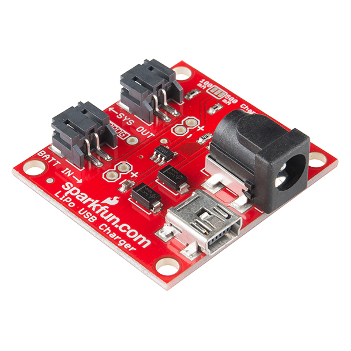
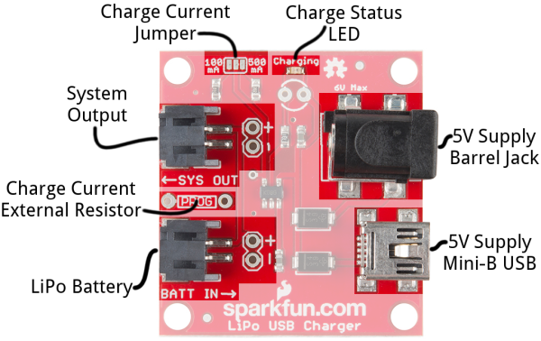
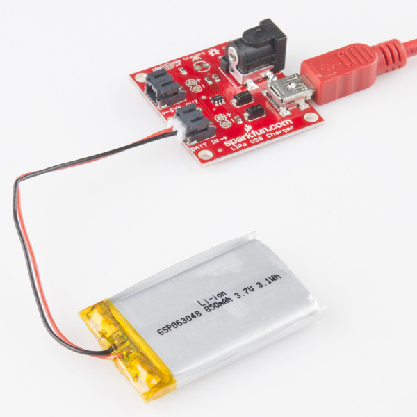
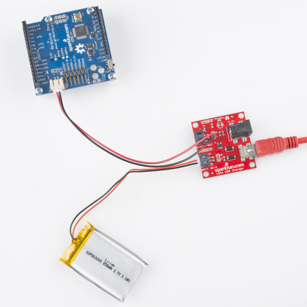
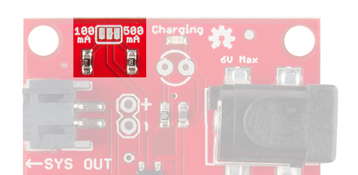
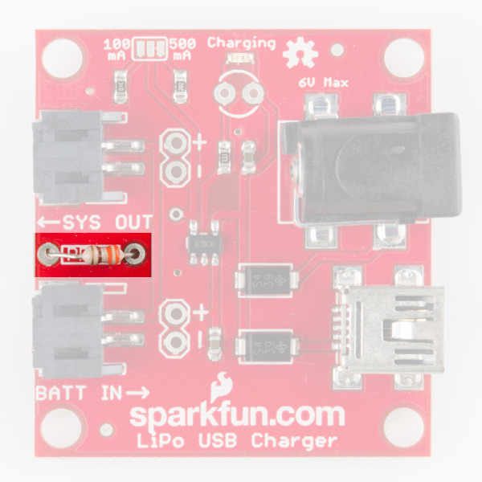

# LiPo USB充電器の使い方

私たちはLiPo電池が大好きである。
小さく平たいパッケージの中に、驚くほどの電力を詰め込んでいる。
そして、充電が必要になったときにも非常に簡単に充電できる。
プロジェクトを持ち運び可能にし、なおかつ手軽に充電できるようにしたいなら、[850mAhのLiPo電池](https://www.sparkfun.com/products/341)と、基板に組み込める[USB LiPo充電器](https://www.sparkfun.com/products/12711)の組み合わせを強くおすすめする。



このチュートリアルでは、[USB LiPo充電器](https://www.sparkfun.com/products/12711)を、あらゆる[単セルLiPo電池](https://www.sparkfun.com/search/results?term=lithium+polymer+3.7V)と組み合わせて使う方法を説明する。
ここでは主にLiPo充電器と電池のリテールキットを例に説明するが、この情報はその充電器と互換性のあるどんな電池にも応用できる。

### 必要なもの

- USB LiPo充電器
- 単セルLiPo電池

充電器は、40mAh、110mAh、400mAh、850mAh、1000mAh、2000mAh、6000mAhの大容量パックまで、あらゆる容量の電池と組み合わせて使える。

さらに、**5Vの電源**が必要である。次のような選択肢がある。

- パソコンのUSBポートとミニB USBケーブル
- USBウォールアダプタとミニBケーブル
- 5Vのウォールワート電源

参考になるチュートリアル:

- [電圧、電流、抵抗とオームの法則](./voltage-current-resistance-and-ohms-law.md)
- [電池の技術](./battery-technologies.md)
- [プロジェクトへの電源供給](./how-to-power-a-project.md)

## 入力と出力

このセクションでは、USB充電器を分解し、基板のすべての入力、出力、仕様を確認していく。



### 充電器の入力：電源

まず、充電器に電力を供給する何かが必要である。それによって充電器が電池への電力を調整できるようになる。
電源は、次の2つの入力のどちらかに接続する。**バレルジャック**（外径5.5mm、中心ピン径2.1mm、中心が正極）か、**ミニB USB**コネクタである。

電源の**供給電圧**は**4.75V〜6Vの間**にする必要がある。
パソコンのUSBポートやウォールアダプタに接続したミニBケーブルから得られる5VのUSB電源は、理想的な電源になる。
バレルジャック入力を使いたい場合は、5Vのウォールアダプタをおすすめする。

電源に必要な**電流**は、基板上で[充電電流をどう設定しているか](#充電電流を設定する)によって変わる。
デフォルトでは、充電電流は**500mA**に設定されているため、使用する電源がそれに対応できることを確認しておこう。
特に注意すべきなのがパソコンやノートパソコンのUSBポートである。500mAはUSBポートが供給できる規定の最大値であり、実際にはそれより低い出力（たとえば100mAなど）に制限されていることも多い。

5Vのウォールワート供給とUSB供給の両方を、この基板に安全に同時接続することができる。
基板上には逆流防止のための保護回路（[ダイオード](./diodes.md)）が搭載されている。
より高い電圧を供給している側から、チップへ電力が供給される。

> [!NOTE]
> 警告：チップは最大6Vまでの電圧に対応しているが、電流については最大1500mAまでしか対応していない。電源として6V/2Aの電源を使うと、基板上のチップを焼き切ってしまう可能性が非常に高い。バレルジャック付きのウォールアダプタが必要な場合は、5V/2Aの電源をおすすめする。

### 充電器の出力：単セルLiPo電池

充電器に電源を接続したら、次は電池を接続する番である。
この基板は、非常に限られた種類の電池しか充電できないため、次の条件を満たしているか必ず確認すること。

- **単セル電池のみ**：LiPo電池の公称電圧はおよそ3.7Vで、満充電時にはおよそ4.2Vまで上がる。つまり、対応するのは単セルのLiPoだけである。公称電圧が7.4V以上の[複数セルの電池](https://www.sparkfun.com/products/11855)を使っている場合、この充電器は使えない。



- **電池の化学方式**：この充電器は**リチウムポリマーまたはリチウムイオン**電池にのみ対応している。
- **容量に関する注意**：（ほんの一瞬だけ楽しい）爆発を避けるため、これらのLiPo電池は1C（公称容量と同じ数値のアンペア数）を超える電流で充電すべきではない。つまり、500mAhの電池には500mAを超える充電電流を与えるべきではなく、100mAhの電池には100mAを超える充電電流を与えるべきではない。この基板は工場出荷時には500mAで充電するように設計されているが、その速度を変更するのも簡単である。電池の容量が500mAh未満の場合は、後述の充電電流の設定を確認してほしい。

対応するすべての電池は、白い**JSTコネクタ**で終端されており、*BATT IN→*のラベルの隣にある対になった黒いコネクタに直接差し込める。
もし電池が見慣れない非JST系のコネクタで終端されている場合は、JSTコネクタのすぐ後ろにある**未実装の0.1インチピッチのヘッダー**を使うこともできる。
必要であれば、このヘッダーに配線や他のコネクタを[はんだ付け](./how-to-solder-through-hole-soldering.md)することもできる。

### システム出力

LiPo USB充電器は、プロジェクトの中に簡単に**組み込める**ように設計されている。
*←SYS OUT*コネクタを使えば、電池の出力をプロジェクトの残りの部分に接続できる。



電池の接続と同じように、プロジェクトへの接続にはJSTコネクタか、近くにある0.1インチピッチのヘッダーのどちらかを使える。

*SYS OUT*出力は、プロジェクトを電池に直接接続する。
つまり、電池の供給電圧（3.6V〜4.2V程度）がそのままプロジェクトに供給されるということである。
必要に応じて、その電圧を適切にレギュレートすること。

### 充電状態LED

基板上の赤い*Charging*LEDは、電池の**充電状態**を確認するために使える。

| 充電状態 | LEDの状態 |
| --- | --- |
| 電池なし | フローティング（OFFになるはずだが、点滅することもある） |
| シャットダウン | フローティング（OFFになるはずだが、点滅することもある） |
| 充電中 | ON |
| 充電完了 | OFF |

もっと大きな独自のLEDを追加したい場合は、未実装のフットプリントが用意されており、小さな（しかし明るい）赤色LEDの代わりに3mmまたは5mmのLEDをはんだ付けできる。
ただし、[極性](./polarity.md)を正しく合わせることを忘れないように。

## 充電電流を設定する

電池を充電器に接続する前に、**電池の容量**と充電器が供給する**充電電流**を把握しておく必要がある。
安全のため、充電電流は電池の**1C以下**に抑えておくべきである。
つまり、850mAhの電池は850mA以下、100mAhの電池は100mA以下で充電すべきということである。

充電電流は、**電池がどれだけ速く充電されるか**を決める。
1000mAhの電池を1000mAで充電すれば、1時間で満充電になる。
500mAで充電すれば、満充電までに2倍の時間、つまり2時間かかる。
つまり充電電流は大きいほうがよいが、電池の仕様を超えない範囲に限られる。

LiPo USB充電器基板の主要部品であるMCP73831には、**プログラム可能な充電電流**という機能がある。
15mAから500mAの間で、電池に供給する電流を設定できる。
この値を設定するには、*PROG*ピンからグラウンドへ抵抗を接続する。
基板上にはすでに2つの抵抗があり、充電電流を500mAまたは100mAに設定できるようになっている。
小さなジャンパーを使って、どちらかを選択する。
独自の抵抗を追加して、任意の充電電流を設定することもできる。

### ジャンパーによる選択

充電状態LEDの隣に、**2択のジャンパー**を構成する3つの露出したパッドがある。
中央のパッドはMCP73831の*PROG*ピンに接続されており、外側の2つのパッドはそれぞれ抵抗器に接続されている。
外側のパッドの隣にあるラベルは、それぞれが設定する充電電流を示している。



このジャンパーをよく見ると、中央のパッドと「500mA」とラベル付けされた外側のパッドをつなぐ小さな配線パターンが見えるはずである。
そのため、この基板は**デフォルトで500mAの電流を供給するように設定されている**。

充電電流を100mAに変更するには、そのパッド間の小さな配線パターンを**切断**し（[ホビーナイフ](https://www.sparkfun.com/products/9200)の使用をおすすめする）、「100mA」とラベル付けされたピンと中央のパッドをはんだの塊でつなぐ必要がある。

### 独自の充電電流を設定する

100mAでも500mAでも都合が悪い場合は、独自の充電電流を設定できる未実装の抵抗フットプリントが用意されている。



抵抗を追加する前に、前のセクションで説明した**両方のジャンパーを切り離して**おくこと。
そのうえで、次の式を使って抵抗値を選ぶ。

```
Rprog = 1000 / 目標の充電電流（A）
```

たとえば、[400mAhの電池](https://www.sparkfun.com/products/10718)をちょうど400mAで充電したい場合は、2.5kΩの抵抗をはんだ付けする（2.2kΩと330Ωを直列にする必要があるかもしれない）。

> [!NOTE]
> たいていの電池には、電流を供給しすぎたときに電池が破裂しないよう保護する、**過電流保護**機能が（黄色いテープの下の小さな回路基板に）内蔵されている。とはいえ、その回路をあてにしないほうがよい。そのほうが電力も、あなたの精神的な安らぎも守られる。

## まとめ

さらに詳しく知りたい場合は、次のような情報源も参考になる（いずれも英語）。

- [LiPo Battery Care Tutorial](https://learn.sparkfun.com/tutorials/single-cell-lipo-battery-care)（LiPo電池のお手入れ）：やや古いチュートリアルだが、内容の多くは今でも通用する。ストレインリリーフについての情報や、充電器から電池を安全に取り外すためのヒントが得られる。
- [USB LiPo Charger Schematic](https://cdn.sparkfun.com/datasheets/Prototyping/USB_LiPolyCharger_SingleCell21.pdf)（USB LiPo充電器の回路図）：回路レベルの疑問があれば、回路図を確認してほしい。
- [MCP73831 Datasheet](http://cdn.sparkfun.com/datasheets/Components/General%20IC/33244_SPCN.pdf)（MCP73831のデータシート）：単セルLiPo充電管理ICであるMCP73831についての詳細情報。
- [USB LiPo Charger GitHub Repository](https://github.com/sparkfun/USB_LiPolyCharger_SingleCell)（USB LiPo充電器のGitHubリポジトリ）：最新の設計ファイルが公開されている。

補給可能な電源が手に入ったところで、次はどう使うか考えてみよう。
アイデアが必要なら、次のようなチュートリアルも確認してみてほしい（いずれも英語）。

- [Uh-Oh Battery-Level Indicator Hookup Guide](https://learn.sparkfun.com/tutorials/uh-oh-battery-level-indicator-hookup-guide)（電池残量インジケーターの使い方）：電池電圧が下がりすぎると通知してくれるキットの組み立てと使い方を学べる。
- [MYST Linking Book](https://learn.sparkfun.com/tutorials/myst-linking-book)（MYSTのリンキングブック）：LiPo電池を使って、あの名作コンピュータゲーム『MYST』に登場するリンキングブックを自作するプロジェクト。
- [Sunny Buddy Solar Charger Hookup Guide](https://learn.sparkfun.com/tutorials/sunny-buddy-solar-charger-hookup-guide)（Sunny Buddyソーラー充電器の使い方）：LiPo USB充電器をソーラー充電器に置き換えたい場合は、Sunny Buddyを確認してみてほしい。

タグ: 接続ガイド、電力

---

出典：[LiPo USB Charger Hookup Guide](https://learn.sparkfun.com/tutorials/lipo-usb-charger-hookup-guide)（SparkFun Learn）を日本語に翻訳し、再構成した。
原文は [CC BY-SA 4.0](https://creativecommons.org/licenses/by-sa/4.0/) ライセンスで公開されており、本ページも同ライセンスの下で提供する。
