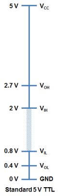
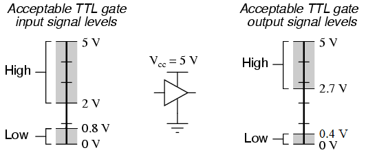
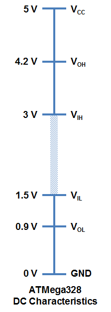

# ロジックレベル

私たちはアナログ信号の世界に生きている。
しかしデジタル電子工学の世界には、ONかOFFかという2つの状態しか存在しない。
この2つの状態を使うことで、機器は大量のデータを符号化し、伝送し、制御することができる。
ロジックレベルとは、もっとも広い意味では、信号が取りうる特定の離散的な状態のことを指す。
デジタル電子工学では、一般に2進数の1と2進数の0という2つの論理状態だけを扱う。

このチュートリアルで扱う内容:

- ロジックレベルとは何か
- デジタル電子工学におけるロジックレベルの一般的な規格
- 異なる技術どうしをインターフェースする方法
- レベルシフト
- 電圧バックブーストレギュレータ

参考になるチュートリアル:

このチュートリアルは、基本的な電子工学の知識の上に成り立っている。
まだ読んでいなければ、次のチュートリアルにも目を通しておくとよい。

- [回路とは何か](./what-is-a-circuit.md)
- [電圧、電流、抵抗とオームの法則](./voltage-current-resistance-and-ohms-law.md)
- [2進数](./binary.md)

## ロジックレベルとは何か

簡単に言えば、ロジックレベルとは、信号が取りうる特定の電圧や状態のことである。
デジタル回路における2つの状態は、よくONまたはOFFと呼ばれる。
2進数で表すと、ONは2進数の1に、OFFは2進数の0に対応する。
Arduinoでは、これらの信号をそれぞれHIGH（ハイ）、LOW（ロー）と呼ぶ。
過去30年ほどの間に、電子工学ではさまざまな電圧レベルを定めるための技術規格がいくつも生まれてきた。

### Logic 0とLogic 1

デジタル電子回路は、データや情報を保存、処理、伝送するために2進論理に依存している。
2進論理とは、ONかOFFかという2つの状態のどちらかを指す。
これは一般に2進数の1または2進数の0として表される。
2進数の1はHIGH信号とも呼ばれ、2進数の0はLOW信号とも呼ばれる。

信号の強さは、たいていその電圧レベルによって表される。
logic 0（LOW）やlogic 1（HIGH）はどのように定義されるのだろうか。
これはたいていチップのメーカーが仕様書の中で定めている。
もっとも一般的な規格はTTL（トランジスタ・トランジスタ・ロジック）である。

## アクティブローとアクティブハイ

ICやマイクロコントローラを扱っていると、アクティブローのピンとアクティブハイのピンに出会うことになるはずである。
簡単に言えば、これはそのピンをどうやって有効化するかを表す言葉である。
アクティブローのピンであれば、そのピンをグラウンドに接続することでLOWに「引き下げ」なければならない。
アクティブハイのピンであれば、HIGHの電圧（たいてい3.3Vや5V）に接続する。

たとえば、チップイネーブルピン（CE）を持つ[シフトレジスタ](./integrated-circuits.md)があるとしよう。
データシートの中でCEピンの上に横線が引かれているのを見かけたら、そのピンはアクティブローである。
チップを有効にするには、そのCEピンをGNDに引き下げる必要がある。
一方、CEピンの上に横線がなければ、そのピンはアクティブハイであり、有効にするにはHIGHに引き上げる必要がある。

多くのICでは、アクティブローのピンとアクティブハイのピンが入り混じっていることがある。
ピン名の上に横線が引かれていないか、必ず確認しよう。
この横線はNOT（バーとも呼ばれる）を表している。
何かがNOTされると、その状態は正反対になる。
つまり、アクティブハイの入力をNOTすれば、それはアクティブローになるということである。単純な話である。

## TTLのロジックレベル

私たちが使うシステムの大半は、3.3Vまたは5VのTTLレベルに依存している。
TTLとはTransistor-Transistor Logic（トランジスタ・トランジスタ・ロジック）の頭文字を取ったものである。
バイポーラトランジスタで構成された回路によってスイッチングを行い、論理状態を維持する仕組みである。
トランジスタとは、要するに電気的に制御されるスイッチの、もったいぶった呼び方にすぎない。
どのロジックファミリーにも、知っておくべきしきい値電圧がいくつかある。
以下は標準的な5VのTTLレベルの例である。

- VOH：TTLデバイスがHIGH信号として出力する最小の電圧レベル
- VIH：HIGHと見なされるために必要な最小の入力電圧レベル
- VOL：デバイスがLOW信号として出力する最大の電圧レベル
- VIL：まだLOWと見なされる最大の入力電圧レベル

最小の出力HIGH電圧（VOH）が2.7Vであることに気づくはずである。
つまり、HIGHを出力する側のデバイスの出力電圧は、常に少なくとも2.7Vになるということである。
最小の入力HIGH電圧（VIH）は2Vであり、基本的に2V以上の電圧であれば、TTLデバイスにはlogic 1（HIGH）として読み取られる。

また、送信側の出力と受信側の入力の間に0.7Vの余裕があることにも気づくだろう。
これは[ノイズマージン](http://en.wikipedia.org/wiki/Noise_margin)と呼ばれることもある。

同様に、最大の出力LOW電圧（VOL）は0.4Vである。
つまり、logic 0を送ろうとするデバイスの出力は、常に0.4V未満になるということである。
最大の入力LOW電圧（VIL）は0.8Vである。
つまり、0.8V未満の入力信号は、デバイスに読み込まれる際にlogic 0（LOW）と見なされる。

では、0.8Vから2Vの間の電圧だった場合はどうなるのだろうか。
正直なところ、それは誰にも分からない。
この範囲の電圧は未定義であり、「フローティング」とも呼ばれる無効な状態になる。
デバイスの出力ピンがこの範囲で「フローティング」している場合、その信号がどうなるかはまったく保証されない。
HIGHとLOWの間を不規則に行き来することもある。

汎用的なTTLデバイスの入出力の許容範囲を、別の視点から見てみよう。

もうひとつよく出会う電圧規格として、3.3Vのデバイスがある。

## 3.3V CMOSのロジックレベル

技術の進歩とともに、消費電力が少なく、より低い基準電圧（Vcc = 5Vではなく3.3V）で動作するデバイスが作られるようになった。
3.3Vデバイスの製造技術も5V用のものとは少し異なっており、より小さなフットプリントと、システム全体のコスト削減を実現している。

一般的な互換性を確保するため、電圧レベルのほとんどは5Vデバイスとほぼ同じ値になっていることに気づくはずである。
3.3Vデバイスは、追加の部品なしに5Vデバイスとやり取りできる。
たとえば、3.3Vデバイスが出力するlogic 1（HIGH）は少なくとも2.4Vになる。
これはVIHの2Vを上回っているため、5Vシステムからも問題なくlogic 1（HIGH）と解釈される。

ただし、逆方向、つまり5Vデバイスから3.3Vデバイスに接続する場合は注意が必要であり、その3.3Vデバイスが5V耐性を持っているかを必ず確認すること。
ここで確認すべき仕様は、*最大*入力電圧である。
一部の3.3Vデバイスでは、3.6Vを超える電圧をかけると、チップに恒久的な損傷を与えてしまう。
5V信号を3.3Vレベルまで下げるには、簡単な[分圧回路](./voltage-dividers.md)（1kΩと2kΩの組み合わせなど）を使うか、ロジックレベルシフターのような専用の部品を使うとよい。

## Arduinoのロジックレベル

ATmega328（[Arduino Uno](https://www.sparkfun.com/products/11224)やSparkFunの[RedBoard](https://www.sparkfun.com/products/11575)の中核を担うマイクロコントローラ）のデータシートを見ると、電圧レベルが少し異なっていることに気づくはずである。

Arduinoは、もう少し余裕を持たせたプラットフォームの上に構築されている。
もっとも顕著な違いは、無効な電圧の範囲が1.5V〜3.0Vの間だけに収まっている点である。
Arduinoのほうがノイズマージンが大きく、LOW信号として認識されるしきい値も高い。
これにより、他のハードウェアとのインターフェースの構築がずっと簡単になる。

## まとめ

これで、電子工学でもっともよく使われる概念のひとつを理解できたはずである。
ここからさらに学べる新しい世界が広がっている。

Arduinoのようなマイクロコントローラが、分圧回路から得られるアナログ電圧をどうやって読み取るのか気になるなら、[アナログ-デジタル変換](./analog-to-digital-conversion.md)のチュートリアルを確認してみてほしい。

さまざまなレベルの電圧を使って他の機器を制御する方法については、パルス幅変調（PWM）のチュートリアルで学べる。

異なるロジックレベルの間を切り替えるために、[分圧回路](./voltage-dividers.md)や[ロジックレベルコンバータ](./bi-directional-logic-level-converter-hookup-guide.md)を使う方法にも興味があるかもしれない。
関連するチュートリアルとしては、次のようなものがある。

- [シリアル通信](./serial-communication.md)：非同期シリアル通信の概念（パケット、信号レベル、ボーレート、UARTなど）を扱う。
- [分圧回路](./voltage-dividers.md)：大きな電圧を小さな電圧に変換する分圧回路について、実際の回路や使われ方を解説する。

より高い電圧で動作する機器を制御したい場合は、トランジスタやリレーを追加するという方法もある。

- [トランジスタ](./transistors.md)：バイポーラ接合トランジスタの短期集中講座。トランジスタの仕組みと、どのような回路で使われるかを学べる。

タグ: 概念、電気工学

---

出典：[Logic Levels](https://learn.sparkfun.com/tutorials/logic-levels)（SparkFun Learn）を日本語に翻訳し、再構成した。
原文は [CC BY-SA 4.0](https://creativecommons.org/licenses/by-sa/4.0/) ライセンスで公開されており、本ページも同ライセンスの下で提供する。
