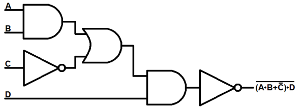
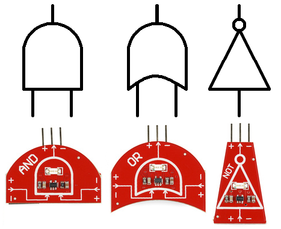
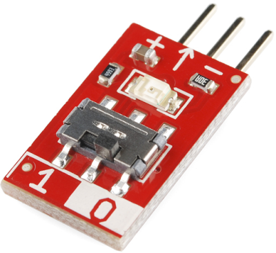
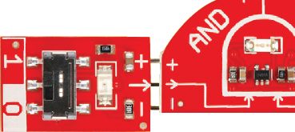
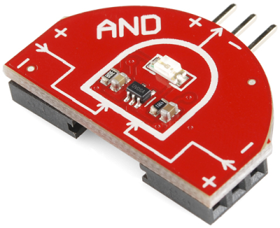
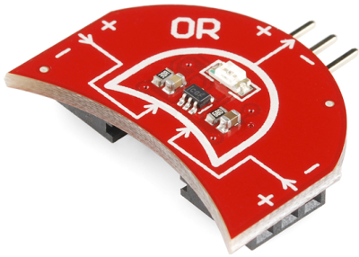
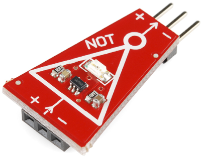
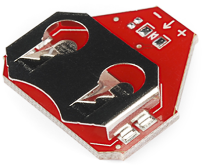
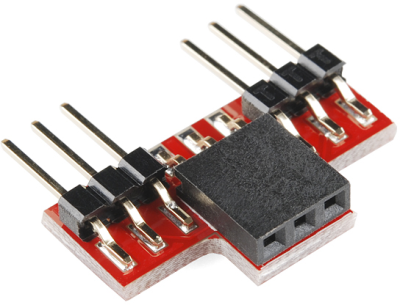

# LogicBlocksとデジタルロジック入門

デジタルエレクトロニクスの世界を動かしている原動力、デジタルロジックに実際に触れてみよう。
LogicBlocksキットは、デジタルロジックを発見し、その仕組みを目で見て確かめ、それが何を作り出せるのかを探るための入り口である。

このチュートリアルは、キットに同梱されている「LogicBlocks Kit Information」の小冊子の内容をもとにしており、その一部をここでも改めて紹介する。
すでにLogicBlocksキットに慣れ親しんでいるなら、1〜3章は読み飛ばして、実験編に直接進んでもかまわない。

このチュートリアルで扱う内容:

1. デジタルロジックとは何か
2. LogicBlocksの基礎
3. 各ブロックの詳細

参考になるチュートリアル:

LogicBlocksに取り組む前に、次のチュートリアルを先に読んでおくことをおすすめする。

- [アナログとデジタルの違い](./analog-vs-digital.md)：アナログ信号とデジタル信号の違いを扱うチュートリアル。ここでは*デジタル*ロジックについて多く語ることになるため重要である。
- [デジタルロジック](./digital-logic.md)：デジタルロジックの理論をさらに深く学びたいなら、このチュートリアルを確認してほしい。
- [2進数](./binary.md)：2進数はコンピュータの言語である。デジタルロジックは、2進数を足し合わせたり保存したりするために使う道具である。

## デジタルロジックとは何か

### デジタルとは何か

電子的な信号は、[アナログとデジタル](./analog-vs-digital.md)という2つのカテゴリーに分けられる。
アナログ信号はどんな形も取ることができ、無限の値を表現できる。
デジタル信号は、非常にはっきりと定義された、離散的な値の集合しか取らない。たいていはたった**2つ**だけである。

多くの電子システムはアナログとデジタルの回路を組み合わせて使っているが、たいていのコンピュータや日常的な電子機器の中心にあるのは、離散的なデジタル回路である。

### デジタルロジックとは何か

私たち人間は（たいてい）論理的な存在である。
何かを決断し、それに基づいて行動するとき、その裏では論理が働いている。
論理とは、1つ以上の入力を評価し、いくつもの結果と照らし合わせて、進むべき道筋を決めるプロセスのことである。
私たちがあらゆる決断に論理を用いているのと同じように、コンピュータもデジタルロジック回路を使って決断を下している。
コンピュータは、決断を伝えるために標準的な**論理ゲート**の組み合わせを使っている。

デジタルロジックについてさらに深く知りたい場合は、[デジタルロジックのチュートリアル](./digital-logic.md)を確認してほしい。

#### デジタルロジックはどこで見られるか

デジタルロジックは、あらゆる回路の中に存在する。
電源への接続はANDの一例である。電源とグラウンドの両方が接続されて初めて、回路に電気が流れる。

他にはどこにあるだろうか。至るところにある。
街の信号機は、歩行者が「歩行者用ボタン」を押したときに論理を使っている。
このボタンは、ANDの論理ゲートを使ったプロセスを起動する。
歩行者が歩行者用ボタンを押し、なおかつその歩行者が渡ろうとしている方向の車道の信号が赤であれば、歩行者用の青信号が点灯する。
このAND文の2つの条件のどちらかが満たされなければ、歩行者用の青信号が点灯することは決してない。

### 入力と出力

デジタルロジック回路は、デジタルの入力を使って論理的な判断を下し、デジタルの出力を作り出す。
どんな論理回路も、何らかの出力を作り出す前に、少なくとも1つの入力を必要とする。

デジタルロジックの入力と出力は、たいてい[2進数](./binary.md)である。
つまり、取りうる値は2通りしかないということである。

**2進数の値を表す方法**にはいくつかの種類がある。
もっとも簡潔で一般的なのは1/0という表記だが、TRUE/FALSE（真/偽）やHIGH/LOW（ハイ/ロー）というブール値としての表記を見かけることもある。
ハードウェアのレベルでこれらの値を表すときは、実際の電圧レベルが割り当てられることもある。0V（ボルト）が0を表し、それより高い電圧（たいてい3Vや5V）が1を表す。

| 1 | 0 |
| --- | --- |
| HIGH | LOW |
| True | False |
| 5V | 0V |

### 論理ゲート

コンピュータが論理的な判断を下すには、AND、OR、NOTという3つの**基本的な論理関数**の組み合わせを使う。

- AND：すべての入力がTRUEである場合、**かつその場合に限り**、TRUEを出力する
- OR：入力のうち**いずれか**（1つ以上）がTRUEであれば、TRUEを出力する
- NOT：唯一、入力を1つしか持たない演算子である。NOT演算子は入力を**否定**する。つまり、出力は入力の反対になる

これらの関数はそれぞれ、論理ゲートを使って実現できる。
論理ゲートは、デジタルロジック回路を作るために使われるものであり、コンピュータやその他の電子機器を構成する基本的な部品である。
論理ゲートは1つ以上の**入力**を受け取り、特定の**関数**（AND、OR、NOTなど）をそれらに適用し、その関数に基づいて**出力**を生み出す。

論理ゲートには、抵抗器やコンデンサ、インダクタと同じように、それぞれ固有の回路図記号がある。
そして、標準的な電子部品の記号と同じように、論理ゲートも入力線と出力線をつなぎ合わせることで回路図の中に描くことができる。

### 真理値表

論理ゲートや論理関数の「論理」は、真理値表、ベン図、ブール代数など、いくつかの方法で表すことができる。
その中でも、真理値表がもっとも一般的である。
真理値表とは、考えられるすべての入力の組み合わせと、それに対応する出力を漏れなく一覧にしたものである。

すべての入力は表の左側に、出力は右側に並べられる。
表の各行が、ひとつの入力の組み合わせに対応する。

| 入力A | 入力B | 出力Y |
| --- | --- | --- |
| 0 | 0 | 0 |
| 0 | 1 | 0 |
| 1 | 0 | 0 |
| 1 | 1 | 1 |

上の表はANDゲートの真理値表である。
ANDゲートは2つの入力と1つの出力を持つため、真理値表には入力用の列が2つ、出力用の列が1つある。
入力が2つあるということは、0/0、0/1、1/0、1/1という4通りの入力の組み合わせがあるということである。
そのため、ANDゲートの真理値表には、それぞれの入力の組み合わせに対応する4行がある。
ANDの出力が1になるのは、両方の入力がともに1である場合だけである。

## LogicBlocksの基礎

LogicBlocksには6種類のブロックがあり、論理ゲート、入力ブロック、ユーティリティブロックという3つのカテゴリーに分けられる。

### 論理ゲートブロック

論理ゲートのLogicBlocksには、AND、OR、NOTという3つの基本的な論理ゲートがある。
これらはできる限り、対応する回路図記号に似せた形になっており、ゲート名のラベルも付いている。

それぞれのゲートには1つの**出力**（先端がとがったオスのヘッダー）がある。
メスのヘッダーは**入力**を表しており、ANDゲートとORゲートには2つの入力が、NOTゲートには1つの入力がある。

論理ゲートのLogicBlocksにはそれぞれLEDが付いており、出力の状態を表している。
LEDが点灯していれば、そのゲートは1を出力しており、消灯していれば0を出力していることになる。

### 入力ブロック

入力ブロックは、LogicBlocksにデジタルの入力を与えるために使う。
入力ブロックの出力を0か1に切り替えるスイッチが付いている。
入力ブロックのLEDは、そのブロックが送り出している値を表示する。

入力ブロックには1つのオスの出力ヘッダーがあり、これをゲートブロックのメスの入力に差し込んで使う。

### ユーティリティブロック（とケーブル）

ユーティリティブロックの中でも重要なのが**電源ブロック**である。
それぞれの論理ゲートは動作するために電源を必要とし、この基板がそれを供給する役割を担う。
電源ブロックには1つのメスの入力ヘッダーがあり、回路の最後の論理ゲートの出力に接続する。
1つのデジタルロジック回路全体に対して必要な電源ブロックは、たった1つだけである。

**分配ブロック**というLogicBlocksもあり、これは1つの入力を2つの出力に分けるだけの役割を持つ。
信号に対して何か演算を行うわけではなく、単に通過させるだけである。
1つの入力を2つ以上の論理ゲートに流し込む必要がある、より複雑なデジタルロジック回路を作るときに便利である。

このカテゴリーにはフィードバックケーブルも含まれる。
このケーブルは、より高度なLogicBlocks回路において、たいてい分配ブロックと組み合わせて使われる。

### ルール

LogicBlocksを扱ううえでのルールは、実質的にひとつだけである。
あるブロックの出力を別のブロックの入力に接続するとき、3本のピンがそれぞれ正しく一致するようにすることである。
それぞれの入力と出力は、電源（＋）、グラウンド（－）、信号（→）という3本のピンで構成されている。

また、LogicBlocks回路には常に**電源ブロックがちょうど1つだけ**接続されている必要がある。

論理ブロック（あるいはケーブル）のすべての入力には、別のブロック（あるいはケーブル）の出力を接続しておく必要がある。
入力が浮いたまま（未接続のまま）になっていると、そのゲートは入力が1なのか0なのかを判別できず、結果として出力が不安定になってしまう。

### 応答時間

論理ゲートは、人間には到底感知できないほどの速さ（ナノ秒単位）で出力の判断を下す。
そこでLogicBlocksでは、その過程を目に見えるようにするため、あえて動作を遅くしてある。
LogicBlocksを長く連ねた場合、この遅延のおかげで、あるブロックの結果が別のブロックの入力にどう影響するかを視覚的に確認しやすくなる。

この遅延はおよそ0.5秒程度である。
何が起きているかを見るのにちょうどよい長さである。

## 各ブロックの詳細

ここでは、LogicBlocksキットに含まれる各部品の細かい仕様を見ていく。
それぞれのブロックの役割、**真理値表**、そして他にどのブロックと組み合わせられるかを確認する。

### 入力LogicBlock

入力ブロックは、LogicBlocksの世界を動かす原動力である。
この小さな長方形のブロックには1つのオスコネクタがあり、ゲートブロック、電源ブロック、分配ブロックのメスの入力ピンに差し込むことができる。

それぞれの入力ブロックには2ポジションのスイッチがあり、これを使ってブロックを1または0（TRUEまたはFALSE、ONまたはOFF）に設定する。

入力ブロックの**緑色のLED**は、そのブロックが出力している値を表す。
LEDが点灯していれば、そのブロックは1に設定されていることを示す。
LEDが消灯していれば、出力値は0である。

### ANDゲートLogicBlock

ANDのLogicBlockは、2入力1出力のANDゲートである。
このブロックはANDゲートの回路図記号によく似た「D字型」をしている。
2つのメスの入力ヘッダーはANDブロックの両側にあり、出力は上部中央にある。

これらの入力には、**入力ブロック**または別の**ゲートブロック**の出力を接続できる。
オスの出力ヘッダーは、別のゲートの入力、あるいは**電源ブロック**に接続できる。

それぞれのANDゲートブロックには**青色のLED**が1つ付いており、ゲートの出力を表す。
LEDが点灯していれば、そのANDゲートは出力として1（TRUE、ON）を出していることを意味する。
LEDが消灯していれば、ANDゲートの出力は0である。

#### ANDの真理値表、回路記号、ブール記法

ANDブロックの真理値表は次のとおりである。

| 入力A | 入力B | 出力 |
| --- | --- | --- |
| 0 | 0 | 0 |
| 0 | 1 | 0 |
| 1 | 0 | 0 |
| 1 | 1 | 1 |

そして、これからよく目にすることになるANDゲートの回路記号がある。
ANDのブール式の記号は中点（·）である。
たとえば上のゲートは、**A · B = Y**という式で表せる。

### ORゲートLogicBlock

ORのLogicBlockは、2入力1出力のORゲートである。
このブロックはORゲートの回路図記号のような形をしており、出力側が凸型の弧、入力側が凹型の弧になっている。
2つのメスの入力はORブロックの両側にあり、出力はブロック上部中央にある。

2つの入力のどちらにも、**入力ブロック**または別の**ゲートブロック**の出力を接続できる。
このオスの出力コネクタは、別のゲートの入力、あるいは**電源ブロック**に接続できる。

それぞれのORゲートブロックには**黄色のLED**が1つ付いており、ゲートの出力を表す。
LEDが点灯していれば、そのORゲートは出力として1（TRUE、ON）を出していることを意味する。
LEDが消灯していれば、ORゲートの出力は0である。

#### ORの真理値表、回路記号、ブール記法

2入力1出力のORゲートの真理値表は次のとおりである。

| 入力A | 入力B | 出力 |
| --- | --- | --- |
| 0 | 0 | 0 |
| 0 | 1 | 1 |
| 1 | 0 | 1 |
| 1 | 1 | 1 |

そして、ブロック自体の形によく似た回路記号がある。
ORのブール式の記号はプラス記号（+）である。
上のOR回路は、**A + B = Y**というブール式で表せる。

### NOTゲートLogicBlock

NOTのLogicBlockは、1入力1出力のNOTゲートである。
このブロックは台形の形をしている（三角形のNOTゲート回路記号にできるだけ近づけた形である）。
メスの入力コネクタは辺の長いほうの側にあり、出力は辺の短いほうの側にある。

この入力には、**入力ブロック**または別の**ゲートブロック**の出力を接続できる。
このオスコネクタは、別のゲートの入力、あるいは**電源ブロック**に接続できる。

それぞれのNOTブロックには**赤色のLED**が1つ付いており、ゲートの出力を表す。
LEDが点灯していれば、そのNOTゲートは出力として1（TRUE、ON）を出していることを意味する。
LEDが消灯していれば、NOTゲートの出力は0である。

#### NOTの真理値表、回路記号、ブール記法

NOTゲートは受け取った信号を反転させるため、**インバータ**とも呼ばれることが多い。
0は1に、1は0に変わる。
インバータの真理値表はおおよそ次のようになる。

| 入力A | 出力 |
| --- | --- |
| 0 | 1 |
| 1 | 0 |

ブール式を書くとき、NOT演算はたいてい、反転させる変数の上に引かれた**バー**（横線）で示される。
たとえば上の回路のブール式は、単純にAの上に横線を引いた形で表される。

### 電源LogicBlock

電源なしに動作する電子回路は存在しない。そこで登場するのが電源ブロックである。

電源ブロックは、1枚の**20mmコイン電池**で動作し、最適な状態でおよそ3Vを供給し、かなり長持ちする。
LogicBlocksは2V〜5Vの範囲で動作し、消費電流もごくわずかである。

電源ブロックには1つのメスコネクタがあり、**ゲートブロック**の出力に接続する。
どの回路でも、接続してよい電源ブロックは1つだけである。

電源ブロックは、あらゆるLogicBlocks回路の最後のピースである。
一連の論理ゲートのうち、一番最後のゲートの出力に接続する必要がある。

### 分配LogicBlockとフィードバックケーブル

分配ブロックを使うと、1つのブロックの出力を2つの別々のブロックの入力に流し込むことができる。

より高度な回路を作る際には、複数のゲートに入力を分配したり、フィードバックを加えたりしたくなることがある。
そんなときに役立つのが、分配ブロックとフィードバックケーブルである。
フィードバックケーブルは、たいてい分配ブロックの2つの出力のうちの一方に接続して使われる。

フィードバックケーブルは、赤、黄、黒の3本の配線でできている。
赤は必ず＋ピンに、黒は－ピンに接続し、黄色は信号をそのまま通過させる。

## まとめ

LogicBlocksとデジタルロジックの基礎を学んだところで、いよいよ実験の時間である。
LogicBlocks Experimenter's Guideでは、ここまでに紹介したわずかな部品を使って、2対1マルチプレクサをはじめとする、あらゆる基本的な論理回路を組み立てていく。

タグ: 概念、電気工学

---

出典：[LogicBlocks & Digital Logic Introduction](https://learn.sparkfun.com/tutorials/logicblocks--digital-logic-introduction)（SparkFun Learn）を日本語に翻訳し、再構成した。
原文は [CC BY-SA 4.0](https://creativecommons.org/licenses/by-sa/4.0/) ライセンスで公開されており、本ページも同ライセンスの下で提供する。
