# LogicBlocks実験ガイド

## はじめに

[LogicBlocksの入門チュートリアル](./logicblocks--digital-logic-introduction.md)（あるいはキットに付属のドキュメント）を読み終え、いよいよ実験の準備ができただろうか。LogicBlocksの出番である。

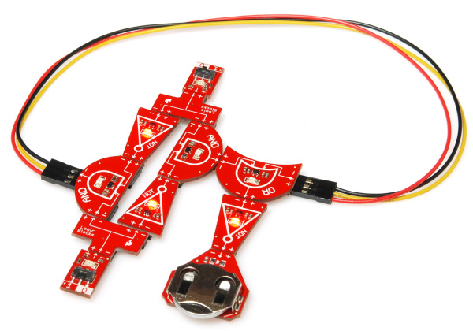

このXNORのような、大がかりなLogicBlocks回路もあっという間に組めるようになるはずである。

### 目次

このガイドで扱う実験の一覧を示す。

1. 2入力ANDゲート
2. 3入力ANDゲート
3. NAND、NOR、ド・モルガンの法則
4. 組み合わせ論理
5. リングオシレータ
6. SRラッチ
7. 2-to-1マルチプレクサ
8. 1-to-2デコーダ（デマルチプレクサ）
9. XORゲート
10. LogicBlocksのその先へ

それぞれの実験には回路図と、それに対応するテスト対象回路のLogicBlocksの配置図が含まれている。

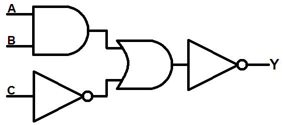

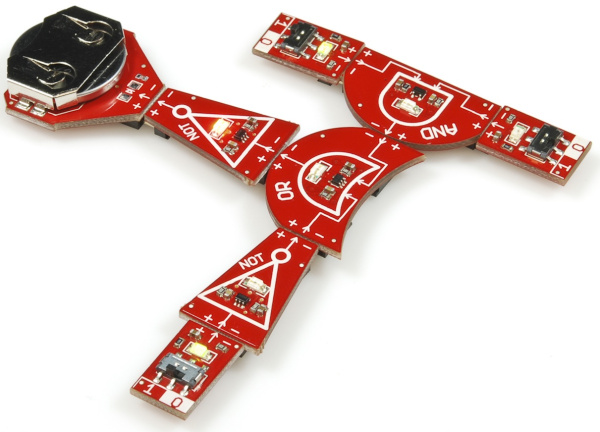

また、各実験には**真理値表**、**状態図**、**論理式**もちりばめられている。
そして最後には課題や設問、副実験が用意されている。それぞれの実験を最大限に活用するため、ぜひ副実験にも目を通してほしい。

## 1. 2入力ANDゲート

最初の実験は、できる限り単純なところから始める。2つの入力と1つの出力を持つANDゲートである。

### 必要なもの

- ANDブロック × 1
- 入力ブロック × 2
- 電源ブロック × 1

### 回路図

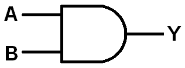

### LogicBlocksの配置

特に難しいことはない。ANDブロックの各入力に、それぞれ入力ブロックを挿入する。そして、ANDブロックの出力に電源ブロックをつなぐ。

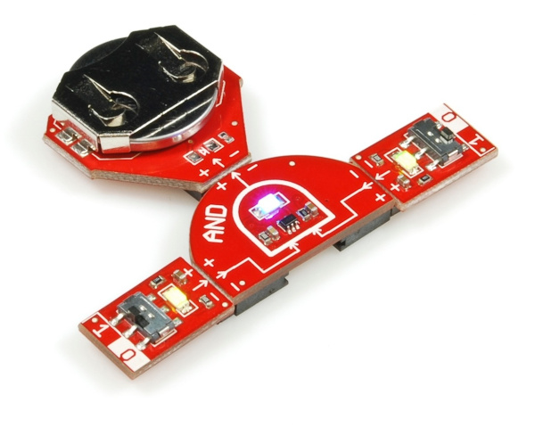

**ANDブロック上の青いLED**が、この回路の出力状態を示す。

### 実験

考えられる4通りの入力の組み合わせ、0/0、0/1、1/0、1/1をすべて試してみよう。ANDゲートの真理値表は次のようになるはずである。

| 入力A | 入力B | 出力 |
| --- | --- | --- |
| 0 | 0 | 0 |
| 0 | 1 | 0 |
| 1 | 0 | 0 |
| 1 | 1 | 1 |

- 青いANDブロックのLEDは、予想どおりに点灯しただろうか。

### 副実験

ここまで来たついでに、他の2つの基本ゲートについても見ておこう。2入力ORと、1入力NOTである。

#### 2入力ORゲート

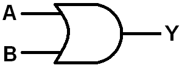

基本的な2入力ORゲートを、LogicBlocksで配置できるだろうか。ANDと似たようなブロックの構成になる。

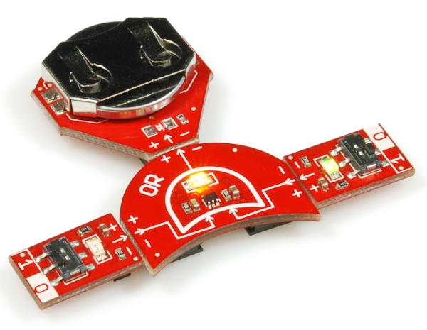

実際に試してみたら、次のORの真理値表を埋められるだろうか。

| 入力A | 入力B | 出力 |
| --- | --- | --- |
| 0 | 0 | |
| 0 | 1 | |
| 1 | 0 | |
| 1 | 1 | |

#### NOTゲート

続いて、NOTゲートでも同じことをやってみよう。

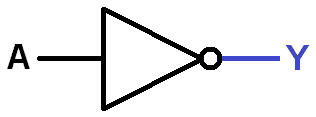

今回必要な入力ブロックは1個だけである。

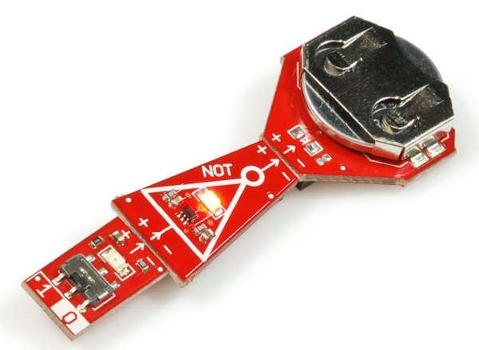

NOTの真理値表を埋められるだろうか。

| 入力A | 出力 |
| --- | --- |
| 0 | 1 |
| 1 | 0 |

---

3つの基本論理ゲートの扱いがわかったところで、入力を増やしてみよう。次の実験に進む。

## 2. 3入力ANDゲート

3つ以上の入力をANDでまとめたい場面もある。実のところ、3入力・4入力のANDゲートは、2入力タイプと同じくらいよく使われる。2つの2入力ANDゲートから、3入力ANDゲートを作ってみよう。

### 必要なもの

- 入力ブロック × 3
- ANDブロック × 2
- 電源ブロック × 1

### 回路図

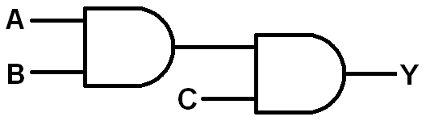

### LogicBlocksの配置

前回の実験の2入力ANDブロックを組み立て、その出力をもう一つのANDの入力に接続する。そして、2つ目のANDのもう一方の入力に、入力ブロックを追加する。

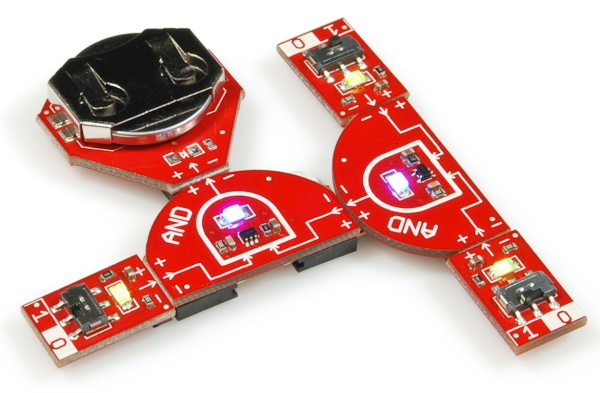

2つ目のANDの出力に電源ブロックを追加して、回路を完成させる。

**2つ目のANDゲート上の青いLED**が、この回路の出力を表す。

### 実験

合計3つの入力があると、何通りの入力の組み合わせが作れるだろうか。8通りである。この数は、入力の数を*n*とすると2*n*という指数関数的な増え方をする。つまり、4入力ANDゲートには16通り、5入力なら32通りの組み合わせがある。

考えられるすべての入力の組み合わせを試し、以下の真理値表を埋めてみよう。

| 入力A | 入力B | 入力C | 出力Y |
| --- | --- | --- | --- |
| 0 | 0 | 0 | |
| 0 | 0 | 1 | |
| 0 | 1 | 0 | |
| 0 | 1 | 1 | |
| 1 | 0 | 0 | |
| 1 | 0 | 1 | |
| 1 | 1 | 0 | |
| 1 | 1 | 1 | |

- ある結果が真になるために、3つの条件がすべて満たされる必要がある、という現実の場面を思いつけるだろうか。
- ANDブロックがもっとたくさんあったら、4入力ANDブロックはどんな形になるか想像できるだろうか。

### 副実験

2つのORゲートと3つの入力ブロックを使い、3入力ORゲートを作ってみよう。

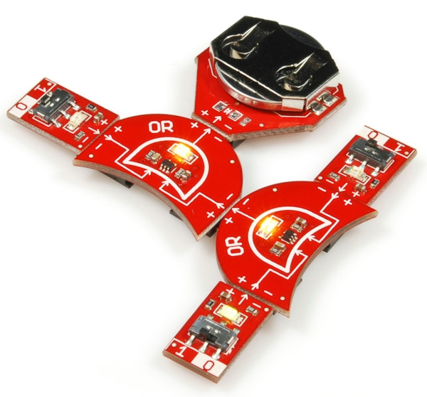

- この回路の**回路図**を描いてみよう。
- この回路の**真理値表**を書き出してみよう。3入力ANDの回路と同じく、この回路にも8通りの入力の組み合わせがある。ただし、出力の列にはずっと多くの1が並ぶはずである。

## 3. NAND、NOR、ド・モルガンの法則

NAND、つまり*NOT* AND（否定されたAND）は、ANDゲートの出力にインバータを置くことで得られる。
NANDゲートはデジタル論理の世界で非常によく使われている。専用の回路記号まであり、ANDゲートの出力に「泡（バブル）」を付けた形で表される。

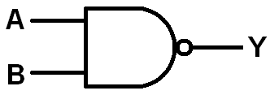

LogicBlocksで作ってみよう。

### 必要なもの

- ANDブロック × 1
- NOTブロック × 1
- 入力ブロック × 2
- 電源ブロック × 1

### LogicBlocksの配置

この配置は実験1の構成に似ているが、**ANDブロックの出力と電源ブロックの間にNOTゲートを追加する**点が異なる。

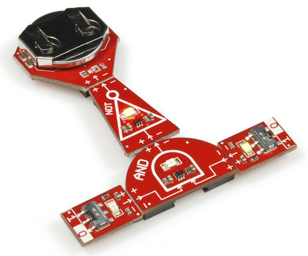

この回路の出力は、**NOTゲート上の赤いLED**で示される。

### 実験

入力が2つあるので、考えられる組み合わせは4通りである。すべて試して、2入力NANDゲートの真理値表を埋めてみよう。

| 入力A | 入力B | 出力 |
| --- | --- | --- |
| 0 | 0 | 0 |
| 0 | 1 | 0 |
| 1 | 0 | 0 |
| 1 | 1 | 1 |

- ANDゲートの真理値表と比べて、どう違うだろうか。

### 副実験

ORゲートも同じように否定すれば、**NOR**を作ることができる。

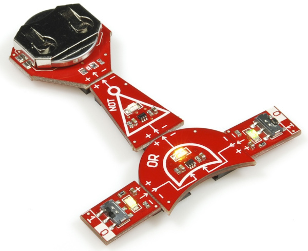

こちらにも専用の「泡付き」回路記号がある。

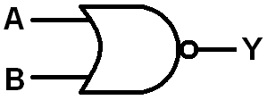

- 2入力NORゲートの真理値表はどうなるだろうか。

#### ド・モルガンの法則

ここまでNANDとNORの話をしていると、ド・モルガンの法則について語りたくてうずうずしてくる。ド・モルガンの法則を使えば、NANDをORに、NORをANDに変換できる。この法則には2つの部分がある。

1. **2入力NAND**は、**2つの反転入力をORした**ものと等価である。論理式で書くと次のようになる。

   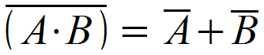

2. **2入力NOR**は、**2つの反転入力をANDした**ものと等しい。論理式では次のようになる。

   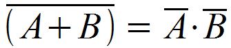

自分で確かめてみよう。LogicBlocksで以下の回路、つまり2つの反転入力をORゲートに入れた回路を組み、先ほどNANDゲートで埋めた真理値表と比較してみてほしい。

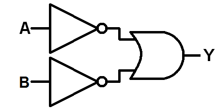

真理値表は一致しただろうか。これで、ド・モルガンの法則の前半部分を自分の手で確かめたことになる。

ここで「それが何の役に立つのか」と思うかもしれない。デジタル論理の大きな目的の一つは、回路を単純化し、できるだけ少ないゲート数で済ませることにある。ド・モルガンの法則のおかげで、NANDゲート1種類だけで他のあらゆるゲートの代わりを務めさせることができる。

たとえば、**NOTはNANDから作れる**。片方の入力を常にハイに固定するだけでよい。

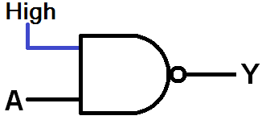

あるいは、**3個のNANDゲートでORを作る**こともできる。

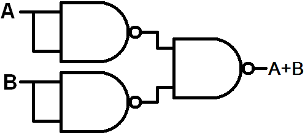

あるいは、**2個のNANDでAND**を作ることもできる。

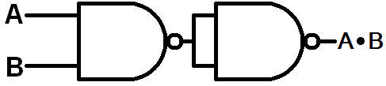

NANDゲートのこの汎用性こそ、まさに魔法のようなものである。

## 4. 組み合わせ論理

これまでの実験の回路は、すべて組み合わせ論理回路の例だった。組み合わせ回路では、**出力は現在の入力の状態のみに依存する**。回路は一方向に流れ、（慣例的に）左側の入力から右側の出力へと向かう。

組み合わせ論理の対極にあるのが**順序**論理であり、そこでは回路の現在の出力が将来の出力に影響を与える。これについては、後の実験で扱う。

LogicBlocksで組める組み合わせ論理回路の例を紹介する。

回路図に示された入力の名前（AとBがANDゲートに入り、Cが最初のNOTゲートを通る）から、次のような論理式を作ることができる。

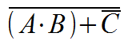

出力は、((AとBのAND) または Cの否定)を否定したものである（演算の順序を間違えないように）。この回路をLogicBlocksで組んでみよう。

### 必要なもの

- ANDブロック × 1
- ORブロック × 1
- NOTブロック × 2
- 入力ブロック × 3
- 電源ブロック × 1

### LogicBlocksの配置

2つの**入力ブロック**を持つ**ANDブロック**の出力を、**ORブロック**の一方の入力に接続する。ORブロックのもう一方の入力は、**入力ブロック**を接続した**NOTブロック**につなぐ。最後に、ORブロックの出力を**もう一つのNOTブロック**に通し、それを**電源ブロック**に接続する。

この組み合わせ論理回路の出力は、**最後のNOTブロック上の赤いLED**で示される。

### 実験

考えられる8通りの入力の組み合わせをすべて試し、この回路の真理値表を埋めてみよう。

| 入力A | 入力B | 入力C | 出力Y |
| --- | --- | --- | --- |
| 0 | 0 | 0 | |
| 0 | 0 | 1 | |
| 0 | 1 | 0 | |
| 0 | 1 | 1 | |
| 1 | 0 | 0 | |
| 1 | 0 | 1 | |
| 1 | 1 | 0 | |
| 1 | 1 | 1 | |

- これは、先ほどの論理式と一致しているだろうか。
- もう一度その論理式、あるいは回路図をよく見てみよう。NANDやNORが隠れていることに気づけば、**ド・モルガンの法則**を使ってこの式を単純化できるだろうか。実はできる。まず、インバータをORゲートの中に押し込んで、NORに変えてみよう。

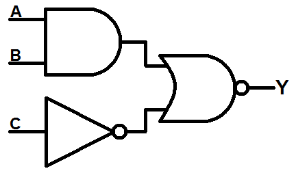

続けてド・モルガンの法則を適用する。バブルをNORゲートの中に押し込んでANDに変え、両方の入力側にNOTゲートを生み出す。

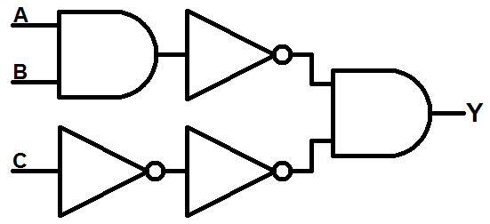

C入力にある2つのNOTゲートは互いに打ち消し合うので、両方とも取り除いてしまってよい。最初のANDの出力にあるNOTゲートは、そのゲート自体に押し込んでNANDゲートに変えられる。

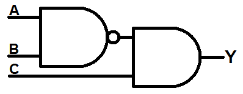

これで、ORゲートを完全になくすことができた。この回路が、実験の最初に使った回路とまったく同じ真理値表を生成すると信じられるだろうか。自分で試してみよう。

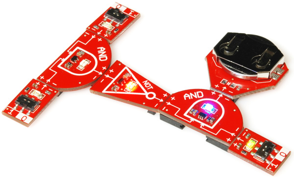

### 副実験

- 次の実験では、組み合わせ論理から順序論理へと、かなり大きく話が飛ぶ。ここでいったん、LogicBlocksで自由に遊びながら、自分なりの回路を作ってみることを強くおすすめする。そのうえで、回路図と真理値表を自分で描き出してみてほしい。
- デジタル論理で解決できそうな、現実の場面を何か思いつけるだろうか。

## 5. リングオシレータ

オシレータ（発振回路）とは、出力が周期的かつ繰り返し変動する回路のことである。オシレータはほとんどの電子回路にとって欠かせない要素であり、クロックから電波まで、あらゆるものを作り出すのに使われる。発振を作り出す回路にはさまざまな種類があり、[オペアンプ](https://www.sparkfun.com/products/9456)、[水晶振動子](https://www.sparkfun.com/products/11630)、[555タイマー](https://www.sparkfun.com/products/9273)、そしてもちろん論理ゲートを使うこともできる。

**奇数個のNOTゲート**を鎖状につなぎ、フィードバックを導入する、つまり最後のインバータの出力を最初の入力へループさせることで、リングオシレータを作ることができる。LogicBlocksで組んでみよう。

### 必要なもの

- NOTブロック × 3
- スプリッターブロック × 1
- フィードバックケーブル × 1
- 電源ブロック × 1

### 回路図

この回路では、これまでちらっとしか触れてこなかった概念、**順序回路**が登場する。組み合わせ回路とは異なり、順序回路の出力は過去の出力状態に依存する。

リングオシレータの回路は、次のようになる。

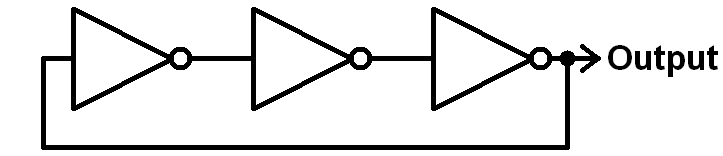

3つ目、つまり最後のNOTゲートの出力が、2方向に分岐しているのがわかるだろうか。1つはこれまでどおりそのまま出力へ向かうが、もう1つは最初のNOTゲートの入力へとループして戻っていく。これは**フィードバック**と呼ばれ、順序回路とほぼ同義の用語である。出力の現在の状態は、過去に何をしていたかに依存する。

### LogicBlocksの配置

まず**3個のNOTゲート**をつなぎ、3個目の出力を**スプリッターブロック**に接続する。**フィードバックケーブル**を使い、スプリッターブロックの出力の一方を最初のNOTゲートの入力に接続する。最後に、スプリッターブロックのもう一方の出力に**電源ブロック**を接続する。

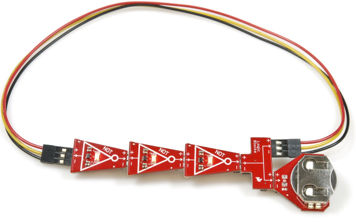

この回路の出力は、**3つ目、つまり最後のNOTブロック上の赤いLED**で示される。

### 実験

この回路の真理値表はどうなるだろうか。いや待ってほしい。そもそも真理値表など存在するのだろうか。入力が一つもないのだから。
標準的な真理値表の代わりに、現在の出力の値が直前の出力に依存することを定義する**状態表**を作ることができる。

| 直前の出力 | 現在の出力 |
| --- | --- |
| 0 | 1 |
| 1 | 0 |

- インバータの数は**奇数**でなければならないのだろうか。インバータの数が偶数だとどうなるだろうか。1個取り除いて試してみよう。
- 最後のNOTブロックのLEDが、どれくらいの速さで点滅しているか計算できるだろうか。それぞれのブロックにはおよそ1秒の遅延がある。インバータの数を5個に増やすと、出力の点滅の速さにどんな影響があるだろうか。

### 副実験

場合によっては、オシレータに**イネーブル入力**を持たせておくと便利なことがある。イネーブル入力（多くのデジタル論理回路によく見られる）は、回路全体の動作を制御する。イネーブル入力が1のとき、回路は通常どおり動作するが、0のときは回路の動作が停止する。

ANDゲートを導入することで、リングオシレータにイネーブル入力を追加できる。次の回路図を見てほしい。

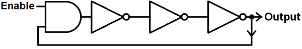

（フィードバックケーブルを外して）**ANDブロック**を最初のNOTゲートに接続して組み立てる。次に、フィードバックケーブルのオス側をANDブロックの一方の入力に、**入力ブロック**（イネーブル用）をもう一方の入力に接続する。

これで、イネーブル入力のスイッチを切り替えて、オシレータの出力にどう影響するか確認してみよう。

このときの状態表はどうなるだろうか。

| イネーブル | 直前の出力 | 現在の出力 |
| --- | --- | --- |
| 0 | 0 | |
| 0 | 1 | |
| 1 | 0 | |
| 1 | 1 | |

## 6. SRラッチ

ラッチ（**フリップフロップ**とも呼ばれる）は、**データ記憶**の基本的な構成要素である。1個のラッチは1ビットのデータを保持できるが、この数を何桁も増やしていけば、キロバイト、メガバイト、ギガバイト、さらにはテラバイトのメモリを作ることができる。もちろん、たいていのデジタル回路と同様、ラッチもデジタル論理ゲートから作られている。

ラッチにはさまざまな種類があり、SR、D、JK、Tといった、いささか暗号めいた名前が付いている。ここで扱うSRラッチは、もっとも基本的な形のラッチの一つである。

SRラッチにはいくつかの作り方がある。NORによるSRラッチの例を示す。

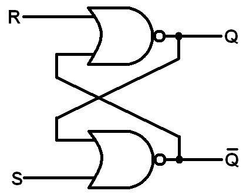

**フィードバック**に気づいただろうか。これもまた順序論理回路である。2つのNORゲートは、それぞれの出力がもう一方の入力へと流れ込んでいる。制御可能な入力は2つ、リセット（R）とセット（S）で、これらが2つの出力QとQ（バーQ、「Qノット」）を生み出す。これが、SRラッチという名前の由来である。**セット／リセット**ラッチというわけである。

SRラッチには、絶対に破ってはならないルールがある。**Qは常にQの反対でなければならない**というものである。これらの出力は**補数（コンプリメント）**と呼ばれる。実際の用途では、たいていQだけが本当に重要な出力であり、ラッチのデータはたいていここに保存・読み出しされるが、2つの出力が互いに反対であることは重要な性質として押さえておく必要がある。

SRラッチは非常に重要な回路なので、専用の回路記号まで用意されている。

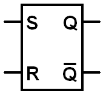

以下が状態表だが、少し変わった形をしている。この回路は順序回路であるため、Qの現在の値はその直前の状態に依存する。

| S | R | 直前のQ | 現在のQ | 現在のQ |
| --- | --- | --- | --- | --- |
| 0 | 0 | 0 | 0（変化なし） | 1 |
| 0 | 0 | 1 | 1（変化なし） | 0 |
| 0 | 1 | 0 | 0（変化なし） | 1 |
| 0 | 1 | 1 | 0 | 1 |
| 1 | 0 | 0 | 1 | 0 |
| 1 | 0 | 1 | 1（変化なし） | 0 |
| 1 | 1 | 0 | 0（禁止：QとQが補数にならない） | 0 |
| 1 | 1 | 1 | 0（禁止：QとQが補数にならない） | 0 |

言葉で表すと、出力Qは次のいずれかの状態を取りうる。

- **保持**：SとRがともに0のとき、Qはそのまま変化しない。以前の値を保ち続ける。0だったなら0のまま、1だったなら1のままである。
- **セット**：Sを1に変えると、Qの出力を「セット」できる可能性がある。Qが0だった場合、Sを1に変えるとQも1になる。Qがすでに1だった場合、S=1にしても何も起こらない。
- **リセット**：R入力を0から1に動かすと、Qを「リセット」できる。Qが1*だった*場合、Rを1にするとQは0になる。しかし、Qがすでに0だった場合、Rは何の影響も与えない。
- **禁止**：**SとRの両方が1**のとき、禁止領域に入る。QとQは互いに補数でなければならないというルールが破られ、両方とも0になってしまう。そのため、S=1かつR=1という組み合わせを禁止の組み合わせと呼ぶ。たいていのラッチ回路では、これらの入力が両方とも1にならないよう、あらかじめ対策が講じられている。今回のLogicBlock回路にはそこまで賢い仕組みはないので、両方が同時に1にならないよう「回路の安全対策」は自分の手で講じる必要がある（心配はいらない。両方の入力をハイにしても、宇宙がこの矛盾に耐えられなくなることはない）。

Qが取りうる状態は、**状態図**でまとめることもできる。

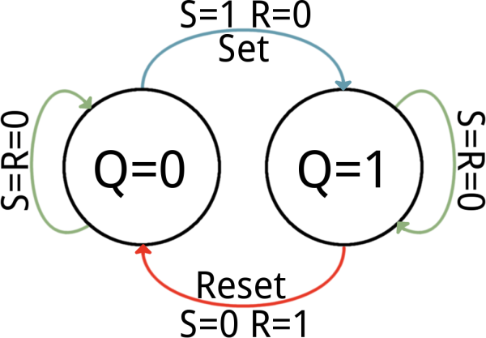

概念的な話はこのくらいにして、LogicBlocksでSRラッチを組んでみよう。

### 必要なもの

- ORブロック × 2
- NOTブロック × 2
- 入力ブロック × 2
- スプリッターブロック × 1
- フィードバックケーブル × 1
- 電源ブロック × 1

### LogicBlocksの配置

次のようにLogicBlock回路を組み立てる。

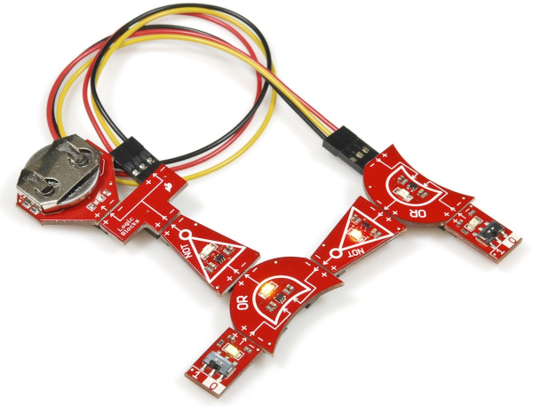

頭の中で、両方の入力に名前を付けておく必要がある。片方を**R**（リセット）、もう片方を**S**（セット）としよう。この回路は対称的なので、どちらをどう呼んでもかまわないが、入力の名前によってどちらの出力がどちらになるかが決まる。

この回路で注目すべき出力は2つあり、どちらも**NOTゲート上の赤いLED**で示される。**S**を直接の入力とするORゲートから続くNOTゲートは、**Q**出力を示す。**Q**出力は、**R**を入力とするORゲートから続くNOTゲート上の赤いLEDで示される。

### 実験

次の手順を試し、QとQの両方の出力を観察してみよう。

1. 最初の状態が必要である。まず**S=0**、**R=0**に設定する。
2. 次に**R=1**にする。Qは「リセット」されるはずで、それまで0でなければ0になる。すでに0だったなら、そのままである。ルールに従い、Qは1になっているはずである。
3. **R=0**にする。QもQも変化しないはずである。そのまま保持される。
4. **S=1**にする。今度はQが「セット」され、ハイになり、Qはローになる。
5. **S=0**にする。QにもQの補数にも、何の影響もないはずである。

- これがメモリの一部としてどう機能しうるか、想像できただろうか。Q出力に1ビットのデータが保存されていると考えてみてほしい。
- SとRの両方を1にして、**禁止状態**に入ってみよう。QとQはどちらも0になるはずである。補数のルールが破られてしまった。これを防ぐため、たいていの場合、入力に安全策（さらなる論理ゲートという形で）が講じられ、禁止の組み合わせが許可された入力値に変換される。

### 副実験

**NANDゲート**を使ってラッチを作ることもできる。ORをANDに置き換えるだけである。入力の名前を、それが生み出す結果と一致させるため、SとR（あるいは見方によってはQとQ）の入力も入れ替える。

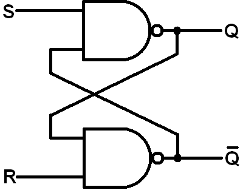

LogicBlocksでは、次のように配置する（ORブロックをANDブロックに置き換えるだけでよい）。

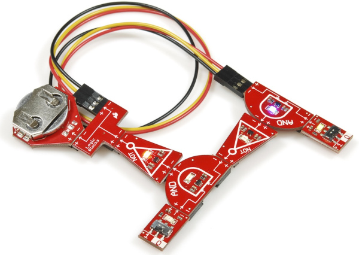

依然として2つの安定状態を持つが、真理値表は変わる。NAND SRラッチの**状態表**を書き出し、先ほどのNOR SRラッチと比較してみよう。この場合、どの入力の組み合わせが禁止出力を生み出すだろうか。

| S | R | 直前のQ | 現在のQ | 現在のQ |
| --- | --- | --- | --- | --- |
| 0 | 0 | 0 | | |
| 0 | 0 | 1 | | |
| 0 | 1 | 0 | | |
| 0 | 1 | 1 | | |
| 1 | 0 | 0 | | |
| 1 | 0 | 1 | | |
| 1 | 1 | 0 | | |
| 1 | 1 | 1 | | |

- ラッチは、SRAM（スタティックRAM）を含む、さまざまな種類のメモリの構成要素になっている。ここまで見てきたとおり、1個のラッチは1ビットのデータを保存できる。1Mb（100万ビット）のSRAMには、いったい何個のラッチが使われていると思うだろうか。それは何個のNORゲートに相当するだろうか。とんでもない数である。

## 7. 2-to-1マルチプレクサ

マルチプレクサ（**マルチプレクサ**、略して**mux**）は、多くの信号を1本にまとめるためによく使われるデジタル回路である。複数のデータソースに、共通の1本のデータ線を共有させたい場合、マルチプレクサを使ってその線へ流し込む。マルチプレクサにはさまざまな形やサイズのものがあるが、どれも論理ゲートで作られている。

すべてのマルチプレクサには、少なくとも1本の選択線があり、どの入力信号を出力へ中継するかを選ぶのに使われる。2-to-1マルチプレクサには、選択線が1本だけある。入力が増えれば、選択線も増える。4-to-1マルチプレクサには選択線が2本、8-to-1には3本、というように増えていく（2*n*個の入力には*n*本の選択線が必要になる）。

マルチプレクサを「デジタルスイッチ」だと考えてみよう。選択線はスイッチの切り替えレバーであり、多数の入力のうちどれが出力になるかを選んでいる。

論理ゲートで2-to-1マルチプレクサを作る方法を紹介する。AとBが2つの入力、Xが選択入力、Yが出力である。

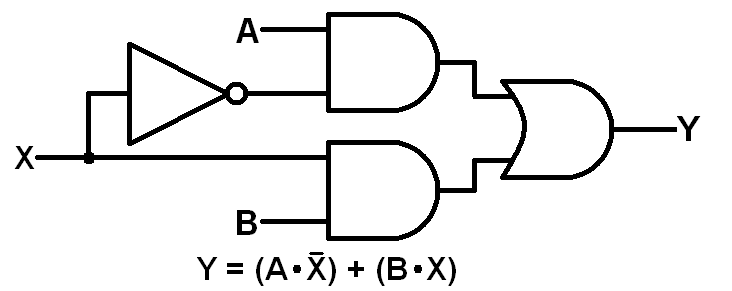

この回路の真理値表は、次のようになる。

| 選択入力（X） | 入力A | 入力B | 出力Y |
| --- | --- | --- | --- |
| 0 | 0 | 0 | 0 |
| 0 | 0 | 1 | 0 |
| 0 | 1 | 0 | 1 |
| 0 | 1 | 1 | 1 |
| 1 | 0 | 0 | 0 |
| 1 | 0 | 1 | 1 |
| 1 | 1 | 0 | 0 |
| 1 | 1 | 1 | 1 |

LogicBlocksの時間である。

### 必要なもの

- ANDブロック × 2
- ORブロック × 1
- インバータブロック × 1
- スプリッターブロック × 1
- 入力ブロック × 3
- フィードバックケーブル × 1
- 電源ブロック × 1

### LogicBlocksの配置

以下の配置図に従って、2-to-1マルチプレクサを組み立てる（ヒント：+と−のラベルの組み合わせに、筆者たち以上に注意を払ってほしい）。

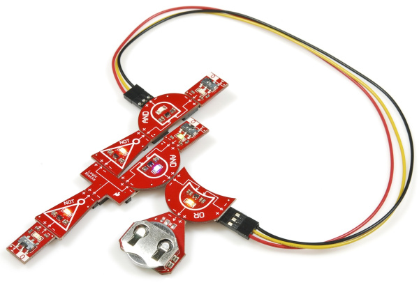

それぞれの入力に、頭の中でラベルを付けておく必要がある。**選択入力（X）**は、NOTゲートに単独でつながっている入力である。残りの2つの入力が**AとB**であり、これは好きなように名付けてよい。

このマルチプレクサの出力は、**ORゲート上の黄色いLED**で示される。

### 実験

次の手順で試してみよう。

1. 初期状態：3つの入力すべてを0にする。出力は0になるはずである。
2. **Aを1に切り替える**。選択スイッチが0に設定されている間は、B入力が出力に流れているため、出力には何も起こらないはずである。
3. **B入力を1に切り替える**。出力を観察し、Bを0に戻す。出力はB入力の切り替えに追従するはずである。
4. **セレクタを1に切り替える**。今度は出力がA入力に追従するようになり、Bが何であっても関係なくなる。

- この回路は組み合わせ回路だろうか、順序回路だろうか（「フィードバック」ケーブルの名前に惑わされないように）。
- 4-to-1マルチプレクサがどんな形になるか想像できるだろうか。入力線が2倍必要になる。つまり、選択線2本と4通りの入力である。4-to-1マルチプレクサの（色分けされた）回路図を紹介する。

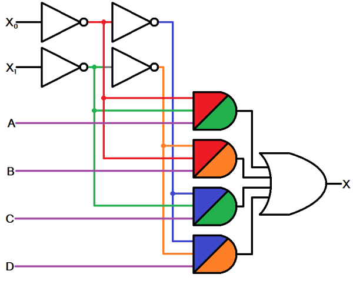

4-to-1のデマルチプレクサには、3入力ANDが4個、NOTが4個、4入力ORが1個必要になる。この回路によって、A、B、C、Dのいずれかを選んでX出力へ送ることができる。X0とX1が選択を担う。

- 8-to-1マルチプレクサには、何個のゲートが必要になると思うだろうか。

## 8. 1-to-2デコーダ（デマルチプレクサ）

マルチプレクサの逆にあたるのがデマルチプレクサで、デマルチプレクサ（demux）やデコーダとも呼ばれる。デマルチプレクサは、1本の入力線を複数の出力線のいずれかへ通すことができ、こちらも選択線を使ってどの出力へ送るかを決める。

2-to-1デマルチプレクサの回路図は、次のようになる。

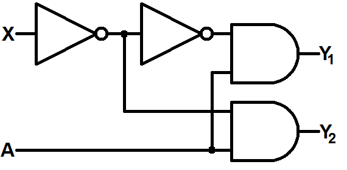

入力はXとAの2つ、出力はY1とY2の2つである。Xがセレクタ入力であり、A入力を2つの出力のどちらに送るかを決める。Xが0のとき、Y2の出力はAをそのまま映す（一方Y1は常に0になる）。Xが1のとき、A入力はY1に送られる。

デマルチプレクサは、システムで使える出力が限られていて、それでいて多数の入力デバイスとやり取りする必要がある場合に、非常に重宝する。

### 必要なもの

- ANDブロック × 2
- NOTブロック × 2
- 入力ブロック × 2
- スプリッターブロック × 2
- 電源ブロック × 1
- フィードバックケーブル × 1

### LogicBlocksの配置

以下のようにLogicBlocks回路を組み立てる。フィードバックケーブルを使って、片方のスプリッターの出力を単純に延長する（両方のブロックにうまく収まるよう、少し調整が必要になる）。

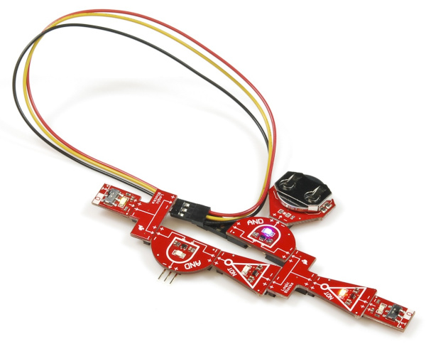

このLogicBlock回路では、セレクタ入力（X）はNOTブロックにつながる入力ブロックで表されている。残るもう一つの入力がA入力である。

2つの出力は、それぞれ**各ANDゲート上の青いLED**で示される。Y1は、電源ブロックが接続されていないほうのANDブロックである。

### 実験

次の手順で試してみよう。

1. セレクタ入力（X）を0に切り替える。次に、A入力をハイとローの両方に切り替えてみる。片方のANDブロックだけが変化するはずで、その値は入力と同じになるはずである。
2. X入力を1に切り替える。再びAを何度か切り替えてみる。今度はもう一方のANDゲートがAに追従するはずである。

- より大規模なデマルチプレクサがどんな形になるか想像できるだろうか。以下は、2-to-4デコーダの回路例である。

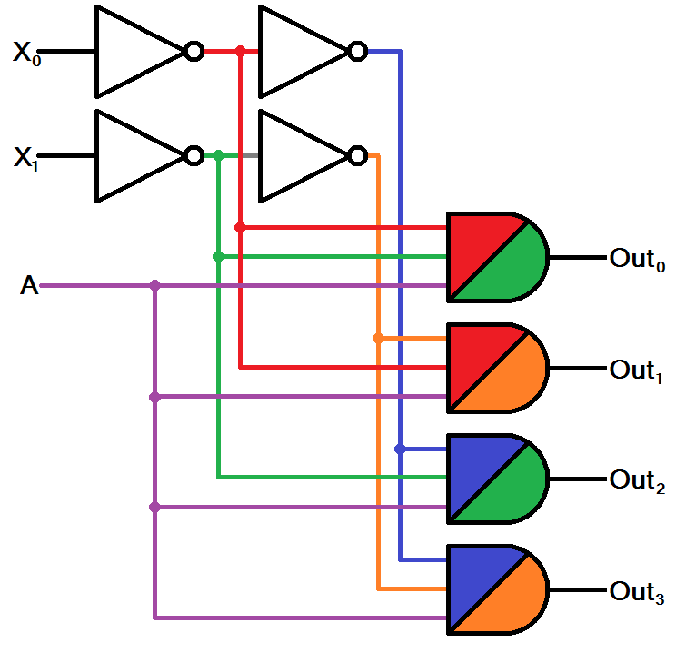

この回路には2本のセレクタ入力（X0とX1）があり、入力（A）を4つの出力のいずれかへ振り分ける。

- 2-to-4デコーダを、（前回の実験の）4-to-1マルチプレクサと比較してみよう。どう違うだろうか。
- 3-to-8デコーダの回路がどうなるか想像できるだろうか。

## 9. XORゲート

ここまで、3つの基本論理ゲートだけの世界で満足してきたことだろう。そろそろその認識を打ち破る時である。**排他的OR**という啓示に備えてほしい。

排他的OR、略してXORはORゲートに似ているが、一つ大きな違いがある。真理値表から、その違いがわかるだろうか。

| 入力A | 入力B | 出力 |
| --- | --- | --- |
| 0 | 0 | 0 |
| 0 | 1 | 1 |
| 1 | 0 | 1 |
| **1** | **1** | **0** |

*排他的*というのは、文字どおりの意味である。XORは、単独の入力だけが1のときにのみ1を出力する。2つ以上の入力が1であれば、XORゲートは0を出力する。

XORゲートは、デジタル論理において信じられないほど便利な機能であることがわかっている。あまりに便利なので、専用の回路記号まで与えられている。おなじみのORゲートの手前に、凹んだ線を加えたような形をしている。

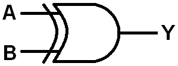

これまでの実験と同様、XORゲートも3つの基本論理ゲートを組み合わせて実装できる。NOT、AND、ORの組み合わせである。

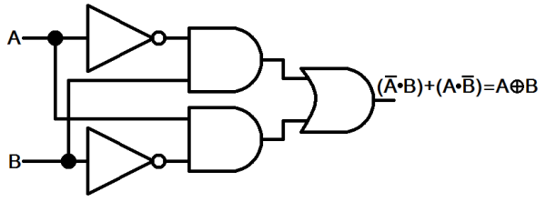

LogicBlocksで組んでみよう。

### 必要なもの

- ANDブロック × 2
- ORブロック × 1
- NOTブロック × 2
- 入力ブロック × 2
- スプリッターブロック × 2
- 電源ブロック × 1
- フィードバックケーブル × 1

### LogicBlocksの配置

以下のようにXORを組み立てる。

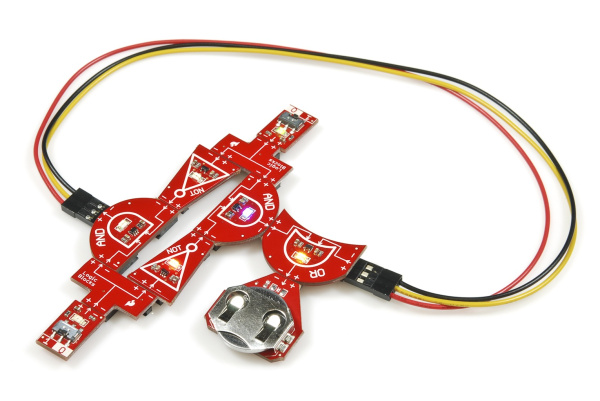

このXOR LogicBlocks回路の出力は、**最後のORゲート上の黄色いLED**で示される。

### 実験

両方の入力を切り替えて、XORの真理値表が正しいことを確かめてみよう。ORブロック上のLEDは、**どちらか一方だけ**の入力がオンになっているときにのみ点灯するはずである。

- XORは組み合わせ回路だろうか、順序回路だろうか。
- 入力のどちらか一方だけが真であるときに、ある主張が真になる、という現実の例を思いつけるだろうか。

### 副実験

NANDとNORを覚えているだろうか。実はXORにも、対になる存在である**XNOR**がある。他の2つの否定ゲートと同様、XNORにも専用の「泡付き」回路図がある。

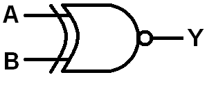

2入力XNORの真理値表は、次のようになる。

| 入力A | 入力B | 出力 |
| --- | --- | --- |
| 0 | 0 | 1 |
| 0 | 1 | 0 |
| 1 | 0 | 0 |
| 1 | 1 | 1 |

XNORの本当に興味深い点は、**両方の入力が同じ**ときにのみ真になるということである。これが、この演算子を**論理的等価**と呼ぶ理由である。XNOR演算子として、等号（=）を使うことさえできる。等価演算子は、電子工学とプログラミングのあらゆる場面で使われている。2つの命題が等しいかどうかを確認する必要があるときには、必ずXNORが関わってくる。

ちょうどもう一つNOTブロックが余っているので、XNORのLogicBlocks回路を作ってみよう。電源ブロックをNOTブロックに置き換え、その先に電源ブロックをつなぐ。

この回路の出力は、**最後のNOTブロック上の赤いLED**で示される。

- 両方の入力ブロックを切り替えてみよう。出力のLEDは、両方が同じ値のときにだけ点灯するだろうか。

## 10. LogicBlocksのその先へ

これらの実験は、いわば氷山の一角にすぎない。多くの基本的な電子工学の構成要素を発見してきたが、まだまだ扱うべきものが残っている。残念ながら、標準のキットに含まれるブロックはここで尽きてしまう。触れずに済ませるわけにはいかない、いくつかの基礎的な回路や概念を紹介しておく。

### 加算器

加算器は、実際に数を足し合わせる回路であり、論理ゲートで作られている。**半加算器**は、もっとも単純な加算回路である。2つのビットを足し合わせ、和（S）と桁上げ（C）という2つの出力を持つ。見てのとおり、それほど複雑な回路ではない。

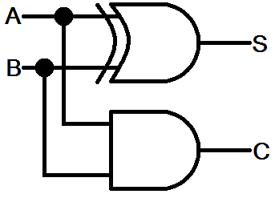

2つのビットの和は、単純にそれらのXORである。そしてAとBの両方が1であれば、桁上げの出力が生成される。

より完全な加算器は**全加算器**と呼ばれ、桁上げの入力も持つ。これらの回路を長く鎖状につなぐことで、複数ビットの2進数加算器を作ることができる。

たいていのプロセッサには、**算術論理演算装置（ALU）**と呼ばれる回路ブロックがあり、加算、減算、乗算、除算のすべての演算がここで行われる。ALUには何百もの加算回路（などの回路）が収められており、それらを組み合わせて巨大な32ビットや64ビットの加算器を作り上げている。

### フリップフロップ（ラッチ）

SRラッチの実験でもフリップフロップに触れたが、これらの回路の重要性については軽く流しただけだった。作ったSRラッチは、電子工学の中でも比較的単純なラッチの一つである。SRラッチを少し手直しすれば、**Dラッチ**を作ることができる。

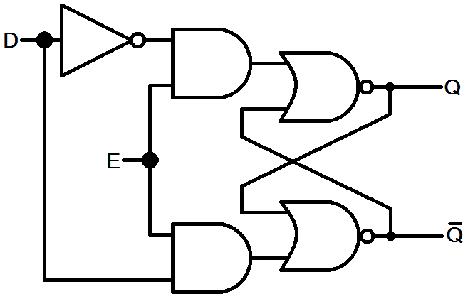

中にSRラッチが入っているのがわかるだろうか。Dラッチには*データ*（D）と*イネーブル*（E）という2つの入力がある。イネーブル入力が1である限り、Q出力はDの値そのものになる。イネーブルがローになると、データ入力が何をしていようと、Qはその時点でセットされていた値を保持し続ける。

もう一つよく使われるラッチが**JKラッチ**である。これもSRラッチをもとにしているが、（QとQが等しくなってしまう）「違法」な入力の組み合わせを、現在の出力を切り替える動作に変えている。JKラッチは、次のように作られる。

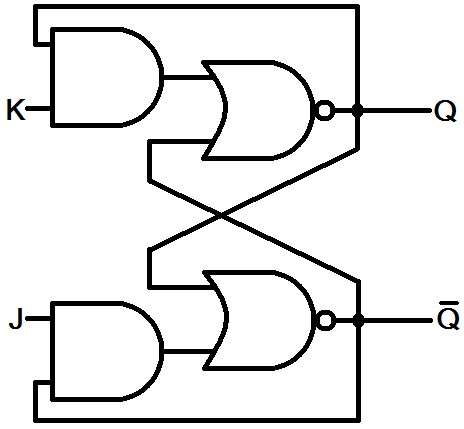

JKラッチの真理値表は、次のようになる。

| J | K | 直前のQ | 現在のQ |
| --- | --- | --- | --- |
| 0 | 0 | 0 | 0（状態保持） |
| 0 | 0 | 1 | 1（状態保持） |
| 0 | 1 | X（不問） | 0（リセット） |
| 1 | 0 | X | 1（セット） |
| 1 | 1 | 0 | 1（切り替え） |
| 1 | 1 | 1 | 0（切り替え） |

では、このJKラッチをJKフリップフロップにしてみよう。**フリップフロップ**は、たいていラッチに**クロック入力**を追加することで作られる。クロック入力を持つフリップフロップは、たいていクロック信号の立ち上がりエッジでのみ動作を行う。クロック入力にはさまざまな使い道があり、たとえば複数のフリップフロップにクロック入力を共有させることで、互いを同期させることもできる。これらの2入力ANDゲートを3入力タイプに置き換えることで、JKフリップフロップにクロック入力を追加できる。

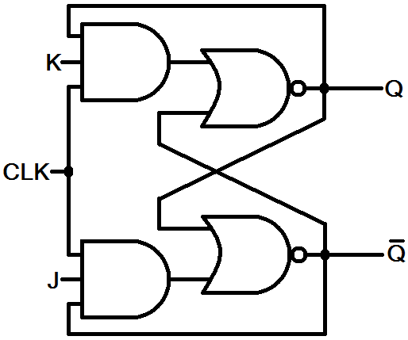

これで、JKフリップフロップはクロック入力がハイのときにだけ新しい出力を生成するようになる。これによって、フリップフロップの動作をもう少し細かく制御できるようになる。

このJKフリップフロップは、次のセクション、カウンタで役立つことになる。

### カウンタ

加算器は足し算をし、カウンタは数を数える。カウンタはたいていのプロセッサにおける主要な要素であり、特にタイミングに関わる用途で重要になる。デジタル時計は、何らかの方法で秒数を数えなければならないはずである。

数多くのJKフリップフロップをつなぎ合わせることで、非常に単純なカウンタを作ることができる。複数のJKフリップフロップをすべて常に切り替わる状態（J=K=1）に設定し、あるフリップフロップの出力を次のフリップフロップの入力につなげば、**非同期リップルカウンタ**を作ることができる。JKフリップフロップから3ビットのリップルカウンタを作る例を紹介する。

Q0、Q1、Q2が3つの出力であり、Q0が最下位ビット、Q2が最上位ビットである。3ビットあれば、この回路は2進数で0から7まで数えられる。最初のクロック入力に周期的なクロックを与えれば、カウントが始まる。クロックの立ち上がりエッジのたびに、カウンタが1つ増える。あるJKの補数出力を次のJKのクロック入力に接続しているため、Q出力は直前の出力が落ちるたびに切り替わる。

この3ビットカウンタは7でオーバーフローするが、フリップフロップを追加すれば上限は2のべき乗で増えていく（*n*個のフリップフロップで2*n*-1まで数えられる）。つまり、100万を超えて数えるには20個のフリップフロップが必要になる。

他にもさまざまな種類のカウンタがあるが、これはここまで学んできた内容からそれほどかけ離れていない、論理回路で作られたよい例である。

### 7400シリーズ論理チップ

LogicBlocksの次にどこへ進めばよいか探しているなら、7400シリーズの論理チップを調べてみることをおすすめする。7400シリーズは、あらゆる種類のデジタル論理機能を実装した、膨大な種類の[集積回路（IC）](./integrated-circuits.md)群である。クアッドNANDゲートをはじめ、さまざまな標準的なデジタル論理ゲートが見つかる。実のところ、LogicBlocksのゲートブロックに使われているチップも7400シリーズの部品であり、単一回路のSMD版になっている。

フリップフロップ、カウンタ、マルチプレクサ、デコーダなど、このチュートリアルで扱ってきたあらゆる種類の回路が、7400シリーズのチップとして実装されている。丸ごとの4ビットALUやメモリ、コンパレータのような、さらに複雑な回路もある。実のところ、その一覧はかなり長いので、[こちら](https://ja.wikipedia.org/wiki/List_of_7400_series_integrated_circuits)を確認してみてほしい。

たいていの7400シリーズのチップは、下に示す3-to-8デコーダ（74238）のように、ブレッドボードに優しいDIPパッケージで手に入る。つまり、実際にはんだ付けをしなくても、実験して確かめることができる。

それでもまだデジタル論理に物足りなさを感じるなら、CPLD（コンパクトプログラマブルロジックデバイス）や、さらにはFPGA（フィールドプログラマブルゲートアレイ）が次のステップになるだろう。これらは7400シリーズのチップと比べても複雑さの桁が大きく違うが、それらのICは何千ものプログラム可能なデジタル論理回路をごく小さな空間に詰め込むことができる。デジタル論理の世界には、まだまだ探求すべきことがたくさんあるが、LogicBlocksがその良い入り口になっていたら幸いである。

## まとめ

実験ガイドを最後までやり遂げたことをお祝いしたい。これで、デジタル論理、AND、OR、NOT、XOR、マルチプレクサ、オシレータなどについての知識に、以前よりずっと自信が持てるようになっているはずである。デジタル論理をおさらいしたくなったら、いつでも[デジタルロジック](./digital-logic.md)のチュートリアルを確認してほしい。

この先どこへ進めばよいかわからない場合は、次のようなSparkFunの他のチュートリアルもおすすめである。

- [抵抗器](./resistors.md)、[コンデンサ](./capacitors.md)、[ダイオード](./diodes.md)、[スイッチの基礎](./button-and-switch-basics.md)は、部品ごとのチュートリアルのほんの一部である。他の基礎的な電子部品について学びたい場合は、これらのチュートリアルから始めるとよいだろう。
- [Arduinoとは何か](./what-is-an-arduino.md)：Arduinoは、できる限り使いやすく作られた、非常に人気のあるマイクロコントローラ開発プラットフォームである。Arduinoの中心にあるのはマイクロコントローラ、つまり内部に何百万もの論理ゲートを持つ小さなコンピュータである。
- [Shift Registers](https://learn.sparkfun.com/tutorials/shift-registers)：シフトレジスタは、わずかな制御線で幅広い入出力を切り替えられる、非常に便利なICである。しかも、完全にデジタル論理だけで作られている。
- [16進数](./hexadecimal.md)：数学好きで2進数に慣れているなら、ぜひ16進数についても学んでみてほしい。

タグ: 概念、電気工学

---

出典：[LogicBlocks Experiment Guide](https://learn.sparkfun.com/tutorials/logicblocks-experiment-guide)（SparkFun Learn）を日本語に翻訳し、再構成した。
原文は [CC BY-SA 4.0](https://creativecommons.org/licenses/by-sa/4.0/) ライセンスで公開されており、本ページも同ライセンスの下で提供する。
