# 磁気浮上

## はじめに

光あれ。このチュートリアルでは、基本的な磁気浮上装置を作る。
理論の基礎、磁場センサーの使い方、そしてそれを使った基本的な浮上回路の作り方を扱う。
最後には、もう一歩踏み込んで、ワイヤレス給電で光る浮遊ライトを作る。

### 必要な部品

このチュートリアルの内容を実際に試すには、次の部品が必要である。

> [!NOTE]
> 注意：LM358は生産終了が予定されている。汎用オペアンプとしては、同じピン配置でそのまま置き換えられる[AS358](https://www.sparkfun.com/products/15946)を推奨する。

SparkFunで扱っていない、その他に使用する部品は次のとおりである。

- アナログホール効果センサー
- 1N5401ダイオード
- 1mHインダクタ

### 必要な工具

このプロジェクトに必要な工具はマルチメーターとはんだごてだが、オシロスコープがあればテストの助けになる。

参考になるチュートリアル:

以下の概念に馴染みがなければ、続きを読む前にこれらのチュートリアルを確認しておくことをおすすめする。

- [はんだ付けの基本（スルーホール編）](./how-to-solder-through-hole-soldering.md)
- [ブレッドボードの使い方](./how-to-use-a-breadboard.md)
- [テスターの使い方](./how-to-use-a-multimeter.md)
- [オペアンプ入門（LTspice編）](./introduction-to-operational-amplifiers-with-ltspice.md)

## 理論の基礎

磁気浮上には、吸引式と反発式の2種類がある。
このガイドでは、動作させやすい吸引式の浮上回路を使う。
ご存じのとおり、磁石にはN極とS極という2つの極がある。
同じ極性の磁場どうしは反発し合い、逆の極どうしは引き合う。
磁気浮上には、永久磁石による固定された磁場と、その永久磁石の位置を制御するために自分で操作できる磁場の両方が必要になる。

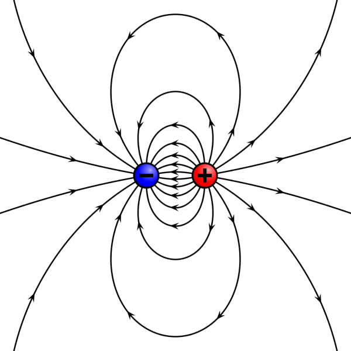

画像提供：[Geek3、Wikipedia経由、CC BY-SA 3.0](https://commons.wikimedia.org/w/index.php?curid=11621756)

制御可能な磁場を作るには、インダクタを使うことができる。
インダクタはコンデンサと同じようにエネルギーを蓄えるが、コンデンサが電界の形で電圧を蓄えるのに対し、インダクタは磁場を発生させることで電流を蓄える。
ここでは、このインダクタの磁場を使って磁石と相互作用させる。
吸引式の浮上では、インダクタを使って重力に対抗する力を生み出し、磁石をインダクタの方向に引き寄せる。

磁石がインダクタに近づきすぎると、インダクタに流れる電流の大きさにかかわらず、磁石の磁場そのものの強さでインダクタにくっついてしまうほど強くなる。
一方、磁石がインダクタから遠すぎると、磁場の強さが重力に対して弱すぎて引き戻せなくなる。
つまりコツは、磁石が自力では浮き上がれないほど弱く、それでいてインダクタが作る反対向きの磁場の助けを借りれば重力に打ち勝てる、というちょうどよい範囲を見つけることである。
磁石の位置を把握するために、ホール効果センサーと呼ばれる磁場センサーを使う。

### ホール効果センサー

ホール効果センサーは、磁場の強さを測定するために使うデバイスである。
センサーの出力は、そこを通過する磁場の強さに正比例する。
ここで使うセンサーは[SS496B](https://www.digikey.com/product-detail/en/honeywell-sensing-and-productivity-solutions/SS496B-T2/480-6213-1-ND/5285543)であり、**アナログ電圧**を出力する。
他にも、磁場の有無だけでオン・オフするスイッチのように動作するホール効果センサーもある。
次のセクションでは、このセンサーが磁石に対してどう反応するかを見ていく。

## ホール効果センサーをテストする

まずはこのセンサーがどう動作するかテストしてみよう。
[ブレッドボード](https://www.sparkfun.com/products/12002)を使い、電源電圧のピンに**5V**、グラウンドにグラウンドを接続し、出力ピンにはオシロスコープのプローブをつないで電圧の変化を見るか、電圧モードにした[マルチメーター](https://www.sparkfun.com/products/12966)で電圧の変化を確認する。

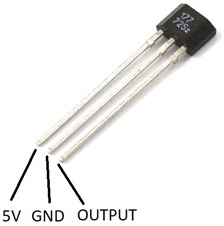

磁石がない状態では、出力電圧はおよそ**2.5V**に落ち着く。
磁石の片面をセンサーに近づけていくと、電圧は下がっていく。
磁石を裏返して近づけると、今度は出力電圧が上がっていくのがわかるはずである。
どちら側の面が電圧を下げるのかを覚えておこう。
油性ペンで印をつけておくと、次のテストで役に立つ。

> [!NOTE]
> 注：写真で使っている磁石は直径およそ0.5インチ、高さ0.1インチの丸型だが、四角い磁石でも問題なく使える。重要なのは、ネオジム磁石（レアアース磁石とも呼ばれる）であることである。

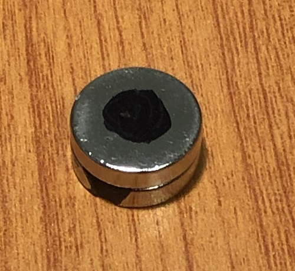

次のテストに進む前に、センサーのリード線をワイヤーでつなぎ足して延長する必要がある。
各はんだ付け箇所には熱収縮チューブをかぶせておくと短絡を防げるが、リード線に絶縁テープを軽く巻いておくだけでも十分である。
以下の画像では、センサーの電源プラス側に赤、マイナス側に黒、アナログ出力に黄色のワイヤーを使っている。

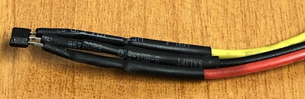

はんだごてが温まっているうちに、インダクタにもワイヤーをはんだ付けしておくとよい。
インダクタの2本のピンにそれぞれ異なる色のワイヤーを使っておくと、後でトラブルシューティングする際に役立つ。

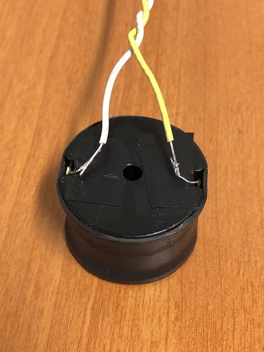

## 制御回路を組み立てる

[理論の基礎](#理論の基礎)で触れたとおり、磁石はインダクタの磁場と相互作用できるくらい近い位置にありつつ、磁石自身の磁場だけで（電力にかかわらず）インダクタまで引き上がってしまうほど近すぎない位置に置くことが重要である。
必要なのは、磁石が遠すぎるときはインダクタが磁石を引き寄せ、近づきすぎたら電源を切って重力で引き戻せるようにする、インダクタの制御方法である。

配線を始める前に、インダクタを地面から浮かせて保持するためのスタンドを用意する必要がある。
このガイドではスタンドの作り方自体は扱わないが、参考として使用したスタンドの写真を示す。
インダクタはテーブルからおよそ5インチの高さに吊り下げられており、8-32のボルト（長さ約1.5インチ）とナットでスタンドに取り付けている。

> [!NOTE]
> ヒント：磁石がボルトにくっつくことを確認しておくこと。ボルトの鉄材が磁力線をインダクタに「集中」させ、磁石がインダクタの中心へ引き上げられるようになる。

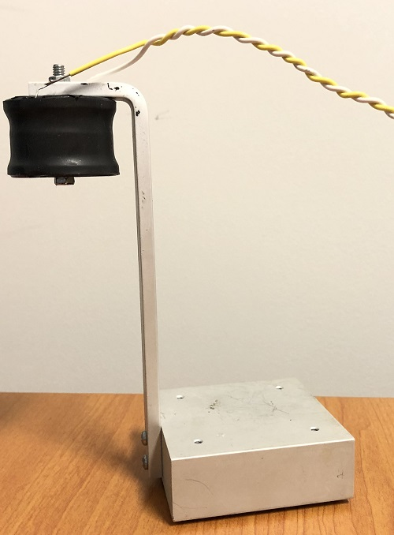

インダクタを取り付けたら、次はホール効果センサーをボルトの頭に取り付ける。
センサーの金属部分が露出している場合は、絶縁テープでセンサーとボルトの間を絶縁し、以下のように絶縁テープでセンサーを固定する。**センサーの丸みのある面がインダクタとは反対を向くようにすること。**

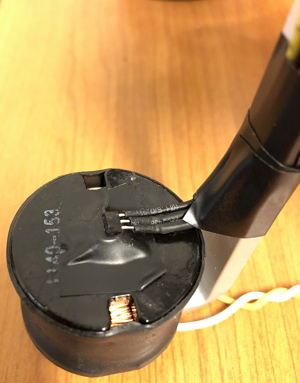

### コンパレータ回路

インダクタを制御するには、コンパレータと呼ばれる構成でオペアンプを使う。これは、ホール効果センサーの出力を、もう一方の入力ピンにつながる基準電圧と比較するものである。
基準電圧は、分圧回路として働くポテンショメータで設定し、**0V**から**5V**の間で調整可能なアナログ電圧を作り出す。
このポテンショメータの電圧は、磁石がどれだけ離れているかに応じて、ホール効果センサーに読み取らせたい電圧を表している。

この回路では、**5V**と**12V**という2つの電圧レールを使う。
12Vレールはインダクタとオペアンプへ電力を供給し、5Vレールは基準電圧とホール効果センサーに使う。
2系統の電源を用意するのが望ましい。12Vレールが電流制限モードに入って電圧が下がってしまうと、ホール効果センサーが磁石の接近を検出するのに十分な電圧を確保できなくなるからである。
とはいえ、[LM7805リニア電圧レギュレータ](https://www.sparkfun.com/products/107)を使えば、単一の電源系統でも動作させることはできる。
2系統の電源を使う場合は、**グラウンドどうしを必ず接続する**こと。そうしないと回路が正しく動作しない。

> [!NOTE]
> 注：回路図ではU2をSS494としているが、より感度の高い**SS496**を使うべきである。ピン配置は同じである。

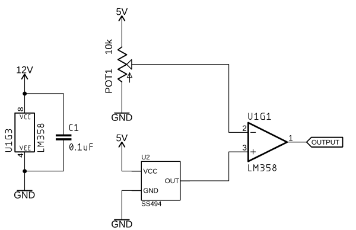

*コンパレータ回路の回路図*

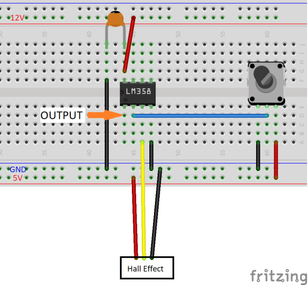

*コンパレータ回路のFritzing画像*

回路を組み立てたら、マルチメーターで非反転入力（オペアンプのピン2）の電圧を測定し、**0V**になるまでポテンショメータのつまみを回す。
次に、磁石をセンサーからおよそ2cm、親指の厚みほど離れた位置に置く。
基本的に、磁石は「スイートスポット」、つまり自力でインダクタまで引き上がってくっついてしまう位置より少し遠い位置に置く必要がある。

オペアンプの出力電圧（ピン1）を見ると、**9〜12V**になっているはずである。
磁石をその位置に置いたまま、ポテンショメータをゆっくり回して基準電圧を上げていき、電圧が**12V**から**0V**へ切り替わるところを探す。
磁石を少し上下させると、オペアンプの出力がハイからロー、ローからハイへと切り替わるはずである。

コンパレータは、2つの入力ピンの電圧を等しく保とうとし、センサーの値が基準値と一致するように出力をハイまたはローに駆動する。
次のステップでは、このオペアンプの出力にインダクタを接続し、実際に磁石を浮上させてみよう。

## 磁石を浮上させる

コンパレータがインダクタをどう制御するか理解できたところで、実際に磁石を浮上させてみよう。
オペアンプは信号の制御には向いているが、このような大電流の用途にはMOSFETを使う必要がある。
前のセクションで組んだ回路の電源を切り、次の回路を配線する。
ダイオードを省略しないよう注意すること。インダクタの電流を切ると、それまで作っていた磁場が崩れることで大きな電圧スパイクが発生し、MOSFETを壊してしまうことがある。
回路図には1N4007ダイオードと記載されているが、フライバックによる電流スパイクへの対策としては[1N5401](https://www.digikey.com/product-detail/en/comchip-technology/1N5401-G/641-1314-1-ND/1979679)ダイオードのほうがうまく機能するはずである。

> [!NOTE]
> 注：回路図ではU2をSS494としているが、より感度の高い**SS496**を使うべきである。ピン配置は同じである。

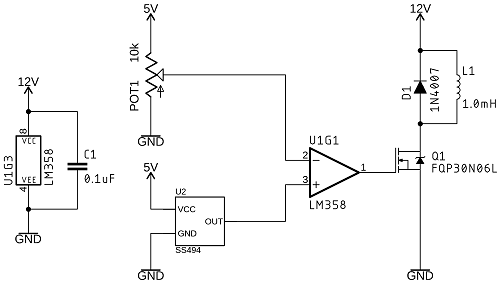

*インダクタを追加したコンパレータ回路の回路図*

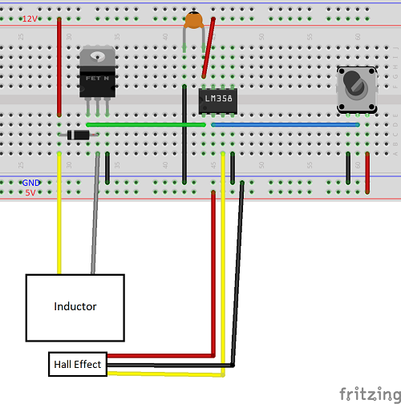

*インダクタを追加したコンパレータ回路のFritzing画像*

電源を切ったまま、ポテンショメータのつまみを片方いっぱいまで回し、基準電圧を**5V**に設定する。
次に電源を入れ、オペアンプの出力が**0V**になっていることを確認する。
以下の画像のように、磁石を親指と中指の間に挟んで持つ。親指はインダクタに引き上げられた磁石を受け止める役目を果たし、中指は磁石のバランスを取り、落ちてきた場合に受け止める役目を果たす。

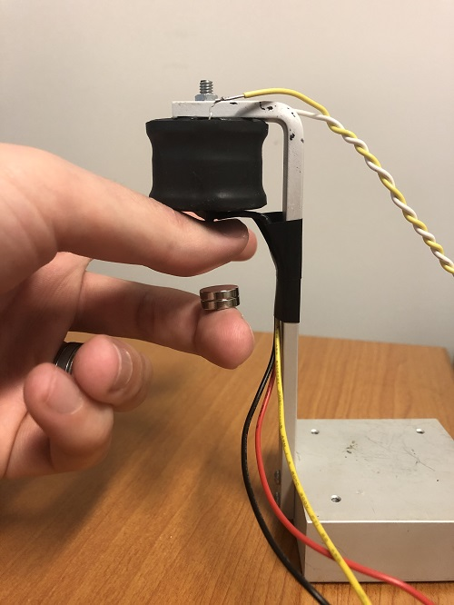

もう一方の手で、基準電圧を**ゆっくりと**下げていく。
[制御回路を組み立てる](#制御回路を組み立てる)で確認した切り替わりのポイントに近づくと、磁石が浮き始めるはずである。
磁石が親指に飛びついてしまう場合は、電圧を再び上げてからもう一度試してみる。
少し練習して、小さく正確な調整を重ねれば、磁石を浮上させられるようになるはずである。

> [!NOTE]
> ヒント：磁石の印がインダクタとは反対側を向くようにひっくり返ろうとする場合、磁場が同じ極性になっていて反発し合っている状態である。インダクタの配線を逆にすれば、この問題は解決する。

12V電源からの電流を読み取れるようにしておくと、浮上のポイントを見極めるのに役立つ。
磁石が近すぎるときは、電流はたいてい10mA未満になる。
筆者が使っている磁石では、消費電流はおよそ80mAで、インダクタから2〜3cmの範囲で浮上させることができている。
少し練習すれば、自分の磁石でも浮上させられるようになるはずである。

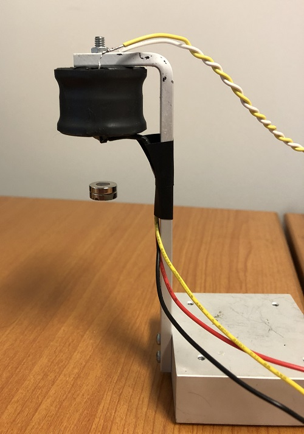

## ワイヤレス給電

磁石を浮かせるだけでは物足りない場合は、ワイヤレス給電のLEDを追加して、さらに複雑さを加えることができる。
このステップには、誰もが持っているとは限らない工具がいくつか追加で必要になる。
このセクションでは、次のものが必要である。

### 送電コイルを作る

磁石を浮上させるために使ったインダクタは、磁石をその位置に保つのに十分な電力しか供給できない。
電力をワイヤレスで伝送するには、[マグネットワイヤー](https://www.sparkfun.com/products/11363)を使って自分でもう一つインダクタを巻く必要がある。
マグネットワイヤーは、細い線に非常に薄い絶縁層を施したワイヤーである。
これにより、通常の被覆ワイヤーで同じ巻数にする場合と比べて、コイルの巻線どうしをより近づけられ、生じるインダクタンスも大きくなる。

ワイヤレス電力伝送は、変圧器（トランス）と同じ原理で動作する。一方のインダクタがもう一方のインダクタに電流を誘導するという仕組みだが、鉄芯を使って磁束を結合させる代わりに、テスラコイルと同じように空気を介して結合させる点が異なる。
ワイヤレス電力伝送の問題の一つは、効率が非常に悪いことである。
トランスの一次側は、二次側にわずかな電力を生み出すために、多くの電力を消費することになる。

### 一次コイルを作る

一次コイルは、中心直径1インチの円形に、30ゲージのマグネットワイヤーを25回巻いて作る。
エンジニアというものは何も捨てられない性分なので、筆者は片端を切り落とした空のワイヤースプールを使い、マグネットワイヤーを巻き付けてから抜き取った。

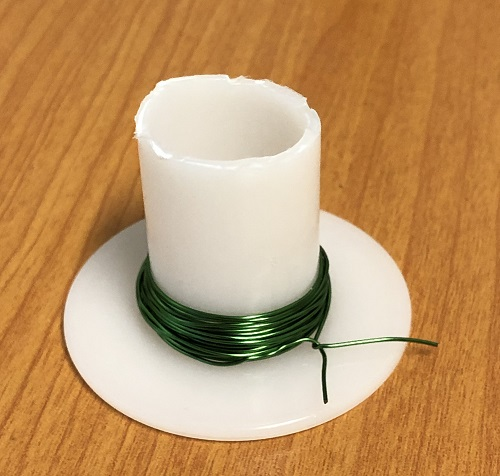

コイルがほどけないよう、余分なマグネットワイヤーを少し切り取り、一次コイルの2か所に巻きつけて形を保持できるようにする。
ワイヤーのエナメル被覆のせいで、はんだが乗りにくくなっている。
紙やすりでエナメルを少し削り取れば、以下のようにピンをはんだ付けしたり、コイルから直接ワイヤーをはんだ付けしてブレッドボードまで引き出したりできる。

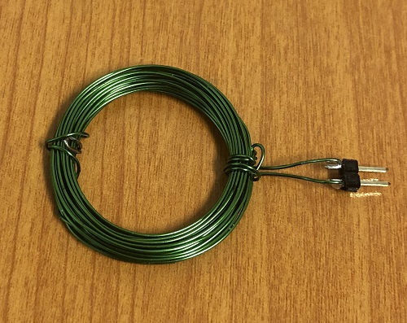

### 二次コイルを作る

二次コイルも同じように作るが、今回は100回巻きのマグネットワイヤーを使い、さらにダイオードとコンデンサ2個を使って交流をLED用の直流に変換する。
以下の回路図を参考にしてほしい。

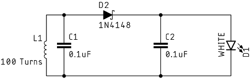

*ワイヤレス電力伝送の二次コイルを作るための回路図*

一次コイルと同じように、余分なマグネットワイヤーの切れ端を使って二次コイルの形をまとめる。
今回は、LEDのヒートシンクの周りに巻きつけて二次コイルの中心に固定できるよう、少し長めの切れ端を用意する。
両面テープを使って、LEDヒートシンクの底に磁石を固定した。
磁石を配置する際は、印がLEDとは反対側を向くようにすること。

| | |
| --- | --- |
| 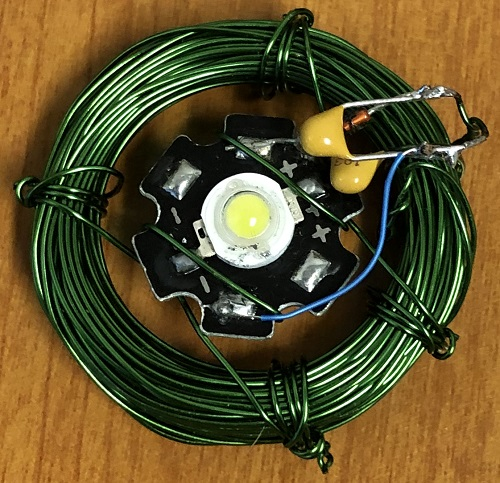 | 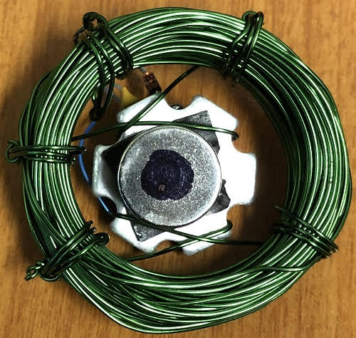 |
| *組み立てた二次コイル・上面* | *組み立てた二次コイル・底面* |

### 一次側ドライバーを作ってテストする

二次コイルに電流を誘導するには、ファンクションジェネレータ（または[周波数発生器](https://www.sparkfun.com/products/11394)）を使って交流信号を生成し、今回作ったインダクタに最適な周波数を見つける必要がある。
浮上回路のオペアンプと同じように、ファンクションジェネレータもあまり大きな電流は取り出せないため、一次コイルを駆動するにはもう一つ別のMOSFETが必要になる。
回路自体はいたって単純で、振幅**5V**、直流オフセット**2.5V**の矩形波を入力する（つまり、5Vのハイと0Vのローを行き来する矩形波が欲しいということである）。
このMOSFETはあっという間にかなり熱くなるため、必ず[ヒートシンク](https://www.sparkfun.com/products/9576)を取り付けること。

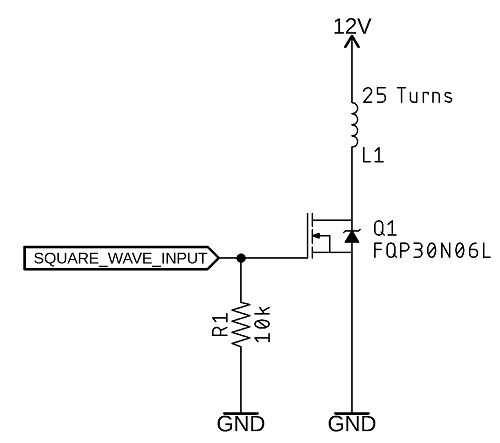

最適な周波数を見つけるため、LCRメーターを使って二次コイルのインダクタンスを測定し、回路図のC1についても正確な値を求め、共振周波数をおよそ80kHzと計算した。
周波数と電源からの消費電流の間にはトレードオフがある。
周波数を下げるほどLEDは明るくなるが、効率は極端に低下し、一次コイルを駆動するMOSFETは非常に熱くなる。
この問題への最良のアプローチは、LEDの明るさを十分に保ちながら、どこまで高い周波数を使えるかを見極めることである。

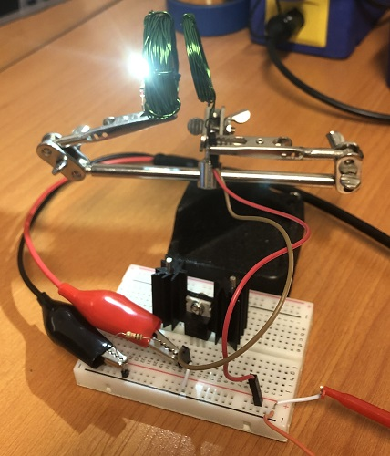

### 一次コイルを浮上用インダクタに取り付ける

ワイヤレス電力伝送が動作するようになったところで、ワイヤレス給電の一次コイルを浮上用インダクタに取り付ける。
絶縁テープを使い、先ほど作った25回巻きのインダクタを、ホール効果センサーのある浮上用インダクタの底面に貼り付ける。

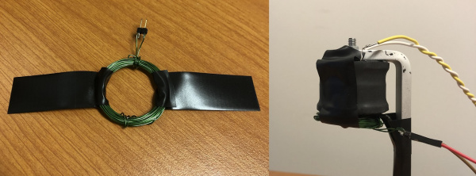

### 新しい浮上距離を見つける

ライトと磁石を合わせた重さは、磁石だけのときよりもかなり重くなっている。
ワイヤレス給電の一次コイルを回路の残りの部分から切り離した状態で、基準電圧のポテンショメータを使って浮上距離を調整する。
質量が増えているため、磁石はかなり近く、およそ1cmまで近づける必要がある。
ポテンショメータの電圧を下げると、浮上距離は短くなる。
ライトが浮上したら、一次コイルを再接続し、ファンクションジェネレータの出力をオン・オフしてLEDを制御できる。

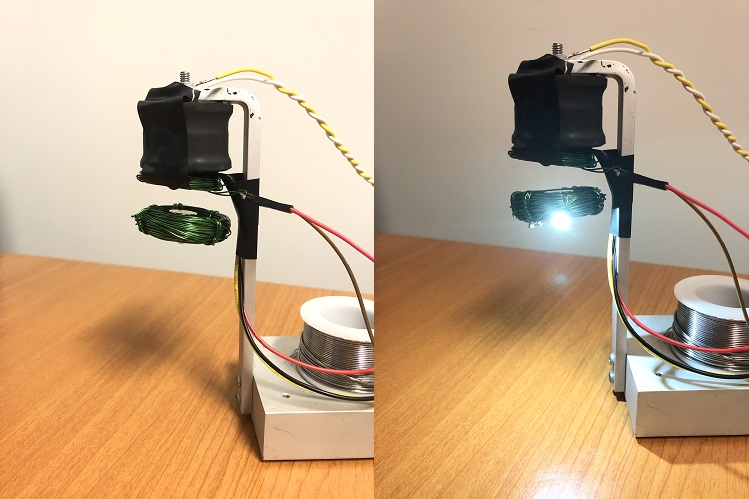

先ほど、この方式は効率が悪いと述べた。では、実際どれくらい悪いのだろうか。
電流を測定するとおよそ50mA、LEDにかかる電圧は2.72Vだったので、回路が受け取っている電力はおよそ136mWである。
電源は12Vに設定されており、磁石が浮上しライトが点灯している状態で、回路は886mA、つまり10.6ワットを消費している。これは効率にして1.3%である。
とはいえ公平を期すなら、浮上回路自体がおよそ450mAを消費しているため、ワイヤレス電力伝送そのものの効率は実質およそ2.5%ということになる。
ワイヤレス給電回路がどの周波数で動作するかがわかったので、ファンクションジェネレータを、[555タイマー](https://learn.sparkfun.com/tutorials/beginner-parts-kit-identification-guide/all#555-timer)を使って矩形波を生成する新しい回路に置き換えることもできるだろう。

## まとめ

このプロジェクトをさらに発展させる方法の一つが、ワイヤレス電力伝送の効率を高めることである。
インダクタンス、静電容量、抵抗を測定できるLCRメーターが手元にあれば、二次巻線のL1とC1の正確な値を求め、[LC共振計算ツール](https://www.daycounter.com/Calculators/LC-Resonance-Calculator.phtml)にその値を入力できる。
二次側の共振周波数がわかれば、一次コイルのインダクタンスを測定し、その計算ツールに静電容量の値を出させることができる。
そのコンデンサを一次コイルと並列に追加し、信号発生器をその周波数に合わせれば、効率が向上するはずである。
とりあえず今は、以下のリンクも参考にしてほしい。

- [磁場](https://ja.wikipedia.org/wiki/%E7%A3%81%E5%A0%B4)
- [ホール効果](https://ja.wikipedia.org/wiki/%E3%83%9B%E3%83%BC%E3%83%AB%E5%8A%B9%E6%9E%9C)
- [電磁気学](https://ja.wikipedia.org/wiki/%E9%9B%BB%E7%A3%81%E6%B0%97%E5%AD%A6)

さらにアイデアが欲しい場合は、SparkFunの他のチュートリアルも参考にしてほしい（いずれも英語）。

- [HID Control of a Web Page](https://learn.sparkfun.com/tutorials/hid-control-of-a-web-page)：Webページ上のスライダーを動かしてモーターを回す方法。HTMLとHIDを組み合わせてセンサーを読み取り、現実世界とやり取りする。
- [Interactive Hanging LED Array](https://learn.sparkfun.com/tutorials/interactive-hanging-led-array)：72個の電球を、会議室用のインタラクティブなLEDアレイに変えた事例。
- [21st Century Fashion Kit: Inflation](https://learn.sparkfun.com/tutorials/21st-century-fashion-kit-inflation)：送風機と薄いプラスチックシートを使い、形や体積が変化するデザインを作る方法。
- [Qwiic Pro Kit Project Guide](https://learn.sparkfun.com/tutorials/qwiic-pro-kit-project-guide)：はんだ付けもブレッドボードも不要でArduinoを始められるQwiic Pro Kitのガイド。

タグ: 概念、光、プロジェクト、科学、センサー

---

出典：[Magnetic Levitation](https://learn.sparkfun.com/tutorials/magnetic-levitation)（SparkFun Learn）を日本語に翻訳し、再構成した。
原文は [CC BY-SA 4.0](https://creativecommons.org/licenses/by-sa/4.0/) ライセンスで公開されており、本ページも同ライセンスの下で提供する。
