# 自分だけのFritzingパーツを作る

[Fritzing](http://fritzing.org/home/)は、電子工作プロジェクトの指導、共有、プロトタイピングに使える優れたオープンソースツールである。
回路図を設計でき、その回路図をもとにパーツを作って、本格的な見た目の配線図に組み込むことができる。
自分で設計したPCBを、そのファイルから実際に[製造](http://fab.fritzing.org/fritzing-fab)してもらうことすらできる。
SparkFunでも、教室での指導、ハンドアップガイド、その他ボードと他のハードウェアとの接続方法を示す必要があるあらゆる場面でFritzingを使っている。

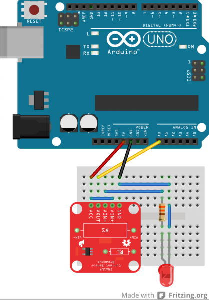

*[INA169](https://learn.sparkfun.com/tutorials/ina169-breakout-board-hookup-guide)をArduinoに接続したFritzingの例*

Fritzingの素晴らしい点は、自分のプロジェクト用に独自のFritzingパーツを作り、コミュニティと共有できることである。
このチュートリアルでは、Fritzing（New）Parts Editorでカスタムパーツを作る方法を、最初から順を追って説明する。

## カスタムFritzingパーツを作る必要はあるか

Fritzingには、ソフトウェアに最初から数多くの電子部品が同梱されている。
SparkFunにも、Fritzingにまだ収録されていない自作パーツを収めた[FritzingのGitHubリポジトリ](https://github.com/sparkfun/Fritzing_Parts)がある。
自分でパーツを作る前に、この2箇所にすでにパーツが存在しないか、あるいは[Fritzingフォーラム](http://fritzing.org/forum/)で別のFritzingユーザーがすでに必要なパーツを作っていないか、必ず確認してほしい。
すでに作られていれば、かなりの時間を節約できる。
とはいえ、必要なパーツがFritzingの世界にまだ存在しないと確信できたなら、続きを読み進めてほしい。

## 参考になるチュートリアル

このチュートリアルは、Adobe IllustratorかInkscape、あるいはその両方にすでに馴染みがあることを前提としている。
これらのソフトウェアの使い方自体は、このチュートリアルの範囲外である。
どちらかの使い方についてより詳しい情報が必要な場合は、それぞれの公式サイトにベクターグラフィックスの始め方に関するチュートリアルやガイドが数多く用意されているはずである。
それでも見つからなければ、検索してみるのもよいだろう。

このチュートリアルを読む前に、次の関連チュートリアルにも目を通しておくとよい。

- PCB基板の基礎
- 集積回路
- コネクタの基礎
- Using GitHub
- ブレッドボードの使い方
- 回路図の読み方

## ダウンロードとインストール

自分だけのカスタムFritzingパーツを作るには、次のソフトウェアをダウンロード・インストールしておく必要がある。

**注意：** シンプルなICを作りたいだけであれば、Fritzing（New）Parts Editorで簡単にカスタムICを作成できるため、ベクターグラフィックスエディタをダウンロードする必要はない。それでもこのチュートリアルには沿って進められる。Fritzing（New）Parts Editorでカスタムのicを土台に組み立てていく流れになっているためである。

### Fritzing

[Fritzing](http://fritzing.org/download/)のサイトのダウンロードページに行き、自分のOSに合った最新版のFritzingをダウンロードする。
ハードドライブ上でFritzingアプリケーションを置きたい場所を決め、そこにFritzingフォルダを解凍する。

### ベクターグラフィックスエディタ

ベクターグラフィックスエディタにはさまざまな種類がある。
SparkFunで使っているのはAdobe IllustratorとInkscapeである。
自分が最も使い慣れていて扱いやすいものを選んでほしい。
ベクターグラフィックスエディタを持っていない場合は、無料で使えるオープンソースのInkscapeがよい選択肢になる。

#### Inkscape

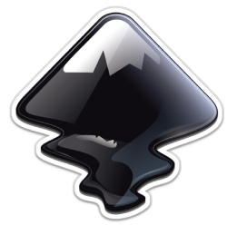

[Inkscape](http://inkscape.org/en/download/)のダウンロードページへ行き、自分のコンピュータに合った公式リリースパッケージをダウンロードする。

Windowsユーザー：
実行ファイルをダブルクリックし、Inkscapeセットアップウィザードの指示に従う。

Mac OS Xユーザー：
[Inkscapeのサイト](http://inkscape.org/en/download/mac-os/)にある最新の手順に従う。

#### Adobe Illustrator

Adobe Illustratorは無料ではないが、すでにAdobeの[Creative Cloud](http://www.adobe.com/products/illustrator.html)を契約している場合はダウンロードできる。
Illustratorの月額プランを購入することもできる。

**注意：** SparkFunはAdobeと提携関係にはなく、このチュートリアルで必要な用途によく合う優れたソフトウェアであるという理由だけでIllustratorを紹介している。

### その他のダウンロード

#### Fritzingのフォントとテンプレート

FritzingはICの表記に[OCR-A](http://en.wikipedia.org/wiki/OCR-A_font)フォントを使っている。
それ以外のパーツには、OCR-Aと[Droid Sansフォント](http://en.wikipedia.org/wiki/Droid_sans)のどちらも使える。
Fritzingのサイトでは、フォントとテンプレートをダウンロードできる。
このチュートリアルを進めるには、Fritzingのグラフィック標準をダウンロードしておく必要がある。
[テンプレートのダウンロードページ](http://fritzing.org/fritzings-graphic-standards/download-fonts-and-templates)へ行き、Fritzing's Graphic Standardsフォルダをダウンロードする。
zipファイルをダウンロードしたら、フォルダを解凍し、コンピュータの好きな場所に置く。
フォントはコンピュータにインストールしておくこと。

#### SparkFun Fritzingサンプルテンプレート

このチュートリアルでは、SparkFun Fritzingサンプルテンプレートを何度も参照する。
SparkFunのボード用にFritzingパーツを作りたい場合や、出発点となるものが欲しい場合は、[SparkFun Fritzing PartsのGitHubリポジトリ](https://github.com/sparkfun/Fritzing_Parts/tree/master/templates)からこのテンプレート一式をダウンロードしてほしい。
SparkFunのFritzingテンプレートには、このチュートリアルの例であるSparkFun T5403 Barometer BreakoutのSVGファイルが含まれており、比較したり参考にしたりできる。

## ブレッドボードビュー

Fritzingを起動すると、まずWelcomeビューが表示される。
そこからBreadboardビューに移動する。

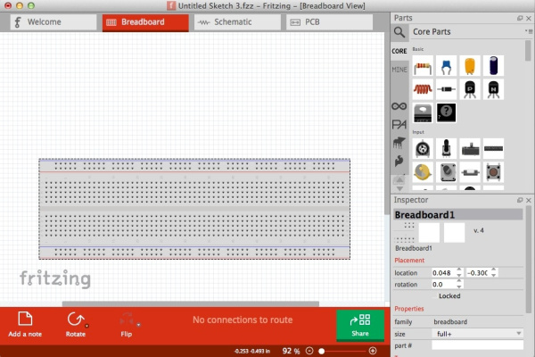

ブレッドボードビューで行う必要のある主な作業は2つある。
まず、ブレッドボード用のSVGを作成してアップロードする。
Fritzingは[SVG](http://en.wikipedia.org/wiki/Scalable_Vector_Graphics)形式を推奨しており、拡大縮小しても画像がきれいに見えるようになっている。
次に、コネクタピンを変更する必要がある。

**注意：** シンプルなICだけを作りたい場合は、このチュートリアルの「ブレッドボードビューの編集」の節まで読み飛ばしてよい。

### Fritzingのグラフィック標準

Fritzingのウェブサイトには、従うべき[グラフィック標準](http://fritzing.org/fritzings-graphic-standards/)が数多く用意されている。
このグラフィック標準に従っておくと、自分の作ったパーツが他のFritzingパーツと見た目をそろえられるのでおすすめである。

### テンプレート

パーツを作る際は、テンプレートから始めることを推奨する。
参考にできるパーツの画像を手元に用意しておくと、SVGファイルを作る作業が速く進む。

**ヒント：** EAGLEで作ったボード用にカスタムFritzingパーツを作りたい場合は、ボードをSVGに変換するULPをダウンロードできる。これを使えば、EAGLEのボードを正確に反映したSVGを参考資料として用意できる。EAGLE用のULPは[Cadsoftのサイト](http://www.cadsoftusa.com/downloads/ulps?language=en)で見つかる。

いよいよブレッドボードビュー用のグラフィックを作る番である。

## 新しいパーツを作成する

このチュートリアルでは、SparkFun T5403 Barometer Breakout用のFritzingパーツを作る。

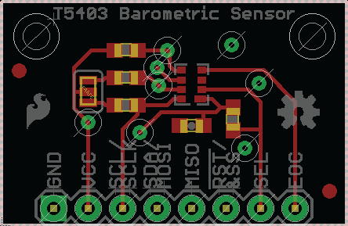

*SparkFun T5403 Barometer BreakoutのEAGLE画像*

Fritzingアプリケーションを開く。
プログラム上部にWelcome、Breadboard、Schematic、PCBのタブが表示されるはずである。
Breadboardボタンをクリックし、Breadboardビューにいることを確認する。

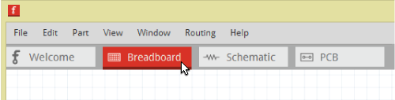

### 既製のパーツを確認する

Fritzing上のボードを更新するだけの場合は、まず、作ろうとしているパーツに近いものがすでにないか確認する。
検索バーにパーツの名前を入力して探せる。

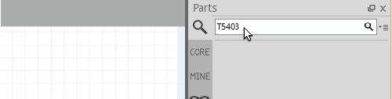

*検索バーはPartsウィンドウの上部にある*

Fritzingの各セクションを見て回り、似たパーツがないか確認することもできる。

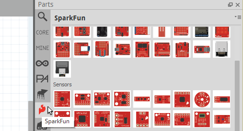

*SparkFunの炎マークを探すと、SparkFunのFritzingパーツの一大セクションが見つかる*

### ICを出発点にする

作りたいパーツに似たものが見当たらない場合、ICを土台にするのがよい出発点になる。
Partsウィンドウの**CORE**タブをクリックする。
下にスクロールしてICのセクションを探す。
ICセクションの下にあるICアイコンをクリックし、Breadboardウィンドウにドラッグ&ドロップする。

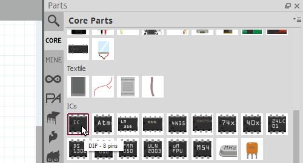

*カスタムICは、Fritzingでピン数とICパッケージを変更できるためシンプルに作れる*

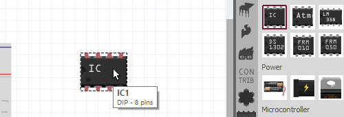

### ICの名前を変更する

右側の**Inspector**ウィンドウにある**IC**のプロパティを探す。
ICの名前を自分のパーツの名前に変更する。
続いて、pinsのセクションで、ボードやパーツに必要なピン数に変更する。
SparkFun T5403 Barometer Breakoutの場合、8ピンが必要である。
Breadboardビューで、ICの表示が自分のパーツの名前に変わっているのがわかるはずである。

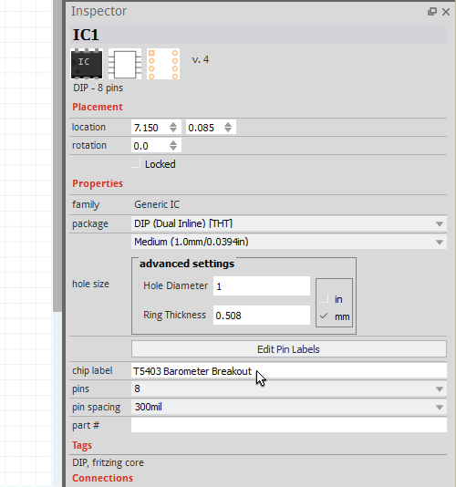

### Fritzing（New）Parts Editor

Breadboardウィンドウ内のICを右クリックし、「Edit（new parts editor）」を選択する。
Fritzing（New）Parts Editorが開くはずである。

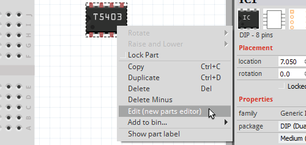

Fritzing（New）Parts Editorには、変更を加える必要のある主なセクションが6つある。次のとおりである。

- Breadboard
- Schematic
- PCB
- Icon
- Metadata
- Connectors

これらを進める順序に決まりはない。
何回かカスタムパーツを作っていくうちに、他よりも先に着手したくなるビューが出てくるはずである。
このチュートリアルでは、単純にこのリストの順番どおりに進めていく。

**著者の補足：** ピン数が多いボードの場合、Connectorsビューから始めた方が、コネクタピンの名前を上から順に手早く付けられるので、少し時間の節約になると気づいた。

作業を続ける前に、まず新しいパーツとして保存しておくとよい。
カスタムパーツの制作を途中で中断する必要がある場合、後で作業に戻ってこられる。
*File*に行き、*Save as new part*を選択する。

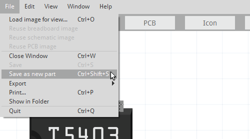

好みでプレフィックスの名前を付けることもできる。

---

続けてBreadboardビューに進もう。

## カスタムブレッドボードSVG

### ファイルを作成する

ベクターグラフィックスエディタを開き、新しいファイルを作成する。
ファイルの画像サイズは、自分のボードと同じサイズにする。
SparkFun T5403 Barometer Breakoutのサイズは1インチ×0.650インチである。
Fritzingパーツを作る際には最終的に3種類のSVGファイルが必要になるため、わかりやすい命名規則でファイルを保存しておくとよい。

**Illustratorユーザー向け：**
File → Save Asと進み、SVGとして保存し、Saveをクリックする。

この例では、Breadboard用のSVGを`SFE_T5403_Barometer_Breakout_breadboard.svg`という名前にしている。

### テンプレートを参考にする

各レイヤーとグループを比較するには、先ほどダウンロードしたFritzing Fonts and TemplateフォルダにあるFritzingのBreadboardViewGraphic_Template.svgファイルを開くとよい。
SparkFun Fritzing PartsのGitHubリポジトリから、SparkFun T5403 Barometer Breakoutのブレッドボード用SVGテンプレートファイルのサンプルを開くこともできる。

このサンプルテンプレートを見ると、レイヤーをどう整理しておけばよいかがわかる。
SparkFun T5403 Barometer Breakoutの場合、「breadboard」というグループがある。
そのbreadboardグループの中に、部品のグループ、銅箔レイヤー、シルクスクリーンのグループ、ボードのパスが含まれている。

### カスタムブレッドボードグラフィックを作るコツ

これで、自分のパーツのブレッドボード用グラフィックを作成できるようになった。
ここでいくつか役立つコツを紹介する。

#### Fritzingのグラフィック標準に従う

ブレッドボード画像の主な配色標準を紹介する。

Fritzingのグラフィック標準に従うため、銅の接点は銅・すず色にしたい。

*HEX: 9A916C, RGB: 154 145 108*

ボード上の部品にリード線（脚）がある場合は、グレー色を使う。

*HEX: 8C8C8C, RGB: 140 140 140*

SparkFunレッドは次の色である。

*HEX: E62C2E, RGB: 230 44 46*

#### シンプルに保つ

Fritzingのすばらしい点は、ボードをシンプルにもできれば複雑にもできることである。
SparkFunは常に製品をリビジョンによって改良し続けており、扱うボードの数も多いため、トレースやすべての部品といった細かな要素を含めない方が、作業が速く簡単になる。
そうしておけば、ボードに変更（たとえば抵抗の値の変更）があっても、Fritzingパーツの中の抵抗をいちいち変更しに行く必要がない。
ICのような重要な部品に絞って時間を使う方が、よい選択かもしれない。
それでも見た目はきちんとしたものになり、しかも作業量は少なくて済む。

#### 既存のコンポーネントを活用する

ボードに使いたいSMD LEDがすでにFritzingに存在するなら、遠慮なくそれを使ってほしい。
時間の節約になり、すべてのFritzingパーツの見た目や使用感を統一しておくことにもなる。
他の人も使えるコンポーネントを含むカスタムボードを作った場合は、Fritzingのサイトで共有すれば、他の人にも使ってもらえる。
使っているベクターグラフィックスエディタの中で部品のグラフィックをきちんと整理しておくと、将来別のボードで使う際に見つけやすくなる。

#### 銅箔グループの中でコネクタピンに名前を付ける

コネクタに名前を付けておくと、大幅な時間の節約になる。
SparkFun T5403 Barometer Breakoutの例では、銅箔グループの下で、各コネクタに`connector#pad`という名前を付けている。

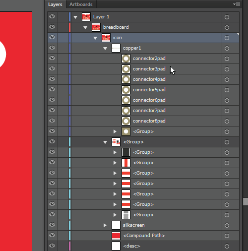

*Illustratorでの例。Inkscapeを使っている場合も、コネクタに適切な名前を付けておくようにすること。*

#### OCR-AまたはDroid Sansフォントを使う

すべてのFritzingパーツの見た目をそろえるため、Fritzingのフォントを使い続けること。
標準のフォントサイズは5ptを推奨する。
とはいえ、小さなボードではそのスペースが取れないこともある。
3pt未満にはしない方がよい。それより小さいと、拡大しないと見えにくくなってしまうからである。
Fritzingのサイトではフォントの色は黒を使うよう案内されているが、実際にはシルクスクリーンの色に合わせた方が見栄えがよい傾向がある。
この例では、白がブレイクアウトボードのシルクスクリーンの色であり、赤い背景の上でも読みやすいため、白を使っている。

#### コンパウンドパスを作ってボードの穴を透けさせる

**Illustratorユーザー向け：** 自分のPCBのサイズでパスを作る。SparkFun T5403 Barometer Breakoutの場合、長方形ツールを使って1インチ×0.650インチの長方形を作れる。続いて、ボードに開口部がある箇所にパスを作る。たとえば長方形ツールの下にある楕円ツールを使い、スタンドオフやコネクタピン用の開口部にきれいな円を作ることができる。すべての穴の開口部レイヤーと、一番下のPCBレイヤーを選択する。

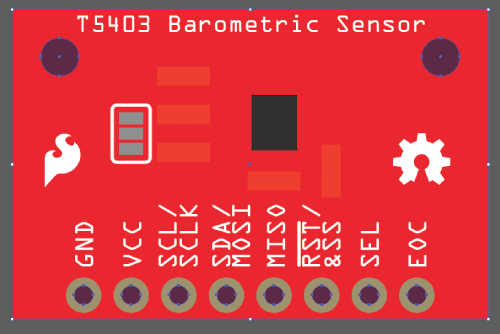

*一番下のPCBレイヤーが選択されていることを確認する*

続いて、**Object**→**Compound Path**→**Make**に進む。
これでコンパウンドパスができ、Fritzing上で開口部を透けて見えるようになる。

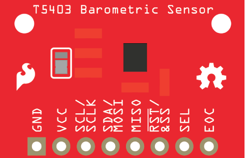

*完成したブレッドボードグラフィック*

> **Inkscapeユーザー向け：** Inkscapeを使う場合も、長方形ツールで長方形を作成する。**Fill**に色を設定し、**Stroke**は*Unset*のままにする。**Objects**タブで、`Ctrl`キーを押しながら長方形とボードのレイヤーを選択する。続いて**Path**→**Difference**に進む。2つのレイヤーが一つに結合され、透けた穴のあるレイヤーになる。Fritzingでボードを設計した場合と同じ効果が得られるはずである。詳しくは、[ブール演算を使ったInkscapeのチュートリアル](https://inkscape.org/en/doc/tutorials/advanced/tutorial-advanced.html)を参照してほしい。

### 保存する

カスタムボードの作成が終わったら、必ずもう一度SVGとして保存すること。
これで、ブレッドボードビューの編集に進める。

## ブレッドボードビュー：Parts Editor

### 画像を読み込む

カスタムのブレッドボード画像を作成したら、それをFritzing（New）Parts Editorで読み込む。
まず、Fritzing（New）Parts Editorに戻り、Breadboardボタンをクリックしてブレッドボードビューに入る。
File→Load image for viewに進む。

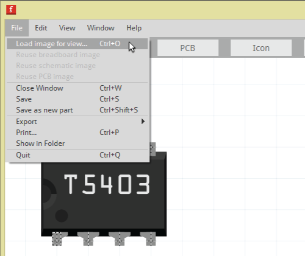

続いて、先ほど作成したブレッドボード用SVGを選択し、Openをクリックする。
これでFritzing（New）Parts Editorにグラフィックが表示されるはずである。

### コネクタ

Fritzingのメインアプリケーションで作業する際は、色付きのワイヤーで異なるFritzingパーツをつなぎ、パーツ同士がどう接続されているかを示す。
Fritzingがボードやパーツ上のコネクタピンの位置を把握できるよう、そのコネクタがどこにあるかを教えてやる必要がある。

#### コネクタピンの名前と説明

Breadboardビューでは、Connectorsウィンドウは Fritzing（New）Parts Editorの右側にある。
ピンを選択すると、そのピンの名前を変更したり、説明を追加したりできる。

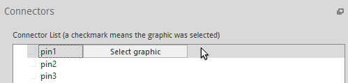

*編集したいコネクタピンをクリックして選ぶ*

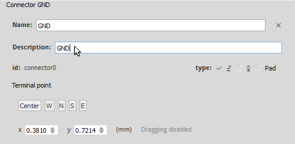

#### コネクタピンのグラフィックを選択する

コネクタピンの名前の右にある「Select graphic」ボタンをクリックする。
続いて、そのコネクタピンのグラフィックをクリックする。
これでアンカーポイントが設定される。
アンカーポイントとは、ワイヤーがそのコネクタに接続される位置のことである。
デフォルトでは、選択したグラフィックの中央にTerminalポイントが表示される。
Terminalポイントを動かしたい場合は、クリックしたまま押さえて移動できる。
Connectorsウィンドウの「Center」「W」「N」「S」「E」のいずれかをクリックして変更することもできる。

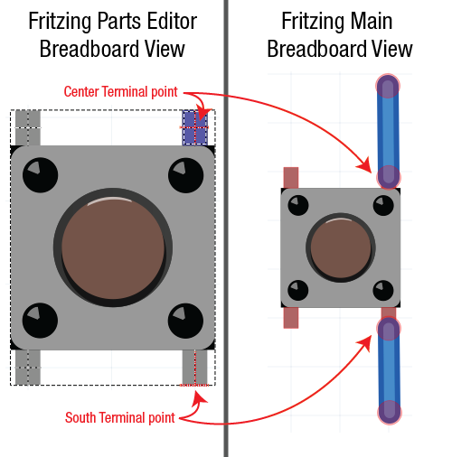

*Terminalポイントを変更すると、ワイヤーの配置がどう変わるか確認できる*

#### コネクタの種類を変更する

Connectorsウィンドウで、コネクタの種類を変更する。
male、female、padのいずれかから選べる。
SparkFun T5403 Barometer Breakoutの場合、すべてのコネクタピンはfemaleである。

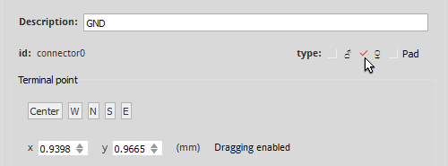

下の画像では、コネクタの種類をmaleに設定した場合とfemaleに設定した場合の違いを確認できる。

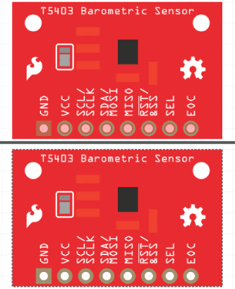

*上のボードはコネクタの種類がmaleに設定されている。下のボードはfemaleに正しく設定されている。*

### すべてのコネクタピンで繰り返す

すべてのコネクタピンについて、名前を付け、適切なグラフィックを選択し、コネクタの種類を変更する。
Connectorsウィンドウでは、Internal Connections（内部接続）も設定できる。

## Schematicビュー

### カスタムSchematic SVG

IllustratorやInkscapeなど、使っているベクターグラフィックスエディタに戻る。
ダウンロードしたFonts and Templatesフォルダにある、FritzingのSchematicViewGraphic_Template.svgを開く。
SparkFun Fritzing PartsのGitHubリポジトリから、SparkFun T5403 Barometer BreakoutのSchematic用SVGテンプレートファイルのサンプルを開くこともできる。

自分のボードに合わせてSchematicを編集する際は、すべてのコネクタピンが表示されていることを必ず確認する。
ピンのラベルは、コネクタピンの名前と一致するよう変更する。
パーツによっては、テンプレートのSchematicのサイズを変更する必要があるかもしれない。
パーツのシンボルとなる四角形と、外側のピンの端の間には0.1インチのスペースを確保しておくこと。

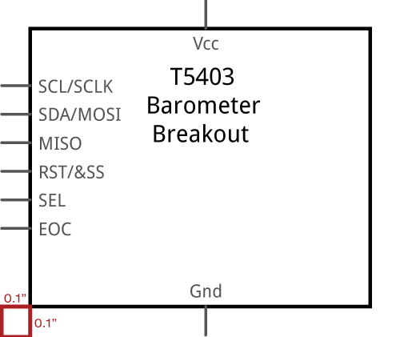

*0.1インチの寸法を示す補助ボックスは、最終的なFritzingのSchematicグラフィックに表示されないよう、必ず削除しておくこと*

#### SVGを保存する

新しいSVGとして必ず保存すること。
Fritzingパーツ用に作成する他のSVGファイルと区別しやすいよう、命名規則を決めておくとよい。

### Parts EditorでSchematicビューを編集する

#### SVGを読み込む

Parts Editorに戻り、Schematicボタンをクリックしてschematicビューに移動する。
File→Load image for viewに進む。
続いて、先ほど作成したSchematic用SVGを選択し、Openをクリックする。
これでFritzing（New）Parts Editorにパーツが表示されるはずである。

#### コネクタピンを設定する

右側のConnectorsウィンドウを見ると、ピンの名前がすでに反映されていることに気づくはずである。
Breadboard、Schematic、PCB、Connectorsのいずれかのビューでコネクタピンの名前や説明を変更すると、Parts Editorが他のビューにも自動的にその変更を反映する。
コネクタの種類（male、female、pad）も同じ設定が保たれる。

Breadboardビューのときと同様に、各ピンにグラフィックを選択する必要がある。
「Select graphic」ボタンをクリックし、そのピンに適したグラフィックを選ぶ。
Schematicビューでは、ワイヤーが最も外側の点で接続されるよう、Terminalポイントを変更するとよい。

これを行う最も簡単な方法は、コネクタピンのグラフィックを選択したまま、Connectorsウィンドウ内でTerminalポイントを変更することである。
GNDのグラフィックの場合、「S」をクリックしてTerminalポイントを南端に移動している。

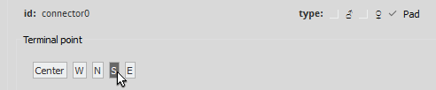

### すべてのコネクタで繰り返す

すべてのコネクタピンを更新したら、PCBビューの編集に進める。

## PCBビュー

### カスタムPCB SVGの作成

IllustratorやInkscapeなど、使っているベクターグラフィックスエディタに戻る。
カスタムPCB用のSVGを作る際、必要になる主な画像グループは、copper（すべてのコネクタパッドを含む）とsilkscreenである。

#### PCBグラフィックを作る

PCB用SVGは、まっさらな状態から作り始めてもよいし、カスタムブレッドボードSVGを改変してもよいし、ダウンロードしたFonts and TemplatesフォルダにあるFritzingのPCBViewGraphic_Template.svgを編集してもよい。
この例では、カスタムブレッドボードSVGを改変し、`SFE_T5403_Barometer_Breakout_PCB.svg`という新しいSVGとして保存した。

#### copperグループを2つ用意する

レイヤーを設定する際は、必ずcopperグループを2つ用意すること。
すべてのコネクタレイヤーは、このcopperグループの中に入れる。
そうしておくと、Fritzingは、そのコンポーネントがPCBの両面に銅のコネクタを持っていると認識する。

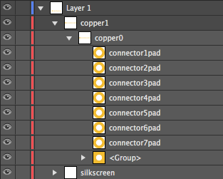

*Illustratorでcopperグループを2つ用意した例*

#### コネクタピンの間隔を正確にする

PCBのコネクタピンが自分のボードと正確に一致していること、ピン同士の間隔が適切であることが重要である。
Fritzingは[PCB Fabサービス](http://fab.fritzing.org/fritzing-fab)を提供している。
自分や他のFritzingユーザーがカスタムパーツでこのサービスを利用したい場合は、PCBビューが正確であることを確認しておく必要がある。

#### グラフィック標準

PCBビューのコネクタピンは、銅・すず色の緑色ではなく、次の「銅」色を使う。

*Hex: F7BD13 RGB: 247 189 19*

カスタムブレッドボードSVGからの主な変更点は、主なグループがcopperとsilkscreenになることである。
silkscreenは引き続き白のままでよい。

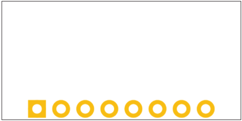

*完成したPCBグラフィック*

### Parts EditorでPCBビューを編集する

Parts Editorに戻り、PCBボタンをクリックしてPCBビューに移動する。
File→Load image for viewに進む。
続いて、先ほど作成したPCB用SVGを選択し、Openをクリックする。
これでFritzing（New）Parts Editorにパーツが表示されるはずである。

#### コネクタピンを更新する

BreadboardビューやSchematicビューのときと同様に、各コネクタピンに適したグラフィックを選択する。

## Iconビュー

### 過去のグラフィックを再利用する

Fritzing（New）Parts Editorに行き、Iconボタンをクリックしてiconビューに移動する。
Iconビューのよいところは、アイコン画像として、ブレッドボード、Schematic、PCBのいずれかのSVGを再利用できる点にある。新しく画像を作る必要はない。
Fileに行き、再利用したい画像を選ぶだけでよい。
SparkFun T5403 Barometer Breakoutの場合、Iconビューではブレッドボード画像を再利用している。
ブレッドボード画像が表示されるはずである。

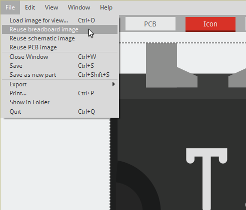

これでIconビューは完了である。

## Metadata

### Metadataビューに移動する

Parts Editorに行き、Metadataボタンをクリックしてmetadataビューに移動する。
Metadataは、自分のパーツに関する重要な情報をすべて追加する場所である。

#### Metadataビューの各セクション

**Title：** 説明するまでもないだろう。パーツの名前になる。

**Date：** 日付の項目はFritzing側でロックされている。作成日が表示される。後日パーツを更新すると、最後に更新した日の日付に変わる。

**Author：** ここに自分の名前を入れておくと、Fritzingコミュニティにパーツを共有した際、誰が作ったパーツかがわかる。

**Description：** 動作電圧など、そのボードについて重要な情報を含めておくとよい。

**Label：** LabelはSchematicビューに表示され、どのパーツを選択しているかがわかりやすくなる。SparkFun T5403 Barometer Breakoutの場合、Labelは「Part」に変更している。Partという表記はかなり小さく、SparkFun T5403 Barometer Breakoutという名前自体がすでにSchematicのグラフィック上にあるためである。ラベルの内容は自由に決めてよい。

**URL：** 自分のパーツについてより詳しい情報を得られるよう、パーツのURLを掲載しておくことを検討するとよい。

**Family：** 色違いやチップパッケージ違いのバリエーションを持つパーツの場合、それらを同じFamilyにまとめておくとよい。たとえば、色違いのスルーホールLEDがある場合、同じLEDの色違いはすべて同じfamilyに入れる。

**Variant：** 新しいパーツを作成する際は、Variantを1にしておく。同じfamilyの中で後日リビジョンを行うと、次のリビジョンがVariant 2に変わる。

**Properties：** 部品番号やピン間隔など、重要な詳細情報を記載する場所である。

**Tags：** 見つけやすく、なるべく少ない言葉で自分のパーツをよく表せるタグを使う。

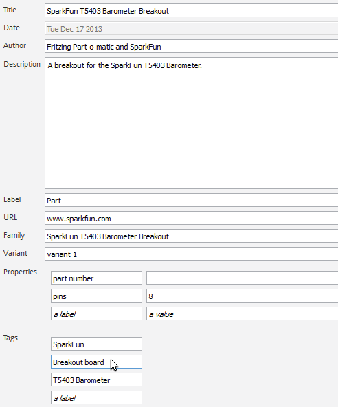

*情報がやや少ないと感じるだろうか。書く内容が増えたら後からいつでも更新できる。*

## Connectorsビュー

### Connectorsビューに移動する

Parts Editorに行き、Connectorsボタンをクリックしてconnectorsビューに移動する。
Connectorsビューでは、次のことができる。

- コネクタの数を変更する
- コネクタの種類を設定する
- コネクタピンをスルーホールかSMDかに設定する
- コネクタピンに名前を付ける
- コネクタピンの説明を追加する

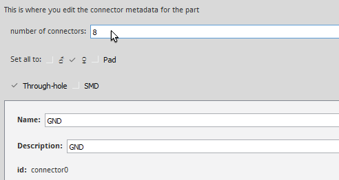

他のビューですでに情報を入力し終えているため、Connectorsビューで新たに変更する必要はないはずである。
最後の調整が必要な場合はここで行える。
ここでコネクタの数を変更した場合は、Breadboard、Schematic、PCBの各ビューに戻って更新する必要がある点に注意すること。

### 保存する

これでパーツを保存できる。File→Saveに進む。

続けてパーツのエクスポートに進もう。

## 新しいパーツをエクスポートする

### Fritzingアプリケーションでの品質チェック

いよいよ、Fritzingのメインアプリケーションで新しいFritzingパーツを確認する番である。
先ほどFritzing（New）Parts EditorでSave as new partをした際、そのパーツはメインのFritzingアプリケーションのMINEタブにある「My Parts」ラベルの下に自動的に表示される。

新しいカスタムパーツをエクスポートする前に、各ビューの見た目を確認しておくとよい。
Fritzing（New）Parts Editorではなく、メインのFritzingアプリケーションにいることを確認する。
上部のBreadboardボタンをクリックしてBreadboardビューに移動する。
右側のPartsウィンドウで、MINEタブにいることを確認する。
自分の新しいパーツが表示されるはずである。
ボードをクリックしてBreadboardビューにドラッグする。

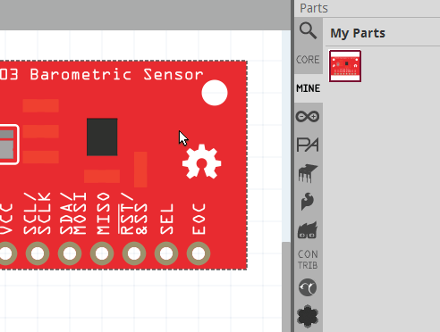

ピンの名前が正しく、正常に動作しているか再確認する。
SchematicビューとPCBビューでも同様に確認する。
品質チェックが済んだら、パーツをエクスポートできる。

### パーツをエクスポートする

My Partsウィンドウ内の新しいパーツのアイコンを右クリックし、「Export Part」を選択する。
Fritzingパーツを保存する。

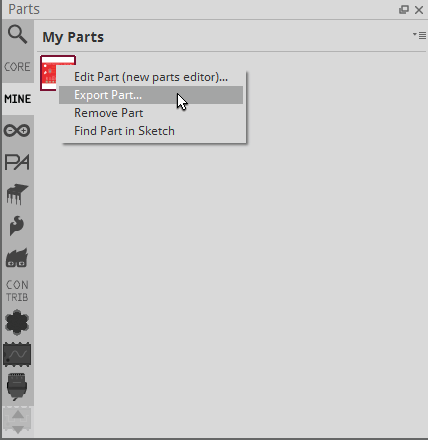

*おめでとう。これで自分だけのFritzingパーツができあがった。*

## まとめ・参考資料

必要なパーツがすでに作られていないか、Fritzingソフトウェアや[Fritzingフォーラム](http://fritzing.org/forum/)で確認することを忘れずに。
あるいは、SparkFunのリポジトリにあるパーツライブラリを確認してもよい。
また、他の人々がFritzingでどのようにパーツを作っているか、グラフィック標準、テンプレート、命名規則、ファイルの整形方法を知るために、Fritzingのカスタムパーツ作成に関するランディングページも確認しておくとよい。

- Fritzing.org
  - [Creating Custom Parts](http://fritzing.org/learning/tutorials/creating-custom-parts/)
  - [Fritzing Forums](http://fritzing.org/forum/)
    - [Tutorials and How To's](https://forum.fritzing.org/c/ttutorials/24)
  - Hackaday
    - [Tips and Tricks](https://hackaday.io/project/27257/logs?sort=oldest)
    - [Creating a PCB in Everything: Creating a Custom Part in Fritzing](https://hackaday.com/2017/01/06/creating-a-pcb-in-everything-creating-a-custom-part-in-fritzing/)
- [GitHubリポジトリ](https://github.com/sparkfun/Fritzing_Parts) — Fritzingソフトウェアのライブラリに含まれていない、SparkFunのパーツライブラリ

### Fritzingに貢献する

自分のパーツが完成すれば、他のFritzingパーツと接続できるようになる。
Fritzingのサイトで、自分のパーツやプロジェクトのチュートリアルを共有することもできる。
Fritzingコミュニティへの貢献方法は他にもたくさんある。
Fritzingへの支援方法についてさらに詳しくは、[Support Us](http://fritzing.org/support-us/)のページを確認してほしい。

### 大量のFritzingパーツを作りたい場合

EAGLEを使う開発者や、Fritzingパーツの制作にかなりの時間をかけている場合、Fritzingチームは、EAGLEの.brdファイルからSVGファイルを生成するツールキットをオープンソースで公開している。
Fritzing向けのSVGボードファイルをまとめて用意する場合は、ぜひ確認してみることを強く推奨する。
EAGLEからFritzingへの変換ソースコードは、[FritzingのGitHubリポジトリ](https://code.google.com/p/fritzing/source/checkout)で公開されている。

- [GitHubリポジトリ - eagle2fritzing](https://github.com/fritzing/eagle2fritzing)

### さらに参考になる資料

SparkFunでは、Learnチュートリアルの中でFritzingを多用している。
異なるパーツ同士の接続方法を示すために、さまざまなチュートリアルでFritzingがどう使われているか確認してみてほしい。
Hookupのセクションでfritzingを使っているチュートリアルの例を挙げる。

- [INA169 Breakout Board Hookup Guide](https://learn.sparkfun.com/tutorials/ina169-breakout-board-hookup-guide/hookup-example)
- [Tilt-a-Whirl Hookup Guide](https://learn.sparkfun.com/tutorials/tilt-a-whirl-hookup-guide/hardware-hookup)

他のソフトウェアで自分だけのPCBを設計する方法について詳しく知りたい場合は、次のチュートリアルを参照してほしい。

- [EAGLEのインストールとセットアップ](https://learn.sparkfun.com/tutorials/how-to-install-and-setup-eagle)
- [Using EAGLE: Schematic](https://learn.sparkfun.com/tutorials/using-eagle-schematic)
- [Using EAGLE: Board Layout](https://learn.sparkfun.com/tutorials/using-eagle-board-layout)

Fritzingについてさらに情報が欲しい場合は、次の関連ブログ記事も参考になる。

- [Fritzing!](https://news.sparkfun.com/663) — Fritzingが、ついにSparkFunのパーツに対応
- [Open Discussion: Puttin' on the Fritz](https://news.sparkfun.com/2888) — Fritzingの用途、落とし穴、代替となりうる選択肢について語る
- [Enginursday: Upgrading the Lightning Detector](https://news.sparkfun.com/3086) — トレイルで実際に使われてきたLightning Detectorを、秋のアウトドアシーズンに向けてアップグレードする

パーツをゼロから作らずに済むよう、ベクター画像が必要な場合は[Electronic Graphics Resources](https://learn.sparkfun.com/resources/37)も試してみてほしい。

- [Electronic Graphics Resources](https://learn.sparkfun.com/resources/37) — bildr.orgのAdam Meyer氏が作成した、さまざまな電子部品の画像やアイコンを収めたIllustratorファイル

タグ: 電気工学、スキル

---

出典：[Make Your Own Fritzing Parts](https://learn.sparkfun.com/tutorials/make-your-own-fritzing-parts)（SparkFun Learn）を日本語に翻訳し、再構成した。
原文は [CC BY-SA 4.0](https://creativecommons.org/licenses/by-sa/4.0/) ライセンスで公開されており、本ページも同ライセンスの下で提供する。
