# MIDI入門

## はじめに

何かの機材の背面で、このプラグを見かけたことがあるかもしれない。マイクロUSBやThunderboltが当たり前になった今の時代では、直径1/2インチほどの、5本の接点を持つかなり大きな円形のコネクタである。このプラグが2個や3個、横に並んでいることも多い。

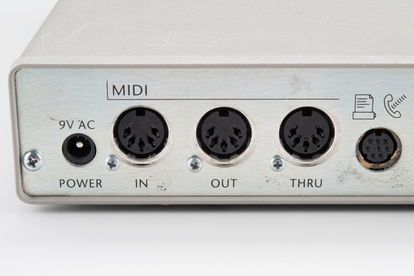

これが**M**usical **I**nstrument **D**igital **I**nterface（**MIDI**）のプラグである。
楽器はこのポートを使って演奏データをやり取りするが、このプロトコルはステージ照明やレコーディングスタジオの機材のような、関連する機器にも拡張されて使われている。

MIDIそのものは比較的単純なシリアル通信規格だが、専門用語が多いため、とっつきにくく感じられることがある。以下のセクションでは、より細かい技術的な内容を掘り下げながら、できる限り用語を丁寧に説明していく。

### 背景

MIDIは、他のチュートリアルでより詳しく扱ったいくつかの概念の上に成り立っている。

- MIDIは[シリアルポート](./serial-communication.md)を使ってデータを送信する。
- 送信されたデータをうまく活用するには、[16進数](./hexadecimal.md)との相互変換や、[2進数の演算子](./binary.md)の使い方を知っておくと役立つ。

## 歴史

MIDIをより深く理解するには、それ以前に何があったのか、そしてMIDIがどんな問題を解決しようとしていたのかを見ておくとよい。

### 独自仕様のアナログシステム

もっとも初期の商業用シンセサイザーは、個々のモジュールを組み合わせて音を作り上げる、大型のアナログシステムだった。
その代表例が、Moog Modularである。

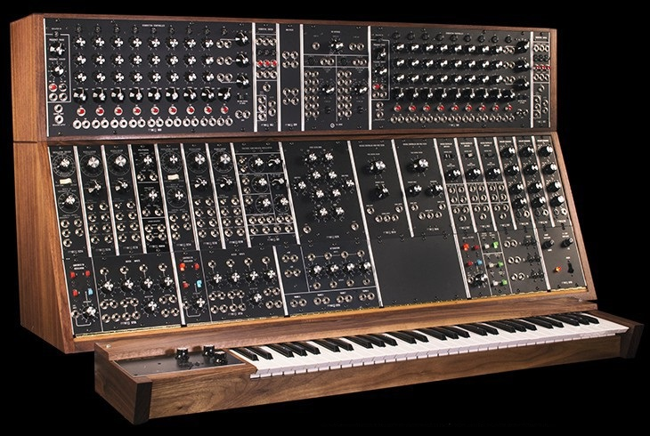

*Moog System 35モジュラーシンセサイザー（画像提供：[Moog Music](http://moogmusic.com)）*

これらのシステムでは、パッチケーブル、ノブ、スイッチの組み合わせによって、どんな音が作られるかが決まった。
今日でも、シンセサイザーの音の設定は**パッチ**と呼ばれるが、実際にはケーブルやプラグを一切使わないこともある。

モジュール間の信号はすべてアナログで、電圧を使って音楽的なパラメータを表していた。
ある電圧がピッチを、別の電圧が音色を、また別の電圧が音量を制御する、といった具合である。
システム内では、モジュール間の信号のやり取りは標準化されており、すべてのモジュールが互いに互換性を持っていた。

しかし、この電圧の互換性は、必ずしも他のメーカーの製品には通用しなかった。
各メーカーはそれぞれ独自の要件に合わせて、独自のアナログインターフェースを実装していた。
インターフェースがどう動作すべきかについて、共通の合意はほとんどなかった。
楽器どうしを接続することはできても、同じように反応する保証はどこにもなかった。
組み合わせのパターンがあまりに多く、簡単に通信できるものではなかったのである。

1970年代後半、Herbie Hancockはシンセサイザーの可能性を追求しており、さまざまなメーカーの楽器を組み合わせたライブ用のシステムを組んでいた。
彼は、それらすべてを1台のカスタムキーボードから演奏したいと考えていた。

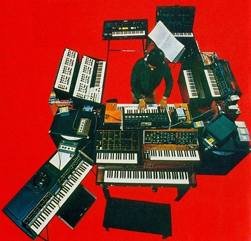

*Herbie Hancockの1978年のアルバム『Sunlight』のジャケット裏*

彼のサウンドテクニシャンだったBryan Bellは、これらのシンセを接続し、パッチの保存と読み込みを管理する[システムを設計・製作](https://www.namm.org/library/oral-history/bryan-bell)した。
それは[高価で原始的](http://www.kvraudio.com/interviews/a-conversation-with-bryan-bell---stories-about-using-synthesizers-in-the-days-before-midi-and-long-before-plug-ins-18330)なものだったが、その根底にある発想の価値を証明することになった。

### デジタルシステムの登場

1970年代の終わりまでに、多くのシンセサイザーはデジタルのマイクロプロセッサを搭載するようになり、アナログ回路の制御や、自動チューニング、パターン生成（アルペジオやシーケンス）、音色の保存といった機能を実現していた。
Rolandは、自社のシンセサイザーどうしを接続するためのDigital Control Bus（DCB）や、ドラムマシンを同期させるためのDIN-SYNCを導入したが、どちらも広くは普及しなかった。

1980年代初頭、DCBとDIN-SYNCの発想を受け継ぎ、RolandはSequential CircuitsやOberheimといったメーカーと共同で、シンセサイザーを接続するための新しい規格を開発した。
MIDIは1983年のNAMMトレードショーで発表され、そこでSequential Prophet 600とRoland Juno 106が接続された。

MIDIは、パソコンの普及とともに人気を高めていった。
Apple IIやCommodore 64が家庭用コンピュータの最先端だった1984年当時、MIDIは最新技術だった。
技術が進歩し続ける中、デジタルオーディオは当たり前のものになり、MIDIも何度か改訂・拡張されてきた。
今日のたいていのコンピュータには実際のMIDIポートはないが、アダプタを使えばUSBを簡単にMIDIへ変換できる。

## MIDI対応機器

プロトコルの詳細に入る前に、MIDIを搭載した機器のいくつかと、それにまつわる用語を紹介しておこう。

### キーボードシンセサイザー

もっともわかりやすいMIDI機器は、ごく普通のキーボードシンセサイザーである。
このチュートリアルでは、音を生成できるものはすべて**シンセサイザー**、あるいは**音源**と呼ぶことにする。
大まかに言えば、音を生成する具体的な方式そのものは重要ではなく、楽器を区別する微妙な違いは数多くある。

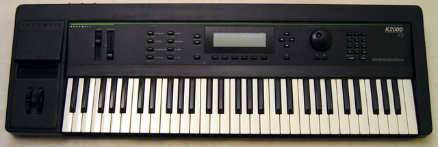

*Kurzweil K2000シンセサイザー（画像提供：[wikimedia commons](https://commons.wikimedia.org)）*

キーボードシンセサイザーは、たいていピアノ鍵盤（**コントローラー**と呼ばれる）と、アナログ・デジタル・機械式のいずれかでありうる内蔵の音源を備えている。
奏者が鍵を押すと、シンセはそれに応じて音を出す。

背景にある技術によって、シンセサイザーは次のように分類できる。

- **単音（モノフォニック）**：木管楽器や金管楽器のように、一度に1つの音しか鳴らせないもの。
- **和音（ポリフォニック）**：ギターやピアノ、オルガンのように、複数の音を同時に鳴らせるもの。同時に鳴らせる音の数はたいてい限られており、生成できる**ボイス**の数として指定される。
- **マルチティンバー**：異なる音を同時に鳴らせるポリフォニックシンセサイザー。マルチティンバー楽器には、こうした音を使うためのさまざまなモードが用意されていることが多い。
  - **レイヤリング**：単純に、複数の音を同時に、ユニゾンで鳴らせるようにするもの。
  - **キーボードスプリット**：キーボードの区域ごとに異なるボイスを割り当てるもの。たとえば、キーボードの左側にはストリングベース、右側にはピアノを割り当てる、というようなものである。
  - **ベロシティスプリット**：鍵盤をどれだけ強く叩いたかによって音を変えるもの。軽いタッチでは[グラスハーモニカ](https://ja.wikipedia.org/wiki/%E3%82%A2%E3%83%AB%E3%83%A2%E3%83%8B%E3%82%AB)のような音が、強いタッチでは[パイロフォン](https://ja.wikipedia.org/wiki/Pyrophone)のような音が鳴る、といった具合である。

とはいえ、コントローラーの機能と音源の機能は、必ずしも同じ筐体にまとめられている必要はない。それぞれ独立した部品として分かれていてもよい。

### 単体の音源

**サウンドモジュール**とも呼ばれる単体のMIDI音源は、音を生成するが、演奏するための機構をオンボードで備えていない楽器である。
さまざまな形態があるが、もっとも一般的なのはテーブルトップ型のモジュールと、

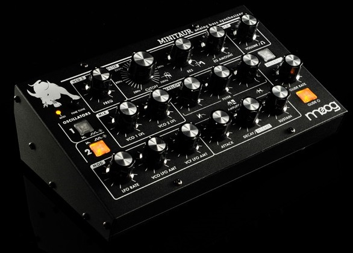

*Moog Minitaurモジュール（画像提供：[Moog Music](http://www.moogmusic.com/products/taurus/minitaur)）*

ラックマウント型のユニットである。

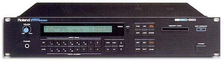

*Roland D550ラックマウントシンセサイザー（画像提供：[wikimedia commons](https://commons.wikimedia.org)）*

このカテゴリにもう一種類含めておきたいのが、コンピュータ上で動作するソフトウェアである、**バーチャル**シンセサイザーや**ソフトウェア**シンセサイザーである。
今日では、クラシックなビンテージ楽器のエミュレーションから、単体の専用機器としては現実的でない複雑な音の生成方式まで、数多くのバーチャルシンセサイザーが利用できる。

形態は異なっていても、機能的にはこれらは同等である。
MIDI入力でコマンドを受け取り、それに応じて音を生成する。
たいてい、コンピュータのシーケンサーや外部のMIDIコントローラーと組み合わせて使われる。

### 単体のコントローラー

単体の音源の対極にあるのが、単体のMIDIコントローラーである。もっとも一般的なのは*MIDIキーボードコントローラー*だろう。

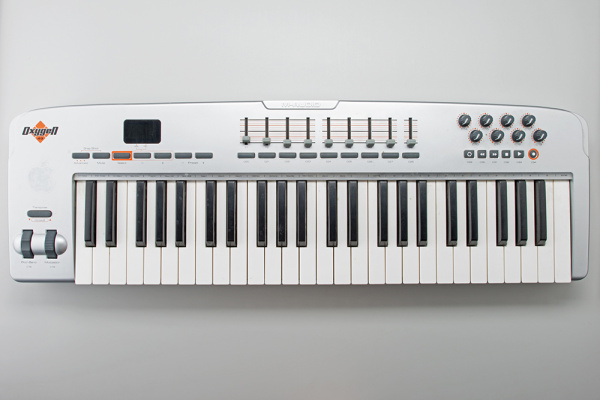

これはピアノの鍵盤を備え、追加のノブやホイール、レバーが組み合わされていることもある。
それ自体では音を出さず、外部の音源へMIDIメッセージを送信するだけである。

MIDIコントローラーは、特にバーチャル楽器が広まるにつれて、近年大きく進化してきた。
MIDIコントローラーがあれば、奏者は物理的な操作子を使って設定にアクセスできる。
マウスに手を伸ばす代わりに、実際のノブを回すことができる。
現在では、さまざまな音楽的用途を反映した多種多様なコントローラーが手に入る。電子ドラムセット、サックス、ミキシングコンソール、DJ用のターンテーブルなどである。

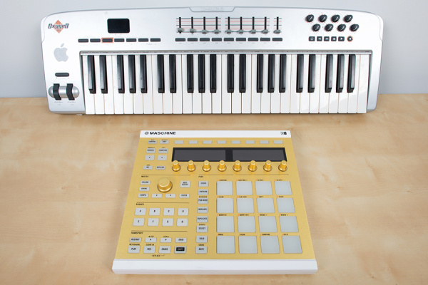

*キーボードコントローラーと、テーブルトップ型のドラムパッドコントローラー*

### ドラムマシン

ドラムマシンには、音源とシーケンサーという2つの主要な要素がある。

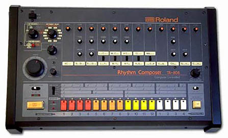

*Roland TR-808ドラムマシン（画像提供：[wikimedia commons](https://commons.wikimedia.org)）*

音源の部分は、これまで説明してきたものと同様、ドラムやパーカッションの音を作るために調整されたシンセサイザーである。

**シーケンサー**は、ドラムのビートを記録・再生し、対応する音源をトリガーするために使われる。
シーケンサーの中には読み取り専用で、あらかじめ録音されたリズムを再生するだけのものもある。祖父母の家にあった応接間のオルガンにあった「チャチャ」「タンゴ」「メレンゲ」ボタンを覚えているだろうか。
たいていのドラムマシンはプログラム可能で、ユーザーが自分でリズムを作ることができるが、具体的なプログラミング用のインターフェースは機種ごとに大きく異なる。

### コンピュータ

MIDIはパソコンとともに発展してきており、PCにはMIDIインターフェースが搭載されていることが多かった。
古いPCのサウンドカードでは、MIDIは[15ピンのジョイスティックインターフェース](http://www.midi.org/techspecs/electrispec.php)の中に隠れており、ピッグテールアダプタを使って5ピンのDINコネクタに分岐させていた。
もちろん、15ピンのジョイスティックプラグは姿を消し、今ではジョイスティックはUSB経由で接続する。
好都合なことに、USBにも[MIDIデバイスクラス](http://www.usb.org/developers/docs/devclass_docs/midi10.pdf)が定義されているため、現代のコンピュータでもMIDIを利用できる。

先ほどバーチャル楽器について触れたが、PC向けのMIDIアプリケーションには他にも数多くの種類がある。
実際のMIDIポートで接続されていようと、USB経由であろうと、パソコンはさまざまなMIDI関連の機能を果たすプログラムを実行できる。

- ドラムマシンと同様、**シーケンサー**プログラムはMIDIメッセージを記録・再生し、ユーザーによるMIDIデータの編集や並べ替えも可能にすることが多い。シーケンサーには、非常にシンプルなものから極めて高機能なものまで、さまざまな形態がある。
- **記譜プログラム**は、五線譜に楽譜を書き込んで作曲し、できあがった譜面を印刷できるようにする。
- **パッチエディタ**は、シンセサイザーの画面上の代替操作パネルとして機能する。内部パラメータにアクセスするための小さな液晶画面しかない楽器では、PCのGUIのほうがはるかにわかりやすく音のパラメータを表示できるため、エディタは特に人気がある。
- **ライブラリアン**は、楽器上の音色を読み込み、保存し、整理するために使われる。

これらの機能は、1つのアプリケーションにまとめて統合されていることも多い。
現代のシーケンサーには、バーチャル楽器を組み込み、パッチを編集・整理でき、MIDIとデジタルオーディオの両方を録音・編集できるものもある。

### その他の用途

MIDIは、厳密には楽器とは言えない機器にも使われることがある。
よくある用途の一つがステージ照明の制御だが、大規模な照明システムには、[DMX-512](./introduction-to-dmx.md)というシリアルプロトコルが使われることのほうが多い。

音楽家というのは創造力に富んだ人々の集まりでもある。MIDIが広く普及したことで、[数多くの独自の楽器](https://www.google.com/search?q=strange%20diy%20midi%20controller)を自作する人たちの例が見られる。

## MIDI規格

MIDI規格は、MIDI Manufacturers Association（MMA）によって管理されており、[MIDI.org](http://midi.org)というWebサイトを運営している。
MIDIの仕様書そのものは印刷された文書で、[MMAから](https://www.midi.org/specifications/item/the-midi-1-0-specification)入手できる。
かなりのボリュームがあり、プロトコルの多くの側面について詳しく解説している。

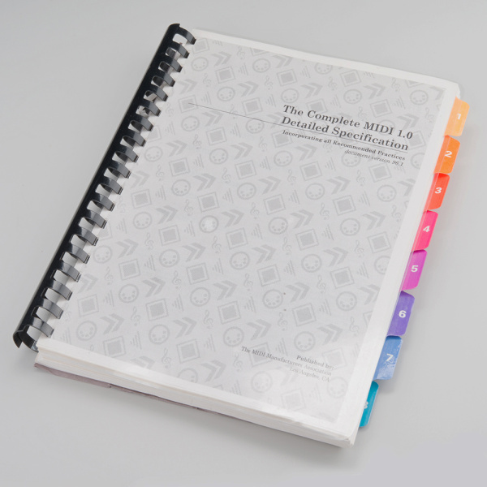

ちょっとMIDIを試してみたいだけなら、オンラインで入手できる[参考資料](https://www.google.com/webhp?sourceid=#q=midi%20reference)が数多くある。
しかし、本格的にMIDI楽器を作りたいのであれば、この仕様書を手元に置いておく価値がある。
メーカーとしてMMAに加盟すると、システムエクスクルーシブIDコードも取得できる。

## ハードウェアと電子回路の実装

### MIDIハードウェア

MIDIの設計目標の一つは、比較的安価に実現できることだった。
MIDIが作られた当時、たいていの電子楽器はすでにマイクロプロセッサシステムを中心に構築されていたため、MIDIはマイクロプロセッサ間のデジタル通信バスとして定義された。
目標の一つは、インターフェース用のハードウェアが部品表のコストを5ドルほど押し上げる程度に収まることだった。これは、他の部品と比べればごくわずかなコストだった。

### 物理的な実装

電子楽器にはすでに数多くのプラグや接続端子が備わっていたため、MIDIでは当時あまり使われていなかったもの、つまり円形の5ピンDINコネクタが指定された。
誤接続を防ぐため、独自のコネクタが選ばれたのである。

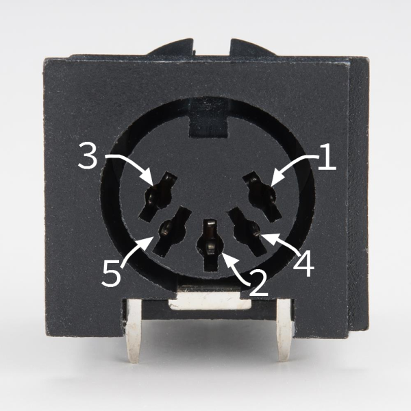

コネクタのピン番号が順番どおりに並んでいない点に注目してほしい。まるで、3ピンコネクタのピンの間にさらに2本のピンを追加したかのようになっている。
わかりやすくするため、この番号はコネクタのプラスチック部分に刻印されていることが多い。

このコネクタに接続するには、MIDIケーブルが必要である。

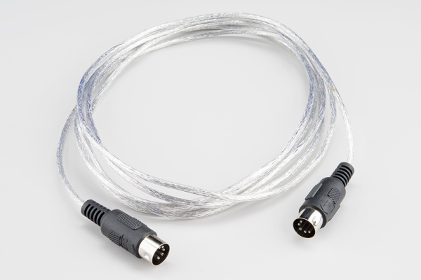

コネクタには5本のピンがあるが、実際に使われるのは3本だけである。
自分でMIDIケーブルを配線したい場合は、2個のオス型5ピンDINコネクタと、シールド付きツイストペア（STP）ケーブルが必要になる。

MIDIケーブルは、次のように接続する。

| 1本目のコネクタ | ケーブル | 2本目のコネクタ |
| --- | --- | --- |
| ピン1 | 未接続 | ピン1 |
| ピン2 | シールド | ピン2 |
| ピン3 | 未接続 | ピン3 |
| ピン4 | 電圧基準線 | ピン4 |
| ピン5 | データ線 | ピン5 |

仕様では、ケーブルの最大長は50フィート（15メートル）と定められている。

> [!NOTE]
> 注：5本すべてのピンが接続された5ピンDINケーブルが欲しい場合、通常のMIDIケーブルでは目的を果たせない。すべてのピンが接続されている保証はないからである。5ピンDINケーブルを別途用意する必要がある。とっさの場合、5ピンDINケーブルをMIDIケーブルの代わりに使うことはできるが、逆はできない。

### 電子回路の実装

MIDI仕様には、ポート用の推奨回路が含まれており、以下のとおりである。

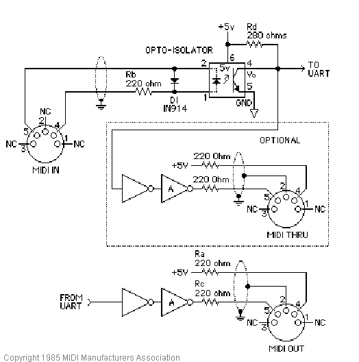

*MIDI標準ハードウェア（画像提供：[MIDI.org](http://www.midi.org/techspecs/electrispec.php)）*

この回路は、3つの部分から構成されている。

#### MIDI入力

回路図の上部がMIDI入力である。フォトカプラ（オプトアイソレータ）が必要になるため、回路の中でもっとも凝った部分になっている。
*リファレンス設計では、とうに製造中止になったSharp PC-900が指定されているが、現代の設計では6N138がよく使われる。*

[フォトカプラ](https://www.sparkfun.com/products/314)は、インターフェース回路でよく使われる興味深い部品である。
電気的な接続を作ることなく、データを伝送できる。
内部では、入力信号によってLEDが点滅する。
その光をフォトトランジスタが受け取り、電子信号へと変換し直す。
LEDとフォトトランジスタは、物理的にわずかな距離だけ離れて配置されている。
以下の写真では、その隙間が半透明のプラスチックで埋められている。

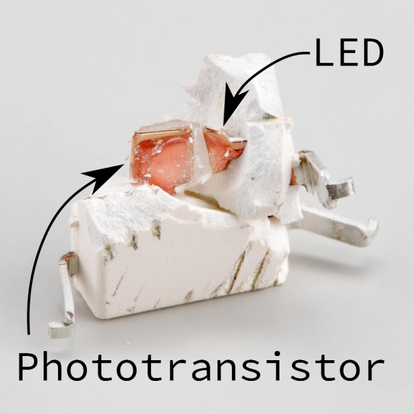

*フォトカプラの内部構造*

フォトカプラがどう動作するかについては、[後ほど](#出力から入力へ)さらに詳しく説明するが、その前にまず接続先となるMIDI出力が必要である。

#### MIDI出力

回路図の下部が、送信側のハードウェアで、MIDI Outジャックの背後にある。
このハードウェアは比較的単純で、UARTの送信ラインが、2個の論理反転素子（インバータ）へそのままつながっているだけである。
古いマイクロコントローラでは、I/Oピンが比較的非力で、フォトカプラ内のLEDを点灯させるのに十分な電流を出し入れできなかった。
2個のインバータを使うのは、信号の駆動力を安価に高める方法である。

Atmel AVRのような現代のマイクロコントローラは、ピン周りの回路がはるかに強力になっている。
LEDを直接点灯させることもできるが、それでもこのバッファには意味がある。
コネクタが外部の世界とつながっているため、短絡したり、誤って接続されたり、[静電気放電（ESD）](https://ja.wikipedia.org/wiki/%E9%9D%99%E9%9B%BB%E6%B0%97%E6%94%BE%E9%9B%BB)を受けたりする可能性があるからである。
このバッファは、いわばヒューズのような、安価で犠牲になってくれる回路であり、プロセッサそのものより簡単に交換できる。

#### MIDI Thru [原文ママ]

回路図の中央、破線で囲まれた部分が、MIDI thruポートである。
これは実質的にMIDI outポートのコピーだが、MIDI入力のデータ線に接続されている点が異なる。つまり、受信したデータのコピーをそのまま送信することで、複数の楽器をデイジーチェーン接続できるようにしている。
この使い方については、[トポロジー](#トポロジー)のセクションでさらに詳しく扱う。

### 実際のMIDIポート

すべてのMIDI機器が、これらすべてのポートを備えているわけではない。
送信だけ、あるいは受信だけしか必要としない機器もあり、その場合はそれぞれMIDI OutまたはInだけがあればよい。

MIDI thruポートも任意であり、サイズやコストを抑えるために省略されることもある。

MIDI thruポートの実装方法も、解釈の余地がある。
仕様では上記のようなハードウェア実装が求められているが、必ずしもそのとおりに実装されているとは限らない。
一部の楽器は、入力からのバイトを再送信するために、2つ目のUARTを使っている。
これによって遅延が生じ、長いデイジーチェーンではタイミングの問題を引き起こすことがある。

### 論理的な信号

上の回路図には、「TO UART」「FROM UART」と書かれ、図の外へ伸びている2つの信号がある。

UARTは「Universal Asynchronous Receiver/Transmitter（汎用非同期送受信機）」の略である。
デジタルデバイス間でバイトを転送するデジタルハードウェアの一部で、コンピュータやマイクロコントローラのシステムに周辺回路としてよく搭載されている。
これはシリアルポートの基盤となるデバイスであり、MIDIでも使われている。

UARTの基礎に馴染みがなければ、[シリアル通信](./serial-communication.md)のチュートリアルで学ぶことができる。

上の回路図のUART信号は、論理レベルで動作する。
アイドル状態のときは、論理ハイの状態にある。
それぞれのバイトの先頭にはスタートビット（常に0）が付き、続けて8個のデータビット、最後に1個のストップビット（常にハイ）が続く。
MIDIはパリティビットを使わない。

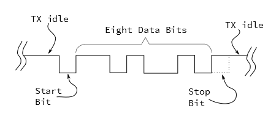

MIDIは31,250ビット毎秒のクロックレートを使用する。
8ビットのバイトを送信するには、スタートビットとストップビットで挟む必要があり、合計10ビットになる。
つまり、1バイトの送信にはおよそ320マイクロ秒かかり、MIDI接続の最大スループットは1秒あたり3,125バイトになる。
平均的なMIDIメッセージは3バイトの長さであり、送信にはおよそ1ミリ秒かかる。

MIDIが登場したばかりの頃、たいていのシンセサイザーは[16550](http://www.ti.com/product/pc16550d)や8250のような、外付けの独立したUARTチップを使っていた。
その後、UARTはマイクロコントローラの中に組み込まれるようになり、AVR、PIC、ARMのチップに非常によく見られる周辺回路になった。
UARTは、Arduinoの[Software Serial](https://www.arduino.cc/en/Reference/SoftwareSerial)ライブラリのように、ファームウェアで実装することもできる。

それぞれのバイトが何を意味し、どう解釈すればよいかについては、[次のセクション](#メッセージ)でさらに詳しく扱う。

### 出力から入力へ

プロトコルのメッセージ部分に進む前に、出力を入力に接続したときに形成される回路を分析しておこう。
以下は簡略化した図で、出力ポートが対応する入力ポートに接続されている様子を示している。

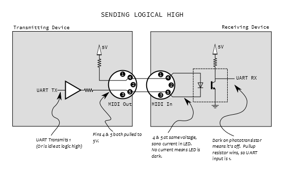

出力側では、ピン4は小さな抵抗を介してプルアップされており、ピン5はバッファリングされたUARTの送信ラインである。
入力側では、これらの線はフォトカプラ内部のLEDのアノードとカソードに接続されている。
UARTの出力は送信していないときはハイになっているため、ピン4とピン5は同じ電圧になり、LEDには電流が流れず、点灯しない。
LEDが消灯しているとき、フォトトランジスタはオフになっており、UARTはプルアップを通じて電圧を受け取り、論理1として認識する。

UARTがバイトの送信を開始すると、スタートビットによってピン5がローに引かれ、電流がLEDに流れて点灯する。
LEDが点灯すると、フォトトランジスタがオンになり、プルアップの電流を吸い込んでUARTの入力をグラウンドまで引き下げ、0を示すことになる。

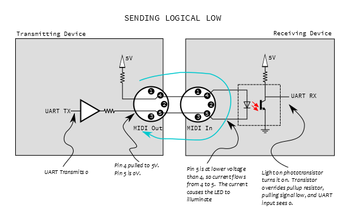

ここで注目したいのは、このLEDが電気的には送信側の回路の一部になっているという点である。
電流は送信側から出て、LEDを通り、また送信側へと戻ってくる、いわば*電流ループ*を形成している（上の図で青く示されている）。
送信側と受信側の間には、実際の電気的な接続は一切なく、フォトカプラ内部の光による経路だけがつながっている。
これは、[グラウンドループ](https://ja.wikipedia.org/wiki/Ground_loop_(electricity))を避けるのに役立つ。

## メッセージ

これまでのセクションで述べたとおり、MIDIの根本的な目標は、明確に定義されたプロトコルを話すことで、異なる機器どうしが通信できるようにすることだった。
このプロトコルは、小さなメッセージの連なりを中心に構成されている。
たいていのメッセージは1〜4バイトの長さだが、もっと長いものもあり、複数のメッセージのまとまりを必要とする情報もある。

MIDIメッセージにはいくつかのカテゴリがある。演奏に関するメッセージ（「奏者が中央のCキーを押した」）、演奏中の音についての情報（「ピアノの音からオルガンの音に変更する」）、そしてメトロノームやリアルタイムクロックのような、その他の音楽データなどである。

> 数値の表記について一言。以下のセクションでは、10進数と16進数の両方の表記を使う。10進数はそのまま書き、16進数には`0x`という接頭辞を付ける。16進数に馴染みがなければ、[このチュートリアル](./hexadecimal.md)でさらに詳しく学ぶことができる。

### ステータスかデータか

前のセクションでは、MIDIのUART設定、つまり31,250ビット毎秒、1バイトあたり8個のデータビット、1個のストップビットについて説明した。MIDIは、この8個のデータビットを余すところなく使い切っている。

1バイトの中で、それぞれのビットは0か1のどちらかを取りうる。

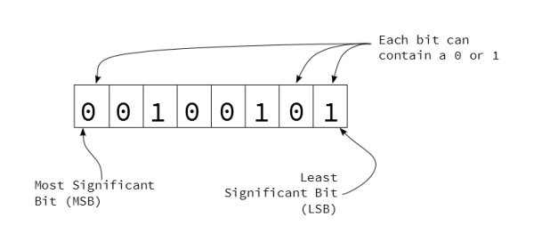

*1つの8ビットバイト*

一部のバイトは、さらに**ニブル**、つまり4ビットのかたまりに分割される。
それぞれのニブルは、バイト内の位置によって識別される。16進数で書くと、それぞれのニブルは1文字で表される。左側の文字（より上位のビットで構成される）は**最上位ニブル**、右側の文字は**最下位ニブル**と呼ばれる。

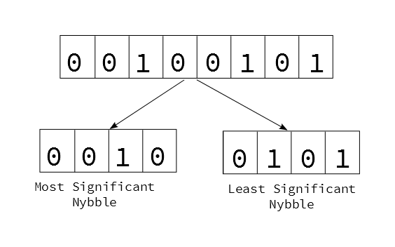

*ニブルに分割されたバイト*

MIDIメッセージのバイトは、最上位ビットの設定に基づいて、2つの大きなカテゴリに分けられる。

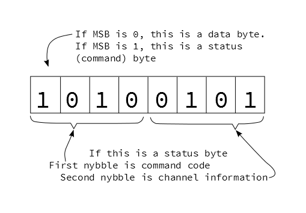

*ステータスバイトの分解*

最初のビットがハイ（値が0x80から0xffの範囲）であれば、それは**ステータスバイト**を示す。ステータスバイトは、MIDIストリームにおけるコマンドにあたる。

- ステータスバイトは、さらにニブルによって細分化される。最初のニブルはコマンドの種類を、2番目のニブルはそのコマンドが適用されるチャンネルを指定する。
- MSBがセットされたビットの組み合わせは8通りしかない（0x8から0xf）ため、ステータスコマンドも8種類しか存在しない。
- チャンネルニブルの4ビットはすべて使用可能で、MIDIには16通りのチャンネルがある。

最初のビットがロー（値が0x00から0x7fの範囲）であれば、それは**データバイト**であり、直前のステータスバイトに対応するパラメータを示す。
MSBは必ず0でなければならない（そうでなければステータスバイトになってしまう）ため、データは7ビット、つまり0から127（0x0から0x7f）の範囲に制限される。

### ステータスと対応するデータ

ステータスバイトを見ていこう。まずは一覧を示し、その後それぞれについて詳しく見ていく。

| メッセージの種類 | 上位ニブル | 下位ニブル | データバイト数 | データバイト1 | データバイト2 |
| --- | --- | --- | --- | --- | --- |
| Note Off | 0x8 | チャンネル | 2 | ノート番号 | ベロシティ |
| Note On | 0x9 | チャンネル | 2 | ノート番号 | ベロシティ |
| Polyphonic Pressure | 0xA | チャンネル | 2 | ノート番号 | プレッシャー |
| Control Change | 0xB | チャンネル | 2 | コントローラー番号 | 値 |
| Program Change | 0xC | チャンネル | 1 | プログラム番号 | なし |
| Channel Pressure | 0xD | チャンネル | 1 | プレッシャー | なし |
| Pitch Bend | 0xE | チャンネル | 2 | ベンドLSB（7ビット） | ベンドMSB（7ビット） |
| System | 0xF | さらに細分化 | 可変 | 可変 | 可変 |

ステータスバイトの下位ニブルにチャンネル番号が入るメッセージは、**チャンネルメッセージ**と呼ばれる。
チャンネルは、個々の楽器を分けるためによく使われる。チャンネル1がピアノ、チャンネル2がベース、というようにである。
これによって、1本のMIDI接続で複数の宛先の情報を同時に運ぶことができる。
それぞれの音は、チャンネルニブルに適切な値を設定したメッセージを送ることで再生される。

> [!NOTE]
> チャンネルの番号付けは、しばしば混乱の元になる。4ビットでは、0から15（0x0から0xF）までの16通りの2進数の値が表せる。たいていの人は0ではなく1から数え始めるため、MIDI機器では内部的な2進数の値に1のオフセットを加えて、1から16の範囲として扱うことが多い（ただし常にそうとは限らない）。システムがうまく通信できない場合は、チャンネルの番号を1つ上下させて試してみるとよい。

これらは非常に便利で実装も簡単なので、まずはもっともよく使われる2種類のメッセージ、ノートオン／オフとシステムリアルタイムから見ていこう。

#### Note Off（0x80）、Note On（0x90）

Note OnとNote Offのメッセージの意味は、比較的わかりやすい。
キーボードの鍵が押されるとNote Onメッセージが送られ、鍵が離されるとNote Offが送られる。
On、Offのメッセージは、ドラムパッドやMIDI管楽器のような、他の種類のコントローラーからも送信される。

シンセサイザーはNote Onを受け取ると音を生成し始め、Note Offによって停止するよう指示される。

Note OnとNote Offは、それぞれ3バイトで構成される。

```
0xnc, 0xkk, 0xvv
```

ここで、

- nはコマンド（ノートオン（0x9）またはオフ（0x8））
- cはチャンネル（1〜16）
- kkはキー番号（0〜127。中央のCはキー番号60）
- vvは打鍵の強さ（ベロシティ、0〜127）

ベロシティは、たいてい各鍵の下に配置された、わずかにずらして取り付けられた2個のスイッチを使って測定される。
鍵が押されると、一方のスイッチがもう一方より先に閉じる。
この2つのスイッチが閉じるまでの時間差を測定することで、鍵がどれだけ速く動いたかを判定できる。
楽器によってはベロシティを測定せず、代わりに0x40（64）のような固定値をそのバイトに送信するものもある。

ここまでは表面上シンプルだと述べたが、事態を複雑にする、いくつかの巧妙な近道がある。

##### ランニングステータス

送信するバイト数を減らし、接続の帯域を空けるため、MIDIは一種の省略記法を使う。
同じステータスバイトが繰り返し送信される場合、このプロトコルは**ランニングステータス**という考え方を使う。最初のステータスバイトだけを送信し、それ以降のメッセージは新しいデータバイトだけを送信するのである。
たとえば、3回のNote Onメッセージは、通常であれば次のようになる。

```
0x90, 0x3C, 0x40
0x90, 0x3D, 0x40
0x90, 0x3E, 0x40
```

ランニングステータスを使うと、2回目と3回目のステータスバイトは省略される。

```
0x90, 0x3C, 0x40, 0x3D, 0x40, 0x3E, 0x40
```

ここではNote On/Offメッセージを例に説明しているが、これは*どの*ステータスにも適用できる。
新しいステータスバイトが届くと、それまでのランニングステータスは置き換えられる。

##### 暗黙のNote Off

ランニングステータスをより効果的に活用するため、MIDIではベロシティ0のNote OnをNote Offの別名として扱う。
たとえば、次のオン・オフのペアから始めるとしよう。

```
0x90, 0x3C, 0x40
0x80, 0x3C, 0x40
```

オフのバイト（0x80）を、ベロシティ0のオン（0x90）に変えることができる。

```
0x90, 0x3C, 0x40
0x90, 0x3C, 0x00
```

これで2回連続のNote Onメッセージになったので、ランニングステータスを適用し、2回目のコマンドを取り除いて、1バイト分の送信を節約できる。

```
0x90, 0x3C, 0x40, 0x3C, 0x00
```

暗黙のNote Offを使う場合、暗黙的に示されるNote Offにはベロシティの値がない。
Note Offのベロシティが実装されていないことは多いが、それが演奏の重要な要素になる場合もある。
そのような状況では、楽器側がこれに対応している必要があり、たいてい設定メニューで明示的に有効化する必要がある。

#### システムリアルタイム

もう一つの便利なカテゴリが**システムリアルタイム**メッセージである。
これは、ステータスバイトの2番目のニブルのMSBがセットされている場合（値が0xF8から0xFFの範囲）に示される。

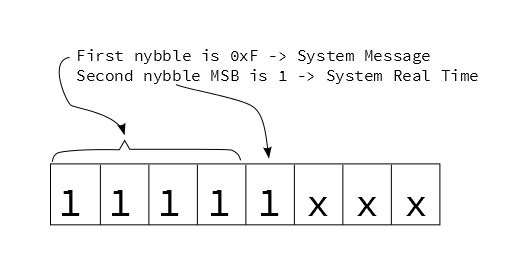

これらのメッセージはすべて1バイトの長さである。主に、高精度なメトロノームとして機能し、シーケンサーどうしを同期させるために使われる。

| 種類 | ステータスバイト | 用途 |
| --- | --- | --- |
| Timing Clock | 0xF8 | メトロノームのようなタイミングを表し、4分音符あたり24回の頻度で送信される。実際の頻度は曲のテンポに依存する。 |
| Undefined | 0xF9 | |
| Start | 0xFA | 曲の最初から再生を開始する |
| Continue | 0xFB | 直前に停止した位置から再生を開始する |
| Stop | 0xFC | 再生を停止する |
| Undefined | 0xFD | |
| Active Sense | 0xFE | 任意の「キープアライブ」メッセージ。実装されていれば、送信側がうっかり抜けてしまったことを検出するのに使える。送信側は300ミリ秒ごとにこれを送信する。このメッセージが届かなくなると、受信側はタイムアウトし、シーケンスを停止したり、鳴りっぱなしになりかねないノートをオフにしたりして後始末をする。 |
| System Reset | 0xFF | 受信側に電源投入時の状態へリセットするよう指示する「パニックスイッチ」。 |

システムリアルタイムメッセージは1バイトの長さであるため、データバイトを持たず、したがってステータスバイトには*当たらない*。
これらは、ランニングステータスを中断することなく送信できる。

## 高度なメッセージ

> このセクションでは、MIDIメッセージについてさらに深く掘り下げる。難しく感じる場合は、[次のセクション](#トポロジー)へ読み進めてしまい、必要になったらこのページに戻ってきてもかまわない。

#### Polyphonic Pressure（0xA0）とChannel Pressure（0xD0）

一部のMIDIコントローラーには、**アフタータッチ**と呼ばれる機能がある。
鍵を押さえたまま、奏者はその鍵をさらに強く押し込むことができる。コントローラーはこれを測定し、MIDIメッセージに変換する。

アフタータッチには2種類あり、それぞれ異なるステータスメッセージを持つ。

1つ目は**ポリフォニックアフタータッチ**で、コントローラー上のすべての鍵が、それぞれ独立したプレッシャー情報を送信できる。メッセージは次の形式になる。

```
0xnc, 0xkk, 0xpp
```

- nはステータス（0xA）
- cはチャンネルニブル
- kkはキー番号（0〜127）
- ppはプレッシャーの値（0〜127）

ポリフォニックアフタータッチはあまり一般的な機能ではない。それぞれの鍵に個別の圧力センサーと、それらすべてを読み取る回路が必要になるため、たいてい高級な楽器にしか搭載されていない。

より一般的に見られるのは**チャンネルアフタータッチ**である。
鍵ごとに個別のセンサーを必要とする代わりに、すべての鍵をひとまとめにしたプレッシャーを、1つの大きなセンサーで測定する。
このメッセージにはキー番号が含まれず、2バイトの形式になる。

```
0xnc, 0xpp
```

- nはステータス（0xD）
- cはチャンネル番号
- ppはプレッシャーの値（0〜127）

#### Pitch Bend（0xE0）

多くのキーボードには、鍵盤の左側にピッチベンド用のホイールやレバーが備わっている。
この操作子はたいていバネ仕掛けになっており、離すと可動範囲の中央に戻る。
これによって、上方向にも下方向にもベンドできる。

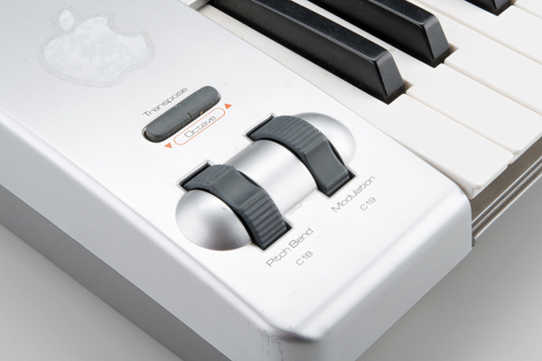

このホイールは、次の形式のピッチベンドメッセージを送信する。

```
0xnc, 0xLL, 0xMM
```

- nはステータス（0xE）
- cはチャンネル番号
- LLは値の下位7ビット
- MMは値の上位7ビット

ベンダーのデータは実際には14ビットの長さがあり、7ビットのデータバイト2個として送信されていることに気づいたかもしれない。
つまり、受信側は2進数の操作を使ってこれらのバイトを組み立て直す必要がある。
14ビットは2<sup>14</sup>、つまり0から16,383までの範囲を表す。
デフォルトでは可動範囲の中央になるため、ベンダーのデフォルト値はその範囲のちょうど半分、8192（0x2000）になる。

#### Control Change（0xB0）

ピッチベンドに加えて、MIDIには**継続コントローラー**（**CC**と略されることが多い）と呼ばれる、より幅広い表現制御のための仕組みが用意されている。
これらは、下の図に示すキーボードコントローラーの、残りのノブやスライダーから送信される。

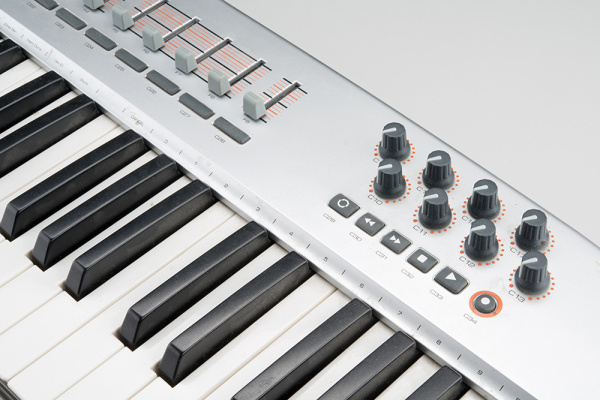

これらの操作子は、次の形式のメッセージを送信する。

```
0xnc, 0xcc, 0xvv
```

- nはステータス（0xB）
- cはMIDIチャンネル
- ccはコントローラー番号（0〜127）
- vvはコントローラーの値（0〜127）

上の写真にある操作子は、それぞれ異なるコントローラー番号を送信するよう設定されている。

たいてい、ベンダーの隣にあるホイールはコントローラー番号1を送信し、モジュレーション（ビブラート）の深さに割り当てられている。これはたいていの楽器で実装されている。

残りのコントローラー番号の割り当ては、もう一つ混乱の元になる点である。
MIDI仕様はバージョン2.0で改訂され、[この文書](http://www.midi.org/techspecs/midi_chart-v2.pdf)の2〜3ページに示されているとおり、多くのコントローラーに用途が割り当てられた。
とはいえ、この実装は普遍的なものではなく、割り当てのないコントローラー番号の範囲も残っている。

多くの現代のMIDI機器では、コントローラーは自由に割り当てられるようになっている。
写真に写っているコントローラーキーボードでは、さまざまな操作子を、異なるコントローラー番号を送信するよう設定できる。
逆のことも同じように多い。コントローラー番号を特定のパラメータにマッピングできるのである。
バーチャルシンセサイザーでは、画面上の操作子にCCを割り当てられることが多い。
これは非常に柔軟だが、接続の両端で設定が必要になることもあり、標準規格で定められた割り当てを完全に無視してしまうこともある。

#### Program Change（0xC0）

たいていのシンセサイザーはパッチを保存するメモリを持っており、次のコマンドでパッチを切り替えるよう指示できる。

```
0xnc, 0xpp
```

- nはステータス（0xc）
- cはチャンネル
- ppはパッチ番号（0〜127）

これによって128通りの音を選択できるが、現代の楽器には128個をはるかに超えるパッチが収められていることが多い。
コントローラー#0は追加のアドレス指定の階層として使われ、「バンクセレクト」コマンドとして解釈される。
このような楽器で音を選択するには、*バンクセレクト*のコントローラーメッセージと、それに続く*プログラムチェンジ*という、2つのメッセージが必要になることがある。

#### システムメッセージ（0xF0）

最後のステータスニブルは、他のステータスに当てはまらないデータのための「何でも入れ」の役割を果たす。
これらはすべて上位ニブルが0xFであり、下位ニブルが具体的なカテゴリを示す。

前のセクションで[システムリアルタイム](#システムリアルタイム)メッセージを扱った。
これらは、2番目のニブルのMSBが1のときに示される。
そのビットが0の場合、メッセージはさらに2つのサブカテゴリに分かれる。

##### System Common

2番目のニブルのMSBがセットされていない場合、これは**System Common**メッセージを示す。
これらのほとんどは、いくつかの追加のデータバイトを含むメッセージである。

| 種類 | ステータスバイト | データバイト数 | 用途 |
| --- | --- | --- | --- |
| Time Code Quarter Frame | 0xF1 | 1 | 絶対タイムコードを使ってタイミングを示す。主に映像再生システムとの同期に使われる。1つの時刻位置を送るには、エンコードされた*時：分：秒：フレーム*形式で8個のメッセージが必要になる。* |
| Song Position | 0xF2 | 2 | シーケンサーに、曲の新しい位置へジャンプするよう指示する。データバイトは、曲の先頭から数えた16分音符の数を表す14ビットの値を構成する。 |
| Song Select | 0xF3 | 1 | シーケンサーに新しい曲を選択するよう指示する。データバイトが曲を示す。 |
| Undefined | 0xF4 | 0 | |
| Undefined | 0xF5 | 0 | |
| Tune Request | 0xF6 | 0 | 受信側に、自分自身をチューニングし直すよう要求する。** |

> \*MIDI Time Code（MTC）はかなり複雑で、このチュートリアルの範囲を超える。MTCの細かい部分まで知る必要がある場合は、[MIDI Specification](http://midi.org/techspecs/)を手元に置いておくべきだろう。
>
> \*\*現代のデジタル楽器はチューニングを保つのが得意だが、古いアナログシンセサイザーはチューニングがずれやすかった。一部のアナログシンセサイザーには、このコマンドで開始できる自動チューニング機能があった。

##### System Exclusive

ここまで注意深く読んできたなら、まだ定義されていないステータスバイトが2つあることに気づくだろう。0xf0と0xf7である。
これらは**System Exclusive**メッセージ、略して**SysEx**で使われる。
SysExは、MIDI接続を通じて任意のデータを送信する経路を提供する。
MIDI Time Codeの機構を細かく制御するような、複雑なデータのために定義済みのメッセージ群もある。
SysExは、パッチやファームウェアの更新のような、メーカー独自のデータを送るためにも使われる。

System Exclusiveメッセージは他のMIDIメッセージより長く、任意の長さを取ることができる。メッセージは次の形式になる。

```
0xF0, 0xID, 0xdd, ...（さらにデータが続く）... 0xF7
```

このメッセージは、明確なバイトで前後を挟まれている。

- **Start Of Exclusive**（SOX）データバイト、0xF0で始まる。
- 開始バイトの後に続く1〜3バイトが識別子である。
  - 0x01から0x7Cまでの値は1バイトのベンダーIDで、MIDIの黎明期から関わっていたメーカーに割り当てられている。
  - IDが0x00の場合は3バイトのベンダーIDで、続く2バイトがその値になる。
  - ID 0x7Dは非商用の団体向けのプレースホルダーである。
  - ID 0x7Eは、あらかじめ定義された非リアルタイムのSysExメッセージを示す。
  - ID 0x7Fは、あらかじめ定義されたリアルタイムのSysExメッセージを示す。
- IDの後にペイロードのデータが、バイトの連なりとして送信される。
- 転送は**End of Exclusive**（EOX）バイト、0xF7で締めくくられる。

ペイロードのデータは、MIDIのデータバイトのルールに従う必要がある。つまりMSBはセットしてはならず、実際に使えるのは1バイトあたり7ビットだけである。
MSBがセットされている場合、次の3通りの状況が考えられる。

1. End of Exclusiveバイトが、SysEx転送の通常の終了を示す。
2. [システムリアルタイム](#システムリアルタイム)メッセージは、転送を中断することなく、その途中に現れることがある。受信側はこれらを、SysEx転送とは切り離して処理すべきである。
3. その他のステータスバイトは、暗黙のうちにSysEx転送を終了させ、新しいメッセージの開始を示す。

*トラブルシューティングのヒント：安価なUSB-MIDIインターフェースの中には、4バイトより長いメッセージを扱えないものがある。そのようなインターフェースを使っていてSysExの転送に問題がある場合は、[MIDI Ox](http://www.midiox.com/)のようなアプリケーションでバス上のメッセージを確認してみるとよい。*

### インプリメンテーションチャート

これだけ多くの種類のメッセージがあると、MIDIは一種の方言のようなものになっている。すべての機器がすべてのメッセージを実装しているわけではない。
単純なコントローラーとシンセサイザーの接続では、ノートオン・オフのメッセージしか必要としないかもしれない一方で、ステージ上の火薬演出コントローラーは、ノートメッセージを完全に無視し、タイムコードや、発煙筒・フラッシュポットを起動するための特定のSysExコマンドだけを必要とするかもしれない。

特定の機器がどんなメッセージを使うかをユーザーが理解できるよう、マニュアルには送受信できるメッセージを示す表が含まれていることが多い。

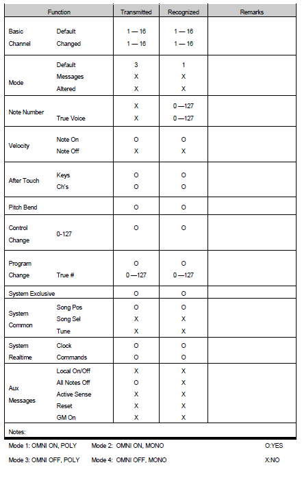

*AKAI MPC500のMIDIインプリメンテーション（画像提供：[Akaipro.com](http://Akaipro.com)）*

上の表は、ある楽器の典型的なインプリメンテーションチャートである。この機器が話すMIDIの「方言」について、いくつかの注目すべき点がわかる。

- この機器はNote Onのベロシティは送信するが、Note Offのベロシティは送信しない。
- ポリフォニックアフタータッチ、あるいはチャンネルアフタータッチのいずれかを使用する（どちらを使うかは設定メニューで選択できる）。

## トポロジー

MIDIを搭載した機器の種類と、それらが使うメッセージを見てきたところで、これらをどう配置できるかのいくつかの方法を見ていこう。

### ケース1：デイジーチェーン

もっとも単純な接続トポロジーは、1台の送信側が1台以上の受信側に接続される、デイジーチェーンである。

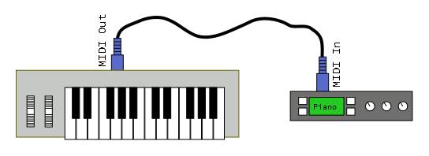

この例では、コントローラーのMIDI Outが、音源モジュールのMIDI Inに接続されている。
これによって、奏者はコントローラーの鍵を使って、モジュールから音を鳴らすことができる。
コントローラーはノートオン、ノートオフ、コントローラーメッセージを送信し、それをモジュールが音として解釈する。
通信経路は一方向である。

モジュールがマルチティンバーであれば、複数のMIDIチャンネルに応答するよう設定でき、送信チャンネルを切り替えることで、奏者は音を切り替えられる。

途中にある機器のthruポートを使えば、さらに下流にモジュールを追加できる。thruは、inポートで受信したメッセージのコピーを送信する。

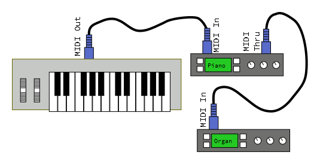

コントローラーとモジュールの設定次第で、いくつかの可能性がある。

- すべてのモジュールが、単純にユニゾンでまとめて反応する。
- それぞれのモジュールを異なるMIDIチャンネルに応答するよう設定し、コントローラーが送信するチャンネルを切り替えることで、モジュールを個別に演奏できる。
- それぞれのモジュールを特定のキーやベロシティの範囲に応答するよう設定し、スプリットやレイヤーを構成できる。

### ケース2：同期

この例では、ドラムマシンを複数接続して、パーカッションアンサンブルを組み立てたいとする。

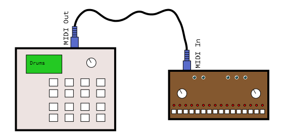

左側のドラムマシンがマスタークロックとして機能し、右側は（**クロックスレーブ**や**外部同期**モードと呼ばれることもある）クロックメッセージを受信するように設定されている。
オペレーターが左側のマシンで「play」を押すと、両方のマシンが再生を始める。
左側のマシンのテンポを調整すると、両方のマシンが揃って加速・減速する。

システムリアルタイムメッセージが、これらのマシンを同期させ続ける役割を果たす。

- start（0xFA）バイトが送信され、シーケンスの最初から再生を開始する。
- clock（0xF8）バイトが定期的に送信され、共有のメトロノームとして機能する。
- stop（0xFC）バイトが再生を停止させる。
- continue（0xFB）を使えば、直前に停止した位置からシーケンスを開始できる。

停止中もクロックを送信し続けることができ、これによってテンポを示すLEDが正しい速さで点滅し続けられる。

### ケース3：コンピュータシーケンサー

最後に見るトポロジーは、デイジーチェーンの中間にパソコンを追加するものである。

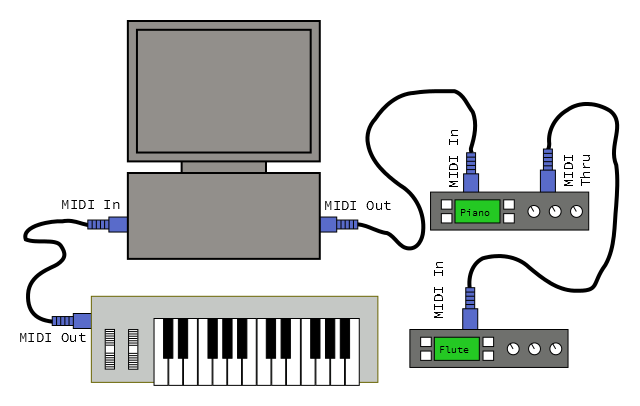

MIDIコントローラーキーボードはパソコンに接続され、音源はパソコンの下流に接続される。
チェーンの途中にパソコンを追加することで、大きな力と柔軟性が得られる。
MIDIシーケンサーソフトウェアを使えば、コントローラーからの演奏を録音し、音源モジュールで再生し、編集・アレンジして曲にまとめることができる。
シーケンサーにはたいてい**トラック**があり、複数の演奏を重ねられる。このように演奏を重ねて作り上げることを、**オーバーダビング**と呼ぶ。

シーケンサーは録音中、コントローラーからノートオン・オフのメッセージを受信する。
それをメモリに保存すると同時に、音源モジュールへ送信するため、演奏者は自分が弾いている音をその場で聞くことができる。

再生中は、MIDIコントローラーは使われず、パソコンが録音済みのメッセージを再生し、音源モジュールをトリガーする。

## MIDIを実装する

MIDIメッセージを直接扱うには、バイトを操作するための[2進数の演算子](./binary.md)をしっかり理解しておくと、はるかに簡単になる。
ビット単位のANDやOR演算を使えば、ステータスビットをマスクしたり、チャンネルニブルの値を取り出したりできる。
ビットシフトは、14ビットのベンダーデータを操作するのに便利である。

以下のコードはArduino向けに書かれている。
バイトの送信には`Serial.write()`メソッドが使われていることに気づくはずである。これは`Serial.print()`のように文字列に変換するのではなく、生のバイナリデータをそのまま送信する。
また、Arduinoで定義された`byte`というデータ型も使っている。これは符号なしの8ビット値として定義されている。
これによってステータスビットを正しく扱えるが、`char`型は符号付きであるため、符号付きの値に対する2進数演算は、MSBの扱いで微妙なバグにつながることがある。

以下のソフトウェアの例は、意図的に不完全なものになっている。後ほど、[より完成度が高く扱いやすい選択肢](#arduinoライブラリ)を紹介する。

### メッセージの生成

MIDIメッセージを送信するには、単純に適切なバイトを正しい順序で送ればよい。

システムリアルタイムメッセージがもっとも送りやすい。単にそのバイトを出力に流すだけでよい。

```cpp
void send_sys_rt(byte rt_byte)
{
    // 入力は有効な範囲にあると仮定する：
    //  System RTのバイトは0xF8から0xFFの間である。
    //
    // より現実的なコードでは、各入力を検証し、範囲外ならエラーを返すべきである

    Serial.write(rt_byte);
}
```

チャンネルメッセージはもう少し複雑である。
最初のバイトを作るには、上位ニブルにステータスの値を設定し、チャンネルから1を引いた値を下位ニブルに入れる。
最初のバイトを送信し、続けて必要な数のデータバイトを送る。
以下のコードにはランニングステータスも組み込まれている。送信側は、最後に送信したステータスバイトをグローバル変数で追跡している。

```cpp
static byte last_status = 0;

void send_channel_message(byte command,
                          byte channel,
                          int num_data_bytes,
                          byte * data)
{
    // すべての入力は有効な範囲にあると仮定する：
    //  使用できるコマンドは0x80から0xF0である。
    // チャンネルは1から16の間でなければならない。
    // num_data_bytesは1か2のいずれかであるべきである
    // dataは1〜2バイトの配列で、各要素は
    // 0x0から0x7fの範囲に収まる必要がある。
    //
    // より現実的なコードでは、各入力を検証し、範囲外ならエラーを返すべきである

    byte first;

    // コマンドの上位ニブルとチャンネルニブルを組み合わせる。
    first = (command & 0xf0) | ((channel - 1) & 0x0f);

    if(first != last_status)
    {
        Serial.write(first);
        last_status = first;
    }

    // その後、必要な数のデータバイトを送信する
    for(int i = 0; i < num_data_bytes; i++)
    {
        Serial.write(data[i]);
    }
}
```

最後に、システムエクスクルーシブメッセージを送信するには、識別子と、どちらも可変長のデータペイロードを送信する必要がある。
適切なステータスバイトで始まり、終わる必要がある。

```cpp
void send_system_exclusive(int num_id_bytes,
                          byte * id,
                          int num_data_bytes,
                          byte * data)
{
    // すべての入力は有効な範囲にあると仮定する：
    // num_id_bytesは1か3のいずれかであるべきである
    // num_data_bytesに制約はないが、現実的な上限としては1000バイト程度が妥当だろう。
    // idとdataの値は0x0から0x7fの範囲に収める必要がある。
    //
    // より現実的なコードでは、各入力を検証し、範囲外ならエラーを返すべきである


    // start-of-exclusiveを送信する
    Serial.write(0xF0);

    // 続けて識別子のバイトを送信する
    for(int i = 0; i < num_id_bytes; i++)
    {
        Serial.write(id[i]);
    }
    // 続けて必要な数のデータバイトを送信する
    for(int i = 0; i < num_data_bytes; i++)
    {
        Serial.write(data[i]);
    }

    // end-of-exclusiveを送信する
    Serial.write(0xF7);

}
```

### メッセージの解析

受信したMIDIストリームを解析するには、もう少し洗練された処理が必要になる。
[ランニングステータス](#ノートオンオフ)、[暗黙のNote Off](#ノートオンオフ)、Active Senseのような機能は送信側にとっては任意だが、受信側はそれらに対処できるよう準備しておく必要がある。

MIDIを解析するための、簡略化した[有限状態機械](https://www.sparkfun.com/news/1801)を以下に示す。

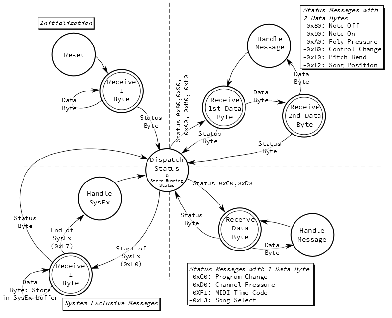

いくつか注目すべき点がある。

- システムは初期化され、バイトの受信を開始する。ステータスバイトを検出するまで、入力は無意味であり破棄される。実際にはステータスバイトはかなり頻繁に現れるため、この状態は一時的なものにすぎない。
- 「Dispatch Status」の状態は、メッセージの長さに応じてどう処理するかを決める。
  - たいていのステータスメッセージは、1バイトか2バイトのデータを持つ。
  - システムエクスクルーシブメッセージは任意の長さを取ることができ、「end of exclusive」バイトによって終端が示される。
- ランニングステータスは、Dispatch Status状態と、各ステータス処理の分岐が連携して処理する。
  - Dispatch Statusはステータスバイトを保存しており、ランニングステータスが使われたときにそれを呼び出せるようにしている。
  - 1バイト・2バイトの分岐でFSMが繰り返しデータバイトを受け取ると、保存されたステータスを繰り返し適用する。
- FSMがデータバイトを期待している時点であっても、代わりに新しいステータスが届くことがある。その場合、それまでのステータスは破棄され、新しいステータスがディスパッチされる。

「receive bytes」の状態がすべて二重丸で示されていることに気づくかもしれない。これは、より複雑な振る舞いを表す略記法である。
先ほど触れたとおり、[システムリアルタイム](#システムリアルタイム)のバイトはどの時点でも発生しうる。
Note Onメッセージのベロシティバイトを待っている最中に、代わりにクロックバイトを受け取ることもありうる。
クロックは、解析処理を妨げることなく割り込むことが許されている。
受信状態の詳細を、以下に示す。

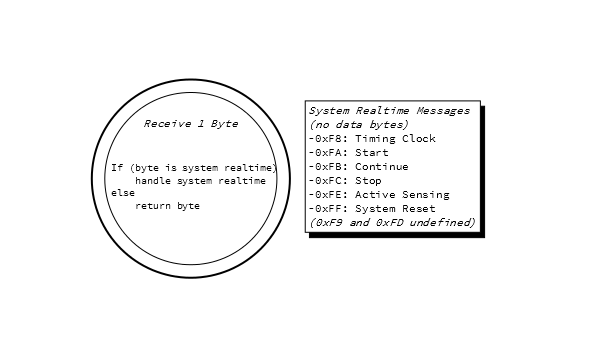

解析用のFSMの観点から見ると、システムリアルタイムのバイトはデータバイトともステータスバイトともみなされず、届き次第そのまま処理されるだけである。

上の図は、MIDIストリームのバイトをどうデコードするかを示しているが、受信側がそれらにどう応答するかについては何も示していない。
「処理する」という動詞をあえて曖昧なままにしているのは、機器の種類によって応答の仕方が異なりうるからである。

### Arduinoライブラリ

上のFSMはかなり複雑である。これを書いてデバッグするというのは、それなりに本格的なソフトウェア開発になる。

しかし、もっと簡単な方法がある。GitHubユーザーのFortySevenEffectsが、MIDIメッセージの読み書きをはるかに簡単にしてくれる[Arduino MIDIライブラリ](https://github.com/FortySevenEffects/arduino_midi_library)を作成している。
このライブラリは柔軟で、さまざまな用途に合わせて設定できる。

- ハードウェアシリアルポートでもソフトウェアシリアルポートでも使える（ハードウェアシリアルポートをデバッグメッセージの出力用に残しておくこともできる）。
- 受信メッセージはポーリングで受け取ることも、特定のメッセージに対するコールバックを設定することもできる。
- 特定のMIDIチャンネルのメッセージだけをフィルタすることも、すべてのチャンネルを受信することもできる。
- 入力をそのまま出力ポートへエコーバックする、任意の「ソフトthru」ポートも実装している。

[doxygen](http://doxygen.org)形式の[詳細なドキュメント](https://fortyseveneffects.github.io/arduino_midi_library/)も用意されている。

このライブラリを使った実践的な例については、[SparkFun MIDI Shield](https://www.sparkfun.com/products/12898)の[使い方ガイド](https://learn.sparkfun.com/tutorials/midi-shield-hookup-guide)を参照してほしい。

### 自分だけのインプリメンテーションチャートを作る

メッセージのセクションで、[MIDIインプリメンテーションチャート](#インプリメンテーションチャート)について触れた。
MIDI機器を実装するのであれば、どのメッセージを処理すべきかを把握するために、自分自身のチャートを書いておくことを検討するとよい。
たいていの機器はすべてのメッセージを実装しているわけではなく、実装しているメッセージについても、あえて無視することを選ぶ場合もある。
たとえば、音源はノートオン・オフのメッセージを処理するが、それも自分のMIDIチャンネルにあるものだけである。
不要なステータスについては、単純にそのメッセージを破棄すればよい。

メッセージを破棄することを選ぶ場合でも、System Resetメッセージ（0xff）だけは処理しておくことを勧める。これは、できるだけ早く音を止める必要がある状況で「パニックスイッチ」として使われるからである。

## その他のMIDI関連技術

MIDIは通信プロトコルに加えて、相互互換性をさらに高めるためのいくつかの関連技術も規定している。
MIDIはこれまで何度も拡張され、メッセージングプロトコルの一部を明確にしたり、電子楽器に関連する分野の標準化を助けたりしてきた。
網羅的な一覧ではないが、以下ではよく使われる拡張のいくつかを扱う。

### Standard MIDI File

MIDIシーケンサーが普及するにつれ、人々は曲のデータを異なるシーケンサー間で移動させたいと考えるようになった。
それぞれのシーケンサーは独自のファイル形式を実装しており、他のシーケンサーのデータを取り込めるものもあったが、決して普遍的なものではなかった。

Standard MIDI Fileは、シーケンスデータをやり取りするための共通言語として規定された。
このファイルには`SMF`という拡張子が使われる。

SMFは、さまざまなOSにまたがって広く採用されている。
メディアプレーヤーのプログラムで再生できるほか、本格的なシーケンサーであればSMFをインポート、編集、エクスポートできる。

### General MIDI

異なるプラットフォーム間でシーケンスデータを移動させると、関連するもう一つの問題が生じる。MIDI通信プロトコルは、楽器がパッチの変更をどう解釈するか、楽器をMIDIチャンネルにどう対応させるか、マルチティンバー機能をどう実装するかを規定していない。
General MIDIは、これらのパラメータにいくらかの標準化を加え、異なる楽器が似たような反応をするようにする。

General MIDIは標準の音色セット、つまりプログラムチェンジコマンドと特定の音色パッチの対応を定義している。
チャンネル10を除くすべてのMIDIチャンネルでは、プログラム#1は常にグランドピアノのパッチ、#2は「ブライトピアノ」、といった具合になる。

チャンネル10はドラム専用に予約されており、キーボードとドラムサウンドの対応関係も定義されている。

General MIDIはまた、対応する楽器が16チャンネルすべてで同時に音を鳴らせ、少なくとも24音のポリフォニーを提供する必要があることも規定している。

General MIDIの機能に対応した楽器には、General MIDIのロゴが表示される。


*General MIDIのロゴ*

General MIDIの音色セット向けに作られたシーケンス（たいていSMFとして保存される）は、どのGeneral MIDI対応楽器でも似たように再生される。
もちろん、標準化されているとはいえ、楽器ごとに多少のばらつきは生じる。

General MIDIは、内蔵のウェーブテーブルシンセサイザーを備えたPCのサウンドカードでもよく使われていた。
これはそれ自体が楽器として演奏可能であり、ビデオゲームのサウンドトラックにも使われた。
携帯電話にもGM音源が搭載されており、着信音としてSMFファイルを使うことができた。
今日では、コンピュータや携帯電話はビデオゲームのサウンドトラックや効果音のためにオーディオファイルをそのまま扱えるようになっており、General MIDIとSMFの組み合わせはあまり使われなくなってきている。

## 限界

MIDIは、当初の課題を解決するという点では大きな成功を収めた。異なるメーカーのシンセサイザーが、演奏情報をやり取りできるようになったのである。
演奏者はMIDI楽器を接続すれば、それらは似たように反応する。
それを実現できたこと自体が革命的であり、MIDIが広く普及する道を切り開いた。

しかし、その人気は諸刃の剣でもあった。
MIDIが普及するにつれ、何度も改訂・拡張され、当初の想定をはるかに超える機能を備えるようになった。
振り返ってみると、こうした機能の中には、いささか扱いにくかったり、時代遅れになってしまったりしているものもある。
たとえば、SysExメッセージを使ってMIDI楽器との間でファイルをやり取りすることもできるが、今日ではSDカードやUSBメモリを受け付ける楽器を作るほうが簡単かもしれない。

よく挙がるいくつかの不満を見ていこう。

### ピアノ鍵盤という前提

MIDIはピアノ鍵盤をデジタルで表現することを基盤としており、もともとキーボードを備えた楽器にはよく機能する。
ノートオン・オフのコマンドは、ピアノの鍵を押すという動作にわかりやすく対応している。
しかし、他の楽器とどう関係するかは、それほど明確ではない。

具体的な例として、ギターの演奏をMIDIデータに変換するのは特に厄介である。
ギターの弦の振動を正確にMIDIのノート番号に変換するのは、単にスイッチが閉じたことを検知するのに比べて、はるかに難しい。
市販のMIDIギターも存在するが、ギターの単純な代替品としてではなく、独自の楽器として捉えるのがもっともよいアプローチである。

ピアノ鍵盤はまた、[12音の西洋の半音階](https://ja.wikipedia.org/wiki/%E5%8D%8A%E9%9F%B3%E9%9A%8E)と本質的に結びついている。
他の文化圏の音階をMIDIにどう変換するかは、必ずしも自明ではない。
代替のチューニング情報を伝送する[システムエクスクルーシブメッセージ](http://www.midi.org/techspecs/midituning.php)もあるが、その実装はあまり一般的ではない。

### デジタル技術としての制約

MIDIは、1980年代初頭には安価だったデジタル技術を使って設計された。
それから30年以上経った今も、MIDIは使われ続けている。同じ時代の他の多くのデジタル技術は、すでに姿を消している。5.25インチのフロッピーディスクや、モノクロでテキストのみのディスプレイを覚えているだろうか。

その30年の間に、コンピュータネットワーキングは大きく成熟してきた。
イーサネットやUSBのような現代のプロトコルと比べると、MIDIは極めて原始的である。
リンクは一方向であり、チェックサムやCRCのようなデータの整合性を確認する仕組みもなく、アドレス（チャンネル）は手動で設定する必要がある。
31,250ビット毎秒というリンクの速度も、相対的に遅い。

このコインの裏側として、MIDIは慎ましいマイクロコントローラシステムでも実装しやすいという利点がある。
シリアルポートの周辺回路は、多くのMCUに搭載されている。
データレートが低いということは、受信側に過剰なデータを押し付けにくいということでもある。
メッセージが小さいため、保存するのにも多くのメモリを必要としない。

メッセージの中にも、基盤となるデータフォーマットが制約されている箇所が数多くある。

チャンネルのデータは4ビットしかないため、1本のMIDIバスは最大16チャンネルまでしかサポートできない。
これへの一般的な回避策は、複数のバスを併用することである。

MIDIで送信される値の多くも制約されている。キー番号、継続コントローラー、アフタータッチの値はすべて7ビットの長さで、0から127までの範囲しか表せない。これは一部のパラメータには粗すぎることがある。
MIDIには、継続コントローラーをMSBとLSBのペアとして組み合わせ、14ビットの値を構成する仕組みもあるが、実際にはあまり使われていない。

ある市販のキーボードコントローラーの出力を調べたところ、ベンダーは実際には14ビットのベンダーメッセージのうち、上位7ビットにしかデータを送信しておらず、残りは詰め物になっていた。
ホイールをゆっくり動かすと、耳で聞き取れるほどの階段状の変化が生じる。
これはおそらく、システムのMCUに内蔵されたペリフェラルである、基盤となるADCの分解能によるものだろう。

MIDIは、成長の余地をあまり残さなかったのである。

## 更新と代替技術

MIDIが歩んできた道は、そこで分岐している。
一方の枝は、MIDIのメッセージ形式を保ったまま、より新しい技術で伝送するというものである。
もう一方の枝は、[前のセクション](#限界)で見てきたような限界に対処するための、新しい技術を発明するというものである。
以下では、両方の枝のうち、より広く使われている技術のいくつかに触れる。

### より新しい伝送方式でのMIDI

USBは、古いPCの背面にあった、混乱を招くほど多種多様なポート群を置き換えることを目指して作られた。
かつては、PCに接続する周辺機器ごとに異なるコネクタが使われていた。キーボード、マウス、モデム、プリンタ、ジョイスティックには、それぞれ固有のプラグがあった。
USBは、これらすべての機能を1種類のホットスワップ可能なコネクタでこなせるよう設計された。
USBは2000年代初頭に一般的になった。

上記のような周辺機器に加えて、USB仕様にはMIDIポート向けのデバイスクラスも含まれている。

ほぼ同じ頃、Firewire（別名IEEE-1394）も展開されていた。
USBと似た存在だったが、より高帯域なマルチメディア用途を対象としていた。
マルチメディア指向のインターフェースとして、MIDIとの相性は自然に良かった。
初期の展開では、FirewireはUSBよりもはるかに高い帯域幅を持つという利点があった。1394が400Mbit/sだったのに対し、USBは12Mbit/sだった。

USBとFirewireにおけるMIDIの実装は似たようなものである。UARTとDINコネクタが、それぞれのバスインターフェースとプラグに置き換えられている。
とはいえ、やり取りされるメッセージは依然としてMIDIメッセージであり、USBやFirewireのトランザクションとしてラップされているだけである。
MIDIのメッセージング自体は、実質的に変わっていない。
これによって下位互換性は保たれているが、MIDIの限界そのものへの対処にはなっていない。

これらの適応版プロトコルは、最終的にはまったく異なる運命をたどることになった。

USBは広く使われ続け、今も進化を続けている。
USB 2.0の改訂では、480Mbit/sの高速オプションが追加され、1394がUSBに対して持っていた速度の優位性に対処した。
多くの新しいMIDI機器は、通常のMIDIポートの代わりに（あるいはそれに加えて）USBポートを備えている。
下位互換性のための、単体のUSB-MIDIインターフェースアダプタも存在する。

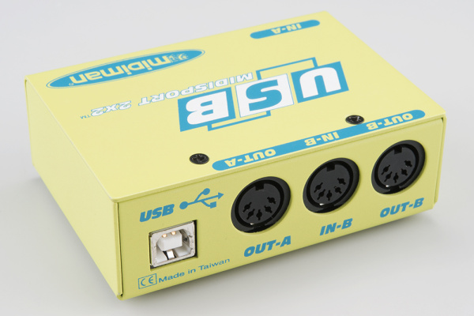

*USB-MIDIアダプタ*

Appleは長らくFirewireを推進する原動力だったが、その後は[Thunderbolt](https://ja.wikipedia.org/wiki/Thunderbolt))や[Lightning](https://ja.wikipedia.org/wiki/Lightning_%28%E3%82%A4%E3%83%B3%E3%82%BF%E3%83%BC%E3%83%95%E3%82%A7%E3%82%A4%E3%82%B9%29))インターフェースへと切り替えた。
その結果、Firewireの人気は下がってきている。

### Web MIDI

[World Wide Web Consortium](http://www.w3.org/)によって[HTML5](http://www.w3.org/TR/html5/)の一部として導入された[Web MIDI](http://www.w3.org/TR/webmidi/)は、Webページがユーザーのパソコン上のMIDI機器にアクセスできるようにするHTMLの拡張である。
Webページは、MIDIポートを見つけ出し、それを入力や出力として使うことができる。

以下は、Web MIDIアプリケーションの一例であるシンセサイザーである。
Web MIDIを使ってパソコン上のMIDIポートを検出する。
ユーザーがポートを選択すると、接続されたMIDIコントローラーからこのシンセサイザーを演奏できるようになる。
音の生成には、[Web Audio API](http://webaudio.github.io/web-audio-api/)を使用している。

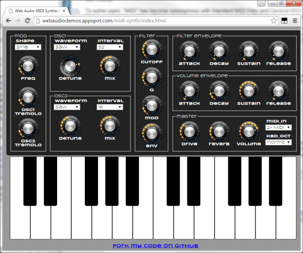

自分で試してみたい場合は、[こちら](http://webaudiodemos.appspot.com/midi-synth/index.html)をクリックしてほしい。

Web MIDIとWeb Audioのいくつかのデモとともに、この例は[webaudiodemos.appspot.com](http://webaudiodemos.appspot.com/)によるものである。
作者のChris Wilson氏は、自身の[GitHubリポジトリ](https://github.com/cwilso)でソースコードを公開している。

### その他の規格

MIDIは新しい用途に適応させられている一方で、まっさらな状態から作り直すほうが簡単な場合もある。

#### SoundfontsとDownloadable Sounds

GMにつながった発想をさらに発展させたのが、シンセサイザー間で音のデータをやり取りできるようにするファイルであるSoundfontsである。
数値を使って音の種類をリクエストするだけでなく、サンプルデータと関連するパラメータをすべて一緒に送ることで、音そのものを持ち運べるようにしている。

[SoundFont](https://ja.wikipedia.org/wiki/SoundFont)はE-Mu SystemsとCreative Labsによって開発され、SoundBlaster AWE32サウンドカードで初めて実装された。
[Downloadable Sound](https://ja.wikipedia.org/wiki/DLS_format)（DLS）は、MMAが採用した、音のデータを転送するための同様の発想である。

#### DMX-512

一部のベンダーはMIDIをステージ照明の制御に適応させたが、これはこのプロトコルの副次的な用途にすぎない。
MIDIには照明関連の情報を表すための固有のメッセージや構造がなく、規定されている最大ケーブル長50フィートは、大規模な照明システムには短すぎる。

[DMX-512](./introduction-to-dmx.md)は、1986年に照明制御プロトコルとして規定された。
MIDIと同様、機器の一方向のデイジーチェーンを使用する。
しかしMIDIとは異なり、はるかに長いケーブル配線を可能にする、差動のRS-485電気インターフェースを使用する。
アドレス方式も大きく異なっており、1本のバスで最大512台の機器をサポートする。

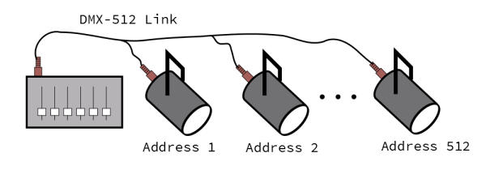

このチェーン上のメッセージングプロトコルは、実際にはMIDIよりもはるかに単純である。
コントローラーは、最大512バイトの長さのバイト列を一気に送出する。
バス上の各機器にはアドレスが設定されており、そのアドレスによって、送出されたデータのどのバイトが自分向けかがわかる。

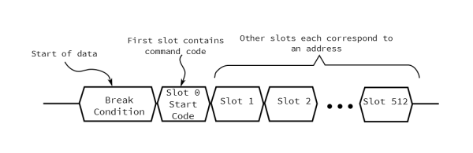

単純な照明器具であれば、明るさを制御する1バイトだけを受信するかもしれないが、モーター駆動の照明器具であれば、パン、色、明るさ、[クコロリス](https://ja.wikipedia.org/wiki/Cucoloris)の選択、その他のエフェクトを制御するために、多くのバイトを受信することもある。

#### Open Sound Control（OSC）

長年にわたり、MIDIの座を奪おうとする試みが数多くなされてきた。[いくつもの](http://www.soundonsound.com/sos/dec99/articles/cuttingedge.htm)[新しいプロトコル](https://ja.wikipedia.org/wiki/Zeta_Instrument_Processor_Interface)が提案されてきたが、たいていは普及しなかった。

その中で注目すべき例外の一つが、[Open Sound Control](http://opensoundcontrol.org/)（OSC）である。

OSCは、UCバークレーの[Center for New Music and Audio Technology（CNMAT）](http://cnmat.berkeley.edu/)によるプロジェクトである。
MIDIと比べると非常に高いレベルで動作し、現代的なネットワーキングとデータ構造の手法を活用している。
通常はイーサネット上で伝送されるが、シリアルポート経由で[SLIP](https://ja.wikipedia.org/wiki/Serial_Line_Internet_Protocol)を使うよう適応させることもできる。
データ構造は階層的で、拡張性がある。

WikipediaのOSCについての[ページ](https://ja.wikipedia.org/wiki/OpenSound_Control#Implementations)には、OSCを実装しているハードウェアとソフトウェアの一覧がある。

OSCは、MIDIとは逆の問題を抱えているとも言える。MIDIが厳密に制約されており、メッセージが標準化されているのに対し、OSCは極めて自由度が高く、相互運用性をそれほど重視せずに、それぞれの実装が独自の方言を定義できてしまう。
[SYN](https://github.com/fabb/SynOSCopy/wiki)は、コントローラーとシンセサイザーの間で使うための共通の方言として提案されているものである。

## まとめ

### 参考資料

自分だけのMIDIシステムを構築したいなら、その助けになるいくつかの製品がある。

- 自分でMIDI機器を作りたい場合は、Arduino互換の[MIDI Shield](https://www.sparkfun.com/products/12898)から始めるとよい。このシールドの[使い方ガイド](https://learn.sparkfun.com/tutorials/midi-shield-hookup-guide)には、いくつかのサンプルスケッチが載っている。
- シールドではやりすぎだという場合は、単体の[MIDIコネクタ](https://www.sparkfun.com/products/9536)も扱っている。
- DINコネクタをまるごと省きたい場合は、[FreeSoC2](https://www.sparkfun.com/products/13229)や[Teensy](https://www.pjrc.com/teensy/td_midi.html)が、いずれもクラス準拠のUSB-MIDIエンドポイント実装を提供している。
- [Dr. Bleep](https://twitter.com/bleeplabs)は、[Bleep Drum](https://www.sparkfun.com/products/12976)の第2版にMIDIを追加している。

### さらに詳しく

- [MIDI.org](http://MIDI.org)は、MIDI Manufacturer's Associationの公式サイトである。
- ArduinoでMIDIを扱うなら、47 Effectsの[MIDIライブラリ](https://github.com/FortySevenEffects/arduino_midi_library)がメッセージング層を代わりに処理してくれる。使いやすく、設定の自由度も高い。
- MIDI機器は、昔からDIYのマイクロコントローラープロジェクトの定番だった。[MIDIbox](http://www.ucapps.de/)は、さまざまなMIDI機器を作るためのプラットフォームである。
- [有限状態機械](https://www.sparkfun.com/news/1801)についての考察。
- Wikipediaの[MIDIの記事](https://ja.wikipedia.org/wiki/MIDI)。
- 本格的にMIDIに取り組みたいなら、[Complete MIDI 1.0 Detailed Specification](https://www.midi.org/specifications/item/the-midi-1-0-specification)の印刷版を手に入れておくとよいだろう。

BLE経由でMIDIを制御する方法についてさらに詳しく知りたい場合は、次のブログ記事にリンクされているMIDI BLEのチュートリアルを参照してほしい。

- [Enginursday: BLE MIDI for the Tsunami!](https://news.sparkfun.com/2615)

タグ: オーディオ、通信、概念

---

出典：[MIDI Tutorial](https://learn.sparkfun.com/tutorials/midi-tutorial)（SparkFun Learn）を日本語に翻訳し、再構成した。
原文は [CC BY-SA 4.0](https://creativecommons.org/licenses/by-sa/4.0/) ライセンスで公開されており、本ページも同ライセンスの下で提供する。
