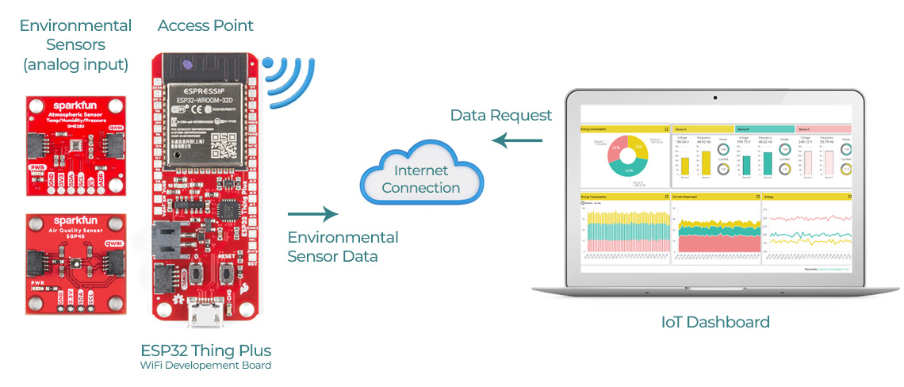
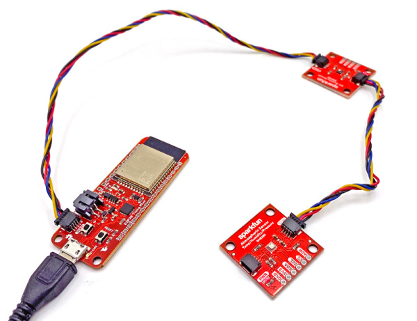
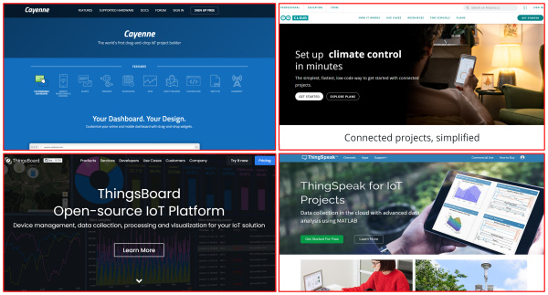
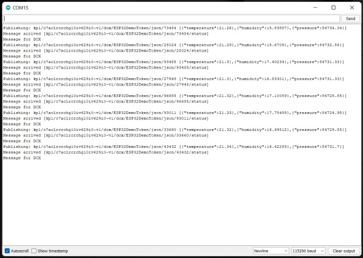
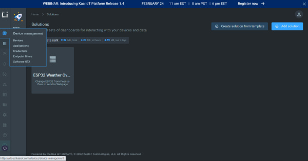
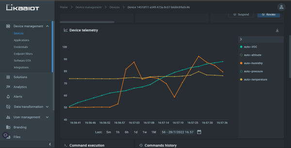
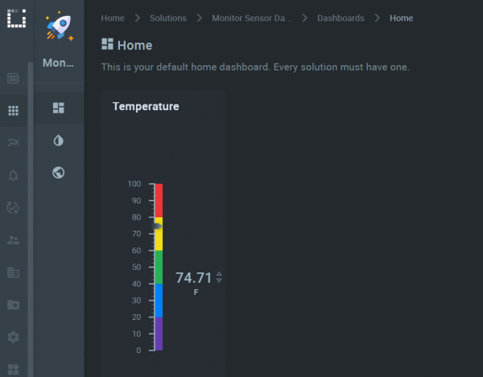

# どこからでもセンサーデータを監視する

## はじめに

WiFiは誰にとっても馴染み深いものである。
家庭のネットワークを支え、お気に入りの映画をストリーミングさせてくれ、コーヒーショップで他人と話さずに済むようにもしてくれる。
しかし、WiFiの使い道は、さまざまなアプリケーションを通じてインターネットにアクセスするだけにとどまらない。

前回のWiFiに関するチュートリアル、[WiFi経由でセンサーデータを送信する](./sending-sensor-data-over-wifi.md)の続きとして、環境センサーからデータを読み取り、シリアルLCDへ遠隔出力する、単純で閉じたピアツーピアネットワークの作り方を紹介した。
次の論理的なステップは、同じアイデアをIoTプロジェクトへと発展させ、インターネットに接続できる場所であれば世界のどこからでもセンサーの読み取り値を確認できるようにすることである。



*これで、世界のどこにいても、いつでも自宅の状況を確認できる。*

## プロジェクトの概要：どこからでも温度・湿度・気圧をワイヤレスで監視する

最初のチュートリアル[WiFi経由でセンサーデータを送信する](./sending-sensor-data-over-wifi.md)を実際にやってみた、あるいは読むだけでも読んでいれば、最初のステップが基板のMACアドレスを調べることで、次のステップがハードウェアの接続だったことを覚えているはずである。
今回のチュートリアルではMACアドレスは不要で、ハードウェアのセットアップも[Qwiic Connectシステム](https://www.sparkfun.com/qwiic)を使えばこれ以上ないほど簡単である。
[ESP32 Thing Plus](https://www.sparkfun.com/products/15663)を、1本のQwiicケーブルで1つのQwiicセンサーブレイクアウトに接続するだけでよい。
あまりにも速く簡単なので、これを「ステップ」と呼ぶことすらためらわれるほどである。



*このプロジェクトのセットアップは、2本のQwiicケーブルによる単純な数珠つなぎである。*

## ステップ1：ダッシュボードを選ぶ

**IoTダッシュボードとは何か**

IoT（モノのインターネット）ダッシュボードとは、ネットワークに接続されたデバイスが取得・送信したデータの集まりを、変換し、表示し、整理してくれるデータ可視化ツールである。
IoTダッシュボードの主な目的は、過去のデータとリアルタイムのIoTデータを遠隔から監視するための、人間にとって読みやすい一目瞭然の情報を提供することである。



*利用できるIoTダッシュボードは山ほどある。*

データを受信し、変換し、できれば可視化する何らかの手段が必要である。
その方法はいくつもある。
自分のWebサイトを持っていて、Web開発に慣れており、100%自分で制御・カスタマイズしたいのであれば、自作するという選択肢もある。
しかし、多くの人にとってここでの主眼はもう少しIoT寄りのところにある。
筆者が検討したいくつかの選択肢を紹介するが、たいていのIoTプロジェクトと同様、唯一の正解というものはない。
筆者が使ったものをそのまま試してもよいし、これを出発点として、自分のプロジェクトのニーズに完璧に合うものを探してもよい。
筆者が検討したIoTプラットフォームの概要を紹介する。

- [Arduino IoT Cloud](https://cloud.arduino.cc/)：IoTプロジェクトをWebに接続する、シンプルで手早い方法。ダッシュボードもかなり簡素である。
- [Cayenne](https://developers.mydevices.com/cayenne/features/)：ドラッグ&ドロップの使いやすいUIを備えるが、現時点では対応センサーがかなり限られている。とはいえ、ArduinoやRaspberry Piの基板を使えば、選択肢はぐっと広がる。
- [Particle](https://www.particle.io/)：非常に高機能だが、その真価を発揮するには少し調べる必要があり、独自の基板シリーズを使う（筆者は、Particleの最初のKickstarterキャンペーン以来ずっと使っている）。
- [Thingsboard](https://thingsboard.io/)：非常に高機能なプラットフォームだが、GNU/Linuxの事前知識があると、必須ではないにせよかなり役立つはずである（最初は無料プランがないように見えるかもしれないが、Professional EditionではなくCommunity Editionを見れば、無料プランが用意されていることがわかる）。
- [Thingspeak](https://thingspeak.com/)：データの可視化と分析の両方に優れたプラットフォームで、しっかりとしたArduinoの例も用意されている。
- [KaaIoT](https://www.kaaiot.com/)：こちらもしっかりしたプラットフォームで、良質なArduino向けの機能と例があり、優れた可視化ツールもそろっている。

最終的に、このチュートリアルでは[KaaIoTの無料トライアル版](https://www.kaaiot.com/free-trial)を使うことにした。


[Kaa IoTプラットフォームの無料トライアル](https://www.kaaiot.com/free-trial)

## ステップ2：コードを書き込む

KaaIoTには、始めるための例がいくつも用意されているので、まずはそこから見ていこう。
ただしその前に、KaaIoTのダッシュボード内でプロジェクトを作る必要がある。

1. KaaIoTに[無料アカウントを作成](https://www.kaaiot.com/free-trial)する（あるいはサインインする）。
2. クラウドに移動し、Rootアカウントにログインする。
3. 新しいSolution（KaaIoTにおけるプロジェクトの呼び方）を作る必要がある。名前と説明を付ける。
4. Device Management/Devicesに移動し、デバイスを追加する。これによって、固有のApplication Version（基本的にはUUID）を持つ新しいエンドポイントインスタンスが作られる。
5. Endpoint Tokenを取得する。自分で作成することも、Kaaにランダムに生成させることもできる。このトークンは、エンドポイントの身元を確認するために使われるため、既知の発信元からの通信要求だけが受け付けられる。どちらの方法を選ぶにせよ、**必ずコピーするか書き留めておく**こと。ArduinoのコードにはApp VersionとTokenの両方が必要になるが、KaaIoTはこれらを後から取得できる秘密の場所に保存してはくれない。

コードそのものについては、[KaaのGitHubリポジトリ](https://github.com/kaaproject/kaa-arduino-sdk)のコードをもとに、独自の[BME280用の基本的なデモコード](https://github.com/sparkfun/SparkFun_BME280_Arduino_Library/blob/master/examples/Example8_LocalPressure/Example8_LocalPressure.ino)と[SGP40](https://learn.sparkfun.com/tutorials/air-quality-sensor---sgp40-qwiic-hookup-guide)のコードを取り出し、この3つを組み合わせて使った。

```cpp
/*
* Monitor Sensor Data from Anywhere
*
* Rob Reynolds, Mariah Kelly, SparkFun Electronics, 2022
*
* This sketch will collect data from a BME280, a SGP40, and use a
* SparkFun ESP32 Thing Plus ESP32 WROOM to send the data
* over WiFi to a KaaIoT dashboard.
* https://www.kaaiot.com/
* Want to support open source hardware and software?
* Why not buy a board from us!
* Thing Plus ESP32 WROOM - https://www.sparkfun.com/products/17381
* SparkFun Air Quality Sensor - SGP40 (Qwiic) - https://www.sparkfun.com/products/18345
* SparkFun Atmospheric Sensor Breakout - BME280 (Qwiic) - https://www.sparkfun.com/products/15440
*
* License: This code is public domain but you can buy us a beer if you use
* this and we meet someday at the local (Beerware License).
*
*/


// まず、必要なライブラリをすべてインストールする
#include <Wire.h>
#include <WiFi.h>

#include "SparkFun_SGP40_Arduino_Library.h" // ライブラリはこちらから入手できる：http://librarymanager/All#SparkFun_SGP40
#include "SparkFunBME280.h"

#include <PubSubClient.h> // ダウンロードはこちらから：https://github.com/knolleary/pubsubclient/archive/refs/tags/v2.8.zip
#include <ArduinoJson.h>  // このライブラリはライブラリマネージャーの検索バーから見つかる
#include "kaa.h" // これもライブラリマネージャーの検索バーから見つかる

#define KAA_SERVER "mqtt.cloud.kaaiot.com"
#define KAA_PORT 1883
#define KAA_TOKEN "ESP32DemoToken"     //ここに自分のKaaIoTトークンを入力する（KaaIoTで作成したもの）
#define KAA_APP_VERSION "*******************-v1"  //ここに自動生成されたApp Versionを入力する

#define RECONNECT_TIME  5000 //ms
#define SEND_TIME       3000 //ms

// センサーデータの出力名をここで定義する
#define COMMAND_TYPE "OUTPUT_SWITCH"
#define OUTPUT_1_NAME "temperature"
#define OUTPUT_2_NAME "humidity"
#define OUTPUT_3_NAME "VOC"
#define OUTPUT_4_NAME "altitude"
#define OUTPUT_5_NAME "pressure"

const char* ssid = "WirelessNetworkName";     //WiFiネットワーク名をここに入力する
const char* password = "WirelessNetworkPassword";     //WiFiパスワードをここに入力する

char mqtt_host[] = KAA_SERVER;
unsigned int mqtt_port = KAA_PORT;

unsigned long now = 0;
unsigned long last_reconnect = 0;
unsigned long last_msg = 0;

WiFiClient espClient;
PubSubClient client(espClient);
Kaa kaa(&client, KAA_TOKEN, KAA_APP_VERSION);

#define PRINT_DBG(...) printMsg(__VA_ARGS__)

BME280 mySensor;
SGP40  myVOCSensor; //SGP40クラスのオブジェクトを作る

void setup() {
  Serial.begin(115200);
  Serial.println("Reading basic values from BME280 and SGP40");

  //mySensor.enableDebugging(); // 役立つデバッグメッセージをシリアルに出力したい場合は、この行のコメントを外す

  setupWifi();
  client.setServer(mqtt_host, mqtt_port);
  client.setCallback(callback);

  Wire.begin();

  //センサーを初期化する
  if (myVOCSensor.begin() == false) {
    Serial.println(F("SGP40 not detected. Check connections. Freezing..."));
    while (1); // これ以上何もしない
  }
  if (mySensor.beginI2C() == false) {   //I2C経由で通信を開始する
    Serial.println("The sensor did not respond. Please check wiring.");
    while (1); //停止する
  }
}

void loop() {
  if (!client.connected()) { //接続状態を確認する
    now = millis();
    if ( ((now - last_reconnect) > RECONNECT_TIME) || (now < last_reconnect) ) {
      last_reconnect = now;
      reconnect();
    }
    return;
  }
  client.loop();

  //何かを送信する
  now = millis();
  if ( ((now - last_msg) > SEND_TIME) || (now < last_msg) ) {
    last_msg = now;

    //ここで送信する
    sendOutputsState();
  }
}

void printMsg(const char * msg, ...) {
  char buff[256];
  va_list args;
  va_start(args, msg);
  vsnprintf(buff, sizeof(buff) - 2, msg, args);
  buff[sizeof(buff) - 1] = '\0';
  Serial.print(buff);
}

String getChipId() {
  char buf[20];
  uint64_t chipid = ESP.getEfuseMac();
  sprintf(buf, "%04X%08X", (uint16_t)(chipid >> 32), (uint32_t)chipid);
  return String(buf);
}

void composeAndSendMetadata() {
  StaticJsonDocument<255> doc_data;
  String ipstring = (
                  String(WiFi.localIP()[0]) + "." +
                  String(WiFi.localIP()[1]) + "." +
                  String(WiFi.localIP()[2]) + "." +
                  String(WiFi.localIP()[3])
                );

  // ここに、基板や場所など、任意の固定データを挿入する
  doc_data["name"] = "ESP32";
  doc_data["model"] = "SparkFun Thing Plus";
  doc_data["location"] = "Niwot, CO";
  doc_data["longitude"] = "40° 5' 25.5474";
  doc_data["latitude"] = "-105° 11' 6.2874";
  doc_data["ip"] = ipstring;
  doc_data["mac"] = String(WiFi.macAddress());
  doc_data["serial"] = String(getChipId());

  kaa.sendMetadata(doc_data.as<String>().c_str());
}

void sendOutputsState() {
  StaticJsonDocument<255> doc_data;

  // ここでセンサーデータを取得し、出力に割り当て、ダッシュボードへ送信する
  doc_data.createNestedObject();
  doc_data[0][OUTPUT_1_NAME] = mySensor.readTempF();  // 温度のセンサーデータを読み取る
  doc_data[1][OUTPUT_2_NAME] = mySensor.readFloatHumidity(); // 湿度のセンサーデータを読み取る
  doc_data[2][OUTPUT_3_NAME] = myVOCSensor.getVOCindex(); // VOCセンサーのデータを読み取る
  doc_data[3][OUTPUT_4_NAME] = mySensor.readFloatAltitudeFeet(); // 高度のセンサーデータを読み取る
  doc_data[4][OUTPUT_5_NAME] = mySensor.readFloatPressure(); // 気圧のセンサーデータを読み取る
  kaa.sendDataRaw(doc_data.as<String>().c_str());  // Kaa IoT Cloudへデータを送信する

}


void setupWifi() {
  delay(10);
  Serial.println();
  Serial.print("Connecting to ");
  Serial.print(ssid);
  WiFi.begin(ssid, password);
  while (WiFi.status() != WL_CONNECTED) {
    delay(500);
    Serial.print(".");
  }
  String ipstring = (
                  String(WiFi.localIP()[0]) + "." +
                  String(WiFi.localIP()[1]) + "." +
                  String(WiFi.localIP()[2]) + "." +
                  String(WiFi.localIP()[3])
                );
  Serial.println();
  PRINT_DBG("WiFi connected\n");
  PRINT_DBG("IP address: %s\n", ipstring.c_str());
}

void callback(char* topic, byte* payload, unsigned int length) {
  PRINT_DBG("Message arrived [%s] ", topic);
  for (int i = 0; i < length; i++) {
    Serial.print((char)payload[i]);
  }
  Serial.println();
  kaa.messageArrivedCallback(topic, (char*)payload, length);
}

void reconnect() {
  PRINT_DBG("Attempting MQTT connection to %s:%u ...", mqtt_host, mqtt_port);
  // クライアントIDを作る
  String clientId = "ESP8266Client-";
  clientId += String(getChipId());
  // 接続を試みる
  if (client.connect(clientId.c_str()))
  {
PRINT_DBG("connected\n");
kaa.connect();
composeAndSendMetadata();
  } else
  {
    PRINT_DBG("failed, rc=%d try again in %d milliseconds\n", client.state(), RECONNECT_TIME);
  }
}
```

Arduinoのシリアルモニタを開いてデータの流れを確認すれば、コードがローカルで正しく動作しているか確かめられる。
それが確認できたら、今度はダッシュボードに戻り、そちらでもデータを受信できているか確認する準備が整ったことになる。



*Arduinoのシリアルモニタを見れば、Thing Plus Wroomが期待どおりにデータを読み取れているかがわかる。*

KaaIoTのDevice Management/Devicesページに移動すれば、センサーデータが実際に受信されているかを確認できる。
KaaIoTには、温度、湿度、気圧などを自動で検出してくれる仕組みが備わっている。



*（KaaIoTの各ページの左側にある）ナビゲーションバーが、必要な場所への移動を助けてくれる。*

> [!NOTE]
> 注意：温度の範囲は100未満なのに対し、気圧の範囲（Pa単位で送信している）は80,000を超えているため、範囲が広すぎてKaaIoTのDevice Telemetryウィンドウでは変化を見て取ることができなかった。そこで、気圧の値を表示するチャートのポイントを非表示にした（標高の値についても同様である。コロラド州のこのあたりでは、標高の値がかなり大きいのである）。温度と湿度だけを表示するようにしたところ、ダッシュボードに値が届いているだけでなく、センサーに息を吹きかけると、その値がリアルタイムで変化する様子も確認でき、正確に動作していることがわかった（下記参照）。



*ダッシュボードのDevicesページにあるDevice Telemetryウィンドウでは、届いたデータをリアルタイムで確認できる。*

これで、センサーがデータを読み取れていること、ESP32がデータを送信できていること、そしてダッシュボードがデータを受信できていることが確認できた。次は、そのデータをどう表示したいかを決める番である。

## ステップ3：ダッシュボードを調整する

このプロジェクトでKaaIoTを選んだ理由の一つは、情報を表示するための既製のウィジェットが幅広くそろっている点にあった。
ここでは、届いたデータを見やすく、かつ視覚的に楽しい形で表示できるよう、ダッシュボードを設定していく。

1. 画面左側にある**Solutions**をクリックすると、自分のプロジェクトがすべて表示された画面になる。とはいえ、この時点では1つしかないはずである。自分のSolutionを選択する。
2. 現在のプロジェクトに含まれるすべてのダッシュボードが表示された画面になる（こちらも、この時点では「**Home**」という名前のダッシュボードが1つだけのはずである）。そのダッシュボードを選択する。
3. これでメインのダッシュボードに移動する。現時点では空っぽになっているはずである。画面左側の大きな「**Add Widget**」ボタンをクリックし、まずは温度を表示するウィジェットから始めよう。
4. Gaugesウィジェットのいずれかを選ぶ。筆者は**Vertical Bold gauge**を選んだ。
5. 右上の**Edit**をクリックすれば、このウィジェットを編集できる。これによって、適切な情報、データ、見た目を設定できるようになる。筆者が使用した値をすべて以下の表に示す。Application NameやEndpoint IDのように具体的な指定が必要な項目もあるが、それ以外の多くは自由に調整してよい。

| EDIT WIDGET | |
| --- | --- |
| **Widget Decoration** | |
| **Title** | **Temperature** |
| Display Header | ○ |
| Use Transparent Background | |
| Display Icon | |
| Z Index | |
| Easy Load | |
| Hide Based on Condition | |
| **Data Source** | |
| Service Instance Name** | epts |
| Application** | 自分が名付けたApplication |
| Endpoint ID** | 自分のEndpoint ID |
| Time Series** | auto-temperature |
| Time Series Value** | values.value |
| Reference Timestamp | Latest |
| Update Interval | 1 seconds |
| **Variables** | |
| **Appearance** | |
| Gauge Type | Vertical Bold |
| Precision | 2 |
| Postfix | F |
| **Gauge Scale** | |
| Lower Boundary | 0 |
| Upper Boundary | 100 |
| Step | 10 |
| **Color Coding** | |
| Base Color | Red |
| **Thresholds** | |
| ABC <= | 20 / Violet |
| ABC <= | 40 / Blue |
| ABC <= | 60 / Green |
| ABC <= | 80 / Lemon |
| ABC <= | 100 / Red |

**印の付いた項目は、ほぼ固定の値である。それ以外の項目は自由に工夫してかまわない。



*温度ウィジェットの表示例。*

ウィジェットが望みどおりの見た目になったら、画面右上の「**Publish Changes**」ボタンをクリックして確定させる。
Edit Mode（あるいはその隣にあるLockスライダー）をクリックすれば、ダッシュボードがロックされる。
これで、世界のどこにいても、Webに接続できる場所であればどこからでもデータを確認できるようになった。
筆者はスマートフォンでもKaaIoTのWebサイトを開いてみたが、完全に閲覧・操作でき、ウィジェットの編集まで問題なく行うことができた。

## トラブルシューティング

このプロジェクトで大きな問題に遭遇することはあまりないと思われるが、筆者と似たタイプの人であれば、どこかに置き忘れた括弧やセミコロンに頭を悩ませることもあるかもしれない。
期待どおりに動作しない場合に確認すべき、いくつかのポイントを紹介する。

Arduinoのシリアルモニタにセンサーの読み取り値がまったく表示されない場合、たいてい環境センサーと通信できていないことを示すメッセージが表示されているはずである。「The sensor did not respond. Please check wiring.」のようなメッセージが出るだろう。
WiFiに接続できていない場合は、シリアルモニタに「Connecting to <ネットワーク名>. Failed, trying again in *x* milliseconds」のようなメッセージが表示されるはずである。
ネットワーク名とパスワードが正しいか、再度確認してほしい。
それらがすべて問題なさそうなのに、ダッシュボードにデータが届かない場合は、Arduinoのスケッチに書き込んだApp VersionとApp Token（KaaIoTで作成したもの）が正しいか確認してほしい。

それ以外については、おおむね迷うところはないはずである。
筆者は、KaaIoTのダッシュボードでウィジェットを編集する際にたびたびつまずくことがあった。各ウィジェットの右上をクリックしてもEdit/Clone/Deleteのオプションが表示されず、まるでウィジェット自体を左クリックして画面上の新しい位置へドラッグしようとしているかのような挙動になってしまうことがあった。
この対策として、ウィジェットの外側でマウスの左ボタンを押したままウィジェットの右上までドラッグし、そこでノートパソコンのタッチパッドを使って左クリックする、という方法を見つけた。
毎回起こる問題ではなかったが、ノートパソコンでもデスクトップでも見られる現象だった。

## さらに詳しく

このプロジェクトをさらに発展させるもっとも簡単な方法は、次々と拡充されているQwiicセンサーのラインナップから、さらにセンサーを選んでいくことである。
届いたセンサーデータを読み取るだけでなく、プロジェクトへコマンドを送信するように拡張することもできる。
湿度が上がりすぎていないだろうか。除湿機の電源を入れるリレーを切り替えればよい。そう、地球の反対側にあるあの除湿機のことである。
KaaIoTは現在Androidアプリを開発中だが、これをさらに発展させたり、iPhone向けに自分で作ってみたりするのもよいだろう。
WiFiとIoTが広げる可能性は事実上無限であり、ここまでの基礎を身につけたあなたのプロジェクトは、海を越えて羽ばたいていけるはずである。

プロジェクトに追加するQwiic部品のアイデアが欲しければ、次のような人気のセンサーも参考にしてほしい（いずれも英語）。

- [SparkFun 9DoF IMU Breakout - ISM330DHCX, MMC5983MA (Qwiic)](https://www.sparkfun.com/sparkfun-9dof-imu-breakout-ism330dhcx-mmc5983ma-qwiic.html)
- [SparkFun Air Velocity Sensor Breakout - FS3000-1005 (Qwiic)](https://www.sparkfun.com/sparkfun-air-velocity-sensor-breakout-fs3000-1005-qwiic.html)
- [SparkFun Spectral Sensor Breakout - AS7263 NIR (Qwiic)](https://www.sparkfun.com/sparkfun-spectral-sensor-breakout-as7263-nir-qwiic.html)
- [SparkFun Micro Magnetometer - MMC5983MA (Qwiic)](https://www.sparkfun.com/sparkfun-micro-magnetometer-mmc5983ma-qwiic.html)

タグ: 3Dプリント、Arduino、通信、部品、概念、データロギング、ESP32、接続ガイド、IoT、ロギング、MQTT、プロジェクト、Qwiic、センサー、WiFi、無線

---

出典：[Monitor Sensor Data from Anywhere](https://learn.sparkfun.com/tutorials/monitor-sensor-data-from-anywhere)（SparkFun Learn）を日本語に翻訳し、再構成した。
原文は [CC BY-SA 4.0](https://creativecommons.org/licenses/by-sa/4.0/) ライセンスで公開されており、本ページも同ライセンスの下で提供する。
