# モーターと最適な選び方

## はじめに

身の回りには、常に一つや二つのモーターがある。
[携帯電話のバイブレーションモーター](https://ja.wikipedia.org/wiki/Vibrating_alert)から、お気に入りの[ゲーム機](https://ja.wikipedia.org/wiki/%E3%83%89%E3%83%AA%E3%83%BC%E3%83%A0%E3%82%AD%E3%83%A3%E3%82%B9%E3%83%88)のファンやCDドライブまで、モーターはいたるところに存在する。
モーターは、機器が私たちや環境と関わり合うための手段を提供する部品である。
用途が非常に幅広いため、モーターの設計や動作の仕方もさまざまである。

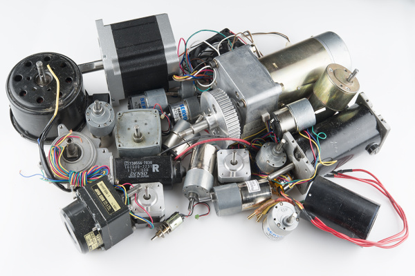

### このチュートリアルで学ぶこと

このチュートリアルでは、次の基本的なモーターの種類と用途を扱う。

- DCブラシモーター
- ブラシレスモーター
- ステッピングモーター
- リニアモーター

参考になるチュートリアル:

- [電気とは何か](./what-is-electricity.md)
- [回路とは何か](./what-is-a-circuit.md)
- [電圧、電流、抵抗とオームの法則](./voltage-current-resistance-and-ohms-law.md)

## モーターはなぜ動くのか

もっとも曖昧で単純な答えは「磁力」である。
ここから、この単純な力をスーパーカーにまで発展させていこう。

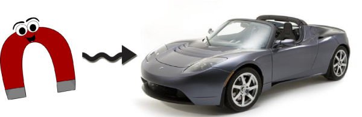

話を単純にするため、いくつかの概念を[思考実験](https://ja.wikipedia.org/wiki/%E6%80%9D%E8%80%83%E5%AE%9F%E9%A8%93)というレンズを通して見ていく。
細部を多少簡略化するので、より厳密な議論に踏み込みたい場合は[Griffiths博士の教科書](http://www.amazon.com/Introduction-Electrodynamics-Edition-David-Griffiths/dp/013805326X)を参照してほしい。
この思考実験では、磁場は動いている電子、すなわち電流によって生み出されるものとする。
この考え方は古典的なモデルとしては使いやすいが、原子レベルまで踏み込むと成り立たなくなる。
磁力を原子レベルで理解したい場合、Griffithsは別の[著書](http://www.amazon.com/Introduction-Quantum-Mechanics-2nd-Edition/dp/0131118927)でさらに詳しく説明している。

### 電磁気

磁石や磁場を作り出すには、それらがどのように生成されるかを見ていく必要がある。
電流と磁場の関係は[右手の法則](https://ja.wikipedia.org/wiki/%E5%8F%B3%E6%89%8B%E3%81%AE%E6%B3%95%E5%89%87)に従う。
電流が導線を流れると、指を導線に巻きつける向きに磁場が生じる。
これは、電流が流れる導線に働く[アンペールの力の法則](https://ja.wikipedia.org/wiki/Amp%C3%A8re%27s_force_law)を簡略化したものである。
その導線をあらかじめ存在する磁場の中に置くと、力を発生させることができる。
この力は[ローレンツ力](https://ja.wikipedia.org/wiki/%E3%83%AD%E3%83%BC%E3%83%AC%E3%83%B3%E3%83%84%E5%8A%9B#Force_on_a_current-carrying_wire)と呼ばれる。

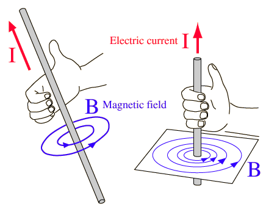

右手の法則は、電流の向きと磁場の向きの関係を示している（画像提供：[HyperPhysics](http://hyperphysics.phy-astr.gsu.edu/hbase/hframe.html)）。

電流を増やせば、磁場の強さも強くなる。
とはいえ、磁場を実用的な仕事に使うには、莫大な電流が必要になる。
さらに、その電流を流す導線自体も同じ強さの磁場を帯びることになり、制御できない磁場が生まれてしまう。
導線をループ状に曲げることで、方向のそろった集中した磁場を作ることができる。

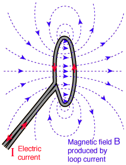

磁場そのものは変わっていない。導線をループ状に曲げることで、磁場の向きがそろうだけである（画像提供：[HyperPhysics](http://hyperphysics.phy-astr.gsu.edu/hbase/hframe.html)）。

### 電磁石

導線をループさせて電流を流すと、電磁石ができる。
導線1巻きで磁場を集中できるなら、もっと巻いたらどうなるだろうか。**数百**巻き増やしてみるとどうか。
回路に加える巻数が増えるほど、同じ電流でも磁場は強くなる。
それなら、なぜモーターや電磁石には何千、何百万という巻線が使われていないのだろうか。
それは、導線が長くなるほど抵抗が大きくなるからである。
[オームの法則（V = I×R）](./voltage-current-resistance-and-ohms-law.md)によれば、抵抗が増えても同じ電流を維持するには、電圧を上げなければならない。
場合によっては電圧を高くするほうが理にかなっていることもあれば、抵抗の小さい太い導線を使うほうがよいこともある。
太い導線を使うのはコストが高く、扱いも難しくなるのが一般的である。
これらは、モーターを設計する際に検討すべき要素である。

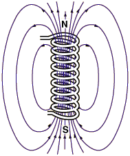

通電した電磁石が磁場を作り出している様子（画像提供：[HyperPhysics](http://hyperphysics.phy-astr.gsu.edu/hbase/hframe.html)）。

#### 実験してみよう

自分で電磁石を作るには、ボルト（または他の丸い鋼製の物）と、[マグネットワイヤー](https://www.sparkfun.com/products/11363)（30〜22ゲージ程度でよい）、[電池](https://www.sparkfun.com/products/10218)を用意する。

> [!NOTE]
> 注意：この実験にリチウム電池は使わないこと。

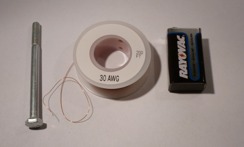

鋼の周りに導線を75〜100回ほど巻きつける。
鋼の芯を使うことで磁場がさらに集中し、実効的な強さが増す。
これがなぜ起きるのかは、次のセクションで説明する。

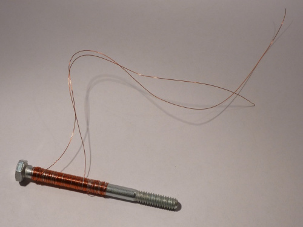

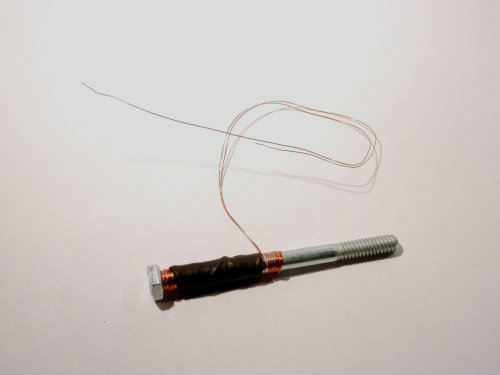

熱収縮チューブやテープを使うと、コイルを鋼の芯に固定しやすくなる。

やすりで導線の両端の被覆を取り除き、それぞれの端を電池の各端子につなぐ。
これでモーターの最初の部品が完成した。
電磁石の強さを試すには、クリップなど小さな鋼製の物を持ち上げてみるとよい。

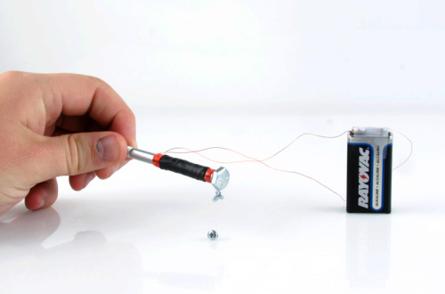

## 強磁性

先ほどの思考実験の出発点に立ち返ると、磁場は電流によってのみ生まれるとされていた。
電流を電子の流れと定義するなら、原子の周りを回る電子もまた電流を作り出し、したがって磁場を生み出すはずである。
すべての原子に電子があるなら、あらゆるものが磁性を帯びるのだろうか。答えはイエスである。
[カエルを含む](https://www.youtube.com/watch?v=2VlWonYfN3A)あらゆる物質は、十分なエネルギーが与えられれば磁気的な性質を示す。
しかし、すべての磁性が同じように生じるわけではない。
冷蔵庫の磁石でネジを持ち上げられるのに、カエルでは持ち上げられないのは、[強磁性](https://ja.wikipedia.org/wiki/%E5%BC%B7%E7%A3%81%E6%80%A7)と[常磁性](https://ja.wikipedia.org/wiki/%E5%B8%B8%E7%A3%81%E6%80%A7)の違いによるものである。
この二つ（および他のいくつかの種類）を区別するには、[量子力学](https://ja.wikipedia.org/wiki/%E9%87%8F%E5%AD%90%E5%8A%9B%E5%AD%A6)の議論が必要になる。

ここでは、もっとも強い現象であり、私たちが日常でもっともよく経験する強磁性に焦点を当てる。
量子レベルの理解を省くため、強磁性体の原子は隣り合う原子と磁場の向きをそろえる*傾向がある*ということだけを受け入れることにする。
向きをそろえる傾向があるとはいえ、材質のばらつきや結晶構造などの要因によって、[磁区](https://ja.wikipedia.org/wiki/%E7%A3%81%E5%8C%BA)と呼ばれる領域が生じる。

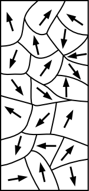

磁区の向きがばらばらだと、隣り合う磁場が互いに打ち消し合い、磁化されていない状態になる。
強い外部磁場にさらされると、これらの磁区の向きをそろえ直すことができる。
磁区の向きをそろえることで全体の磁場が強まり、磁石ができあがる。

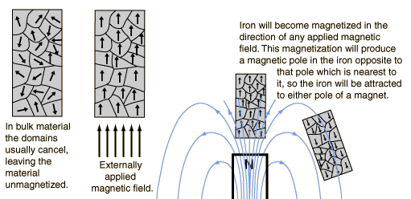

画像提供：[HyperPhysics](http://hyperphysics.phy-astr.gsu.edu/hbase/hframe.html)

この向きの変化は、加えた磁場の強さによっては永続的になることがある。
これは好都合である。次のセクションで、まさにこの性質が必要になるからである。

## 永久磁石

永久磁石は、電磁石と同じように振る舞う。
違いは、その名のとおり永続的である点だけである。

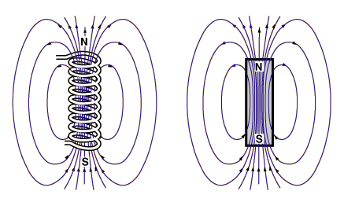

図では、矢印はN極から出てS極へ向かう向きに描かれる。
もう一つの慣習として、赤をN極、青をS極として色分けすることもある。
磁石の極性を調べるには、方位磁針を使うとよい。
異なる極どうしが引き合うため、磁針のN極は磁石のS極を指す。

同じ実験を電磁石で行い、極性を調べることもできる。

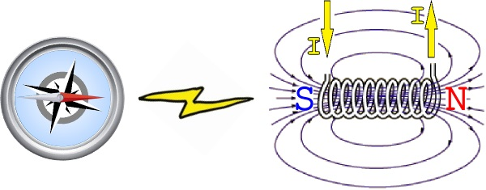

電流の向きを逆にすると、電磁石の極性が反転する様子を確認できる。

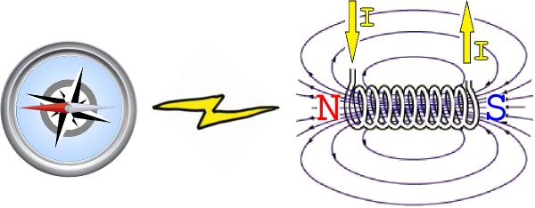

これは、モーターを組み立てるうえで重要な原理である。
ここからは、実際にいくつかの種類のモーターを見ながら、磁石と電磁石がどのように使われているかを見ていく。

## DCブラシモーター：定番の方式

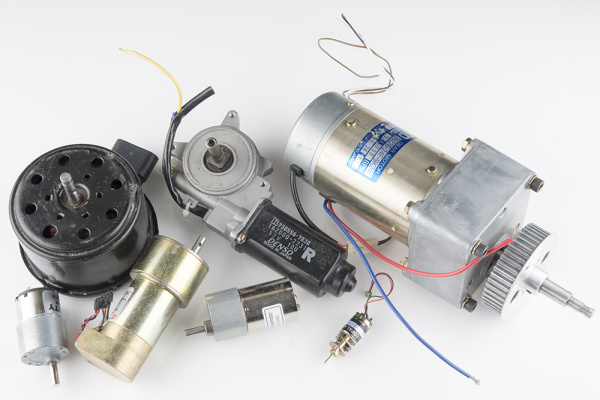

DCブラシモーターは、現在使われているモーターの中でもっとも単純な部類に入る。
家電製品、おもちゃ、自動車など、あらゆる場所で見つけることができる。
構造も制御も単純なため、プロにもホビイストにも定番の選択肢となっている。

### ブラシモーターの構造

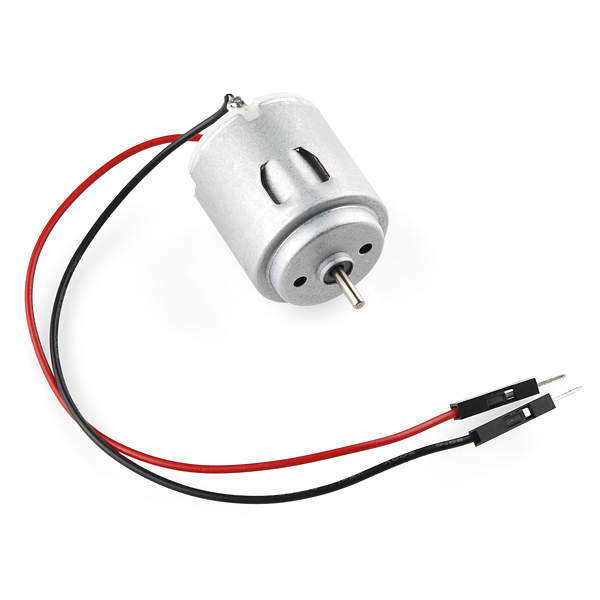

仕組みを理解するために、まずは簡単な[ホビーモーター](https://www.sparkfun.com/products/10171)を分解してみよう。
見てのとおり、構造は単純で、いくつかの主要な部品からできている。

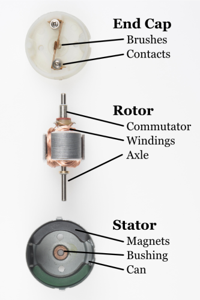

- **ブラシ**：整流子を通じて、接点からアーマチュア（電機子）へ電力を伝える
- **接点**：コントローラからの電力をブラシへ伝える
- **整流子**：アーマチュアが回転するのに合わせて、適切な巻線の組へ電力を送る
- **巻線**：電気を、軸を駆動する磁場に変換する
- **軸**：モーターの機械的な動力を、応用先の機構へ伝える
- **磁石**：巻線が引きつけたり反発したりするための磁場を提供する
- **ブッシング**：軸の摩擦を抑える
- **ケース（缶）**：モーターの機械的な外装となる

### 動作の仕組み

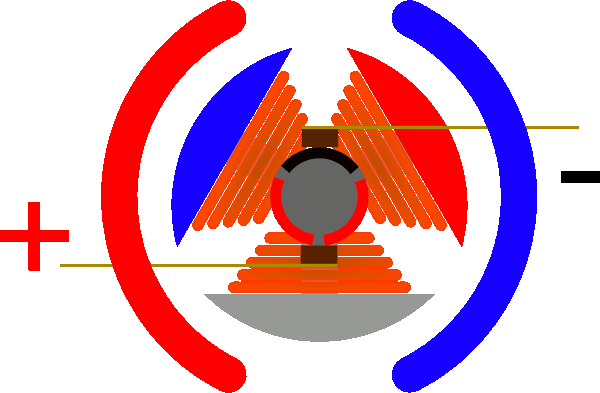

巻線に電流が流れると、モーターの周囲にある磁石に引きつけられる。
これによってモーターが回転し、ブラシが次の整流子の接点に触れる。
この新しい接点によって別の巻線の組に電流が流れ、同じ過程が繰り返される。
モーターの回転方向を逆にするには、モーター接点の極性を入れ替えればよい。
ブラシモーターの内部で発生する火花は、ブラシが次の接点へ飛び移る際に生じるものである。
コイルの各導線は、もっとも近い二つの整流子接点に接続されている。

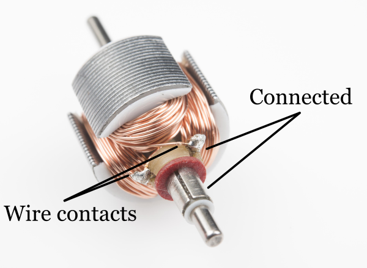

モーターが一定の状態で固定されてしまうのを防ぐため、巻線の数は必ず奇数にする。
大型のモーターでは、より多くの巻線の組を使うことで「コギング」を抑え、低回転数（RPM）でも滑らかな制御を実現している。
コギングは、モーターの軸を手で回してみると体感できる。磁石が露出した固定子にもっとも近づいた位置で「引っかかり」を感じるはずである。
コギングは設計上のいくつかの工夫で解消できるが、もっとも効果的なのは固定子そのものを取り除くことである。
このタイプのモーターは、[鉄芯なし（コアレス）モーター](https://ja.wikipedia.org/wiki/%E9%9B%BB%E5%8B%95%E6%A9%9F#Ironless_or_coreless_rotor_motor)と呼ばれる。

**長所**

- 制御が容易
- 低回転数でのトルクに優れる
- 安価で大量生産に向いている

**短所**

- ブラシが経年劣化する
- ブラシの火花が電磁ノイズを発生させることがある
- ブラシの発熱により、速度に制限がかかることが多い

## ブラシレスモーター：さらなるパワー

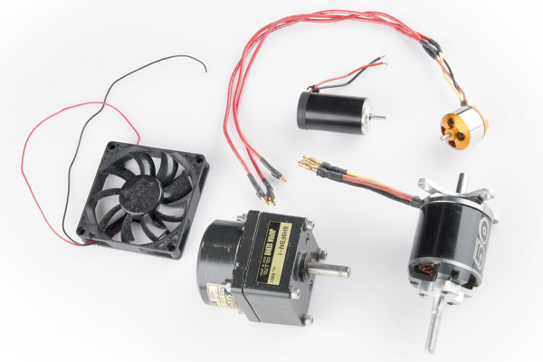

ブラシレスモーターの勢いは止まらない、と言うと少し大げさかもしれない。
とはいえ、ブラシレスモーターは航空機から地上を走る乗り物まで、ホビー市場を席巻し始めている。
これらのモーターの制御は長らく難題だったが、マイクロコントローラが安価かつ高性能になったことで扱えるようになった。
その驚くべき可能性を引き出すため、より高速で効率的なコントローラの開発は今も進んでいる。
故障しやすいブラシがないため、これらのモーターはより大きなパワーを、しかも静かに発揮できる。
高級な家電や乗り物の多くがブラシレス方式へ移行しており、[Tesla Model S](https://ja.wikipedia.org/wiki/%E3%83%86%E3%82%B9%E3%83%A9%E3%83%BB%E3%83%A2%E3%83%87%E3%83%ABS)はその代表例である。

### ブラシレスモーターの構造

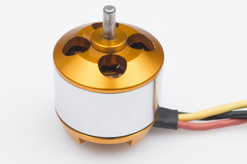

仕組みを理解するために、まずは簡単なブラシレスモーターを分解してみよう。
これらは、ラジコン飛行機やヘリコプターでよく見られる。

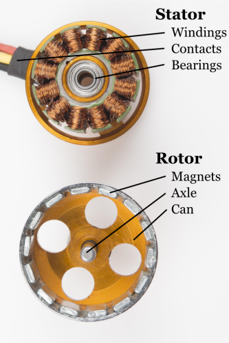

- **巻線**：電気を、ロータを駆動する磁場に変換する
- **接点**：コントローラからの電力を巻線へ伝える
- **ベアリング**：軸の摩擦を抑える
- **磁石**：巻線が引きつけたり反発したりするための磁場を提供する
- **軸**：モーターの機械的な動力を、応用先の機構へ伝える

### 動作の仕組み

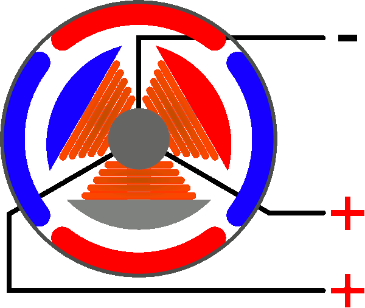

ブラシレスモーターの機構は驚くほど単純である。
唯一の可動部分は、磁石を内蔵したロータだけである。
複雑になるのは、巻線に通電する順序を制御する部分である。
それぞれの巻線の極性は、電流が流れる向きによって決まる。
上のアニメーションは、コントローラが従う単純なパターンを示している。
交流によって極性が切り替わり、それぞれの巻線に「押す・引く」の効果が生まれる。
ポイントは、このパターンをロータの回転速度と同期させ続けることである。
これを実現する広く使われている方法は二つある。
多くのホビー向けコントローラは、通電していない巻線に生じる電圧（[逆起電力](https://ja.wikipedia.org/wiki/Counter-electromotive_force)）を測定する。
この方法は高速回転時には非常に信頼性が高い。
モーターの回転が遅くなるほど、発生する電圧の測定が難しくなり、誤差も生じやすくなる。
より新しいホビー向けコントローラや多くの産業用コントローラは、[ホール効果センサー](https://ja.wikipedia.org/wiki/%E3%83%9B%E3%83%BC%E3%83%AB%E7%B4%A0%E5%AD%90)を使って磁石の位置を直接測定する。
これは、PCファンの制御にもっともよく使われる方式である。

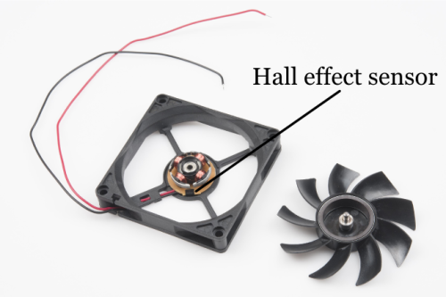

**長所**

- 信頼性が高い
- 高速回転が可能
- 効率が良い
- 大量生産されており入手しやすい

**短所**

- 専用のコントローラなしでは制御が難しい
- 始動時の負荷を小さく抑える必要がある
- 駆動用途では専用のギアボックスが必要になることが多い

## ステッピングモーター：シンプルかつ精密

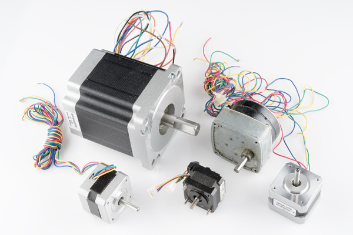

ステッピングモーターは、位置制御に優れたモーターである。
デスクトップ用プリンター、プロッター、3Dプリンター、CNCフライス盤など、正確な位置制御が必要なあらゆる機器で見つけることができる。
ステッパーはブラシレスモーターの中でも特殊な部類に入り、高い保持トルクを持つように作られている。
この高い保持トルクによって、次の位置へ少しずつ「ステップ」する動作が可能になる。
その結果、エンコーダを必要としない単純な位置決めシステムが実現し、ステッピングモーター用のコントローラは非常に作りやすく、扱いやすいものになっている。

### ステッピングモーターの構造

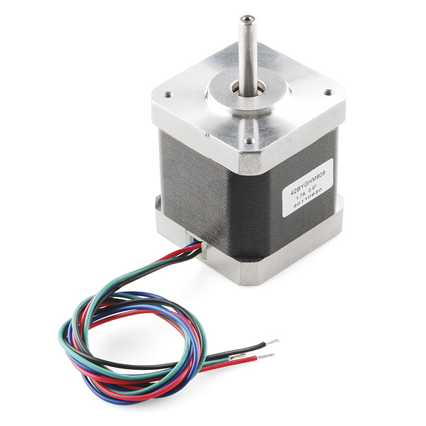

仕組みを理解するために、まずは簡単な[ステッピングモーター](https://www.sparkfun.com/products/10846)を分解してみよう。
見てのとおり、これらのモーターは直接駆動の負荷向けに作られており、いくつかの主要な部品からできている。

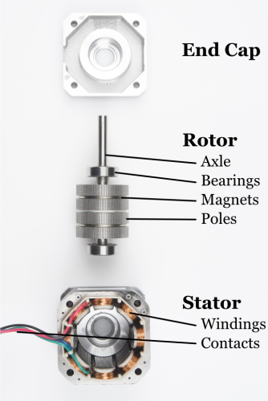

- **軸**：モーターの機械的な動力を、応用先の機構へ伝える
- **ベアリング**：軸の摩擦を抑える
- **磁石**：巻線が引きつけたり反発したりするための磁場を提供する
- **ポール（磁極片）**：磁場を集中させ、ステップの分解能を高める
- **巻線**：電気を、軸を駆動する磁場に変換する
- **接点**：コントローラからの電力を巻線へ伝える

### 動作の仕組み

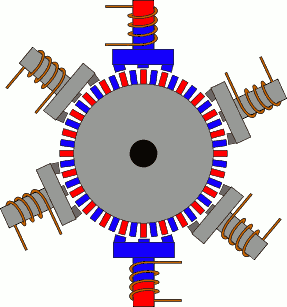

画像提供：[PCB heaven](http://www.pcbheaven.com/wikipages/How_Stepper_Motors_Work/?p=1)

ステッピングモーターは、ブラシレスモーターとまったく同じように振る舞うが、1ステップの角度がはるかに小さい点が異なる。
唯一の可動部分は、磁石を内蔵したロータだけである。
複雑になるのは、巻線に通電する順序を制御する部分である。
それぞれの巻線の極性は、電流が流れる向きによって決まる。
上のアニメーションは、コントローラが従う単純なパターンを示している。
交流によって極性が切り替わり、それぞれの巻線に「押す・引く」の効果が生まれる。
ステッパーで特徴的なのは、磁石の構造がブラシレスモーターとは異なる点である。
小さなスケールで磁石の配列をきれいに動作させるのは難しく、コストも高くなる。
これを避けるため、多くのステッピングモーターでは板を積み重ねる方式を使い、磁極を「歯」の形に導いている。

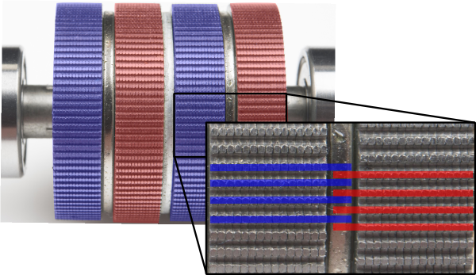

ブラシレスモーターでは逆起電力を使って速度を測定するが、ステッパーは各巻線への短い通電によって、想定した時刻に目的の位置へ「確実に」到達することを頼りにしている。
高速動作では、ロータがこのシーケンスに追いつけずに脱調（ストール）することがある。
これを避ける方法はあるが、モーターの巻線とインダクタンスの関係についてより深い理解が必要になる。

**長所**

- 位置精度に優れる
- 保持トルクが高い
- 信頼性が高い
- 多くのステッパーが標準的なサイズで手に入る

**短所**

- 1ステップの角度が小さいため最高速度に制限がある
- 大きな負荷がかかると「ステップ抜け」を起こすことがある
- 常に最大電流を消費する

## リニアモーター：これからの技術

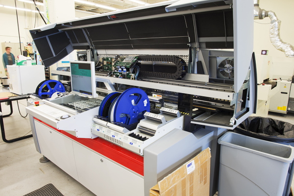

これからの技術はリニアである。
高速のピック&プレース機では、速度がすべてを左右する。
速度が上がれば摩擦が増え、摩擦が増えればメンテナンスが必要になり、メンテナンスが発生すれば[ダウンタイム](https://ja.wikipedia.org/wiki/Downtime)につながり、ダウンタイムは生産性の低下を招く。
回転運動を直線運動に変換する部品を取り除くことで、システムははるかに軽く、効率的になる。
リニアモーターはメンテナンスが容易で、可動部分が一つしかないため非常に信頼性が高い。
しかも非常に高速である。
これは、実際の製造現場で使っている[ピック&プレース機](./electronics-assembly.md)であり、驚くほど高速に動作する。
このマシンはとてもパワフルなため、ペースメーカーに関する警告表示まで付いている。
高出力の[希土類磁石](https://ja.wikipedia.org/wiki/%E5%B8%8C%E5%9C%9F%E9%A1%9E%E7%A3%81%E7%9F%B3)が一列に並んでいる。

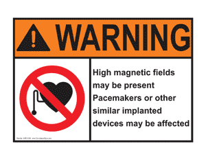

### リニアモーターの構造

階下にあるピック&プレース機の内部を見て、仕組みを理解してみよう。

- **モーションモジュール**：電磁石とコントローラを内蔵する
- **磁石**：コイルが引きつけたり反発したりするための磁場を提供する
- **リニアベアリング**：モーターを磁石と正しく整列させておく、唯一の可動部分

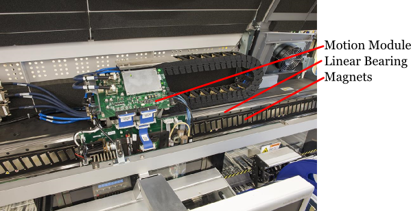

### 動作の仕組み

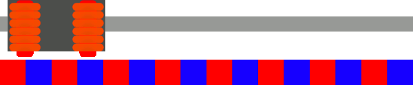

リニアモーターの機構は、ブラシレスモーターとほぼ同じである。
違いは、ブラシレスモーターを一直線に「展開」したものがリニアモーターだという点だけである。
唯一の可動部分はモーションモジュールである。
複雑になるのは、コイルに通電する順序を制御する部分である。
それぞれのコイルの極性は、電流が流れる向きによって決まる。
上のアニメーションは、コントローラが従う単純なパターンを示している。
交流によって極性が切り替わり、それぞれのコイルに「押す・引く」の効果が生まれる。
リニアモーターでは通常、モーションモジュールの位置を追跡するためのエンコーダや、何らかの高度な位置決めシステムが備わっている。
高い位置精度を実現するため、コントローラは従来型のシステムよりもはるかに複雑になる。
[マイクロステッピング](https://ja.wikipedia.org/wiki/%E3%82%B9%E3%83%86%E3%83%83%E3%83%94%E3%83%B3%E3%82%B0%E3%83%A2%E3%83%BC%E3%82%BF%E3%83%BC#Microstepping)は、磁石を「絞り込んで」滑らかで精密な動作を実現する方法である。
ただし、これを実現するにはモーターごとに調整された高度に専用化されたコントローラが必要になる。
コントローラの技術が進歩するにつれ、これらのモーターの価格も下がっていくと考えられる。
いつか、3Dプリンターが時間単位ではなく秒単位で印刷できる日が来るかもしれない。

**長所**

- 信頼性が高い
- 高速動作が可能
- 効率が良い
- 回転運動から直線運動への変換が不要

**短所**

- 高価である
- 専用のコントローラが必要になる
- システムごとに専用設計となる
- （繰り返しになるが）高価である

## まとめ

ここまで、いくつかの種類のモーターと、それぞれの使いどころを見てきた。
モーターを選ぶには、まず用途の要件を明確にする必要がある。
要件が定まれば、それぞれのモーターの種類の長所と短所を比較検討できる。
さらに重要なのは、それぞれのモーターの定格を確認することである。
どのモーターにも入力電力と出力電力の値が示されている。
システムの負荷要件を計算することもできるが、実際に試してみるほうが早いこともある。
モーターを組み込む作業の足がかりとして、次のようなページも参考にしてほしい。

- [ギア比](http://science.howstuffworks.com/transport/engines-equipment/gear-ratio.htm)
- [ベアリング](https://ja.wikipedia.org/wiki/%E8%BB%B8%E5%8F%97)
- [チェーン駆動](https://ja.wikipedia.org/wiki/%E3%83%81%E3%82%A7%E3%83%BC%E3%83%B3%E9%A7%86%E5%8B%95)
- [パルス幅変調（PWM）](./pulse-width-modulation.md)
- [モーター制御用の<ruby>H-bridge<rt>Hブリッジ</rt></ruby>](https://en.wikipedia.org/wiki/H-bridge)

最後に、物理学全般について学べる場所を紹介する。

- [HyperPhysics](http://hyperphysics.phy-astr.gsu.edu/hbase/hframe.html)

タグ: 概念、モーター、技術

---

出典：[Motors and Selecting the Right One](https://learn.sparkfun.com/tutorials/motors-and-selecting-the-right-one)（SparkFun Learn）を日本語に翻訳し、再構成した。
原文は [CC BY-SA 4.0](https://creativecommons.org/licenses/by-sa/4.0/) ライセンスで公開されており、本ページも同ライセンスの下で提供する。
