# Raspberry PiでNintendo Switchのマクロを記録する

このチュートリアルでは、[Joycontrol](https://github.com/mart1nro/joycontrol)を改造したバージョンをインストールする。
Joycontrolは、Bluetooth経由でRaspberry Pi上にNintendo Switchのコントローラーをエミュレートできるオープンソースプロジェクトである。
オリジナルのプロジェクトはシンプルなコマンドラインインターフェースでSwitchを操作できるが、もっと機能を追加したいというアイデアがあったため、リポジトリをフォークして作業に取りかかった。

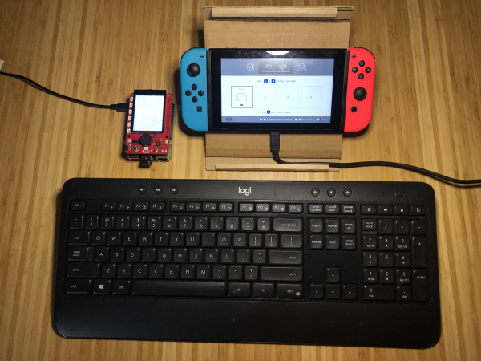

*Raspberry PiをNintendo Switchに、Proコントローラーとして接続する*

[Joycontrol-ms](https://github.com/marcus-stevenson/joycontrol-ms)には、キーボード操作、マクロの記録・再生機能が追加されており、便利にするため[SparkFun Top pHAT](https://www.sparkfun.com/products/16301)とも統合されている。
自分だけのカスタムコマンドを書きたい場合のために、すべてを動かしているコードについても掘り下げる。

## 必要な部品

このチュートリアルに沿って進めるには、以下の部品が必要になる。
持っているものによっては、すべてが必要になるとは限らない。
カートに追加し、ガイドを読み進めながら、必要に応じてカートを調整してほしい。

- Raspberry Pi
- SparkFun Top pHAT

### 他に必要なもの

- Nintendo Switch本体

### おすすめの読み物

Raspberry PiやSparkFun Top pHATに初めて触れる場合は、先に進む前に次のページを確認しておくとよい。

- [Raspberry Pi 4 Kit Hookup Guide](https://learn.sparkfun.com/tutorials/raspberry-pi-4-kit-hookup-guide) — Raspberry Pi 4 Model Bの基本キット、デスクトップキット、ハードウェアスターターキットの接続ガイド
- [SparkFun Top pHAT Hookup Guide](https://learn.sparkfun.com/tutorials/sparkfun-top-phat-hookup-guide) — 他のHATの上に重ねて使うpHAT。Top pHATの使い始め方を解説するガイド

## ハードウェアのセットアップ

> **注意：** このチュートリアルは、Pi上にすでにRaspbianをセットアップ済みであることを前提とする。
> まだPiをセットアップしていない場合は、Hookup Guideを参照して準備を整えてほしい。
>
> - [Raspberry Pi 4 Kit Hookup Guide](https://learn.sparkfun.com/tutorials/raspberry-pi-4-kit-hookup-guide) — Raspberry Pi 4 Model Bの基本キット、デスクトップキット、ハードウェアスターターキットの接続ガイド

Top pHAT用にすでにPiのセットアップ・設定を終えている場合は、このステップを飛ばして構わない。
Top pHATの組み立てはかなり単純である。
Raspberry PiのGPIOピンに直接差し込むだけでよい。
最も重要な点として、pHATの向きに注意し、ピンが正しく揃っているか必ず確認すること。
以下にいくつかの例を示すので参考にしてほしい。
このプロジェクトではPi 4 Model Bを使っているが、Bluetoothを搭載したほとんどのPiで動作するはずである。
Top pHATとのクリアランスのためにヘッダーが必要なPiを使う場合は、必ずヘッダーを購入しておくこと。

まず、必要であれば下の画像のようにメスヘッダーを接続する。

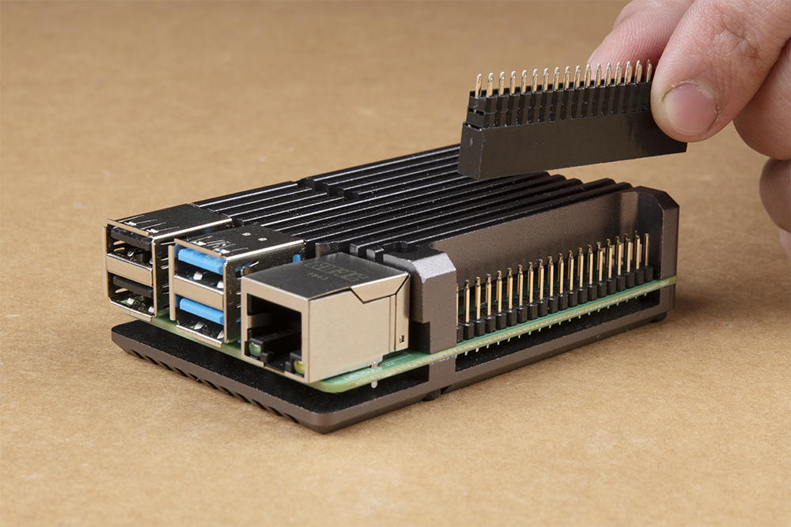

次に、Top pHATを取り付け、キーボードとマウスを接続する。
最初は、HDMIポートの一つを使って外部ディスプレイにも接続しておくとよい。
最後に、USB-C電源アダプタを接続し、コンセントに差し込む。

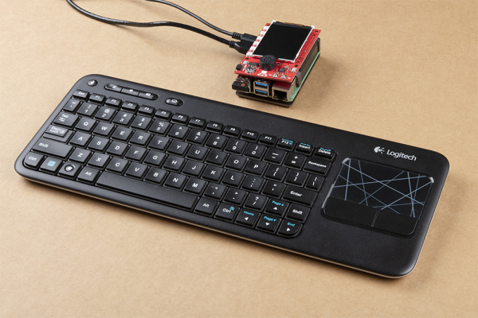

Piが起動したら、Top pHAT向けの設定を行い、Joycontrol-msとその依存関係をインストールできる。

## OSの設定とJoycontrol-msのインストール

Top pHAT用にすでにPiのセットアップ・設定を終えている場合は、このステップを飛ばして構わない。
この手順は、SparkFun Top pHAT Hookup GuideのOS Configuration part 1（WS2812B LEDと2.4インチTFTディスプレイ）とOS Configuration part 2と同じものである。
このプロジェクトではHATの機能をすべて使うわけではないため、急いでいる場合はこのセットアップ手順だけを完了させれば十分である。

まず、**Raspberryロゴ** > **Preferences** > **Raspberry Pi Configuration**をクリックし、オーバースキャンを無効化する。


「Disable Overscan」のオプションを選択する。

次に、「interfaces」タブをクリックし、SPIとI2Cのインターフェースを有効化する。

これでOKをクリックできるが、まだPiを再起動しないこと。
Raspberry Pi Configurationのウィンドウには後で戻り、そのときに再起動する。

このプロジェクトはオンボードのアドレサブルLEDを利用するため、Adafruit Neopixel Pythonパッケージをインストールする必要がある。
ターミナルを開き、次のコマンドをウィンドウにコピーして、Enterキーを押す。

```bash
sudo pip3 install adafruit-circuitpython-neopixel
```

次に、2.4インチTFTディスプレイを使うために、ドライバーモジュールとモジュール設定を追加する必要がある。
ターミナルに、次の内容をコピー&ペーストしてEnterキーを押す。

```bash
sudo nano /etc/modules
```

nanoが開いたら、ファイルの末尾に次の内容をコピー&ペーストする。

```bash
spi-bcm2835
fbtft_device
```

続いて、キーボードの`Ctrl+X`を押して終了し、`Y`で変更を承諾、`Enter`で変更を書き込んでnanoを終了する。
続いて、モジュール設定についても同じ手順を繰り返す必要がある。
ターミナルに、次をコピー&ペーストする。

```bash
sudo nano /etc/modprobe.d/fbtft.conf
```

nanoが開いたら（今回は画面がほぼ空白のまま表示される）、次の内容をコピー&ペーストし、変更を保存して終了する。

```bash
options fbtft_device name=fb_ili9341 gpios=reset:23,dc:24 speed=16000000 bgr=1 rotate=180 custom=1
```

ここでも、キーボードの`Ctrl+X`を押して終了し、`Y`で変更を承諾、`Enter`で変更を書き込んでnanoを終了する。

次に、Joycontrol-msの依存関係をインストールする。
必要な依存関係は3つある。
ここでは、次のコマンドをターミナルにコピー&ペーストするだけでよい。

```bash
sudo apt install python3-dbus libhidapi-hidraw0
sudo pip3 install keyboard
```

これが完了したら、joycontrol-msをインストールしたいディレクトリに`cd`で移動し、そこでリポジトリをクローンする。
筆者はデスクトップにクローンした。

```bash
cd Desktop
git clone https://github.com/marcus-stevenson/joycontrol-ms.git
```

続いて、Joycontrol-msに`cd`で移動し、次を実行する。

```bash
sudo pip3 install .
```

これでセットアップはすべて完了しているはずである。
残る作業は、Raspberry Pi Configurationのウィンドウに戻り、「boot to CLI」を選択することだけである。

**これで**、Piを再起動できる。
これ以降はTop pHATのディスプレイを使うため、この段階でHDMIディスプレイを取り外しておくのも良いタイミングである。
この目的のためには、再起動ではなく完全なシャットダウンを推奨する
（電源ケーブルをバッテリーパックに置き換えれば、このプロジェクトはさらに携帯性を高められる）。

## Joycontrolの使い方

プログラムを実行してNintendo Switchに接続するには、Switch側で「Change Grip/Order」メニューを開き、joycontrol-msに`cd`で移動して次のコマンドを入力する。

```bash
sudo python3 ./run_controller_cli.py PRO_CONTROLLER
```

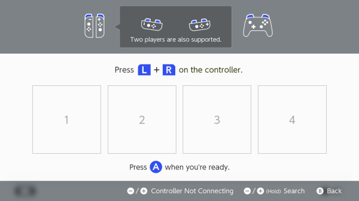

すべてを正しく設定できていれば、コントローラーがSwitchに接続される様子が表示されるはずである。

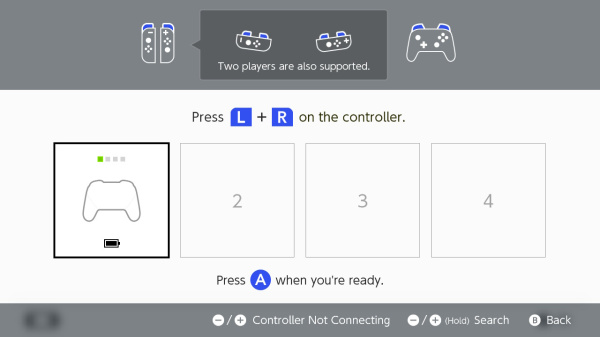

Pi側のターミナルには大量の情報が出力される。
これには少し時間がかかることもあるが、最終的にターミナルに「cmd>>」と表示される。
この時点で接続が完了しており、CLIにコマンドを入力する準備ができている。
まず次を試してみてほしい。

```
cmd>> a
```

Enterを押し、Switchが反応するまで待つ。
最初の数回のボタン入力は反映されるまで少し時間がかかることがあるため、「cmd>>」のプロンプトが表示されていても、忍耐強く反応を待つこと。
最初の「A」コマンドが認識されると、コントローラーのメニューに戻る。
「A」コマンドを送りすぎると、すぐに「change grip/order」画面に再突入してしまい、Piの接続がSwitchから切断される。
これが起きた場合は、`sudo python3 ./run_controller_cli.py PRO_CONTROLLER`をもう一度実行して再接続すればよい。

Nintendo Switchのホーム画面に戻ったら、CLIに`help`と入力してEnterを押す。
これで利用可能なすべてのコマンドとその説明が表示されるが、キーボードの方向キーでスクロールして戻らないと全文を読めないことがある。

以下は、すべてのコマンドの一覧である。

### ボタンコマンド

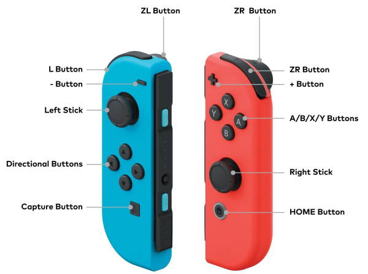

*画像提供：[Nintendo of America](https://www.cnet.com/news/nintendo-joy-con-switch-controllers-announced/)*

### コマンド一覧

- **stick**：スティックの位置を設定するコマンド
  - **:param side:**：`'l'`、`'left'`は左スティック、`'r'`、`'right'`は右スティック
  - **:param direction:**：`'center'`、`'up'`、`'down'`、`'left'`、`'right'`。`'h'`、`'horizontal'`または`'v'`、`'vertical'`を指定すると、値を`value`引数へ直接設定する
  - **:param value:**：水平方向または垂直方向の値
- **test_buttons**：「Test Controller Buttons」メニューへ移動し、すべてのボタンを押す
- **keyboard**：キーボードにコントロールをバインドする
- **recording**：キーボードにコントロールをバインドし、記録を停止するまで入力を記録する。保存した記録は`cmd >> recording_playback`で再生できる

キーボードと記録用のキーバインドは次のとおりである。

| | | |
| --- | --- | --- |
| q = LEFT | f = RIGHT | g = capture |
| w = LStickUP | i = RStickUP | h = home |
| a = LStickLEFT | j = RStickLEFT | e = UP |
| s = LStickDOWN | k = RStickDOWN | c = DOWN |
| d = LStickRIGHT | l = RStickRIGHT | up = X |
| t = L | y = R | down = B |
| r = ZL | u = ZR | plus = + |
| left = Y | right = A | minus = − |

- **playback**：保存した記録を選び、再生する
- **delete_rec**：保存した記録を選び、削除する
- **mash**：指定したボタンを設定した間隔で連打する
  - 使い方：`mash <button> <interval>`
- **nfc**：NFCコンテンツを設定する
  - 使い方：
    - `nfc <file_name>`：コントローラーの状態にあるNFCコンテンツをファイルから設定する
    - `nfc remove`：コントローラーの状態からNFCコンテンツを削除する

基本から始めよう。
そのボタンのラベルを入力してEnterを押すだけで、個別のボタン入力をエミュレートできる。
たとえば次のようになる。

```
cmd>> x
cmd>> y
cmd>> plus
cmd>> capture
cmd>> zl
```

「&&」を使えば、複数のボタン入力を連結できる。

```
cmd>> zl&&zr
cmd>>left&&left&&left&&a
```

ジョイスティックはCLIから使うにはあまり便利ではないが、次のように設定できる。

```
cmd>> stick left right
```

このコマンドは、左スティックを最も右の位置に設定する。
次のコマンドを送って中立の「center」位置に戻すまで、この状態を保つ。

```
cmd>> stick left center
```

止めるまで単一のボタンを「連打」し続けたい場合は、次のコマンドを使う。

```
cmd>> mash a 5
```

これは、Enterを押すまで5秒ごとに「a」ボタンを押し続ける。

## マクロの記録

これらのCLIコマンドはどれも試して楽しいものだが、求めていた機能にはまだ足りなかった。
そこで、キーボード操作をコントロールにバインドして直接Switchを操作したり、そのキーボード操作を記録したり、マクロのように再生したり、不要なマクロを削除したりできる、いくつかの追加コマンドを実装した。
マクロは、それぞれのJoycontrolセッションを終了した後も保持される。

まず、Piに接続したキーボードでNintendo Switchを操作するには、次のコマンドを使う。

```
cmd>> keyboard
```

`<enter>`を押してキーボードをコントローラーにバインドするよう促される。
キーボード操作を止めるには、もう一度`<enter>`を押す。
キーバインドは次のとおりである。

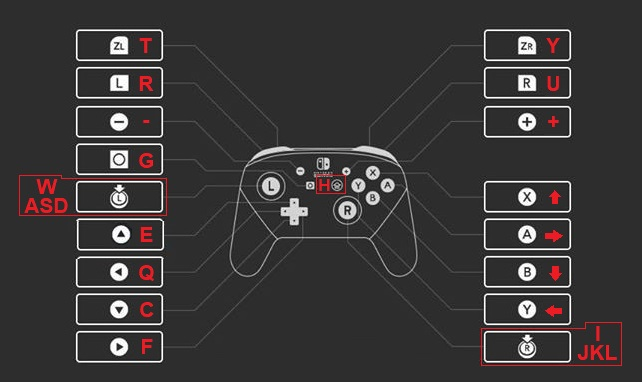

マクロを記録するには、次のコマンドを使う。

```
cmd>>  recording
```

記録の名前を入力するよう促されるので、後で再生できるようにしておく。
Enterを押すと、Joycontrolはキーボード操作でSwitchを操作している間の入力を記録し始める（キーバインドは「keyboard」コマンドと同じである）。
記録を止めるには、もう一度`<enter>`を押す。
記録中は、Top pHATのRGB LEDが赤く点灯する。

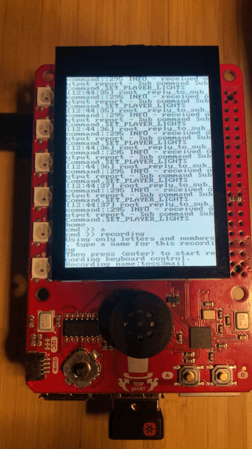

記録したマクロを再生するには、次のコマンドを使う。

```
cmd>> playback
```

playbackコマンドを送信すると、再生したいマクロの名前を入力するよう促される。
保存されているマクロがあれば、一覧表示される。
記録したマクロを再生している間は、HATのLEDが緑色になるはずである。

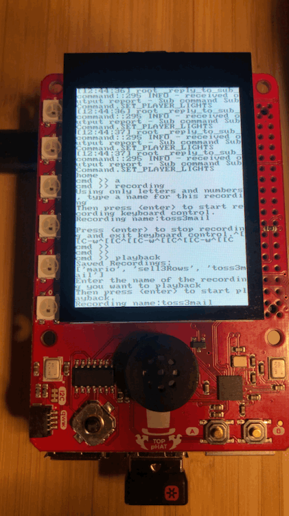

あらかじめ「mario」という名前のマクロが1つ用意されているはずである。
このマクロは、オリジナルのスーパーマリオブラザーズのワールド1-1をクリアする。
SwitchにNESのバーチャルコンソールをインストールしている場合は、NESを開いてスーパーマリオブラザーズを選び、「plus」を押してゲームを開始すれば、このマクロを自分で試せる。
ワールド1-1を開始したら、playbackコマンドを使い「mario」を選択する。
マリオがこのゲームの象徴的な最初のステージを進んでいく様子が見られるはずである。
ただし、タイミングはやや難しい。
マクロを開始する前にマリオを動かしてしまうと、再生のタイミングがずれてしまい、マクロが再生を終えるまでマリオが死んだり、隅に引っかかったりしてしまう。

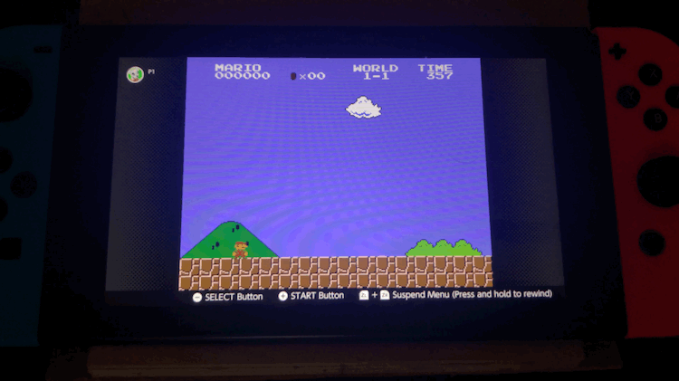

最後に、不要になったマクロは次のコマンドで削除できる。

```
cmd>> delete_rec
```

削除したいマクロの名前を入力するよう促される。
delete_recのプロンプトが開いている間は、HATのLEDが青く点灯するはずである。

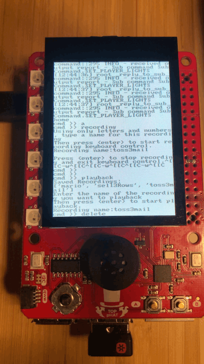

次の節では、Joycontrol-msのさまざまな機能を使って「あつまれ どうぶつの森」を「プレイ」する方法をさらに探っていく。

## Joycontrolとどうぶつの森


*あのArduinoを見てほしい！*

Amiiboを「なりすます」方法を探しているうちにJoycontrolを見つけたのだが（その詳細はここには書かないが、他の場所にはたくさん情報がある）、このゲームの面倒な部分の一部を「自動化」できる可能性にすぐ気づいた。

ACNH（あつまれ どうぶつの森）の島を自動化する目的**以外**でこのチュートリアルを読んでいる人のために、少し説明を補っておこう。
馴染みがない場合のために説明すると、どうぶつの森はNintendoによるゲームシリーズであり、擬人化した動物の友人（プレイの仕方によっては敵にもなる）たちと暮らす仮想の村人として、仮想の生活を送るゲームである。
プレイヤーは、虫や魚を捕まえて売るといったさまざまな作業でベル（お金）を稼ぐ。
このゲーム内のさまざまなキャラクターとやり取りするインターフェースは延々と続くテキストメニューであり、プレイし続けるほどうんざりするくらい繰り返しになることが多い。
あまりに繰り返しが多いため、単なる焦れったさやボタン連打で意図しない選択をしてしまうこともよくある。

このゲームは間違いなく心から楽しんでいる。

よくやることの一つに、ポケットをいっぱいにしてから、道具以外の中身をすべてタヌキ商店のたぬきちの息子たち（まめきちとつぶきち）に売る、という作業がある。
これはマクロにうってつけの候補である。
このマクロを記録するには、まずポケットをいっぱいにし（記録中はプレースホルダーとして薪の束を分割して使うので、中身は何でもよい）、まめきちとつぶきちのところへ話しかけに行く。
また、インベントリ内で手袋のカーソルがどこにあるかにも注意しておくこと。これは後で重要になる。
筆者は左上に置くようにしている。


メニューを開いたら、Pi上で記録を開始する。

```
cmd>> recording
```

マクロの名前を入力した後、Pi上のキーボードを慎重に使い、再生してほしいとおりに正確に販売の手順を進める。
このマクロでは、ポケットの下3段にあるアイテムをすべて選択して売るように記録した。


記録が終わったらEnterを押す。
マクロを再生するには、playbackコマンドを使い、選んだ名前を入力する。
再生を始める前に、ポケットがいっぱいであること、手袋のカーソルがマクロを記録し始めたときと同じ位置にあること、まめきちとつぶきちの最初のメニューを開いていることを必ず確認しておくこと。

```
cmd>> playback
（マクロの名前を入力する）
```

マクロを記録したときとすべての条件が同じであれば、これでこの種の繰り返し作業を「飛ばす」ために再利用できるようになるはずである。
マクロ記録をどう使うかはゲーム内での必要や習慣によって変わるが、筆者が使ってきた例をいくつか挙げておく。

- 博物館へのアイテムの寄贈
- フータによる化石の鑑定
- DIYレシピの連続作成
- 花への水やり
- ポケットから収納へのアイテムの一括移動

このゲームには非常に幅広い活動があるため、まだ思いついていない使い道もきっとあるはずである。
このチュートリアルは、Joycontrol-msを他のゲームで使う方法についてはほんの触りにすぎない。
ただし、ベルを一度に使い果たしてしまわないように気をつけてほしい（あるいは、使い果たしてしまってもよいが……）。

前の節で説明したとおり、不要なマクロは次のコマンドで削除できる。

```
cmd>> delete_rec
（削除したいマクロの名前を入力する）
```

そして、Joycontrolを使い終えたら、exitコマンドで接続を切断する。

```
cmd>> exit
```

## トラブルシューティング

製品が期待どおりに動作しない場合や、技術的なサポートや情報が必要な場合は、[SparkFun Technical Assistance](https://www.sparkfun.com/technical_assistance)のページで初期のトラブルシューティングを確認してほしい。

そこで解決しない場合は、[SparkFunフォーラム](https://forum.sparkfun.com/index.php)がヘルプを探したり質問したりするのに適した場所である。
初めて訪れる場合は、製品フォーラムを検索したり質問を投稿したりするために[フォーラムアカウントの作成](https://forum.sparkfun.com/ucp.php?mode=register)が必要になる。

## まとめ・参考資料

- [JoyControl-MS GitHubリポジトリ](https://github.com/marcus-stevenson/joycontrol-ms)

SparkFunには、Raspberry Pi関連のプロジェクトやチュートリアルが幅広く揃っている。
以下のリンクもぜひ確認してほしい。

- [Raspberry Pi Foundation](https://www.raspberrypi.org/)
  - [Getting Started with the Raspberry Pi](https://projects.raspberrypi.org/en/projects/raspberry-pi-getting-started)
  - [Product Brief（PDF）](https://cdn.sparkfun.com/assets/d/a/c/4/8/Raspberry-Pi-4-Product-Brief.pdf)
  - [回路図（PDF）](https://cdn.sparkfun.com/assets/4/5/3/3/6/rpi_SCH_4b_4p0_reduced.pdf)
  - [機構図（PDF）](https://cdn.sparkfun.com/assets/5/9/7/8/a/rpi_MECH_4b_4p0.pdf)
  - [ドキュメント](https://www.raspberrypi.org/documentation/)
  - [プロジェクト集](https://projects.raspberrypi.org/en/projects)
  - [Pi Foundationフォーラム](https://www.raspberrypi.org/forums/)
  - [Raspberry Pi Forums: Is Your Pi Not Booting?](https://www.raspberrypi.org/forums/viewtopic.php?t=58151) — Raspberry Piが起動しない場合の基本的なトラブルシューティングのヒントと解決策
  - [Raspberry PiのGPIO](./raspberry-gpio.md)
  - [Raspberry PiのSPIとI2C](./raspberry-pi-spi-and-i2c-tutorial.md)

他にも、次のようなRaspberry Pi関連のチュートリアルがある。

- [Raspberry PiのSPIとI2C](./raspberry-pi-spi-and-i2c-tutorial.md) — C/C++用のwiringPi I/OライブラリとPython用のspidev/smbusを使い、Raspberry PiのシリアルI2CバスとSPIバスを利用する方法
- [MQTT入門](./introduction-to-mqtt.md) — IoT（モノのインターネット）で使われる主要な通信プロトコルの一つ、MQTTの入門
- [Computer Vision and Projection Mapping in Python](https://learn.sparkfun.com/tutorials/computer-vision-and-projection-mapping-in-python) — コンピュータビジョンを使って顔を検出し、その上に画像を投影する
- [Qwiic pHAT Extension for Raspberry Pi 400 Hookup Guide](https://learn.sparkfun.com/tutorials/qwiic-phat-extension-for-raspberry-pi-400-hookup-guide) — Raspberry Pi 400のGPIOにすばやく簡単にアクセスし、お気に入りのHATを正しい向きで重ねたり、Qwiic対応デバイスをI2Cバス（GND、3.3V、SDA、SCL）に接続したりする方法

タグ: Bluetooth、Bluetooth 4.0、ゲーム、ゲーミング、LED、プログラミング、プロジェクト、Raspberry Pi、シングルボードコンピュータ、WiFi

---

出典：[Nintendo Switch Macro Recording on the Raspberry Pi](https://learn.sparkfun.com/tutorials/nintendo-switch-macro-recording-on-the-raspberry-pi)（SparkFun Learn）を日本語に翻訳し、再構成した。
原文は [CC BY-SA 4.0](https://creativecommons.org/licenses/by-sa/4.0/) ライセンスで公開されており、本ページも同ライセンスの下で提供する。
