# 折り紙で作るペーパー回路

ペーパー回路は実に楽しい。教えやすく、しかも作り方のバリエーションが実に豊富である。
このチュートリアルでは、折り紙にペーパー回路を組み込む方法を紹介する。

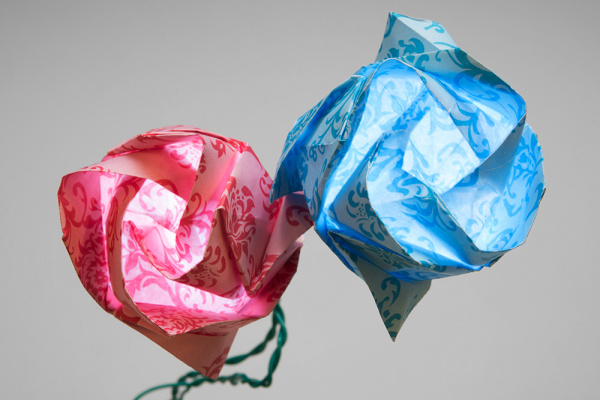

## 必要な部品

このチュートリアルでは折り紙用の紙を使う。
普通の紙でも構わないが、何度か折り曲げても破れない程度の丈夫さと、光が透けて見える程度の薄さを兼ね備えたものを選ぶこと。

電子部品には、[銅テープ](https://www.sparkfun.com/products/10561)と[LEDステッカー](https://www.sparkfun.com/products/13291)を選んだが、通常のLED、[LilyPad LED](https://www.sparkfun.com/products/10754)、その他のLEDと接着剤・抵抗の組み合わせでも問題なく作れる。

接続には、銅テープの代わりに[Bare Conductive塗料](https://www.sparkfun.com/products/11521)、[Circuit Scribeペン](https://www.sparkfun.com/products/13254)、通常のワイヤーも使える。
銅テープとLEDステッカーを選んだのは、あらかじめ粘着性があり、紙との相性がよく、手元の折り紙用紙にもよく貼り付き、必要であれば銅テープにはんだ付けしてより確実な接続を作れるからである。
部品を選ぶ際は、すべてが問題なく組み合わせられるかどうかを必ず確認すること。
たとえばBare Conductive塗料とCircuit Scribeペンのインクは、光沢のある折り紙用紙の上では**うまく機能しない**。これらを使いたい場合は、別の種類の紙を検討する必要がある。

今回、折り紙の花に使った材料は次のとおりである。

なお、折り紙用の紙（あるいは他の種類の紙）も別途必要になる。
また、電源の選択肢として電池とACアダプタの2つが挙げられているが、プロジェクトの電源にはどちらか一方だけで足りる。

### 道具

今回使った道具は次のとおりである。

- [はんだごて](https://www.sparkfun.com/products/9507)（任意）
- [はんだ](https://www.sparkfun.com/products/9161)（任意）
- 瞬間接着剤（選ぶ花のデザインによっては必要になる）
- 透明テープ（選ぶ花のデザインによっては必要になる。またははんだ付けをしたくない場合）

## 参考になるチュートリアル

ペーパーエレクトロニクスを扱うのが初めてだったり、それぞれの選択肢とその長所・短所についてもっと詳しく知りたい場合は、[ペーパー回路総合ガイド](./the-great-big-guide-to-paper-circuits.md)を参照してほしい。

他にも参考になりそうなチュートリアルを挙げておく。

- [回路とは何か](./what-is-a-circuit.md)
- [電圧、電流、抵抗とオームの法則](./voltage-current-resistance-and-ohms-law.md)
- [Let It Glow Holiday Cards](https://learn.sparkfun.com/tutorials/let-it-glow-holiday-cards)

## 花のデザインを選ぶ

折り紙の花にはさまざまなデザインがある。
選ぶ際に考慮すべき点がいくつかあるので、以下で順に説明する。

### LEDを見せたいかどうか

次のように開いた形の花では、

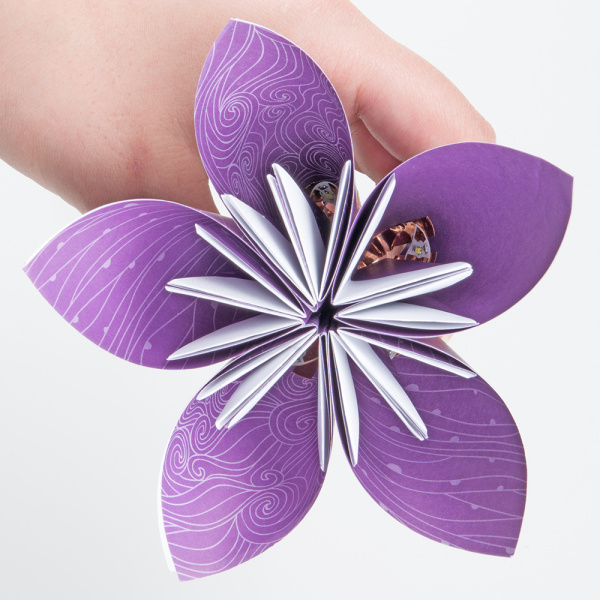

*折り紙のくす玉フラワー*

内側のLEDが見える。ほとんどの人にとってこれは問題にならない。
ただし、LEDを見せたくない場合は、開かない構造で、LEDを裏側に隠せる層が少なくとも一つあるデザインを探すとよい。

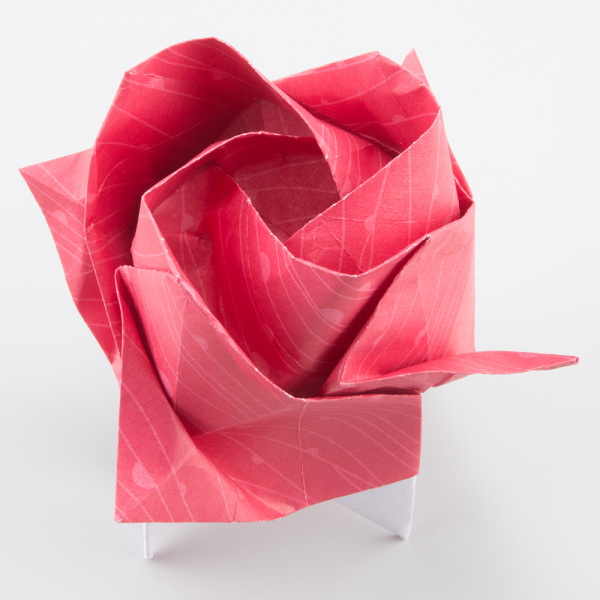

*折り紙の川崎ローズ*

### LEDの置き場所

花のデザインを検討する際は、中央付近にLEDを置ける面があるかどうかも考える必要がある。
ここが面白いところで、多少の創意工夫が必要になることもある。
筆者は、花を閉じて完成させる前にできるだけ組み立てを進め、仕上げる直前にLEDを差し込むようにしている。
LEDを置くのにちょうどよい場所がない場合もある。
その場合は少し「ずる」をして、LEDをつないだ紙片を中央に差し込み、テープで固定するという手もある。
この方法は、次の蓮の花でうまくいった。

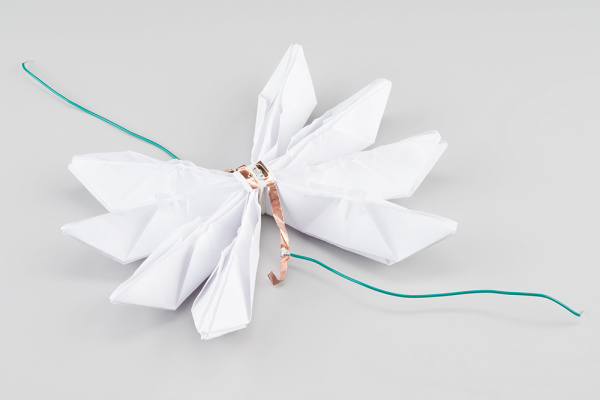

*折り紙の蓮の花、最後の折りをする前の内側*

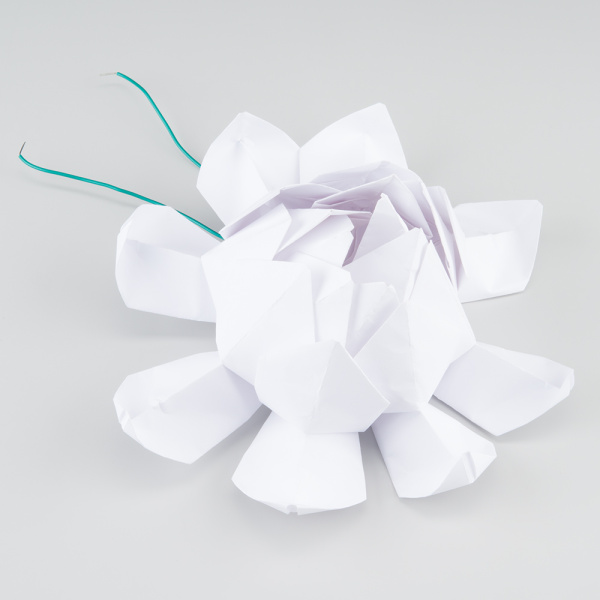

*完成した折り紙の蓮の花*

気に入った花を見つけたら、自由に工夫を凝らして折ってみてほしい。

今回筆者が実際に作った花と、その折り方は次のとおりである。

- 5枚花びらのくす玉フラワーの折り方は、[Origami Instructions](https://www.youtube.com/channel/UCfXxcMTyvQtv-uu9aO6bTrw)による[こちらの動画](https://youtu.be/6elb2EO_ZO0)が詳しい。
- 蓮の花の折り方は、[ProudPaperOfficial](https://www.youtube.com/channel/UCNvT4F1eFg2mRI5VFL5y7jA)による[こちらの動画](https://youtu.be/xfBD8djzDlo)がすばらしい。
- 折り紙のバラの折り方は、Carolzjh1氏のチャンネルによる[こちらの動画](https://www.youtube.com/watch?v=ID05ar4xaJA)を参照してほしい。この種の折り紙バラには数多くのバリエーションがあるので、自分にとって一番きれいに見える、あるいは一番作りやすいと感じるものを探してみるとよい。

難易度を易しい順に並べると、5枚花びらのくす玉フラワーが最も簡単で、正方形の紙5枚をそれぞれ閉じて糊付けし、さらに互いに貼り合わせて作る。
中程度の難易度は蓮の花で、正方形の紙6枚を半分に切った12枚を輪ゴムでまとめてから最後の折りを行う。
最も難しいのはバラ（正確には川崎ローズ）である。
正方形の紙1枚だけを使い、すべての折り目をあらかじめ付けてから押しつぶすようにして形を作る。
バラの制作にはテープも糊も輪ゴムも使わないため、このデザインを選ぶ場合は、動画を何度か見返し、いくつか失敗を重ねながらコツをつかむ心構えをしておくとよい。

## LEDを追加する

[導電性テープ](https://www.sparkfun.com/products/10561)は、ペーパー回路の制作を始める上で最も手軽な方法の一つである。
台紙をはがして、回路を通したい場所に貼り付けるだけでよい。
銅テープははんだ付けにも対応しており、塗料やインクの手法では得られない、部品とトレースの間の強固な接続を作ることができる（この点についても、ペーパー回路総合ガイドでさらに詳しく選択肢を確認しておくと、プロジェクトに合った部品選びの助けになる）。

筆者が使ったのと同じ花・部品で作りたい場合に向けて、先に挙げた3種類の花それぞれで、LEDステッカーと銅テープをどう組み込んだかを説明する。

5枚花びらの花では、まず花びらの下側の角を切り落とし、ワイヤーがLEDまで通る道を作った。
続いて、折り作業をすべて終えた後、糊を使う前にLEDを差し込んだ。

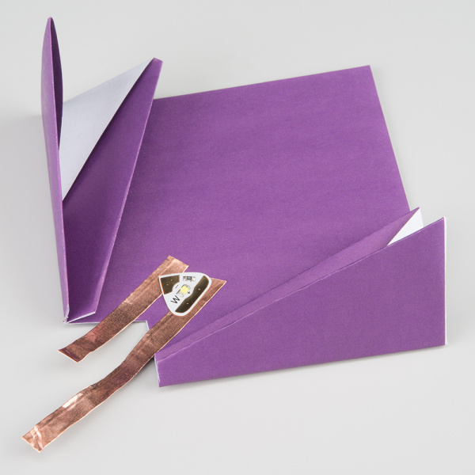

*糊付け前のくす玉フラワーの花びらの内側*

蓮の花では、折り終えたすべてのパーツを輪ゴムでつなげてから、LEDを付けた紙を花びらの内側に差し込み、その後で花びらを折り上げた。

*輪ゴムでつないだ別の紙にLEDステッカーを付けた、折り紙の蓮の花の内側*

バラでは、すべて折り終えた後、最後の一手順だけをほどき、4つの突起のうちの一つにLEDを配置した。

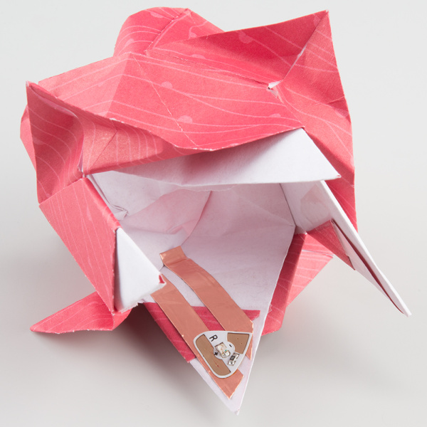

*最後の折りをする前の折り紙バラの内側*

## 仕上げ

最後のステップでは、銅テープにワイヤーをはんだ付けする。

> **警告：** はんだごての温度をかなり低めに設定するとよい。そうしないと、銅テープ裏側の粘着剤が焼け落ちてしまうことがある。はんだごてが手元にない場合は、セロハンテープなど透明なテープでワイヤーをテープに接続してもよい。ただし、この接続方法は不安定で、電気の通りが悪くなることがある点に注意してほしい。

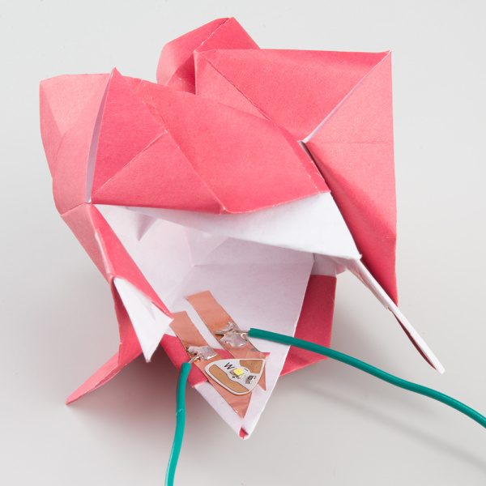

*銅テープに直接ワイヤーをはんだ付けする*

上の写真のように5Vとグラウンドの両方に同じ色のワイヤーを使う場合は、花を閉じた後でも見分けられるよう、どちらか一方に印を付けておくこと。

5Vとグラウンドの銅線が、どの箇所でも決して触れ合わないようにすること。
銅線は表面が導電性であるため、どこか一箇所でも接触すると回路がショートし、たいていLEDが焼けてしまう。

接続を再確認し、ショートがないことを確認したら、ワイヤーをグラウンドと5Vに接続する。
筆者はワイヤーをよじって花の茎に見立てたが、[折り紙フラワーのアートインスタレーション](https://www.youtube.com/watch?v=G1d_ORiq41U)のように、磁石と金属シートを使ってさらに大掛かりな作品に発展させることもできる。

今回使ったLEDには色付きのものと白色のものがあった。
色付きの紙を使う場合はどちらの色が好みか両方試してみるとよいし、白い紙の中に意外な色が隠れているという楽しみ方も面白い。

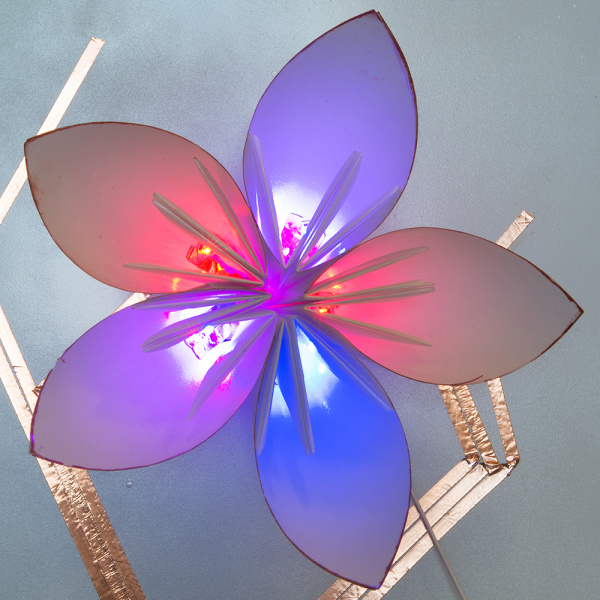

これで完成である。かわいらしく光る花のできあがりだ。

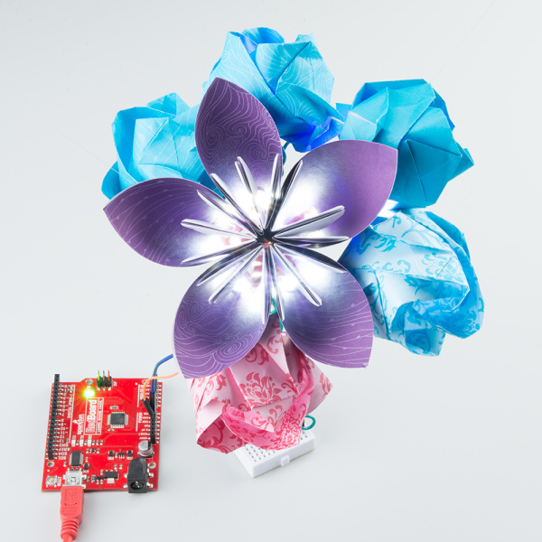

*明るい場所でも楽しい花束……*

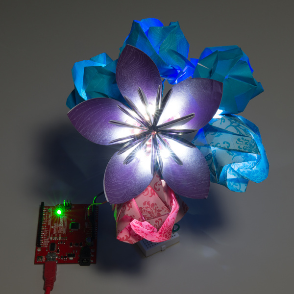

*……そして暗闇の中でも。*

## まとめ・参考資料

紙に電子部品を組み込むコツがつかめたところで、折り紙のアートインスタレーションにも挑戦してみてほしい。

電子工作をもっと多くのプロジェクトに取り入れたい場合は、他のクラフト系チュートリアルも参考にしてほしい。

- [ELasto-Nightlight](https://learn.sparkfun.com/tutorials/elasto-nightlight) — ELastoLiteのナイトライトで、もう暗闇を恐れる必要はない
- [Twinkling Trick or Treat Bag](https://learn.sparkfun.com/tutorials/twinkling-trick-or-treat-bag) — 導電性の糸、LED、LilyTwinkleを使って光るお菓子袋を作る
- [サウンドページの作り方](./sound-page-guide.md) — LilyPad MP3プレーヤーとBare Conductive塗料を使い、シルエットに触れると音が鳴るファンダム風のページを作る方法

タグ: E-Craft、LED、光、ペーパー回路、プロジェクト

---

出典：[Origami Paper Circuits](https://learn.sparkfun.com/tutorials/origami-paper-circuits)（SparkFun Learn）を日本語に翻訳し、再構成した。
原文は [CC BY-SA 4.0](https://creativecommons.org/licenses/by-sa/4.0/) ライセンスで公開されており、本ページも同ライセンスの下で提供する。
