# PCB基板の基礎

電子工学における重要な概念のひとつが、プリント基板（PCB）である。
あまりにも基本的な存在であるため、PCBとは*そもそも何なのか*を説明することを忘れられがちである。
このチュートリアルでは、PCBがどのように構成されているか、そしてPCBの世界でよく使われる用語のいくつかを解説する。

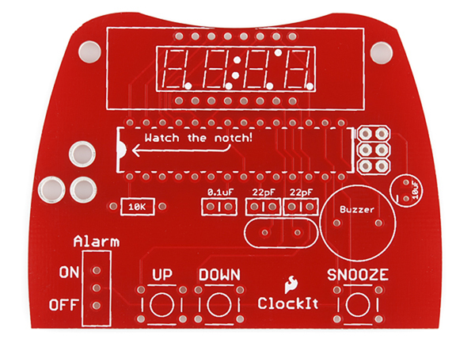

これから、プリント基板の構成、用語、組み立て方法、そして新しいPCBを設計する際の設計プロセスについて簡単に紹介していく。

参考になるチュートリアル:

始める前に、このチュートリアルが前提としているいくつかの概念について読んでおくとよい。

- [電気とは何か](./what-is-electricity.md)
- [回路とは何か](./what-is-a-circuit.md)
- [電圧、電流、抵抗とオームの法則](./voltage-current-resistance-and-ohms-law.md)
- [コネクタの基礎](./connector-basics.md)
- [はんだ付けの基本（スルーホール編）](./how-to-solder-through-hole-soldering.md)

## PCBとは何か

プリント基板（printed circuit board）というのがもっとも一般的な呼び方だが、「プリント配線板」や「プリント配線カード」と呼ばれることもある。
PCBが登場する以前、回路は配線を1本ずつ手作業でつなぐ、非常に手間のかかるポイントツーポイント配線という方法で作られていた。
このため、配線の接合部でよく故障が起きたり、被覆が経年劣化してひび割れると短絡（ショート）が起きたりしていた。

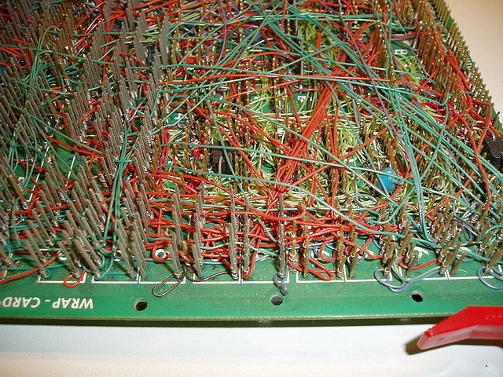

大きな進歩となったのが[ワイヤーラッピング](https://ja.wikipedia.org/wiki/ワイヤラッピング)の登場である。
これは、細い配線を各接続点のピンに文字どおり巻きつける方法で、気密性が高く、非常に丈夫でありながら簡単に配線をやり直せる接続を作り出せた。

電子機器が真空管やリレーからシリコンや集積回路へと移り変わるにつれて、電子部品の大きさとコストは低下し始めた。
電子機器が消費者向け製品に広く使われるようになると、電子製品の小型化と製造コスト削減への圧力から、メーカーはより優れた解決策を模索するようになった。
こうして生まれたのがPCBである。

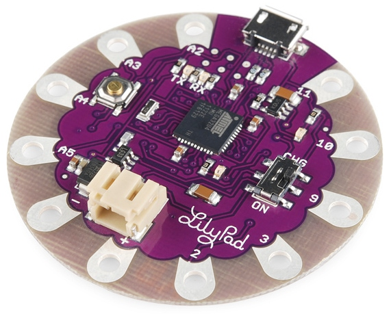

PCBとは*printed circuit board*（プリント基板）の略である。
これは、さまざまな地点どうしをつなぐ配線パターンとパッドを備えた基板である。
上の写真では、配線パターン（トレース）がさまざまなコネクタや部品を電気的に接続している。
PCBを使うことで、物理的な部品間で信号や電力をやり取りできる。
はんだは、PCBの表面と電子部品の間に電気的な接続を作る金属である。
金属であるはんだは、強力な機械的接着剤としての役割も果たす。

## 構成

PCBは、いわば層状のケーキやラザニアのようなもので、異なる材料の層が熱と接着剤によって積層され、ひとつの物体としてまとめられている。

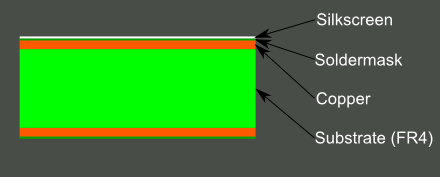

中心から外側に向かって順番に見ていこう。

### FR4

基材、つまり土台となる素材には、たいていガラス繊維が使われる。
このガラス繊維の呼び名として歴史的にもっとも一般的なのが「FR4」である。
この固い芯材が、PCBに剛性と厚みを与えている。
Kapton（あるいは同等品）のような柔軟な耐熱プラスチックの上に作られた、柔軟なPCBもある。

PCBの厚さにはさまざまな種類があり、SparkFun製品でもっとも一般的な厚さは1.6mm（0.063インチ）である。
一部の製品（LilyPad基板やArduino Pro Micro基板など）では、0.8mm厚の基板が使われている。

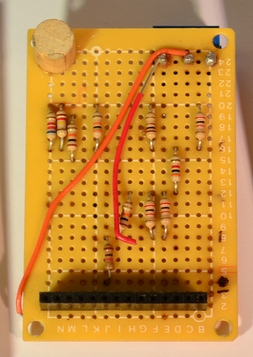

より安価なPCBやパーフボード（穴あき基板）には、エポキシ樹脂やフェノール樹脂のような、FR4ほどの耐久性はないがずっと安価な素材が使われることがある。
このタイプの基板にはんだ付けをすると、非常に特徴的な嫌な臭いがするため、すぐに見分けがつく。
このような基材は、低価格帯の家電製品でもよく見られる。
フェノール樹脂は熱分解温度が低いため、はんだごてを基板に長く当てすぎると、層が剥離したり、煙が出たり、焦げたりすることがある。

### 銅

次の層は薄い銅箔であり、熱と接着剤によって基材に積層される。
一般的な両面PCBでは、基材の両面に銅が貼られる。
より低コストな電子機器では、片面にしか銅が貼られていないPCBが使われることもある。
**両面基板**や**2層基板**と呼ぶとき、それはこのラザニアの中にある銅の層の数（2層）を指している。
これは1層だけのこともあれば、16層以上に及ぶこともある。

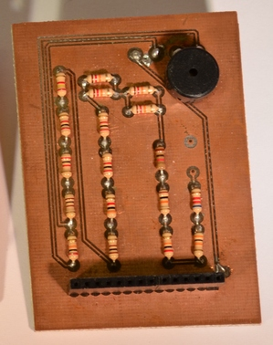

銅の厚さはさまざまだが、1平方フィートあたりのオンス数で規定される。
たいていのPCBは1平方フィートあたり1オンスの銅を使っているが、非常に大きな電力を扱うPCBでは2オンスや3オンスの銅が使われることもある。
1平方フィートあたり1オンスは、およそ35マイクロメートル（0.0014インチ）の銅の厚さに相当する。

### ソルダーマスク

銅箔の上に重ねられる層は、ソルダーマスク層と呼ばれる。
この層が、PCBに緑色（あるいはSparkFunの場合は赤色）を与えている。
これは銅の層の上に重ねられ、銅の配線パターンが他の金属やはんだ、導電性のものにうっかり触れてしまわないよう絶縁する役割を持つ。
この層のおかげで、使う人は正しい場所にはんだ付けしやすくなり、意図しないはんだブリッジを防げる。

下の例では、緑色のソルダーマスクがPCBの大部分に施され、細い配線パターンを覆い隠しつつ、はんだ付けできるように銀色のリングやSMDパッドの部分だけを露出させている。

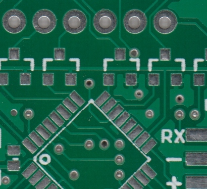

ソルダーマスクにもっともよく使われる色は緑だが、ほぼどんな色でも可能である。
SparkFunではほぼすべての基板に赤を、IOIO基板には白を、LilyPad基板には紫を使っている。

### シルクスクリーン

白いシルクスクリーン層は、ソルダーマスク層の上にさらに重ねられる。
シルクスクリーンは、PCBに文字、数字、記号を印刷し、組み立てをしやすくしたり、人間が基板を理解しやすくしたりする役割を持つ。
それぞれのピンやLEDの機能を示すために、シルクスクリーンのラベルがよく使われる。

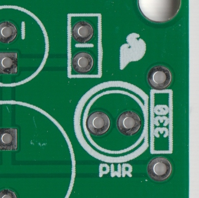

シルクスクリーンにもっともよく使われる色は白だが、どんなインクの色でも使うことができる。
黒、灰色、赤、さらには黄色のシルクスクリーンも広く使われているが、1枚の基板の上に複数の色を使うのはあまり一般的ではない。

## 用語集

PCBの構造についてのイメージがつかめたところで、PCBを扱う際によく耳にする用語をいくつか定義しておこう。

- **アニュラーリング**：PCB上のめっきされたスルーホールの周りにある銅のリング。

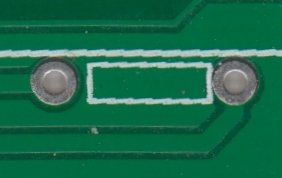

- **DRC**：デザインルールチェック。誤って接触している配線パターン、細すぎる配線パターン、小さすぎる穴など、設計上のエラーがないかを確認するソフトウェアによる検査。
- **ドリルヒット**：設計上で穴をあけるべき場所、あるいは実際に基板上に穴があけられた場所のこと。切れ味の悪いドリルビットによる不正確なドリルヒットは、製造上よくある問題である。

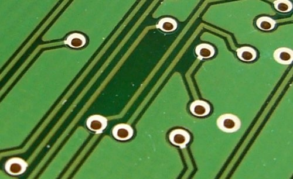

- **フィンガー**：基板の端に沿って露出した金属パッドで、2枚の基板の間を接続するために使われる。よくある例として、コンピュータの拡張基板やメモリ基板、古いカートリッジ式ビデオゲームの端の部分がある。
- **マウスバイト**：パネルから基板を切り離すための、Vスコアに代わる手法。多数のドリルヒットを近くに密集させることで、あとから簡単に折り取れる弱い部分を作り出す。SparkFunのProtoSnap基板がよい例である。

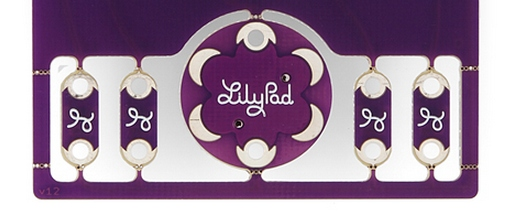

- **パッド**：部品をはんだ付けするための、基板表面に露出した金属部分。

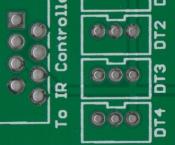

- **パネル**：使用前に切り離す、多数の小さな基板をまとめたより大きな基板。自動化された基板取り扱い装置は小さな基板をうまく扱えないことが多いため、複数の基板を一度にまとめることで工程を大幅に速められる。
- **ペーストステンシル**：基板の上に重ねる薄い金属（あるいはプラスチック）製のステンシルで、組み立ての際に特定の場所にはんだペーストを塗布できるようにする。
- **ピックアンドプレース**：基板に部品を配置するための機械、あるいはその工程のこと。
- **プレーン**：経路ではなく境界線によって定義される、基板上の連続した銅の塊。「ポア（pour）」とも呼ばれる。

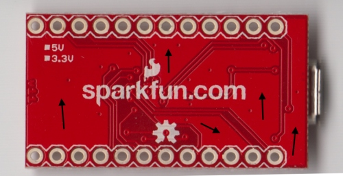

- **めっきスルーホール**：アニュラーリングを持ち、基板を貫通してめっきされた穴。スルーホール部品の接続点、信号を通すためのビア、あるいは取り付け穴として使われる。

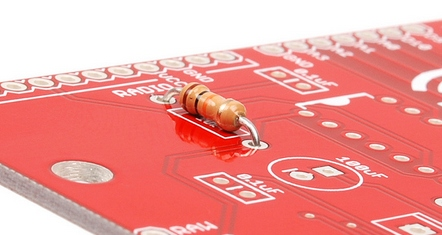

- **ポゴピン**：テストやプログラム書き込みのために一時的な接続を作る、バネ仕掛けの接点。

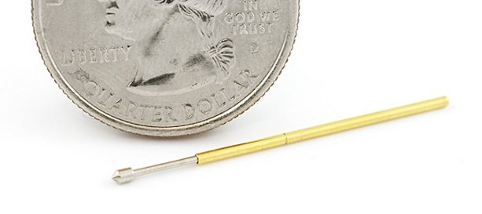

- **リフロー**：パッドと部品のリード線の間にはんだ接合を作るために、はんだを溶かすこと。
- **シルクスクリーン**：基板上の文字、数字、記号、図柄のこと。たいてい1色しか使えず、解像度も比較的低い。
- **スロット**：基板上にある、丸くない穴のこと。めっきされている場合もされていない場合もある。切り抜きに余分な時間がかかるため、基板のコストを押し上げる要因になることがある。

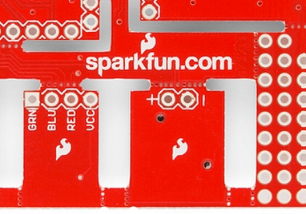

- **はんだペースト**：ジェル状の媒体の中に小さなはんだの粒を分散させたもので、部品を配置する前に、ペーストステンシルを使ってPCBの表面実装用パッドに塗布する。リフローの過程で、ペースト内のはんだが溶け、パッドと部品の間に電気的にも機械的にも接合を作り出す。

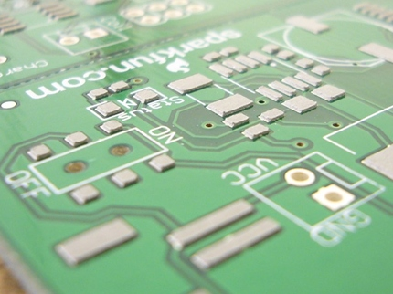

- **はんだポット**：スルーホール部品を使った基板を素早く手作業ではんだ付けするための容器。少量の溶けたはんだが入っており、そこに基板を素早く浸すことで、露出したすべてのパッドにはんだ接合を作る。
- **ソルダーマスク**：短絡、腐食、その他の問題を防ぐために金属の上に敷かれる保護材料の層。たいてい緑色だが、他の色（SparkFunの赤、Arduinoの青、Appleの黒など）も可能である。「レジスト」と呼ばれることもある。

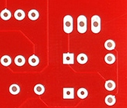

- **はんだブリッジ**：基板上の部品の隣接する2本のピンをつなぐ、小さなはんだの塊。設計によっては、2つのパッドやピンをあえて接続するために使われることもあるが、意図しない短絡の原因になることもある。
- **表面実装**：部品のリード線を基板の穴に通す必要がなく、基板の上にそのまま置くだけで済む実装方式。現在もっとも主流の組み立て方法であり、基板への部品実装を素早く簡単に行える。
- **サーマル**：パッドをプレーンに接続するための小さな配線パターン。パッドが適切にサーマルリリーフされていないと、良好なはんだ接合を作るのに十分な温度までパッドを上げるのが難しくなる。適切にサーマルリリーフされていないパッドは、はんだ付けしようとすると「ねばつく」ように感じられ、リフローに異常に長い時間がかかる。

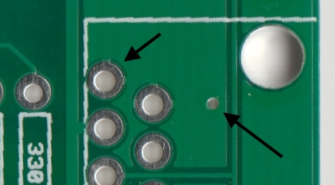

- **銅箔ハッチング（thieving）**：プレーンや配線パターンが存在しない基板上の領域に残される、格子状の網目や点状の銅。エッチング液に浸す時間を短縮でき、不要な銅を取り除く作業が楽になる。
- **トレース（配線パターン）**：基板上の連続した銅の経路。

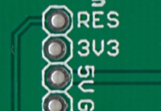

- **Vスコア**：基板に入れる部分的な切り込みで、その線に沿って基板を簡単に折り取れるようにする。
- **ビア**：ある層から別の層へ信号を通すために基板にあけられた穴。*テンテッド*ビアはソルダーマスクで覆われ、はんだ付けされてしまわないよう保護されている。コネクタや部品を取り付けるビアは、簡単にはんだ付けできるよう、たいていテントされていない（覆われていない）。

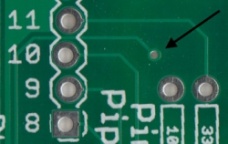

- **波はんだ付け**：スルーホール部品を使った基板に使われるはんだ付け方法で、基板を溶けたはんだの定常波の上に通過させ、露出したパッドや部品のリード線にはんだを付着させる。

## 自分でPCBを設計する

自分でPCBを設計するには、どうすればよいのだろうか。
PCB設計の細部はここで語り尽くせるものではないが、本当に始めてみたいなら、次のようなポイントを押さえておこう。

1. CADソフトを見つける。市場には低価格または無料のPCB設計用ソフトウェアが数多くある。ソフトウェアを選ぶ際に考慮すべき点は次のとおりである。
   - コミュニティの充実度：そのソフトウェアを使っている人は多いか。使っている人が多いほど、必要な部品のライブラリがすでに用意されている可能性が高くなる。
   - 使いやすさ：使うのが苦痛であれば、結局使わなくなってしまう。
   - 機能面での制約：一部のソフトウェアは、レイヤー数、部品数、基板サイズなどに制限を設けている。たいていはライセンス料を払うことで機能を拡張できる。
   - 移植性：無料のソフトウェアの中には、設計データのエクスポートや変換を許可しておらず、特定の1社にしか発注できなくなるものもある。それが利便性や価格に見合った代償かどうかは、場合によるだろう。
2. 他の人の基板レイアウトを見て、どのように設計されているかを参考にする。オープンソースハードウェアのおかげで、これはかつてないほど簡単になっている。
3. とにかく練習を重ねる。
4. 期待しすぎないこと。最初に設計する基板には、たくさんの問題があるはずである。20枚目の基板になれば問題は減るだろうが、それでもいくつかは残る。問題を完全になくすことは決してできない。
5. 回路図は重要である。しっかりした回路図を用意せずに基板を設計しようとするのは、徒労に終わる試みである。

最後に、自分で基板を設計することの有用性について触れておこう。
あるプロジェクトを2枚以上作る予定があるなら、基板を設計する見返りはかなり大きい。
プロトボード上でポイントツーポイント配線をするのは面倒であり、専用に設計された基板に比べて壊れやすい傾向がある。
また、その設計が人気を博せば、それを販売することもできる。

## まとめ

PCBはほんの入り口にすぎない。
ここからさらに、次のようなチュートリアルを探求していくことをおすすめする。

- [はんだ付けの基本（スルーホール編）](./how-to-solder-through-hole-soldering.md)
- [回路図の読み方](./how-to-read-a-schematic.md)
- [PCB設計ツールEagleの使い方](./how-to-install-and-setup-eagle.md)
- [How to layout PTH PCBs: Schematic（スルーホールPCBのレイアウト：回路図編）](https://learn.sparkfun.com/tutorials/using-eagle-schematic)
- [How to layout PTH PCBs: Board Layout（スルーホールPCBのレイアウト：基板レイアウト編）](https://learn.sparkfun.com/tutorials/using-eagle-board-layout)
- [Creating SMD Footprints（SMDフットプリントの作成）](https://learn.sparkfun.com/tutorials/designing-pcbs-smd-footprints)
- [Creating SMD PCBs（SMD PCBの作成）](https://learn.sparkfun.com/tutorials/designing-pcbs-advanced-smd)
- [電子部品の組み立て](./electronics-assembly.md)

自分のPCB作品を世界に発信したいなら、次のようなチュートリアルも確認してみてほしい（いずれも英語）。

- [Using GitHub（GitHubの使い方）](https://learn.sparkfun.com/tutorials/using-github)
- [Using GitHub to share with SparkFun（GitHubを使ってSparkFunと共有する方法）](https://learn.sparkfun.com/tutorials/using-github-to-share-with-sparkfun)

タグ: 概念、電気工学、ProtoSnap

---

出典：[PCB Basics](https://learn.sparkfun.com/tutorials/pcb-basics)（SparkFun Learn）を日本語に翻訳し、再構成した。
原文は [CC BY-SA 4.0](https://creativecommons.org/licenses/by-sa/4.0/) ライセンスで公開されており、本ページも同ライセンスの下で提供する。
