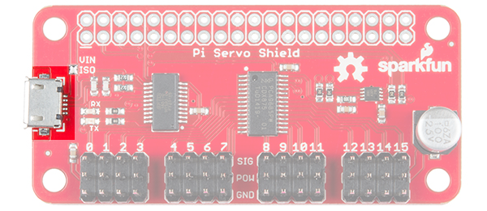
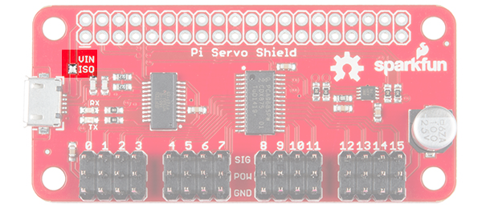
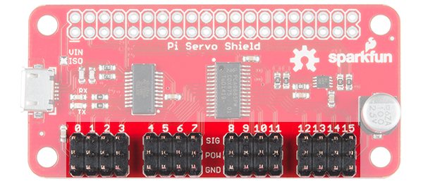
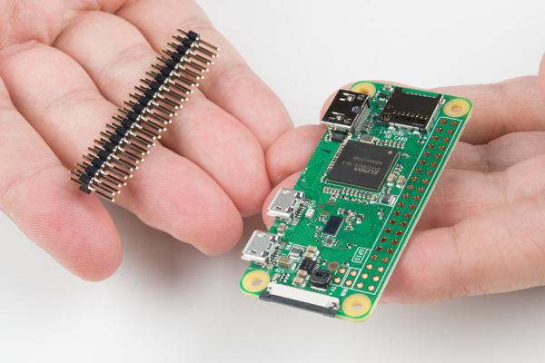
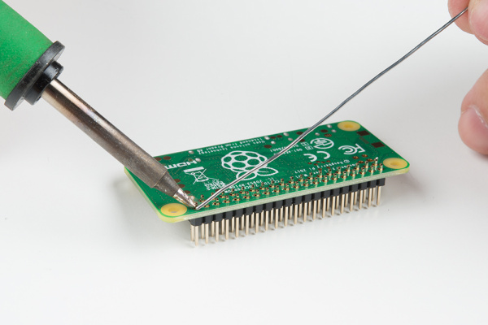
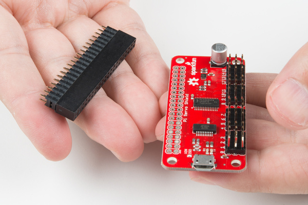
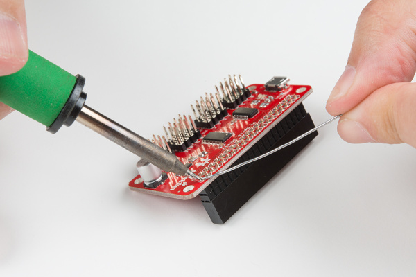

# Pi Servo HATの使い方

[SparkFun Pi Servo HAT](https://www.sparkfun.com/products/14328)を使うと、Raspberry PiはI2C接続を介して最大16台のサーボモーターを制御できるようになる。
これによりGPIOを節約でき、オンボードのGPIOを他の用途に使えるようになる。
さらに、Pi Servo Shieldにはシリアルターミナル接続も追加されており、モニタやキーボードを接続しなくてもRaspberry Piを起動できる。

## 必要な部品

このチュートリアルを進めるには、次のものが必要になる。
NOOBS対応のカードにはPi Zero Wに対応するだけの新しいOSが入っていないことがあるため、NOOBS対応カードではなく、まっさらなmicroSDカードを購入することを推奨する。

- 絶縁GPIOヘッダー（メス、PTH、0.1インチ、2×20ピン）
- ストレートヘッダー（オス、PTH、0.1インチ、40ピン）
- Raspberry Pi Zero W
- ACアダプタ電源（5.1V、2.5A、USB Micro-B）
- microSDカード（アダプタ付き）
- SparkFun Pi Servo HAT

さらに、セットアップをテストするための何らかの[サーボモーター](https://www.sparkfun.com/categories/245)が必要になる。
このチュートリアルの後半で紹介する例は、まず[汎用サブマイクロサーボ](https://www.sparkfun.com/products/9065)で試してみるとよい。

### 必要な道具

この製品の組み立てに特別な道具は必要ない。
はんだごて、はんだ、一般的なはんだ付け用アクセサリーが必要になる。

## 参考になるチュートリアル

このチュートリアルに取り組む前に、次のチュートリアルも確認しておくとよい。

- [はんだ付けの基本（スルーホール編）](./how-to-solder-through-hole-soldering.md)
- [Raspberry PiのSPIとI2C](./raspberry-pi-spi-and-i2c-tutorial.md)
- [サーボモーター入門](./hobby-servo-tutorial.md)
- [Raspberry Pi Zero Wirelessを始める](./getting-started-with-the-raspberry-pi-zero-wireless.md)

## ハードウェア概要

この基板は使いやすさを最優先に設計されたHATであるため、注目すべき部分はごくわずかである。

**USB Micro Bコネクタ** — このコネクタは、サーボモーターだけに給電するためにも、サーボモーターとHATに接続されたPiの両方に給電するためにも使える。
また、Piのセットアップにモニタやキーボードを使わずに済むよう、シリアルポート接続経由でPiに接続するのにも使える。



**電源絶縁ジャンパー** — このジャンパーを（デフォルトでは閉じているが）切断すると、サーボ用の電源レールをPiの5V電源レールから絶縁できる。
なぜそうしたいのかというと、複数のサーボや、重い負荷のかかった大型サーボを使う場合、サーボモーターが電源レールに乗せるノイズによってPiの動作に望ましくない影響が出ることがあり、完全なリセットやシャットダウンに至ることさえあるためである。
なお、このジャンパーの状態にかかわらず、Piに電源が入っている限りシリアルインターフェースは動作し続ける。



**サーボモーター用ピンヘッダー** — これらのヘッダーは、サーボモーターを取り付けやすいよう間隔を空けて配置されている。
ほとんどのホビー用サーボモーターのコネクタに対応する正しい順序でピンが割り当てられている。



## ハードウェアの組み立て

オスヘッダーはPi Zero Wに[はんだ付け](./how-to-solder-through-hole-soldering.md)することを推奨する。



このような作業でよく使う筆者お気に入りのコツは、まず1本のピンをはんだ付けし、右手に持ったこてでそのピンのはんだを溶かしながら、左手でヘッダーが下の写真のように平らに収まるよう調整するというものである。
ヘッダーの短い側ではんだ付けし、長い方のピンが部品側にくるようにすること。
1本のピンを仮止めしたら、残りのピンをすべてPi Zero Wにはんだ付けする。



メスヘッダーとPi Servo Hatについても同じ手順を繰り返す。



短いピンを基板の下側から挿入し、部品側にはんだを盛ることで、Pi Servo HatをPi Zero Wのオスヘッダーピンの上に積み重ねられるようにすること。
すべてのピンをはんだ付けする前に、ヘッダーが水平になっていることも確認する必要がある。



ヘッダーのはんだ付けが終わったら、Pi Servo HatをPi Zero Wに重ねる。
続いて、使用するサーボに応じて、チャンネル「0」にホビーサーボを接続する。
ホビーサーボのデータシートを確認するか、このチュートリアルに掲載されている[標準的なサーボコネクタのピン配置](./hobby-servo-tutorial.md)を参考にしてほしい。
十分な容量の5V ACアダプタを使い、Pi Zero Wに給電できる。
ACアダプタをコンセントに差し込み、Pi Zero Wの「PWR IN」とラベル付けされたmicro-Bコネクタに接続する。

## ソフトウェア - Python

ここでは、PythonでPi Servo Hatにアクセスし、使う方法を詳しく説明する。
完全なサンプルコードは、[製品のGitHubリポジトリ](https://github.com/sparkfun/Pi_Servo_Hat/tree/v10)で公開されている。

> **注意：** このチュートリアルは、サーボモーターを**200Hz**のPWMで制御する前提で書かれている。「大きな」ブザー音が聞こえる場合や、サーボモーターの制御がうまくいかない場合は、周波数を下げるとよいかもしれない。**50Hz**用のサンプル一式を確認してみてほしい。
>
> - [servohat_50Hz.py](https://github.com/sparkfun/Pi_Servo_Hat/tree/v10/Examples/servohat_50Hz.py)
> - [servohat_50Hz_tuned.py](https://github.com/sparkfun/Pi_Servo_Hat/tree/v10/Examples/servohat_50Hz_tuned.py)

### SMBusリソースへのアクセスを準備する

まず一つ目のポイントとして、OSレベルのやり取りのほとんどでは、I2CバスはSMBusと呼ばれる。
というわけで、最初のコードは次のようになる。
これはsmbusモジュールをインポートし、`SMBus`型のオブジェクトを作成して、Piの各種SMBusのうちバス「1」に接続する。

```python
import smbus
bus = smbus.SMBus(1)
```

プログラムに部品のアドレスを教える必要がある。
デフォルトでは**0x40**なので、後で使うために変数にこの値を設定しておく。

```python
addr = 0x40
```

続いて、PWMチップを有効にし、書き込み後にアドレスを自動的にインクリメントするよう指示する必要がある（これにより、1回の操作で複数バイトの書き込みができるようになる）。

```python
bus.write_byte_data(addr, 0, 0x20)
bus.write_byte_data(addr, 0xfe, 0x1e)
```

### PWMレジスタに値を書き込む

必要な準備はこれですべてである。
ここから先は、PWMチップにデータを書き込めば、それに応じた反応が得られるはずである。次に例を示す。

```python
bus.write_word_data(addr, 0x06, 0)
bus.write_word_data(addr, 0x08, 1250)
```

最初の書き込みは、チャンネル0の「開始時間」レジスタに対するものである。
デフォルトでは、このチップのPWM周波数は**200Hz**、つまり5msごとに1回パルスが発生する。
開始時間レジスタは、5msのサイクルの中でパルスがいつハイになるかを決定する。
すべてのチャンネルはこのサイクルに同期している。
一般に、ここには0を書き込む。

2つ目の書き込みは「停止時間」レジスタに対するもので、パルスがいつローになるかを制御する。
この値の範囲は`0`から`4095`までで、各カウントはその5msの期間の1コマ分（5ms/4095、約1.2µs）を表す。
つまり、上で書き込んだ1250という値は、5msの期間のうちおよそ1.5msがハイであることを表している。

サーボモーターは、このパルス幅から制御信号を受け取る。
一般に、1.5msのパルス幅はモーターの可動範囲の両端のちょうど中間にあたる「中立」位置になる。
1.0msはおよそ中央から-90度、2.0msはおよそ中央から+90度に相当する。
実際にはこれらの値は90度より多少大きかったり小さかったりすることがあり、モーターがどちらの方向にも90度よりわずかに多く、あるいは少なく動作できることもある。

他のチャンネルにアクセスするには、上記の2つのレジスタのアドレスに単純に4ずつ加算していけばよい。
つまり、チャンネル1の開始時間は0x0A、チャンネル2は0x0E、チャンネル3は0x12というように続き、チャンネル1の停止時間のアドレスは0x0C、チャンネル2は0x10、チャンネル3は0x14というように続く。下の表を参照してほしい。

| チャンネル番号 | 開始アドレス | 停止アドレス |
| --- | --- | --- |
| Ch 0 | 0x06 | 0x08 |
| Ch 1 | 0x0A | 0x0C |
| Ch 2 | 0x0E | 0x10 |
| Ch 3 | 0x12 | 0x14 |
| Ch 4 | 0x16 | 0x18 |
| Ch 5 | 0x1A | 0x1C |
| Ch 6 | 0x1E | 0x20 |
| Ch 7 | 0x22 | 0x24 |
| Ch 8 | 0x26 | 0x28 |
| Ch 9 | 0x2A | 0x2C |
| Ch 10 | 0x2E | 0x30 |
| Ch 11 | 0x32 | 0x34 |
| Ch 12 | 0x36 | 0x38 |
| Ch 13 | 0x3A | 0x3C |
| Ch 14 | 0x3E | 0x40 |
| Ch 15 | 0x42 | 0x44 |

開始アドレスに0を書き込んだ場合、90度からの角度のずれ1度ごとに、停止アドレスへの書き込み値が4.6カウント分変化する。
つまり、中立位置からずらしたい角度の数に4.6を掛け、動かしたい方向に応じてその結果を1250に加算または減算すればよい。
たとえば、中央から45度ずらしたい場合、動かしたい方向に応じて1250より207（45×4.6）カウント多いか少ない値になる。

## ソフトウェア - C++

ここでは、C++でPi Servo Hatにアクセスし、使う方法を詳しく説明する。
Pythonよりもかなり難しいので、これを機にPythonを学ぶのもよいかもしれない。
完全なサンプルコードは、[製品のGitHubリポジトリ](https://github.com/sparkfun/Pi_Servo_Hat/tree/v10)で公開されている。

> **注意：** このチュートリアルは、サーボモーターを**200Hz PWM**で制御する前提で書かれている。「大きな」ブザー音が聞こえる場合や、サーボモーターの制御がうまくいかない場合は、周波数を**50Hz**に下げるとよいかもしれない。[50Hz用のPythonサンプル一式](https://github.com/sparkfun/Pi_Servo_Hat/tree/v10/Examples)や、C++のコードを50Hz用に調整する際に必要なI2Cレジスタと設定については[PCA9685のデータシート](http://www.nxp.com/docs/en/data-sheet/PCA9685.pdf)を確認してみてほしい。

### 必要なファイルをインクルードする

まず、インクルードする必要のあるファイルから見ていく。

```cpp
#include <unistd.h> // required for I2C device access
#include <fcntl.h>  // required for I2C device configuration
#include <sys/ioctl.h> // required for I2C device usage
#include <linux/i2c-dev.h> // required for constant definitions
#include <stdio.h>  // required for printf statements
```

### I2Cデバイスファイルを開く

まず、`/dev`内の`i2c-1`ファイルを読み書き用に開く。

```cpp
char *filename = (char*)"/dev/i2c-1"; // Define the filename
int file_i2c = open(filename, O_RDWR); // open file for R/W
```

`open()`関数の戻り値を確認し、ファイルが正常に開けたかどうかを確認するとよい。
ファイルが正常に開けた場合は正の整数が返り、そうでない場合は負の値になる。

```cpp
if (file_i2c < 0)
{
  printf("Failed to open file!");
  return -1;
}
```

### 書き込み用にスレーブアドレスを設定する

Python（やArduino）ではトランザクションごとにスレーブアドレスを設定するのに対し、ここでは「次に変更するまで」有効なアドレスを設定する。
これには`ioctl()`関数を使う。

```cpp
int addr = 0x40;    // PCA9685 address
ioctl(file_i2c, I2C_SLAVE, addr); // Set the I2C address for upcoming
                                  //  transactions
```

`ioctl()`はI2Cに限定されない汎用の関数である。

### PCA9685チップを正しく動作するよう設定する

PCA9685チップのデフォルト設定は、そのままでは今回の用途に適していない。
正しく動作させるには、チップ上のいくつかのレジスタに書き込む必要がある。

まず、チップを有効にしてPWM出力をオンにする必要がある。
これは、レジスタ0に値0x20を書き込むことで行える。

```cpp
buffer[0] = 0;    // target register
buffer[1] = 0x20; // desired value
length = 2;       // number of bytes, including address
write(file_i2c, buffer, length); // initiate write
```

続いて、複数バイト書き込みを有効にする必要がある。後でPWM値を設定する際に、一度に2バイトずつ書き込むことになるためである。
今回は`length`変数はすでに正しく設定されているため、変更する必要はない。

```cpp
buffer[0] = 0xfe;
buffer[1] = 0x1e;
write(file_i2c, buffer, length);
```

### PWMレジスタに値を書き込む

必要な準備はこれですべてである。
ここから先は、PWMチップにデータを書き込めば、それに応じた反応が得られるはずである。次に例を示す。

```cpp
buffer[0] = 0x06;  // "start time" reg for channel 0
buffer[1] = 0;     // We want the pulse to start at time t=0
buffer[2] = 0;
length = 3;        // 3 bytes total written
write(file_i2c, buffer, length); // initiate the write

buffer[0] = 0x08;   // "stop time" reg for channel 0
buffer[1] = 1250 & 0xff; // The "low" byte comes first...
buffer[2] = (1250>>8) & 0xff; // followed by the high byte.
write(file_i2c, buffer, length); // Initiate the write.
```

最初の書き込みは、チャンネル0の「開始時間」レジスタに対するものである。
デフォルトでは、このチップのPWM周波数は**200Hz**、つまり5msごとに1回パルスが発生する。
開始時間レジスタは、5msのサイクルの中でパルスがいつハイになるかを決定する。
すべてのチャンネルはこのサイクルに同期している。
一般に、ここには0を書き込む。

2つ目の書き込みは「停止時間」レジスタに対するもので、パルスがいつローになるかを制御する。
この値の範囲は`0`から`4095`までで、各カウントはその5msの期間の1コマ分（5ms/4095、約1.2µs）を表す。
つまり、上で書き込んだ1250という値は、5msの期間のうちおよそ1.5msがハイであることを表している。

サーボモーターは、このパルス幅から制御信号を受け取る。
一般に、1.5msのパルス幅はモーターの可動範囲の両端のちょうど中間にあたる「中立」位置になる。
1.0msはおよそ中央から-90度、2.0msはおよそ中央から+90度に相当する。
実際にはこれらの値は90度より多少大きかったり小さかったりすることがあり、モーターがどちらの方向にも90度よりわずかに多く、あるいは少なく動作できることもある。

他のチャンネルにアクセスするには、上記の2つのレジスタのアドレスに単純に4ずつ加算していけばよい。
つまり、チャンネル1の開始時間は0x0A、チャンネル2は0x0E、チャンネル3は0x12というように続き、チャンネル1の停止時間のアドレスは0x0C、チャンネル2は0x10、チャンネル3は0x14というように続く。下の表を参照してほしい。

| チャンネル番号 | 開始アドレス | 停止アドレス |
| --- | --- | --- |
| Ch 0 | 0x06 | 0x08 |
| Ch 1 | 0x0A | 0x0C |
| Ch 2 | 0x0E | 0x10 |
| Ch 3 | 0x12 | 0x14 |
| Ch 4 | 0x16 | 0x18 |
| Ch 5 | 0x1A | 0x1C |
| Ch 6 | 0x1E | 0x20 |
| Ch 7 | 0x22 | 0x24 |
| Ch 8 | 0x26 | 0x28 |
| Ch 9 | 0x2A | 0x2C |
| Ch 10 | 0x2E | 0x30 |
| Ch 11 | 0x32 | 0x34 |
| Ch 12 | 0x36 | 0x38 |
| Ch 13 | 0x3A | 0x3C |
| Ch 14 | 0x3E | 0x40 |
| Ch 15 | 0x42 | 0x44 |

開始アドレスに0を書き込んだ場合、90度からの角度のずれ1度ごとに、停止アドレスへの書き込み値が4.6カウント分変化する。
つまり、中立位置からずらしたい角度の数に4.6を掛け、動かしたい方向に応じてその結果を1250に加算または減算すればよい。
たとえば、中央から45度ずらしたい場合、動かしたい方向に応じて1250より207（45×4.6）カウント多いか少ない値になる。

## まとめ・参考資料

SparkFun Pi Servo Hatを無事に動かせたら、次は自分のプロジェクトに組み込む番である。

より詳しい情報は、以下の資料を参照してほしい。

- [SparkFun Pi Servo Hat 回路図（PDF）](https://cdn.sparkfun.com/assets/1/a/1/6/3/PI_Servo_Shield_v10.pdf)
- [SparkFun Pi Servo Hat Eagleファイル（ZIP）](https://cdn.sparkfun.com/assets/5/9/9/4/3/PI_Servo_Shield_v10_1.zip)
- [PCA9685データシート（PDF）](http://www.nxp.com/docs/en/data-sheet/PCA9685.pdf) — PCA9685の詳しい動作原理や、他に利用できる機能を把握するのに役立つ
- [SparkFun Pi Servo HAT GitHubリポジトリ](https://github.com/sparkfun/Pi_Servo_Hat/tree/v10)
- Setting Up the Pi Zero Wireless Pan-Tilt Camera Tutorial — Pi Servo Hatをパン・チルトカメラのセットアップで使うキット

PCA9685を使った他のソフトウェアの例については、同じハードウェアを使いコンセプトも非常によく似ている、SparkFun Blocks for Intel Edison - PWMのHookup Guideも参考になる。
あるいは、Pi Servo Hatを使ったパン・チルトカメラの例も確認してみてほしい。

- SparkFun Blocks for Intel® Edison - PWM — PWM Blockの機能の簡単な概要
- Setting Up the Pi Zero Wireless Pan-Tilt Camera — Raspberry Pi Zeroをヘッドレスなワイヤレスパン・チルトカメラとして組み立て、プログラムし、アクセスする方法

次のプロジェクトのヒントとして、次のような関連チュートリアルも参考になる。

- SD Cards and Writing Images — Raspberry Pi、PCDuino、その他好みのSBC向けにSDカードへイメージを書き込む方法
- Lumenati Hookup Guide — APA102cベースのアドレサブルLED基板シリーズLumenatiを使い、プロジェクトにきらめきを加える方法
- Headless Raspberry Pi Setup — キーボード、マウス、モニタなしでRaspberry Piを設定する方法
- Introduction to the Raspberry Pi GPIO and Physical Computing — Raspberry Piをフル機能のデスクトップコンピュータとしてセットアップし、SparkFunのハードウェアを使ってGPIO経由でセンサーデータを読み取る方法

タグ: Hookup、モーション、モーター、Raspberry Pi

---

出典：[Pi Servo Hat Hookup Guide](https://learn.sparkfun.com/tutorials/pi-servo-hat-hookup-guide)（SparkFun Learn）を日本語に翻訳し、再構成した。
原文は [CC BY-SA 4.0](https://creativecommons.org/licenses/by-sa/4.0/) ライセンスで公開されており、本ページも同ライセンスの下で提供する。
