# Pi Servo pHAT (v2)の使い方

[SparkFun Pi Servo pHAT](https://www.sparkfun.com/products/15316)は、I2C経由で制御できる16のPWMチャンネルをRaspberry Piに追加する。
これらのチャンネルは、サーボモーターの接続にちょうどよいヘッダーの組み合わせとして引き出されている。
さらに、このPWMチャンネルは他のPWMデバイスの制御にも使える。

さらに、Pi Servo pHATは、モニタやキーボードなしでRaspberry Piをリモート制御するためのシリアルターミナル接続にも使える（このヘッダーはSphero RVRでも使われている）。
おまけとして、[Qwiicシステム](https://www.sparkfun.com/qwiic)を使ってI2Cバスに簡単に接続できるQwiicコネクタも用意されている。すべてを兼ね備えているとはこのことである。

## 必要な部品

このPi Servo pHATを始めるには、**ヘッダー付きのRaspberry Pi基板**が必要になる。
[Raspberry Pi Board](https://www.sparkfun.com/categories/395)の製品カテゴリにいくつかの選択肢がある。
さらに、これらの基板は[各種キット](https://www.sparkfun.com/categories/397)としても提供されている。

Raspberry Piを動かすには、最低限**microSDカード、電源、USB-Cケーブル（任意）**が必要になる。
microSDカードには2つの選択肢がある。Raspberry Piの実行に必要なOSがあらかじめ書き込まれたNOOBSカードか、[Raspberry Pi Foundationのページ](https://www.raspberrypi.org/downloads/raspbian/)にあるファイルと手順で書き込むまっさらなSDカードのどちらかである。

（*自分でSDカードを書き込みたい場合は、[microSD USBアダプタ](https://www.sparkfun.com/products/13004)も用意しておくとよい。*）

最後に、Pi Servo pHATの動作を確認するために、[サーボモーター](https://www.sparkfun.com/categories/245)が必要になる。
（*カタログにある「標準的な」5Vサーボであればどれでも動作するはずである。購入時には、連続回転サーボは通常のサーボとは異なる動作をする点に注意してほしい。*）

### 必要な道具

この製品を使うのに道具は必要ないが、ジャンパーをはんだで変更したり、Raspberry Pi基板にヘッダーをはんだ付けしたり（付属していない場合）する場合は、はんだごて、はんだ、その他一般的なはんだ付け用アクセサリーが必要になることがある。

## 参考になるチュートリアル

このHookup Guideに取り組む前に、次のチュートリアルやHookup Guideに目を通し、内容に馴染んでおくことを推奨する。
補足として、以前のPi Servo HatのHookup Guideも掲載しておく。

- [パルス幅変調（PWM）](./pulse-width-modulation.md) — パルス幅変調の概念の入門
- [I2C](./i2c.md) — 現在広く使われている主要な組み込み用通信プロトコルの一つ、I2Cの入門
- [Raspberry PiのSPIとI2C](./raspberry-pi-spi-and-i2c-tutorial.md) — C/C++用のwiringPi I/OライブラリとPython用のspidev/smbusを使い、Raspberry PiのシリアルI2CバスとSPIバスを利用する方法
- [サーボモーター入門](./hobby-servo-tutorial.md) — サーボは出力軸の回転を正確に制御できるモーターであり、ロボット工学をはじめさまざまなプロジェクトの可能性を広げてくれる
- [Setting Up the Pi Zero Wireless Pan-Tilt Camera](https://learn.sparkfun.com/tutorials/setting-up-the-pi-zero-wireless-pan-tilt-camera) — Raspberry Pi Zeroをヘッドレスなワイヤレスパン・チルトカメラとして組み立て、プログラムし、アクセスする方法
- [Pi Servo HATの使い方](./pi-servo-hat-hookup-guide.md) — Pi Servo Hatをプロジェクトで接続・使用する方法
- [Raspberry Pi Zero Wirelessを始める](./getting-started-with-the-raspberry-pi-zero-wireless.md) — 最小のRaspberry Pi、Raspberry Pi Zero - Wirelessのセットアップ、設定、使い方を学ぶ
- [Python Programming Tutorial: Getting Started with the Raspberry Pi](./python-programming-tutorial-getting-started-with-the-raspberry-pi.md) — Pythonでハードウェアを制御するRaspberry Pi向けプログラムの書き方を学べるガイド

Pi Servo pHATには、新しい[Qwiicシステム](https://www.sparkfun.com/qwiic)を活用するためのQwiicコネクタも用意されている。
これを使う前に、ロジックレベルとI2Cのチュートリアルに目を通しておくことを推奨する。
[Qwiic製品](https://www.sparkfun.com/categories/399)についてさらに詳しく知りたい場合は、上のバナーをクリックしてほしい。

## ハードウェア概要

このHATには、できる限りミスの起きにくい設計を目指したいくつかの機能部分がある。
最もよくあるユーザーのミスを防ぐための対策を講じてはいるが、それでも注意は必要である。
すでにこれらのよくある落とし穴を知っているユーザーも多いだろう。
とはいえ、忘れてしまった場合や、Raspberry Pi（あるいは類似のシングルボードコンピュータ）を使ったことがない場合に備え、このセクションではそれらを一通り紹介する。
このセクションには詳細な内容が多いが、一般にユーザーが特に注意すべき点は次の2つだけである。

1. 配線の緩みに注意し、Raspberry Piの5Vと3.3Vをショートさせたり橋渡ししたりしないこと。
2. 消費電流の制約に注意すること。

### 電源

> **⚡ 危険：** Raspberry Piの**5V**と**3.3V**の両方のピンへの接続が用意されているため、配線の緩みには十分注意すること。**5Vラインと3.3Vラインの間でショートが起きると、Raspberry Piは永久に使えなくなる**。

Pi Servo pHATの電源回路は、SparkFunが作る他のほとんどの基板より複雑である。
これは主に、3種類の異なる電源（*下記に一覧を示す*）と、2種類の異なる電圧レベルの両方に対応する必要があるためである。
以下のサブセクションでは、Pi Servo pHATの電源回路の詳細を説明する。

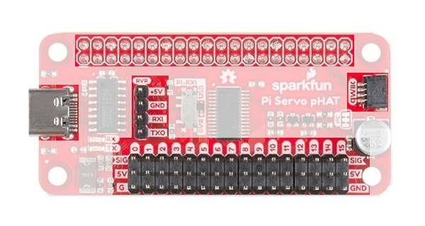

*Pi Servo pHATの電源接続（40ピンのGPIOヘッダーには、**5V**と**3.3V**の両方のピンへの接続が用意されている）*

#### 3.3V電源

> **⚡ 危険：** Pi用HATの設計要件として、HAT側から**3.3Vピンに電力を加えてはならない**。
>
> 可能性は低いが、Servo Pi pHATの3.3Vラインには**回路保護が一切ない**ため、Qwiic接続経由で電力が加わらないようにユーザー自身で必ず二重に確認すること。
> 主なアクセスポイントであるQwiicコネクタを通じて他のデバイスから**3.3Vピン**に電力が加わると、Raspberry Piを損傷する可能性が高い。

Pi Servo pHATでは、40ピンGPIOヘッダー上のRaspberry Piの**3.3Vピン**から**3.3V**の電力を取り出し、Qwiicデバイスへの給電とロジックレベル変換に使っている。
**3.3Vピンを通じてRaspberry Piに給電することはできない**。実際、このピンに別の電源を接続してはならない。
このピンは、[Qwiic接続システム](https://www.sparkfun.com/qwiic)専用の電源出力としてのみ使うことを意図している。

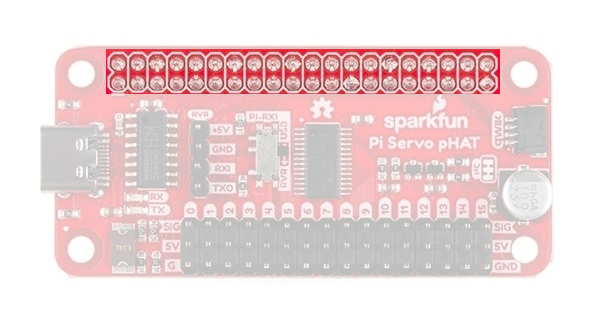

*Raspberry Piへの40ピンGPIOヘッダー接続*

**3.3V**ラインは、主に接続されたQwiicデバイスへの給電に使われる。
一般的なユーザーはRaspberry Piの電流制限に達することはほとんどないはずである。
とはいえ、大量の電流を消費する用途や、多数のQwiicデバイスを接続する場合は、必ず消費電流と、使っているRaspberry Piの制限値を再確認すること。
一例として、Raspberry Pi Zero Wは[PAM2306スイッチング3.3Vレギュレータ](https://cdn.sparkfun.com/assets/learn_tutorials/9/1/0/PAM2306.pdf)（*[電源回路の回路図](https://cdn.sparkfun.com/assets/learn_tutorials/9/1/0/rpi_SCH_ZeroW_1p1_reduced.pdf)を参照*）を使っており、最大**1A**の出力電流に対応している。

> **1アンペアの電流でも熱くなるのか？計算してみよう……**
>
> 1. 5Vから3.3Vへの降圧は、ΔVで1.7Vにあたる。
>    5V − 3.3V = 1.7V
> 2. 1Aのとき、これは1.7Wにあたる。
>    1.7V × 1A = 1.7W
> 3. 熱抵抗（ジャンクション-周囲間）を60℃/Wとすると、これは102℃の上昇に相当する。
>    1.7W × 60℃/W = 102℃
> 4. これに室温（27℃）を加えると、129℃になる。
>    102℃ + 27℃ = 129℃
>
> これは最大ジャンクション温度150℃を十分下回っている。1Aであれば問題なく使えるはずである。

#### ロジックレベル変換

**3.3V**ピンは、PCA9685 PWMコントローラーへのMOSFETロジックレベルコンバータの基準電圧としても使われる。
これはすべて、Qwiicコネクタ用のI2Cプルアップ抵抗にもつながっている。

#### 5.0V電源

> **⚡ 危険：** USB-C接続を通じて給電する際は、正しいUSBポート、電源付きUSBハブ、あるいは電源を使うこと。従来のUSBポートは調整済みの**5V**を供給するが、（USB 2.0の場合）およそ**500mA**に制限されている。コンピュータのUSBポート（*通常USB 2.0ポート*）が供給できる以上の電流を消費すると、コンピュータがエラーメッセージを出したり、リセットしたりする可能性が高い。運が悪ければ、コンピュータの電源コントローラーを損傷することさえある。こうした問題を防ぐため、想定電流と最大消費電流を必ず計算しておくこと。

サーボヘッダーの**5V**ラインに供給される電源には3種類ある。Raspberry Piの40ピンヘッダーの**5Vピン**（*Raspberry Piに接続された電源*）、RVRシリアル接続ヘッダーの**5Vピン**、そしてUSB-Cのメスコネクタである。
Pi Servo pHAT上の電源保護・制御回路は、これらを個別にも、あるいは組み合わせても使えるようになっている。

- **40ピンメスヘッダー：** Raspberry Piとの間の電力のやり取りは、この40ピンヘッダーを通じて行われる。このメスヘッダーは、Raspberry Piへのさまざまな接続を提供する。電源には**5Vピン**と**3.3Vピン**が使われる。

  

  *Raspberry Piへの40ピンGPIOヘッダー接続。クリックすると拡大表示できる。*

- **USB-Cコネクタ：** このコネクタは、サーボモーターとRaspberry Piの両方への給電に使える。また、シリアルポート接続経由でPiに接続するのにも使える（*詳しくは下記のSerial-UARTの節を参照*）。

  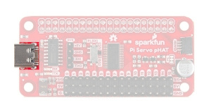

  *Pi Servo pHATへのUSB-C接続。クリックすると拡大表示できる。*

- **RVRヘッダー：** この4ピンヘッダーは、サーボモーターとRaspberry Piの両方への給電に使える。また、シリアルポート接続経由でPiに接続するのにも使える（*詳しくは下記のSerial-UARTの節を参照*）。

  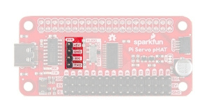

  *Pi Servo pHATへのSphero RVRの4ピンヘッダー接続。クリックすると拡大表示できる。*

#### 電源の制御と保護

> **逆流に対する予防措置は講じているが、それでも自分が何をしているか常に意識してほしい。**
>
> ⚡ **5V**と**3.3V**のラインの間でショートが起きると、Raspberry Piは永久に使えなくなる。
>
> ⚡ Servo Pi pHAT側から**3.3Vピン**（またはQwiicコネクタ）に電力を加えることはできない。Raspberry Piの**3.3V**ピンに電力が加わると、損傷する可能性が高い。回路保護は用意されていない。
>
> - 想定電流と最大消費電流を必ず計算し、問題を防ぐこと。
>
> ⚡ USB-C接続を通じて給電する際は、正しいUSBポートや電源を使うこと。**USB 2.0**ポートは調整済みの**5V**を供給するが、およそ**500mA**に制限されている。コンピュータのUSBポートが供給できる以上の電流を消費すると、コンピュータがエラーになったり、電源コントローラーを損傷したりする可能性が高い。
>
> 🔥 **3.3V**ラインから過剰に電流を引き出すと、**3.3V**レギュレータに負荷がかかることがある。Raspberry Pi Zero Wのレギュレータは、**1A**でかなり熱くなる。
>
> ⚡ USB-C接続のヒューズは、電源保護回路の一部である。ヒューズバイパスジャンパーは、自分が何をしているか十分理解している場合にのみ使うこと。そうでなければ、些細なミスがプロジェクト全体を台無しにしかねない。

##### 逆流保護

Pi Servo pHATは、Raspberry Piの40ピンヘッダーの**5Vピン**、RVRシリアル接続ヘッダーの**5Vピン**、そしてUSB-Cのメスコネクタという3つの異なる電源からの**5V**を制御している。
逆流保護のため、この基板は[理想ダイオード](https://github.com/raspberrypi/hats/blob/master/zvd-circuit.png)として動作する回路を使っている。これはRaspberry Pi 3でも使われている設計であり、[Raspberry Pi用HATの要件](https://github.com/raspberrypi/hats/blob/master/designguide.md)でもある。

この*理想ダイオード*による回路保護は、Pi Servo pHATからUSB-C接続やRVR接続への*逆流*を防ぐ。
Pi Servo pHATに複数の電源を使っている場合、それぞれの電源が矛盾する入力電圧を供給してしまう可能性がある。
電源間の電圧差が十分大きいと、電力の流れが逆転し、電源側に電流が押し戻されることがある。
これはコンピュータを含むデバイスを損傷する可能性がある。
詳しくは、[Raspberry Pi Backpowering Guidelines](https://github.com/raspberrypi/hats/blob/master/designguide.md#back-powering-the-pi-via-the-gpio-header)を確認してほしい。

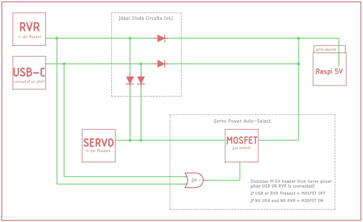

*Pi Servo pHAT上の**5V**電源保護のブロック図。クリックすると拡大表示できる。*

上の機能ブロック図に示すとおり、USB-CとRVRの両方の入力は、Raspberry Piやサーボの電源からの*逆流*から*理想ダイオード*で保護されている。
ただし、ヘッドレスセットアップのためにPi Servo pHATからRaspberry Piへ電力を流せるようにする必要があるため、**5V GPIOピンには電源保護や絶縁回路が実装されていない**。
つまり、電流はRaspberry Piに自由に逆流して給電できるということであり、これは電源に逆流保護が備わっていないRaspberry Pi Zero、Zero W、3B+、3A+の各モデルでは注意が必要になることがある。

これが問題になるのは、Raspberry Pi上の**5V**電源（micro-B USBコネクタ）が、Pi Servo pHAT上のUSB-CまたはRVR接続経由で供給された外部電力からなんらかの形で電流を吸い込んでしまう場合である。
とはいえ実際には、理想ダイオードには多少の電圧降下があり、Raspberry Piの**5V**レールにも多少の許容範囲があり、Raspberry Pi側の電源が電流を吸い込んでしまう可能性自体もそう高くない。
万が一、自ら*マッドサイエンティスト*になって基板の限界を試したい場合のために、Pi Servo pHATの**5V**ラインとRaspberry Piの**5V**ラインの間には回路保護がないため、電源絶縁ジャンパーを手動で切断できるようになっている。

##### 電源制御

上の機能ブロック図には、Raspberry Piからの電力を管理する自動スイッチとして働くMOSFETも示されている。
RVRヘッダーまたはUSB-Cコネクタのどちらかが5Vを供給している場合、Raspberry PiのGPIOヘッダーからの電力はサーボの**5V**レールから切り離される。
下の表は、考えられる電源の組み合わせをまとめたものである。

| Pi GPIO | USB-C | RVRヘッダー | 説明 |
| --- | --- | --- | --- |
| ○ | ○ | × | Raspberry Piは主に自身の電源で給電される。サーボはUSB-Cから電力を得る（MOSFETは閉じており、Piからの電力は使われない）。 |
| ○ | × | ○ | Raspberry Piは主に自身の電源で給電される。サーボはRVRヘッダーから電力を得る（MOSFETは閉じており、Piからの電力は使われない）。 |
| ○ | ○ | ○ | Raspberry Piは主に自身の電源で給電される。サーボはUSB-CまたはRVRヘッダーのうち、都合のよい方から電力を得る（MOSFETは閉じており、Piからの電力は使われない）。 |
| × | ○ | ○ | Raspberry Piとサーボは、USB-CまたはRVRヘッダーのうちより適した方から給電される。 |
| × | × | ○ | それぞれ個別の電源から給電される。 |
| × | ○ | × | 同上。 |
| ○ | × | × | 同上。 |

（○＝その電源が接続されている、×＝接続されていない）

この表に示していないのが、サーボの**5V**レールに電源が接続される可能性である。

##### USB-Cヒューズ

Pi Servo pHATには、USB-C接続を通じた消費電流を制限するヒューズ（**2.5A保持**、**5Aトリップ**）がある。
**5A**を超える電流が流れると、負荷が取り除かれるまで自動的に電流を絞る、あるいは電源を切断する。
この制限を取り除きたいユーザー向けにバイパスジャンパーが用意されているが、このジャンパーを使う際は自分が何をしているか十分理解している必要がある。
何をしているかよくわからない場合は、このジャンパーには触れないことを推奨する（*詳しくは下記のJumpersの節を参照*）。

##### 電源絶縁

Pi Servo pHATの40ピンGPIOヘッダーには、電源絶縁ジャンパーが接続されている。
このジャンパーを切断すると、Raspberry Piの**5Vピン**を、Pi Servo pHATで使われる**5V**から絶縁できる。
これは通常、大きな負荷を使う予定がある場合や、ノイズがRaspberry Piに逆流することで断続的な電源喪失が起きるのを心配している場合に使われる（*詳しくは下記のJumpersの節を参照*）。

このジャンパーを切断してもシリアルUART接続には影響しない。
とはいえ、Pi Servo pHATから再びRaspberry Piに給電したい場合は、このジャンパーをブリッジし直す必要がある。

### PCA9685

[PCA9685](http://www.nxp.com/docs/en/data-sheet/PCA9685.pdf)は、Pi Servo pHAT上の16チャンネル・12ビットのパルス幅変調（PWM）に対するI2C制御を提供する。
PCA9685は主にLED制御向けに設計されているが、サーボのような他のPWMデバイスにも使える。

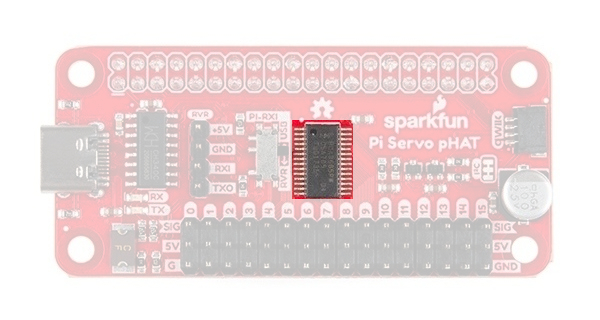

*16チャンネルPWMコントローラーIC、PCA9685*

| 特性 | 説明 |
| --- | --- |
| 動作電圧（VDD） | 2.3V〜5.5V（ハードワイヤード：**5V**） |
| 動作温度 | -40℃〜85℃ |
| PWM出力 | 16個のトーテムポール出力（デフォルト：オープンドレイン）／5Vでシンク25mAまたはソース10mA／PWM周波数はすべてのチャンネルで共有／ホットインサーション対応 |
| PWM周波数 | 24Hz〜1526Hz（デフォルト（1Eh）：**200Hz**） |
| PWM分解能 | 12ビット（4096段階の制御） |
| デューティ比 | 0%〜100%（調整可能） |
| 発振器 | 内部：**25MHz**（ハードワイヤード）／外部：最大50MHzの入力（利用不可） |
| I2Cアドレス | ハードウェアで設定可能な62種類のアドレス（ハードワイヤード：**0x40**）／複数デバイスをグループでまとめて制御するためのプログラム可能な4つのアドレス（All Callアドレス1個、Sub Callアドレス3個） |

すべてのチャンネルでPWM周波数は共有されるが、16チャンネルのPWM出力のデューティ比はそれぞれ個別に制御できる。
これにより、PCA9685は各出力でサーボやLEDを制御できる。
LEDの場合はこれで明るさを制御・駆動でき、サーボの場合は位置を制御できる。

#### サーボ・PWMヘッダー

Pi Servo pHATはさまざまなPWMデバイスで使えるが、最も典型的な用途はサーボとLEDである。
これらのヘッダーは、サーボモーターを取り付けやすいよう間隔を空けて配置されている。
さらに、ほとんどのホビー用サーボモーターのコネクタに対応する標準的な3ピン構成で引き出されている。

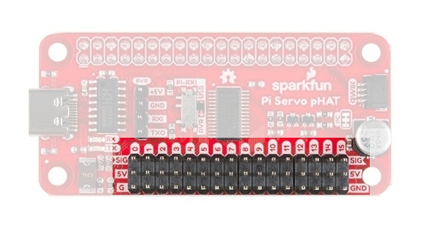

*16のPWMチャンネルに接続されたサーボヘッダー*

### シリアルUART接続

Raspberry Piは、Pi Servo pHATを通じてシリアル接続でやり取りできる。
シリアルUARTへのアクセスポイントは2つあり、Sphero RVR用の4ピンヘッダーと、USB-C接続である。
どちらのインターフェースを使うかは、Pi Servo pHAT上のRXスイッチで制御する。

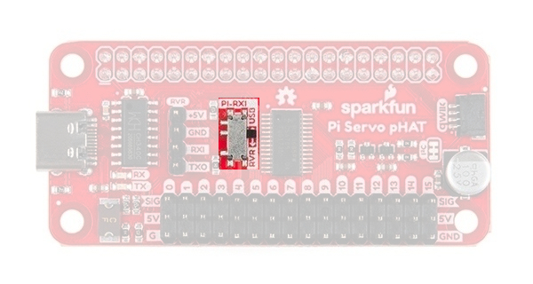

*Pi Servo pHATのRXスイッチは、USB-C接続とSphero RVRの4ピンヘッダーのどちらのTXラインを使うかを制御する。クリックすると拡大表示できる。*

どちらの接続が使われているかは、わかりやすくなっている。
スイッチが（*黒い突起の*）ある側にラベル付けされたインターフェース（`USB`または`RVR`）が、シリアル通信のためにRaspberry PiのRXピンへ接続されるTXを示している。
上の写真に示すとおり、USB-CインターフェースのTXラインがRaspberry PiのRXピンに接続されている。
Sphero RVRの4ピンヘッダーのTXラインに切り替えるには、矢印に従ってスイッチを`RVR`の位置にスライドさせるだけでよい。

シリアル通信についてのコツや詳細については、シリアル通信とシリアルターミナルの基礎のチュートリアルを参照してほしい。

> **トラブルシューティングのヒント：** SSHやシリアル接続がうまくいかない場合は、このスイッチが正しい位置にあるか、正しいボーレートを使っているか再確認すること。

#### USB-Cコネクタ

このコネクタは、給電にも、モニタやキーボードを使わずにリモートでRaspberry Piにアクセスするためのシリアルポート接続にも使える（*詳しくはHeadless Raspberry Pi Setupのチュートリアルを参照*）。

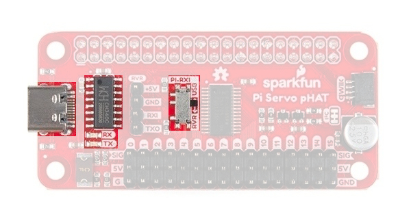

*Pi Servo pHATのシリアル通信用USB-Cインターフェース。クリックすると拡大表示できる。*

Pi Servo pHATには、USB-C接続を通じた消費電流を制限するヒューズがある。
5Aを超える電流が流れると、負荷が取り除かれるまで自動的に電流を絞る、あるいは電源を切断する。

> **トラブルシューティングのヒント：** USBケーブルの抜き差しの際に、コネクタをこじったり支点にしたりしては**いけない**。そうすると基板やコネクタが損傷し、パッドやトレースがちぎれてしまうことも**ある**。ケーブルは、基板からまっすぐ引き抜くようにして外すこと。

##### CH340C

CH340Cは、WCH製のUSB-シリアル変換アダプタである。
USB-C接続とシリアルターミナルの間でデータを変換するのに使われる。
CH340Cチップのドライバは、コンピュータにインストールしておく必要がある。
Windows 7、Windows 10、Mac OSX High Sierra、Raspberry Pi向けRaspbian Stretch（2018年11月13日リリース版）で動作することを確認済みである。
どのOSでも、以前CH340Gのドライバをインストールしたことがある場合は、新しいCH340Cドライバに更新する前に、まずそのドライバをアンインストールする必要がある。
詳しくは、[How to Install CH340 Drivers Tutorial](https://www.sparkfun.com/ch340)を参照してほしい。

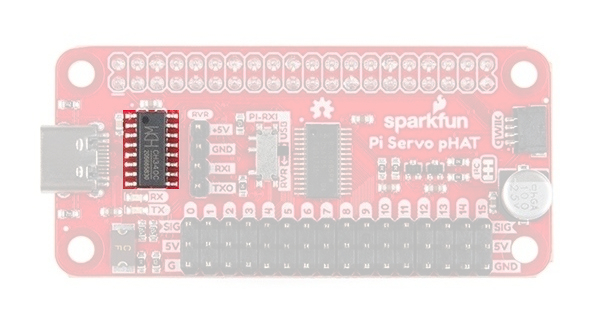

*Pi Servo pHATのシリアル通信用USB-Cインターフェース。クリックすると拡大表示できる。*

USB-C接続でシリアルデータを送受信すると、RX（黄）とTX（緑）のLEDが点滅するはずである。
RXピンは4ピンのRVRヘッダーと接続を共有しており、データを受信している際に点滅することがある。

#### RVRヘッダー

Sphero RVRは、Raspberry Piにアクセスするために4ピンヘッダーを必要とする。
Pi Servo pHATでは、Sphero RVRとの手間のかからない統合のため、この接続を引き出している。

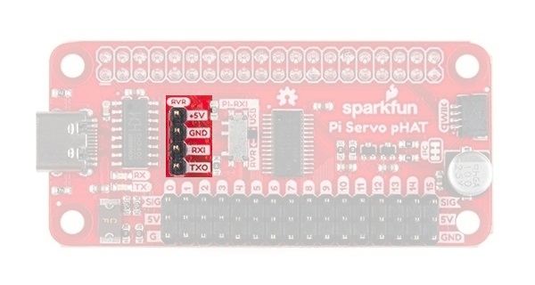

*Raspberry Piのシリアルターミナルにアクセスするための、Sphero RVR用4ピンヘッダー*

### Qwiicコネクタ

> **注意：** 非Qwiicデバイスを追加する場合や[Qwiicジャンパーケーブル](https://www.sparkfun.com/products/14425)を使う場合は注意すること。このコネクタには回路保護が一切ない。

[Qwiicシリーズ製品](https://www.sparkfun.com/qwiic)との追加の互換性のため、Qwiicコネクタが用意されている。
Qwiicシステムは、お気に入りのI2Cデバイスを手軽に、手間なく追加できるケーブル・コネクタシステムを目指している。
QwiicコネクタはRaspberry PiのI2Cピンにつながっており、**3.3Vピン**から直接電力を得ている。

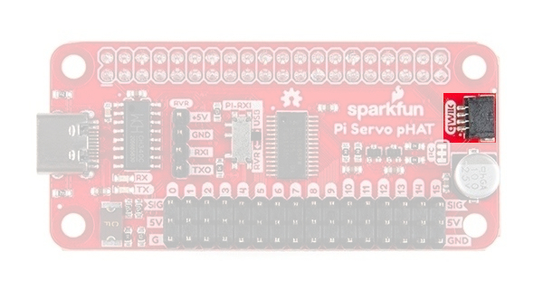

*Pi Servo pHAT上のQwiicコネクタ。クリックすると拡大表示できる。*

> **注意：** I2Cバス上には、PCA9685向けにロジックレベルを昇圧するためのロジックレベルコンバータが一組ある。

### ジャンパー

この基板には、個々の部品を改造しなくても、いくつかのハードウェア接続を簡単に変更できるジャンパーがいくつか引き出されている。
ジャンパーの切断方法がわからない場合は、[こちらのチュートリアル](https://learn.sparkfun.com/tutorials/how-to-work-w-jumper-pads-and-pcb-traces/cutting-a-trace-between-jumper-pads)を確認してほしい。
変更を加える前に、それぞれのジャンパーが何をするのか必ず確認しておくことを推奨する。
これは特に、重大な結果を招きかねないヒューズバイパスジャンパーについて当てはまる。

#### 電源絶縁

このジャンパーはデフォルトでは閉じている。
Pi Servo pHAT上の電源をPiの5V電源レールから絶縁するには、これを切断・開放すればよい。

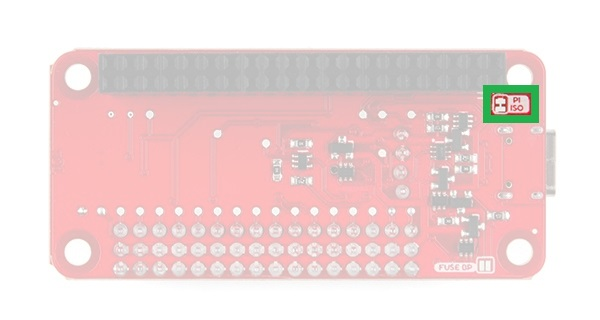

*Pi Servo pHAT上の電源絶縁ジャンパー。クリックすると拡大表示できる。*

> **注意：** このジャンパーの状態にかかわらず、Piに電源が入っている限りシリアルインターフェースは動作し続ける。

#### ヒューズバイパス

> **⚡ 危険：** このジャンパーは、電源保護回路の一部であるPi Servo pHAT上のヒューズをバイパスするために使う。このジャンパーは、自分が何をしているか十分理解している場合にのみ使うこと。そうでなければ、些細なミスがプロジェクト全体を台無しにしかねない。

バイパスジャンパーは、USB-C接続のヒューズによる電流制限を取り除きたいユーザー向けに用意されているが、このジャンパーを使う際は自分が何をしているか十分理解している必要がある。
このヒューズの定格は**2.5A保持**、**5Aトリップ**である。

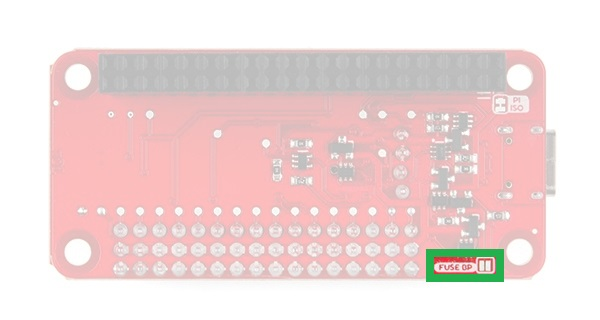

*Pi Servo pHAT上のヒューズバイパスジャンパー。クリックすると拡大表示できる。*

何をしているかよくわからない場合は、このジャンパーには触れないことを推奨する。
USB-Cは非常に大きな電力を供給できるため、ハードウェアを簡単に損傷しうる。

#### I2Cプルアップ

**I2Cジャンパー**を切断すると、I2Cバスから**10kΩ**のプルアップ抵抗が切り離される。

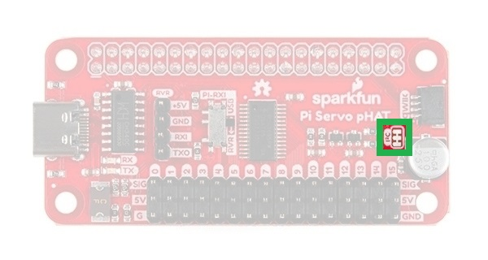

*Pi Servo pHAT上のI2Cプルアップジャンパー。クリックすると拡大表示できる。*

たとえば、プルアップ抵抗を持つQwiicデバイスを複数接続している場合、このジャンパーを切断したくなることがある。
プルアップ抵抗を持つ複数のデバイスがI2Cバス上にある場合、[並列合成抵抗](https://learn.sparkfun.com/tutorials/resistors#series-and-parallel-resistors)の値が強すぎて、バスが正しく動作しなくなることがある。

## ハードウェアの組み立て

> **注意：** このチュートリアルは、ユーザーがRaspberry Piに馴染みがあり、Pythonの一般的な知識も持っている前提で進める。これらに馴染みがない場合は、まずRaspberry Piをセットアップし、グラフィカルユーザーインターフェース（GUI）に慣れ、続いてPythonの基礎を学ぶことを出発点として推奨する。始めるための資料を以下に挙げる。
>
> - Raspberry Piを[使い始める](https://projects.raspberrypi.org/en/projects/raspberry-pi-getting-started)ための資料は、[Raspberry Pi Foundationのウェブサイト](https://www.raspberrypi.org/)で見つかる。Raspberry Piの[ドキュメント](https://www.raspberrypi.org/documentation/)や[フォーラムサポート](https://www.raspberrypi.org/forums/)も提供されており、コミュニティも広いため、オンラインで検索すれば資料はすぐに見つかる。
> - Pythonを[使い始める](https://www.python.org/about/gettingstarted/)ための資料は、[Pythonの公式サイト](https://www.python.org/)で見つかる。[充実したドキュメント](https://www.python.org/doc/)が提供されており、比較的大きなコミュニティもあるため、他の資料もオンラインで簡単に見つけられる。

### Raspberry Pi

Raspberry PiにPi Servo pHAT（v2）を組み合わせるのはかなり簡単である。
まず、何にも電源が入っていないことを確認する。
続いて、PCB同士が上下に重なるよう、基板をRaspberry Piに積み重ねる。Pi Servo pHATは横に飛び出すような形には**ならない**。

- Pi Servo pHATのPCBがRaspberry Piの上（あるいは上方）ではなく横に飛び出す形で重ねてしまうと、ピンの接続が誤ってしまい、まず何かを損傷する。
- 通常はごくわずかなリスクだが、Raspberry Pi用HATを接続する際にも、何かがショートしたり、電圧不足になったり、損傷したりする可能性はある。ベストプラクティスとして、（HAT、サーボ、LED、追加のQwiic基板を含め）何かに電源が入った状態でHATを差し込むことは絶対に避けること。
- Raspberry Pi 4やDebian Busterイメージは使わないこと。どちらもこの製品での動作確認がまだ済んでいない。
- Raspberry Piが動作している状態でサーボを差し込んではいけない。サーボへの給電に必要な急激な電流の変化により、Raspberry Piがリセットされてしまう。サーボはすべて先に差し込んでから、電源を入れること。

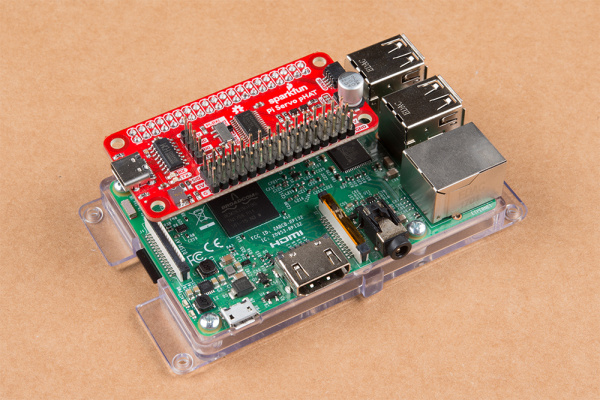

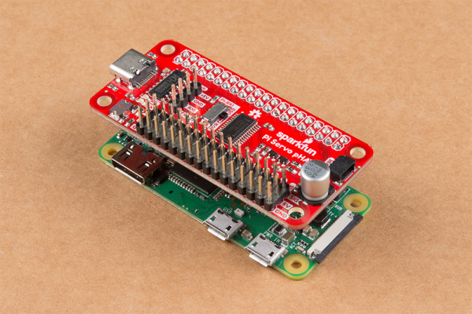

*Raspberry Piに正しく接続されたPi Servo pHAT。画像をクリックすると拡大表示できる。*

#### Sphero RVR

残念ながら、このチュートリアルではSphero RVRとPi Servo pHATを組み合わせて使う方法は扱わない。
とはいえ、組み立てガイドと入門チュートリアルへのリンクを以下に示しておく。

- Basic Autonomous Kit for Sphero RVR Assembly Guide — Basic Autonomous Kit for Sphero RVRを接続するガイド
- Advanced Autonomous Kit for Sphero RVR Assembly Guide — Advanced Autonomous Kit for Sphero RVRを組み立てるHookup Guide
- Getting Started with the Autonomous Kit for the Sphero RVR — ロボット工学を始めたいなら、SparkFun autonomous kit for the Sphero RVRがぴったりである。BasicキットでもAdvancedキットでも、このチュートリアルで走り出せる

### その他のシングルボードコンピュータ

Nvidia JetsonやGoogle Coralなど、他のシングルボードコンピュータ（SBC）でもこのHATを使う手順は似ている。
HATが正しい向きで揃っていることだけ確認すればよい。
たとえばNvidia Jetsonの場合、HATは基板から外側に飛び出す向きに**するべきである**（*HATを収めるためにヒートシンクを取り外そうとしてはいけない。それは間違った向きである*）。

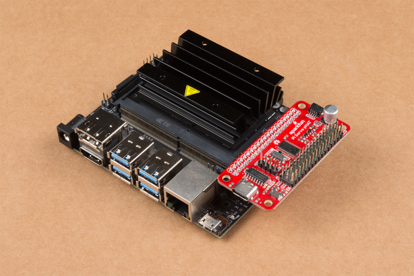

*Nvidia Jetsonに正しく接続されたPi Servo pHAT*

### 電源

Hardware Overviewの節で説明したとおり、サーボヘッダーへの**5V**電源は3種類の異なる方法で供給できる。

> **注意：** Sphero RVRキットで使う4ピンヘッダーの例はまだ用意されていない。


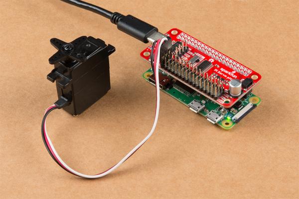

*さまざまな電源の選択肢の例。*

> **注意：** （4未満のモデルの）Raspberry Piでは、**PWR IN**とラベル付けされたmicro-Bコネクタを使う。

### サーボ

このチュートリアルでは、チャンネル「0」でホビーサーボをテストする。
使用するサーボに応じて、ホビーサーボのデータシートを確認するか、このチュートリアルに掲載されている[標準的なサーボコネクタのピン配置](./hobby-servo-tutorial.md)を参考にしてほしい。

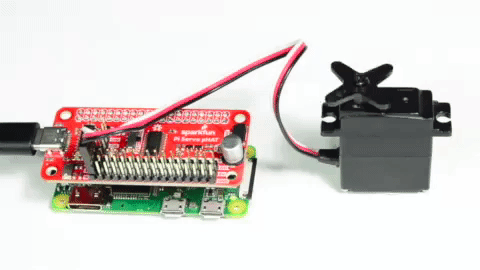

*Raspberry Piに正しく接続され、サーボが動作しているPi Servo pHAT。*

### Qwiicデバイス

Qwiic接続システムを使えば、お気に入りのQwiic対応センサーやデバイスを簡単に追加できる。

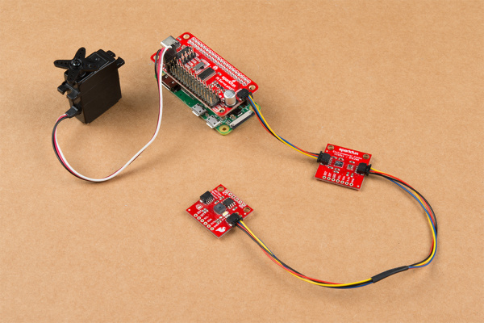

*Qwiicデバイスは、Pi Servo pHATにデイジーチェーンで接続できる。*

## Pythonパッケージの概要

> **注意：** このセンサーとPythonライブラリは、新しくリリースされたRaspberry Pi 4ではまだテストされていない。まだカタログに取り扱いがないためである。

> **注意：** このパッケージは、最新版のPython 3を使っている前提である。Raspberry PiでPythonやI2Cハードウェアを使うのが初めての場合は、Python Programming with the Raspberry Piのチュートリアルと、[Raspberry PiのSPIとI2C](./raspberry-pi-spi-and-i2c-tutorial.md)のチュートリアルを確認してほしい。
>
> *Raspberry Pi上では、Raspbian OS（デスクトップと推奨ソフトウェア付き）のイメージにPython 2と3の両方が同梱されている。*
>
> **サポートのヒント：** Raspberry Piや他のシングルボードコンピュータで、I2Cハードウェアが有効になっているか必ず再確認すること。

この製品には2つのPythonパッケージがある。
[Qwiic_PCA9685_Py](https://github.com/sparkfun/Qwiic_PCA9685_Py)は、PCA9685 PWMコントローラーICの動作を支える基盤パッケージである。
一方、[PiServoHat_Py](https://github.com/sparkfun/PiServoHat_Py)は、この製品専用に作られた、サーボを制御するためのパッケージである。
これらのパッケージは、Pi Servo pHATでサーボの制御をすぐに始められるよう書かれている。

### インストール

この製品用のPythonパッケージをインストールするには、SparkFun Qwiicパッケージをインストールすることを推奨する。
これにより、SparkFunのQwiic製品向けに利用可能なPythonパッケージがすべてインストールされ、必要なI2Cドライバーパッケージも含まれる。
`pip3`（Python 2の場合は`pip`）経由でPyPiのインストールに対応しているシステムでは、次のコマンドで簡単にインストールできる。

**すべてのユーザー**向け（注：[sudo](https://en.wikipedia.org/wiki/Sudo)権限が必要）：

```bash
sudo pip3 install sparkfun-qwiic
```

**現在のユーザー**向け：

```bash
pip3 install sparkfun-qwiic
```

> **注意：** ユーザーは、この製品用の2つのPythonパッケージを個別にインストールすることもできる（*手順は下記を参照*）。その場合も、必要なI2Cドライバーパッケージは別途インストールする必要がある。

### Qwiic_PCA9685_Py

PyPiでホストされている`sparkfun-sparkfun-qwiic-pca9685`Pythonパッケージをインストールできる。
[GitHubリポジトリ](https://github.com/sparkfun/Qwiic_PCA9685_Py)から手動でダウンロード・インストールしたい場合は、こちらから入手できる（*パッケージの依存関係に注意してほしい。リポジトリのドキュメントページは[ReadtheDocs](https://qwiic-pca9685-py.readthedocs.io)でホストされている*）。

#### PyPiでのインストール

このリポジトリは、PyPiに`sparkfun-qwiic-pca9685 package`としてホストされている。
`pip3`（Python 2の場合は`pip`）経由でPyPiのインストールに対応しているシステムでは、次のコマンドで簡単にインストールできる。

**すべてのユーザー**向け（注：[sudo](https://en.wikipedia.org/wiki/Sudo)権限が必要）：

```bash
sudo pip3 install sparkfun-qwiic-pca9685
```

**現在のユーザー**向け：

```bash
pip3 install sparkfun-qwiic-pca9685
```

#### ローカルインストール

インストールするには、システムに`setuptools`パッケージがインストールされていることを確認する。

コマンドラインから直接インストールする（Python 2の場合は`python`を使う）。

```bash
python3 setup.py install
```

`pip3`用のパッケージをビルドするには、次のようにする。

```bash
python3 setup.py sdist
```

パッケージファイルがビルドされ、`dist`というサブディレクトリに置かれる。
このパッケージファイルは`pip3`でインストールできる。

```bash
cd dist
pip3 install sparkfun_qwiic_pca9685-<version>.tar.gz
```

#### Pythonパッケージの動作

これはPCA9685 PWMコントローラーICの基盤となるパッケージであるため、動作の詳細については扱わない。
とはいえ、[ReadtheDocs](https://qwiic-pca9685-py.readthedocs.io)のドキュメントを確認するのは自由である。

### PiServoHat_Py

PyPiでホストされている`sparkfun-pi-servo-hat`Pythonパッケージをインストールできる。
[GitHubリポジトリ](https://github.com/sparkfun/PiServoHat_Py)から手動でダウンロード・インストールしたい場合は、こちらから入手できる（*パッケージの依存関係に注意してほしい。リポジトリのドキュメントページは[ReadtheDocs](https://piservohat-py.readthedocs.io)でホストされている*）。

#### PyPiでのインストール

このリポジトリは、PyPiに`sparkfun-pi-servo-hat package`としてホストされている。
`pip3`（Python 2の場合は`pip`）経由でPyPiのインストールに対応しているシステムでは、次のコマンドで簡単にインストールできる。

**すべてのユーザー**向け（注：[sudo](https://en.wikipedia.org/wiki/Sudo)権限が必要）：

```bash
sudo pip3 install sparkfun-pi-servo-hat
```

**現在のユーザー**向け：

```bash
pip3 install sparkfun-pi-servo-hat
```

#### ローカルインストール

インストールするには、システムに`setuptools`パッケージがインストールされていることを確認する。

コマンドラインから直接インストールする。

```bash
python setup.py install
```

`pip3`用のパッケージをビルドするには、次のようにする。

```bash
python setup.py sdist
```

パッケージファイルがビルドされ、`dist`というサブディレクトリに置かれる。
このパッケージファイルは`pip3`でインストールできる。

```bash
cd dist
pip3 install sparkfun_pi_servo_hat-<version>.tar.gz
```

#### Pythonパッケージの動作

以下は、このPythonパッケージの基本的な機能の説明である。
パッケージの構成、組み込みメソッド、その入出力を含む。
このPythonパッケージの動作についてさらに詳しくは、[ソースコード](https://github.com/sparkfun/PiServoHat_Py/blob/main/pi_servo_hat.py)とセンサーの[データシート](https://cdn.sparkfun.com/assets/e/4/0/5/9/PCA9685.pdf)を確認してほしい。

##### 依存関係

このPythonパッケージがコード内で必要とする依存関係は、ごくわずかである。

```python
import time             # Time access and conversion package
import math             # Basic math package
import qwiic_pca9685    # PCA9685 LED driver package
```

##### デフォルトの変数

このPythonパッケージのコード内にあるデフォルトの変数を以下に示す。

```python
# Device Name:
_DEFAULT_NAME = "Pi Servo HAT"

# Fixed Address:
_AVAILABLE_I2C_ADDRESS = [0x40]

# Default Servo Frequency:
_DEFAULT_SERVO_FREQUENCY = 50   # Hz

# Special Use Addresses:
gcAddr = 0x00       # General Call address for software reset
acAddr = 0x70       # All Call address- used for modifications to
                    # multiple PCA9685 chips reguardless of thier
                    # I2C address set by hardware pins (A0 to A5).
subAddr_1 = 0x71    # 1110 001X or 0xE2 (7-bit)
subAddr_2 = 0x72    # 1110 010X or 0xE4 (7-bit)
subAddr_3 = 0x74    # 1110 100X or 0xE8 (7-bit)
```

##### クラス

**`PiServoHat()`**または**`PiServoHat(address, debug=None)`**
このPythonパッケージはクラスオブジェクトとして動作し、その型の新しいインスタンスを作成できる。
`__init__()`コンストラクタを使い、デフォルトまたは指定したI2CアドレスでI2Cバス経由のI2Cデバイスへの接続を作成する。

###### コンストラクタ

コンストラクタとは、オブジェクトの作成時に必要なデータメンバーを初期化する（値を割り当てる）ための特別なメソッドである。

**`__init__(address, debug)`**

入力：value
デバイスアドレスの値。指定しない場合、このPythonパッケージは`_AVAILABLE_I2C_ADDRESS`変数に保存されたデフォルトのI2Cアドレス（**0x40**）を使う。*All Call*アドレスは*0x70*である。

入力：value
デバッグ用の文を出力するかどうかを指定する。

**0：** デバッグ用の文を出力しない。
**1：** デバッグ用の文を出力する。

出力：Boolean

**True：** デフォルト（または指定した）アドレスのI2Cデバイスに接続できた。
**False：** デバイスが見つからない、または接続できなかった。

##### 関数

クラスの属性である関数のことで、そのクラスのインスタンスに対するメソッドを定義する。
簡単に言えば、そのクラスの操作（あるいはメソッド）のためのオブジェクトである。

**`.restart()`**
PCA9685チップをソフトリセットし、`MODE1`レジスタをクリアしてPWM機能を再起動する。
PWM周波数もデフォルトの**50Hz**設定に戻る。

**`.get_pwm_frequency()`**
出力で使われているPWM周波数を読み取る。

出力：Integer
**範囲：** 24Hz〜1526Hz

**`.set_pwm_frequency(frequency)`**
出力で使うPWM周波数を設定する。**50Hz**がデフォルトで、ほとんどのサーボに推奨される。

入力：Integer
**範囲：** 24Hz〜1526Hz

**`.get_servo_position(channel)`**または**`.get_servo_position(channel, swing)`**
サーボアームの向きを度数で推定する。
この推定値は、指定したチャンネルのPWM信号に設定されているタイミングに基づく。

入力：value
対象のチャンネル
**範囲：** 0〜15

入力：Value
**90：** アームの可動角が90°のサーボ。
**180：** アームの可動角が180°のサーボ。

出力：Float
推定されたサーボアームの位置。

**`.move_servo_position(channel, position)`**または**`.move_servo_position(channel, position, swing)`**
サーボを指定した位置（度数）まで動かす。

入力：value
対象のチャンネル
**範囲：** 0〜15

入力：Float
指定するサーボアームの位置。

入力：Value
**90：** アームの可動角が90°のサーボ。
**180：** アームの可動角が180°のサーボ。

**`.set_duty_cycle(channel, duty_cycle)`**
デューティ比に基づいて、サーボを指定した位置に動かす。

入力：value
対象のチャンネル
**範囲：** 0〜15

入力：Float
デューティ比（パーセント）
**範囲：** 0〜100（%）（*分解能：1/4096*）

### パッケージのアップグレード

今後、Pythonパッケージに変更が加えられることがある。
インストール済みのパッケージの更新は、パッケージごとに個別に行う必要がある（サブモジュールや依存関係は自動的には更新されず、手動で更新する必要がある）。
`SomePackage`というPythonパッケージの場合、次のコマンドを使う（Python 2の場合は`pip`を使う）。

**すべてのユーザー**向け（注：[sudo](https://en.wikipedia.org/wiki/Sudo)権限が必要）：

```bash
sudo pip3 install --upgrade SomePackage
```

**現在のユーザー**向け：

```bash
pip3 install --upgrade SomePackage
```

## Pythonのサンプル

> **注意：** このセクションでは、Pythonパッケージに対応したサンプルを扱う。元のサンプルコードを探している場合は、以下の*アーカイブ*されたセクションに移動している。

この製品のサンプルコードは、[Pythonパッケージ用のGitHubリポジトリ](https://github.com/sparkfun/PiServoHat_Py/tree/master/examples)にあり、[ReadtheDocs](https://piservohat-py.readthedocs.io/en/latest/index.html)のドキュメントとしても公開されている。

- [Example 1: Full Sweep for 90 Degree Servo](https://piservohat-py.readthedocs.io/en/latest/ex1.html)
- [Example 2: Full Sweep for 180 Degree Servo](https://piservohat-py.readthedocs.io/en/latest/ex2.html)
- [Example 3: Get Servo Position for 180 Degree Servo](https://piservohat-py.readthedocs.io/en/latest/ex3.html)
- [Example 4: Change PWM Frequency for 180 Degree Servo](https://piservohat-py.readthedocs.io/en/latest/ex4.html)

サンプルを実行するには、コードをダウンロードするか、ファイルにコピーするだけでよい。
続いて、必要であればサンプルファイルを開いて（保存して）、[好みのPython IDE](https://www.sparkfun.com/news/2706)でコードを実行する。
たとえば、デフォルトのPython IDLEでは、**Run > Run Module**をクリックするか、`F5`キーを使う。
サンプルを終了するには、`Ctrl` + `C`のキーの組み合わせを使う。

### Example 1

ここでは最初のサンプルだけを扱うが、コードがどう動作するか、その仕組みも詳しく分解して説明する。

#### 依存関係をインポートする

コードの最初の部分では、動作に必要な依存関係をインポートする。

```python
import pi_servo_hat
import time
```

#### コンストラクタを初期化する

この行で、デバイス用のオブジェクトをインスタンス化する。

```python
test = pi_servo_hat.PiServoHat()
```

#### ソフトリスタート

この行はPCA9685チップをソフトリセットし、`MODE1`レジスタをクリアして、PWM周波数をデフォルトの50Hzに戻す。

```python
test.restart()
```

#### テスト実行

このコードの部分では、1msのPWM信号を出力してサーボアームを0°に動かし、1秒間停止した後、2msのPWM信号を出力して90°に動かし、その位置で1秒間保持する。

```python
# Moves servo position to 0 degrees (1ms), Channel 0
test.move_servo_position(0, 0)

# Pause 1 sec
time.sleep(1)

# Moves servo position to 90 degrees (2ms), Channel 0
test.move_servo_position(0, 90)

# Pause 1 sec
time.sleep(1)
```

> **注意：** サーボ位置への入力値はあくまで概算であり、PWM信号の分解能に制限される。この点のデモは**Example 3**で確認できる。

#### スイープ

コードの最後の部分では、サーボアームを0°から90°まで、そして再び元に戻るという動作を繰り返す。
コードはおよそ1°刻みで反復し、入力した位置を出力する。

```python
while True:
    for i in range(0, 90):
        print(i)
        test.move_servo_position(0, i)
        time.sleep(.001)
    for i in range(90, 0, -1):
        print(i)
        test.move_servo_position(0, i)
        time.sleep(.001)
```

> **注意：** 完璧なものは存在しないため、サーボの位置は期待した入力値からずれることがある。
> この制約はたいていサーボ自体の精度によるものだが、一部はPWM信号のタイミングにも起因する（*サーボへのPWM信号は、出力の分解能とPWM周波数の影響を受けるが、これらの要因はサーボの精度と比べれば無視できるほど小さい*）。
>
> サーボは値段相応である。高品質・高性能なサーボは、安価な代替品よりもかなり高価になる。
> サイズ、トルク、応答速度、位置精度といった性能のさまざまな要素がコストに反映される。
> そのため、安価な代替品を使う場合は、ソフトウェア側で補正する必要が出てくることがある。
>
> さらに、サーボによっては、アームの可動範囲が期待される90°や180°を超えて広がっていることがある。
> コード末尾のコメントアウトされたセクションはこれを活用するのに使えるが、サーボを**永久に損傷または破壊してしまう**可能性があるため、慎重に扱うこと。

## Pythonのサンプル（アーカイブ）

> **注意：** この製品向けの新しいPythonパッケージの追加に伴い、これらのサンプルは非推奨となり、今後サポートされなくなる可能性がある。とはいえ、アーカイブとして情報はそのまま残している。

ここでは、PythonでPi Servo pHATにアクセスし、使う方法を詳しく説明する。
完全なサンプルコードは、[製品のGitHubリポジトリ](https://github.com/sparkfun/Pi_Servo_Hat/tree/v10)で公開されている。

> **注意：** このチュートリアルは、サーボモーターを**200Hz**のPWMで制御する前提で書かれている。「大きな」ブザー音が聞こえる場合や、サーボモーターの制御がうまくいかない場合は、周波数を下げるとよいかもしれない。**50Hz**用のサンプル一式を確認してみてほしい。
>
> - [servohat_50Hz.py](https://github.com/sparkfun/Pi_Servo_Hat/tree/v10/Examples/servohat_50Hz.py)
> - [servohat_50Hz_tuned.py](https://github.com/sparkfun/Pi_Servo_Hat/tree/v10/Examples/servohat_50Hz_tuned.py)

### SMBusリソースへのアクセスを準備する

まず一つ目のポイントとして、OSレベルのやり取りのほとんどでは、I2CバスはSMBusと呼ばれる。
というわけで、最初のコードは次のようになる。
これはsmbusモジュールをインポートし、`SMBus`型のオブジェクトを作成して、Piの各種SMBusのうちバス「1」に接続する。

```python
import smbus
bus = smbus.SMBus(1)
```

プログラムに部品のアドレスを教える必要がある。
デフォルトでは**0x40**なので、後で使うために変数にこの値を設定しておく。

```python
addr = 0x40
```

続いて、PWMチップを有効にし、書き込み後にアドレスを自動的にインクリメントするよう指示する必要がある（これにより、1回の操作で複数バイトの書き込みができるようになる）。

```python
bus.write_byte_data(addr, 0, 0x20)
bus.write_byte_data(addr, 0xfe, 0x1e)
```

### PWMレジスタに値を書き込む

必要な準備はこれですべてである。
ここから先は、PWMチップにデータを書き込めば、それに応じた反応が得られるはずである。次に例を示す。

```python
bus.write_word_data(addr, 0x06, 0)
bus.write_word_data(addr, 0x08, 1250)
```

最初の書き込みは、チャンネル0の「開始時間」レジスタに対するものである。
デフォルトでは、このチップのPWM周波数は**200Hz**、つまり5msごとに1回パルスが発生する。
開始時間レジスタは、5msのサイクルの中でパルスがいつハイになるかを決定する。
すべてのチャンネルはこのサイクルに同期している。
一般に、ここには0を書き込む。

2つ目の書き込みは「停止時間」レジスタに対するもので、パルスがいつローになるかを制御する。
この値の範囲は`0`から`4095`までで、各カウントはその5msの期間の1コマ分（5ms/4095、約1.2µs）を表す。
つまり、上で書き込んだ1250という値は、5msの期間のうちおよそ1.5msがハイであることを表している。

サーボモーターは、このパルス幅から制御信号を受け取る。
一般に、1.5msのパルス幅はモーターの可動範囲の両端のちょうど中間にあたる「中立」位置になる。
1.0msはおよそ中央から-90度、2.0msはおよそ中央から+90度に相当する。
実際にはこれらの値は90度より多少大きかったり小さかったりすることがあり、モーターがどちらの方向にも90度よりわずかに多く、あるいは少なく動作できることもある。

他のチャンネルにアクセスするには、上記の2つのレジスタのアドレスに単純に4ずつ加算していけばよい。
つまり、チャンネル1の開始時間は0x0A、チャンネル2は0x0E、チャンネル3は0x12というように続き、チャンネル1の停止時間のアドレスは0x0C、チャンネル2は0x10、チャンネル3は0x14というように続く。下の表を参照してほしい。

| チャンネル番号 | 開始アドレス | 停止アドレス |
| --- | --- | --- |
| Ch 0 | 0x06 | 0x08 |
| Ch 1 | 0x0A | 0x0C |
| Ch 2 | 0x0E | 0x10 |
| Ch 3 | 0x12 | 0x14 |
| Ch 4 | 0x16 | 0x18 |
| Ch 5 | 0x1A | 0x1C |
| Ch 6 | 0x1E | 0x20 |
| Ch 7 | 0x22 | 0x24 |
| Ch 8 | 0x26 | 0x28 |
| Ch 9 | 0x2A | 0x2C |
| Ch 10 | 0x2E | 0x30 |
| Ch 11 | 0x32 | 0x34 |
| Ch 12 | 0x36 | 0x38 |
| Ch 13 | 0x3A | 0x3C |
| Ch 14 | 0x3E | 0x40 |
| Ch 15 | 0x42 | 0x44 |

開始アドレスに0を書き込んだ場合、90度からの角度のずれ1度ごとに、停止アドレスへの書き込み値が4.6カウント分変化する。
つまり、中立位置からずらしたい角度の数に4.6を掛け、動かしたい方向に応じてその結果を1250に加算または減算すればよい。
たとえば、中央から45度ずらしたい場合、動かしたい方向に応じて1250より207（45×4.6）カウント多いか少ない値になる。

### サンプル

以下に、参考になるサンプルをいくつか紹介する。

#### Example 1：50Hz周波数

高周波数に対応できる高性能・現代的なサーボとは異なり、ほとんどのサーボ（多くは古いか安価なもの）は**50Hz**のPWM周波数を好み、**200Hz**のPWM周波数では動作に苦労する。
たいてい、位置を探そう（追従しよう）とする過程でブザー音を発したり、過熱したりしてしまう。


*サーボが動作しているExample 1。*

以下は、PCA9685を**50Hz**のPWM周波数で駆動するよう設定する方法の例である。
これによりサーボアームの位置決めの分解能は下がるが、ほとんどのサーボにとってはそもそも過熱の原因になっていた分解能なので、問題にはならないはずである。

```python
import smbus, time
bus = smbus.SMBus(1)
addr = 0x40

## Running this program will move the servo to 0, 45, and 90 degrees with 5 second pauses in between with a 50 Hz PWM signal.

bus.write_byte_data(addr, 0, 0x20) # enable the chip
time.sleep(.25)
bus.write_byte_data(addr, 0, 0x10) # enable Prescale change as noted in the datasheet
time.sleep(.25) # delay for reset
bus.write_byte_data(addr, 0xfe, 0x79) #changes the Prescale register value for 50 Hz, using the equation in the datasheet.
bus.write_byte_data(addr, 0, 0x20) # enables the chip

time.sleep(.25)
bus.write_word_data(addr, 0x06, 0) # chl 0 start time = 0us

time.sleep(.25)
bus.write_word_data(addr, 0x08, 209) # chl 0 end time = 1.0ms (0 degrees)
time.sleep(.15)
bus.write_word_data(addr, 0x08, 312) # chl 0 end time = 1.5ms (45 degrees)
time.sleep(.15)
bus.write_word_data(addr, 0x08, 416) # chl 0 end time = 2.0ms (90 degrees)

while True:
     time.sleep(.5)
     bus.write_word_data(addr, 0x08, 209) # chl 0 end time = 1.0ms (0 degrees)
     time.sleep(.5)
     bus.write_word_data(addr, 0x08, 312) # chl 0 end time = 1.5ms (45 degrees)
     time.sleep(.5)
     bus.write_word_data(addr, 0x08, 209) # chl 0 end time = 1.0ms (0 degrees)
     time.sleep(.5)
     bus.write_word_data(addr, 0x08, 416) # chl 0 end time = 2.0ms (90 degrees)
```

#### Example 2：関数を作る

このサンプルは、特定のチャンネルの指定したサーボ位置に基づいて、PWM信号の開始・終了時間を設定するシンプルな関数を作成する。
Pythonの知識があまりない場合でも、このサンプルを見れば自分だけのスクリプトを作りやすくなるはずである。

```python
import smbus, time
bus = smbus.SMBus(1)
addr = 0x40

def servo_Init(channel):
     # Mapping Channel Register
     channel_0_start = 0x06
     channel_reg = 4*channel + channel_0_start

     # Write to Channel Register
     bus.write_word_data(addr, channel_reg, 0) 


def servo_Pos(channel, deg_range, deg_position):
     # Mapping Channel Register
     channel_0_end = 0x08
     channel_reg = 4*channel + channel_0_end

     # Mapping Sevo Arm Position
     #   209 = 0 deg
     #   312 = 45 deg
     #   416 = 90 deg
     deg_0 = 209
     deg_max = 416
     pos_end_byte = lambda x: (deg_max-deg_0)/deg_range*x + deg_0

     # Write to Channel Register
     bus.write_word_data(addr, channel_reg, round(pos_end_byte(deg_position)))

## Running this program will move the servo to 0, 45, and 90 degrees with 5 second pauses in between with a 50 Hz PWM signal.

# Configure 50Hz PWM Output
bus.write_byte_data(addr, 0, 0x20) # enable the chip
time.sleep(.25)
bus.write_byte_data(addr, 0, 0x10) # enable Prescale change as noted in the datasheet
time.sleep(.25) # delay for reset
bus.write_byte_data(addr, 0xfe, 0x79) #changes the Prescale register value for 50 Hz, using the equation in the datasheet.
bus.write_byte_data(addr, 0, 0x20) # enables the chip

# Initialize Channel (sets start time for channel)
servo_Init(3)

# Run Loop
while True:
     time.sleep(.5)
     servo_Pos(3, 90, 0) # chl 3 end time = 1.0ms (0 degrees)
     time.sleep(.5)
     servo_Pos(3, 90, 45) # chl 3 end time = 1.5ms (45 degrees)
     time.sleep(.5)
     servo_Pos(3, 90, 0) # chl 3 end time = 1.0ms (0 degrees)
     time.sleep(.5)
     servo_Pos(3, 90, 90) # chl 3 end time = 2.0ms (90 degrees)
```

## トラブルシューティングのヒント

### デバイスが見つからない

接続を再確認してほしい。
Raspberry Piでは、これは`OSError: [Errno 121] Remote I/O error`という出力で示されることがある。

Raspberry Piでは、I2Cハードウェアが有効になっているかも確認すること。
これは通常、`Error:  Failed to connect to I2C bus 1.`という出力で示される。

### I2C接続を確認する

Raspberry PiがI2C経由でPi Servo pHATと通信できているかを確認する簡単な方法は、I2Cバスにpingを送ることである。
最新版のRaspbian Stretchでは、`i2ctools`パッケージがあらかじめインストールされているはずである。
入っていない場合は、ターミナルで次のコマンドを実行する。

```
sudo apt-get install i2ctools
```

`i2ctools`パッケージがインストールされたら、ターミナルで次のコマンドを実行してI2Cバスにpingを送れる。

```
i2cdetect -y 1
```

ターミナルに表が表示されるはずである。
Servo pHATが正しく接続され動作していれば、**0x40**のアドレス空間が40とマークされているはずである。

### 消費電流の問題

サーボが電源の許容範囲を超える電流を消費している場合、Pi Servo pHATは正しく動作せず、Raspberry Piが断続的に再起動したり電圧不足になったりすることがある。

一方、電源絶縁ジャンパーが切断されている場合、Raspberry Piの電源はPi Servo pHATから絶縁されているため、Raspberry Pi自体は動作し続ける。
ただし、PCA9685は断続的にリセットされることがある。
これのよい目安になるのが、接続されたサーボがPCA9685のデフォルト設定に反応する様子が見えたり聞こえたりすることである。
もう一つの方法は、上記の問題で述べたようにServo pHATにpingを送ることである。
十分速くボードにpingを送ると（キーボードの上矢印キーで直前の入力を呼び出すとよい）、Pi Servo pHATのアドレスがアドレステーブルから時折消えることに気づくはずである。

この製品についてまだ質問や問題がある場合は、[フォーラム](https://forum.sparkfun.com/index.php)に投稿してほしい。

## まとめ・参考資料

より詳しい情報は、以下の資料を参照してほしい。

- [回路図](https://cdn.sparkfun.com/assets/0/c/5/3/4/Pi_Servo_pHAT_v21.pdf)
- [Eagleファイル](https://cdn.sparkfun.com/assets/5/f/6/1/e/Pi_Servo_pHAT_v21.zip)
- [PCA9685データシート（PDF）](http://www.nxp.com/docs/en/data-sheet/PCA9685.pdf)
- GitHubリポジトリ：
  - [ハードウェアリポジトリ](https://github.com/sparkfun/Pi_Servo_Hat/tree/v20)
  - [SparkFun Pi Servo pHAT Pythonパッケージ](https://github.com/sparkfun/PiServoHat_Py)（[ReadtheDocsドキュメント](https://piservohat-py.readthedocs.io/en/latest/)）
  - [SparkFun PCA9685 Pythonパッケージ](https://github.com/sparkfun/Qwiic_PCA9685_Py)
- CH340C Hookup Guide（ドライバ用）
- [Qwiicランディングページ](https://www.sparkfun.com/qwiic)
- [SFE Product Showcase](https://youtu.be/lK9Jp_OKaJk)

Raspberry Piの使い始めで助けが必要な場合は、次の資料も確認してほしい。

- [Setting up your Raspberry Pi](https://projects.raspberrypi.org/en/projects/raspberry-pi-setting-up)
- [Using your Raspberry Pi](https://projects.raspberrypi.org/en/projects/raspberry-pi-using)
- ドキュメント：
  - [Setup Documentation](https://www.raspberrypi.org/documentation/setup/)
  - [Installation Documentation](https://www.raspberrypi.org/documentation/installation/)
  - [Raspbian Documentation](https://www.raspberrypi.org/documentation/raspbian/)
  - [SD card Documentation](https://www.raspberrypi.org/documentation/installation/sd-cards.md)

PythonとI2Cの使い始めで助けが必要な場合は、次の資料も確認してほしい。

- Python Programming Tutorial: Getting Started with the Raspberry Pi
- [Raspberry PiのSPIとI2C](./raspberry-pi-spi-and-i2c-tutorial.md)

次のプロジェクトのヒントとして、次のようなチュートリアルも参考になる。

**Raspberry Piのチュートリアル**

- Headless Raspberry Pi Setup — キーボード、マウス、モニタなしでRaspberry Piを設定する方法
- How to Use Remote Desktop on the Raspberry Pi with VNC — RealVNCでRaspberry Piに接続し、グラフィカルデスクトップをネットワーク越しに遠隔操作する方法
- Graph Sensor Data with Python and Matplotlib — matplotlibを使い、Raspberry Piに接続したTMP102センサーの温度データをリアルタイムにグラフ表示する
- How to Run a Raspberry Pi Program on Startup — Raspberry Pi（や他のLinuxコンピュータ）の起動時にスクリプトやプログラムを自動実行するさまざまな方法

**ロボット工学のチュートリアル**

- Assembly Guide for RedBot with Shadow Chassis — RedBotキットの組み立てガイド。RedBot Inventor's Kitチュートリアルに沿って進める追加パーツを含む
- Experiment Guide for RedBot with Shadow Chassis — SparkFun RedBotを使い始めるための9つの実験を収めた実験ガイド。SparkFun Inventor's Kitに馴染みがあり、ロボット工学の知識をさらに一歩進めたい人向け
- Building an Autonomous Vehicle: The Batmobile — 2016年のSparkFun Autonomous Vehicle Competition（AVC）に向けて自律走行するPower Wheelsを製作した6か月間のプロジェクトの記録
- Garmin LIDAR-Lite v4 (Qwiic) Hookup Guide — Garmin LIDAR-Lite v4をマイクロコントローラーに接続するのがさらに簡単になった。始め方についてはこのHookup Guideを確認してほしい

**サーボ・モーター制御のチュートリアル**

- Servo Trigger Hookup Guide — プログラミング不要で、SparkFun Servo Triggerを使いさまざまなサーボモーターを制御する方法
- SparkFun Inventor's Kit for micro:bit Experiment Guide — SparkFun Inventor's Kit for micro:bitの12種類の回路を探求するために必要な情報をすべて収めたガイド
- Basic Autonomous Kit for Sphero RVR Assembly Guide — Basic Autonomous Kit for Sphero RVRを接続するガイド
- SparkFun Auto pHAT Hookup Guide — プロジェクトを動かすためのpHAT。Auto pHATの使い始め方を解説するガイド

タグ: Hookup、モーション、モーター、プロトタイピング、Python、Qwiic、Raspberry Pi、ロボティクス、Sphero、プロジェクトを始める

---

出典：[Pi Servo pHAT (v2) Hookup Guide](https://learn.sparkfun.com/tutorials/pi-servo-phat-v2-hookup-guide)（SparkFun Learn）を日本語に翻訳し、再構成した。
原文は [CC BY-SA 4.0](https://creativecommons.org/licenses/by-sa/4.0/) ライセンスで公開されており、本ページも同ライセンスの下で提供する。
