# 極性

電子工作の世界では、**極性**とは、回路部品が**対称**であるかどうかを表す性質である。
極性を持たない部品、つまり極性の*ない*部品は、どちら向きにつないでも本来の働きをする。
対称な部品はたいてい端子が2本以下で、その部品のどの端子も互いに等価である。
極性のない部品はどちら向きにつないでも同じように機能する。

**極性を持つ**部品、つまり極性の*ある*部品は、回路に対して決まった1つの向きでしかつなげない。
極性を持つ部品には、2本のこともあれば、20本、200本の端子があることもあり、それぞれの端子には固有の役割や位置がある。
極性を持つ部品を回路に間違った向きでつなぐと、よくても意図したとおりに動かないだけで済むが、最悪の場合、その部品は煙を上げ、火花を散らし、完全に壊れてしまう。

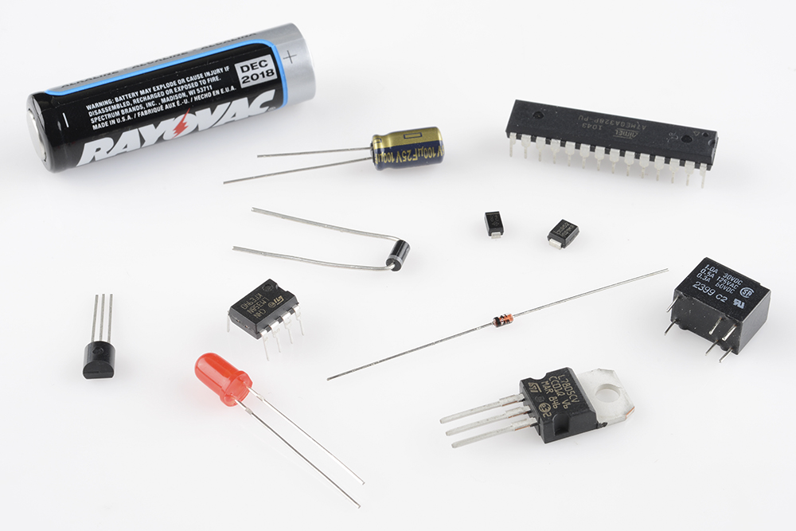

極性は非常に重要な概念であり、特に実際に回路を組み立てる場面で重要になる。
ブレッドボードに部品を差し込むときも、PCBにはんだ付けするときも、E-テキスタイルの作品に部品を縫い込むときも、極性を持つ部品を見分け、正しい向きで接続できることが欠かせない。
このチュートリアルでは、どの部品に極性があってどの部品にはないのか、部品の極性をどう見分けるのか、そしていくつかの部品について実際に極性をテストする方法を説明する。

参考になるチュートリアル:

- [テスターの使い方](./how-to-use-a-multimeter.md)
- [回路とは何か](./what-is-a-circuit.md)
- [電圧、電流、抵抗とオームの法則](./voltage-current-resistance-and-ohms-law.md)
- [ブレッドボードの使い方](./how-to-use-a-breadboard.md)

## ダイオードとLEDの極性

> [!NOTE]
> ここでは、回路内の正の電荷を基準とした電流の向き（いわゆる「慣用電流」）を使って説明する。

[ダイオード](https://learn.sparkfun.com/tutorials/diodes)は一方向にしか電流を流さない部品であり、*常に*極性を持つ。
ダイオードには2つの端子があり、正極側は*アノード*、負極側は*カソード*と呼ばれる。

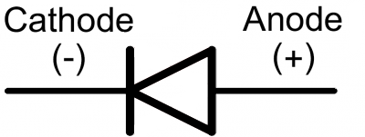

ダイオードを流れる電流は、アノードからカソードへの方向にしか流れない。
これが、ダイオードを正しい向きでつなぐことが重要な理由である。
物理的には、どのダイオードにもアノードかカソードのどちらかを示す目印が必ずついている。
たいていは**カソード側の端子付近に線**が入っており、これはダイオードの回路記号に描かれている縦線と対応している。

以下にいくつかダイオードの例を示す。
上にある[1N4001](http://www.sparkfun.com/products/8589)整流ダイオードは、カソード側に灰色のリングがある。
その下の[1N4148](http://www.sparkfun.com/products/8588)信号用ダイオードは、黒いリングでカソードを示している。
一番下には表面実装型のダイオードが2つあり、それぞれ線でカソード側のピンを示している。

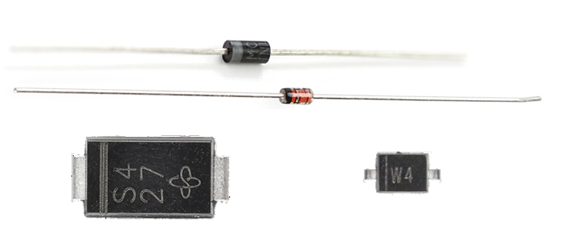

### LED

LEDは[発光ダイオード](./light-emitting-diodes-leds.md)の略であり、その名のとおりダイオードの仲間なので、やはり極性を持つ。
LEDの正極と負極のピンを見分ける方法はいくつかある。
**足の長いほう**を探すという方法があり、これはたいてい正極（アノード）側のピンを示している。

もし誰かが足を切りそろえてしまっていたら、LEDの外装にある平らな部分を探すとよい。
**平らな面**に近いほうのピンが、負極（カソード）側のピンになる。

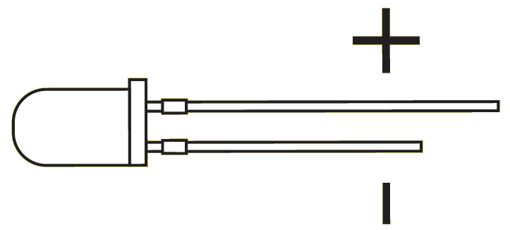

これら以外の目印がある場合もある。
SMDタイプのダイオードには、アノードとカソードを示すさまざまな表記方法がある。
[テスター（マルチメーター）](./how-to-use-a-multimeter.md)を使って極性を調べるのがもっとも簡単な場合も多い。
テスターをダイオードモード（たいていダイオードの記号で示されている）に切り替え、それぞれのプローブをLEDの端子に当ててみる。
LEDが点灯すれば、プラス側のプローブがアノードに、マイナス側のプローブがカソードに触れていることになる。
点灯しなければ、プローブを入れ替えて試してみればよい。

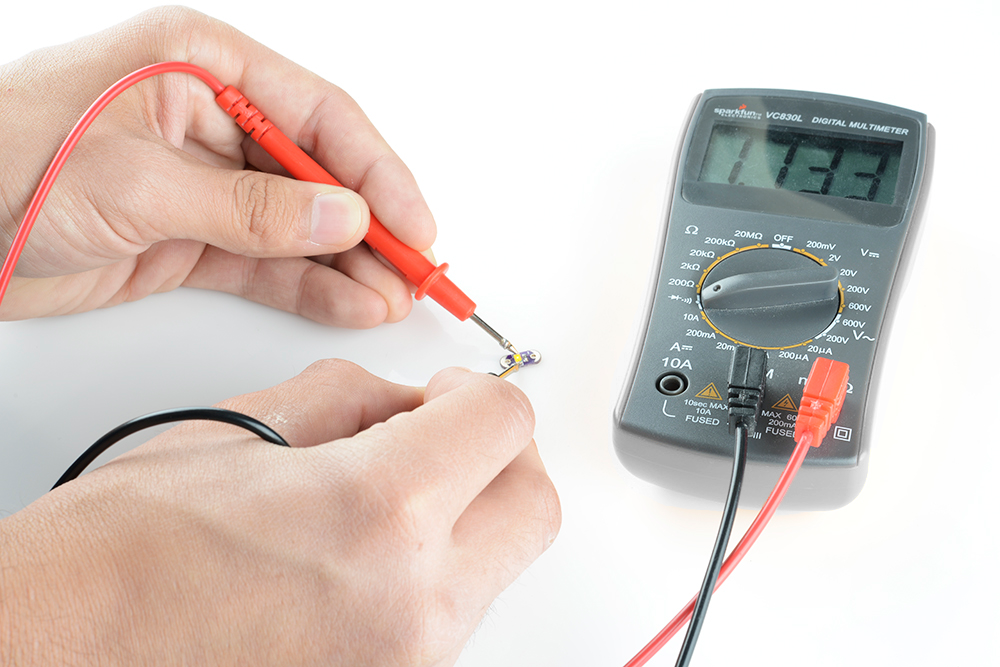

極性を持つ部品は、ダイオードだけではない。
間違った向きにつなぐと動作しない部品は他にもたくさんある。
次は、集積回路をはじめとする、他のよくある極性を持つ部品について見ていこう。

## 集積回路の極性

集積回路（IC）には8本のピンのものもあれば80本のピンのものもあり、それぞれのピンには固有の役割と位置がある。
ICでは極性をきちんと守ることが非常に重要である。
間違った向きにつなぐと、煙を上げて溶け、壊れてしまう可能性が高い。

スルーホール型のICは、たいていDIP（デュアルインラインパッケージ）と呼ばれる、ブレッドボードの中央をまたげるように0.1インチ間隔で2列に並んだピン配置になっている。
DIPタイプのICには、多数あるピンのうちどれが1番ピンかを示す**切り欠き**があることが多い。
切り欠きがない場合は、ケースの1番ピン付近に刻印された**丸い印**があることもある。

どのICパッケージでも、1番ピンから反時計回りに進むにつれてピン番号が順に増えていく。

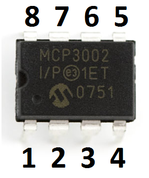

表面実装型のICには、QFN、SOIC、SSOPなど、さまざまな形状のパッケージがある。
これらのICでは、たいてい1番ピンの近くに**丸い印**がついている。

## 電解コンデンサ

[コンデンサ](./capacitors.md)のすべてが極性を持つわけではないが、極性を持つコンデンサでは、その極性を間違えないことが*非常に*重要である。

セラミックコンデンサ（1µF以下の小さな、たいてい黄色い部品）は極性を**持たない**。
どちら向きに差し込んでもかまわない。

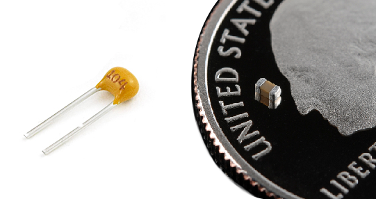

小さな缶のような見た目をした電解コンデンサ（電解液を使っていることに由来する名前である）は**極性を持つ**。
コンデンサの負極側のピンは、たいてい**「-」の表示**や、缶に沿った**カラーストライプ**で示されている。
正極側の足のほうが**長く**なっていることもある。

以下は[10µF](https://www.sparkfun.com/products/523)（左）と[1mF](https://www.sparkfun.com/products/8982)の電解コンデンサで、どちらも負極側の足に「-」の表示があり、正極側の足のほうが長くなっている。

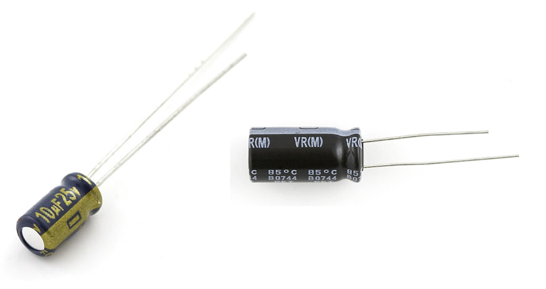

電解コンデンサに長時間逆向きの電圧をかけ続けると、短くも派手な、そして致命的な故障を引き起こす。
「ポン」という音とともに、コンデンサの上部が膨らむか、破裂する。
そうなったコンデンサは二度と使い物にならず、ショート回路のようにふるまうようになる。

## その他の極性を持つ部品

### 電池と電源

回路の極性を正しく保つことは、結局のところ[電源](https://learn.sparkfun.com/tutorials/how-to-power-a-project)を正しく接続することに尽きる。
プロジェクトの電源がACアダプターであれ、リポ電池であれ、うっかり逆向きに接続して、-9Vや-4.2Vをプロジェクトに加えてしまわないよう注意することが重要である。

電池を交換したことのある人なら、その極性の見分け方はよく知っているだろう。
たいていの電池は、「+」または「-」の記号で正極と負極の端子を示している。
赤い線が正極、黒い線が負極を表していることもある。

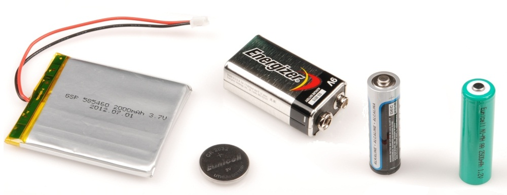

電源には、たいてい標準化された[コネクタ](https://learn.sparkfun.com/tutorials/connector-basics)が使われており、そのコネクタ自体にも極性があることが多い。
たとえば[バレルジャック](https://www.sparkfun.com/products/119)には内側と外側の2つの導体があり、内側（中心）の導体がたいてい正極側になる。
[JST](https://www.sparkfun.com/products/8613)のような一部のコネクタは、逆向きには差し込めないよう**キー溝**の形で作られている。

逆接続に対する追加の保護として、ダイオードやMOSFETを使った[逆接保護回路](./diodes.md)を追加することもできる。

### トランジスタ、MOSFET、電圧レギュレータ

これらは（伝統的には）3端子の極性を持つ部品であり、パッケージの形状が似ているためひとまとめに扱われることが多い。
スルーホール型の[トランジスタ](https://learn.sparkfun.com/tutorials/transistors)やMOSFET、電圧レギュレータは、たいていTO-92やTO-220というパッケージで提供される。
どのピンが何かを知るには、TO-92パッケージの平らな面や、TO-220パッケージの金属製の放熱板を目印にし、データシートのピン配置図と照らし合わせる。

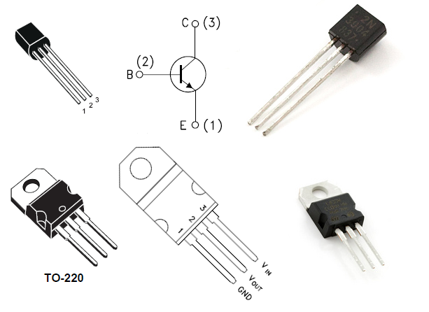

### その他

ここまでで紹介したのは、極性を持つ部品のほんの一部にすぎない。
[抵抗器](./resistors.md)のように本来極性を持たない部品でも、極性を持つパッケージに入っていることがある。
5個程度の抵抗器があらかじめまとめられた抵抗アレイは、その一例である。

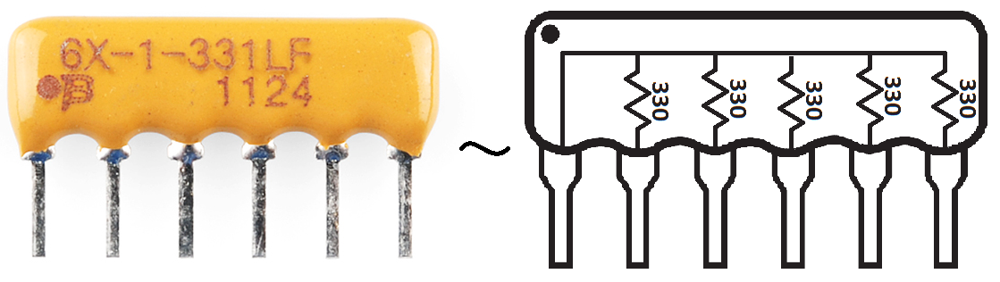

幸い、極性を持つ部品には、どのピンが何かを教えてくれる何らかの目印が必ず用意されている。
必ず**データシートを確認**し、ケースについている丸印やその他の目印もあわせてチェックするようにしたい。

## まとめ

極性とは何か、そしてそれをどう見分けるかがわかったところで、関連するチュートリアルにも目を通してみてほしい。

- [コネクタの基礎](./connector-basics.md)：コネクタの中にも、それ自体が極性を持つものが数多くある。電源やその他の信号を逆向きに加えてしまわないようにする、優れた手段になっていることが多い。
- [ダイオード](./diodes.md)：部品の極性を語るうえでの代表例である。このチュートリアルでは、ダイオードの動作原理や種類についてさらに詳しく扱っている。
- [LilyPadデザインキット実験1](https://learn.sparkfun.com/tutorials/ldk-experiment-1-lighting-up-a-basic-circuit)：回路はブレッドボードや基板の上だけに存在するわけではなく、シャツなどの布に縫い込むこともできる。LilyPadデザインキットのチュートリアルで始め方を確認してほしい。LEDを正しく配線するうえで、極性の知識が大いに役立つ。

タグ: 概念、電気工学

---

出典：[Polarity](https://learn.sparkfun.com/tutorials/polarity)（SparkFun Learn）を日本語に翻訳し、再構成した。
原文は [CC BY-SA 4.0](https://creativecommons.org/licenses/by-sa/4.0/) ライセンスで公開されており、本ページも同ライセンスの下で提供する。
