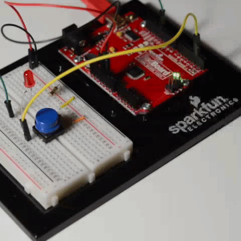
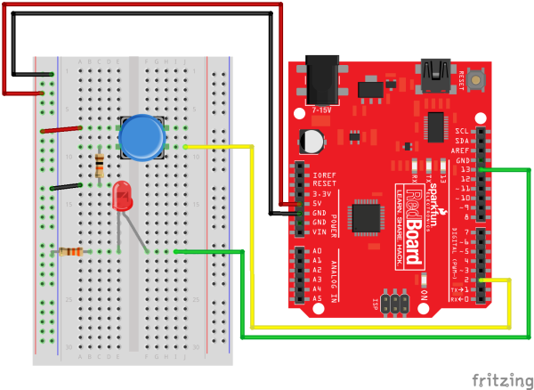
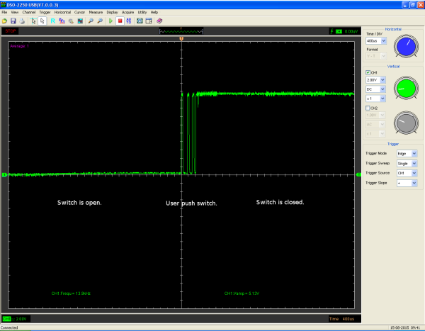
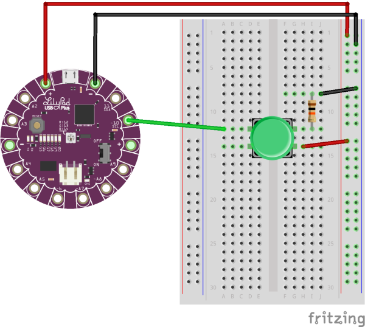
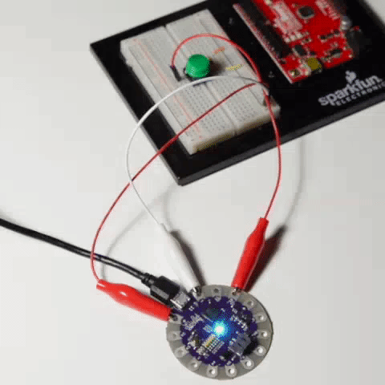

# Arduinoにおけるプロセッサ割り込み

## はじめに

**割り込み**とは何だろうか。日常的な意味では、今やっている作業を時々邪魔してくる人のことを指す。それはそれで的を射ているかもしれないが、ここで本当に知りたいのは、組み込み電子工作やマイクロプロセッサの文脈における割り込みが何を指すかである。

改めて問い直そう。割り込みとは何だろうか。
一言で言えば、プロセッサが通常のプログラムを実行しながら、同時に何らかのイベント、つまり割り込みを常に監視できるようにする仕組みのことである。
割り込みには2つの種類がある。

- **ハードウェア割り込み**：ピンがハイやローに変化するような、外部のイベントに応じて発生する。
- **ソフトウェア割り込み**：ソフトウェアの命令に応じて発生する。

一般に、たいていの8ビットAVRマイクロコントローラ（Arduinoなど）は、本来的にはソフトウェア割り込みに対応していない。そのため、このチュートリアルではハードウェア割り込みに焦点を当てる。



参考になるチュートリアル:

以下の概念に馴染みがなければ、続きを読む前にこれらのチュートリアルを確認しておくことをおすすめする。

- [Arduinoとは何か](./what-is-an-arduino.md)
- [Arduino IDEのインストール](https://learn.sparkfun.com/tutorials/installing-arduino-ide)
- [FTDIドライバのインストール方法](https://learn.sparkfun.com/tutorials/how-to-install-ftdi-drivers)

## どうやって動作するのか

イベント、つまり割り込みが発生すると、プロセッサはただちにそれに気づき、現在の実行状態を保存し、小さなコードの塊（**割り込みハンドラ**や**割り込みサービスルーチン**と呼ばれることが多い）を実行してから、元々行っていた処理へと戻る。

プログラマーは、特定の割り込みが発生したときに実行したいコードを、プログラム自体の中で定義する。
Arduinoでは、これを`attachInterrupt()`という関数で行い、推奨される構文はおおむね次のようになる。

```cpp
attachInterrupt(digitalPinToInterrupt(pin), ISR, mode)
```

この関数は、3つの引数を受け取る。

- **第1引数（`digitalPinToInterrupt(pin)`）**：割り込みのピン番号であり、マイクロプロセッサにどのピンを監視すべきかを伝える。ピンは使用しているマイクロコントローラによって異なる。
- **第2引数（`ISR`）**：この割り込みが発生したときに実行したいコードの場所。
- **第3引数（`mode`）**：どのような種類のトリガーを検出するかを指定する。論理ハイ、論理ロー、あるいはその間の遷移である。

割り込み用に予約されているピンや、いくつかのサンプルコードについては、Arduinoの[attachInterrupt()のページ](https://www.arduino.cc/reference/en/language/functions/external-interrupts/attachinterrupt/)を参照してほしい。

[Arduino.cc: attachInterrupt()](https://www.arduino.cc/reference/en/language/functions/external-interrupts/attachinterrupt/)

> [!NOTE]
> 注：使用しているAVRマイクロコントローラのデフォルトのピン一覧にない、別のピンを割り込みとして使いたい場合は、[PinChangeInt Arduinoライブラリ](https://github.com/GreyGnome/PinChangeInt)を試してみるとよい。このライブラリは、AVRベースのArduinoであれば、どのピンにもピン変化割り込みを追加できる代替手段を提供してくれる。
>
> [Arduino.cc: PinChangeInt Library](https://playground.arduino.cc/Main/PinChangeInt/)

## ハードウェアの接続

以下のセクションでは、割り込みとその仕組みをよりよく理解するための、簡単な例を見ていく。
実際に試したい場合は、[SparkFun RedBoard](https://www.sparkfun.com/products/13975)、[LED](https://www.sparkfun.com/products/9590)、[ボタン](https://www.sparkfun.com/products/14460)、[330Ωの抵抗](https://www.sparkfun.com/products/14490)、[ジャンパーワイヤー](https://www.sparkfun.com/products/8431)、そしてすべてに電源を供給する[ケーブル](https://www.sparkfun.com/products/13243)を用意してほしい。

以下のFritzing図のように、LEDを13番ピンに、ボタンを2番ピンに接続する。



今接続したものをよく見てみると、実はLEDが冗長であることに気づくはずである。13番ピンに内蔵されたLEDをそのまま使うことも*できる*が、見た目をわかりやすくするため、外付けのLEDを追加している。

## 例：単純な割り込み

> [!NOTE]
> 注：この例では、デスクトップに最新版のArduino IDEがインストールされていることを前提としている。Arduinoを初めて使う場合は、[Arduino IDEのインストール](https://learn.sparkfun.com/tutorials/installing-arduino-ide)のチュートリアルを確認してほしい。

ハードウェアの接続が終わったところで、LEDに常に「オフ」信号を送り続ける、単純な例を見てみよう。
2番ピンに割り込みを設定する。このピンはボタンを監視しており、押されるとLEDへ「オン」信号を送り、カウンタをインクリメントする。

たいていのArduinoには、2つの外部割り込みが標準で内蔵されている。**interrupt0**（デジタル2番ピン）と**interrupt1**（デジタル3番ピン）である。
（Arduino Mega 2560のように）もっと多くの割り込みを持つ基板もあるので、使用している基板が具体的に何をサポートしているかは、ユーザーマニュアルやデータシートを確認してほしい。
Arduinoの[attachInterrupt()のページ](https://www.arduino.cc/reference/en/language/functions/external-interrupts/attachinterrupt/)にも、いくつかの基板についてのより詳しい情報がある。
ここではRedBoardを使うので、この例では割り込みの監視に2番ピンを使う。

### 単純な割り込みの例1

RedBoard用のボードとCOMポートを選択する。そして、以下のコードを書き込む。

```cpp
/*
Simple Interrupt Example 1
by: Jordan McConnell
SparkFun Electronics
created on 10/29/11
*/

int ledPin = 13;  // LEDはデジタル13番ピンに接続されている
int x = 0;  // 割り込みによって更新される変数

void setup() {
  //割り込み0（2番ピン）を有効にする。ここにはボタンが接続されている
  //立ち下がりエッジでincrement関数に移動する
  pinMode(ledPin, OUTPUT);
  attachInterrupt(0, increment, RISING);
  Serial.begin(9600);  //シリアル通信を開始する
}

void loop() {
  digitalWrite(ledPin, LOW);
  delay(3000); //何か有用な処理をしているふりをする
  Serial.println(x, DEC); //xをシリアルモニタに出力する
}

// 割り込み0用の割り込みサービスルーチン
void increment() {
    x++;
    digitalWrite(ledPin, HIGH);
}
```

このプログラムのメインループは、3秒ごとにLEDへ「OFF」信号を送る。
その一方で、このプログラムはデジタル2番ピン（割り込み0に対応する）で立ち上がりエッジを監視している。
つまり、電圧が論理ロー（**0V**）から論理ハイ（**5V**）へ変化するのを検知しており、これはボタンが押されたときに起こる。
これが起きると、`increment`関数が呼び出される。
この関数の中のコードが実行され、変数xがインクリメントされ、LEDが点灯する。
その後、プログラムはメインループの元の場所へと戻る。

実際にいろいろ試してみると、LEDが点灯している時間は一見ランダムに見えるが、決して3秒を超えることはないとわかるはずである。
LEDがどれだけの時間点灯し続けるかは、メインループのコードのどこで割り込みが発生したかによって決まる。
たとえば、delay関数のちょうど中間地点で割り込みが発生した場合、ボタンを押してからおよそ1.5秒間LEDが点灯し続けることになる。


### チャタリングへの対処

割り込みでよくある問題の一つが、1回のイベントに対して複数回トリガーされてしまうことである。
例1のコードの[シリアル出力](./terminal-basics.md)を見ると、ボタンを1回しか押していなくても、xが何度もインクリメントされていることに気づくはずである。
なぜこうなるのかを探るには、信号そのものを見てみる必要がある。
ボタンを押した瞬間のピンの電圧をオシロスコープで監視すると、次のような波形になっているはずである。



画像提供：[AllAboutCircuits](https://www.allaboutcircuits.com/technical-articles/switch-bounce-how-to-deal-with-it/)

ピンの主な遷移はローからハイへの1回だが、その過程でいくつものスパイクが発生しており、これが複数回の割り込みを引き起こすことがある。
これは*ノイズ*や*バウンス（チャタリング）*と呼ばれる。
ボタンを押すという行為は一見1段階の動作に見えるが、実際にはボタン内部の機械的な部品が、ある状態に落ち着くまでに何度も接触を繰り返している。
これを解決する方法はいくつかある。
たいていは、適切なRCフィルタを追加して遷移を滑らかにすることで、ハードウェア側でバウンスの問題を解決できる。
もう一つの選択肢は、最初の割り込みが発生してから短い時間だけ、それ以降の割り込みを一時的に無視するという方法でソフトウェア側から対処することである。
先ほどの例に戻り、ボタンを1回押すたびに変数xが1回だけインクリメントされるよう、この修正を加えてみよう。

### 単純な割り込みの例2

まだ選択していなければ、RedBoard用のボードとCOMポートを選択する。そして、以下のコードを書き込む。

```cpp
/*
Simple Interrupt example 2
by: Jordan McConnell
SparkFun Electronics
created on 10/29/11
*/

int ledPin = 13; // LEDはデジタル13番ピンに接続されている
int x = 0; // 割り込みによって更新される変数

//直近の割り込みのタイミングを追跡するための変数
unsigned long button_time = 0;
unsigned long last_button_time = 0;

void setup() {
  //2番ピンを使う割り込み0を有効にする
  //立ち上がりエッジでincrement関数に移動する
  pinMode(ledPin, OUTPUT);
  attachInterrupt(0, increment, RISING);
  Serial.begin(9600);  //シリアル通信を開始する
}

void loop() {
  digitalWrite(ledPin, LOW);
  delay(3000); //何か有用な処理をしているふりをする
  Serial.println(x, DEC); //xをシリアルモニタに出力する
}

// 割り込み0用の割り込みサービスルーチン
void increment() {
  button_time = millis();
  //increment()が直近250ミリ秒以内に呼ばれていないか確認する
  if (button_time - last_button_time > 250)
  {
    x++;
    digitalWrite(ledPin, HIGH);
    last_button_time = button_time;
  }
}
```

ボタンを押しながら、もう一度シリアル出力を見てみよう。**9600**ボーに設定したシリアルモニタを開く。
今度は、ボタンを押すたびにincrementが1回だけ呼び出されているのがわかるはずである。
この修正がうまくいくのは、割り込みハンドラが実行されるたびに、`millis()`関数で取得した現在時刻と、ハンドラが最後に呼び出された時刻を比較しているからである。
それが、あらかじめ決められた時間の範囲内（この場合は4分の1秒）であれば、プロセッサは直前に行っていた処理へすぐに戻る。
そうでなければ、`if`文の中のコードを実行して変数`x`を更新し、LEDを点灯させ、`last_button_time`変数を更新する。これによって、次に割り込みが発生したときに比較できる新しい値が用意される。

### 割り込みの優先度

2つの割り込みが同時に発生した場合はどうなるだろうか。
たいていのAVRは、いわゆる*割り込み優先度*には対応していない。
2つの割り込みが同時に発生した場合や、2つ以上の割り込みがキューで待機している場合、優先度はそれぞれのベクタアドレスの順序によって決まる。
ベクタアドレスが小さいほうが先に処理され、*リセット*はすべての割り込み要求より優先される。
ここでも、具体的な基板についての詳しい情報は、データシートを確認してほしい。

## 例：LEDシーケンスへの割り込み

割り込みは、長いシーケンスを扱う際にも役立つことがある。
LEDを使ったもう一つの単純な例を見てみよう。[LilyPad USB Plus](https://www.sparkfun.com/products/14631)に内蔵されたRGB LEDを使って、色のシーケンスを巡回させ、それぞれの色をフェードイン・フェードアウトさせるとしよう。
各色のフェードサイクルの時間は10秒で、この基板を何台もステージ衣装に縫い付けているとする。
もし、どれか一台の衣装が同期からずれてしまったらどうなるだろうか。

サイクルが終わるのを待って、他の基板と同期を取り直そうとする代わりに、10番ピン（LilyPad USB Plus基板ではこれが割り込み0にあたる）に割り込みを追加できる。
ボタンが押されると割り込みが発生し、次の色へ進む。
これによって、ずれてしまった衣装を素早く同期させることができ、ショーを止めずに済む。

実際に自分の手でやってみよう。実際に試したい場合は、[LilyPad USB Plus](https://www.sparkfun.com/products/14631)を用意してほしい。
前回の実験で使ったボタン、ジャンパー、電源も必要になる。
さらに、LilyPadの縫い付けタブに接続するための、[ワニ口クリップ付きのピッグテールワイヤー](https://www.sparkfun.com/products/14303)もいくつか必要になる。

次のように、すべてを接続する。



> [!NOTE]
> 警告：LilyPad USB Plusを使う場合は、必ず[LilyPadのボード定義をインストール](https://learn.sparkfun.com/tutorials/lilypad-usb-plus-hookup-guide#setting-up-arduino)しておくこと。それ以外の方法としては、RedBoardとコモンカソードのLED（[拡散型](https://www.sparkfun.com/products/9264)または[クリアタイプ](https://www.sparkfun.com/products/105)）、そして電流制限抵抗を使うこともできる。その場合は、ピンの定義を書き換え、[必要に応じて接続を調整する](https://learn.sparkfun.com/tutorials/sik-experiment-guide-for-arduino---v33/experiment-3-driving-an-rgb-led)ことを忘れないこと。

**LilyPad USB Plus**用のボードとCOMポートを選択する。そして、以下のコードを書き込む。

```cpp
/*
Example: Interrupting an LED sequence
SparkFun Electronics

Follow the tutorial at:
https://learn.sparkfun.com/tutorials/processor-interrupts-with-arduino#example-interrupting-an-led-sequence

This code is released under the MIT License (http://opensource.org/licenses/MIT)

******************************************************************************/

// LilyPad USBPlusに内蔵されたLEDを使い、色のシーケンスを巡回させる。割り込みを使って素早く色を切り替える

// 内蔵LED：

int RGB_red = 12;
int RGB_green = 13;
int RGB_blue = 14;

int x = 0;  // 割り込みによって更新される変数

//フェード用の変数
int ledMode = 0; //LEDを制御する色モード
int colorSwitch = 0; //current_FadeValと比較し、まだ色を切り替えるべきでないかを確認する
int prev_FadeVal = 0;
int current_FadeVal = 0;
boolean increasing = true;

//直近の割り込みのタイミングを追跡するための変数
unsigned long button_time = 0;
unsigned long last_button_time = 0;


void setup() {

// LEDのピンをすべて出力にする：

  pinMode(RGB_red, OUTPUT);
  pinMode(RGB_green, OUTPUT);
  pinMode(RGB_blue, OUTPUT);
  attachInterrupt(0, increment, CHANGE);
  Serial.begin(9600);  //シリアル通信を開始する

}

void loop()
{
  // このコードでは、7色の虹色（三原色、その中間色、さらにその中間色）を順番にたどっていく。

  // HIGH（オン）かLOW（オフ）しか取れないdigitalWriteと異なり、
  // analogWriteを使えば0（オフ）から255（フル点灯）まで明るさを滑らかに変化させられる。
  // RGB LEDにanalogWriteを使えば、何百万通りもの色を作り出せる。


  FadeColor();
}

// 割り込み0用の割り込みサービスルーチン
void increment() {

  button_time = millis();

  //increment()が直近250ミリ秒以内に呼ばれていないか確認する
  if (button_time - last_button_time > 250)
  {
    //カウンタをインクリメントする
    x++;

    //LEDを消灯する
    analogWrite(RGB_red,0);
    analogWrite(RGB_green,0);
    analogWrite(RGB_blue,0);

    Serial.println(x, DEC); //xをシリアルモニタに出力する
    delay(10000);

    //直近のボタン押下時刻を現在の時刻に更新する
    last_button_time = button_time;

    //色を切り替える
    if (ledMode < 7){
      ledMode++;
    }
    else {
      //赤からやり直す
      ledMode = 1;
    }

    //フェードの値をリセットする
    prev_FadeVal = 0;
    current_FadeVal = 0;

  }
}

void FadeColor() {
  switch (ledMode) {
    case 1://赤をフェードさせる
      analogWrite(RGB_green, 0);
      analogWrite(RGB_blue, 0);
      analogWrite(RGB_red, prev_FadeVal);
      break;
    case 2://黄色をフェードさせる
      analogWrite(RGB_red, prev_FadeVal);
      analogWrite(RGB_green, prev_FadeVal);
      analogWrite(RGB_blue, 0);
      break;
    case 3://緑をフェードさせる
      analogWrite(RGB_red, 0);
      analogWrite(RGB_green, prev_FadeVal);
      analogWrite(RGB_blue, 0);
      break;
    case 4://明るい青をフェードさせる
      analogWrite(RGB_red, 0);
      analogWrite(RGB_green, prev_FadeVal);
      analogWrite(RGB_blue, prev_FadeVal);
      break;
    case 5://青をフェードさせる
      analogWrite(RGB_red, 0);
      analogWrite(RGB_green, 0);
      analogWrite(RGB_blue, prev_FadeVal);
      break;
    case 6://マゼンタをフェードさせる
      analogWrite(RGB_red, prev_FadeVal);
      analogWrite(RGB_green, 0);
      analogWrite(RGB_blue, prev_FadeVal);
      break;

    default:
      analogWrite(RGB_red, prev_FadeVal);
      analogWrite(RGB_green, prev_FadeVal);
      analogWrite(RGB_blue, prev_FadeVal);
      break;
  }
  delay(100);

  if (increasing == true) {
    current_FadeVal += 5;
  }
  else { //減少中
    current_FadeVal -= 5;
  }

  if (current_FadeVal > 255) {
    increasing = false;
    prev_FadeVal -= 5;//加算を取り消す
    current_FadeVal = prev_FadeVal;

  }
  else if (current_FadeVal < 0) {
    increasing = true;
    prev_FadeVal += 5;//減算を取り消す
    current_FadeVal = prev_FadeVal;
  }

  prev_FadeVal = current_FadeVal;

  if(current_FadeVal == colorSwitch)
  {
    if (ledMode < 7){
      ledMode++;
    }
    else {
      //赤からやり直す
      ledMode = 1;
    }
  }
}
```

ボタンを押すたびに、次の色へ切り替わることに注目してほしい。
それほど一般的な用途ではないかもしれないが、割り込みが即座に必要な処理へ対応する様子が、視覚的にはるかにわかりやすい例になっている。



## 割り込みの利点は何か

ここまで読んで、「そもそもなぜ割り込みを使う必要があるのか。2番ピンをときどき`digitalRead()`でチェックすれば済むのではないか。同じことができるのではないか」と疑問に思うかもしれない。

答えは状況による。
コードの中のある特定の時点や、ある時間の範囲でのピンの状態だけが気になるのであれば、`digitalRead()`で十分だろう。
ピンを常に監視したい場合は、`digitalRead()`を頻繁にポーリングすることもできる。
しかし、ポーリングとポーリングの間のデータを見落としてしまうことは十分にありうる。
この見落とされた情報が、多くのリアルタイムシステムでは致命的になりかねない。
それだけでなく、データをポーリングする頻度が高くなるほど、有用なコードを実行する代わりにその処理に費やされるプロセッサの時間も増えていく。

タイミングが重要になる例として、車のアンチロックブレーキシステムを監視・制御するシステムを考えてみよう。
センサーが車のトラクションが失われ始めたことを検知した場合、現在プログラムのどの部分が実行されているかなど気にしていられない。車がトラクションを保ち、事故（あるいはそれ以上の事態）を避けられるよう、即座に何らかの対応が必要だからである。
この状況でセンサーを単純にポーリングしていたら、ポーリングのタイミングが遅すぎて、そのイベントを完全に見逃してしまうこともありうる。
割り込みの優れた点は、必要な瞬間に即座に処理を開始できることにある。

## まとめ

割り込みの仕組みが少しよくわかったところで、次のプロジェクトで使ってみることはできるだろうか。
割り込みについてさらに情報が欲しい場合は、次のリンクも参考にしてほしい（いずれも英語）。

- [GitHub Link for Examples](https://github.com/sparkfun/processor_interrupt_examples)：このチュートリアルで使ったサンプルコード。
- Arduino.cc
  - [attachInterrupt()](https://www.arduino.cc/reference/en/language/functions/external-interrupts/attachinterrupt/)：割り込み用に予約されているピンの情報と、いくつかのサンプルコード。
  - [PinChangeInt Library](https://playground.arduino.cc/Main/PinChangeInt/)：AVRベースのArduinoのどのピンにもピン変化割り込みを追加できる代替手段。
    - [GitHub Library Repo](https://github.com/GreyGnome/PinChangeInt)

Shawn Hymel氏も、割り込みについての楽しく有益な動画チュートリアルをいくつか公開している。ぜひチェックしてみてほしい。

さらに多くのプロセッサ割り込みの例を見たい場合は、次のチュートリアルも参考にしてほしい（いずれも英語）。

- [Sound Detector Hookup Guide](https://learn.sparkfun.com/tutorials/sound-detector-hookup-guide)：バイナリ出力を持つマイクである、Sound Detectorの仕組みと使い方。
- [APDS-9960 RGB and Gesture Sensor Hookup Guide](https://learn.sparkfun.com/tutorials/apds-9960-rgb-and-gesture-sensor-hookup-guide)：色・近接・ジェスチャーセンサーAvago APDS-9960の入門ガイド。
- [ADXL345 Hookup Guide](https://learn.sparkfun.com/tutorials/adxl345-hookup-guide)：加速度センサーADXL345の使い方。
- [Getting Started with MicroPython and the SparkFun Inventor's Kit for micro:bit](https://learn.sparkfun.com/tutorials/getting-started-with-micropython-and-the-sparkfun-inventors-kit-for-microbit)：micro:bitでMicroPythonを学ぶ。

タグ: Arduino、概念、プログラミング

---

出典：[Processor Interrupts with Arduino](https://learn.sparkfun.com/tutorials/processor-interrupts-with-arduino)（SparkFun Learn）を日本語に翻訳し、再構成した。
原文は [CC BY-SA 4.0](https://creativecommons.org/licenses/by-sa/4.0/) ライセンスで公開されており、本ページも同ライセンスの下で提供する。
