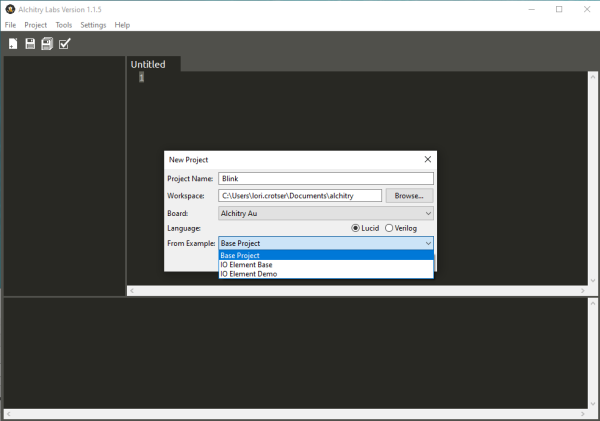
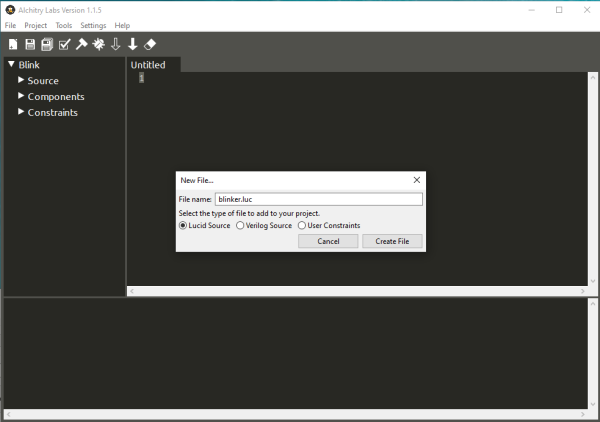
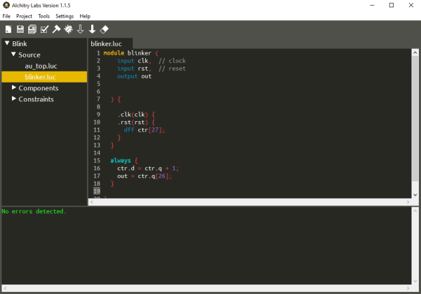
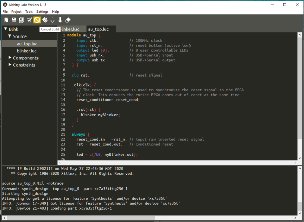
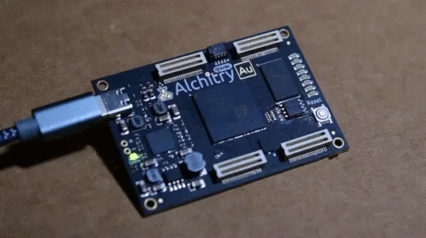

# FPGAをプログラムする

## はじめに

このチュートリアルでは、[FPGA](https://www.sparkfun.com/fpga)向けの設計を作るとはどういうことか、そしてそこで使う基本的な構成要素について、基礎を扱う。
本題に入る前に、一つだけはっきりさせておきたいことがある。FPGAを「プログラムする」というのは、実は正確な表現ではない。
テキストを書き、そのテキストがバイナリファイルに変換され、そのバイナリファイルがFPGAに読み込まれるという流れが、なんとなくプログラミングのように感じられるため、便宜的に「プログラムする」と言うことが多いだけである。

しかし、実際に書いているのはプログラムではない。作っているのは回路である。
回路を作るのにプログラミング言語は使わない。使うのは**ハードウェア記述言語（HDL）**である。

大規模で複雑な設計を回路図として描いていては、あまりにも複雑になりすぎてしまう。
そこで、回路に望む振る舞いを記述し、それを実際にどう実装するかはツールに任せることになる。

FPGA向けの設計を作る際に忘れてはならないのは、自分が記述しているのはハードウェアであり、書いたものは最終的に物理的な回路になるという点である。
実装が不可能な回路を記述してしまうこともあれば、一見単純に見えて、実装には膨大なリソースを必要とする回路を記述してしまうこともある。

このため、自分が記述しようとしている回路が実際にどう実装されうるかを、しっかりとイメージしておくことが極めて重要である。

### 必要な部品

このチュートリアルの内容を試すには、AlchitryのFPGA開発ボード（Alchitry CuまたはAlchitry Au／Au+）が必要になる。手元にあるものによっては、すべてが必要になるとは限らない。

参考になるチュートリアル:

以下の概念に馴染みがなければ、続きを読む前にこれらのチュートリアルを確認しておくことをおすすめする。

- [FPGAはどうやって動いているのか](./how-does-an-fpga-work.md)

Alchitryの他のチュートリアルも参考になるだろう。

- [Learning FPGAs: Digital Design for Beginners with Mojo and Lucid HDLの抜粋](https://cdn.shopify.com/s/files/1/2702/8766/files/Lucid_Reference.pdf?5280018026990691420)
- [Alchitry Au+ 回路図（PDF）](https://cdn.sparkfun.com/assets/a/2/2/0/a/alchitry_au_sch_update-2.pdf)
- [Alchitry Au 回路図（PDF）](https://cdn.sparkfun.com/assets/a/2/2/0/a/alchitry_au_sch_update-2.pdf)
- [Alchitry Cu 回路図（PDF）](https://cdn.sparkfun.com/assets/d/5/d/b/a/alchitry_cu_sch_update-2.pdf)

## 設計の構造

[HDL](https://ja.wikipedia.org/wiki/%E3%83%8F%E3%83%BC%E3%83%89%E3%82%A6%E3%82%A7%E3%82%A2%E8%A8%98%E8%BF%B0%E8%A8%80%E8%AA%9E)はたいてい、モジュールという考え方を中心に構成されている。
モジュールとは、いくつかの入力と出力を持ち、それらをつなぐ何らかのロジックを含んだ回路ブロックのことである。
モジュールはサブモジュールを含むこともあれば、単独で完結していることもあり、プログラムが関数に分割されるのとよく似ている。

設計全体を1つのモジュールに詰め込むことも不可能ではないが、設計の各部分をそれぞれ小さなモジュールで表すほうが、望ましい設計方法である。
プロジェクトをモジュールに分割することで、ある時点で取り組んでいる部分の複雑さを抑えられる。
中には、よく使われる共通の処理を行うモジュールとして作り、何度も再利用されるものもある。

設計に着手する際は、さまざまなモジュールとそれらがどうつながっているかを示すブロック図を描いておくと役立つことが多い。
これによって設計の範囲が定まり、論理的に分解しやすくなる。

いったん書き始めてしまうと、設計全体の流れを大きく変更するのは難しくなるため、全体のアーキテクチャについては、書き始める前にできるだけ計画を練っておくほうがよい。

## Lucid

このチュートリアルの残りの部分では、[Lucid](https://alchitry.com/pages/lucid-fpga-tutorials)を使う。
LucidはFPGA専用に作られたHDLであり、VerilogやVHDLなど他のHDLによくある落とし穴の多く（実際、本当にたくさんある）を取り除くように設計されている。

> [!NOTE]
> 注意：Alchitryの基板を扱ったことがない場合は、このチュートリアルを続ける前に、[Alchitryの公式サイト](https://alchitry.com/tutorials/)でセットアップを済ませておく必要がある。

Lucidは、FPGAに触れ始めるのに最適な場所である。
Lucidに縛られてしまうことを心配したり、何らかの理由でいきなりVerilogやVHDLに飛び込みたがったりする人からよく連絡をもらう。
初めて触れるのであれば、Lucidから始めるべきである。他の扱いにくいHDLと格闘する前に、ハードウェア設計の正しい基礎を学べるはずである。

いずれ別の言語に乗り換えたくなったとしても、それほど難しくはない。
Lucidはおおまかにverilogをもとにしており、自分の作った洗練されたモジュールを他の場所で使いたい場合、Alchitry LabsがLucidをVerilogに変換してくれる。

前置きはこのくらいにして、モジュールを構成する要素について見ていこう。

## モジュールの構造

どんな設計を作る場合でも、トップレベルモジュールというものが存在する。
これは、その入力と出力が実際にFPGAのピンにおける入出力そのものになる、特別なモジュールである。
Alchitryのプロジェクトでは、使用している基板（CuかAu）に応じて、それぞれ`cu_top.luc`または`au_top.luc`という名前になる。

どちらの基板でも、初期状態のトップレベルモジュールはほぼ同じ見た目である。

```lucid
module au_top (
    input clk,              // 100MHzクロック
    input rst_n,            // リセットボタン（負論理）
    output led [8],         // ユーザーが制御できる8個のLED
    input usb_rx,           // USB→シリアル入力
    output usb_tx           // USB→シリアル出力
  ) {

  sig rst;                  // リセット信号

  .clk(clk) {
    // reset_conditionerは、リセット信号をFPGAのクロックに同期させるために使う。
    // これにより、FPGA全体が同じタイミングでリセットから抜け出せる。
    reset_conditioner reset_cond;
  }

  always {
    reset_cond.in = ~rst_n; // 反転させた生のリセット信号を入力する
    rst = reset_cond.out;   // 整えられたリセット信号

    led = 8h00;             // LEDを消灯する

    usb_tx = usb_rx;        // シリアルデータをそのまま返す
  }
}
```

### ポート宣言

モジュールの最初のセクションは、ポート宣言である。
ここで、モジュールへの入力と出力を宣言する。

今回はトップレベルモジュールなので、これらは基板そのものの信号である。

```lucid
    input clk,              // 100MHzクロック
    input rst_n,            // リセットボタン（負論理）
    output led [8],         // ユーザーが制御できる8個のLED
    input usb_rx,           // USB→シリアル入力
    output usb_tx           // USB→シリアル出力
```

*led*入力の後ろに角括弧で数字が付いていることに気づいたかもしれない。
これによって、1つではなく8個の個別の入力が、配列としてひとまとめになる。
配列の構文については、後ほど詳しく扱う。

モジュールには、モジュールをカスタマイズするためのパラメータのリストを持たせることもできる。
このリストはここでは省略されている。トップレベルモジュールでは、パラメータは親モジュールがそれをインスタンス化する際に渡すものなので、意味を持たないからである。
*インスタンス化（instantiation）*という用語は、モジュールや他のリソースを設計に追加することを指す。
つまり、そのモジュールや他のリソースの*インスタンス*が作られるということである。

コードを書く場合、関数を呼び出すたびに、その関数が何回呼ばれても同じ命令の並びが繰り返し使われる。
しかし、モジュールをインスタンス化するたびに、そのモジュールを構成する回路全体が複製される。
同じリソースを複数のタスクで使い回したい場合、それをどう調整するかは設計者自身の仕事になる。

インスタンス化と言えば、たいてい、モジュールが必要とするものはポート宣言のすぐ後でインスタンス化する。

最初の行では、*sig*キーワードを使って信号を宣言している。

```lucid
  sig rst;                  // リセット信号
```

信号はメモリではない。値を保持することはない。
これはワイヤ（配線）だと考えるとよい。ワイヤには値が乗ることはあるが、実質的にはある点から別の点への接続にすぎない。

この設計では、信号*rst*を、*reset_conditioner*モジュールの出力のプレースホルダーとして使っている。
このモジュールをインスタンス化しているのが、次の数行である。

```lucid
 .clk(clk) {
    // reset_conditionerは、リセット信号をFPGAのクロックに同期させるために使う。
    // これにより、FPGA全体が同じタイミングでリセットから抜け出せる。
    reset_conditioner reset_cond;
  }
```

何かをインスタンス化するには、単純にそのリソースの名前の後に、この特定のインスタンスの名前を続けて書く。
つまり、`reset_conditioner reset_cond;`という行は、*reset_conditioner*モジュールの*reset_cond*という名前のインスタンスを作る。
このインスタンス化を包んでいるブロックは、接続ブロックと呼ばれる。
このブロックを使うと、複数のモジュールが持つ、ある共通の名前の入力やパラメータを、まとめて同じ信号に接続できる。

今回の場合、入力clkを、信号clk（自分のモジュールへの入力）に接続している。
構文は`.port(signal)`であり、*port*はインスタンス化するモジュール側の入力の名前、*signal*はそこに接続する信号である。

*reset_conditioner*モジュールには*clk*という名前の入力があるため、この入力は自分のモジュールの信号clkに直接接続される。

これは、次のようにインスタンス化の行で直接接続することもできる。

```lucid
reset_conditioner reset_cond(.clk(clk));
```

ここでそうしなかったのは、入力*clk*はほとんどすべてのモジュールに共通して存在するため、このようなブロックを用意しておけば、他にも*clk*に接続する必要のあるインスタンス化を簡単に追加できるようになるからである。

ほとんどすべてのモジュールには*clk*入力があり、たいていはリセット用の*rst*入力もある。
クロックとリセットが具体的に何に使われるかは、後ほど説明する。

同じ接続ブロックに複数の接続を追加することもできる。

```lucid
.clk(clk), .rst(rst) { … }
```

ブロックをネストさせることもでき、*clk*を使うすべてのブロックが*rst*も使うわけではないため、たいていモジュールの冒頭では次のような形がよく見られる。

```lucid
.clk(clk) {
    // clkのみを使うインスタンス化
    .rst(rst) {
        // rstとclkの両方を使うインスタンス化
    }
}
```

### alwaysブロック

次のセクションは*always*ブロックである。これがモジュールの核心部分にあたる。

alwaysブロックには、モジュール内で起きるロジックをすべて記述する。
ここには**組み合わせ論理**と呼ばれるものが含まれる。
組み合わせ論理とは、出力が現在の入力だけの関数になっているデジタル回路のことである。
内部状態やメモリを持たない。
わかりやすい例は加算回路である。出力は、現在入力されている2つの数値だけによって決まる。
以前に入力されていた数値や、何回数値を変更したかは関係ない。出力は常に現在の入力の関数である。

alwaysブロックの中には、文を書いていく。
文は主に4種類ある。*代入*、*if文*、*case文*、*forループ*である。

#### 代入

代入はもっともよく使われるものである。
左側に何らかの信号を置き、等号を挟んで式を書く。

```lucid
signal = expression;
```

これらの力の源は、式にある。
ここでは、ビットを操作するためのさまざまな演算子が使える。
**+**、**-**、***のような数学演算子も含まれる。
特に注意が必要なのは、除算の`/`で、式が動的な場合は使えないという点である。
これは、除算があまりにも複雑で、ツールが妥当なデフォルトの実装を自動的に用意できないためである。
除算自体は不可能ではないが、少し余計な手間と計画が必要になる。

#### if文

if文は、典型的な形をしている。

```lucid
if (expr) { … } else { … }
```

*if*に続く式が真（0以外）であれば、最初の行の並びが有効になる。
偽（0）であれば、elseブロックの行が有効になる。elseの部分は省略できる。

「有効になる」と言ったのであって、「実行される」とは言っていない点に注目してほしい。
if文やforループがあると、つい従来のプログラミングの発想に引きずられてしまいがちである。

if文は、ハードウェア上ではたいていマルチプレクサとして実現される。
何らかの式に基づいて、2つの入力のどちらかを単純に選んでいるだけである。

alwaysブロックの中で信号に値を代入する場合、条件がどうであれ、必ず値が代入されている必要がある。
つまりたいてい、if文の中である信号に値を代入したら、そのelse側にも対応する代入を用意しておく必要がある、ということになる。

この規則の唯一の例外は、dffやfsm型の*d*入力である。これらについては後述する。

常に値が代入されるようにするもう一つの方法は、alwaysブロックの冒頭で、妥当なデフォルト値を設定しておくことである。
次の疑似コードを見てみよう。

```lucid
led = 0;
if (button_pressed)
    led = 1;
```

ボタンが押されていないとき、ledの値は0である。
では、ボタンが押されたときはどうなるだろうか。ledはいったん0が代入され、その後1に更新されるのだろうか。いや、そうではない。

ボタンが押されているとき、ledは常に値1を持つ。alwaysブロックの中で後に書かれた代入は、それより前の代入より優先される。

このブロックは、常に、そして瞬時に評価されていると考えるとよい。

では、if文の前にデフォルト値がなかったとしたらどうなるだろうか。
ボタンが押されていないとき、ledはどんな値を持つだろうか。
以前の値をそのまま保持すると思いたくなるかもしれないが、信号は値を保持できないということを思い出してほしい。信号は単純に2点をつなぐワイヤのようなものである。

デフォルト値を0にしておけば、これをハードウェア上ではマルチプレクサとして実現できる。


この単純な例では、*led*信号と*button_pressed*信号をそのままつなぐだけでも同じ動作を実現できる。

#### case文

case文は、次のような構文になる。

```lucid
case(expr) {
    value: statement;
    value: statement;
    default: statement;
}
```

これはif文とまったく同じように動作するが、1つの式に対して多くの分岐を持たせる場合に、より単純に書ける方法である。
case文のvalueの部分は、何らかの定数でなければならない。
省略可能なdefault分岐は、それ以外すべてを受け止める役割を果たす。

通常のコードとは異なり、case文はif文を何個も並べる場合と比べて、性能上の利点はない。
あくまでコードのわかりやすさと利便性のためのものである。

#### forループ

最後にforループである。Lucidのforループは、CやJavaのforループと同じ構文を使うが、いくつか制限がある。

```lucid
for (init; eval; increment) { … }
```

たいてい、回路には直接現れないが記述の中で使う値を保持するためのvar型と一緒に使われる。

ハードウェアにおけるforループの大きな制約は、繰り返し回数が定数でなければならないという点である。

これは、ツールがループを展開できる必要があるためである。
forループは、そのコード部分をコピー＆ペーストで何度も繰り返し書くのと実質的に変わらないが、読みやすさの点でずっと優れている。
明確な理由がない限り、forループは避けるべきである。
forループを使うと、非常に大きく遅い回路をうっかり作ってしまいやすい。

### 数値

Lucidには、数値定数を定義する方法がいくつかある。もっとも簡単な方法は、単に14のように数字を書くことである。

単独の数字を見た場合、それは10進数（基数10）として扱われ、負の数でない限り、符号なし形式で表現するのに必要な最小限のビット数が使われる。

使用するビット数をより細かく制御したい場合は、数字の前に*xd*（*x*は使用したいビット数）を付ける。
たとえば、*8d14*は、10進数の14を8ビットで表したものになる。

*d*の代わりに*h*を使えば16進数（基数16）、*b*を使えば2進数（基数2）になる。
どちらの形式でも、文字の前にビット数を指定できる。

ビット数を省略した場合、16進数はデフォルトで1桁あたり4ビットが使われる。
たとえば、*h08*は2桁で書かれているため8ビットが使われる。値8自体は4ビットで表現できるにもかかわらずである。

2進数の場合、ビット数を明示的に指定しなければ、単純に桁数がそのままビット数になる。
つまり、*b101001*は6ビット幅になる。

10進数を*d*付きで書きつつビット数を省略した場合、*d*を省略したときとまったく同じ扱いになる。

### 配列

トップレベルモジュールの*led*入力のように、扱う信号の多くは複数ビットの信号になる。

配列内のビットには、`signal[bit]`という構文で個別にインデックスを付けてアクセスできる（*bit*は何らかの式）。
これが動的な値の場合、常に配列の範囲内に収まることを保証するのは、自分自身の責任である。

`[max:min]`という配列構文を使えば、ビットの部分集合にアクセスすることもできる。
ここでは、*min*から*max*までの範囲（両端を含む）のビットが選択される。
この構文を使う場合、両方の値とも定数である必要がある。

ビットの部分集合を動的に選びたい場合は、`[start+:width]`という構文を使うことができる。
ここで*start*は選択する最下位ビット、*width*はそこから上に向かって選択するビット数（*start*ビット自身を含む）である。
この構文では、*width*だけが定数である必要がある。
`[start-:width]`というわずかに異なる構文も使え、こちらは*start*が最下位ではなく最上位ビットになる。

Lucidの配列は多次元にすることもできる。
宣言する際は、次のように次元を追加していくだけでよい。

```lucid
sig my_array[dim1][dim2][dim3];
```

配列のすべての次元は、定数値で宣言する必要がある。

その後は、これまでと同じセレクタを使って配列にインデックスを付けられる。
ただし、サブ配列の選択は最後のセレクタとしてしか使えない点に注意してほしい。

## 順序論理とDFF

ここからが本当に面白いところである。組み合わせ論理は非常に重要だが、状態やメモリをまったく持たないシステムはかなり限られたことしかできない。

では、どうやってメモリを作るのだろうか。基本的には、何らかのフィードバックループが必要になる。
カウンタを作りたい場合、単純に直前の加算結果に1を足せばよい。

問題は、このループをどう制御するかである。
一見すると何の問題もないように思えるかもしれないが、深く考えていくと、次々と問題が明らかになっていく。

カウンタの例を見てみよう。

入力の片方を1に固定した加算器を使えば、これを作ることができる。
わかりやすさのため、これを1つのブロックにまとめておく。
その入力を出力に接続すれば、インクリメントするカウンタが作れるだろうか。


ここでいくつか疑問を投げかけてみよう。このカウンタはどんな値から始まり、どれだけの速さでカウントするのだろうか。

初期値は、回路にどう電源が投入されたか、回路がどうレイアウトされたかによって決まる。
おそらく、温度やその他の環境要因にも左右されるだろう。
天気によって回路の挙動が変わってしまうのは、誰も望まないはずである。

さらに悪いことに、この回路はそもそも正しく動作しない。
これは、加算回路が、複数ビットの出力を持つ他の多くの組み合わせ論理と同様に、途中の結果として誤った値を生成するからである。
加算器の場合、最下位ビットが最初に計算され、それに続く各ビットは、その前のビットの計算結果を使って計算される。

この結果が有効になるのを待つ仕組みが何もないため、途中の誤った値がそのまま加算器にフィードバックされ、さらに多くの誤った値を生み出し続け、最終的にはただのゴミを生成するだけの回路になってしまう。

では、これをどう解決すればよいだろうか。
単純に、フィードバックループのタイミングを制御する方法が必要になる。
ここで役立つのが、DFF、つまりD型フリップフロップである。

DFFが正確に何なのかを掘り下げる前に、クロックとは何かを説明しておこう。
クロックとは、単純に、ある一定の周波数で0と1を繰り返し切り替える信号のことである。


Alchitryの基板上のクロックは100MHz、つまり1秒間に1億回切り替わる。
この規則的な信号を使うことで、回路に時間の感覚を与えることができる。

0から1への遷移は立ち上がりエッジと呼ばれ、たいてい信号の中でもっとも重要な部分である。
これらのエッジは、上の画像では矢印で示されている。

DFFの話に戻ろう。


DFFは一種のメモリである。
入力Dと出力Qを持つ。
クロック入力が0から1に変化すると、その瞬間のDの値が保存され、次のクロックの立ち上がりエッジまでQに出力され続ける。

クロックの立ち上がりエッジとエッジの間でDが変化しても、Qの値は変わらないままである。

上の図では、DFFに任意のイネーブル信号とリセット信号も添えて示している。
イネーブルは、立ち上がりエッジでDFFが新しい値を取り込むのを止めるために使うことができる。
リセット信号は、Qの値を既知の値に強制するために使う。
FPGA上のDFFは、0または1にリセットされるよう設定できる。

このDFFを使って、カウンタのループを制御することができる。


これで、リセット信号を使って初期値を、たとえば0に設定できる。つまり、Qが0であることがわかっている。Qが0であれば、Dは1になる。

クロックの立ち上がりエッジで、QはDの値を取得する。つまりQは1になり、それによってDは2になる。

立ち上がりエッジのたびに、Qは1ずつ増えていく。これこそまさに求めていたものである。

クロックの周波数が、カウンタが増加する速さを決める。

もちろん、これにはいくつかの制約もある。
クロックは、Qが変化した後にDが更新される時間を確保できるくらい、十分に遅くなければならない。
加算器が生成する無効な途中結果の1つを、DFFに保存させたくはない。

加算器の出力値が有効になるまでに必要な時間は、*伝播*遅延と呼ばれる。
これは、入力の変化から出力が有効かつ安定するまでにかかる時間である。

追加するロジックが増えるほど、この遅延は長くなる。
遅延はまた、回路の製造に使われる技術の関数でもある。
ツールは各FPGAのモデルを持っており、使用するクロック周波数を伝えれば、タイミング要件が満たされるように設計のレイアウトを試みてくれる。

この例では、組み合わせ論理のブロックをループする1組のDFFを使っている。
より一般的なのは、あるDFFの組の出力を組み合わせ論理のブロックに通し、別のDFFの組へ送るという、パイプラインを作る形である。

どんな設計でも、もっとも長い伝播遅延がクロックの最大周波数を決める。
設計をおおむね均等な処理時間の組み合わせ論理ブロックに分割することで、クロック周波数を最適化できる。

タイミングの細かい話はかなり複雑になりうるが、たいていの設計では、設計全体で同じクロックを使い、法外に長い経路さえなければ、あとはツールがうまく処理してくれる。
100MHzであれば、DFFの間でかなり多くのことができる。
問題になりやすいのは、あまりに多くのものを1つの経路に鎖状につないでしまったり、大量の乗算を含めてしまったりした場合である。

FPGAのリソースの限界に近づくにつれて、タイミング要件を満たすのも難しくなっていく。
ツールが同じサイズのFPGAにより多くのものを詰め込む必要が出てくると、レイアウトの選択肢が減っていき、タイミング要件を満たせなくなることがある。

## LEDを点滅させる

ここまでの内容をすべて組み合わせて、LEDを点滅させるデモプロジェクトを作ってみよう。

> [!NOTE]
> 注意：Alchitryの基板を扱ったことがない場合は、このチュートリアルを続ける前に、[Alchitryの公式サイト](https://alchitry.com/tutorials/)でセットアップを済ませておく必要がある。

### 新しいプロジェクトを作る

[Alchitry Labs](https://alchitry.com/alchitry-labs/)で新しいプロジェクトを作り、From Exampleのドロップダウンから「Base Project」を選ぶ。



*画像をクリックすると拡大表示できる。*

ツールバーの新規ファイルアイコン（一番左のアイコン）をクリックし、*blinker.luc*という名前で新しいLucidソースファイルを作る。



*画像をクリックすると拡大表示できる。*

これで、次のような基本的なモジュールが作成される。

```lucid
module blinker (
    input clk,  // クロック
    input rst,  // リセット
    output out
  ) {

  always {
    out = 0;
  }
}
```



*画像をクリックすると拡大表示できる。*

デフォルトのモジュールテンプレートには、クロックとリセットの入力、そして現時点では何もしない出力が追加されている。

LEDを点滅させるには、LEDの状態を切り替えるためのカウンタを作る必要がある。
単純にクロックサイクルごとにLEDの状態を切り替えるだけでは、あまりに速く点滅しすぎて目には見えないだろう。

クロックとリセット用の接続ブロックを設定しておき、その中にDFFを宣言できる。

```lucid
  .clk(clk) {
    .rst(rst) {
      dff ctr[27];
    }
  }
```

これによって、*ctr*という名前の27個のDFFからなる配列が作られる。
これを*always*ブロックの中で使うように配線できる。

```lucid
  always {
    ctr.d = ctr.q + 1;
    out = ctr.q[26];
  }
```

モジュールやDFFの信号にアクセスするには、ドット表記を使う。
alwaysブロックの最初の行は、DFFのD入力を、Q出力に1を足したものに接続している。
これによって、*ctr.q*の値はクロックサイクルごとに1ずつ増えていく。

なお、*d*信号は書き込み専用、*q*は読み取り専用である。

2行目は、もっとも上位のビットである26番目のビットを取り出し、出力に接続している。
ctrは*27*ビット幅なので、インデックスは0から26まである。

*ctr*はクロックサイクルごとに1ずつ増加するため、27ビットの数は2^27 = 134,217,728通りの値を保持でき、クロック周波数が100MHzなので、*ctr*はおよそ1.34秒ごとにオーバーフローする。

このサイクルの前半では、最上位ビットは0になる。後半では1になる。
このビットを出力に接続することで、0.67秒ごとに出力を切り替えることになる。

ここでトップレベルモジュールに戻り、新しく作ったモジュールをインスタンス化しよう。
筆者はAuを使っているが、Cuでもモジュールの見た目は同じで、名前だけ*au_top*ではなく*cu_top*になる点に注意してほしい。

```lucid
module au_top (
    input clk,              // 100MHzクロック
    input rst_n,            // リセットボタン（負論理）
    output led [8],         // ユーザーが制御できる8個のLED
    input usb_rx,           // USB→シリアル入力
    output usb_tx           // USB→シリアル出力
  ) {

  sig rst;                  // リセット信号

  .clk(clk) {
    // reset_conditionerは、リセット信号をFPGAのクロックに同期させるために使う。
    // これにより、FPGA全体が同じタイミングでリセットから抜け出せる。
    reset_conditioner reset_cond;

    .rst(rst) {
      blinker myBlinker;
    }
  }

  always {
    reset_cond.in = ~rst_n; // 反転させた生のリセット信号を入力する
    rst = reset_cond.out;   // 整えられたリセット信号

    led = c{7b0, myBlinker.out};

    usb_tx = usb_rx;        // シリアルデータをそのまま返す
  }
}
```

ここでは、リセット信号用の接続ブロックを追加し、blinkerモジュールの*myBlinker*という名前のインスタンスを作った。

そして、alwaysブロックの中で、*連結*構文を使ってそれを*led*出力に接続している。

*c{...}*の中の要素は、つなぎ合わされて1つの配列になる。
つまり今回の場合、7個の0と*myBlinker.out*のビットを連結している。
これによって、上位7個のLEDは消灯したままになり、blinker信号が最初のLEDに接続される。

これで、ハンマーのアイコンをクリックしてプロジェクトをビルドし、下向きの塗りつぶし矢印アイコンを押して基板に書き込むことができる。



*画像をクリックすると拡大表示できる。*

これで、一番上のLEDが1秒よりわずかに遅い間隔で点滅しているはずである。



### モジュールの改良

このblinkerモジュールは、もっと使いやすくなるように、かなり改良できる。

まず、現状ではLEDの点滅間隔が少し中途半端である。
5000万までカウントしてからLEDを切り替えるようにすれば、これをちょうど1秒にできる。

そのためには、LEDの状態を保持するためのDFFがもう一つ必要になる。

```lucid
  .clk(clk) {
    .rst(rst) {
      dff ctr[28];
      dff led;
    }
  }
```

alwaysブロックの中で、*ctr.q*が49,999,999になったかどうかを確認できるようになった（0から49,999,999までで5000万回のインクリメントになる）。もしそうなら、0にリセットしてLEDを切り替える。

```lucid
  always {
    ctr.d = ctr.q + 1;
    if (ctr.q == 49999999) {
      ctr.d = 0;
      led.d = ~led.q;
    }

    out = led.q;
  }
```

ここでは、ビット単位の反転演算子**~**を使っている。これは信号のすべてのビットを反転させる。
*led.q*は1ビットしかないので、単純にそのビットを反転させるだけである。

先ほど、信号はDFFを除いて、すべての場合に値を代入する必要があると述べたことを覚えているだろうか。
DFFは実際に値を保存できるため、あるクロックサイクルで*d*入力に値を代入しなければ、そのDFFの値は変化しない。

このモジュールは、*ctr*に0〜49,999,999の値しか保存しなくなったが、それでも配列は28ビットのままである。
これらの値を保存するには26ビットあれば十分なので、無駄がある。
単純に配列のサイズを26に変更してもよいが、最大値を変更したいたびに、この値を毎回計算し直さなければならなくなる。

その代わり、Lucidの関数を使ってこれを計算させることができる。
*$clog2(50000000)*を使えば、与えられた値の底2の対数の切り上げを計算してくれる。
これは「これだけの組み合わせを保存するには何ビット必要か」という問いに相当する。
今回の場合、これは26と評価される。

```lucid
dff ctr[$clog2(50000000)];
```

最大値を変更する話が出たところで、モジュールを編集して、これをパラメータとして受け取れるようにし、インスタンス化の際に指定できるようにしよう。

これは、モジュールに*パラメータリスト*を追加することで実現できる。これは*ポートリスト*の前に置く。

```lucid
module blinker #(
    MAX_VALUE = 50000000 : MAX_VALUE > 0
  )(
    input clk,  // クロック
    input rst,  // リセット
    output out
  ) {
```

ポートリストは`#(param, param, param)`という構文で指定する。
各パラメータは、単純な名前（すべて大文字）だけのこともあれば、この例のように複雑になることもある。

この例では、5000万というデフォルト値を設定している。
インスタンス化のたびに値の指定を強制したい場合を除いて、デフォルト値を設定しておくのはたいてい良い考えである。

デフォルト値の代入の後には、そのパラメータが満たすべき条件を指定できる。
この条件では、そのパラメータ自身や、それより前に宣言されたパラメータを使うことができる（そして使うべきである）。
この条件は「真」と評価される必要がある。もしそうならなければ、インスタンス化の際にエラーが報告される。
これによって、パラメータの値についてある程度の前提を置いたモジュールを書きつつ、その前提が必ず守られることを保証できる。

これで、モジュール内の50,000,000という記述をすべてMAX_VALUEに置き換えられる。

```lucid
module blinker #(
    MAX_VALUE = 50000000 : MAX_VALUE > 0
  )(
    input clk,  // クロック
    input rst,  // リセット
    output out
  ) {

  .clk(clk) {
    .rst(rst) {
      dff ctr[$clog2(MAX_VALUE)];
      dff led;
    }
  }

  always {
    ctr.d = ctr.q + 1;
    if (ctr.q == MAX_VALUE-1) {
      ctr.d = 0;
      led.d = ~led.q;
    }

    out = led.q;
  }
}
```

ここでプロジェクトをビルドして書き込むと、LEDは1秒に1回のペースで点滅するはずである。

しかし、トップレベルモジュールに戻り、インスタンス化の部分を次のように変更することもできる。

```lucid
blinker myBlinker(#MAX_VALUE(25000000));
```

こうしてプロジェクトをビルドして書き込むと、今度はLEDが1秒に2回点滅するようになる。

## まとめ

というわけで、ここまでの内容がすべてである。
FPGAの設計は、すべての処理を行う組み合わせ論理のブロックと、値を保持しデータの流れを制御するDFFから成り立っている。

設計そのものはモジュールに分割されている。
モジュールは他のモジュールから使うことができ、パラメータを持たせてインスタンス化のたびにカスタマイズすることもできる。
モジュールがインスタンス化されるたびに、その回路はFPGA内で複製される。

ハードウェアを設計する際は、その設計がどう実装されうるかを考え、効率的な回路を作ることが重要である。

先ほどのblinkerの例で言えば、点滅の間隔を気にしないのであれば、最初のバージョンのモジュールのほうがはるかに少ないリソースで実装できる。
これは、カウンタの値を確認するための比較器が不要だからである。単純に1を足し続け、2進数の加算が自然にオーバーフローする性質を利用してカウンタをリセットしているだけである。

## さらに詳しく

うまくいけば、これでFPGA向けの設計に何が関わってくるか、ある程度感覚がつかめたはずである。
[Alchitryのウェブサイト](https://alchitry.com/)には、チュートリアルやプロジェクト、Alchitryフォーラムなど、さらに役立つ資料がそろっている。

- [Alchitry](https://alchitry.com/)
  - [チュートリアル](https://alchitry.com/tutorials/)
  - [フォーラム](https://forum.alchitry.com/)
- [Alchitry Au+ 回路図（PDF）](https://cdn.sparkfun.com/assets/a/2/2/0/a/alchitry_au_sch_update-2.pdf)
- [Alchitry Au 回路図（PDF）](https://cdn.sparkfun.com/assets/a/2/2/0/a/alchitry_au_sch_update-2.pdf)
- [Alchitry Cu 回路図（PDF）](https://cdn.sparkfun.com/assets/d/5/d/b/a/alchitry_cu_sch_update-2.pdf)
- [Xilinx Artix 7 User Guide](https://www.xilinx.com/support/documentation/user_guides/ug474_7Series_CLB.pdf)

FPGAとLucidの世界にさらに深く踏み込みたい場合は、Justin Rajewski氏による["Learning FPGAs: Digital Design for Beginners with Mojo and Lucid HDL"](https://www.amazon.com/dp/1491965495/ref=cm_sw_em_r_mt_dp_U_GZ75EbYT1Q4M2)もおすすめである。Amazonで購入でき、FPGAの理解から、最終的に自分で設計するところまでを学べる優れた資料である。

FPGA関連のチュートリアルや製品は今後も充実させていく予定である。次のようなチュートリアルもぜひ確認してほしい（いずれも英語）。

- [How Does an FPGA Work?](https://learn.sparkfun.com/tutorials/how-does-an-fpga-work)：FPGAとは何か、どう動作するのか、なぜ、そしていつ使うのか。
- [最初のFPGAプロジェクト：PWMを使いこなす](./first-fpga-project---getting-fancy-with-pwm.md)：AlchitryのオンボードFPGAを使ってPWMを操作する最初のプロジェクト。
- [外部IOとメタ安定性](./external-io-and-metastability.md)：外部信号がメタ安定性を引き起こす理由と、制約ファイルを使ってこれを管理する方法。

タグ: Alchitry、概念、FPGA

---

出典：[Programming an FPGA](https://learn.sparkfun.com/tutorials/programming-an-fpga)（SparkFun Learn）を日本語に翻訳し、再構成した。
原文は [CC BY-SA 4.0](https://creativecommons.org/licenses/by-sa/4.0/) ライセンスで公開されており、本ページも同ライセンスの下で提供する。
