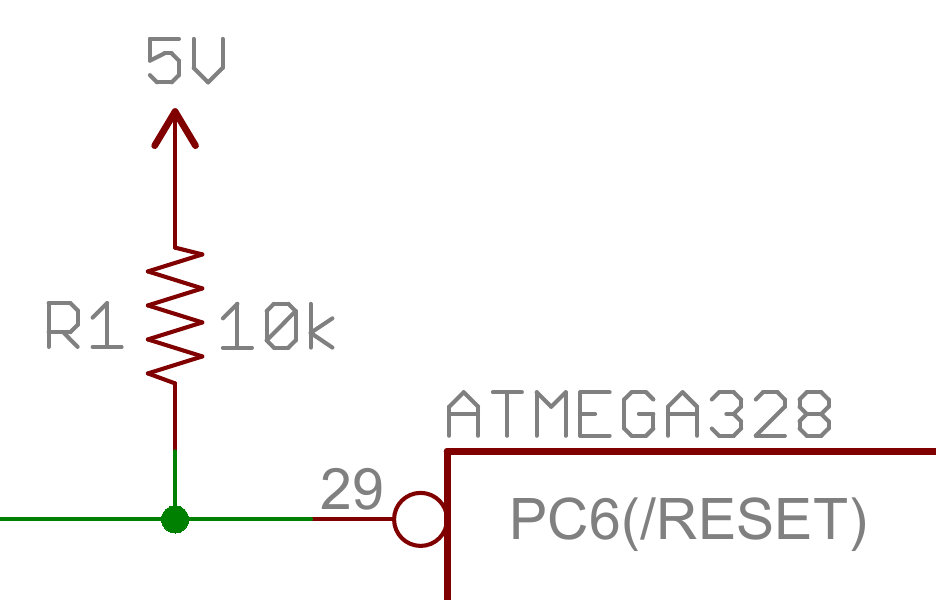
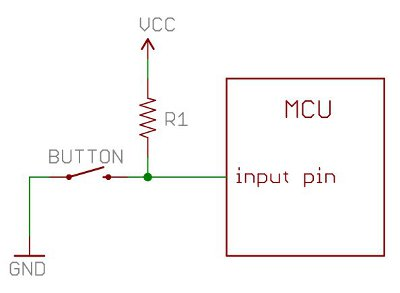
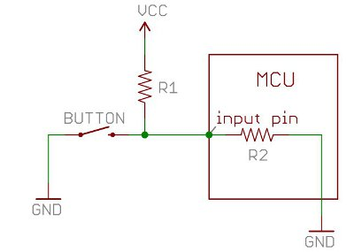

# プルアップ抵抗



[プルアップ抵抗](https://ja.wikipedia.org/wiki/プルアップ抵抗)は、マイコン（MCU）やその他のデジタルロジック機器を使うときによく登場する部品である。
このチュートリアルでは、プルアップ抵抗をいつ、どこで使うのかを説明し、そのうえで簡単な計算を通じて、なぜプルアップ抵抗が重要なのかを見ていく。

参考になるチュートリアル:

- [回路とは何か](./what-is-a-circuit.md)
- [抵抗器](./resistors.md)
- [電圧、電流、抵抗](./voltage-current-resistance-and-ohms-law.md)
- [デジタルロジック](./digital-logic.md)
- [入出力](https://learn.sparkfun.com/tutorials/input-and-output)

## プルアップ抵抗とは何か

あるMCUに、入力として設定した1本のピンがあるとする。
そのピンに何も接続されていないとき、プログラムがそのピンの状態を読み取ったら、ハイ（VCCに引かれた状態）になるか、ロー（グラウンドに引かれた状態）になるか。
これはどちらとも判断がつかない。
この現象は*フローティング（浮遊）*と呼ばれる。
この不確定な状態を防ぐために、プルアップ抵抗やプルダウン抵抗を使うと、わずかな電流しか消費せずに、ピンの状態をハイかローのどちらかに確定させられる。

（ここでは、プルダウンよりも一般的なプルアップに絞って説明する。両者は同じ考え方で動作し、違いはプルアップ抵抗が高い電圧側（たいてい3.3Vか5Vで、VCCと呼ばれることが多い）につながり、プルダウン抵抗がグラウンド側につながる点だけである。）

プルアップは、ボタンやスイッチと組み合わせて使われることが多い。



プルアップ抵抗があると、ボタンが押されていないとき、入力ピンはハイの状態を読み取る。
言い換えると、VCCから入力ピンへ向けてわずかな電流が流れており（グラウンドへは流れない）、入力ピンの電圧はVCCに近い値になる。
ボタンが押されると、入力ピンは直接グラウンドにつながる。
電流は抵抗を通ってグラウンドへ流れ、入力ピンはローの状態を読み取る。
もしこの抵抗がなければ、ボタンを押した瞬間にVCCとグラウンドが直結してしまい、これは非常によくない状態、いわゆる[ショート](./what-is-a-circuit.md)になってしまう。

では、どの程度の抵抗値を選べばよいのか。

手短に言えば、プルアップにはおよそ10kΩ程度の抵抗値を選ぶとよい。

**抵抗値が低いプルアップは「強い（strong）」プルアップと呼ばれ（流れる電流が多い）、抵抗値が高いプルアップは「弱い（weak）」プルアップと呼ばれる（流れる電流が少ない）。**

プルアップ抵抗の値は、次の2つの条件を満たすように選ぶ必要がある。

1. *ボタンが押されているとき*、入力ピンはローに引かれる。このとき抵抗R1の値が、VCCからボタンを通ってグラウンドへ流れる電流の量を左右する。
2. *ボタンが押されていないとき*、入力ピンはハイに引かれる。このときプルアップ抵抗の値が、入力ピンにかかる電圧を左右する。

条件1については、抵抗値をあまり低くしすぎたくない。
抵抗が低いほど、ボタンを押したときに消費される電力が大きくなる。
一般には大きめの抵抗値（10kΩ程度）が望ましいが、条件2と矛盾しない範囲にとどめる必要もある。
4MΩの抵抗をプルアップに使うこと自体は可能かもしれないが、抵抗値が大きすぎる（弱すぎる）ため、常に期待どおりに機能するとは限らない。

条件2についての一般的な目安は、プルアップ抵抗（R1）の値を、入力ピンの入力インピーダンス（R2）の10分の1程度に抑えることである。
マイコンの入力ピンのインピーダンスは、100kΩから1MΩ程度まで幅がある。
ここで言う「インピーダンス」は、単に「抵抗」を難しく言い換えたものだと考えてよく、上の図のR2にあたる。
つまり、ボタンが押されていないとき、VCCからR1を通って入力ピンへごくわずかな電流が流れる。
プルアップ抵抗R1と入力ピンのインピーダンスR2は電圧を[分圧](https://learn.sparkfun.com/tutorials/voltage-dividers)しており、この電圧が、入力ピンが[ハイと判定される](https://learn.sparkfun.com/tutorials/logic-levels/what-is-a-logic-level)のに十分な高さになっている必要がある。

たとえば、プルアップR1に1MΩの抵抗を使い、入力ピンのインピーダンスR2もおよそ1MΩ程度だとすると（この2つで分圧回路を作ることになる）、入力ピンの電圧はVCCのおよそ半分になり、マイコンはそのピンをハイの状態として認識できないかもしれない。
5V系のシステムで、入力ピンの電圧が2.5Vだったら、MCUはそれをどう読み取るだろうか。
ハイなのかローなのか。
MCU自身にもわからず、ハイと読み取られることもローと読み取られることもありうる。
R1に10kΩから100kΩ程度の抵抗を使えば、こうした問題の多くは避けられる。

プルアップ抵抗は非常によく必要とされる部品であるため、Arduinoプラットフォームで使われるATmega328のような多くのマイコンには、有効化と無効化ができる内蔵プルアップが備わっている。
Arduinoで内蔵プルアップを有効にするには、`setup()` 関数の中で次のようなコードを書けばよい。

```cpp
pinMode(5, INPUT_PULLUP); // ピン5の内蔵プルアップ抵抗を有効にする
```

もう1つ触れておきたいのは、プルアップの抵抗値が大きいほど、そのピンが電圧の変化に反応する速さが遅くなるという点である。
これは、入力ピンにつながっているシステムが、実質的にコンデンサとして働き、プルアップ抵抗と組み合わさってRCフィルタを形成するためであり、RCフィルタには充放電に一定の時間がかかる。
USBのように非常に速く変化する信号を扱う場合、大きな値のプルアップ抵抗は、ピンの状態が確実に切り替わる速さを制限してしまうことがある。
USBの信号線でよく1kΩから4.7kΩ程度の抵抗が使われているのは、このためである。

こうしたさまざまな要素が絡み合って、どの値のプルアップ抵抗を使うべきかが決まる。

## プルアップ抵抗の値を計算する

上の回路（Vcc = 5V）で、ボタンを押したときの電流をおよそ1mAに制限したいとする。
どの抵抗値を使えばよいか。

[オームの法則](./voltage-current-resistance-and-ohms-law.md)を使えば、プルアップ抵抗の値は簡単に計算できる。

\\[ V = I \times R \\]

上の回路図に当てはめると、オームの法則は次のようになる。

\\[ 5\text{V} = 0.001\text{A} \times R \\]

これを簡単な代数で抵抗について解くと、

\\[ R = \frac{5\text{V}}{0.001\text{A}} = 5{,}000\,\Omega \\]

単位をすべてボルト、アンペア、オームに揃えてから計算することを忘れないようにする（たとえば1mAは0.001アンペアである）。
答えは、5kΩの抵抗を使えばよいということになる。



## まとめ

これで、プルアップ抵抗が何であり、どう動作するかがわかったはずである。
電子部品とその応用についてさらに学びたいなら、次のチュートリアルもおすすめである。

- [ブレッドボードの使い方](./how-to-use-a-breadboard.md)
- [スイッチの基礎](./button-and-switch-basics.md)
- [分圧回路](./voltage-dividers.md)
- [コンデンサ](./capacitors.md)
- [Arduinoとは何か](./what-is-an-arduino.md)

タグ: 概念、電気工学

---

出典：[Pull-up Resistors](https://learn.sparkfun.com/tutorials/pull-up-resistors)（SparkFun Learn）を日本語に翻訳し、再構成した。
原文は [CC BY-SA 4.0](https://creativecommons.org/licenses/by-sa/4.0/) ライセンスで公開されており、本ページも同ライセンスの下で提供する。
