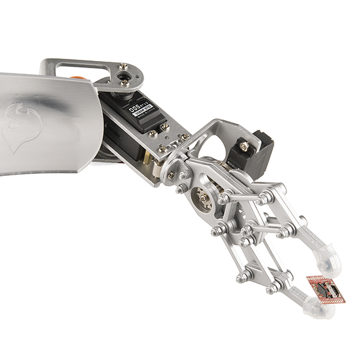
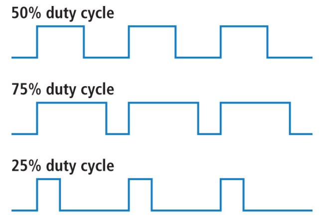
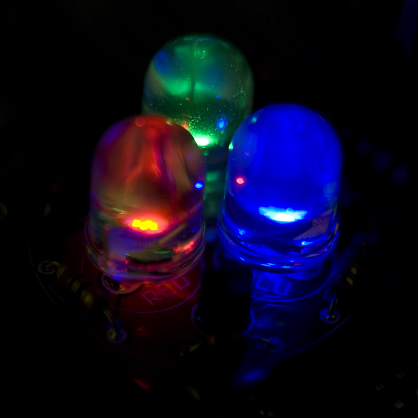
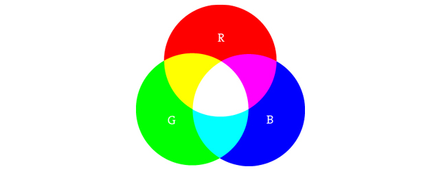
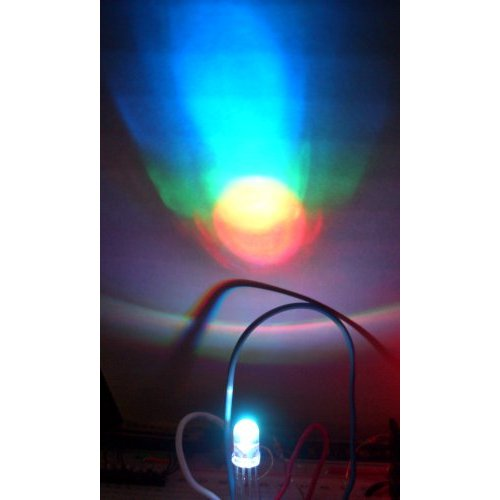
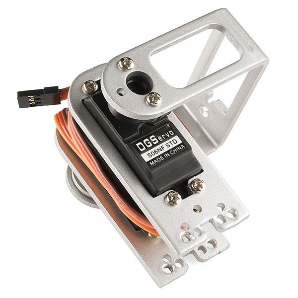

# パルス幅変調（PWM）

## パルス幅変調とは何か

[パルス幅変調](https://ja.wikipedia.org/wiki/%E3%83%91%E3%83%AB%E3%82%B9%E5%B9%85%E5%A4%89%E8%AA%BF)（PWM）は、ある種のデジタル信号を指す呼び名である。
パルス幅変調は、精巧な制御回路をはじめとするさまざまな用途で使われている。
SparkFunでよく使われる例は、[RGB LED](https://www.sparkfun.com/products/105)の明るさを調光したり、[サーボ](https://www.sparkfun.com/servos)の向きを制御したりする用途である。
どちらの用途でも幅広い結果を得られるのは、パルス幅変調によって信号がハイである時間の割合をアナログ的に変化させられるからである。
信号自体はどの瞬間もハイ（たいてい5V）かロー（グラウンド）のどちらかしか取れないが、一定の時間間隔の中でハイである時間とローである時間の比率を変えることができる。

参考になるチュートリアル:

- [電圧、電流、抵抗とオームの法則](./voltage-current-resistance-and-ohms-law.md)
- [アナログとデジタルの違い](./analog-vs-digital.md)
- [分圧回路](./voltage-dividers.md)
- [デジタルロジック](./digital-logic.md)

## デューティ比

信号がハイのとき、これを「オン時間」と呼ぶ。
この「オン時間」の量を表すのに、デューティ比という概念を使う。
デューティ比はパーセントで表され、ある周期の中でデジタル信号がオンになっている時間の割合を示す。
この周期は、波形の周波数の逆数にあたる。

デジタル信号がオンとオフに時間を半分ずつ費やす場合、そのデューティ比は50%であるといい、理想的な矩形波に近い形になる。
50%より高い割合であれば、デジタル信号はロー状態よりハイ状態に多くの時間を費やしており、デューティ比が50%より低ければその逆になる。
次のグラフは、この3つのパターンを示したものである。

デューティ比100%は電圧を5ボルト（ハイ）に固定した状態と同じであり、デューティ比0%は信号をグラウンドに落とした状態と同じである。

## 応用例

デューティ比を調整することで、LEDの明るさを制御できる。

[RGB（赤・緑・青）LED](https://www.sparkfun.com/products/105)を使えば、3色それぞれをさまざまな比率で調光することで、混ぜ合わせる色の割合を制御できる。

3色すべてを同じ比率で点灯させると、明るさの異なる白色光になる。
青と緑を同じ比率で混ぜるとティール（青緑）になる。
もう少し複雑な例を試すなら、赤を完全に点灯、緑をデューティ比50%、青を完全に消灯にしてみると、オレンジ色が得られる。

LEDを制御する際、正しい調光効果を得るには矩形波の周波数を十分に高くする必要がある。
1Hzでデューティ比20%の波形は、目にはオンとオフを繰り返しているのがはっきりと見えてしまう一方、100Hz以上でデューティ比20%の波形は、単に完全点灯より暗く見えるだけになる。
つまり、LEDで調光効果を狙うなら、周期を大きくしすぎないことが要点である。

パルス幅変調は、ロボットアームのような機械部品に取り付けたサーボモーターの角度を制御するのにも使える。
サーボには、制御線からの入力に応じて特定の位置まで回転するシャフトが備わっている。
SparkFunの[サーボモーター](https://www.sparkfun.com/products/9347)は、およそ180度の可動域を持つ。

周波数や周期は、制御する個々のサーボによって決まる。
典型的なサーボモーターは20msごとに更新され、1msから2msの間のパルス幅、つまり50Hzの波形上でデューティ比5%から10%の間で駆動することを想定している。
1.5msのパルスでは、サーボは自然な位置である90度になる。
1msのパルスでは0度、2msのパルスでは180度になる。
この間の値でサーボを更新すれば、可動域全体を使うことができる。

## まとめ

パルス幅変調は制御を中心にさまざまな用途で使われている。
LEDの調光やサーボモーターの角度制御に使えることはすでに紹介したので、ここからは他の使い道も探ってみてほしい。

さらに学びたい場合は、次のチュートリアルも参考にしてほしい。

- [モーターと最適な選び方](./motors-and-selecting-the-right-one.md)
- [Arduinoとは何か](./what-is-an-arduino.md)
- [アナログ-デジタル変換 (ADC)](./analog-to-digital-conversion.md)
- [光](./light.md)
- [発光ダイオード（LED）](./light-emitting-diodes-leds.md)
- [赤外線通信](./ir-communication.md)

タグ: 概念、電気工学、LED、光、モーター

---

出典：[Pulse Width Modulation](https://learn.sparkfun.com/tutorials/pulse-width-modulation)（SparkFun Learn）を日本語に翻訳し、再構成した。
原文は [CC BY-SA 4.0](https://creativecommons.org/licenses/by-sa/4.0/) ライセンスで公開されており、本ページも同ライセンスの下で提供する。
