# PythonプログラミングでRaspberry Piを始める

[Raspberry Pi](https://www.sparkfun.com/raspberry_pi)は、Linuxとさまざまなアプリケーションを動かせる驚くべき**シングルボードコンピュータ**（SBC）である。
[Python](https://www.sparkfun.com/python)は、学校教育、Web開発、科学研究をはじめ多くの業界で使われている、初心者に優しいプログラミング言語である。
このガイドでは、Raspberry Pi上でPythonのプログラムを自分の手で書き、ライトを点滅させ、ボタンの押下に反応し、センサーを読み取り、データを記録するところまでを説明する。

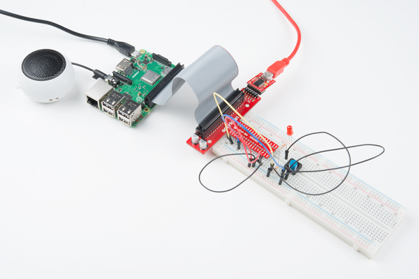

> **注意：** このチュートリアルは、Raspbianバージョン「April 2018」とPythonバージョン3.5.3で書かれている。異なるバージョンでは、一部の手順が異なる場合がある。

## 必要な部品

このチュートリアルの内容を進めるには、いくつかのハードウェアが必要になる。

I2Cのサンプルの代替として、はんだ付けや4本のピンへの接続を必要としないQwiicケーブルとQwiic対応TMP102を使うこともできる。

## 参考になるチュートリアル

Raspberry Piの利用方法にはいくつかの選択肢がある。
最も一般的なのは、フルサイズのデスクトップコンピュータと同じように使う方法であり、モニタ、キーボード、マウスが必要になる（下記に挙げる）。
コストを抑えるため、モニタ、キーボード、マウスを使わない**ヘッドレス**なコンピュータとして使うこともできる。
この構成は、他のコンピュータから**コマンドラインインターフェース**（CLI）を使う必要があるため、学習の難度がやや上がる。

画像が見づらい場合は、クリックすると拡大表示できる。

## オープンソース！

このガイドは、[Creative Commons Attribution Share-Alike 4.0 International License](https://creativecommons.org/licenses/by-sa/4.0/)の下で提供されている。

## OSのインストール

Raspberry Piとのやり取りにはいくつかの選択肢がある。
最初の、そして最も一般的な方法は、通常のデスクトップコンピュータ（の小型版）のように使うことである。
これには、キーボード、マウス、モニタの接続が必要になる。
この構成では、フルの**グラフィカルユーザーインターフェース**（GUI）が使える**Raspbian with Desktop**をインストールするのが最も適している。
Windows、macOS、あるいはUbuntuのような他の一般的なLinuxディストリビューションと同じような使い勝手を求めるなら、これが最良の選択肢である。

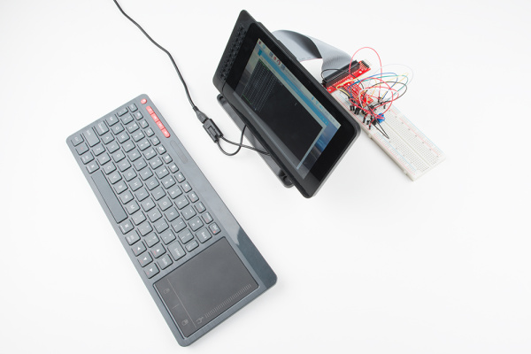

*選択肢1：キーボード、マウス、モニタを使い、フルサイズのコンピュータとしてRaspberry Piを使う*

もう一つの選択肢は**ヘッドレス**な構成である。つまり、モニタ、キーボード、マウスを省くことができる。
これは安く済む方法だが、すべての操作をコマンドラインインターフェースで行う必要が出てくる。
この場合、**Raspbian with Desktop**または**Raspbian Lite**のどちらかのOSを使うことになる。

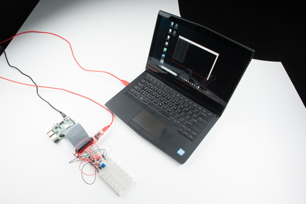

*選択肢2：別のコンピュータからやり取りする「ヘッドレス」動作のためのRaspberry Piの設定*

このガイドでは、どちらの構成でも動作するPythonプログラムの書き方と実行方法を説明する。

### 選択肢1：フルデスクトップ構成

Raspberry Pi 3 Starter Kit Hookup Guideでは、NOOBS（Raspberry Piの使いやすいグラフィカルOSインストーラー）を使ったセットアップ方法を詳しく解説している。

以降、フルデスクトップ構成に固有の説明は、<span style="background:LightCyan;">水色</span>で強調する。

### 選択肢2：ヘッドレスなPi

キーボード、マウス、モニタを省きたい場合は、Raspbian Liteをインストールできる。
これにより、別のコンピュータからSSHまたはシリアルでPiにターミナル接続できるようになる。
Headless Raspberry Pi Setupでは、グラフィカルインターフェースなしでRaspberry Piをセットアップする方法を解説している。

このチュートリアルの中で、ヘッドレス構成に固有の説明は、<span style="background:Khaki;">黄色</span>で強調する。

Raspberry Pi Starter Kitを使っている場合は、付属のリボンケーブルでPi WedgeをPiに取り付け、FTDIブレイクアウトボードをPi Wedgeに接続できる。
そこから、コンピュータとFTDIブレイクアウトボードをUSBケーブルでつなぐ。
これにより、Headless Piチュートリアルの「シリアルターミナル」の節で説明されている方法で、Raspberry Piへのシリアルターミナルを開けるようになる。

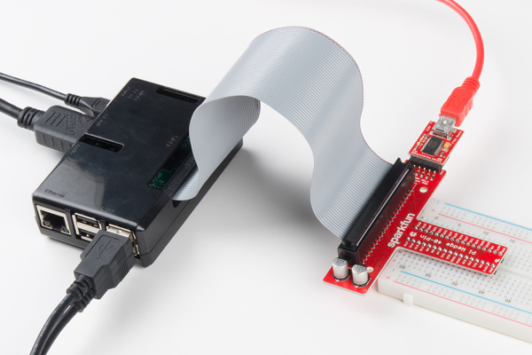

## Piの設定

フルデスクトップ構成とヘッドレス構成のどちらを使っている場合でも、新しくインストールしたRaspberry Piにはいくつか基本的な設定手順が必要になる。
これらの手順は、**ターミナル**（テキストの入出力環境）から簡単に実行できる。

<span style="background:LightCyan; font-weight:bold;">フルデスクトップ：</span> Xウィンドウマネージャー（いわゆる**デスクトップ**）に自動的にログインしているはずである。
ターミナルを開くには、デスクトップ左上の**Terminal**アイコンをクリックするだけでよい。
すぐにターミナルウィンドウ内のコマンドプロンプトが表示される。

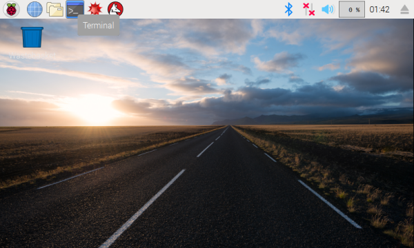

<span style="background:Khaki; font-weight:bold;">ヘッドレス：</span> ヘッドレス構成では、すべての操作をターミナルから行う。
シリアルまたはSSHでPiに接続すると、ターミナルにログインプロンプトが表示される。
デフォルトの認証情報を入力する。

- **ユーザー名：** pi
- **パスワード：** raspberry

コマンドプロンプトが表示される。

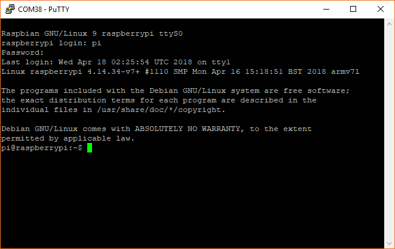

### 設定ツールの実行

コマンドプロンプトから、次のコマンドを入力する。

```bash
sudo raspi-config
```

パスワードの入力を求められた場合は、デフォルトのパスワード`raspberry`を入力する。

Raspberry Piの設定に関するいくつかの選択肢が表示される。

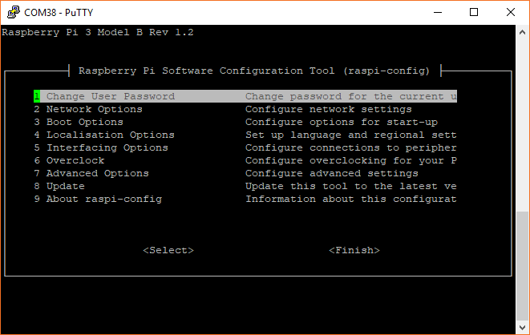

- 矢印キーで**1 Change User Password**を選択し、画面の指示に従ってデフォルトのパスワードを変更する。

> **警告：** パスワードの変更を強く推奨する。Piをネットワークに接続したままパスワードを'raspberry'のままにしておくと、そのネットワークにアクセスできる誰もが簡単にPiに侵入できてしまう。

- 続いて、**2 Network Options**を選択する。
- 次の画面で**N2 Wi-fi**を選択し、画面の指示に従ってPiをローカルのWiFiネットワークに接続する（利用可能な場合）。

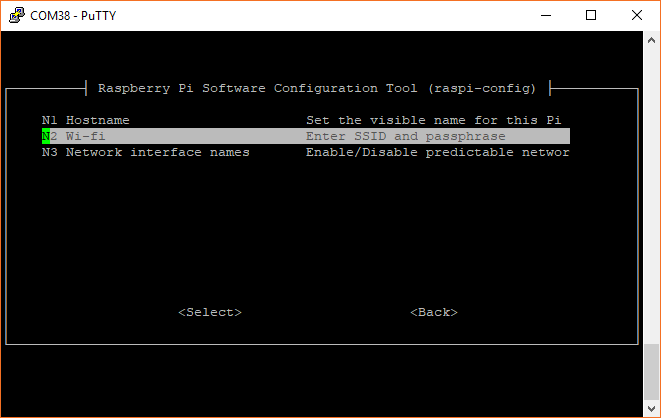

**4 Localisation Options**を選択すると、キーボードとタイムゾーンのオプションが表示される。

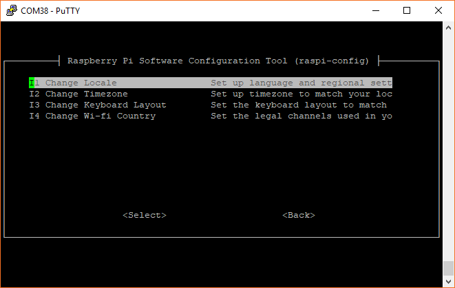

- **I1 Change Locale**を選択する。
- 下にスクロールして**en_GB.UTF-8 UTF-8**をハイライトし、スペースキーを押して選択を解除する（アスタリスク「*」が消える）。
- 自分の言語・国を探してスペースキーで選択する（アスタリスク「*」が表示される）。
- イギリスに住んでいる場合は、**en_GB.UTF-8 UTF-8**を選択したままでよい。
- 米国に住んでいる場合は、おそらく**en_US.UTF-8 UTF-8**を選択することになる。

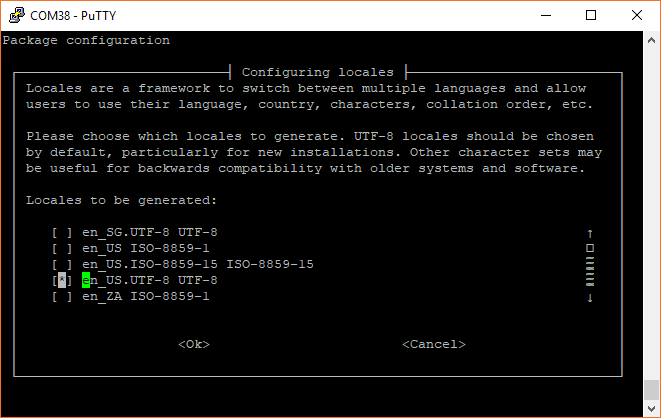

- *enter*キーを押して変更を保存する。
- 次の画面で、選択したロケール（米国であれば**en_US.UTF-8**など）をハイライトし、*enter*キーを押す。

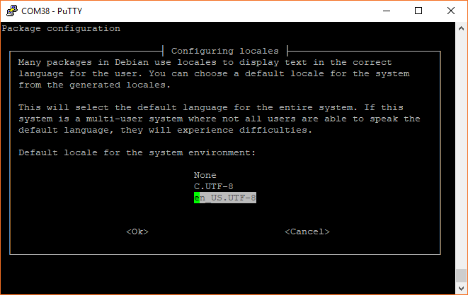

- **4 Localisation Options**に戻り、**I2 Change Timezone**を選択する。
- 画面の指示に従って、タイムゾーンを選択する。
- 再び**4 Localisation Options**に戻り、**I3 Change Keyboard Layout**を選択する。
- 好みのレイアウトを選ぶ（デフォルトの*Generic 105-key (Intl) PC*がほとんどの状況でうまく機能する）。
- 次の画面で、自分の言語・国に対応するレイアウトを選択する。
- イギリスに住んでいる場合は、**English (UK)**を選択したままでよい。それ以外の場合は**Other**を選択し、*enter*キーを押して、自分の言語・国を選ぶ指示に従う。米国に住んでいる場合は**English (US)**を選択し、次の画面で上にスクロールして**English (US)**をハイライトする。*enter*キーを押す。

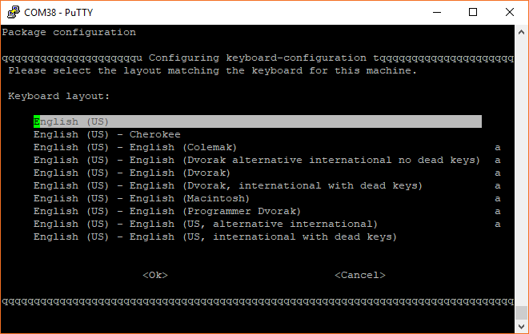

- **The default for the keyboard layout**を選択したまま*enter*キーを押す。
- 同様に、デフォルトの**No compose key**を選択したまま*enter*キーを押す。
- *Control+Alt+Backspace*の使用について聞かれたら**No**を選択したまま*enter*キーを押す。
- しばらくすると、設定ツールのメインメニューに戻る。

**5 Interfacing Options**を選択する。

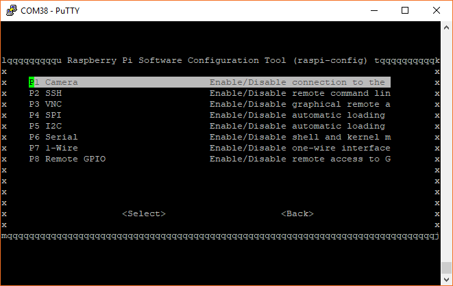

- 必要であれば*Camera*インターフェースと*SSH*を有効にしておいてよい。
- **SPI**を選択し、次の画面で**yes**を選択し、*enter*キーを押す。
- **I2C**についても同様に繰り返す。
- **Serial**についても同様に繰り返す。

メイン画面に戻り、**7 Advanced Options**を選択する。

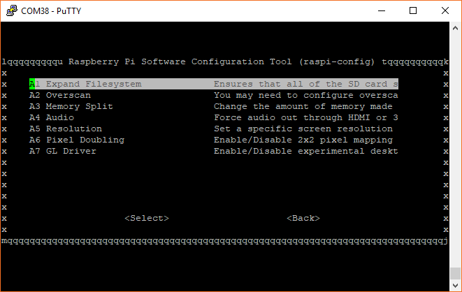

- **A1 Expand Filesystem**を選択し、*enter*キーを押す。
- 再度**7 Advanced Options**に入り、**A4 Audio**を選択し、**1 Force 3.5mm ('headphone') jack**をハイライトして*enter*キーを押す。
- *右矢印*キーで**Finish**を選択し、*enter*キーを押す。再起動を聞かれたら**Yes**を選択して*enter*キーを押す。Raspberry Piが再起動するのを待つ。

シリアルまたはSSHターミナルを使っている場合は、ユーザー名`pi`と先ほど設定したパスワードで再度ログインする。

### Python 3を使う

デフォルトでは、Raspbian（2018年4月版以前のStretch）はPython 2を使う。
ただし、バージョン2と3のどちらもあらかじめインストールされている。
ターミナルで`python`と入力したときに常にPython 3が使われるようにするには、わずかな変更を一つ加えるだけでよい。

ターミナルウィンドウで、次のコマンドを入力する。

```bash
python --version
```

デフォルトで使われているバージョンが表示される。
たとえば`Python 2.7.13`のように表示されるかもしれない。
OSがデフォルトでPython 2を使っている場合は、Python 3のインストールを使うように変更する必要がある。
ログインするたびにPython 3が使われるようにしたい。

次のコマンドを入力する。

```bash
nano ~/.bashrc
```

*.bashrc*は、ユーザーのホームディレクトリ（この場合はユーザー*pi*）にあるファイルである。
このファイルは、そのユーザーがターミナルを開くたび（あるいはSSHやシリアルでログインするたび）に実行される[シェルスクリプト](https://en.wikipedia.org/wiki/Shell_script)として動作する。
ユーザー環境をカスタマイズするのに役立ち、すでに他のコマンドがいくつか書かれているはずである。

ファイルの末尾までスクロールし、次のコマンドを追加する。

```bash
alias python='/usr/bin/python3'
```

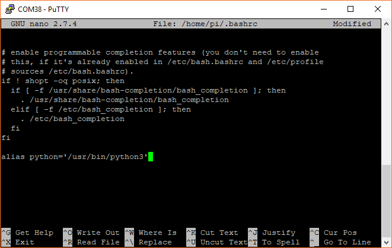

*ctrl+x*で*nano*を終了し、ファイルを保存するか聞かれたら*y*キーを押し、続いて*enter*キーを押す。
新しいコマンドを反映させるためにログアウト・ログインし直す代わりに、次のコマンドで.bashrcスクリプトの内容をそのまま実行できる。

```bash
source ~/.bashrc
```

もう一度Pythonのバージョンを確認する。

```bash
python --version
```

Python 3の何らかのバージョンが使われているはずである。

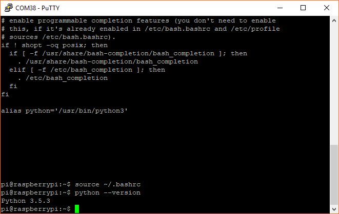

### pipのインストール

<span style="background:LightCyan; font-weight:bold;">フルデスクトップ：</span> Raspbianのフルデスクトップ版を使っている場合、*pip*はすでにインストールされているはずである。

<span style="background:Khaki; font-weight:bold;">ヘッドレス：</span> Raspbian Liteを使っている場合、Pythonのパッケージマネージャーである*pip*はあらかじめインストールされていない。
そのため、次のコマンドでインストールする必要がある。

```bash
sudo apt-get update
sudo apt-get install python3-pip
```

聞かれたら*y*キーを押す。

Python 3でpipを使うには`pip3`コマンドを使う必要がある点に注意してほしい。
ただし、.bashrcファイルを変更して*pip3*の代わりに*pip*を使えるようにできる。このチュートリアルの以降の説明では*pip*を使った例を示す。

```bash
nano ~/.bashrc
```

ファイルの末尾までスクロールし、次のコマンドを追加する。

```bash
alias pip=pip3
```

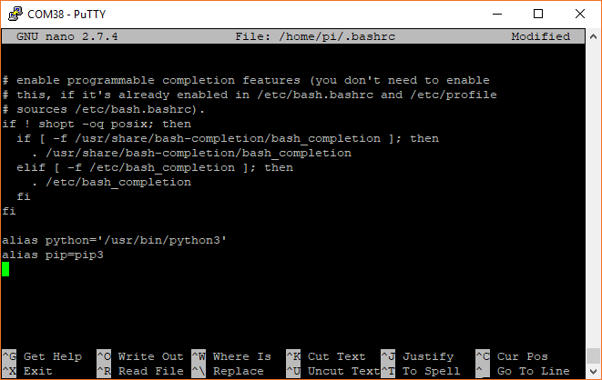

*ctrl+x*で*nano*を終了し、*y*と*enter*を押す。次のコマンドで.bashrcスクリプトを実行する。

```bash
source ~/.bashrc
```

これで、*pip*コマンドを使ってPythonパッケージをインストールできるようになったはずである。

## Hello, World!

Pythonの最も面白い特徴の一つは、**インタプリタ型**の言語であることだ（正確には、Pythonのスクリプトはまずバイトコードにコンパイルされ、そのバイトコードがインタプリタによって実行される）。
つまり、プログラムを実行するために別途**コンパイル**の工程（プログラムを機械語に翻訳する工程）を行う必要がない。
それどころか、**インタラクティブモード**と呼ばれる形でインタプリタを実行することもできる。
これにより、コマンドを一行ずつ試すことができる。

まずは、Pythonに「Hello, World!」という文をターミナルに出力させてみる。
最初はインタプリタから、続いてファイルを作成してプログラムとして実行する。
これにより、Pythonとやり取りする主な二つの方法を確認できる。

「Hello, World!」というフレーズの由来が気になる場合は、[このWikipediaの記事](https://en.wikipedia.org/wiki/%22Hello,_World!%22_program)に簡潔ながら興味深い歴史が書かれている。

### インタプリタを始める

ターミナルから、次のコマンドを入力してPythonインタプリタを起動する。

```bash
python
```

3つの不等号記号`>>>`からなる、これまでとは異なるコマンドプロンプトが表示されるはずである。

次のコマンドを入力する。

```python
print("Hello, World!")
```

*enter*キーを押すと、`Hello, World!`というフレーズが表示されるはずである。

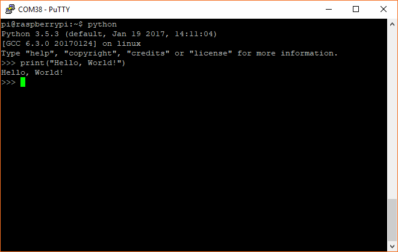

これで完了である。最初のPythonプログラムを実行できた。

インタプリタを終了するには、次のように入力する。

```bash
exit()
```

### ファイルからPythonプログラムを実行する

Pythonインタプリタでコマンドを一行ずつ入力・実行することもでき、これはさまざまなコマンドを試すのに（あるいは電卓代わりに使うのに）非常に便利である。
ただ、多くの場合、コマンドを一つ以上のファイルにまとめて保存し、まとめて実行したくなるはずである。

最も簡単な方法は、ターミナルからファイルを作成することだが、Raspbianのグラフィカルエディタである*Leafpad*（Raspberry Piアイコンをクリックし、*アクセサリ > テキストエディタ*から開く）を使ってもよい。

ターミナルで、次のコマンドを入力する。

```bash
nano hello.py
```

これにより、ホームディレクトリ（*/home/pi*）に*hello.py*という名前のファイルが作成され、*nano*プログラムで編集が始まる。

このファイルの1行目に、次のように入力する。

```bash
print("Hello, World!")
```

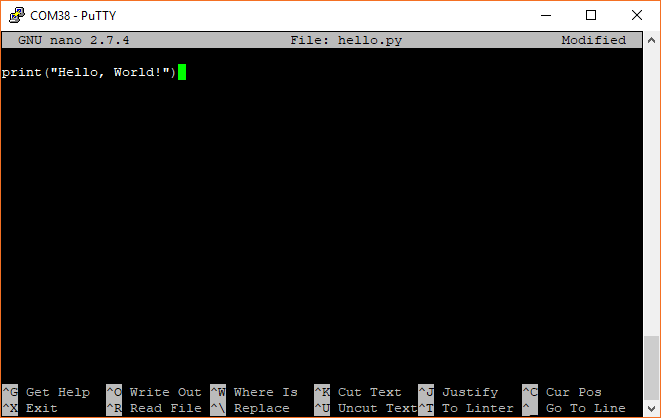

保存して終了する（*ctrl+x*、続いて*y*、*enter*）。
Linuxのコマンドプロンプトに戻り、次のコマンドを入力する。

```bash
python hello.py
```

これで、*hello.py*ファイルにあるコードが実行されるはずである。
今回の場合、コンソールにおなじみの`Hello, World!`というフレーズが表示されるはずである。

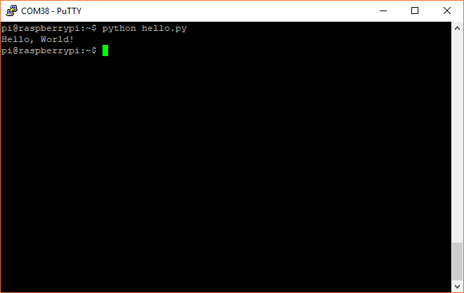

> **注意：** ちなみに、筆者はスクリーンショットの間で`clear`コマンドを使ってターミナルをクリアしている。

ここまでの内容をまとめると、`python`コマンド単体で**インタラクティブなインタプリタセッション**を開始し、リアルタイムにコマンドを入力できる。
`python <FILE>.py`のようにファイルを指定すると、Pythonインタプリタはインタラクティブなセッションを提供する代わりに、そのファイルにあるコマンドを実行する。

インタプリタがファイルの中身を実行する上で、*.py*という拡張子は必須ではない点に注意してほしい。
とはいえ、ファイルを整理しておく上では非常に役立つ。*.py*で終わるファイルを見れば、中にPythonのコードが入っているとすぐにわかるからである。
また、後で扱う**モジュール**を作る際にも*.py*という拡張子が必要になる。

### 開発環境

Pythonのプログラムを作る最もシンプルな方法は、テキストエディタ（nano、vim、emacs、Midnight Commander、Leafpadなど）でコードを書き、保存し、ターミナルから`python <FILE>.py`コマンドで実行することである。
このガイドの残りの部分も、テキストエディタとコマンドラインを使って進めて構わない。

コード開発には**統合開発環境**（IDE）を好むユーザーもいる。
IDEには、シンタックスハイライト、コード補完、ワンクリック実行、デバッグのヒントなど、数多くの利点がある。
ただし、ほとんどのIDEはグラフィカルインターフェースを必要とするため、Raspbianのフルデスクトップ版を使う必要がある。

> **注意：** Raspbianには標準で3つのPython向けIDE、IDLE、Geany、Thonnyが同梱されている。以下でそれぞれを簡単に紹介するので、これらでも他の好みのテキストエディタやIDEでも自由に使ってほしい。

#### IDLE

IDLEは、長年にわたりRaspbianで使えるデフォルトのPythonエディタである。
よい点として、インタプリタが内蔵されており、コードをテストするためにコマンドを一つずつ実行できる。
悪い点は、行番号が表示されないことと、Pythonにしか対応していないことである（とはいえ、ここではPythonが目当てなのでちょうどよいとも言える）。

左上のRaspberry Piのロゴを選択し、*Programming > Python 3 (IDLE)*をクリックしてIDLEを開く。
Pythonのインタラクティブインタプリタが表示されるはずである。

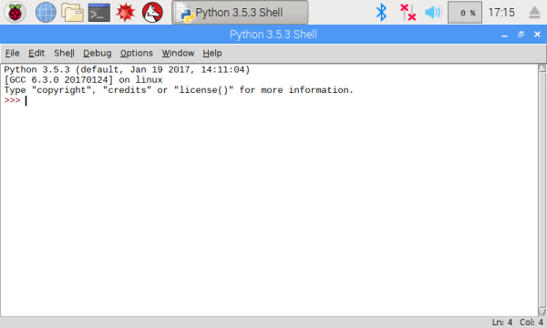

プログラムを書くには、*File > New File*に進む。コードを入力する。

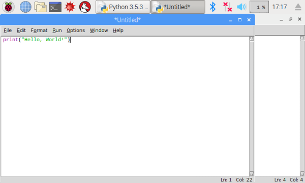

*File > Save As...*をクリックしてコードをPythonファイルに保存する（*.py*の拡張子を忘れないように）。
*Run > Run Module*をクリックしてプログラムを実行する。

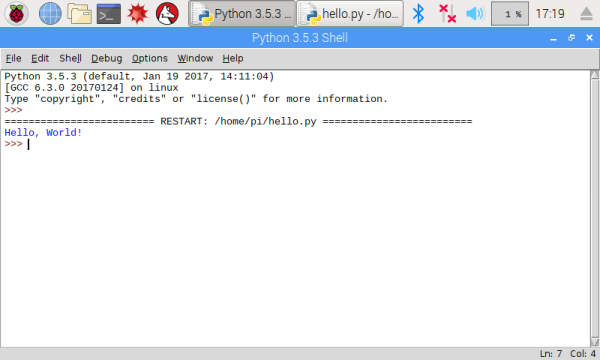

#### Geany

Geanyは、多くの言語に対応した、初心者に優しい優れたIDEである。
ただし、Python用のインタラクティブインタプリタを備えて起動するわけではない。
左上のRaspberry Piのロゴをクリックし、*Programming > Geany*を選択してGeanyを開く。
ファイルエディタのペインでコードを書く。

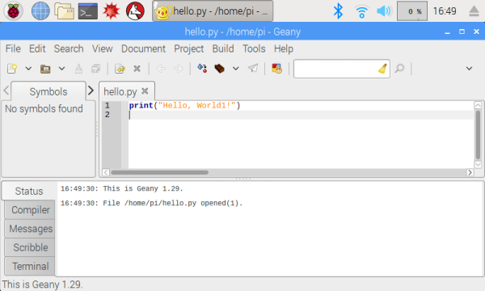

コードを保存する。ファイル名の末尾が*.py*になっていることを確認する。

デフォルトでは、Geanyはコードの出力を表示するために新しいウィンドウを開こうとするが、Raspberry Piでは動作しない場合がある。
これを、代わりに*Terminal*ペイン内で実行するように変更できる。
*Edit > Preferences*をクリックする。*Terminal*タブを選択し、*Execute programs in the VTE*を有効にする。
*enter*キーを押して設定を保存し、Preferencesウィンドウを閉じる。

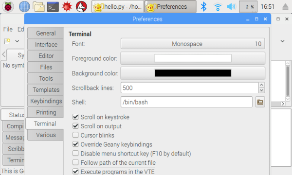

*Build > Execute*をクリックする（あるいは紙飛行機のアイコンをクリックする）とコードが実行される。
プログラムの出力がGeanyのTerminalペインに表示されるはずである。

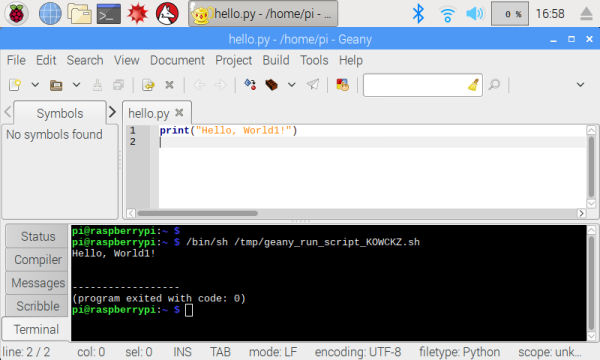

#### Thonny

最後に紹介するThonnyも、Raspbianにあらかじめ用意されている使いやすい優れたIDEである。
Pythonに特化しており、プログラムを読み込むとインタラクティブな環境が使える。
Raspberry Piのアイコンをクリックし、続いて*Programming > Thonny Python IDE*でThonnyを起動する。

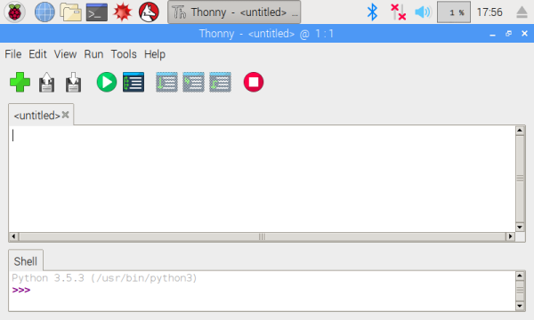

上側のペインにプログラムを書き、*File > Save as...*をクリックして保存し、*Run > Run current script*をクリックしてプログラムを実行する。
出力は下側のインタプリタペインに表示される。

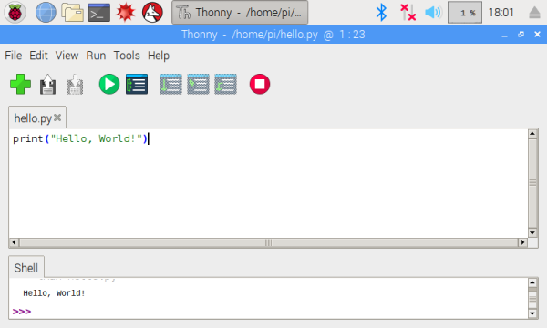

> **筆者の見解：** プログラミングの旅を始めたばかりであれば、グラフィカルなIDEには*Thonny*を、ヘッドレスなRaspberry Pi構成では*nano*を使うことを推奨する。

## Pythonでプログラミングする

このチュートリアルの大部分は、Raspberry Piに接続したハードウェアの制御に焦点を当てている。
これを実現するために、Pythonというプログラミング言語を使う。
そのため、リテラル、変数、演算子、制御フロー、スコープ、データ構造といったPythonの基礎知識にある程度馴染んでおく必要がある。
Pythonへの習熟度に応じて、次のように読み進めることを推奨する。

- **馴染みがない：** 推奨されている資料を読み、チャレンジ課題に取り組む
- **ある程度馴染みがある：** チャレンジ課題に取り組み、詰まったときに資料を参照する
- **十分馴染みがある：** このセクション全体を読み飛ばして構わない

車輪の再発明はしたくないので（Pythonについては優れたチュートリアルや書籍がすでに数多くある）、次の二つの資料を参照する。

- [A Byte of Python](https://python.swaroopch.com/) — Python言語への無料の、よくまとまった入門書。概念が例とともに簡潔に説明されている。紙の本も[こちら](https://swaroopch.com/buybook/)で購入できる（著者の支援にもなる）。
- [The Python Documentation](https://docs.python.org/3.5/) — Python言語をより技術的に、より深く扱ったチュートリアルとリファレンスガイド集。概念の理解に行き詰まったときはこちらを参照するとよい。

> **注意：** ブラウザによっては、"A Byte of Python"へのリンクの一部がページ内の正しい位置に開かないことがある。その場合は、ページを再読み込みすれば正しい位置に移動するはずである。

> **実際に試そう！** ここで示すコード例はどれも、それぞれ独立したプログラムとして実行できる。インタプリタに直接入力するか、（一つずつ）ファイルにコピーしてPythonで実行してみてほしい。

ここで扱う内容よりも多くの例や練習問題を使ってPythonのプログラミングを学びたい場合は、[Non-Programmer's Tutorial for Python 3](https://en.wikibooks.org/wiki/Non-Programmer%27s_Tutorial_for_Python_3)、[learnpython.org](https://www.learnpython.org/)、[Google's Python Class](https://developers.google.com/edu/python/)といった無料のサイトも参考にしてほしい。
このセクションでPython言語の基礎を扱ったら、いよいよライトの点滅、センサーの読み取り、モーターの制御に進む。

### コメント

**コメント**とは、シャープ記号（ハッシュ記号）`#`の右側にあるテキストのことである。
Pythonインタプリタはこのテキストを無視するため、自分自身や他のプログラマ向けにコードの内容についてのメモを書くのに便利である。

**例：**

```python
# This is a comment and is not seen by the interpreter
print("Hello, World!")
```

**参考になる資料：**

- *A Byte of Python*：[Comments](https://python.swaroopch.com/basics.html#comments)
- *The Python Tutorial*：[2.1.3. Comments](https://docs.python.org/3.5/reference/lexical_analysis.html#comments)

### リテラル

**リテラル**（リテラル定数とも呼ばれる）は、整数（例：42）、浮動小数点数（例：6.23）、文字列（例："Hello, World!"）といった固定値のことである。
文字列は、シングルクォート（' '）またはダブルクォート（" "）で囲む必要がある点に注意してほしい。

**例：**

```python
print(42)
print("hi")
```

**参考になる資料：**

- *A Byte of Python*：[Literal Constants](https://python.swaroopch.com/basics.html#literal-constants)、[Numbers](https://python.swaroopch.com/basics.html#numbers)、[Strings](https://python.swaroopch.com/basics.html#strings)
- *The Python Tutorial*：[2.4. Literals](https://docs.python.org/3.5/reference/lexical_analysis.html#literals)

**チャレンジ：** 先ほど書いた`print("Hello, World!")`のプログラムを、自分の名前を出力するように変更してみよう。

```python
print("your name")
```

### 変数

変数とは、値を変更できる入れ物である。
数値や文字列を変数に保存し、後でその値を取り出すことができる。

**例：**

```python
number = 42
print(number)
```

**参考になる資料：**

- *A Byte of Python*：[Variable](https://python.swaroopch.com/basics.html#variable)、[Identifier Naming](https://python.swaroopch.com/basics.html#identifier-naming)、[Data Types](https://python.swaroopch.com/basics.html#data-types)
- *The Python Tutorial*：[3.1.1. Numbers](https://docs.python.org/3.5/tutorial/introduction.html#numbers)、[3.1.2. Strings](https://docs.python.org/3.5/tutorial/introduction.html#strings)

**チャレンジ：** 自分の名前を変数に保存し、その変数の値をターミナルに出力してみよう。

```python
name = "your name"
print(name)
```

### 論理行

ここまで、プログラムには1行につき一つの式を書いてきた。たとえば次のようになる。

```python
message = "hello!"
print(message)
```

この2行は、セミコロン`;`で区切ることで1行にまとめることができる。

```python
message = "hello"; print(message)
```

この二つのプログラムはまったく同じように動作する。
とはいえ、コードを読みやすくするために、物理的な1行につき論理的な行を一つだけ書くことがよく推奨される。

**参考になる資料：**

- *A Byte of Python*：[Logical and Physical Line](https://python.swaroopch.com/basics.html#logical-and-physical-line)
- *The Python Language Reference*：[2.1. Line Structure](https://docs.python.org/3.5/reference/lexical_analysis.html#line-structure)

### ユーザー入力

`input()`関数を使うと、ユーザーにターミナルへの入力を求めることができる。
これにより、ユーザーは何らかのテキスト（数値を含む）を入力し、*enter*キーを押してそのテキストを送信するよう促される。
送信されると、`input()`関数はそのテキストを読み取り、文字列として返す。この値は変数に保存できる。

括弧の間にあるもの（**引数**と呼ばれる）は、ユーザー入力を受け付ける前に画面に表示される。

関数とは、名前で呼び出せるコードのまとまりのことである。
たとえば`print()`は、引数を受け取ってターミナルに出力する関数である。
下の例で、`print()`に渡す二つの引数がカンマで区切られていることに注目してほしい。
この場合、`print()`は異なる文字列（や変数）を1行に順番に出力する。

`int()`関数を使うと、文字列を整数に変換できる（その文字列が整数として解釈できる場合）。

**例：**

```python
message = input("Type a message to yourself: ")
print("You said:", message)


number = int(input("Type a number:"))
print("You entered:", number)
```

**参考になる資料：**

- *A Byte of Python*：[Input from User](https://python.swaroopch.com/io.html#input-from-user)

**チャレンジ：** ユーザーの名（`input()`の呼び出し）と姓（別の`input()`の呼び出し）を尋ね、1行にまとめて出力するプログラムを書いてみよう。実行例は次のようになる。

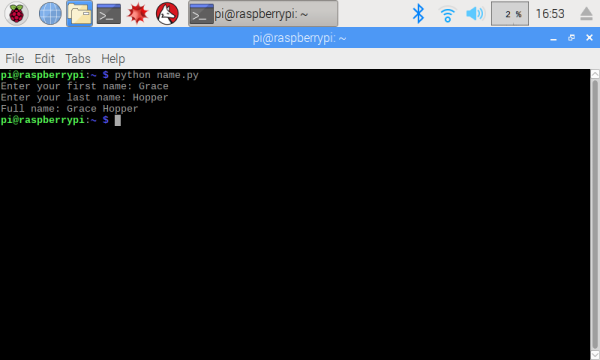

```python
first_name = input("Enter your first name: ")
last_name = input("Enter your last name: ")
print("Full name:", first_name, last_name)
```

### インデント

Pythonでは、行頭の空白（スペースの数）が重要な意味を持つ。
一つのまとまりを構成する文は、同じレベルのインデント（行頭の空白の量）でなければならない。
これは、制御フロー文（`if`や`for`など）や関数を扱うときに重要になる。

他の言語でプログラムを書いたことがあれば、波括弧`{}`に馴染みがあるかもしれない。
他の言語では、この波括弧に挟まれたコードが一つのまとまり（ブロック）を構成する。
Pythonでは、コードのまとまり（ブロック）は、各行のインデントのレベルによって示される。

**例：**

```python
answer = "yes"
guess = input("Is the sky blue? ")
if guess == answer:
    print("Correct!")
else:
    print("Try again")
```

`if`文については後で扱うが、`print()`関数がインデントされていることに注目してほしい。これにより、`if`文と`else`文の下にそれぞれ別々のコードのまとまりが形成されている。

**参考になる資料：**

- *A Byte of Python*：[Indentation](https://python.swaroopch.com/basics.html#indentation)
- *The Python Tutorial*：[2.1.8. Indentation](https://docs.python.org/3.5/reference/lexical_analysis.html#indentation)

### 演算子

演算子とは、インタプリタに対し、1つ以上のデータに数学的、関係的、論理的な操作を行い、結果を返すよう指示する記号のことである。

**数学演算子**は、数値に対する基本的な演算を行う。

| 演算子 | 説明 | 例 |
| --- | --- | --- |
| `+` | 2つの数値を加算する | `2 + 3`は`5`を返す |
| `-` | 一方の数値からもう一方を減算する | `8 - 5`は`3`を返す |
| `*` | 2つの数値を乗算する | `4 * 6`は`24`を返す |
| `**` | 1つ目の数値を2つ目の数値でべき乗する | `2 ** 4`は`16`を返す |
| `/` | 1つ目の数値を2つ目の数値で除算する | `5 / 4`は`1.25`を返す |
| `//` | 2つの数値を除算し、最も近い整数に切り下げる（除算と切り捨て） | `5 // 4`は`1`を返す |
| `%` | 1つ目の数値を2つ目の数値で除算し、余りを返す（剰余） | `19 % 8`は`3`を返す |

**論理演算子**は、2つの数値を比較し、**ブール値**（`True`または`False`）のいずれかを返す。

| 演算子 | 説明 | 例 |
| --- | --- | --- |
| `<` | 1つ目の数値が2つ目より小さければ`True`、そうでなければ`False` | `5 < 3`は`False`を返す |
| `>` | 1つ目の数値が2つ目より大きければ`True`、そうでなければ`False` | `5 > 3`は`True`を返す |
| `<=` | 1つ目の数値が2つ目以下であれば`True`、そうでなければ`False` | `2 <= 8`は`True`を返す |
| `>=` | 1つ目の数値が2つ目以上であれば`True`、そうでなければ`False` | `2 >= 8`は`False`を返す |
| `==` | 1つ目の数値が2つ目と等しければ`True`、そうでなければ`False` | `6 == 6`は`True`を返す |
| `!=` | 1つ目の数値が2つ目と等しくなければ`True`、そうでなければ`False` | `6 != 6`は`False`を返す |

**複合論理演算子**は、ブール値を入力として受け取り、ブール値を返す。

| 演算子 | 説明 | 例 |
| --- | --- | --- |
| `not` | 値を反転する（`True`は`False`に、その逆も同様） | `x = False; not x`は`True`を返す |
| `and` | 両方のオペランドが`True`であれば`True`、そうでなければ`False` | `x = True; y = False; x and y`は`False`を返す |
| `or` | いずれかのオペランドが`True`であれば`True`、そうでなければ`False` | `x = True; y = False; x or y`は`True`を返す |

**ビット演算子**は、与えられた数値のビット（1と0）に対して二進演算を行う。ビット演算について詳しくは、2進数のチュートリアルを参照してほしい。

| 演算子 | 説明 | 例 |
| --- | --- | --- |
| `&` | 両方のオペランドの対応するビットがともに1であるビット位置に1を返す（ビットAND） | `3 & 5`は`1`を返す |
| `\|` | いずれかまたは両方のオペランドの対応するビットが1であるビット位置に1を返す（ビットOR） | `3 \| 5`は`7`を返す |
| `^` | いずれか一方だけの対応するビットが1であるビット位置に1を返す（ビットXOR） | `3 ^ 5`は`6`を返す |
| `~` | 与えられた数値のビットを反転する（ビットNOT） | `~5`は`-6`を返す |
| `<<` | 1つ目の数値のビットを、2つ目の数値で指定されたビット数だけ左にシフトする | `5 << 2`は`20`を返す |
| `>>` | 1つ目の数値のビットを、2つ目の数値で指定されたビット数だけ右にシフトする | `5 >> 2`は`1`を返す |

**参考になる資料：**

- *A Byte of Python*：[Operators](https://python.swaroopch.com/op_exp.html#operators)
- *The Python Tutorial*：[6.5. The power operator](https://docs.python.org/3.5/reference/expressions.html#the-power-operator)、[6.6. Unary arithmetic and bitwise operations](https://docs.python.org/3.5/reference/expressions.html#unary-arithmetic-and-bitwise-operations)、[6.7. Binary arithmetic operations](https://docs.python.org/3.5/reference/expressions.html#binary-arithmetic-operations)、[6.8. Shifting operations](https://docs.python.org/3.5/reference/expressions.html#shifting-operations)、[6.9. Binary bitwise operations](https://docs.python.org/3.5/reference/expressions.html#binary-bitwise-operations)、[6.10. Comparisons](https://docs.python.org/3.5/reference/expressions.html#comparisons)、[6.11. Boolean operations](https://docs.python.org/3.5/reference/expressions.html#boolean-operations)

**チャレンジ：** ユーザーに2つの整数を尋ね、それらの加算、減算、乗算、除算、剰余を出力してみよう。たとえば`6`と`7`を入力した場合、出力は次のようになるはずである。

```
First number: 6
Second number: 7
13
-1
42
0.8571428571428571
6
```

```python
x = int(input("First number: "))
y = int(input("Second number: "))
print(x + y)
print(x - y)
print(x * y)
print(x / y)
print(x % y)
```

### 制御フロー

Pythonインタプリタは、コードの文をファイルの上から下へ、順番に実行していく。
もちろん、この通常の順次的な流れを崩すために何らかの**制御フロー**文を使う場合は別である。

以下の例では`range(x, y)`関数を紹介する。この関数は、1つ目の数値`x`（を含む）から2つ目の数値`y`（を含まない）までの数値のリストを生成する。

| 文 | 説明 | 例 |
| --- | --- | --- |
| `if` `elif` `else` | 条件が真であれば、*if文*の下にあるコードのまとまりを実行する。そうでなければ、1つ以上の*else if*（`elif`）文の条件が真かどうかを調べる。いずれかが真であれば、その下のコードのまとまりを実行する。それ以外の場合は、*else文*の下にあるコードのまとまりを実行する。`elif`文と`else`文は省略できる。 | `number = 42`<br>`guess = int(input("Guess a number between 1-100: "))`<br>`if guess == number:`<br>`    print("You win!")`<br>`elif guess < number:`<br>`    print("Nope")`<br>`    print("Too low")`<br>`else:`<br>`    print("Nope")`<br>`    print("Too high")`<br>`print("Run the program to try again")` |
| `while` | *whileループ*は、条件が真である限り、その下にあるコードのまとまりを繰り返し実行する。 | `counter = 15`<br>`while counter >= 5:`<br>`    print(counter)`<br>`    counter = counter - 1` |
| `for..in` | 数値やオブジェクトの列を反復処理する。*forループ*で宣言した変数は、ループの各繰り返しで、その数値（やオブジェクト）のいずれかの値を取る。 | `for i in range(1, 11):`<br>`    print(i)` |
| `break` | ループから抜け出すには*break文*を使う。 | `while True:`<br>`    message = input("Tell me when to stop: ")`<br>`    if message == "stop":`<br>`        break`<br>`    print("OK")` |
| `continue` | *continue文*は*break*と似た働きをするが、ループを抜ける代わりに、現在の繰り返しを中断してループの先頭に戻る。 | `for i in range(1, 6):`<br>`    if i == 3:`<br>`        continue`<br>`    print(i)` |

**参考になる資料：**

- *A Byte of Python*：[Control Flow](https://python.swaroopch.com/control_flow.html)
- *The Python Tutorial*：[3.2. First Steps Towards Programming](https://docs.python.org/3.5/tutorial/introduction.html#first-steps-towards-programming)、[4.1. if Statements](https://docs.python.org/3.5/tutorial/controlflow.html#if-statements)、[4.2. for Statements](https://docs.python.org/3.5/tutorial/controlflow.html#for-statements)、[4.3. The range() Function](https://docs.python.org/3.5/tutorial/controlflow.html#the-range-function)、[4.4. break and continue Statements, and else Clauses on Loops](https://docs.python.org/3.5/tutorial/controlflow.html#break-and-continue-statements-and-else-clauses-on-loops)、[4.5. pass Statements](https://docs.python.org/3.5/tutorial/controlflow.html#pass-statements)

**チャレンジ：** 1から20まで数え上げて整数を出力するプログラムを書いてみよう。ただし、3の倍数（3、6、9など）の場合は、代わりに"fizz"という単語を出力する。出力は次のようになるはずである。

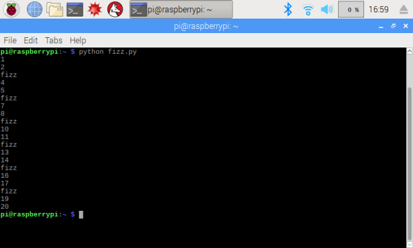

```python
for i in range(1, 21):
    if i % 3 == 0:
        print("fizz")
    else:
        print(i)
```

### 関数

関数を使うと、コードのまとまりに名前を付け、その名前を呼び出して再利用できるようになる。
**パラメータ**と呼ばれる変数を通じて、関数にデータを渡すことができる（関数定義の中の変数を*パラメータ*、実際に渡されるデータそのものを*引数*と呼ぶ）。
`return`文を使えば、呼び出し元にデータを返すこともできる。

関数定義の例は次のようになる。

```python
def functionName(parameter1, parameter2):
    # Code goes here
```

コードの他の場所からこの関数を`functionName(argument1, argument2)`のように呼び出せる。

関数定義の中で宣言された変数は**ローカルスコープ**を持つと呼ばれる。
つまり、その関数の外からはアクセスできない。
プログラムのトップレベル（関数、ループ、クラスの外側）で宣言された変数は**グローバルスコープ**を持つと呼ばれ、プログラムのどこからでも（関数の内部を含めて）アクセスできる。

重要：作成した関数は、使う**前**に定義しておく必要がある。
コード中のより上の位置（`def`定義より前）で関数を呼び出そうとすると、次のようなエラーが出るはずである。

```python
NameError: name 'FUNCTION_NAME' is not defined
```

Pythonには、あらかじめ用意された多くの組み込み関数がある（すでに`print()`、`int()`、`range()`の3つを見た）。
これらの関数の一覧は[The Python Tutorial](https://docs.python.org/3.5/library/functions.html)で確認できる。

**例：**

```python
def add(x, y):
    sum = x + y
    return sum

print(add(2, 3))
```

**参考になる資料：**

- *A Byte of Python*：[Functions](https://python.swaroopch.com/functions.html)
- *The Python Tutorial*：[4.6. Defining Functions](https://docs.python.org/3.5/tutorial/controlflow.html#defining-functions)、[4.7. More on Defining Functions](https://docs.python.org/3.5/tutorial/controlflow.html#more-on-defining-functions)、[2. Built-in Functions](https://docs.python.org/3.5/library/functions.html)

**チャレンジ：** 次のコードから始めて、整数をパラメータ（*n*）として受け取り、1から*n*まで（*n*を含む）のすべての整数の和を計算して返す`sumTo()`関数を実装しよう。入力の*n*は常に正の整数であると仮定してよい（負の数の処理は考えなくてよい）。

```python
def sumTo(n):
    # YOUR CODE GOES HERE

# Should be 1
print(sumTo(1))

# Should be 45
print(sumTo(9))

# Should be 5050
print(sumTo(100))
```

```python
def sumTo(n):
    sum = 0
    for i in range(1, n + 1):
        sum = sum + i
    return sum
    
# Should be 1
print(sumTo(1))

# Should be 45
print(sumTo(9))

# Should be 5050
print(sumTo(100))
```

### オブジェクト

**オブジェクト**についてはまだ触れていなかったが、実のところ、ここまでずっとオブジェクトを使ってきた。
Pythonの秘密は、あらゆるものがオブジェクトであるという点にある。
そう、関数も整数も含めて、*すべて*がオブジェクトなのである。

オブジェクトとは、単にコンピュータのメモリのどこかに保存されたデータの集まりである。
プログラミング言語においてオブジェクトを特別なものにしているのは、情報を保持する能力**と**、動作を実行する能力を併せ持っている点にある。
オブジェクトがデータを保持する様子はすでに見た（たとえば`a = 3`は、`a`が整数オブジェクトであり、`3`という情報を保持していることを意味する）。
では、オブジェクトに動作を実行させるにはどうすればよいだろうか。

オブジェクトには、その**クラス**によって定義された一連の関数が与えられる。
クラスは設計図のような役割を果たし、そのオブジェクトが何をできて何をできないか、どんな情報を保持できて保持できないかを規定する。
クラス（あるいはオブジェクト）の中にある関数のことを**メソッド**と呼ぶ。

たとえば、組み込みの`is_integer()`メソッドを使えば、浮動小数点数が整数かどうかを調べることができる。
このメソッドは`float`オブジェクトからしかアクセスできない点に注意してほしい。
`is_integer()`を単体で呼び出すことはできないので、ドット記法（`.`）を使い、`float`オブジェクト自身に`is_integer()`メソッドを呼び出させる。

**例：**

```python
a = 3.0
b = 7.32

print(a.is_integer())
print(b.is_integer())
```

整数をfloatとして扱うことはできない点にも注意してほしい。
たとえば`c = 8`と書けば、`c`は整数であってfloatではない。
`c`が整数であれば、整数には`.is_integer()`メソッドが存在しないため、`c.is_intger()`の呼び出しは失敗する（インタプリタのエラーになる）。試してみてほしい。
整数の値を強制的に浮動小数点数にするには、`a = 3.0`のときと同様に、末尾に`.0`を付け加えるだけでよい。

**参考になる資料：**

- *A Byte of Python*：[Quick Introduction To Objects And Classes](https://python.swaroopch.com/data_structures.html#quick-introduction-to-objects-and-classes)
- *The Python Library Reference*：[4.4.2. Additional Methods on Integer Types](https://docs.python.org/3.5/library/stdtypes.html#additional-methods-on-integer-types)、[4.4.3. Additional Methods on Float](https://docs.python.org/3.5/library/stdtypes.html#additional-methods-on-float)、[4.7.1. String Methods](https://docs.python.org/3.5/library/stdtypes.html#string-methods)

**チャレンジ：** 次のコードを変更し、`my_string`に格納されているフレーズをすべて小文字に変換してターミナルに出力してみよう。ヒント：[Pythonリファレンスガイドの文字列メソッド](https://docs.python.org/3.5/library/stdtypes.html#string-methods)を確認し、これを行う組み込みメソッドを探してみよう。

```python
my_string = "THiS iS A TEst!"

# Should print "this is a test!"
# YOUR CODE GOES HERE
```

```python
my_string = "THiS iS A TEst!"

# Should print "this is a test!"
print(my_string.lower())
```

### データ構造

*変数*や*オブジェクト*に加えて、Pythonにはデータを保存する方法がさらに4つある。*リスト*、*タプル*、*辞書*、*セット*である。
これらの構造はいずれも関連するデータの集まりを保持し、それぞれ扱い方が少しずつ異なる。

| 構造 | 説明 | 例 |
| --- | --- | --- |
| リスト | *リスト*は順序付けられた項目の並びである。角括弧`[]`とインデックスを使ってリスト内の項目にアクセスできる（例：`list[2]`）。インデックスは0始まりであるため、`list[0]`でリストの最初の項目にアクセスすることになる。リストは変更可能であるため、*ミュータブル*であると言われる。 | `my_list = [1, 5, 73, -3]`<br>`my_list[2] = -42`<br><br>`# Get third item in list`<br>`print(my_list[2])`<br><br>`# Get all but first item in list`<br>`print(my_list[1:])` |
| タプル | *タプル*はリスト（順序付けられた集合）と同じように動作する。違いは、タプルが*イミュータブル*であり、一度設定した値を変更できない点にある。タプルは通常、括弧`()`で指定される。括弧は必須ではないが、コードを読みやすくするために付けることが強く推奨される。 | `my_tuple = ("bird", "plane", 5, "train")`<br><br>`# Get one item from the tuple`<br>`print(my_tuple[0])`<br><br>`# Get a tuple of second and third items`<br>`print(my_tuple[1:3])`<br><br>`# Can't do this because tuples are immutable!`<br>`my_tuple[1] = "skyscraper"` |
| 辞書 | *辞書*は、対応付けられた*キー*と*値*のペアの集まりである。電話帳の仕組みに似ている。名前（キー）を調べて、その電話番号（値）を見つけるようなものである。辞書は波括弧`{}`で定義され、キーと値のペアはコロン`:`で区切られる。辞書はミュータブルである。 | `my_dictionary = {"name": "Bruce", "aka": "The Hulk"}`<br>`my_dictionary["name"] = "Banner"`<br>`print(my_dictionary["name"])` |
| セット | *セット*は、重複した要素を持たない、ミュータブルで順序を持たない集まりである。セットは、ある項目がその中に含まれているかどうかを判定するために最適化されている（項目の順序は気にしなくてよい）。Pythonで何らかの*集合論*を扱いたい場合、セットが役立つ。 | `my_set_1 = set(["orange", "banana"])`<br>`my_set_2 = set(["apple"])`<br>`my_set_2.add("orange")`<br><br>`print(my_set_1)`<br>`print(my_set_2)`<br>`print("apple" in my_set_2)`<br>`print("strawberry" in my_set_2)`<br>`print(my_set_1.union(my_set_2))`<br>`print(my_set_1.intersection(my_set_2))` |

**参考になる資料：**

- *A Byte of Python*：[Data Structures](https://python.swaroopch.com/data_structures.html)
- *The Python Library Reference*：[3.1.3. Lists](https://docs.python.org/3.5/tutorial/introduction.html#lists)、[5.1. Data Structures](https://docs.python.org/3.5/tutorial/datastructures.html)

**チャレンジ：** 次のコードから始めて、リストとして渡された数値の平均を計算する`average()`関数を実装しよう。ヒント：[len()関数](https://docs.python.org/3.5/library/functions.html#len)を使うとよいだろう。

```python
def average(num_list):
    # YOUR CODE GOES HERE

# Should print 5.0
list_1 = [4, 7, 9, 0]
print(average(list_1))

# Should print 4.406333333333
list_2 = [-3.2, 6.419, 10]
print(average(list_2))

# Should print 42.0
list_3 = [42]
print(average(list_3))
```

```python
def average(num_list):
    avg = 0
    for n in num_list:
        avg = avg + n
    avg = avg / len(num_list)
    return avg

# Should print 5.0
list_1 = [4, 7, 9, 0]
print(average(list_1))

# Should print 4.406333333333
list_2 = [-3.2, 6.419, 10]
print(average(list_2))

# Should print 42.0
list_3 = [42]
print(average(list_3))
```

### モジュール

**モジュール**は、コードを再利用しプログラムを整理するもう一つの方法である。
モジュールは単に、メインプログラムに**インポート**されるファイルである。
モジュールをインポートすると、オブジェクトとほぼ同じ方法で、つまりドット記法で定数や関数にアクセスして使うことができる。

**例：**

次の内容を*stringmod.py*として保存する。

```python
a = 42

def string_to_list(s):
    c_list = []
    for c in s:
        c_list.append(c)
    return c_list
```

*stringmod.py*と同じフォルダで、次のコードを実行する（インタプリタでもファイルに保存してもよい）。

```python
import stringmod

s = "Hello!"
print(stringmod.a)
print(stringmod.string_to_list(s))
```

**参考になる資料：**

- *A Byte of Python*：[Modules](https://python.swaroopch.com/modules.html)
- *The Python Tutorial*：[6. Modules](https://docs.python.org/3.5/tutorial/modules.html)

**チャレンジ：** Pythonには、プログラムにインポートできる標準モジュールがいくつか付属している。その一つが[mathモジュール](https://docs.python.org/3.5/library/math.html)で、`import math`で使うことができる。`math`モジュールにある定数と関数を使って、次の操作を行ってみよう。

- 3.456の天井関数を出力する（4になるはず）
- 9216の平方根を出力する（96.0になるはず）
- 半径2の円の面積を計算して出力する（12.566370614359172になるはず）

```python
import math

print(math.ceil(3.456))
print(math.sqrt(9216))
print(math.pi * (2 ** 2))
```

### バグを見つけて直す

プログラムがすぐに正しく動くことはほとんどないので、気に病む必要はない。
コード中の問題を見つけて修正する技術と知識は**デバッグ**と呼ばれる。
最も役立つデバッグツールは、Python標準の出力である。
コードに問題があれば、たいていエラーの場所と内容を教えてくれる。

たとえば、次のコード片を見てみよう。
*forループ*の下にあるコードのインデントを忘れてしまっている。

```python
a = [1, 2, 3, 4]

for n in a:
print(n)
```

このコードを実行すると、Pythonインタプリタが4行目あたりでインデントされたコードを期待していたことを親切に教えてくれる。

```bash
  File "test_01.py", line 4
    print(n)
        ^
IndentationError: expected an indented block
```

もう一つ例を見てみよう。エラーを見つけられるだろうか。

```python
a = [1, 2, 3, 4]

for n in a
    print(n)
```

*forループ*の後のコロンを忘れている。インタプリタは次のように教えてくれる。

```bash
  File "test_01.py", line 3
    for n in a
             ^
SyntaxError: invalid syntax
```

「Invalid syntax」というのは少し漠然としているが、コロンの欠落、括弧の数の誤り、ダブルクォートの代わりにシングルクォートを使っているなど、何かがおかしい箇所として3行目あたりを見るよう教えてくれている。

コードが実行はされるものの、期待した値が出力されない場合はどうすればよいだろうか。
これはプログラマ自身が見つけて直すべき問題である。
コードのあちこちに`print()`文を追加すると、どこで問題が起きたのかを突き止める助けになる。

次のコードを実行してみてほしい。

```python
for i in range(1, 10):
    if i == 10:
        print("end")
```

なぜ"end"がターミナルに表示されないのだろうか。
この問題を診断するため、`print()`文を追加して何が起きているか見てみよう。

```python
for i in range(1, 10):
    print(i)
    if i == 10:
        print("end")
```

これを実行すると、`i`の値が順番に出力されるのがわかる。

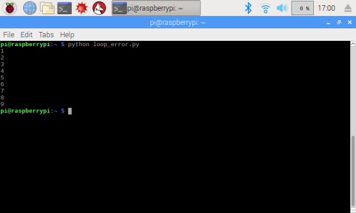

なるほど。`i`は10に到達しないことがわかる。
これは、`range()`関数の2つ目の数値が「含まれない」ためである。
10まで数えたい場合は、次のように変更する必要がある。

```python
for i in range(1, 11):
    if i == 10:
        print("end")
```

`print()`に感謝である。

**参考になる資料：**

- *A Byte of Python*：[Problem Solving](https://python.swaroopch.com/problem_solving.html)
- *The Python Tutorial*：[8. Errors and Exceptions](https://docs.python.org/3.5/tutorial/errors.html)

**チャレンジ：** 次のプログラムに含まれる7つのエラーを見つけよう。エラーを修正して実行すると、1つ目の引数までの数値を出力し、2つ目の引数の倍数を"buzz"という単語に置き換えて出力するはずである。

```python
print("Count to 7, buzz on 2's")            
buzz(7, 2)

print('Count to 10, buzz on 5's")
buzz(10, 5)

def buzz(n):
    for i in range(1, n):
        if i % z = 0:
            print("buzz")
        else
            print(n)
```

正常に動作した場合のプログラムの実行結果は次のとおりである。

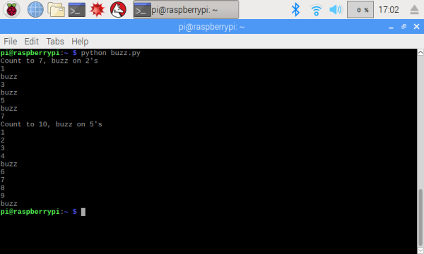

```python
def buzz(n, z):                     # Added z as second parameter
    for i in range(1, n + 1):       # n should be n + 1
        if i % z == 0:              # Change single equal sign to double equal sign
            print("buzz")
        else:                       # Add colon
            print(i)                # Change 'n' to 'i'

print("Count to 7, buzz on 2's")
buzz(7, 2)                          # Move calls to buzz() underneath function definition

print("Count to 10, buzz on 5's")   # Change single quote to double quote
buzz(10, 5)
```

## 実験1：デジタル入出力

組み込みの世界では、多くの開発者がまず最初に手を付けたがるのがLEDの点滅である。
これはある意味、組み込み電子工作における「Hello, World!」である。
コードを実行してハードウェアを制御できることを（しかも即座に、たいてい楽しい形で）証明してくれる。
このセクションではまずLEDを点滅させ、続いてプッシュボタンへの反応も加えてみる。

### 参考になるチュートリアル

- **Python (RPi.GPIO) API** — このチュートリアル全体でハードウェア制御に使うRPi.GPIOモジュールの概要
- **電気とは何か** — 電気の仕組みの基礎を扱う
- **回路とは何か** — 電気が回路の中をどう流れるかを説明する
- **極性** — LEDを回路に特定の向きで組み込む必要がある理由を示す
- **ブレッドボードの使い方** — ブレッドボードはプロトタイピングに便利で、このチュートリアルでも使う

### Raspberry Piのピン配置

Raspberry Piが他の多くのコンピュータより電子工作の学習に向いている理由の一つは、簡単にアクセスできる複数のピンの電圧を制御できる点にある。
Piを縦向きにして正面から見ると（下の写真のとおり）、右側に40ピンのヘッダーがある。
このヘッダーには、3.3V、5V、グラウンド、そして数多くの汎用入出力（GPIO）ピンの出力が用意されている。

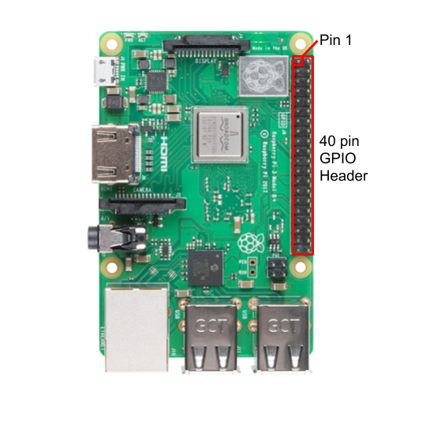

写真に示すとおり、ピン1はヘッダーの左上にある。
ピン1をこの位置に置くと、それぞれのピンが何に使われているかがわかる。

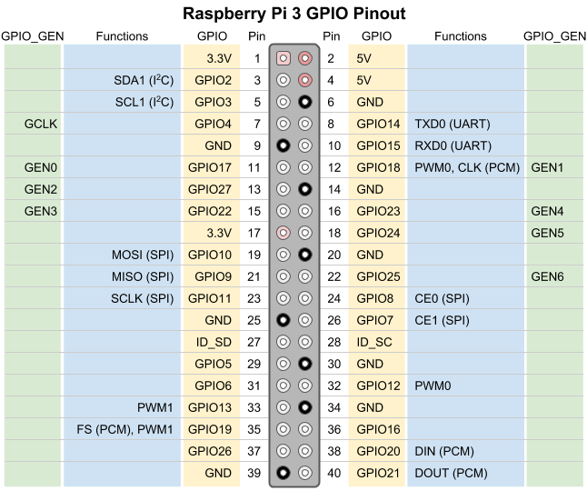

### ハードウェアの接続

Raspberry PiとLED・ボタンを直接接続することもできるし、[SparkFun Pi Wedge](https://www.sparkfun.com/products/13717)を経由してブレッドボード上で接続を楽にすることもできる。
重要なのは、コードの中では**GPIO**番号を使っているという点である（Pi Wedge上では*Gx*と表記されている。xはGPIO番号）。
これらのGPIO番号は、上のGPIOピン配置図の中で黄色の枠に示されている。

- **GPIO12**（ピン32）を330Ω抵抗に接続し、抵抗をLEDに接続する
- **GPIO4**（ピン7）をボタンに接続する
- Fritzing図のとおりに電源（3.3V）とグラウンド（GND）を接続する

> **図が見づらい場合は？** 画像をクリックするとフルサイズの表示になる。

[Pi Wedge](https://www.sparkfun.com/products/13717)があれば、ブレッドボード上の外部ハードウェアへの接続が楽になる。
なくても、ジャンパー線でRaspberry Piに直接接続することはできる。

**Pi Wedgeを介した接続：**

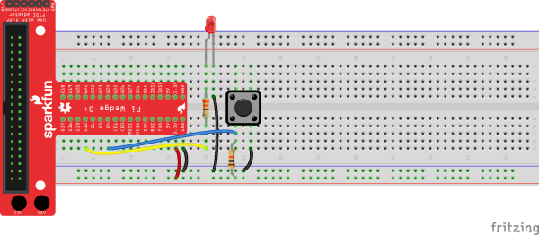

**Raspberry Piに直接接続：**

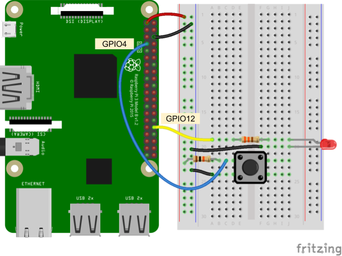

> **注意：** LEDの向きは重要である。電流はLEDの中を一方向にしか流れないため、リード線の向きに注意してほしい。LEDの長いリード線は、330Ω抵抗と同じ行に接続する必要がある。


> **注意：** ボタンを初めて使う場合、少し戸惑うかもしれない。対角にあるピンは常に接続されているのに対し、同じ側にあるピン同士はボタンを押したときだけ接続される。

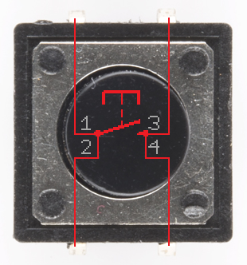

> **注意：** [フルサイズのブレッドボード](https://www.sparkfun.com/products/12615)を使っている場合、電源レールは中央で分割されている。そのため、電源レール全体に電力を行き渡らせるには、両半分をつなぐ必要がある。下の写真で、ジャンパー線を使って電源レールの両半分をつなぐ方法を確認してほしい。

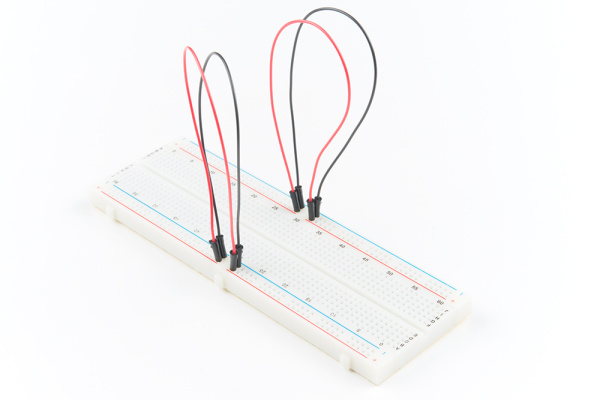

### コード パート1：LEDを点滅させる

Raspbianのバージョンによっては、RPi.GPIOパッケージをインストールする必要があるかもしれない（たとえばRaspbian Liteには一部のPythonパッケージがあらかじめ入っていない）。
ターミナルで次のように入力する。

```bash
pip install rpi.gpio
```

新しいファイルに、次のコードを入力する。

```python
import time
import RPi.GPIO as GPIO

# Pin definitions
led_pin = 12

# Suppress warnings
GPIO.setwarnings(False)

# Use "GPIO" pin numbering
GPIO.setmode(GPIO.BCM)

# Set LED pin as output
GPIO.setup(led_pin, GPIO.OUT)

# Blink forever
while True:
    GPIO.output(led_pin, GPIO.HIGH) # Turn LED on
    time.sleep(1)                   # Delay for 1 second
    GPIO.output(led_pin, GPIO.LOW)  # Turn LED off
    time.sleep(1)                   # Delay for 1 second
```

ファイルを保存する（筆者は*blink.py*という名前にした）。ターミナルから次のように入力してコードを実行する。

```bash
python blink.py
```

LEDが1秒ごとに点滅し始めるはずである。

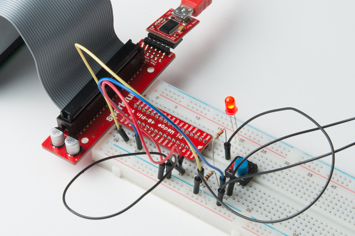

LEDの点滅を見飽きたら、*ctrl + c*を押してプログラムを終了する。

> **トラブルシューティング：** 「ModuleNotFoundError: No module named 'rpi'」というメッセージが表示された場合は、ターミナルで`pip install RPi.GPIO`と入力してRPi.GPIOパッケージをインストールする必要がある。

**注目すべきコード：**

Raspberry Piからハードウェアを制御するために、[RPi.GPIOモジュール](https://pypi.org/project/RPi.GPIO/)を利用する。
このモジュール（他の言語で言うところの「ライブラリ」）は、ピンの切り替えや他のハードウェアとの通信を助けるために特別に設計されている。
ありがたいことに、Raspbianにはあらかじめパッケージ化されて含まれている。

最初の2行でモジュールをインポートしているが、そこにいくつか手を加えている。
まず、`as`というキーワードを使った。

```python
import RPi.GPIO as GPIO
```

`RPi.GPIO`はモジュールの名前である。
`as GPIO`と書くことで、プログラムの残りの部分でこのモジュールをどう呼ぶかを変えている。
これにより、次のように書けるようになる。

```python
GPIO.output(led_pin, GPIO.HIGH)
```

もっと長い次のような書き方をしなくて済む。

```python
RPi.GPIO.output(led_pin, RPi.GPIO.HIGH)
```

コーディング中に警告を無効にするのは一般的にはよい考えではないが、次の行を加えた。

```python
GPIO.setwarnings(False)
```

これがないと、blinkプログラムをもう一度実行しようとしたときにインタプリタから警告が出る。

```python
blink.py:14: RuntimeWarning: This channel is already in use, continuing anyway.  Use GPIO.setwarnings(False) to disable warnings.
  GPIO.setup(led_pin, GPIO.OUT)
```

これは、プログラムを終了した際にGPIO 12ピンをきちんと停止させなかったためである。
これを行うには、プログラムの末尾に`GPIO.cleanup()`の行を追加すればよい。
ただし、今回のプログラムは永遠に実行し続けるように書いたため、プログラムを止めるには中断する必要があり（`cleanup()`の呼び出しは決して行われない）、当面は警告を無視するだけで十分である。

**チャレンジ：** プログラムを変更し、LEDが心拍のように点滅するようにしてみよう。短い点滅を2回連続で行い、その後に長めの間隔を空ける。

```python
import time
import RPi.GPIO as GPIO

# Pin definitions
led_pin = 12

# Suppress warnings
GPIO.setwarnings(False)

# Use "GPIO" pin numbering
GPIO.setmode(GPIO.BCM)

# Set LED pin as output
GPIO.setup(led_pin, GPIO.OUT)

# Blink forever
while True:
    GPIO.output(led_pin, GPIO.HIGH)
    time.sleep(0.2)
    GPIO.output(led_pin, GPIO.LOW)
    time.sleep(0.2)
    GPIO.output(led_pin, GPIO.HIGH)
    time.sleep(0.2)
    GPIO.output(led_pin, GPIO.LOW)
    time.sleep(1)
```

### コード パート2：PWMでLEDをフェードさせる

LEDのオン・オフの切り替え方は見たが、明るさのレベルを制御するにはどうすればよいだろうか。
LEDの明るさは、流れる電流の量を制御することで決まるが、それにはさらに多くのハードウェア部品が必要になる。
簡単な方法として、目で追えないほど速くLEDを点滅させるというやり方がある。

LEDがオンになっている時間とオフになっている時間の割合を制御することで、見た目の明るさを変えることができる。
これは**パルス幅変調**（PWM）と呼ばれる。
利用できるPWMチャンネルは2つあり、PWM0とPWM1である。
PWM0にPWM信号を出力すると、GPIO12とGPIO18に現れる。
また、PWM1はGPIO13とGPIO19の信号を制御する。

次のコードをファイル（例：*pwm.py*）にコピーする。

```python
import time
import RPi.GPIO as GPIO

# Pin definitions
led_pin = 12

# Use "GPIO" pin numbering
GPIO.setmode(GPIO.BCM)

# Set LED pin as output
GPIO.setup(led_pin, GPIO.OUT)

# Initialize pwm object with 50 Hz and 0% duty cycle
pwm = GPIO.PWM(led_pin, 50)
pwm.start(0)

# Set PWM duty cycle to 50%, wait, then to 90%
pwm.ChangeDutyCycle(50)
time.sleep(2)
pwm.ChangeDutyCycle(90)
time.sleep(2)

# Stop, cleanup, and exit
pwm.stop()
GPIO.cleanup()
```

実行すると（`python pwm.py`など）、LEDが薄暗い状態から始まり、2秒待って明るくなり、さらに2秒待ってからプログラムの終了とともに消灯するはずである。

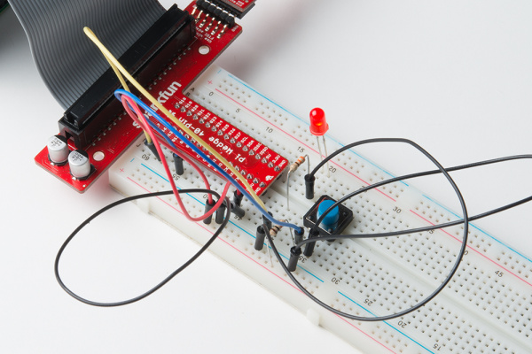

**注目すべきコード：**

先ほどはLEDの切り替えに`GPIO`モジュールの`.output()`関数を使った。
ここでは`PWM`オブジェクトを作成し、`pwm`という変数に格納する。次の行で行う。

```python
pwm = GPIO.PWM(led_pin, 50)
```

これ以降は、そのオブジェクト内のメソッドを呼び出すことでPWMを制御できる。
たとえば、明るさを変えるには次のように呼び出す。

```python
pwm.ChangeDutyCycle(t)
```

`t`は0〜100の間の数値である（0がオフ、100が常時オン）。
50という数値を入れると、LEDは半分の時間オン、残り半分の時間オフになる（切り替えが速すぎて目には見えないだけである）。

また、今回は`GPIO.setwarnings()`の呼び出しを省いている。
プログラムの末尾で`GPIO.cleanup()`を実際に呼び出せるからである。
PWMのコードを2回実行しても、警告は表示されないはずである。

**チャレンジ：** LEDが約2秒かけて、消灯状態から最大の明るさまでゆっくりフェードするようにしてみよう。
最大の明るさに達したらLEDを消灯し、フェードの過程をもう一度繰り返す。
このフェードを永遠に繰り返すようにする。

```python
import time
import RPi.GPIO as GPIO

# Pin definitions
led_pin = 12

# Use "GPIO" pin numbering
GPIO.setmode(GPIO.BCM)

# Set LED pin as output
GPIO.setup(led_pin, GPIO.OUT)

# Initialize pwm object with 50 Hz and 0% duty cycle
pwm = GPIO.PWM(led_pin, 50)
pwm.start(0)

# Have the LED slowly fade up, turn off, and repeat
while True:
    for brightness in range(0, 101):
        pwm.ChangeDutyCycle(brightness)
        time.sleep(0.02)
```

### コード パート3：ボタン入力

ユーザー入力を加えてみよう。次の内容をファイル（例：*button.py*）に保存する。

```python
import time
import RPi.GPIO as GPIO

# Pins definitions
btn_pin = 4
led_pin = 12

# Set up pins
GPIO.setmode(GPIO.BCM)
GPIO.setup(btn_pin, GPIO.IN)
GPIO.setup(led_pin, GPIO.OUT)

# If button is pushed, light up LED
try:
    while True:
        if GPIO.input(btn_pin):
            GPIO.output(led_pin, GPIO.LOW)
        else:
            GPIO.output(led_pin, GPIO.HIGH)

# When you press ctrl+c, this will be called
finally:
    GPIO.cleanup()
```

コードを実行する（`python button.py`）。
これで、ボタンを押すとLEDが点灯するはずである。

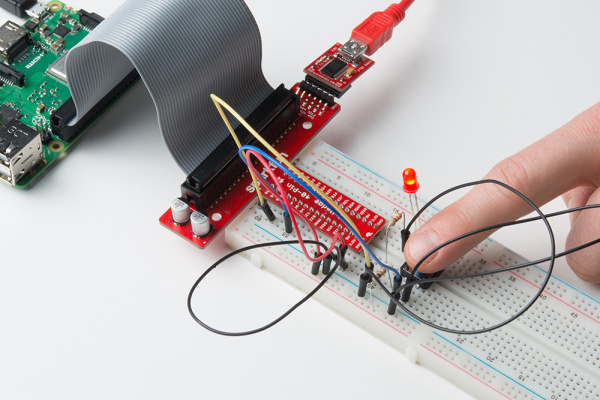

**注目すべきコード：**

まず目につく奇妙な点は`try:`と`finally:`という文だろう。
これらはPythonのエラー・例外処理機能の一部である（詳しくは[Byte of Pythonの例外の章](https://python.swaroopch.com/exceptions.html)を参照してほしい）。

プログラムが`while True:`ループの中にいる間に*ctrl + c*を押すと、例外が発生する。
その例外自体に対して何かをしたいわけではない（そのため「例外処理」で読んだような`except`ブロックは見当たらない）。
ただ、例外の内容にかかわらず、`GPIO.cleanup()`関数は必ず呼び出したい。
そうすればGPIOをきちんと閉じることができ、それ以上のエラーを心配せずに済む。

もう一つ気になる点として、`GPIO.input(btn_pin)`が`True`（つまりピンが論理ハイ、3.3V）のときにLEDを消灯している。おや、と思うかもしれない。

この回路では、ボタンの一方のピンを常時3.3Vにつなぐ**プルアップ**抵抗を使っている。
つまり、デフォルトの状態（押されていない状態）では、ボタンに接続されたピンは3.3Vになる。
ボタンを押すと、（ボタン内部の接点を通じて）そのピンはグラウンドに接続され、論理ロー（0V）になる。

その結果、ボタンが押されていないときは論理ハイになり（`GPIO.input()`は`True`を返す）、ボタンが押されているときは論理ローになる（`GPIO.input()`は`False`を返す）。

**チャレンジ：** ボタンを押すたびに変数を1つ増やし、画面に出力するプログラムを書いてみよう。
これはシンプルなボタンカウンターとして動作するはずである。
0から始まり、ボタンを押すたびに画面上でカウントアップする。

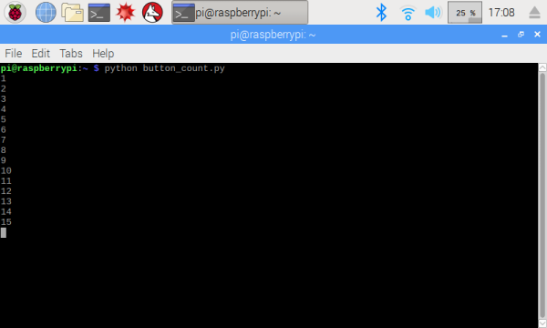

```python
import time
import RPi.GPIO as GPIO

# Pins definitions
btn_pin = 4

# Set up pins
GPIO.setmode(GPIO.BCM)
GPIO.setup(btn_pin, GPIO.IN)

# Our counter
counter = 0

# Remember the current and previous button states
current_state = True
prev_state = True

# If button is pushed, light up LED
try:
    while True:
        current_state = GPIO.input(btn_pin)
        if (current_state == False) and (prev_state == True):
            counter = counter + 1
            print(counter)
        prev_state = current_state

# When you press ctrl+c, this will be called
finally:
    GPIO.cleanup()
```

## 実験2：音を鳴らす

Raspberry Piで音声クリップをダウンロードして再生するのは非常に簡単である。
コマンドラインを使って.wavファイルをダウンロードし、音量を調整し、再生をテストする。
続いて、ボタンを押すたびにそのファイルを再生するPythonスクリプトを書く。

### 参考になるチュートリアル

- **[amixer](https://linux.die.net/man/1/amixer)** — Raspberry Piの音量調整に*amixer*というLinuxツールを使う
- **[Pygame](https://en.wikipedia.org/wiki/Pygame)** — Pygameは、Pythonでシンプルなゲームを作るためのフレームワークである。Raspbianにはあらかじめpygameが入っているため、音を再生するのに使うことができる。

### ハードウェアの接続

朗報である。前回の実験と同じ回路をそのまま使う。

- **GPIO12**（ピン32）を330Ω抵抗に接続し、抵抗をLEDに接続する
- **GPIO4**（ピン7）をボタンに接続する
- Fritzing図のとおりに電源（3.3V）とグラウンド（GND）を接続する

**Pi Wedgeを介した接続：**


**Raspberry Piに直接接続：**


外部スピーカー（またはヘッドホン）をPiのヘッドホンジャックに接続する必要もある。
[Hamburger Mini Speaker](https://www.sparkfun.com/products/14023)を使っている場合は、充電されていて電源が入っていることを確認する。


### オーディオの設定

コードを書く前に、コマンドラインからオーディオを設定する必要がある。
（デスクトップ版のRaspbianを使っている場合は）ターミナルを開く。

> **注意：** `sudo raspi-config`のAdvanced Optionsから、出力オーディオデバイスとして**3.5mm（「ヘッドホン」）ジャック**を選択していることを確認してほしい。方法については「Piの設定」の節を参照してほしい。

ターミナルから、次のコマンドを入力する。

```bash
amixer set PCM unmute
amixer set PCM 100%
```

オーディオがオンになり音量が上がっていることを確認するには、次のコマンドを入力する。

```bash
amixer
```

出力の末尾に`Mono: Playback 400 [100%] [4.00dB] [on]`と表示されるはずである。

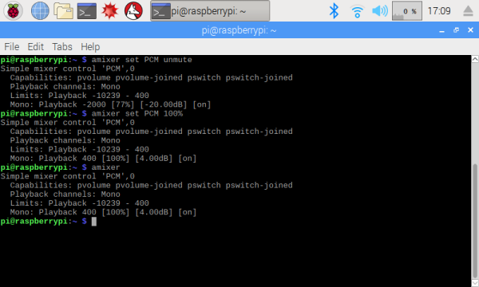

無料のサウンドクリップをダウンロードする（せっかくなので拍手の音にしてみよう）。

```bash
wget http://www.pacdv.com/sounds/people_sound_effects/applause-1.wav
```

次のコマンドでこのサウンドの再生をテストする。

```bash
aplay applause-1.wav
```

スピーカー（またはヘッドホン）から歓声と拍手の音が聞こえるはずである。

### コード：ボタンを押すと音が鳴る

Raspbianのバージョンによっては、pygameパッケージをインストールする必要があるかもしれない（たとえばRaspbian Liteには一部のPythonパッケージがあらかじめ入っていない）。
ターミナルで次のように入力する。

```bash
sudo apt-get update
sudo apt-get install python3-pygame
```

新しいファイルに、次のコードを入力する。

```python
import time
import RPi.GPIO as GPIO
from pygame import mixer

# Pins definitions
btn_pin = 4

# Set up pins
GPIO.setmode(GPIO.BCM)
GPIO.setup(btn_pin, GPIO.IN)

# Initialize pygame mixer
mixer.init()

# Remember the current and previous button states
current_state = True
prev_state = True

# Load the sounds
sound = mixer.Sound('applause-1.wav')

# If button is pushed, light up LED
try:
    while True:
        current_state = GPIO.input(btn_pin)
        if (current_state == False) and (prev_state == True):
            sound.play()
        prev_state = current_state

# When you press ctrl+c, this will be called
finally:
    GPIO.cleanup()
```

ファイルを保存し（例：*applause.py*）、`python applause.py`でプログラムを開始する。
ボタンを押すと、お祝いの音が聞こえるはずである。

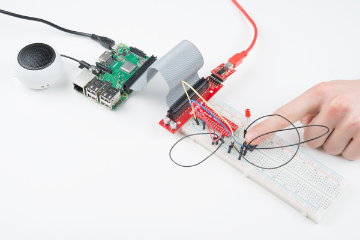

> **トラブルシューティング：** 「ModuleNotFoundError: No module named 'pygame'」というメッセージが表示された場合は、ターミナルで`pip install pygame`と入力してpygameパッケージをインストールする必要がある。

**注目すべきコード：**

音を鳴らすために*pygame*パッケージを使っている。
Pythonにおける**パッケージ**とは、モジュールをまとめた集まりである。
ありがたいことに、*pygame*はRaspbianのPythonにあらかじめインストールされている。
これを使うには、コード中で`from pygame`と書き、その後に`import`を続けてどのモジュールを使いたいかを指定すればよい。たとえば次のように書く。

```python
from pygame import mixer
```

これは、`pygame`パッケージから`mixer`モジュールをインポートしたいという意味である。
この後のコードでは、`mixer`モジュールを使って次のように`Sound`オブジェクトを作成できる。

```python
sound = mixer.Sound('applause-1.wav')
```

ダウンロードしたファイル*applause-1.wav*を使って`Sound`オブジェクトを作成し、それを`sound`変数に格納している。
`Sound`オブジェクトの`.play()`メソッドを呼び出すと、.wavファイルの再生が始まる。

```python
sound.play()
```

**チャレンジ：** 音が再生されている最中にもう一度ボタンを押すと、新しい音が最初のクリップと重なって再生されてしまうことに気づいたかもしれない。これを直してみよう。
音の再生中にボタンを押すと音が止まるようにコードを変更する。
もう一度押すと、そのサウンドクリップが最初から再生される。
さらに、せっかくなので音が再生されている間はLEDが点灯するようにしてみよう。
ヒント：音が再生中（「ミックス中」）かどうかを調べる方法や、音を止める方法については[pygame.mixer](https://www.pygame.org/docs/ref/mixer.html)のメソッドを確認するとよい。

```python
import time
import RPi.GPIO as GPIO
from pygame import mixer

# Pins definitions
btn_pin = 4
led_pin = 12

# Set up pins
GPIO.setmode(GPIO.BCM)
GPIO.setup(btn_pin, GPIO.IN)
GPIO.setup(led_pin, GPIO.OUT)

# Initialize pygame mixer
mixer.init()

# Remember the current and previous button states
current_state = True
prev_state = True

# Load the sounds
sound = mixer.Sound('applause-1.wav')

# If button is pushed, light up LED
try:
    while True:

        # If button is pressed, turn on LED and play sound
        current_state = GPIO.input(btn_pin)
        if (current_state == False) and (prev_state == True):
            if mixer.get_busy():
                sound.stop()
            else:
                GPIO.output(led_pin, GPIO.HIGH)
                sound.play()

        # Only turn off LED if sound has stopped playing
        if mixer.get_busy() == False:
            GPIO.output(led_pin, GPIO.LOW)

        # Save state of switch to use in next iteration of the loop
        prev_state = current_state

# When you press ctrl+c, this will be called
finally:
    GPIO.cleanup()
```

## 実験3：SPIとアナログ入力

世の中の多くのセンサーは、測定データをアナログ電圧として伝える。
たとえば、[フォトセル](https://www.sparkfun.com/products/9088)は、センサーに当たる光の量に応じて抵抗値を変化させる。
回路の中で分圧回路を使うことで、電圧を測定することにより、実質的に周囲の光の量を測定できる。

残念ながら、Raspberry Piにはアナログ電圧を測定する手段が備わっていない。
これを行うには、別のハードウェア、**アナログ-デジタルコンバータ**（ADC）が必要になる。
今回は[Microchip MCP3002](https://www.sparkfun.com/products/8636)を使う。
これは、最大2つのアナログ電圧を別々のチャンネルで測定し、**シリアルペリフェラルインターフェース**（SPI）経由でその値を報告できる、便利な小型チップである。

SPIバス上でコマンドを送信し応答を読み取るために、Pythonの組み込みモジュールである*spidev*を使う。

### 参考になるチュートリアル

- **アナログとデジタルの違い** — 両者の違いと、この例でそれを気にする必要がある理由
- **分圧回路** — 分圧回路の構成、使い方、値の計算方法を説明する
- **シリアルペリフェラルインターフェース（SPI）** — SPIが低レベルでどう動作するかを学びたい場合に読んでほしい
- **2進数** — このセクションでは2進数を直接扱う

### ハードウェアの接続

それぞれの接続がどのピンとGPIOラベルに対応するかは、前の例の*Raspberry Piのピン配置*の節を参照してほしい。

- **MOSI**（GPIO10、ピン19）をMCP3002のDinに接続する
- **MISO**（GPIO9、ピン21）をMCP3002のDoutに接続する
- **SCLK**（GPIO11、ピン23）をMCP3002のCLKに接続する
- **CE0**（GPIO8、ピン24）をMCP3002のCS/SHDNに接続する
- フォトセルの分圧回路をMCP3002のCH0に接続する
- ポテンショメータの中央のピンをMCP3002のCH1に接続する
- Fritzing図のとおりに電源（3.3V）とグラウンド（GND）を接続する

**Pi Wedgeを介した接続：**

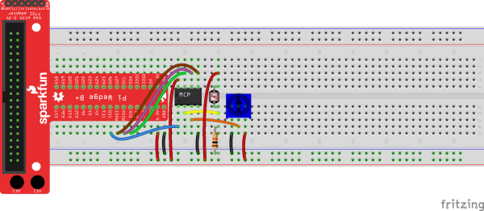

**Raspberry Piに直接接続：**

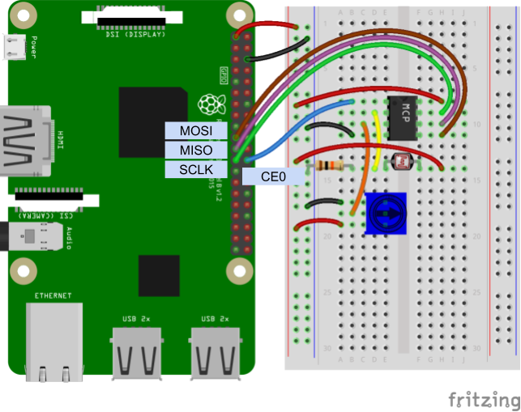

> **注意：** MCP3002の向きに注意してほしい。チップの上面に切り欠きがあるはずである。切り欠きを上に向けたとき、ピン1は切り欠きの左下にある。

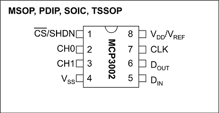

*[MCP3002データシート](http://ww1.microchip.com/downloads/en/DeviceDoc/21294C.pdf)によるピン配置*

### コード：アナログ電圧を読み取る

Raspbianのバージョンによっては、spidevパッケージをインストールする必要があるかもしれない（たとえばRaspbian Liteには一部のPythonパッケージがあらかじめ入っていない）。
ターミナルで次のように入力する。

```bash
pip install spidev
```

新しいファイルに、次のコードを入力する。

```python
import time
import spidev

spi_ch = 0

# Enable SPI
spi = spidev.SpiDev(0, spi_ch)
spi.max_speed_hz = 1200000

def read_adc(adc_ch, vref = 3.3):

    # Make sure ADC channel is 0 or 1
    if adc_ch != 0:
        adc_ch = 1

    # Construct SPI message
    #  First bit (Start): Logic high (1)
    #  Second bit (SGL/DIFF): 1 to select single mode
    #  Third bit (ODD/SIGN): Select channel (0 or 1)
    #  Fourth bit (MSFB): 0 for LSB first
    #  Next 12 bits: 0 (don't care)
    msg = 0b11
    msg = ((msg << 1) + adc_ch) << 5
    msg = [msg, 0b00000000]
    reply = spi.xfer2(msg)

    # Construct single integer out of the reply (2 bytes)
    adc = 0
    for n in reply:
        adc = (adc << 8) + n

    # Last bit (0) is not part of ADC value, shift to remove it
    adc = adc >> 1

    # Calculate voltage form ADC value
    voltage = (vref * adc) / 1024

    return voltage

# Report the channel 0 and channel 1 voltages to the terminal
try:
    while True:
        adc_0 = read_adc(0)
        adc_1 = read_adc(1)
        print("Ch 0:", round(adc_0, 2), "V Ch 1:", round(adc_1, 2), "V")
        time.sleep(0.2)

finally:
    spi.close()
    GPIO.cleanup()
```

ファイルを保存し（例：*adc.py*）、Pythonで実行する。

```bash
python adc.py
```

フォトセルを覆うと、*Ch 0*の電圧が変化するはずである。
ポテンショメータのつまみを回すと、*Ch 1*の電圧が変化する。

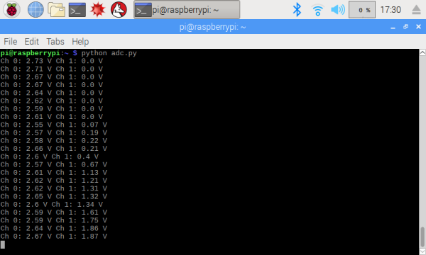

**注目すべきコード：**

SpiDevオブジェクトを初期化する際、Raspberry PiのSPIチャンネル0を使っている。

```python
spi_ch = 0
spi = spidev.SpiDev(0, spi_ch)
```

チャンネル0は、Pi上のCE0（チップイネーブル0）に対応する。
SPIバス上で別のデバイスを使いたい場合は、それをCE1に接続し、SpiDevのチャンネル1も使う必要がある。

SPIメッセージは、個々のビットを操作して組み立てる。
まず、接頭辞'0b'を使って2進数の11（10進数の3にあたる）から始める。

```python
msg = 0b11
```

[MCP3002データシート](http://ww1.microchip.com/downloads/en/DeviceDoc/21294C.pdf)のセクション5を見ると、送信を開始するために1を送り、続けて「シングルエンドモード」を示すもう一つの1を送る必要があることがわかる。
その後、0（チャンネル0の場合）または1（チャンネル1の場合）でチャンネルを選択する。
続いて、下位ビット（LSB）から先に返してほしいことを示す0を送る。

```python
msg = ((msg << 1) + adc_ch) << 5
```

最後に、さらに12個の0を送る。
ここで送る内容自体に意味はなく、MCP3002からDout（MISO）ライン経由でデータを送り返してもらうためのクロックパルスを送っているだけである。
このデータ（4つの設定ビットに続く12個の0）はリストに格納される。

```python
msg = [msg, 0b00000000]
```

返ってきたデータは`reply`変数に格納され、2バイト（それぞれ整数として保存された2要素）のリストとして受け取る。
SPIでは、データを送信すると同時に応答を読み取る点に注意してほしい。

```python
reply = spi.xfer2(msg)
```

そこから、1つ目のバイトを8ビット左にシフトし、2つ目のバイトを加えることで、2つのバイト（8ビット）から一つの整数を組み立てる。
最後に読み込む1ビットは余分なもの（ADCの戻り値には含まれない）なので、答えを右に1ビットシフトする。

```python
adc = 0
for n in reply:
    adc = (adc << 8) + n

adc = adc >> 1
```

ADCの値は、（Vdd/Vrefピンの電圧が何であれ）最大電圧に対する**割合**として与えられる。
この割合は、応答値を1024で割ることで計算される。
1024という数字が出てくるのは、MCP3002が**10ビットADC**であり、10ビットの最大値（0b1111111111）が1023であることによる。
多くのADCには何らかの誤差があるため、計算をしやすくするために切り上げて1024としている（興味があれば、[ADCの最大値についてのこの議論](https://forum.arduino.cc/index.php?topic=303189.0)を参照してほしい）。

*val / 1024*で**Vrefに対する割合**が求まったら、その割合に**Vref**（Raspberry Piの場合は3.3Vとわかっている）を掛ける。

```python
voltage = (vref * adc) / 1024
```

こうしてアナログ電圧の読み取り値が得られる。
ここまでの説明がわかりにくければ、`Enable SPI`の部分と`read_adc()`関数をそのまま自分のコードにコピーしてしまってよい。
あとは`read_adc(0)`を呼び出すだけで、MCP3002のCH0の電圧が得られる。

もう一つ興味深いのが、**デフォルトパラメータ**という考え方である。
`read_adc()`の定義を見てみよう。

```python
def read_adc(adc_ch, vref = 3.3):
```

実際には`adc_ch`と`vref`という2つのパラメータがあることがわかる。
この関数を呼び出す際は、チャンネル番号（0または1）を必ず渡す必要がある。
ただし、Vrefの値は**任意**で渡すことができる。
Raspberry Piの場合、ほとんどの状況で電圧は3.3Vになる。
別の電圧（たとえば5V）を使う場合は、計算式を変更することでADCからより正確な読み取り値を得られる。

この関数を別のVref（たとえば5）で呼び出すには、`read_adc(0, 5)`のように書くか、`vref`パラメータを明示的に指定して`read_adc(0, vref=5)`のように書く。
ただし、MCP3002には3.3Vを接続していることがわかっているので、単に`read_adc(0)`と呼び出せば、計算の際にデフォルトパラメータの`vref=3.3`が使われる。

**チャレンジ：** 回路にLEDを追加しよう。
可変ナイトライトとして動作するプログラムを書いてみよう。
つまり、フォトセルが暗さ（周囲の光が少ないこと）を検知したときにLEDを点灯させ、フォトセルが明るさ（周囲の光が多いこと）を検知したときにLEDを消灯させる。
LEDが点灯しているときは、ポテンショメータでその明るさを制御できるようにする。
ヒント：明るいか暗いかのしきい値を決めるために、いくつか測定しておくとよいだろう。フォトセルを手で覆ったときの電圧はいくつだろうか。

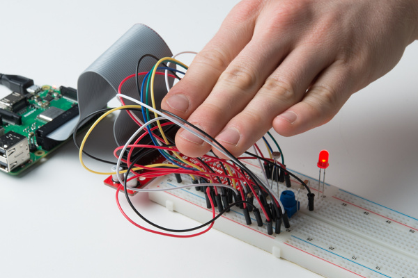

前の実験と同様に、GPIO12（ピン32）にLEDと抵抗を接続する。

```python
import time
import spidev
import RPi.GPIO as GPIO

# Pin definitions
led_pin = 12

# Light/dark threshold (Volts)
light_threshold = 2.2

# Use "GPIO" pin numbering
GPIO.setmode(GPIO.BCM)

# Set LED as output
GPIO.setup(led_pin, GPIO.OUT)

# Initialize pwm object with 50 Hz and 0% duty cycle
pwm = GPIO.PWM(led_pin, 50)
pwm.start(0)

# SPI channel (use CE0)
spi_ch = 0

# Enable SPI
spi = spidev.SpiDev(0, spi_ch)
spi.max_speed_hz = 1200000

def read_adc(adc_ch, vref = 3.3):

    # Make sure ADC channel is 0 or 1
    if adc_ch != 0:
        adc_ch = 1

    # Construct SPI message
    #  First bit (Start): Logic high (1)
    #  Second bit (SGL/DIFF): 1 to select single mode
    #  Third bit (ODD/SIGN): Select channel (0 or 1)
    #  Fourth bit (MSFB): 0 for LSB first
    #  Next 12 bits: 0 (don't care)
    msg = 0b11
    msg = ((msg << 1) + adc_ch) << 5
    msg = [msg, 0b00000000]
    reply = spi.xfer2(msg)

    # Construct single integer out of the reply (2 bytes)
    adc = 0
    for n in reply:
        adc = (adc << 8) + n

    # Last bit (0) is not part of ADC value, shift to remove it
    adc = adc >> 1

    # Calculate voltage form ADC value
    voltage = (vref * adc) / 1024

    return voltage

# Read ADC values and determine if LED should be on or off
try:
    while True:

        # Read ADC values
        light_val = read_adc(0)
        knob_val = read_adc(1)

        # Calculate brightness for when LED is on
        # Max brightness is 100% duty cycle
        brightness = (knob_val / 3.3) * 100

        # Turn LED off if ambient light is above threshold
        # Turn LED on if ambient light is equal to or below threshold
        if light_val > light_threshold:
            pwm.ChangeDutyCycle(0)
        else:
            pwm.ChangeDutyCycle(brightness)
        time.sleep(0.1)

finally:
    pwm.stop()
    spi.close()
    GPIO.cleanup()
```

## 実験4：I2C温度センサー

アナログセンサーやSPIチップに加えて、Inter-Integrated Chip（IICあるいはI2C）プロトコルに依存するセンサー（や他のデバイス）にもよく出会う。
これは、クロックとデータのチャンネルからなる2線式のバスである。
マスター（Raspberry Pi）とデバイス（センサー）は、同じデータ線の上で通信できる。

このプロトコルの動作を実際に見るため、[TMP102温度センサー](https://learn.sparkfun.com/tutorials/tmp102-digital-temperature-sensor-hookup-guide)と通信するプログラムを書いてみる。
低レベルの通信処理は、Pythonの*smbus*モジュールに任せる。
「SMBus」は「System Management Bus」の略で、I2Cプロトコルの上に構築されたもう一つのプロトコル層である点に注意してほしい。
*smbus*を使うと、I2Cのいくつかの機能（クロックストレッチングなど）は失われるが、それでも多くのI2Cセンサーと通信できる。

### 参考になるチュートリアル

- **I2C** — I2Cプロトコルがどう動作するかを詳しく見る

### ハードウェアの接続

I2Cのサンプルの代替として、はんだ付けや4本のピンへの接続を必要としないQwiicケーブルとQwiic対応TMP102を使うこともできる。

前の実験の*ピン配置*の図を参照してほしい。

- **SDA1**（GPIO2、ピン3）をTMP102のSDAに接続する
- **SCL1**（GPIO3、ピン5）をTMP102のSCLに接続する
- 電源（3.3V）をTMP102のVCCに接続する
- グラウンド（GND）をTMP102のGNDに接続する

**Pi Wedgeを介した接続：**

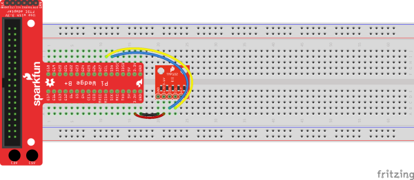

**Raspberry Piに直接接続：**

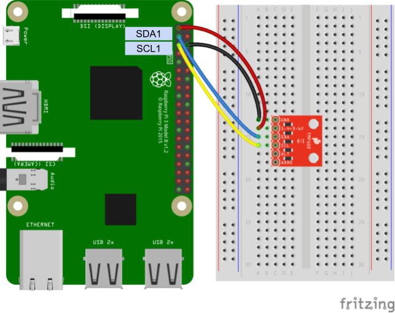

### コード：温度を読み取って計算する

Raspbianのバージョンによっては、smbusパッケージをインストールする必要があるかもしれない（たとえばRaspbian Liteには一部のPythonパッケージがあらかじめ入っていない）。
ターミナルで次のように入力する。

```bash
sudo apt-get install python3-smbus
```

新しいファイルに、次のコードをコピーする。

```python
import time
import smbus

i2c_ch = 1

# TMP102 address on the I2C bus
i2c_address = 0x48

# Register addresses
reg_temp = 0x00
reg_config = 0x01

# Calculate the 2's complement of a number
def twos_comp(val, bits):
    if (val & (1 << (bits - 1))) != 0:
        val = val - (1 << bits)
    return val

# Read temperature registers and calculate Celsius
def read_temp():

    # Read temperature registers
    val = bus.read_i2c_block_data(i2c_address, reg_temp, 2)
    # NOTE: val[0] = MSB byte 1, val [1] = LSB byte 2
    #print ("!shifted val[0] = ", bin(val[0]), "val[1] = ", bin(val[1]))

    temp_c = (val[0] << 4) | (val[1] >> 4)
    #print (" shifted val[0] = ", bin(val[0] << 4), "val[1] = ", bin(val[1] >> 4))
    #print (bin(temp_c))

    # Convert to 2s complement (temperatures can be negative)
    temp_c = twos_comp(temp_c, 12)

    # Convert registers value to temperature (C)
    temp_c = temp_c * 0.0625

    return temp_c

# Initialize I2C (SMBus)
bus = smbus.SMBus(i2c_ch)

# Read the CONFIG register (2 bytes)
val = bus.read_i2c_block_data(i2c_address, reg_config, 2)
print("Old CONFIG:", val)

# Set to 4 Hz sampling (CR1, CR0 = 0b10)
val[1] = val[1] & 0b00111111
val[1] = val[1] | (0b10 << 6)

# Write 4 Hz sampling back to CONFIG
bus.write_i2c_block_data(i2c_address, reg_config, val)

# Read CONFIG to verify that we changed it
val = bus.read_i2c_block_data(i2c_address, reg_config, 2)
print("New CONFIG:", val)

# Print out temperature every second
while True:
    temperature = read_temp()
    print(round(temperature, 2), "C")
    time.sleep(1)
```

ファイルを保存し（例：*tmp102.py*）、Pythonで実行する。

```bash
python tmp102.py
```

CONFIGレジスタの2バイトが更新され、続けて1秒ごとに温度が画面に出力されるはずである。

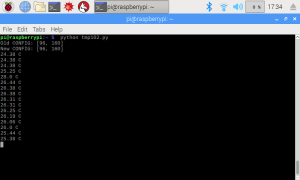

**注目すべきコード：**

SPIとは異なり、I2Cはアドレスとレジスタの組み合わせに依存する。
SPIは一度に一つのチップとだけ通信するように構成されているのに対し、I2Cは一つのバス上に多数のデバイスを共存させることができる。
競合を避けるため、（メーカーによって）デバイスにアドレスが割り当てられ、ホスト（Pi）がどのデバイスと通信しようとしているかを各デバイスが判別できるようになっている。
今回のTMP102のアドレスは`0x48`である。

TMP102と通信するたびに、そのアドレス（0x48）をバス上に送信する必要がある。
そうして初めて、TMP102上で読み書きしたい**レジスタ**のメモリ位置（**アドレス**）を送信できる。
ほとんどのI2Cデバイスにおいて、**レジスタ**とはデバイスのメモリ上の、8ビット（1バイト）のデータを保持する位置のことである点に注意してほしい。
このデータがデバイスの機能を制御することもあれば（CONFIGレジスタの場合のように）、センサーの測定データを保持することもある（温度レジスタの場合のように）。

TMP102の温度レジスタから2バイトを読み取るには、次のコマンドを使う。

```python
val = bus.read_i2c_block_data(i2c_address, reg_temp, 2)
```

これらの値は`val`変数にリスト`[x, y]`として格納される。
[TMP102のデータシート](https://www.sparkfun.com/datasheets/Sensors/Temperature/tmp102.pdf)を見ると、温度は12ビットで表されることがわかる。
この読み取り値を含む2バイトを読む際は、2バイト目の末尾4ビットを取り除く必要がある。
また、1バイト目は4ビット分シフトする。

```python
temp_c = (val[0] << 4) | (val[1] >> 4)
```

温度の負の値を表現できるようにするため、TMP102からの値は**2の補数**の形式で送られてくることがある。
この場合、12ビットの数値の最初のビットが、その値が正か負かを決める（0なら正、1なら負）。
2の補数について詳しくは[この記事](https://www.cs.cornell.edu/~tomf/notes/cps104/twoscomp.html)を参照してほしい。

Pythonで2の補数の数値を負の数に変換するには、最初のビットが0か1かを調べる。
0であれば、その数値をそのまま使う（正の数である）。
1であれば、その数値から2の補数の最大の負の数（今回の場合は2^12=4096）を引く。

```python
if (val & (1 << (bits - 1))) != 0:
    val = val - (1 << bits)
```

**チャレンジ：** CONFIGレジスタを変更し、TMP102が1秒間に8回、温度の読み取りを更新するようにしてみよう（8回ではなく）。
また、温度を華氏で出力してみよう。
ヒント：[TMP102のデータシート](https://www.sparkfun.com/datasheets/Sensors/Temperature/tmp102.pdf)の7ページを見て、CONFIGレジスタのどのビットを変更する必要があるか確認してほしい。

```python
import time
import smbus

i2c_ch = 1

# TMP102 address on the I2C bus
i2c_address = 0x48

# Register addresses
reg_temp = 0x00
reg_config = 0x01

# Calculate the 2's complement of a number
def twos_comp(val, bits):
    if (val & (1 << (bits - 1))) != 0:
        val = val - (1 << bits)
    return val

# Read temperature registers and calculate Celsius
def read_temp():

    # Read temperature registers
    val = bus.read_i2c_block_data(i2c_address, reg_temp, 2)
    # NOTE: val[0] = MSB byte 1, val [1] = LSB byte 2
    #print ("!shifted val[0] = ", bin(val[0]), "val[1] = ", bin(val[1]))
    
    temp_c = (val[0] << 4) | (val[1] >> 4)
    #print (" shifted val[0] = ", bin(val[0] << 4), "val[1] = ", bin(val[1] >> 4))
    #print (bin(temp_c))

    # Convert to 2s complement (temperatures can be negative)
    temp_c = twos_comp(temp_c, 12)

    # Convert registers value to temperature (C)
    temp_c = temp_c * 0.0625

    return temp_c

# Initialize I2C (SMBus)
bus = smbus.SMBus(i2c_ch)

# Read the CONFIG register (2 bytes)
val = bus.read_i2c_block_data(i2c_address, reg_config, 2)
print("Old CONFIG:", val)

# Set to 8 Hz sampling (CR1, CR0 = 0b11)
val[1] = val[1] & 0b00111111
val[1] = val[1] | (0b11 << 6)

# Write 8 Hz sampling back to CONFIG
bus.write_i2c_block_data(i2c_address, reg_config, val)

# Read CONFIG to verify that we changed it
val = bus.read_i2c_block_data(i2c_address, reg_config, 2)
print("New CONFIG:", val)

# Print out temperature every second
while True:
    temperature = read_temp()
    temp_f = temperature * (9 / 5) + 32
    print(round(temp_f, 2), "F")
    time.sleep(1)
```

## 実験5：ファイルの読み書き

前回の例（I2Cデバイスからの計測）を発展させ、その値をファイルに記録してみよう。
これは、温度（光量、湿度、風速、気圧、部屋に入ってくる人の数など、何であれ）を測定し、それが数分、数時間、数日という単位でどう変化するかを見たい場合に非常に役立つ。

### 参考になるチュートリアル

- **[A Byte of Python: File I/O](https://python.swaroopch.com/io.html#files)** — ファイルの読み書きの方法を確認できる
- **[Python Docs: Reading and Writing Files](https://docs.python.org/3.5/tutorial/inputoutput.html#reading-and-writing-files)** — ファイルの入出力についてもう一つの解説

### ハードウェアの接続

I2Cのサンプルの代替として、はんだ付けや4本のピンへの接続を必要としないQwiicケーブルとQwiic対応TMP102を使うこともできる。

前回と同じ回路を使う。

- **SDA1**（GPIO2、ピン3）をTMP102のSDAに接続する
- **SCL1**（GPIO3、ピン5）をTMP102のSCLに接続する
- 電源（3.3V）をTMP102のVCCに接続する
- グラウンド（GND）をTMP102のGNDに接続する

**Pi Wedgeを介した接続：**


**Raspberry Piに直接接続：**


### コード：温度を測定してファイルに記録する

先ほどのコードをモジュールに作り替え、再利用できるようにする。
*tmp102.py*のコードを次のように変更する。

*tmp102.py*

```python
import smbus

# Module variables
i2c_ch = 1
bus = None

# TMP102 address on the I2C bus
i2c_address = 0x48

# Register addresses
reg_temp = 0x00
reg_config = 0x01

# Calculate the 2's complement of a number
def twos_comp(val, bits):
    if (val & (1 << (bits - 1))) != 0:
        val = val - (1 << bits)
    return val

# Read temperature registers and calculate Celsius
def read_temp():

    global bus

    # Read temperature registers
    val = bus.read_i2c_block_data(i2c_address, reg_temp, 2)
    # NOTE: val[0] = MSB byte 1, val [1] = LSB byte 2
    #print ("!shifted val[0] = ", bin(val[0]), "val[1] = ", bin(val[1]))

    temp_c = (val[0] << 4) | (val[1] >> 4)
    #print (" shifted val[0] = ", bin(val[0] << 4), "val[1] = ", bin(val[1] >> 4))
    #print (bin(temp_c))

    # Convert to 2s complement (temperatures can be negative)
    temp_c = twos_comp(temp_c, 12)

    # Convert registers value to temperature (C)
    temp_c = temp_c * 0.0625

    return temp_c

# Initialize communications with the TMP102
def init():

    global bus

    # Initialize I2C (SMBus)
    bus = smbus.SMBus(i2c_ch)

    # Read the CONFIG register (2 bytes)
    val = bus.read_i2c_block_data(i2c_address, reg_config, 2)

    # Set to 4 Hz sampling (CR1, CR0 = 0b10)
    val[1] = val[1] & 0b00111111
    val[1] = val[1] | (0b10 << 6)

    # Write 4 Hz sampling back to CONFIG
    bus.write_i2c_block_data(i2c_address, reg_config, val)

    # Read CONFIG to verify that we changed it
    val = bus.read_i2c_block_data(i2c_address, reg_config, 2)
```

新しいファイルを作成し、次のコードを入力する。ファイル名は*templogger.py*などにする。

*templogger.py*

```python
import time
import datetime
import tmp102

filename = "temp_log.csv"

# Create header row in new CSV file
csv = open(filename, 'w')
csv.write("Timestamp,Temperature\n")
csv.close

# Initialize communication with TMP102
tmp102.init()

# Sample temperature every second for 10 seconds
for t in range(0, 10):

    # Construct CSV entry from timestamp and temperature
    temp_c = str(round(tmp102.read_temp(), 2))
    entry = str(datetime.datetime.now())
    entry = entry + "," + temp_c + "\n"

    # Log (append) entry into file
    csv = open(filename, 'a')
    try:
        csv.write(entry)
    finally:
        csv.close()

    # Wait 1 second before sampling temperature again
    time.sleep(1)

# When all the writing has been completed, print the CSV contents
csv = open(filename, 'r')
print(csv.read())
csv.close()
```

`python templogger.py`で温度ロガーを実行する。
プログラムが1秒ごとに温度を読み取る間、10秒間は何も起きないはずである。
試しに温度センサーに息を吹きかけてデータに影響を与えてみるのも面白い。
10秒後、収集が完了し、temp_log.csvの内容が画面に出力される。

コンソールに`cat temp_log.csv`と入力すれば、ログの内容を確認できる。

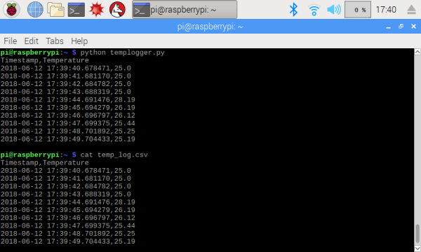

**注目すべきコード：**

「Pythonでプログラミングする」の節で、モジュールの作り方を説明したのを思い出してほしい。
モジュールを使うと、他のファイルにあるコードを再利用できる。
今回は、tmp102.pyのコードのうち「温度を測定する」部分を関数定義にまとめ、他のファイルから呼び出せるようにした。

メインプログラム（templogger.py）では、`import tmp102`で自作のモジュールをインポートしている。
`.py`拡張子を省いていることに注目してほしい。Pythonは自動的に`.py`ファイルを探してくれる。

また、ファイルを読み書きのために開くたびに、できるだけ早く閉じていることにも気づくだろう。
ファイルを開いたまま放置しておくのは、一般的によくない習慣である。
ファイルが開いたままプログラムやOSがクラッシュすると、そのファイル（あるいは最悪の場合、ファイルシステム全体）が破損する可能性がある。

さらに保護を強めるため、書き込みの部分を`try`ブロックに入れている。

```python
try:
    csv.write(entry)
finally:
    csv.close()
```

これにより、プログラムがファイルへの書き込み中にクラッシュしても、例外が発生してPythonが終了前に自動的にファイルを閉じてくれる。

`open()`関数の2つ目のパラメータで、ファイルへのアクセス方法を指定していることも確認できる。

- 'r' — 読み取り
- 'w' — 書き込み（ファイルの元の内容は消去される）
- 'a' — 追記（元の内容は保持され、末尾に追加される）

`datetime.datetime.now()`は*datetime*オブジェクトを返し、それを`str()`で文字列に変換している。
これはRaspberry Piのローカルタイムに基づく点に注意してほしい。
協定世界時（UTC）の日時を取得したい場合は`datetime.datetime.utcnow()`を使う。

**チャレンジ：** 温度のログを表計算プログラムで開き、その10秒間で温度がどう変化したかを示すグラフを作ってみよう（さらに挑戦したい場合は、より長い期間にわたって温度を測定するようプログラムを変更してみよう）。
ヒント：Raspbianには無料の表計算プログラム*LibreOffice Calc*が付属している。
Calcを使う場合、*データ > テキストを列に分割*の機能が、日時のタイムスタンプを使いやすい形式に変換するのに役立つかもしれない。

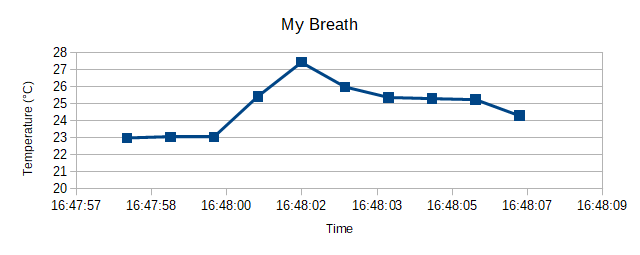

<span style="background:Khaki; font-weight:bold;">ヘッドレス：</span> Raspberry Piをヘッドレスなデバイスとして使っている場合は、CSVの内容を画面に出力し、それをコピー＆ペーストして手元のコンピュータの表計算プログラムに貼り付けるとよいだろう。

**解答：** これには決まった「正解」があるわけではない。創造力を発揮して、グラフ作成の腕前を見せてほしい。

## まとめ・参考資料

このチュートリアルが、Pythonでの（より具体的には、Pythonでハードウェアを制御するための）冒険の出発点になれば幸いである。
Python言語をさらに深く学びたい場合は、次の資料を参考にしてほしい。

- **無料のオンライン講座：**
  - [learnpython.org](https://www.learnpython.org/)
  - [Google's Python Class](https://developers.google.com/edu/python/)
  - [MIT's edX course](https://learn.edx.org/mit-python/)
  - [Introduction to Python on edX](https://www.edx.org/course/introduction-to-python-absolute-beginner)
  - [CodeAcademy's Learn Python Course](https://www.codecademy.com/learn/learn-python)
- **YouTube動画：**
  - [Python Programming](https://www.youtube.com/watch?v=N4mEzFDjqtA)
  - [Python Tutorial for Absolute Beginners Series](https://www.youtube.com/watch?v=Z1Yd7upQsXY&list=PLBZBJbE_rGRWeh5mIBhD-hhDwSEDxogDg)
- **無料の書籍：**
  - [Non-Programmer's Tutorial for Python 3](https://en.wikibooks.org/wiki/Non-Programmer%27s_Tutorial_for_Python_3)
  - [Dive into Python 3](http://www.diveintopython3.net/)
  - [Automate the Boring Stuff with Python](https://automatetheboringstuff.com/)
  - [A Whirlwind Tour of Python](https://www.safaribooksonline.com/library/view/a-whirlwind-tour/9781492037859/)
  - [Think Python: How to Think Like a Computer Scientist](http://greenteapress.com/thinkpython/html/index.html)
- **Pythonのドキュメント：**
  - [The Python 3.5 Documentation](https://docs.python.org/3.5/index.html#)

さらにインスピレーションが欲しい場合は、次のようなRaspberry Piプロジェクトも参考になる。

- Building Large LED Installations — 大規模なLEDインスタレーションの計画から電源要件、実装までを学ぶ
- Bark Back Interactive Pet Monitor — Raspberry Piをベースにした犬の鳴き声検出プロジェクトでペットを監視・やり取りする
- Raspberry Pi Zero Helmet Impact Force Monitor — ヘルメット、Raspberry Pi Zero、加速度センサーを使った衝撃力モニターの製作
- Using Flask to Send Data to a Raspberry Pi — PythonのFlaskフレームワークを使い、ESP8266のWiFiノードから内部WiFiネットワーク経由でRaspberry Piにデータを送信する

タグ: 概念、データロギング、Hookup、ロギング、プログラミング、Python、Raspberry Pi

---

出典：[Python Programming Tutorial: Getting Started with the Raspberry Pi](https://learn.sparkfun.com/tutorials/python-programming-tutorial-getting-started-with-the-raspberry-pi)（SparkFun Learn）を日本語に翻訳し、再構成した。
原文は [CC BY-SA 4.0](https://creativecommons.org/licenses/by-sa/4.0/) ライセンスで公開されており、本ページも同ライセンスの下で提供する。
