# Raspberry PiのGPIO

[Raspberry Pi](https://www.sparkfun.com/raspberry_pi)は、そのサイズからは想像できないほど強力なコンピュータである。
HDMIディスプレイを駆動し、マウス、キーボード、カメラの入力を処理し、インターネットに接続し、フル機能のLinuxディストリビューションを実行できる。
しかし、Raspberry Piは単なる小型コンピュータではなく、ハードウェアのプロトタイピングツールでもある。
Raspberry Piには**双方向の入出力ピン**が備わっており、LEDを駆動したり、モーターを回したり、ボタンの押下を読み取ったりできる。

このチュートリアルはもともと[Raspberry Pi Model B](https://www.sparkfun.com/products/11546)向けに書かれたものだが、標準的な2×20ピンのヘッダーを持つあらゆるRaspberry Piモデルに当てはまる。

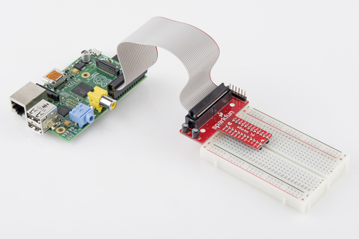

Raspberry PiのI/Oラインを駆動するには、多少のプログラミングが必要になる。
どの言語を使うかは自由である。
[Raspberry PiのGPIOサンプル集](http://elinux.org/RPi_Low-level_peripherals#GPIO_Code_examples)を見れば、対応するプログラミング言語の選択肢が数十種類あることがわかる。
その中から、入出力を駆動するのに手軽で確実なツールを二つに絞り込んだ。
[Python](https://www.sparkfun.com/python)と、WiringPiライブラリを使ったCである。

Raspberry PiでLEDを駆動したりボタンの押下を読み取ったりしたことがなければ、このチュートリアルがよい入り口になるはずである。
読みやすいインタプリタ型のスクリプト言語Pythonが好みでも、根っからのCプログラマでも、それぞれのニーズに合ったプログラミングの選択肢が見つかるはずである。

## このチュートリアルで扱う内容

このチュートリアルでは、Raspberry PiのGPIOピンを読み書きする二つのアプローチ、**Python**と**C**を紹介する。
扱う内容の概要は次のとおりである。

- **GPIOピン配置**：PiのGPIOヘッダーの概要
- **Python APIとサンプル**
  - **RPi.GPIO API**：GPIOを駆動するために使うPython関数の概要
  - **RPi.GPIOのサンプル**：入力と出力の両方の機能を示すPythonスクリプトの例
- **C（WiringPi）のAPIとサンプル**
  - **WiringPiのセットアップとテスト**：WiringPiのインストール方法と、コマンドラインでの動作確認
  - **WiringPi API**：WiringPiライブラリが提供する基本的な関数の概要
  - **WiringPiのサンプル**：WiringPiの入出力機能を示すシンプルなサンプルプログラム
- **IDEの利用**：Raspberry Pi向けプログラミングで使いやすいIDE、Geanyのダウンロードとインストール方法

それぞれのプログラミング言語には、それぞれの長所と短所がある。
Pythonは（特にプログラミング初心者にとって）扱いやすく、コンパイルも不要である。
Cはより高速で、慣れ親しんだ従来の書き方を好むユーザーにとっては扱いやすいこともある。

### 必要な部品

Raspberry PiのSDカードには**Raspbianがインストール**されている必要がある。
Raspbianのインストール方法については、別のチュートリアルを参照してほしい。

Raspberry Piには、必要な**マウス、キーボード、ディスプレイ**が接続されている前提で進める。

WiringPiをダウンロードするために、Raspberry Piには**インターネット接続**が必要である。
イーサネットでもWiFiでも構わない。

[Pi Wedge](https://www.sparkfun.com/products/12652)は必須ではないが、あるとかなり作業が楽になる。
ブレイクアウト基板を使わない場合は、代わりにオス-メスのジャンパー線でPiとブレッドボードをつなぐこともできる。

もちろん、お好みのボタンやLEDに置き換えても構わない。

## GPIOピン配置

Raspberry Piは、ボード上の標準的なオスヘッダーを通じてGPIOを提供する。
このヘッダーは、年々26ピンから40ピンへと拡張されてきたが、もとのピン配置は維持されている。

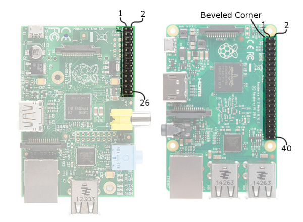

_初期モデルと後期モデルのPiコンピュータのヘッダー構成_

ArduinoユーザーとしてRaspberry Piに来た場合、ピンを単一の一意な番号で参照することに慣れているだろう。
Piのハードウェアをプログラミングする際もほぼ同様で、各ピンにはそれぞれの番号が振られている。それも一つだけではない。

Piのピン番号を参照する際に出会う番号体系には、少なくとも二つある。
Broadcomチップ固有のピン番号と、P1の物理ピン番号である。
基本的にはどちらの番号体系を使ってもよいが、多くのプログラムでは、プログラムの冒頭でどちらの体系を使うかを宣言する必要がある。

P1ヘッダーの全26ピンについて、特殊機能の有無と両方の番号を示した表は次のとおりである。

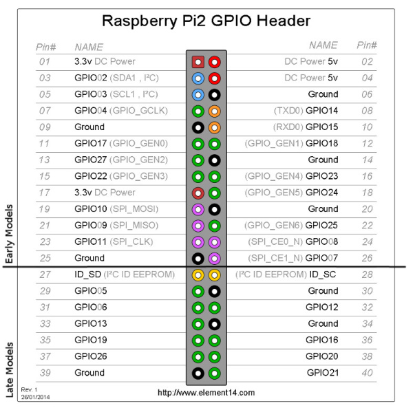

_Element14のピン説明に注釈を加えたもの_

| Wedgeのシルク印刷 | Python（BCM） | WiringPi GPIO | 名称                    | P1ピン番号 |     | 名称                    | WiringPi GPIO | Python（BCM） | Wedgeのシルク印刷 |
| ----------------- | ------------- | ------------- | ----------------------- | ---------- | --- | ----------------------- | ------------- | ------------- | ----------------- |
|                   |               |               | 3.3V電源                | 1          | 2   | 5V電源                  |               |               |                   |
| SDA               |               | 8             | GPIO02（SDA1、I2C）     | 3          | 4   | 5V電源                  |               |               |                   |
| SCL               |               | 9             | GPIO03（SCL1、I2C）     | 5          | 6   | GND                     |               |               |                   |
| G4                | 4             | 7             | GPIO04（GPIO_GCLK）     | 7          | 8   | GPIO14（TXD0）          | 15            |               | TXO               |
|                   |               |               | GND                     | 9          | 10  | GPIO15（RXD0）          | 16            |               | RXI               |
| G17               | 17            | 0             | GPIO17（GPIO_GEN0）     | 11         | 12  | GPIO18（GPIO_GEN1）     | 1             | 18            | G18               |
| G27               | 27            | 2             | GPIO27（GPIO_GEN2）     | 13         | 14  | GND                     |               |               |                   |
| G22               | 22            | 3             | GPIO22（GPIO_GEN3）     | 15         | 16  | GPIO23（GPIO_GEN4）     | 4             | 23            | G23               |
|                   |               |               | 3.3V電源                | 17         | 18  | GPIO24（GPIO_GEN5）     | 5             | 24            | G24               |
| MOSI              |               | 12            | GPIO10（SPI_MOSI）      | 19         | 20  | GND                     |               |               |                   |
| MISO              |               | 13            | GPIO09（SPI_MISO）      | 21         | 22  | GPIO25（GPIO_GEN6）     | 6             | 25            | G25               |
| CLK               |               | 14            | GPIO11（SPI_CLK）       | 23         | 24  | GPIO08（SPI_CE0_N）     | 10            |               | CD0               |
|                   |               |               | GND                     | 25         | 26  | GPIO07（SPI_CE1_N）     | 11            |               | CE1               |
| IDSD              |               | 30            | ID_SD（I2C IDのEEPROM） | 27         | 28  | ID_SC（I2C IDのEEPROM） | 31            |               | IDSC              |
| G05               | 5             | 21            | GPIO05                  | 29         | 30  | GND                     |               |               |                   |
| G6                | 6             | 22            | GPIO06                  | 31         | 32  | GPIO12                  | 26            | 12            | G12               |
| G13               | 13            | 23            | GPIO13                  | 33         | 34  | GND                     |               |               |                   |
| G19               | 19            | 24            | GPIO19                  | 35         | 36  | GPIO16                  | 27            | 16            | G16               |
| G26               | 26            | 25            | GPIO26                  | 37         | 38  | GPIO20                  | 28            | 20            | G20               |
|                   |               |               | GND                     | 39         | 40  | GPIO21                  | 29            | 21            | G21               |

この表には、Piのピンヘッダー番号、Element14での名称、WiringPiの番号、Pythonの番号、Wedge上のシルク印刷が対応づけられている。

> **注意：** 上記のBroadcomピン番号は、Piモデル2以降**のみ**に対応する。
> 古いRev1のPiを使っている場合は、対応するBroadcomピン番号について外部の解説記事を確認してほしい。

このように、Piでは**双方向の入出力ピン**だけでなく、シリアル（UART）、I2C、SPI、さらにはPWM（「アナログ出力」）の一部にもアクセスできる。

## ハードウェアのセットアップ

先に回路を組み立てておくとよい。
この回路は、C版とPython版どちらのサンプルでも共通で使う。
出力機能（デジタルとPWM）の確認には2つのLEDを、入力の確認にはボタンを1つ使う。

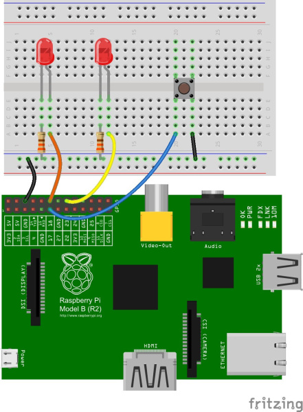

_初期モデルのPiへの接続_

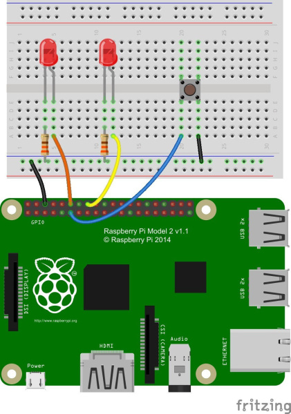

_Pi B+とPi 2 Bへの接続_

**2つのLED**は、**PiのGPIO 18とGPIO 23**（Broadcomチップ固有の番号）に接続する。
P1コネクタのピン番号を基準にするなら、ピン12と16にあたる。

**ボタン**は、BroadcomのGPIO 17（P1ピン11）に接続する。

[Pi Wedge](https://www.sparkfun.com/products/13717)を使っている場合、配線はかなり単純になる。
完成すると次のような見た目になる。

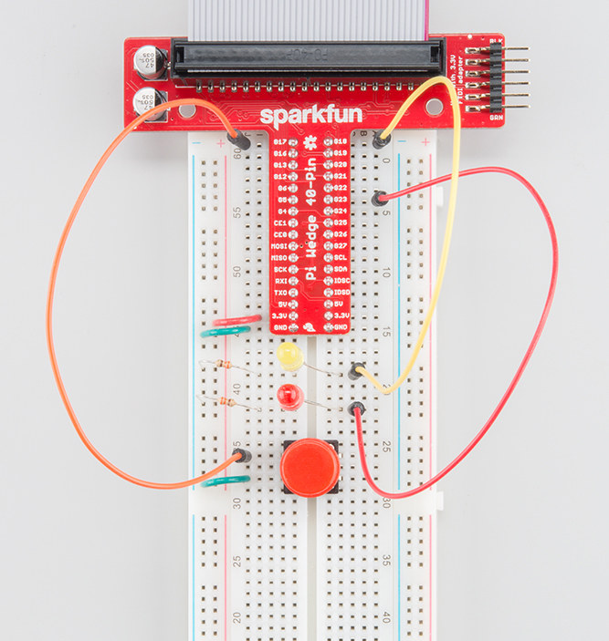

Pi Wedgeがない場合は、オス-メスのジャンパー線を使うと、PiからブレッドボードへスムーズにI/Oを引き出せる。

## Python（RPi.GPIO）API

Pythonのサンプルの中核には、[RPi.GPIOモジュール](http://sourceforge.net/projects/raspberry-gpio-python/)を使う。
このPythonファイル群とソースは**Raspbianに同梱**されているため、Raspbianを使っている限り、新たに何かをダウンロードする必要はない。

このセクションでは、このモジュールを使った基本的な関数呼び出しの概要を説明する。

### セットアップ

Pythonスクリプトの残りの部分でRPi.GPIOを使うには、**ファイルの先頭**に次の一文を置く必要がある。

```python
import RPi.GPIO as GPIO
```

この一文でRPi.GPIOモジュールを取り込み、さらに`GPIO`というローカル名を与えている。以降はこの名前でモジュールを参照する。

#### ピン番号方式の宣言

RPi.GPIOモジュールを取り込んだら、次に決めるのは、二つの**ピン番号方式**のうちどちらを使うかである。

1. `GPIO.BOARD` — ボード番号方式。ピン番号はP1ヘッダー上のピン番号に従う。
2. `GPIO.BCM` — Broadcomチップ固有のピン番号。Raspberry PiのBroadcomチップが定義する、より下位レベルの番号体系に従う。

Pi Wedgeを使っている場合は`GPIO.BCM`の使用を推奨する。基板上にシルク印刷されている番号がこちらだからである。
ヘッダーに直接配線する場合は`GPIO.BOARD`の方が扱いやすいこともある。

コード中でどちらの番号体系を使うかを指定するには、`GPIO.setmode()`関数を使う。たとえば次のようにする。

```python
GPIO.setmode(GPIO.BCM)
```

これでBroadcomチップ固有のピン番号が有効になる。

`import`文と`setmode`の行は、いずれもPythonを使う上で**必須**である。

#### ピンモードの設定

Arduinoを使ったことがあれば、入力・出力どちらとして使うかを事前に宣言する「ピンモード」の概念に馴染みがあるはずである。
ピンモードを設定するには`setup([pin], [GPIO.IN, GPIO.OUT])`関数を使う。
たとえばピン18を出力として設定するには、次のように書く。

```python
GPIO.setup(18, GPIO.OUT)
```

ボード番号方式を使っている場合は、ピン番号が18ではなく12に変わることに注意してほしい。

### 出力

#### デジタル出力

ピンをHIGHまたはLOWに設定するには、`GPIO.output([pin], [GPIO.LOW, GPIO.HIGH])`関数を使う。
たとえばピン18をHIGHにするには、次のように書く。

```python
GPIO.output(18, GPIO.HIGH)
```

ピンを`GPIO.HIGH`に設定すると3.3Vが出力され、`GPIO.LOW`にすると0Vになる。
`GPIO.HIGH`と`GPIO.LOW`の代わりに、`1`、`True`、`0`、`False`を使ってピンの値を設定することもできる。

#### PWM（「アナログ」）出力

Raspberry PiのPWMは非常に限定的で、対応するピンは18番（P1ピン12）ただ一つだけである。

PWMを初期化するには`GPIO.PWM([pin], [frequency])`関数を使う。
このインスタンスを変数に代入しておくと、以降のスクリプトが書きやすくなる。
続いて`pwm.start([duty cycle])`関数で初期値を設定する。たとえば次のようにする。

```python
pwm = GPIO.PWM(18, 1000)
pwm.start(50)
```

これで、PWMピンを1kHzの周波数、50%のデューティ比で動作させることができる。

PWM出力の値を調整するには、`pwm.ChangeDutyCycle([duty cycle])`関数を使う。
`[duty cycle]`には0（0%、LOW相当）から100（100%、HIGH相当）までの値を指定できる。
たとえばピンを75%オンに設定するには、次のように書く。

```python
pwm.ChangeDutyCycle(75)
```

そのピンのPWM出力を止めるには、`pwm.stop()`コマンドを使う。

いたって簡単である。PWMとして使う前にピンを出力として設定しておくことだけ忘れないようにしたい。

### 入力

ピンが入力として設定されている場合、`GPIO.input([pin])`関数でその値を読み取れる。
`input()`関数は、ピンがHIGHかLOWかに応じて`True`または`False`を返す。
これを`if`文でテストできる。たとえば次のようにする。

```python
if GPIO.input(17):
    print("Pin 11 is HIGH")
else:
    print("Pin 11 is LOW")
```

このコードは、ピン17を読み取り、HIGHかLOWかを表示する。

#### プルアップ・プルダウン抵抗

先ほどの`GPIO.setup()`関数で入力・出力を宣言したことを思い出してほしい。
この関数には、プルアップ抵抗やプルダウン抵抗を設定するための、任意の第三引数がある。
ピンにプルアップ抵抗を使うには、`GPIO.setup`の第三引数に`pull_up_down=GPIO.PUD_UP`を追加する。
プルダウン抵抗が必要な場合は、代わりに`pull_up_down=GPIO.PUD_DOWN`を使う。

たとえば、GPIO 17にプルアップ抵抗を使うには、セットアップの記述を次のようにする。

```python
GPIO.setup(17, GPIO.IN, pull_up_down=GPIO.PUD_UP)
```

この第三引数を省略した場合、プルアップ抵抗もプルダウン抵抗も無効になる。

### その他

#### 遅延

Pythonスクリプトの動作を遅くしたい場合は、遅延を追加できる。
遅延をスクリプトに組み込むには、`time`モジュールを取り込む必要がある。
スクリプトの先頭に次の一行を置けばよい。

```python
import time
```

その後、スクリプトの残りの部分で`time.sleep([seconds])`を使えば、処理を一時停止できる。
小数を使えば遅延時間を精密に指定できる。
たとえば250ミリ秒遅延させるには、次のように書く。

```python
time.sleep(0.25)
```

`time`モジュールには、`sleep`以外にも便利な機能が数多くある。詳しくは公式リファレンスを参照してほしい。

#### 後片付け

スクリプトが役目を終えたら、次にGPIOを使うプロセスのために後片付けをしておくとよい。
スクリプトの末尾で`GPIO.cleanup()`コマンドを使い、スクリプトが確保していたリソースを解放する。

このコマンドを書き忘れてもPiが壊れるわけではないが、書けるところでは書いておくのがよい習慣である。

---

ここまでの内容を、実際に動くサンプルスクリプトにまとめてみよう。

## Python（RPi.GPIO）のサンプル

前のセクションで説明した基本的なRPi.GPIOの関数を使って、シンプルなGPIOスクリプトの例を作ってみる。

### 1. ファイルの作成

まず、Pythonファイルを作成する。
GUIベースのファイルエクスプローラーから作成してもよいし、ターミナルから作業したい場合は**LXTerminal**を開き、ファイルを置きたいフォルダに移動する（なければ作成する）。
次のコマンドで新しいフォルダを作る。

```bash
mkdir python
```

続いて、次のコマンドでそのフォルダに移動する。

```bash
cd python
```

ファイルを作成する。ここでは"blinker"という名前にし、拡張子は**.py**とする。

```bash
touch blinker.py
```

続いて、好みのテキストエディタでそのファイルを開く。NanoでもよいしPiの標準GUIテキストエディタであるMousepadでもよい。

```bash
mousepad blinker.py &
```

> **注意：** 以前はLeafpadがRaspberry Piイメージの標準GUIテキストエディタだったが、現在はMousepadに置き換わっている。
> Mousepadは、Raspberry Piのスタートメニューの**アクセサリ > テキストエディタ**から見つけられる。
> `sudo apt-get install leafpad`コマンドでLeafpadを手動インストールすることもでき、インストール後はそちらのエディタを指定してファイルを開くこともできる。
>
> ```bash
> leafpad blinker.py &
> ```

これで空のテキストファイルが開く（末尾の`&`はバックグラウンドで開くためのもので、ターミナルは引き続き使える状態のままになる）。
いよいよコードを書く番である。

### 2. コードを書く

前のセクションで学んだ内容をひととおり盛り込んだサンプルスケッチは次のとおりである。
入出力の処理に加えて、PWMの扱いも含まれている。
これは、ハードウェアのセットアップの節で組んだ回路をそのまま使う前提のコードである。

```python
# External module imports
import RPi.GPIO as GPIO
import time

# Pin Definitons:
pwmPin = 18 # Broadcom pin 18 (P1 pin 12)
ledPin = 23 # Broadcom pin 23 (P1 pin 16)
butPin = 17 # Broadcom pin 17 (P1 pin 11)

dc = 95 # duty cycle (0-100) for PWM pin

# Pin Setup:
GPIO.setmode(GPIO.BCM) # Broadcom pin-numbering scheme
GPIO.setup(ledPin, GPIO.OUT) # LED pin set as output
GPIO.setup(pwmPin, GPIO.OUT) # PWM pin set as output
pwm = GPIO.PWM(pwmPin, 50)  # Initialize PWM on pwmPin 100Hz frequency
GPIO.setup(butPin, GPIO.IN, pull_up_down=GPIO.PUD_UP) # Button pin set as input w/ pull-up

# Initial state for LEDs:
GPIO.output(ledPin, GPIO.LOW)
pwm.start(dc)

print("Here we go! Press CTRL+C to exit")
try:
    while 1:
        if GPIO.input(butPin): # button is released
            pwm.ChangeDutyCycle(dc)
            GPIO.output(ledPin, GPIO.LOW)
        else: # button is pressed:
            pwm.ChangeDutyCycle(100-dc)
            GPIO.output(ledPin, GPIO.HIGH)
            time.sleep(0.075)
            GPIO.output(ledPin, GPIO.LOW)
            time.sleep(0.075)
except KeyboardInterrupt: # If CTRL+C is pressed, exit cleanly:
    pwm.stop() # stop PWM
    GPIO.cleanup() # cleanup all GPIO
```

すべて入力し終えたら（インデントを忘れないように）、**保存**する。

### スクリプトの実行

RPi.GPIOモジュールは管理者権限を必要とするため、Pythonスクリプトの呼び出しの先頭に`sudo`を付ける必要がある。
"blinker.py"スクリプトを実行するには、次のように入力する。

```bash
sudo python blinker.py
```

コードを実行した状態でボタンを押すと、デジタル出力のLEDが点灯する。
PWM制御のLEDも、ボタンを押すと明るさが反転する。

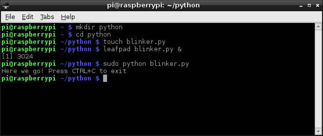

CTRL+Cを押すと、スクリプトをきれいに終了できる。

## C（WiringPi）のセットアップ

Pythonは、使い慣れている人にとってはGPIOを駆動する優れた選択肢である。
しかし、もし空白文字に厳格なスクリプト言語に馴染みがなく、むしろ慣れ親しんだCの世界にとどまりたいのであれば、[WiringPiライブラリ](https://projects.drogon.net/raspberry-pi/wiringpi/)を紹介したい。

### 1) WiringPiのインストール

> **注意：** WiringPiは現在、標準のRaspbianシステムにあらかじめインストールされている。
> WiringPi公式ホームページの手順は現在非推奨であり、元のWiringPiソース（`git://git.drogon.net/wiringPi`）はもう利用できない。

WiringPiは、以前のバージョンのRaspbianには同梱されていなかったため、ユーザーが自分でダウンロードしてインストールする必要があった。
現在は幸い、標準のRaspbianシステムに含まれている。
新しいハードウェアに対応した更新版のミラーからWiringPiを更新したい場合は、こちらのGitHubリポジトリを確認してほしい。

gitが必要になる（デフォルトでインストールされている場合もある）。
gitがインストールされていない場合は、コマンドラインで次のように入力する。

```bash
sudo apt-get install git-core
```

最新版はGitを使ってダウンロードすることを強く推奨する。
現在のバージョンを確認するには、次のコマンドを入力する。

```bash
gpio -v
```

次のように`Unknown17`を含む出力が返ってきた場合、Raspberry Pi 4以降でWiringPiを更新する必要がある。

```
gpio version: 2.50
Copyright (c) 2012-2018 Gordon Henderson
This is free software with ABSOLUTELY NO WARRANTY.
For details type: gpio -warranty

Raspberry Pi Details:
  Type: Unknown17, Revision: 02, Memory: 0MB, Maker: Sony
    * Device tree is enabled.
    * --> Raspberry Pi 4 Model B Rev 1.2
    * This Raspberry Pi supports user-level GPIO access.
```

WiringPiと設定ファイルを削除するには、次のように入力する。

```bash
sudo apt-get purge wiringpi
```

続いて、次のコマンドでPiにWiringPiの記憶を完全に消去させる。

```bash
hash -r
```

Gitさえインストールされていれば、WiringPiのダウンロードとインストールに必要なのは次のコマンドだけである。

```bash
git clone https://github.com/WiringPi/WiringPi.git
```

これで、カレントディレクトリにWiringPiという名前のフォルダが作られる。
WiringPiのディレクトリに移動する。

```bash
cd WiringPi
```

続いて、originから最新の変更を取得する。

```bash
git pull origin
```

続いて、次のコマンドを実行する。
`./build`は、ソースファイルからWiringPiをビルドするスクリプトである。
これによりヘルパーファイルが構築され、Linux上のいくつかのパスが変更され、WiringPiが使える状態になる。

```bash
./build
```

ここまでで、ライブラリは動作するはずである。
下記の`gpio`コマンドを実行し、WiringPiのバージョンと実行中のPiに関する情報を確認する。

```bash
gpio -v
```

次のコマンドを入力すると、40ピンコネクタの各ピンの設定を示す表が表示される。

```bash
gpio readall
```

> **トラブルシューティングのヒント：** `gpio`コマンドでピンの読み書きや設定を行った際に、次のような出力が返ってくる場合、これはwiringPiとミラー版WiringPiの間の競合が原因である。
> Raspberry Piにインストールされていた以前のwiringPiを`purge`コマンドで確実に削除してほしい。
>
> ```bash
> gpio: Symbol 'piModelNames' has different size in shared object, consider re-linking
> Oops - unable to determine board type... model:17
> ```

### 2) WiringPiのテスト

WiringPiが優れているのは、単なるCライブラリにとどまらず、**コマンドラインユーティリティ**も備えている点である。
`gpio`ユーティリティを使って、インストールをテストできる。
次の手順で、ピンを切り替えてLEDをオン・オフし、続いてボタンの押下を読み取ってみる。

#### LEDの点滅

ターミナルを開き、いくつかのシステムコールを試してみる。
ピン18を設定するには、次のように入力する。デフォルトでは、このピンは入力として設定されている。

```bash
gpio -g mode 18 output
```

ピンをHIGHにするには、次のように入力する。

```bash
gpio -g write 18 1
```

LOWに戻すには、次のように入力する。

```bash
gpio -g write 18 0
```

LEDがピン18に接続されたままであれば、この二つのコマンドを実行するたびに点灯・消灯するはずである。

#### ボタンの押下を読み取る

ボタンをテストするには、まずピン17をPiの内蔵プルアップ抵抗で設定する必要がある。

```bash
gpio -g mode 17 up
```

ピンを読み取るには、次のように入力する。

```bash
gpio -g read 17
```

ボタンが押されているかどうかに応じて、0か1が返される。
ボタンを押しながらもう一度同じコマンドを試してみてほしい。

`gpio`ユーティリティは、マニュアルにもあるとおり「万能ツール」のコマンドラインツールである。
manページ（`man gpio`と入力する）を確認し、できることをひととおり把握しておくことを強く推奨する。

---

Cスタイルのプログラミングに進む準備ができたら、次のセクションに進んでほしい。
WiringPiライブラリが提供する、特に便利な関数の概要を紹介する。

## C（WiringPi）API

このセクションでは、WiringPiライブラリが提供する特に便利な関数の一部を紹介する。
Arduinoによく似せて作られているため、Arduinoでのプログラミング経験があれば見覚えのある部分も多いはずである。

### セットアップ

まず、ライブラリを取り込む必要がある。
プログラムの先頭に、次のように書く。

```c
#include <wiringPi.h>
```

ライブラリを取り込んだら、最初のステップとしてこれを初期化する。
このステップでは、プログラムの残りの部分で使う**ピン番号方式**も決まる。
ライブラリを初期化する関数呼び出しは、次の**いずれか一つ**を選ぶ。

```c
wiringPiSetup(); // Initializes wiringPi using wiringPi's simlified number system.
wiringPiSetupGpio(); // Initializes wiringPi using the Broadcom GPIO pin numbers
```

WiringPiの簡易番号方式は、これまでの表になかった第三の番号体系である。
この方式を使いたい場合は、WiringPiのピンページで概要を確認してほしい。

### ピンモードの宣言

ピンを入力または出力として設定するには、`pinMode([pin], [mode])`関数を使う。
モードには`INPUT`、`OUTPUT`、`PWM_OUTPUT`のいずれかを指定できる。

たとえば、ピン22を入力、23を出力、18をPWMとして設定するには、次のように書く。

```c
wiringPiSetupGpio()
pinMode(17, INPUT);
pinMode(23, OUTPUT);
pinMode(18, PWM_OUTPUT);
```

この例ではBroadcomのGPIOピン番号方式を使っていることに注意してほしい。

### デジタル出力

`digitalWrite([pin], [HIGH/LOW])`関数を使うと、出力ピンをHIGHまたはLOWに設定できる。
Arduinoユーザーであれば馴染み深いはずである。

たとえばピン23をHIGHにするには、次のように呼び出すだけでよい。

```c
digitalWrite(23, HIGH);
```

#### PWM（「アナログ」）出力

唯一のPWM対応ピンには、`pwmWrite([pin], [0-1023])`を使って0から1024までの値を設定できる。たとえば次のようにする。

```c
pwmWrite(18, 723);
```

これで、ピン18のデューティ比がおよそ70%に設定される。

### デジタル入力

Arduino経験者であれば、次に何が来るか見当がつくだろう。
ピンのデジタル状態を読み取るには`digitalRead([pin])`関数を使う。たとえば次のようにする。

```c
if (digitalRead(17))
    printf("Pin 17 is HIGH\n");
else
    printf("Pin 17 is LOW\n");
```

このコードは、ピン22の状態を表示する。
`digitalRead()`関数は、ピンがHIGHなら1、LOWなら0を返す。

#### プルアップ・プルダウン抵抗

デジタル入力にプルアップ抵抗やプルダウン抵抗が必要な場合は、`pullUpDnControl([pin], [PUD_OFF, PUD_DOWN, PUD_UP])`関数を使う。

たとえば、ピン22にボタンがあり、プルアップの助けが必要な場合は、次のように書く。

```c
pullUpDnControl(17, PUD_UP);
```

これは、ボタンを押したときにピンがLOWに引かれる構成のときに役立つ。

### 遅延

点滅するLEDの動きを遅くしたい場合、つまり点灯と消灯を区別したい場合には、遅延が役に立つ。
WiringPiには`delay([milliseconds])`と`delayMicroseconds([microseconds])`という二つの遅延関数がある。
標準の`delay`は、指定したミリ秒数だけプログラムの流れを止める。
たとえば2秒遅延させるには、次のように書く。

```c
delay(2000);
```

より精密なマイクロ秒単位の遅延が必要な場合は、`delayMicroseconds()`を使うこともできる。

---

基本を押さえたところで、実際のサンプルコードに適用してみよう。

## C（WiringPi）のサンプル

WiringPiは、I/Oまわりのコードをできる限りArduino風に見せることを狙って作られている。
とはいえ、Arduinoの快適な世界からは離れており、`loop()`や`setup()`は存在せず、あるのは`int main(void)`だけであることに注意してほしい。

ここでは、Cのサンプルファイルを作成し、WiringPiライブラリを組み込み、コンパイルして実行するまでの流れを追っていく。

### blinker.cの作成

ターミナルで、好きな名前のフォルダを作る。

```bash
mkdir c_example
```

作成したフォルダに移動する。

```bash
cd c_example
```

"blinker.c"という名前の新しいファイルを作成する。

```bash
touch blinker.c
```

続いて、そのファイルをテキストエディタで開く（NanoやMousepad/LeafpadはRaspbianに同梱されている）。

```bash
mousepad blinker.c &
```

> **注意：** 以前はLeafpadがRaspberry Piイメージの標準GUIテキストエディタだったが、現在はMousepadに置き換わっている。
> Mousepadは、Raspberry Piのスタートメニューの**アクセサリ > テキストエディタ**から見つけられる。
> `sudo apt-get install leafpad`コマンドでLeafpadを手動インストールすることもでき、インストール後はそちらのエディタを指定してファイルを開くこともできる。
>
> ```bash
> leafpad blinker.py &
> ```

これで"blinker.c"ファイルがMousepad（またはLeafpad）で開き、ターミナルはそのディレクトリでバックグラウンドのまま動き続ける。

### プログラムを書く

前のセクションで説明した内容をひととおり盛り込んだサンプルプログラムは次のとおりである。
コピー＆ペーストしてもよいし、自分で書き写して練習の足しにしてもよい。

```c
#include <stdio.h>    // Used for printf() statements
#include <wiringPi.h> // Include WiringPi library!

// Pin number declarations. We're using the Broadcom chip pin numbers.
const int pwmPin = 18; // PWM LED - Broadcom pin 18, P1 pin 12
const int ledPin = 23; // Regular LED - Broadcom pin 23, P1 pin 16
const int butPin = 17; // Active-low button - Broadcom pin 17, P1 pin 11

const int pwmValue = 75; // Use this to set an LED brightness

int main(void)
{
    // Setup stuff:
    wiringPiSetupGpio(); // Initialize wiringPi -- using Broadcom pin numbers

    pinMode(pwmPin, PWM_OUTPUT); // Set PWM LED as PWM output
    pinMode(ledPin, OUTPUT);     // Set regular LED as output
    pinMode(butPin, INPUT);      // Set button as INPUT
    pullUpDnControl(butPin, PUD_UP); // Enable pull-up resistor on button

    printf("Blinker is running! Press CTRL+C to quit.\n");

    // Loop (while(1)):
    while(1)
    {
        if (digitalRead(butPin)) // Button is released if this returns 1
        {
            pwmWrite(pwmPin, pwmValue); // PWM LED at bright setting
            digitalWrite(ledPin, LOW);     // Regular LED off
        }
        else // If digitalRead returns 0, button is pressed
        {
            pwmWrite(pwmPin, 1024 - pwmValue); // PWM LED at dim setting
            // Do some blinking on the ledPin:
            digitalWrite(ledPin, HIGH); // Turn LED ON
            delay(75); // Wait 75ms
            digitalWrite(ledPin, LOW); // Turn LED OFF
            delay(75); // Wait 75ms again
        }
    }

    return 0;
}
```

入力し終えたら、**保存**してターミナルに戻る。

### コンパイルと実行

インタプリタ型のPythonとは異なり、Cのプログラムは実行の前にビルドが必要である。

**プログラムをコンパイル**するには、[gcc](http://www.gnu.org/software/gcc/)を呼び出す。
ターミナルに次のように入力し、コンパイルが終わるまで少し待つ。

```bash
gcc -o blinker blinker.c -l wiringPi
```

このコマンドにより、"blinker"という実行ファイルが作られる。
`-l wiringPi`の部分が重要で、これによりwiringPiライブラリが読み込まれる。
コンパイルが成功した場合、メッセージは何も表示されない。エラーが出た場合は、そのメッセージを手がかりに原因を追ってほしい。

**プログラムを実行**するには、次のように入力する。

```bash
sudo ./blinker
```

blinkerプログラムが動き始めるはずである。
ハードウェアのセットアップの節でまとめたとおりに回路を組んでおくこと。
ボタンを押すとLEDが点滅し、離すと消灯する。
PWM制御のLEDは、ボタンを離しているときに最も明るく、押しているときに暗くなる。

---

色分けもハイライトもない味気ないエディタで、ここまでのコードを打ち込むのが辛かった場合は、次のセクションでプログラミングを効率化するシンプルなIDEを紹介する。

## IDEの利用

これまでは、シンプルなテキストエディタ（LeafpadやNano）を使ってPythonやCのプログラムを書いてきた。
経験を積んだプログラマであれば、自動インデント、コンテキストハイライト、自動ビルドといった、基本的なエディタにすら備わっている機能の多くが物足りなく感じるはずである。
こうした機能を使いたい場合は、IDE（統合開発環境）の利用を推奨する。
Pi向けのお気に入りのIDEの一つが[Geany](http://www.geany.org/)であり、ここではその導入方法を紹介する。

### Geanyのダウンロードとインストール

GeanyはRaspbianに同梱されていないため、ダウンロードにはインターネット接続が必要である。
便利な`apt-get`ユーティリティを使うことができる。
まず、次のコマンドを入力する。

```bash
sudo apt-get update
```

更新が終わったら、次のコマンドでインストールする。

```bash
sudo apt-get install geany
```

インストールが終わったら、「スタート」メニューの「プログラミング」タブからGeanyを起動できる。

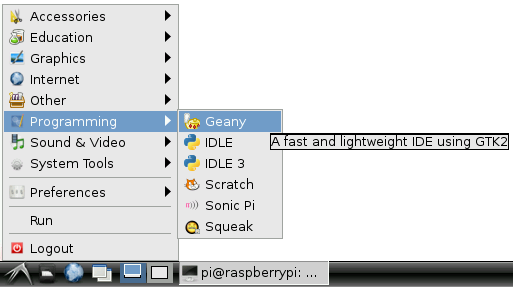

あるいは、ターミナルから`sudo geany`と入力してもよい。
コマンドラインから直接ファイルを開くこともできる。
たとえば先ほどのCファイルを開くには`sudo geany blinker.c`と入力する。

### Geanyを使う

Geanyを起動したら、**ファイル > 新規**からファイルを作成できる。
拡張子を".c"や".py"（あるいはその他の一般的な言語の拡張子）で保存すると、Geanyはすぐにどの言語で作業しているかを認識し、ハイライト表示を始める。

Geanyは、先ほど見たPythonとCのサンプルを含め、ほとんどの言語で使える。
ただし、デフォルトのIDE設定にはいくつか調整が必要である。
それぞれの言語での使い方の概要を以下に示す。

#### CとWiringPiでの利用

先ほどの[WiringPiのサンプル](https://learn.sparkfun.com/tutorials/raspberry-gpio/c-wiringpi-example)をGeanyで再現してみる。
先ほど作成した"blinker.c"をGeanyで開く。
すぐに見やすい色分け表示が現れるはずである。

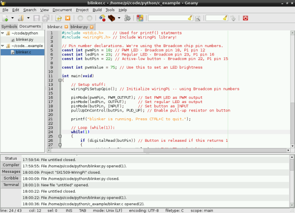

ただし、コンパイルの前にビルドオプションをいくつか調整する必要がある。
**ビルド**メニューから**ビルドコマンドの設定**を開き、「Compile」と「Build」のテキストボックスの末尾にそれぞれ`-l wiringPi`を追加する。
これでwiringPiライブラリが読み込まれるようになる。

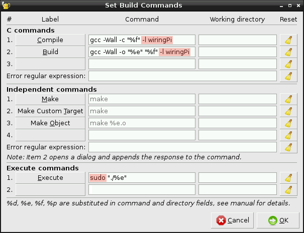

ついでに、実行コマンドの先頭に**"sudo"を追加**しておく。
上の画像のようにビルドコマンドが設定できていることを確認し、「OK」をクリックする。

設定が終われば準備は完了である。
**ビルド**メニューから**ビルド**をクリックする（あるいは上部の赤いブロック状のアイコンをクリックする）。
ビルドが実行されると、IDEは下部の「Compiler」タブに切り替わり、コンパイル結果を表示する。
ビルドが成功したら、そのまま実行に進んでよい。

ビルドしたファイルを実行するには、**ビルド > 実行**をクリックする（あるいは上部の歯車アイコンをクリックする）。
実行すると新しいターミナルウィンドウが開き、プログラムが動き始める。
プログラムを止めるには、そのターミナルウィンドウでCTRL+Cを押す。

#### Pythonでの利用

GeanyはPythonでも使うことができる。
試しに、先ほど作成した"blinker.py"ファイルを開いてみる。
Cファイルのときと同様に、見やすいコンテキストハイライトが表示される。

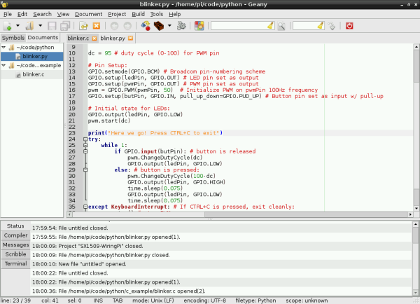

Pythonの場合、ビルドは不要である。
スクリプトを書き終えたら、上部の「実行」（歯車アイコン）をクリックするだけでよい。
実行すると、こちらも別のターミナルが開く。終了するにはCTRL+Cを押す。

---

Geanyには、ここで紹介した以外にも数多くの機能がある。
下部や上部のタブやメニューも確認してほしい。
いろいろ試しながら、このIDEがプログラミングをどれだけ快適にしてくれるか実感してほしい。

## まとめ・参考資料

PiのLEDを点滅させる方法がわかったところで、さらに先へ進むための資料をいくつか紹介する。

- [RPi Low-level peripherals](http://elinux.org/RPi_Low-level_peripherals) — Raspberry PiのGPIOペリフェラルの利用に関する詳細情報をまとめたWiki
- [WiringPiホームページ](https://projects.drogon.net/raspberry-pi/wiringpi/) — WiringPiをはじめ、Raspberry Pi関連のさまざまなツールの本拠地
- [RPi.GPIOホームページ](https://pypi.python.org/pypi/RPi.GPIO) — Raspberry Pi GPIO用Pythonモジュールの本拠地。APIとドキュメントの情報源として有用

プロジェクトのヒントを探しているなら、Piプログラミングのスキルを活かせる次のようなチュートリアルも参考になる。

- Raspberry Pi Twitter Monitor — Raspberry PiでTwitterのハッシュタグを監視し、LEDを点滅させる方法
- Getting Started with the BrickPi — BrickPiを使ってRaspberry PiをMindstormsに接続する方法

タグ: 概念、プログラミング、Python、Raspberry Pi、シングルボードコンピュータ

---

出典：[Raspberry gPIo](https://learn.sparkfun.com/tutorials/raspberry-gpio)（SparkFun Learn）を日本語に翻訳し、再構成した。
原文は [CC BY-SA 4.0](https://creativecommons.org/licenses/by-sa/4.0/) ライセンスで公開されており、本ページも同ライセンスの下で提供する。
