# Raspberry Piの安全な再起動・シャットダウンボタン

Raspberry Piが安全にシャットダウンする前に電源を抜いてしまうのはよくない。
microSDカードやファイルシステムが壊れてしまうことがある。
通常はGUIのメニューバーやターミナルウィンドウでのコマンド入力で安全にシャットダウンできる。
もっと手早い方法が欲しい場合（特にヘッドレスセットアップを使っている場合）は心配ない。
汎用ボタンとPythonスクリプトを使い、Raspberry Piを安全に再起動・シャットダウンできる。

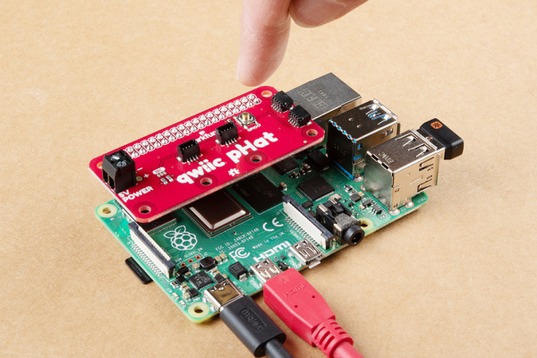

## 必要な部品

このチュートリアルに沿って進めるには、以下の部品が必要になる。
すでに持っているものやセットアップによっては、すべてが必要になるとは限らない。
カートに追加し、ガイドを読み進めながら、必要に応じてカートを調整してほしい。

- Raspberry Pi LCD - 7インチタッチスクリーン
- [SparkFun Qwiic pHAT v2.0 for Raspberry Pi & NVIDIA Jetson Orin Nano](https://www.sparkfun.com/sparkfun-qwiic-phat-v2-0-for-raspberry-pi.html)
- Multimedia Wireless Keyboard
- SparkFun Raspberry Pi 4 Basic Kit - 4GB（廃盤）

### おすすめの読み物

これらのチュートリアルに馴染みがない場合は、目を通しておくことを推奨する。

- [Raspberry Pi 4 Kit Hookup Guide](https://learn.sparkfun.com/tutorials/raspberry-pi-4-kit-hookup-guide) — Raspberry Pi 4 Model Bの基本キット、デスクトップキット、ハードウェアスターターキットの接続ガイド
- [Qwiic pHAT for Raspberry Pi Hookup Guide](https://learn.sparkfun.com/tutorials/qwiic-phat-for-raspberry-pi-hookup-guide) — Qwiic対応基板をRaspberry Piと接続する方法。Qwiic pHATはRaspberry PiのI2Cバス（GND、3.3V、SDA、SCL）を複数のQwiicコネクタへ引き出す
- [シリアルターミナルの基礎](./terminal-basics.md) — 各種ターミナルエミュレータアプリケーションを使い、シリアルデバイスと通信する方法
- [Raspberry PiのGPIO](./raspberry-gpio.md) — PythonまたはC++を使い、Raspberry PiのI/Oラインを制御する方法
- [PythonプログラミングでRaspberry Piを始める](./python-programming-tutorial-getting-started-with-the-raspberry-pi.md) — Pythonでハードウェアを制御するRaspberry Pi向けプログラムの書き方を学べるガイド
- [How to Run a Raspberry Pi Program on Startup](https://learn.sparkfun.com/tutorials/how-to-run-a-raspberry-pi-program-on-startup) — Raspberry Pi（や他のLinuxコンピュータ）の起動時にスクリプトやプログラムを自動実行するさまざまな方法

## ハードウェアの接続

接続はあっという間である。
まだであれば、Qwiic pHAT v2.0をRaspberry PiのGPIOヘッダーの上に重ねて差し込むだけでよい。
ケースを使っている場合は、確実に接続するために追加のスタッカブルヘッダーが必要になることがある。
下の画像は、スタッカブルヘッダーを使ってpHAT v2.0をPi 3に接続した様子を示している。

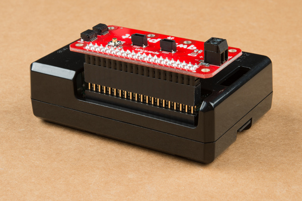

このチュートリアルでは、Raspberry Piを手軽に設定できるよう、モニタ・キーボード・マウスを使ったデスクトップセットアップを用いる。
まだであれば、必要な周辺機器を接続し、Piの電源を入れてほしい。

## Example 1：安全なシャットダウン

コマンドラインに馴染みがある場合は、次のコマンドでPiをシャットダウンできる。

```bash
sudo shutdown -h now
```

以下のサンプルは、起動時にPythonスクリプトを読み込み、GPIO17に接続したボタンが押されたときにこのコマンドでRaspberry Piを安全にシャットダウンする。

### サンプルコード

Raspberry Pi上で、下のボタンを押してPythonスクリプトをダウンロードする。

「[safe_shutdown_Pi.py](https://cdn.sparkfun.com/assets/learn_tutorials/1/1/7/1/safe_shutdown_Pi.py)」をダウンロード

コードをコピーしてテキストエディタに貼り付けてもよい。
その場合は、ファイル名を必ず**safe_shutdown_Pi.py**とし、保存した場所を覚えておくこと。

```python
# safe_shutdown_Pi.py
#
# Qwiic pHAT v2.0の汎用ボタンを利用し、Piを安全に再起動・シャットダウンする。
#   1.) ボタンを短く押すと、Piはシャットダウンする。

import time
import RPi.GPIO as GPIO

# ピンの定義
shutdown_pin = 17

# 警告を抑制する
GPIO.setwarnings(False)

# "GPIO"のピン番号方式を使う
GPIO.setmode(GPIO.BCM)

# モーメンタリ式プッシュボタンを抵抗なしで使う場合、
# ピンがフローティングにならないよう内蔵の内部プルアップ抵抗を使う。
#GPIO.setup(shutdown_pin, GPIO.IN, pull_up_down=GPIO.PUD_UP)

# Qwiic pHATのプルアップ抵抗を使い、ピンがフローティングにならないようにする
GPIO.setup(shutdown_pin, GPIO.IN)

# Piをシャットダウンするモジュール関数
def shut_down():
    print("shutting down")
    command = "/usr/bin/sudo /sbin/shutdown -h now"
    import subprocess
    process = subprocess.Popen(command.split(), stdout=subprocess.PIPE)
    output = process.communicate()[0]
    print(output)


# ボタンが押されたら安全にPiをシャットダウンする
while True:
    # 短い遅延を入れないと、このコードがPiの処理能力を大きく消費してしまう
    time.sleep(0.5)

    # トラブルシューティング用に、コメントを外すとコマンドラインにボタンの状態を出力できる
    #print('GPIO state is = ', GPIO.input(shutdown_pin))
    if GPIO.input(shutdown_pin)== False:
        shut_down()
```

> **注意：** このコードはQwiic pHATのプルアップ抵抗を使うよう書かれている。
> 抵抗なしのモーメンタリ式プッシュボタンを使う場合は、ピンがフローティングにならないよう内蔵の内部プルアップ抵抗を使える。
> 次の行の`#`を外してコメントを解除する。
>
> ```python
> #GPIO.setup(shutdown_pin, GPIO.IN, pull_up_down=GPIO.PUD_UP)
> ```
>
> 続いて、次の行の先頭に`#`を追加する。
>
> ```python
> GPIO.setup(shutdown_pin, GPIO.IN)
> ```
>
> 調整後は、次のようになるはずである。
>
> ```python
> # モーメンタリ式プッシュボタンを抵抗なしで使う場合、
> # ピンがフローティングにならないよう内蔵の内部プルアップ抵抗を使う。
> GPIO.setup(shutdown_pin, GPIO.IN, pull_up_down=GPIO.PUD_UP)
>
> # Qwiic pHATのプルアップ抵抗を使い、ピンがフローティングにならないようにする
> #GPIO.setup(shutdown_pin, GPIO.IN)
> ```

### パスを設定する

> **注意：** 以下の手順では、**rc.local**ファイルを変更するため、テキストベースのターミナルを使ってPythonスクリプトを移動する。
> **Downloads**フォルダから**/home/pi**へファイルをドラッグして移動することもできる。
>
> 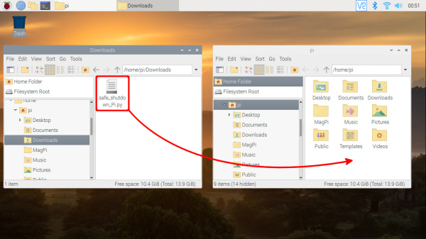

ダウンロードしたファイルは**Downloads**フォルダに保存される。
ダウンロードが終わったら、Pythonスクリプトを**/home/pi**へ移動する必要がある。
そのためには、コマンドラインを開く。
次のコマンドで**Downloads**フォルダへ移動する。

```bash
cd Downloads
```

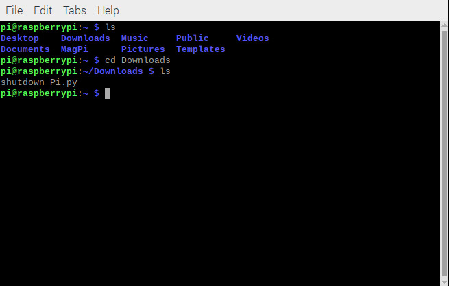

[mv Linuxコマンド](https://www.raspberrypi.org/documentation/linux/usage/commands.md)を使い、次のコマンドでファイルを目的の場所（この場合は**/home/pi**）へ移動する。

```bash
mv shutdown_Pi.py /home/pi
```

ファイルが正しく移動されたか確認するため、ディレクトリを1階層上に戻るコマンドを使う。

```bash
cd ..
```

続けて、listコマンドでパスの中身を確認する。
上の画像を見ると、これは移動先にあるものを確認するために使われていることがわかる。
その場所に**shutdown_Pi.py**ファイルがあるはずである。

```bash
ls
```

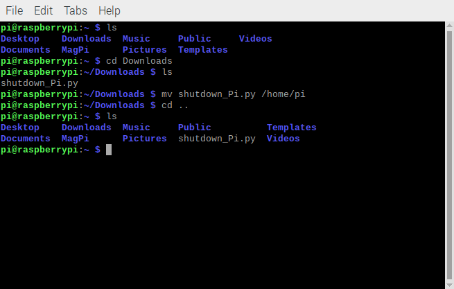

### rc.localを変更する

> **注意：** まだであれば、Raspberry Piを起動時にスクリプトを実行するよう設定するチュートリアルを確認しておくことを推奨する。
> このチュートリアルでは、**rc.local**ファイルを変更する方法1を使う。

ターミナルを開いたまま、次のコマンドを入力する。

```bash
sudo nano /etc/rc.local
```

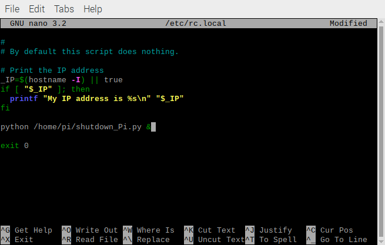

キーボードの`↓`キーで下にスクロールし、`exit 0`の行の直前に、次の行を入力する。

```bash
python /home/pi/safe_shutdown_Pi.py &
```

キーボードの`CTRL` + `X`で保存・終了し、確認を求められたら`y`、続いて`Enter`を押す。
変更を反映させるため、次のコマンドを入力する。

```bash
sudo reboot
```

### 実際に確認できること

再起動後、Qwiic pHAT v2.0のGPIO17ボタンを押す。
これでPiがシャットダウンするはずである。
モニタを接続している場合は接続が切れることに気づくだろうが、電源を取り外す前にシャットダウンが完了するまで数秒待つこと。
Pi上の緑色のステータスLEDは、完全にシャットダウンすると点滅を止める。

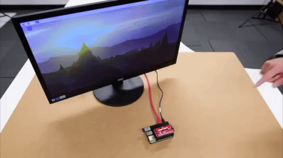

これでPiから安全に電源を取り外せる。
再びPiに電源を入れるには、電源コネクタを差し戻すだけでよい。

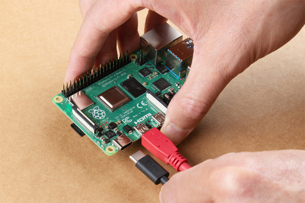

## Example 2：安全な再起動とシャットダウン

すばらしい。しかし、1つのボタンでもっと多くの機能が欲しくなったらどうすればよいだろうか。
ボタンを短く押したときは再起動、一定時間押し続けたときはシャットダウンと区別する条件を追加してみよう。
halt（`-h`）からreboot（`-r`）コマンドに切り替えることで、Piを再起動できる。

```bash
sudo shutdown -r now
```

以下のサンプルは、起動時に別のPythonスクリプトを読み込む。
GPIO17に接続したボタンをどれだけの時間押したかに応じて、Raspberry Piは安全に再起動またはシャットダウンする。

### サンプルコード

Raspberry Pi上で、下のボタンをクリックしてPythonスクリプトをダウンロードする。

「[safe_restart_shutdown_Pi.py](https://cdn.sparkfun.com/assets/learn_tutorials/1/1/7/1/safe_restart_shutdown_Pi.py)」をダウンロード

コードをコピーしてテキストエディタに貼り付けてもよい。
その場合は、ファイル名を必ず**safe_restart_shutdown_Pi.py**とし、保存した場所を覚えておくこと。

```python
# safe_restart_shutdown_Pi.py
#
# Qwiic pHAT v2.0の汎用ボタンを利用し、Piを安全に再起動・シャットダウンする。
#   1.) ボタンを短く押すと、Piは再起動する。
#   2.) ボタンを約3秒間押し続けると、Piはシャットダウンする。

import time
import RPi.GPIO as GPIO

# ピンの定義
reset_shutdown_pin = 17

# 警告を抑制する
GPIO.setwarnings(False)

# "GPIO"のピン番号方式を使う
GPIO.setmode(GPIO.BCM)

# モーメンタリ式プッシュボタンを抵抗なしで使う場合、
# ピンがフローティングにならないよう内蔵の内部プルアップ抵抗を使う。
#GPIO.setup(reset_shutdown_pin, GPIO.IN, pull_up_down=GPIO.PUD_UP)

# Qwiic pHATのプルアップ抵抗を使い、ピンがフローティングにならないようにする
GPIO.setup(reset_shutdown_pin, GPIO.IN)

# Piを再起動するモジュール関数
def restart():
    print("restarting Pi")
    command = "/usr/bin/sudo /sbin/shutdown -r now"
    import subprocess
    process = subprocess.Popen(command.split(), stdout=subprocess.PIPE)
    output = process.communicate()[0]
    print(output)

# Piをシャットダウンするモジュール関数
def shut_down():
    print("shutting down")
    command = "/usr/bin/sudo /sbin/shutdown -h now"
    import subprocess
    process = subprocess.Popen(command.split(), stdout=subprocess.PIPE)
    output = process.communicate()[0]
    print(output)


while True:
    # 短い遅延を入れないと、このコードがPiの処理能力を大きく消費してしまう
    time.sleep(0.5)

    # トラブルシューティング用に、コメントを外すとコマンドラインにボタンの状態を出力できる
    #print('GPIO state is = ", GPIO.input(reset_shutdown_pin))
    if GPIO.input(reset_shutdown_pin) == False:
        counter = 0

        while GPIO.input(reset_shutdown_pin) == False:
            # トラブルシューティング用に、コメントを外すとカウンタを確認できる。4を超えると再起動する。
            #print(counter)
            counter += 1
            time.sleep(0.5)

            # 長押し
            if counter > 4:
                shut_down()

        # 短押しであれば再起動する
        restart()
```

> **注意：** このコードはQwiic pHATのプルアップ抵抗を使うよう書かれている。
> 抵抗なしのモーメンタリ式プッシュボタンを使う場合は、ピンがフローティングにならないよう内蔵の内部プルアップ抵抗を使える。
> 詳しい手順はExample 1と同様である。

### パスを設定する

> **注意：** 以下の手順では、**rc.local**ファイルを変更するため、テキストベースのターミナルを使ってPythonスクリプトを移動する。
> **Downloads**フォルダから**/home/pi**へファイルをドラッグして移動することもできる。

これも**Downloads**フォルダに保存される。
ダウンロードが終わったら、Pythonスクリプトを**/home/pi**へ移動する必要がある。
そのためには、コマンドラインを開く。
次のコマンドで**Downloads**フォルダへ移動する。

```bash
cd Downloads
```

再び[mvコマンド](https://www.raspberrypi.org/documentation/linux/usage/commands.md)を使い、次のコマンドでファイルを移動する。

```bash
mv safe_restart_shutdown_Pi.py /home/pi
```

ファイルが正しく移動されたか確認するため、ディレクトリを1階層上に戻るコマンドを使う。

```bash
cd ..
```

続けて、listコマンドで確認する。

```bash
ls
```

### rc.localを変更する

> **注意：** まだであれば、Raspberry Piを起動時にスクリプトを実行するよう設定するチュートリアルを確認しておくことを推奨する。
> このチュートリアルでは、**rc.local**ファイルを変更する方法1を使う。

ターミナルを開いたまま、再び次のコマンドを入力する。

```bash
sudo nano /etc/rc.local
```

キーボードの`↓`キーで下にスクロールし、`exit 0`の行の直前で、ファイル名を**safe_restart_shutdown_Pi.py**に合わせて調整する。

```bash
python /home/pi/safe_restart_shutdown_Pi.py &
```

キーボードの`CTRL` + `X`で保存・終了し、確認を求められたら`y`、続いて`Enter`を押す。

変更を反映させるため、次のコマンドを入力する。

```bash
sudo reboot
```

### 実際に確認できること

再起動後、Qwiic pHAT v2.0のGPIO17ボタンを短く押す。
これでPiが再起動するはずである。

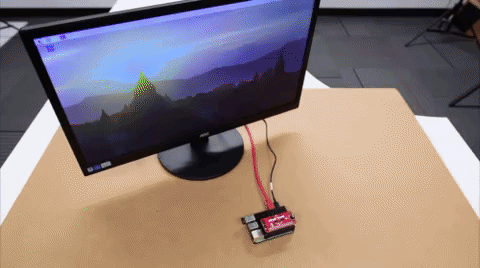

GPIO17ボタンをもう少し長めに押し続けると、シャットダウンコマンドが実行される。
Piがシャットダウンするまで数秒待つ必要がある。
モニタを接続している場合は、まず接続が切れることに気づくだろう。
この時点でボタンから指を離してよい。
ここでも、Pi上の緑色のステータスLEDを確認してほしい。
完全にシャットダウンすると、LEDは点滅を止める。
これでPiから安全に電源を取り外せる。

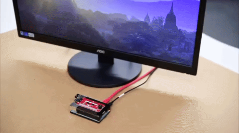

## より良くする

改善の余地は常にある。
執筆時点では、このサンプルコードがPi 3で使うと多くのリソースを消費することに気づいていなかった。
サンプルコードは動作するものの、実行時にかなりの量のリソースを消費しているとのユーザー報告があった。
Pi 4で`top`コマンドを使ってCPU使用率を確認したところ、このコードはPiの処理能力の90%〜100%を占めていた。

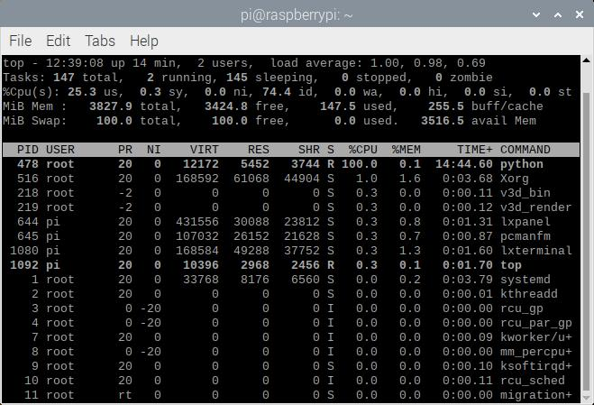

### 考えられる解決策：遅延か割り込みか

同僚に確認したところ、原因はwhileループがピンの状態を常時チェックし続けていることで一致した。
以下は、PiのCPU負荷を減らすための2つの解決策である。

- 短い遅延を追加する
- 割り込みを使う

#### 短い遅延を追加する

一つの提案は、小さな遅延を追加することだった。
Raspberry Piはプログラムをできる限り速く実行し続けるため、遅延を入れることでループ内でピンを高頻度にポーリングするのを防げる。
whileループにシンプルな`time.sleep(0.5)`を追加するだけで、Piの再起動・シャットダウンのボタン押下を読み取る機能を保ったまま、CPUを大きく解放できる。

```python
.
.
.

while True:
    # 短い遅延を入れないと、このコードがPiの処理能力を大きく消費してしまう
    time.sleep(0.5)

.
.
.
```

この遅延は、このチュートリアルのサンプルコードにあらかじめ組み込まれている。
すでにこのサンプルコードをアプリケーションに組み込んでいる場合は、whileループに`time.sleep(0.5)`を追加し、変更を保存してPiを再起動すれば反映される。
もちろん、遅延を短くしてスクリプトの反応を速くすることもできる。
ただし、ボタンの状態をより頻繁にチェックすることになるため、CPU使用量は増える点に注意してほしい。

#### 割り込みを使ってシャットダウンする

もう一つの提案は、ボタンが押されたときにだけコードを実行する割り込みを使うようコードを調整することだった。
Raspberry Pi上で、下のボタンを押してPythonスクリプトをダウンロードする。

「[safe_shutdown_interrupt_Pi.py](https://cdn.sparkfun.com/assets/learn_tutorials/1/1/7/1/safe_shutdown_interrupt_Pi.py)」をダウンロード

コードをコピーしてテキストエディタに貼り付けてもよい。
その場合は、ファイル名を必ず**safe_shutdown_interrupt_Pi.py**とし、保存した場所を覚えておくこと。
続けて、上で説明した手順に従い、起動時にコードを実行するよう*rc.local*ファイルを変更する。

```python
# safe_shutdown_interrupt_Pi.py
#
# Qwiic pHAT v2.0の汎用ボタンを利用し、Piを安全にシャットダウンする。
#   1.) ボタンを短く押すと、Piはシャットダウンする。
#
# このサンプルは割り込みも活用しているため、CPUの消費量はごくわずかである。
# Piの処理能力をすべて占有しないため、より効率的である。

import time
import RPi.GPIO as GPIO # Pythonパッケージリファレンス: https://pypi.org/project/RPi.GPIO/

# ピンの定義
shutdown_pin = 17

# 警告を抑制する
GPIO.setwarnings(False)

# "GPIO"のピン番号方式を使う
GPIO.setmode(GPIO.BCM)

# モーメンタリ式プッシュボタンを抵抗なしで使う場合、
# ピンがフローティングにならないよう内蔵の内部プルアップ抵抗を使う。
#GPIO.setup(shutdown_pin, GPIO.IN, pull_up_down=GPIO.PUD_UP)

# Qwiic pHATのプルアップ抵抗を使い、ピンがフローティングにならないようにする
GPIO.setup(shutdown_pin, GPIO.IN)

# Piをシャットダウンするモジュール関数
def shut_down():
    print("shutting down")
    command = "/usr/bin/sudo /sbin/shutdown -h now"
    import subprocess
    process = subprocess.Popen(command.split(), stdout=subprocess.PIPE)
    output = process.communicate()[0]
    print(output)


while True:
    # 短い遅延を入れないと、このコードがPiの処理能力を大きく消費してしまう
    time.sleep(0.5)

    # ボタン押下の立ち下がりエッジをデバウンス付きで待ち、
    # Piを安全にシャットダウンするためにリソースを消費しすぎないようにする
    channel = GPIO.wait_for_edge(shutdown_pin, GPIO.FALLING, bouncetime=200)

    if channel is None:
        print('Timeout occurred')
    else:
        print('Edge detected on channel', channel)

        # トラブルシューティング用に、コメントを外すとコマンドラインにボタンの状態を出力できる
        #print('GPIO state is = ', GPIO.input(shutdown_pin))
        shut_down()
```

`GPIO.wait_for_edge()`を使うことで、ボタン押下による立ち上がりまたは立ち下がりエッジを待つだけでよくなり、CPUを解放できる。
この場合は、ピン17の立ち下がりエッジを待っている。
ボタンが押されると、最初のサンプルと同様にPiをシャットダウンするコマンドを実行する。

#### 割り込みを使って再起動とシャットダウンをする

前の節で説明したとおり、遅延を使う以外のもう一つの選択肢は、ボタンが押されたときにだけコードを実行する割り込みを使うようコードを調整することである。
Raspberry Pi上で、下のボタンを押してPythonスクリプトをダウンロードする。

「[safe_restart_shutdown_interrupt_Pi.py](https://cdn.sparkfun.com/assets/learn_tutorials/1/1/7/1/safe_restart_shutdown_interrupt_Pi.py)」をダウンロード

コードをコピーしてテキストエディタに貼り付けてもよい。
その場合は、ファイル名を必ず**safe_restart_shutdown_interrupt_Pi.py**とし、保存した場所を覚えておくこと。
続けて、上で説明した手順に従い、起動時にコードを実行するよう*rc.local*ファイルを変更する。

```python
# safe_restart_shutdown_interrupt_Pi.py
#
# Qwiic pHAT v2.0の汎用ボタンを利用し、Piを安全に再起動・シャットダウンする。
#   1.) ボタンを短く押すと、Piは再起動する。
#   2.) ボタンを約3秒間押し続けると、Piはシャットダウンする。
#
# このサンプルは割り込みも活用しているため、CPUの消費量はごくわずかである。
# Piの処理能力をすべて占有しないため、より効率的である。

import time
import RPi.GPIO as GPIO # Pythonパッケージリファレンス: https://pypi.org/project/RPi.GPIO/

# ピンの定義
reset_shutdown_pin = 17

# 警告を抑制する
GPIO.setwarnings(False)

# "GPIO"のピン番号方式を使う
GPIO.setmode(GPIO.BCM)

# モーメンタリ式プッシュボタンを抵抗なしで使う場合、
# ピンがフローティングにならないよう内蔵の内部プルアップ抵抗を使う。
#GPIO.setup(reset_shutdown_pin, GPIO.IN, pull_up_down=GPIO.PUD_UP)

# Qwiic pHATのプルアップ抵抗を使い、ピンがフローティングにならないようにする
GPIO.setup(reset_shutdown_pin, GPIO.IN)

# Piを再起動するモジュール関数
def restart():
    print("restarting Pi")
    command = "/usr/bin/sudo /sbin/shutdown -r now"
    import subprocess
    process = subprocess.Popen(command.split(), stdout=subprocess.PIPE)
    output = process.communicate()[0]
    print(output)

# Piをシャットダウンするモジュール関数
def shut_down():
    print("shutting down")
    command = "/usr/bin/sudo /sbin/shutdown -h now"
    import subprocess
    process = subprocess.Popen(command.split(), stdout=subprocess.PIPE)
    output = process.communicate()[0]
    print(output)


while True:
    # 短い遅延を入れないと、このコードがPiの処理能力を大きく消費してしまう
    time.sleep(0.5)

    # ボタン押下の立ち下がりエッジをデバウンス付きで待ち、
    # Piを安全に再起動・シャットダウンするためにリソースを消費しすぎないようにする
    channel = GPIO.wait_for_edge(reset_shutdown_pin, GPIO.FALLING, bouncetime=200)

    if channel is None:
        print('Timeout occurred')
    else:
        print('Edge detected on channel', channel)

        # トラブルシューティング用に、コメントを外すとコマンドラインにボタンの状態を出力できる
        #print('GPIO state is = ', GPIO.input(reset_shutdown_pin))
        counter = 0

        while GPIO.input(reset_shutdown_pin) == False:
            # トラブルシューティング用に、コメントを外すとカウンタを確認できる。4を超えると再起動する。
            #print(counter)
            counter += 1
            time.sleep(0.5)

            # 長押し
            if counter > 4:
                shut_down()

        # 短押しであれば再起動する
        restart()
```

ここでも`GPIO.wait_for_edge()`を使い、ピン17の立ち下がりエッジを待つ。
ボタンが押されると、2つ目のサンプルと同様にPiを再起動またはシャットダウンするコマンドを実行する。
ボタンは押され続けている間、状態が変化しない。
そこで、ボタンがどれだけの時間押されているかを確認する。
短押しであればPiは再起動する。
カウンタが4を超える長押しであれば、Piはシャットダウンする。

### どちらの方法がより良いか

では、短い遅延と割り込みでは、どちらがより効果的だろうか。
短い遅延を追加すると、CPUの消費量はおよそ0.3%まで大幅に削減された。

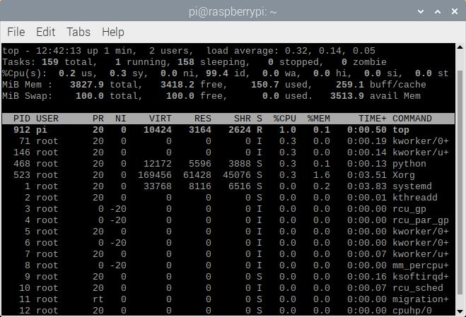

割り込みを追加した場合も、CPUの消費量は大幅に削減された。
スクリプトは`GPIO.wait_for_edge()`の行に達すると、CPUの消費をやめた。
コマンドラインで`top`を使った後、一覧の上位に表示されなかったため、`L`コマンドで`python`という単語を入力してプロセスを検索する必要があった。

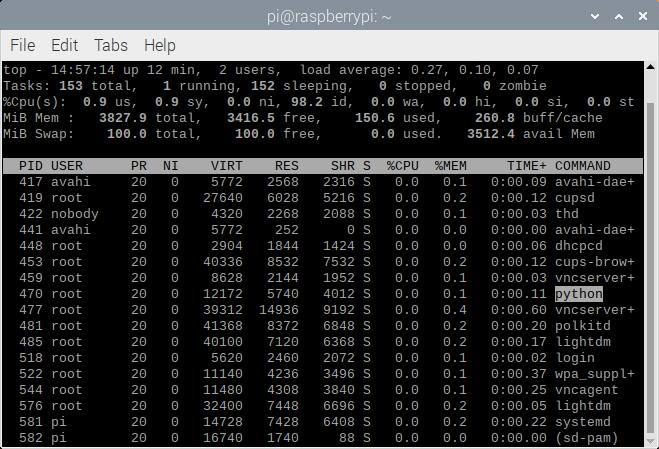

短い遅延を追加する方法は手早い修正ではあるが、反応が遅く、ボタンの状態を確認し続けることでPiの処理能力の一部を無駄にしていた。
割り込みを追加する方法はそれほど単純ではないものの、反応が速く、ボタンの立ち下がりエッジを待つだけなのでPiの処理能力を無駄にしない、より効率的な方法だった。
総じて、割り込みを使う方が優れていると言えるが、急いでコードを書きたい場合は遅延を追加する方法が代替案になる。

## まとめ・参考資料

より詳しい情報は、以下のリンクを確認してほしい。

- [GitHubリポジトリ](https://github.com/sparkfun/Raspberry-Pi-Safe-Reboot-and-Shutdown-Button)
  - [Safe_Shutdown_Pi.py](https://cdn.sparkfun.com/assets/learn_tutorials/1/1/7/1/safe_shutdown_Pi.py)
  - [Safe_Restart_Shutdown_Pi.py](https://cdn.sparkfun.com/assets/learn_tutorials/1/1/7/1/safe_restart_shutdown_Pi.py)
  - [Safe_Shutdown_Interrupt_Pi.py](https://cdn.sparkfun.com/assets/learn_tutorials/1/1/7/1/safe_shutdown_interrupt_Pi.py)
  - [Safe_Restart_Shutdown_Interrupt_Pi.py](https://cdn.sparkfun.com/assets/learn_tutorials/1/1/7/1/safe_restart_shutdown_interrupt_Pi.py)
- [eLinux.org Wiki: Wake from Halt](https://elinux.org/RPI_safe_mode#Wake_from_Halt.5B1.5D) — バージョンによっては、電源を切断する代わりにピン同士をショートさせることでPiを目覚めさせられる。ただし、これらのGPIOピンは電源ピンのすぐ隣にあるため注意が必要である。電源ピンを誤ってショートさせないよう、ピンにボタンをはんだ付けすることを推奨する。

次のプロジェクトのアイデアが欲しければ、Pi AVR Programmerを確認してみてほしい。基板のプログラムとテストの後にシャットダウンコードを実装している。

- [Raspberry Pi Stand-Alone Programmer](https://learn.sparkfun.com/tutorials/raspberry-pi-stand-alone-programmer) — ヘッドレスのRaspberry Piを使い、スタンドアロンのプログラマーとしてAVRマイクロコントローラーにHEXファイルを書き込む方法。プロダクションプログラミングの課題や、SparkFunがこの解決策にたどり着いた経緯、そこで得られた教訓についても紹介する
- [Pi AVR Programmer HAT Hookup Guide](https://learn.sparkfun.com/tutorials/pi-avr-programmer-hat-hookup-guide) — Raspberry Pi 3とPi AVR Programmer HATを使い、ATMega328Pをターゲットにプログラムする方法。まずSPI経由でArduinoブートローダーをプログラムし、続いてUSBシリアルCOMポート経由でArduinoスケッチをアップロードする

関連するチュートリアルも参考になる。

- [PiRetrocade Assembly Guide](https://learn.sparkfun.com/tutorials/piretrocade-assembly-guide-) — SparkFun PiRetrocadeキットを使い、自分だけのレトロゲームコントローラーを組み立てる
- [Using Flask to Send Data to a Raspberry Pi](https://learn.sparkfun.com/tutorials/using-flask-to-send-data-to-a-raspberry-pi) — PythonのFlaskフレームワークを使い、ESP8266 WiFiノードから内部WiFiネットワーク越しにRaspberry Piへデータを送信する方法
- [MQTT入門](./introduction-to-mqtt.md) — IoT（モノのインターネット）で使われる主要な通信プロトコルの一つ、MQTTの入門
- [Digital Temperature Sensor Breakout - AS6212 (Qwiic) Hookup Guide](https://learn.sparkfun.com/tutorials/digital-temperature-sensor-breakout---as6212-qwiic-hookup-guide) — AS6212温度センサーを使い、極めて低い消費電力で高精度な温度測定を始める方法

タグ: 入力デバイス、プロジェクト、Python、Qwiic、Raspberry Pi、シングルボードコンピュータ

---

出典：[Raspberry Pi Safe Reboot and Shutdown Button](https://learn.sparkfun.com/tutorials/raspberry-pi-safe-reboot-and-shutdown-button)（SparkFun Learn）を日本語に翻訳し、再構成した。
原文は [CC BY-SA 4.0](https://creativecommons.org/licenses/by-sa/4.0/) ライセンスで公開されており、本ページも同ライセンスの下で提供する。
