# Raspberry PiのSPIとI2C

I2CとSPIのシリアルインターフェースを介してマイクロプロセッサに追加できる周辺機器は数多い。
大気センサー、EEPROM、各種のディスプレイなどがその例である。

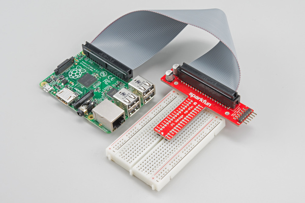

_Pi WedgeはI2CとSPIの信号にアクセスしやすくしてくれる。_

このチュートリアルでは、Raspberry PiのI2CとSPIのインターフェースを実際に動かすまでの手順を説明する。
これらのインターフェースはデフォルトでは有効になっておらず、使う前にいくつか追加の設定が必要である。

## 参考になるチュートリアル

始める前に、関連する背景知識のチュートリアルに目を通しておくとよい。

- I2Cは、最小限の配線でマイクロコントローラーと周辺機器の間でデータをやり取りできる便利なバスである。
- SPI（シリアルペリフェラルインターフェース）は、I2Cと似た用途を持つ親戚のようなインターフェースである。
- C/C++のサンプルでは、これらのバスとのやり取りに[wiringPi](https://github.com/WiringPi/WiringPi)ライブラリを使う。
- Pythonのサンプルでは、SPIに[spidev](https://pypi.org/project/spidev/)を、I2Cにsmbusを使う。

## 背景知識とソフトウェアのセットアップ

[Raspberry Pi](https://www.sparkfun.com/raspberry_pi)のGPIOヘッダーには、3種類のシリアルインターフェースがある。
すでに馴染みがあるかもしれないUARTシリアルポートは、PuTTYのようなシリアルターミナルアプリケーションからログインセッションを開くのに使われる。

残る二つのシリアルインターフェースが、シリアルペリフェラルインターフェース（**SPI**）とInter-Integrated-Circuitバス（**I2C**）である。
Pi上のSPIは最大2台の周辺機器を接続できるのに対し、I2Cはアドレスが重複しない限り、原理上多数の機器を接続できる。

### ソフトウェアの詳細

Raspberry Pi向けのソフトウェアを取り巻く状況は、Piの登場以来かなり進化してきた。
さまざまなOSがPiに移植され、デバイスドライバの基盤も大きく変化している。

このチュートリアルでは、比較的新しいバージョンのRaspbian（NOOBS経由でインストールしたもの）と、C/C++向けのwiringPi I/Oライブラリ（Pythonの場合はspidev/smbus）を使う。

Raspbianにデバイスツリーオーバーレイが導入されたことで、インターフェースを有効化する具体的な手順の一部が変更されている。
古いインストール環境を使っている場合は、SDカードをバックアップし、まっさらな状態からインストールし直すのも一つの手である。

#### OSとライブラリのインストール

まっさらなSDカードから始める場合は、Raspbianをインストールする必要がある。
すでに動作するRaspbian環境がある場合は、次のセクションまで読み飛ばしてよい。

- [NOOBS](https://www.raspberrypi.org/downloads/noobs/)イメージをダウンロードする（執筆時点でバージョン2.8.2）。
- [公式のインストール手順](https://www.raspberrypi.org/help/noobs-setup/)に従う。

Piのセットアップに別の方法を使いたい場合は、次のチュートリアルも参考にしてほしい。

- [Raspberry Pi 3 Starter Kit Hookup Guide](https://learn.sparkfun.com/tutorials/raspberry-pi-3-starter-kit-hookup-guide) — Raspberry Pi 3 Model BおよびPi 3 Model B+のスターターキットで始める方法
- [Headless Raspberry Pi Setup](https://learn.sparkfun.com/tutorials/headless-raspberry-pi-setup) — キーボード、マウス、モニタなしでRaspberry Piを設定する方法
- [Setting up a Raspberry Pi 3 as an Access Point](https://learn.sparkfun.com/tutorials/setting-up-a-raspberry-pi-3-as-an-access-point) — Raspberry Piをアクセスポイントとして設定し、ローカルのイーサネットネットワークに接続してインターネットを他のWiFi機器と共有する方法
- [Raspberry PiでVNCによるリモートデスクトップを使う](./how-to-use-remote-desktop-on-the-raspberry-pi-with-vnc.md) — RealVNCでRaspberry Piに接続し、グラフィカルデスクトップをネットワーク越しに遠隔操作する方法

C/C++でプログラミングする場合は、[Raspberry PiのGPIO](./raspberry-gpio.md)のWiring Piのセットアップの節を参照することを推奨する。
参考までに、以下に同じ手順を掲載しておく。

#### C/C++（Wiring Pi）のセットアップ

> **注意：** WiringPiは現在、標準のRaspbianシステムにあらかじめインストールされている。
> WiringPi公式ホームページの手順は現在非推奨であり、元のWiringPiソース（`git://git.drogon.net/wiringPi`）はもう利用できない。

WiringPiは、以前のバージョンのRaspbianには同梱されていなかったため、ユーザーが自分でダウンロードしてインストールする必要があった。
現在は幸い、標準のRaspbianシステムに含まれている。
新しいハードウェアに対応した更新版のミラーからWiringPiを更新したい場合は、GitHubリポジトリを確認してほしい。

gitが必要になる（デフォルトでインストールされている場合もある）。
gitがインストールされていない場合は、コマンドラインで次のように入力する。

```bash
sudo apt-get install git-core
```

最新版はGitを使ってダウンロードすることを強く推奨する。
現在のバージョンを確認するには、次のコマンドを入力する。

```bash
gpio -v
```

次のように`Unknown17`を含む出力が返ってきた場合、Raspberry Pi 4以降でWiringPiを更新する必要がある。

```
gpio version: 2.50
Copyright (c) 2012-2018 Gordon Henderson
This is free software with ABSOLUTELY NO WARRANTY.
For details type: gpio -warranty

Raspberry Pi Details:
  Type: Unknown17, Revision: 02, Memory: 0MB, Maker: Sony
    * Device tree is enabled.
    * --> Raspberry Pi 4 Model B Rev 1.2
    * This Raspberry Pi supports user-level GPIO access.
```

WiringPiと設定ファイルを削除するには、次のように入力する。

```bash
sudo apt-get purge wiringpi
```

続いて、次のコマンドでPiにWiringPiの記憶を完全に消去させる。

```bash
hash -r
```

Gitさえインストールされていれば、WiringPiのダウンロードとインストールに必要なのは次のコマンドだけである。

```bash
git clone https://github.com/WiringPi/WiringPi.git
```

これで、カレントディレクトリにWiringPiという名前のフォルダが作られる。
WiringPiのディレクトリに移動する。

```bash
cd WiringPi
```

続いて、originから最新の変更を取得する。

```bash
git pull origin
```

続いて、次のコマンドを実行する。
`./build`は、ソースファイルからWiringPiをビルドするスクリプトである。
これによりヘルパーファイルが構築され、Linux上のいくつかのパスが変更され、WiringPiが使える状態になる。

```bash
./build
```

ここまでで、ライブラリは動作するはずである。
下記の`gpio`コマンドを実行し、WiringPiのバージョンと実行中のPiに関する情報を確認する。

```bash
gpio -v
```

次のコマンドを入力すると、40ピンコネクタの各ピンの設定を示す表が表示される。

```bash
gpio readall
```

I2CとSPIのインターフェースは、それぞれ追加の設定と初期化が必要になる。詳しくは後述のセクションで説明する。

#### Python（spidev/smbus）のセットアップ

Python 3のセットアップとpipのインストールについては、Pythonプログラミングチュートリアルの「Piの設定」の節を参照してほしい。

## ポートへの接続

設定とサンプルコードの説明に入る前に、それぞれのインターフェースが使うピンの位置を確認しておく。

Piのピンに直接配線する場合、配置はやや分かりにくい。
I2C.1は片端の近くにあるのに対し、SPIとI2C.0はヘッダーの中央付近にある。
これらのピンに配線する際は、慎重に数えるようにしてほしい。

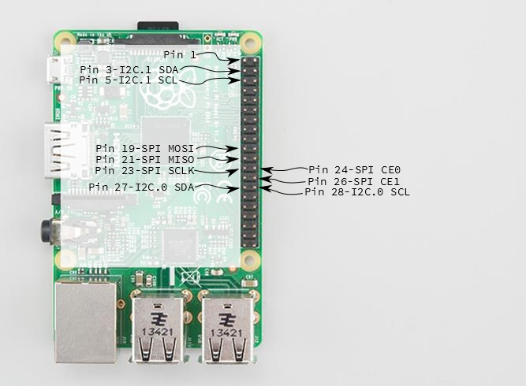

_Piのシリアルバスピン_

[Pi Wedge](https://www.sparkfun.com/products/13717)アダプタ基板は、ピンを整理して分かりやすくラベル付けしてくれる。
以降のサンプルではこのWedgeを使う。

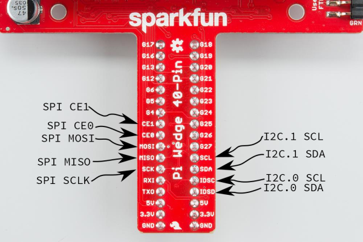

_Wedgeのシリアルバスピン_

## PiでのSPI

### 設定

SPIペリフェラルはデフォルトでは無効になっている。
設定を変更する方法は二つある。有効化するには次の手順で行う。

#### デスクトップGUIによるRaspberry Piの設定

デスクトップGUIを使うには、**Piのスタートメニュー > Preferences > Raspberry Pi Configuration**を開く。

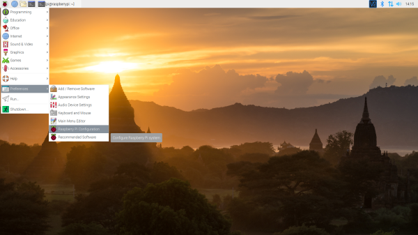

_画像をクリックすると拡大表示できる。_

ウィンドウが開き、設定を調整するためのタブがいくつか表示される。
ここで使うのは**Interfaces**タブである。
このタブをクリックし、SPIの項目で**Enable**を選択する。
プロジェクトの必要に応じて、他のインターフェースもここで有効化できる。
**OK**ボタンをクリックして保存する。

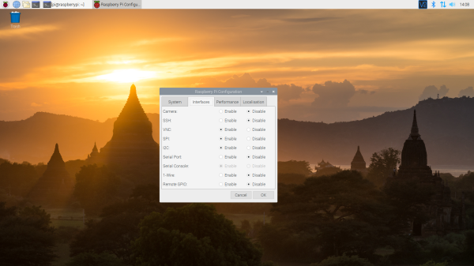

_画像をクリックすると拡大表示できる。_

設定を確実に反映させるため、Piを再起動することを推奨する。
**Piのスタートメニュー > Preferences > Shutdown**をクリックする。
今回は再起動だけでよいので、**Restart**ボタンをクリックする。

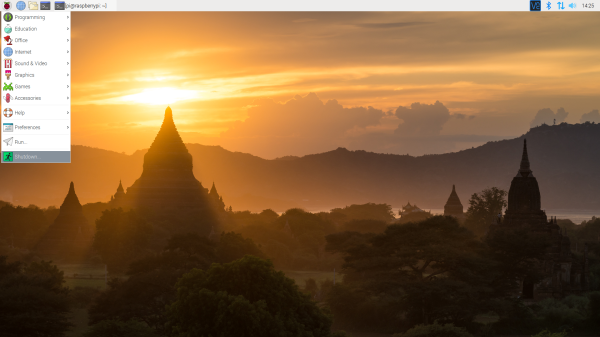

_Shutdown_

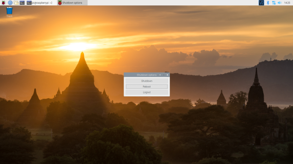

_Turn Off、Restart、Log Off_

_画像をクリックすると拡大表示できる。_

#### ターミナルによるraspi-configツール

ターミナルを使う場合は、次の手順で行う。

1. `sudo raspi-config`を実行する。
2. 下矢印キーで`5 Interfacing Options`を選択する。
3. `P4 SPI`まで下矢印キーで移動する。
4. SPIを有効にするか聞かれたら`yes`を選択する。
5. カーネルモジュールを自動で読み込むか聞かれた場合も`yes`を選択する。
6. 右矢印キーで`<Finish>`ボタンを選択する。
7. 再起動するか聞かれたら`yes`を選択する。

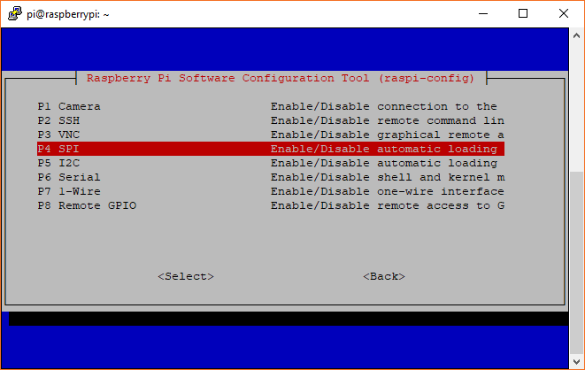

_SPI用のraspi-config_

システムが再起動する。
再起動後、ログインして次のコマンドを入力する。

```bash
ls /dev/*spi*
```

Piは次のように応答するはずである。

```bash
/dev/spidev0.0  /dev/spidev0.1
```

これらは、それぞれチップイネーブルピン0と1に対応するSPIデバイスを表す。
これらのピンはPi内部で固定配線されている。
通常、このインターフェースが対応できるのは最大2台の周辺機器までだが、単一のチップイネーブル信号を共有しながら複数のデバイスをデイジーチェーン接続できる場合もある。

### プログラミングの例

#### 必要な部品

- [40ピンのPi Wedge](https://www.sparkfun.com/products/13717)
- [Raspberry Pi B+](https://www.sparkfun.com/products/12994)または[Pi 2 Model B](https://www.sparkfun.com/products/13297)のシングルボードコンピュータ
- はんだ付け不要のブレッドボード
- ジャンパー線
- 好みのヘッダーピン
- [シリアル7セグメントディスプレイ](https://www.sparkfun.com/products/11441)

シリアル7セグメントディスプレイは、UART、SPI、I2Cのいずれからでもコマンドを受け付けられるため、シリアルインターフェースのテストに特に便利である。
配線の前に、7セグメントディスプレイにヘッダーピンをはんだ付けしておくこと。

#### 接続表

ディスプレイは、Pi Wedgeを介して次のようにPiに接続した。

| Raspberry Piの信号 | シリアル7セグメントの信号 |
| ------------------ | ------------------------- |
| GND                | GND                       |
| 3.3V               | VCC                       |
| CE1                | SS（Shift Select）        |
| SCK                | SCK                       |
| MOSI               | SDI                       |
| MISO               | SDO                       |

テスト用のハードウェアは次のような見た目になった。

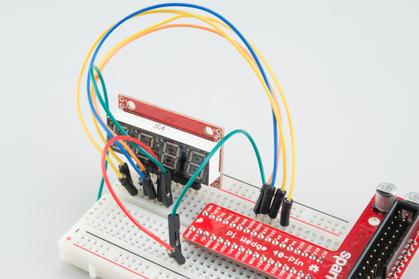

_SPI用のシリアル7セグメントの接続_

#### C++のサンプルプログラム

```cpp
/******************************************************************************
spitest.cpp
Raspberry Pi SPI interface demo
Byron Jacquot @ SparkFun Electronics
4/2/2014
https://github.com/sparkfun/Pi_Wedge

A brief demonstration of the Raspberry Pi SPI interface, using the SparkFun
Pi Wedge breakout board.

This example makes use of the Wiring Pi library, which streamlines the interface
to the I/O pins on the Raspberry Pi, providing an API similar to Arduino.

Hardware connections (Raspberry Pi -> Serial 7 Segment):
GND  -> GND
3.3V -> Vcc
CE1  -> SS (Shift Select)
SCK  -> SCK
MOSI -> SDI
MISO -> SDO

To build: g++ spitest.cpp -lwiringPi
This test uses the single-segment mode of the 7 segment display.
******************************************************************************/

#include <iostream>
#include <errno.h>
#include <wiringPiSPI.h>
#include <unistd.h>

using namespace std;

// channel is the wiringPi name for the chip select (or chip enable) pin.
// Set this to 0 or 1, depending on how it's connected.
static const int CHANNEL = 1;

int main()
{
   int fd, result;
   unsigned char buffer[100];

   cout << "Initializing" << endl ;

   // Configure the interface.
   // CHANNEL indicates chip select,
   // 500000 indicates bus speed.
   fd = wiringPiSPISetup(CHANNEL, 500000);

   cout << "Init result: " << fd << endl;

   // clear display
   buffer[0] = 0x76;
   wiringPiSPIDataRW(CHANNEL, buffer, 1);

   sleep(5);

   // Do a one-hot bit selection for each field of the display
   for(int i = 1; i <= 0x7f; i <<= 1)
   {
      // the decimals, colon and apostrophe dots
      buffer[0] = 0x77;
      buffer[1] = i;
      result = wiringPiSPIDataRW(CHANNEL, buffer, 2);

      // The first character
      buffer[0] = 0x7b;
      buffer[1] = i;
      result = wiringPiSPIDataRW(CHANNEL, buffer, 2);

      // The second character
      buffer[0] = 0x7c;
      buffer[1] = i;
      result = wiringPiSPIDataRW(CHANNEL, buffer, 2);

      // The third character
      buffer[0] = 0x7d;
      buffer[1] = i;
      result = wiringPiSPIDataRW(CHANNEL, buffer, 2);

      // The last character
      buffer[0] = 0x7e;
      buffer[1] = i;
      result = wiringPiSPIDataRW(CHANNEL, buffer, 2);

      // Pause so we can see them
      sleep(5);
   }

   // clear display again
   buffer[0] = 0x76;
   wiringPiSPIDataRW(CHANNEL, buffer, 1);
}
```

wiringPiをビルドした際、それに対してアプリケーションをコンパイルする方法についての記述に気づいたかもしれない。

```bash
NOTE: To compile programs with wiringPi, you need to add:
    -lwiringPi
to your compile line(s) To use the Gertboard, MaxDetect, etc.
code (the devLib), you need to also add:
    -lwiringPiDev
to your compile line(s).
```

したがって、次のコマンドでコンパイルする。

```bash
g++ spitest.cpp -l wiringPi -o spitest
```

これにより`spitest`という実行ファイルが生成される。
`./spitest`を実行すると、ディスプレイの各セグメントが順に光る。
各桁のセグメントを5秒ずつ点灯させながら次のセグメントに進み、全体でおよそ40秒かかる。

#### Pythonのサンプルプログラム

```python
# spitest.py
# A brief demonstration of the Raspberry Pi SPI interface, using the Sparkfun
# Pi Wedge breakout board and a SparkFun Serial 7 Segment display

import time
import spidev

# We only have SPI bus 0 available to us on the Pi
bus = 0

# Device is the chip select pin. Set to 0 or 1, depending on the connections
device = 1

# Enable SPI
spi = spidev.SpiDev()

# Open a connection to a specific bus and device (chip select pin)
spi.open(bus, device)

# Set SPI speed and mode
spi.max_speed_hz = 500000
spi.mode = 0

# Clear display
msg = [0x76]
spi.xfer2(msg)

time.sleep(5)

# Turn on one segment of each character to show that we can
# address all of the segments
i = 1
while i < 0x7f:

    # The decimals, colon and apostrophe dots
    msg = [0x77]
    msg.append(i)
    result = spi.xfer2(msg)

    # The first character
    msg = [0x7b]
    msg.append(i)
    result = spi.xfer2(msg)

    # The second character
    msg = [0x7c]
    msg.append(i)
    result = spi.xfer2(msg)

    # The third character
    msg = [0x7d]
    msg.append(i)
    result = spi.xfer2(msg)

    # The last character
    msg = [0x7e]
    msg.append(i)
    result = spi.xfer2(msg)

    # Increment to next segment in each character
    i <<= 1

    # Pause so we can see them
    time.sleep(5)


# Clear display again
msg = [0x76]
spi.xfer2(msg)
```

このプログラムを*spitest.py*のような名前で保存し、次のコマンドで実行する。

```bash
python spitest.py
```

これにより、各文字の各セグメントが5秒ずつ点灯し、次のセグメントに進む。
プログラム全体の実行にはおよそ40秒かかる。

## PiでのI2C

### 設定

I2Cペリフェラルも、SPIと同様にデフォルトでは無効になっている。
設定を変更する方法は二つある。有効化するには次の手順で行う。

#### デスクトップGUIによるRaspberry Piの設定

デスクトップGUIを使うには、**Piのスタートメニュー > Preferences > Raspberry Pi Configuration**を開く。


_画像をクリックすると拡大表示できる。_

ウィンドウが開き、設定を調整するためのタブがいくつか表示される。
ここで使うのは**Interfaces**タブである。
このタブをクリックし、I2Cの項目で**Enable**を選択する。
プロジェクトの必要に応じて、他のインターフェースもここで有効化できる。
**OK**ボタンをクリックして保存する。


_画像をクリックすると拡大表示できる。_

設定を確実に反映させるため、Piを再起動することを推奨する。
**Piのスタートメニュー > Preferences > Shutdown**をクリックする。
今回は再起動だけでよいので、**Restart**ボタンをクリックする。


_Shutdown_


_Turn Off、Restart、Log Off_

_画像をクリックすると拡大表示できる。_

#### ターミナルによるraspi-configツール

SPIペリフェラルと同様に、I2Cもデフォルトでは無効になっている。
ここでも`raspi-config`を使って有効化できる。

1. `sudo raspi-config`を実行する。
2. 下矢印キーで`5 Interfacing Options`を選択する。
3. `P5 I2C`まで下矢印キーで移動する。
4. I2Cを有効にするか聞かれたら`yes`を選択する。
5. カーネルモジュールを自動で読み込むか聞かれた場合も`yes`を選択する。
6. 右矢印キーで`<Finish>`ボタンを選択する。
7. 再起動するか聞かれたら`yes`を選択する。

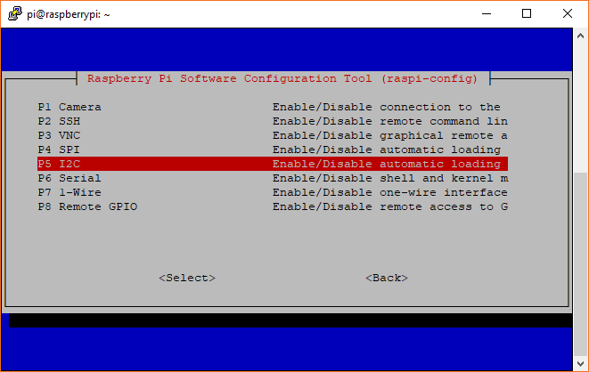

_I2C用のraspi-config_

システムが再起動する。
再起動後、ログインして次のコマンドを入力する。

```bash
ls /dev/*i2c*
```

Piは次のように応答するはずである。

```bash
/dev/i2c-1
```

これは、ユーザーモードのI2Cインターフェースを表す。

### ユーティリティ

I2Cインターフェースを動かす助けになる、一連のコマンドラインユーティリティプログラムがある。
これらはaptパッケージマネージャーで入手できる。

```bash
sudo apt-get install -y i2c-tools
```

なかでも`i2cdetect`プログラムは、バス上のすべてのアドレスにプローブを送り、デバイスが存在するかどうかを報告してくれる。
コマンドラインで次のコマンドを入力する。
`-y`フラグは対話モードを無効にし、確認待ちを省略する。
`1`は、I2Cバス1（`i2c-1`）上のI2Cデバイスをスキャンすることを示している。

```bash
i2cdetect -y 1
```

Raspberry Piから、次のような出力が返ってくる。

```bash
pi@raspberrypi:~/$ i2cdetect -y 1
     0  1  2  3  4  5  6  7  8  9  a  b  c  d  e  f
00:          -- -- -- -- -- -- -- -- -- -- -- -- --
10: -- -- -- -- -- -- -- -- -- -- -- -- -- -- -- --
20: -- -- -- -- -- -- -- -- -- -- -- -- -- -- -- --
30: -- -- -- -- -- -- -- -- -- -- -- -- -- -- -- --
40: -- -- -- -- -- -- -- -- -- -- -- -- -- -- -- --
50: -- -- -- -- -- -- -- -- -- -- -- -- -- -- -- --
60: 60 -- -- -- -- -- -- -- -- -- -- -- -- -- -- --
70: -- -- -- -- -- -- -- --
```

このマップは、アドレス**0x60**に周辺機器が存在することを示している。
`i2cget`、`i2cset`、`i2cdump`の各コマンドを使えば、そのレジスタの読み書きを試すことができる。

### プログラミングの例

#### 必要な部品

- [40ピンのPi Wedge](https://www.sparkfun.com/products/13717)
- [Raspberry Pi B+](https://www.sparkfun.com/products/12994)または[Pi 2 Model B](https://www.sparkfun.com/products/13297)のシングルボードコンピュータ
- はんだ付け不要のブレッドボード
- ジャンパー線
- 好みのヘッダーピン
- [MCP4725](https://www.sparkfun.com/products/12918) D/Aコンバータ

#### 接続表

ディスプレイは、Pi Wedgeを介して次のようにPiに接続した。

| Raspberry Piの信号 | MCP4725 |
| ------------------ | ------- |
| GND                | GND     |
| 3.3V               | VCC     |
| SCL                | SCL     |
| SDA                | SDA     |

テスト用のハードウェアは次のような見た目になった。

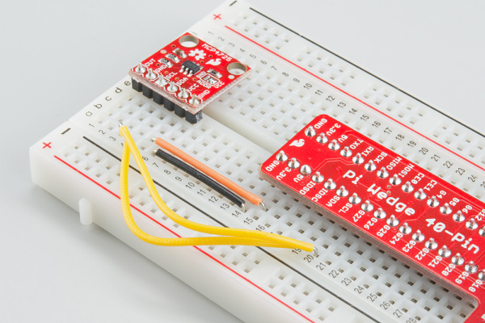

_ブレッドボード上のDAC_

#### C++のサンプルプログラム

次のコードは、DACに連続した値を書き込み、出力ピンにのこぎり波を生成する。

```cpp
/******************************************************************************
i2ctest.cpp
Raspberry Pi I2C interface demo
Byron Jacquot @ SparkFun Electronics
4/2/2014
https://github.com/sparkfun/Pi_Wedge

A brief demonstration of the Raspberry Pi I2C interface, using the SparkFun
Pi Wedge breakout board.

This example makes use of the Wiring Pi library, which streamlines the interface
to the I/O pins on the Raspberry Pi, providing an API similar to Arduino.

Hardware connections (Raspberry Pi -> MCP4725):
GND  -> GND
3.3V -> Vcc
SCL  -> SCL
SDA  -> SDA

An oscilloscope probe was connected to the analog output pin of the MCP4725.
To build: g++ i2ctest.cpp -lwiringPi
******************************************************************************/

#include <iostream>
#include <errno.h>
#include <wiringPiI2C.h>

using namespace std;

int main()
{
   int fd, result;

   // Initialize the interface by giving it an external device ID.
   // The MCP4725 defaults to address 0x60.
   //
   // It returns a standard file descriptor.
   //
   fd = wiringPiI2CSetup(0x60);

   cout << "Init result: "<< fd << endl;

   for(int i = 0; i < 0x0000ffff; i++)
   {
      // Doing a 16 bit register access, which properly handles the
      // endianness, with the length specified by the call. The register
      // address is the concatenation of the command (010x = write DAC
      // output) and power down (x00x = power up) bits.
      result = wiringPiI2CWriteReg16(fd, 0x40, (i & 0xfff) );

      if(result == -1)
      {
         cout << "Error.  Errno is: " << errno << endl;
      }
   }
}
```

wiringPiとリンクしてビルドするには、次のコマンドを使う。

```bash
g++ i2ctest.cpp -l wiringPi -o i2ctest
```

`i2ctest`を実行すると、DACが数秒間、アナログのこぎり波を出力する。

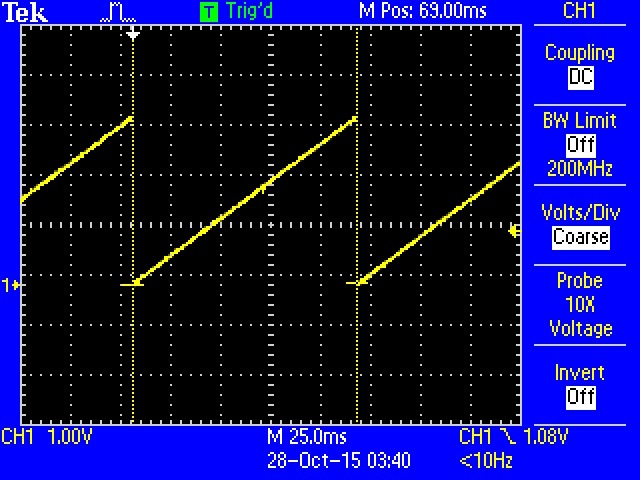

_`OUT`ピンで測定した波形_

#### Pythonのサンプルプログラム

```python
# i2ctest.py
# A brief demonstration of the Raspberry Pi I2C interface, using the Sparkfun
# Pi Wedge breakout board and a SparkFun MCP4725 breakout board

import smbus

# I2C channel 1 is connected to the GPIO pins
channel = 1

# MCP4725 defaults to address 0x60
address = 0x60

# Register addresses (with "normal mode" power-down bits)
reg_write_dac = 0x40

# Initialize I2C (SMBus)
bus = smbus.SMBus(channel)

# Create a sawtooth wave 16 times
for i in range(0x10000):

    # Create our 12-bit number representing relative voltage
    voltage = i & 0xfff

    # Shift everything left by 4 bits and separate bytes
    msg = (voltage & 0xff0) >> 4
    msg = [msg, (msg & 0xf) << 4]

    # Write out I2C command: address, reg_write_dac, msg[0], msg[1]
    bus.write_i2c_block_data(address, reg_write_dac, msg)
```

このプログラムを*i2ctest.py*のような名前で保存し、次のコマンドで実行する。

```bash
python i2ctest.py
```

DACの出力にのこぎり波が現れるはずである。
オシロスコープを接続すれば、C++のサンプルと同様の波形が得られる。
ただし、PythonはC/C++よりもかなり低速である点に注意してほしい。
C++のサンプルでは、のこぎり波の周期がおよそ100msだったのに対し、Pythonのサンプルではおよそ1.8秒になった。

SMBusは、I2Cとは別のプロトコル層でありながら、I2Cの上に構築されているという点に注意してほしい。
I2Cの機能の一部はSMBusでは利用できないことがある。
たとえばSMBusはクロックストレッチングに対応していないため、それを必要とするセンサーは`smbus`パッケージでは動作しない。

`smbus`プロトコルについて詳しくは、公式のカーネルドキュメントを参照してほしい。

## 40ピンPiボードのI2C-0

### 予備のI2Cバス？

B+の改良の一環として、Raspberry Pi Foundationは、拡張ボードへのインターフェースを「Hardware Added On Top」（HAT）仕様として標準化した。
これは拡張ボードの物理的なフォームファクタを標準化するとともに、B+が起動時にHATを自動的に識別・初期化する仕組みを含んでいる。
HAT上のEEPROMから説明情報を読み取るためにI2Cバスを使う点は、BeagleBone Blackにおけるcapeの識別方式に似ている。

この機能はA+とPi 2 Model Bにも引き継がれている。
このI2Cバスは、40ピンコネクタのID_SCピンとID_SDピン（ピン27と28）にある。
ただし、このバスに周辺機器を追加したくなる前に、そのポートの回路図にある注意書きを確認してほしい。

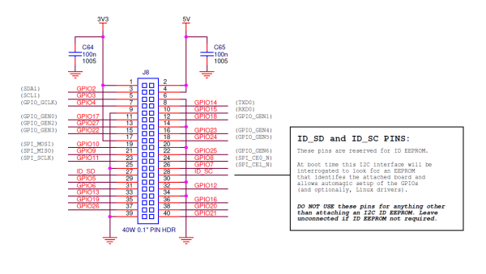

_40ピンGPIOコネクタ（J8）の回路図の抜粋。画像をクリックすると拡大表示できる。_

これについては、HAT設計ガイドでさらに詳しく説明されている。

> Model B+では、GPIO0（ID_SD）とGPIO1（ID_SC）はALT0（I2C-0）モードに切り替わり、EEPROMの有無をプローブする。
> プローブが完了すると、これらのピンは入力に戻る。
>
> ID_ピンに接続してよいのは、IDのEEPROMと3.9kΩのプルアップ抵抗だけである。それ以外のものをこれらのピンに接続してはならない。

このバスは、起動時にアドレス0x50のEEPROMと通信するためだけに存在する。
実行時にユーザーがアクセスしようとすると問題が起きやすい。
B+で汎用のI2Cバスが必要な場合は、40ピンコネクタのピン3と5、Pi Wedge上ではSDAとSCLとラベル付けされているI2C-1を使う必要がある。

### I2C-0の有効化

I2C-0はデフォルトでは無効になっている。
有効化するには、設定ファイルを手動で編集する必要がある。

**/boot/config.txt**を編集し、次の行を追加する。
以前`raspi-config`でI2C-1とSPIを有効化したことがあれば、ファイルの末尾付近に似たような記述が見つかるはずである。

```bash
dtparam=i2c_vc=on
```

これを追加したら、Piを再起動する（`sudo reboot`）。
再起動後、`/dev/i2c-0`というファイルシステムノードが存在すれば、有効化されたことがわかる。

### EEPROM診断ツール

HAT設計ガイドと並んで、HATのEEPROMを扱うためのソフトウェアツール一式を収めたディレクトリが公開されている。
使用するには、これらをダウンロードし、コマンドラインで`make`する。

以下で、その使い方を見ていく。

### I2C-0のテスト

上記の情報をもとに、[24LC256](https://www.sparkfun.com/products/525)というEEPROMチップを用意し、Piに配線した。
アドレスピンはすべてGNDに接続したため、アドレスは**0x50**になり、これは`i2cdetect`で確認できた。

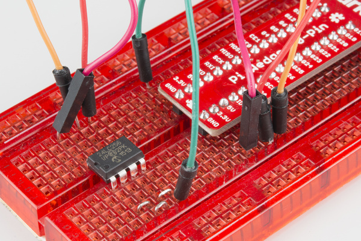

_ブレッドボード上のEEPROM_

前述のEEPROMユーティリティを取得する。
`test_settings.txt`ファイルは、EEPROMファイルの人間が読める形式のサンプルである。
テストのため、このファイルの*vendor*フィールドと*product*フィールドをそれぞれ関連する情報に書き換えた。

このテキストファイル自体は、EEPROMに書き込む前にバイナリ形式に変換する必要がある。
`eepmake`ユーティリティがこの変換を行う。

```bash
./eepmake  test_settings.txt test.eep
```

バイナリ形式の**test.eep**ができたら、`eepflash.sh`スクリプトを使って書き込むことができる。
このスクリプトはいくつかのパラメータを取り、`-h`フラグを付けて実行すれば説明が表示される。
EEPROMへの書き込み時には、プロンプトが表示されたら`yes`と完全な単語で入力して操作を承認する必要がある（単に`y`だけでは受け付けられない）。
`eepflash.sh`は書き込みのステータスを表示する。書き込まれた118バイトは、上で生成した*test.eep*ファイルの長さと一致する。

```bash
sudo sh ./eepflash.sh -w -f=test.eep -t=24c256
This will disable the camera so you will need to REBOOT after this process completes.
This will attempt to write to i2c address 0x50. Make sure there is an eeprom at this address.
This script comes with ABSOLUTELY no warranty. Continue only if you know what you are doing.
Do you wish to continue? (yes/no): yes
Writing...
0+1 records in
0+1 records out
118 bytes (118 B) copied, 2.33811 s, 0.1 kB/s
Done.
```

この出力にあるとおり、ここで再起動する。

システムが起動し直すと、`/proc/device-tree/hat`に新しいファイルシステムノードができているはずである。

```bash
pi@raspberrypi /proc/device-tree/hat $ ls -al
total 0
drwxr-xr-x  2 root root  0 Oct 27 20:16 .
drwxr-xr-x 15 root root  0 Oct 27 20:16 ..
-r--r--r--  1 root root  4 Oct 27 20:16 name
-r--r--r--  1 root root 21 Oct 27 20:16 product
-r--r--r--  1 root root  7 Oct 27 20:16 product_id
-r--r--r--  1 root root  7 Oct 27 20:16 product_ver
-r--r--r--  1 root root 37 Oct 27 20:16 uuid
-r--r--r--  1 root root 24 Oct 27 20:16 vendor
```

これらのノードの中身を確認すると、*test_settings.txt*ファイルに書き込んだ値が反映されていることがわかる。

```bash
pi@raspberrypi/proc/device-tree/hat $ cat vendor
SparkFun Electronics

pi@raspberrypi /proc/device-tree/hat $ cat product
EEPROM Testing
```

## トラブルシューティング

raspi-configの「Advanced Options」からSPI/I2Cを有効化したにもかかわらず、デバイスツリーにデバイスが現れない場合でも、諦める必要はない。
確認すべきファイルが二つある。
raspi-configユーティリティだけでは解決しないことがあり、それはPiのバージョン、Raspbianの入手元、最後にアップデートした時期によって変わってくる。

### /boot/config.txtの確認

raspi-configツールで詳細設定を選択した際に、`/boot/config.txt`が誤って編集されてしまうことがある。
このとき、ファイル内に誤った制御文字が混入する。

```
# NOOBS Auto-generated Settings:
hdmi_force_hotplug=1
config_hdmi_boost=4
overscan_left=24
overscan_right=24
overscan_top=16
overscan_bottom=16
disable_overscan=0^Mdtparam=spi=on
dtparam=i2c_arm=on
```

_raspi-configによる設定後、`/boot/config.txt`に奇妙な`^M`という文字が混入している_

改行を修正し、次のような形になるようにする。

```
# NOOBS Auto-generated Settings:
hdmi_force_hotplug=1
config_hdmi_boost=4
overscan_left=24
overscan_right=24
overscan_top=16
overscan_bottom=16
disable_overscan=0
dtparam=spi=on
dtparam=i2c_arm=on
```

### /etc/modulesの確認

次の行が存在しない場合は、`/etc/modules`の末尾に追加する。

```
spi-dev
i2c-dev
```

### システムの再起動

ファイルを確認したら、`sudo reboot`または`sudo shutdown -r now`で再起動する。

## まとめ・参考資料

このチュートリアルで扱った内容をさらに掘り下げたい場合は、次の資料を参照してほしい。

- I2CとSPIの内部の細かな挙動に興味があるなら、WiringPiのソースコードを読んでみるとよい。[GitHubからクローンできる](https://github.com/WiringPi/WiringPi)。
- これらのインターフェースを支えるLinux側の仕組みについては、[kernel.org](https://www.kernel.org)のドキュメントも参考になる。[SPI](https://www.kernel.org/doc/Documentation/spi/spi-summary)のドキュメントは、[I2C](https://www.kernel.org/doc/Documentation/i2c/dev-interface)のものより充実している。
- ここで紹介したサンプルコードが動かない場合は、40ピンPi WedgeのGitHubリポジトリに更新版がないか確認してほしい。
- RaspbianにおけるI2CとSPIデバイスの有効化方法は、最近のリビジョンで大きく変わっている。アップグレード後にインターフェースが消えてしまった場合の再有効化方法は、関連するフォーラムの投稿で説明されている。
- HAT仕様と関連情報はGitHubで公開されている。HATを設計する場合は、まずHAT Design Guideを読み、B+ addonsフォーラムにも目を通しておくとよい。
- [Filezilla](https://filezilla-project.org/)は、Piとの間でファイルをやり取りするのに便利なFTP・SFTPクライアントである。
- [PuTTY](http://www.putty.org/)は、シリアル、telnet、SSHのモードを備えたターミナルプログラムである。
- [Raspberry PiのGPIO](./raspberry-gpio.md)のチュートリアルでは、Piのデジタル入出力ピンの使い方を説明している。
- [Pi Wedge](https://www.sparkfun.com/products/13717)を使うと、PiのSPIとI2Cインターフェースに手軽にアクセスできる。

Raspberry Piとここで紹介したソフトウェアについて、詳しくは次のサイトを参照してほしい。

- [The Raspberry Pi Foundation](http://raspberrypi.org)
- Pi FoundationのB+ Addonsフォーラム
- Pi FoundationのGitHubリポジトリ（Raspberry Pi B+ HATs）
- eLinux.orgのRaspberry Pi peripheralsガイド
- [WiringPi](https://github.com/WiringPi/WiringPi)
- [spidev](https://pypi.org/project/spidev/)
- [RPi.GPIOモジュール](http://sourceforge.net/projects/raspberry-gpio-python/)
- B+のUSBポートから取得できる電流を増やす方法についてのメモ

Raspberry Piへのハードウェア接続やプロジェクトのヒントについては、次のガイドも参考になる。

- [Building Large LED Installations](https://learn.sparkfun.com/tutorials/building-large-led-installations) — 大規模なLEDインスタレーションの計画から電源要件、実装までを学ぶ
- [Bark Back Interactive Pet Monitor](https://learn.sparkfun.com/tutorials/bark-back-interactive-pet-monitor) — Raspberry Piをベースにした犬の鳴き声検出プロジェクトでペットを監視・やり取りする
- [Raspberry PiのGPIO](./raspberry-gpio.md) — PythonまたはC++でRaspberry PiのI/Oラインを駆動する方法
- [Raspberry Pi Zero Helmet Impact Force Monitor](https://learn.sparkfun.com/tutorials/raspberry-pi-zero-helmet-impact-force-monitor) — ヘルメット、Raspberry Pi Zero、加速度センサーを使った衝撃力モニターの製作
- [Using Flask to Send Data to a Raspberry Pi](https://learn.sparkfun.com/tutorials/using-flask-to-send-data-to-a-raspberry-pi) — PythonのFlaskフレームワークを使い、ESP8266のWiFiノードから内部WiFiネットワーク経由でRaspberry Piにデータを送信する
- [Python Programming Tutorial: Getting Started with the Raspberry Pi](./python-programming-tutorial-getting-started-with-the-raspberry-pi.md) — Pythonでハードウェアを制御するRaspberry Pi向けプログラムの書き方
- [Graph Sensor Data with Python and Matplotlib](https://learn.sparkfun.com/tutorials/graph-sensor-data-with-python-and-matplotlib) — matplotlibを使い、Raspberry Piに接続したTMP102センサーの温度データをリアルタイムにグラフ表示する
- [Python GUI Guide: Introduction to Tkinter](https://learn.sparkfun.com/tutorials/python-gui-guide-introduction-to-tkinter) — Python標準のGUIパッケージTkinterで、ウィンドウアプリケーションやライブグラフ更新付きのフルスクリーンダッシュボードを作る

タグ: 概念、通信、プログラミング、Python、Raspberry Pi、シングルボードコンピュータ

---

出典：[Raspberry Pi SPI and I2C Tutorial](https://learn.sparkfun.com/tutorials/raspberry-pi-spi-and-i2c-tutorial)（SparkFun Learn）を日本語に翻訳し、再構成した。
原文は [CC BY-SA 4.0](https://creativecommons.org/licenses/by-sa/4.0/) ライセンスで公開されており、本ページも同ライセンスの下で提供する。
