# 抵抗器

**抵抗器**は、電子部品の中でもっともありふれた存在である。
ほぼすべての回路に欠かせない部品であり、私たちのお気に入りの式である[オームの法則](./voltage-current-resistance-and-ohms-law.md)にも重要な役割で登場する。

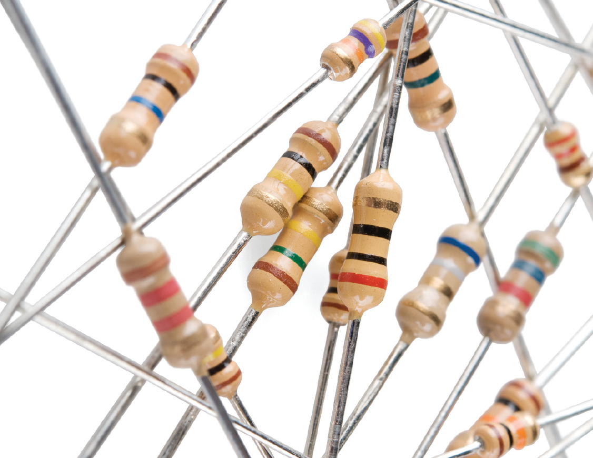

このチュートリアルで扱う内容:

- 抵抗器とは何か
- 抵抗の単位
- 抵抗器の回路図記号
- 抵抗器の直列接続と並列接続
- 抵抗器のさまざまな種類
- カラーコードの読み方
- 表面実装抵抗器の表示の読み方
- 抵抗器の応用例

参考になるチュートリアル:

- [電気とは何か](./what-is-electricity.md)
- [電圧、電流、抵抗とオームの法則](./voltage-current-resistance-and-ohms-law.md)
- [回路とは何か](./what-is-a-circuit.md)
- [直列回路と並列回路](./series-and-parallel-circuits.md)
- [テスターの使い方](./how-to-use-a-multimeter.md) - 特に「抵抗の測定」の節
- [メートル法の接頭辞](./metric-prefixes-and-si-units.md)

## 抵抗器の基礎

**抵抗器**は、決まった、変化することのない[電気抵抗](./voltage-current-resistance-and-ohms-law.md)を持つ電子部品である。
抵抗器が持つ抵抗は、回路の中を流れる電子の流れを**制限する**。

抵抗器は**受動**部品であり、電力を消費するだけで、生み出すことはない。
抵抗器は、オペアンプやマイコン、その他の[集積回路](https://learn.sparkfun.com/tutorials/integrated-circuits)のような**能動**部品を補う形で回路に組み込まれることが多い。
一般的な用途としては、電流の制限、[分圧](https://learn.sparkfun.com/tutorials/voltage-dividers)、I/Oラインの[プルアップ](https://learn.sparkfun.com/tutorials/pull-up-resistors)などが挙げられる。

## 抵抗の単位

抵抗器の電気抵抗は**オーム**という単位で測られる。
オームの記号はギリシャ文字の大文字オメガ「Ω」である。
1Ωの定義は（少し回りくどいが）、1ボルト（1V）の電位差を加えたときに1アンペア（1A）の電流が流れる、2点間の抵抗のことである。

他の[SI単位](https://learn.sparkfun.com/tutorials/metric-prefixes-and-si-units)と同じように、オームの値が大きいときや小さいときは、キロ、メガ、ギガといった接頭辞をつけて読みやすくする。
抵抗器ではキロオーム（kΩ）やメガオーム（MΩ）の範囲がよく使われる（ミリオーム（mΩ）の抵抗器はあまり見かけない）。
たとえば4,700Ωの抵抗器は4.7kΩの抵抗器と同じであり、5,600,000Ωの抵抗器は5,600kΩ、あるいは（より一般的には）5.6MΩと表記される。

## 回路図記号

すべての抵抗器には**2つの端子**があり、抵抗器の両端に1つずつある。
回路図の上では、抵抗器は次の2種類のどちらかの記号で描かれる。

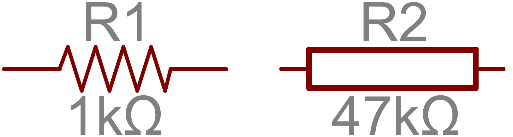

ギザギザの線（あるいは四角形）から伸びている線が、それぞれ抵抗器の端子であり、回路の他の部分へとつながる。

抵抗器の回路記号には、たいてい抵抗値と名前が添えられる。
オームで表される値は、回路を評価するうえでも実際に組み立てるうえでも欠かせない情報である。
抵抗器の名前は、たいてい _R_ に数字を続けたものになる。
1つの回路の中では、それぞれの抵抗器に固有の名前と番号をつける。

## 抵抗器の種類

抵抗器にはさまざまな形やサイズがある。
スルーホール型のものも、表面実装型のものもある。
値が固定された標準的な抵抗器もあれば、複数の抵抗器がまとまったパッケージや、特殊な可変抵抗器もある。

### 端子形状と実装方法

抵抗器の実装方法には、スルーホールと表面実装の2種類がある。
それぞれ、PTH（plated through-hole）、SMDまたはSMT（surface-mount technology/device）と略されることが多い。

**スルーホール**型の抵抗器には長くしなやかなリード線が付いており、[ブレッドボード](./how-to-use-a-breadboard.md)に差し込んだり、プロトタイピングボードや[プリント基板（PCB）](https://learn.sparkfun.com/tutorials/pcb-basics)に手ではんだ付けしたりできる。
ブレッドボードでの試作や、0.6mmほどしかない小さなSMD抵抗器をはんだ付けしたくない場面でよく使われる。
長いリード線はたいてい切りそろえる必要があり、表面実装タイプに比べてスペースを多く取る。

もっとも一般的なスルーホール抵抗器はアキシャル（円筒型）パッケージで、そのサイズは定格電力に比例する。
一般的な½W抵抗器は長さ約9.2mm、より小さな¼W抵抗器は約6.3mmである。

**表面実装**型の抵抗器は、たいてい小さな黒い長方形で、両端に銀色の光沢のある小さな導電性の端子がついている。
これらの抵抗器はPCBの上に置かれ、対応するランド（はんだ付け用のパッド）にはんだ付けされる。
非常に小さいため、[ロボット](https://learn.sparkfun.com/tutorials/electronics-assembly/pick-and-place)によって配置され、オーブンではんだを溶かして固定するのが一般的である。

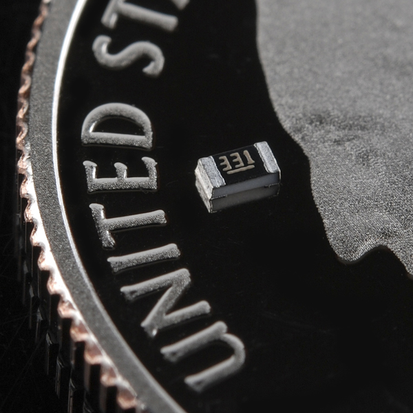

SMD抵抗器は0805（0.08インチ×0.05インチ）、0603、0402といった標準化されたサイズで作られている。
大量生産される基板や、スペースが貴重な設計に向いているが、手ではんだ付けするには安定した精密な手つきが求められる。

### 抵抗体の材質

抵抗器はさまざまな材料で作られる。
現代の一般的な抵抗器のほとんどは、**カーボン、金属、または金属酸化物の薄膜**でできている。
これらの抵抗器では、導電性（それでいて抵抗も持つ）の薄い膜がらせん状に巻きつけられ、絶縁材料で覆われている。
飾り気のない標準的なスルーホール抵抗器の多くは、カーボン皮膜抵抗か金属皮膜抵抗である。

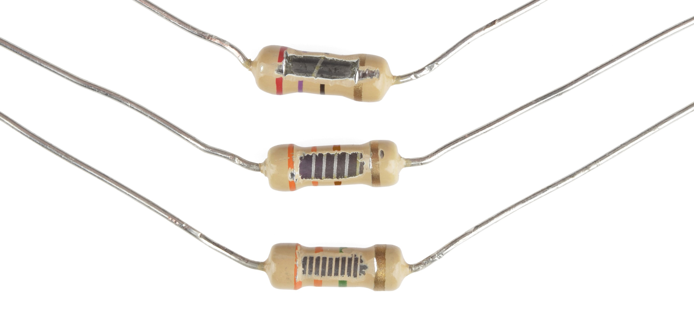

その他のスルーホール抵抗器には、巻線型や、極薄の金属箔で作られたものもある。
これらはたいてい高価で高性能な部品であり、高い定格電力や高い耐熱温度といった特有の性質を目的に選ばれる。

表面実装抵抗器は、たいてい**厚膜型**または**薄膜型**のいずれかである。
厚膜型は安価だが薄膜型ほどの精度はない。
どちらのタイプも、抵抗性の金属合金の薄い膜がセラミックの基板とガラス／エポキシのコーティングのあいだに挟まれ、両端の導電性の端子につながっている。

### 特殊なパッケージ

このほかにも、特殊な用途向けの抵抗器がいろいろある。
5個程度の抵抗器があらかじめ配線された[抵抗アレイ](https://www.sparkfun.com/products/10855)というパッケージもある。
こうしたアレイの中の抵抗器は、共通のピンを共有していたり、分圧回路として構成されていたりする。

### 可変抵抗器（ポテンショメータ）

抵抗器は必ずしも固定値である必要はない。
**レオスタット**と呼ばれる可変抵抗器は、決まった範囲の中で抵抗値を調整できる。
レオスタットとよく似たものに**ポテンショメータ**（ポット）がある。
ポットは内部で2つの抵抗を直列につなぎ、そのあいだの中間タップ（ワイパー）を動かすことで調整可能な[分圧回路](https://learn.sparkfun.com/tutorials/voltage-dividers)を作り出す。
この種の可変抵抗器は、音量つまみのように調整が必要な入力によく使われる。

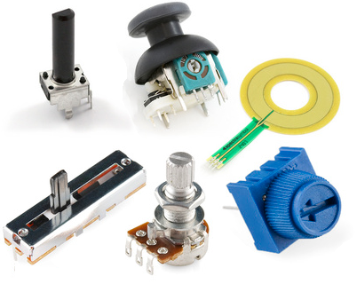

## 抵抗値の表示を読み取る

抵抗器の多くは値を直接表示しているわけではないが、その抵抗値がわかるような表示が施されている。
PTH抵抗器はカラーコード方式（回路に彩りを添えてもくれる）を使い、SMD抵抗器には独自の表示方式がある。

### カラーバンドの読み方

スルーホールのアキシャル抵抗器は、たいていカラーバンド方式で値を表示する。
ほとんどの抵抗器には4本のカラーバンドが巻かれているが、5本や6本のものも見つかる。

#### 4バンドの抵抗器

標準的な4バンド抵抗器では、最初の2本のバンドが抵抗値の**上位2桁**を示す。
3本目のバンドは重みの値であり、最初の2桁に10のべき乗を掛け合わせる**倍率**を表す。

最後のバンドは抵抗器の**誤差**（許容差）を示す。
誤差は、抵抗器の*実際*の抵抗値が、公称値に対してどれだけ前後しうるかを表す。
完璧な抵抗器は存在せず、製造プロセスによって誤差の良し悪しが決まる。
たとえば誤差5%の1kΩ抵抗器は、実際には0.95kΩから1.05kΩのあいだのどこかになりうる。

どのバンドが最初でどれが最後かは、どう見分けるのか。
最後の誤差バンドは、値を示す他のバンドとはっきり離れて配置されていることが多く、たいてい銀色か金色である。

#### 5バンドと6バンドの抵抗器

5バンド抵抗器では、最初の2本のバンドと**倍率バンド**のあいだに、3桁目を示すバンドが追加される。
5バンド抵抗器は、選べる誤差の種類もより幅広い。

6バンド抵抗器は、基本的には5バンド抵抗器の末尾に、温度係数を示すバンドが1本加わったものである。
これは、セ氏温度が変化したときに抵抗値がどれだけ変化するかを示す。
たいてい、この温度係数の値は非常に小さく、ppmのオーダーである。

#### カラーバンドを読み取る

カラーバンドを読み取るときは、下のようなカラーコード表を参照する。
最初の2本のバンドについては、その色に対応する数字を調べる。
たとえばここに示す4.7kΩの抵抗器は、最初のバンドが黄色、次が紫色であり、それぞれ数字の4と7に対応する（47）。
この抵抗器の3本目のバンドは赤色であり、47に10²（つまり100）を掛けることを示している。
47×100は4,700である。

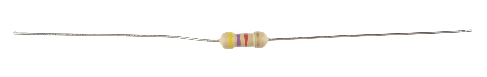

カラーコードを覚えたいなら、語呂合わせが役立つこともある。
覚え方は[いくつも](https://ja.wikipedia.org/wiki/抵抗器#カラーコードの覚え方)知られている（中には品のないものもある）。

もう1つの覚え方として、虹の色の並び「赤橙黄緑青藍紫」から藍（indigo）を抜き、先頭に黒と茶色、末尾に灰色と白を加える、という方法もある。

#### 抵抗器のカラーコード表

| 色  | 値（上位2桁） | 倍率（3桁目）  | 誤差（4桁目） |
| --- | ------------- | -------------- | ------------- |
| 黒  | 0             | ×1             |               |
| 茶  | 1             | ×10            |               |
| 赤  | 2             | ×100           |               |
| 橙  | 3             | ×1,000         |               |
| 黄  | 4             | ×10,000        |               |
| 緑  | 5             | ×100,000       |               |
| 青  | 6             | ×1,000,000     |               |
| 紫  | 7             | ×10,000,000    |               |
| 灰  | 8             | ×100,000,000   |               |
| 白  | 9             | ×1,000,000,000 |               |
| 金  |               |                | ±5%           |
| 銀  |               |                | ±10%          |

たとえば「黄、紫、赤、金」の4バンドなら、47×100 = 4,700Ω、誤差±5%となり、1kΩ±5%の抵抗器であれば「茶、黒、赤、金」のように読み取れる。

### 表面実装抵抗器の表示を読み取る

0603や0805パッケージのようなSMD抵抗器は、値の表示方法が異なる。
よく見られる表示方式がいくつかあり、たいてい部品の上面に3〜4文字（数字またはアルファベット）が印刷されている。

見えている3文字が*すべて数字*であれば、それはおそらく**E24**方式の表示である。
この表示方法は、PTH抵抗器のカラーバンド方式とよく似た考え方に基づいている。
最初の2つの数字が値の上位2桁を、最後の数字が倍率を表す。

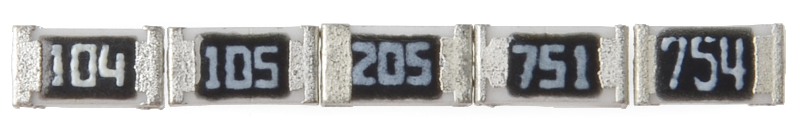

上の写真の例では、抵抗器に*104*、_105_、_205_、_751_、*754*という表示がある。
*104*と表示された抵抗器は100kΩ（10×10⁴）、*105*は1MΩ（10×10⁵）、*205*は2MΩ（20×10⁵）である。
*751*は750Ω（75×10¹）、*754*は750kΩ（75×10⁴）である。

もう1つよく使われる表示方式が**E96**であり、この中ではもっとも読み解きにくい。
E96方式の抵抗器には3文字が表示され、最初の2つが数字、最後の1つがアルファベットになっている。
最初の2つの数字は、下の対応表を使って値の上位*3桁*を示す。

| コード | 値  | コード | 値  | コード | 値  | コード | 値  | コード | 値  | コード | 値  |
| ------ | --- | ------ | --- | ------ | --- | ------ | --- | ------ | --- | ------ | --- |
| 01     | 100 | 17     | 147 | 33     | 215 | 49     | 316 | 65     | 464 | 81     | 681 |
| 02     | 102 | 18     | 150 | 34     | 221 | 50     | 324 | 66     | 475 | 82     | 698 |
| 03     | 105 | 19     | 154 | 35     | 226 | 51     | 332 | 67     | 487 | 83     | 715 |
| 04     | 107 | 20     | 158 | 36     | 232 | 52     | 340 | 68     | 499 | 84     | 732 |
| 05     | 110 | 21     | 162 | 37     | 237 | 53     | 348 | 69     | 511 | 85     | 750 |
| 06     | 113 | 22     | 165 | 38     | 243 | 54     | 357 | 70     | 523 | 86     | 768 |
| 07     | 115 | 23     | 169 | 39     | 249 | 55     | 365 | 71     | 536 | 87     | 787 |
| 08     | 118 | 24     | 174 | 40     | 255 | 56     | 374 | 72     | 549 | 88     | 806 |
| 09     | 121 | 25     | 178 | 41     | 261 | 57     | 383 | 73     | 562 | 89     | 825 |
| 10     | 124 | 26     | 182 | 42     | 267 | 58     | 392 | 74     | 576 | 90     | 845 |
| 11     | 127 | 27     | 187 | 43     | 274 | 59     | 402 | 75     | 590 | 91     | 866 |
| 12     | 130 | 28     | 191 | 44     | 280 | 60     | 412 | 76     | 604 | 92     | 887 |
| 13     | 133 | 29     | 196 | 45     | 287 | 61     | 422 | 77     | 619 | 93     | 909 |
| 14     | 137 | 30     | 200 | 46     | 294 | 62     | 432 | 78     | 634 | 94     | 931 |
| 15     | 140 | 31     | 205 | 47     | 301 | 63     | 442 | 79     | 649 | 95     | 953 |
| 16     | 143 | 32     | 210 | 48     | 309 | 64     | 453 | 80     | 665 | 96     | 976 |

末尾のアルファベットは倍率を表し、次の表と対応する。

| 文字       | 倍率  | 文字       | 倍率 | 文字 | 倍率   |
| ---------- | ----- | ---------- | ---- | ---- | ------ |
| Z          | 0.001 | A          | 1    | D    | 1000   |
| Y または R | 0.01  | B または H | 10   | E    | 10000  |
| X または S | 0.1   | C          | 100  | F    | 100000 |

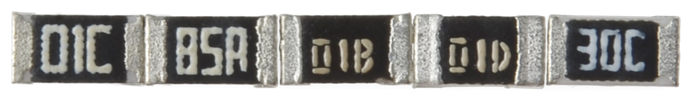

たとえば*01C*という表示は、おなじみの10kΩ（100×100）であり、*01B*は1kΩ（100×10）、*01D*は100kΩになる。
ここまでは簡単だが、他のコードはそう単純にいかないこともある。
先ほどの写真にある*85A*は750Ω（750×1）、*30C*は実は20kΩである。

## 定格電力

抵抗器の**定格電力**は、あまり目立たない値の1つだが、抵抗器の種類を選ぶときには重要になる話題である。

[電力](./voltage-current-resistance-and-ohms-law.md)とは、エネルギーが別の形に変換される速さのことであり、2点間の電位差にそのあいだを流れる電流を掛け合わせて計算され、単位はワット（W）である。
たとえば電球は電気を光に変換する。
しかし抵抗器は、流れ込んだ電気エネルギーを**熱**に変換することしかできない。
熱は電子部品にとってあまり良い遊び相手ではなく、熱がこもりすぎると煙や火花、火災につながる。

すべての抵抗器には、決まった最大定格電力がある。
抵抗器が熱くなりすぎないようにするには、抵抗器にかかる電力を最大定格未満に保つことが重要である。
定格電力はワットで測られ、たいてい⅛W（0.125W）から1Wの範囲に収まる。
1Wを超える定格電力を持つ抵抗器は、パワー抵抗器と呼ばれ、電力を消費する能力そのものを目的として使われる。

### 定格電力の見分け方

抵抗器の定格電力は、たいていパッケージの大きさから見分けられる。
標準的なスルーホール抵抗器は¼Wか½Wの定格であることが多い。
より特殊な用途向けのパワー抵抗器では、定格電力が抵抗器自体に表示されていることもある。

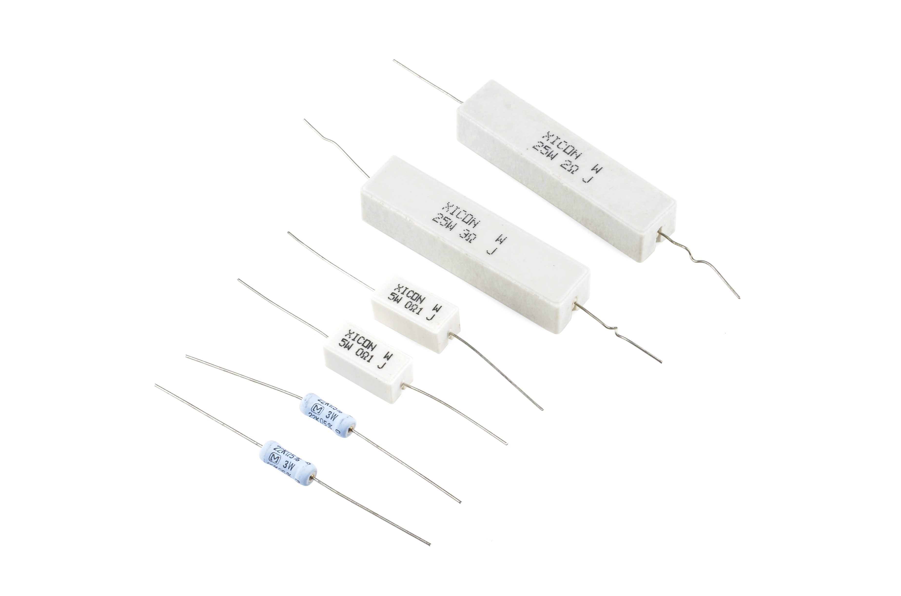

表面実装抵抗器の定格電力も、サイズからある程度判断できる。
0402サイズと0603サイズはたいてい1/16W定格、0805サイズは1/10Wに対応する。

### 抵抗器にかかる電力を計算する

電力はたいてい電圧と電流の積（P = IV）として計算されるが、オームの法則を使えば抵抗値からも電力を計算できる。
抵抗器を流れる電流がわかっているなら、電力は次のように計算できる。

\\[ P = I^2 \times R \\]

あるいは、抵抗器にかかる電圧がわかっているなら、電力は次のように計算できる。

\\[ P = \frac{V^2}{R} \\]

## 抵抗の直列接続と並列接続

電子工作では、抵抗器を[直列や並列](./series-and-parallel-circuits.md)の回路にまとめて使うことがよくある。
抵抗器を直列や並列に組み合わせると**合成抵抗**が生まれ、それは2つの式のどちらかで計算できる。
抵抗値の組み合わせ方を知っておくと、特定の抵抗値を作り出したいときに役立つ。

### 直列抵抗

抵抗器を直列につないだ場合、抵抗値は単純に足し合わされる。

\\[ R_{合成} = R_1 + R_2 + \cdots + R_N \\]

*N*個の抵抗器を直列につないだ場合、合成抵抗はすべての抵抗値の総和になる。

たとえば、どうしても12.33kΩの抵抗器が必要だとする。
そんなときは、より入手しやすい12kΩと330Ωの抵抗器を見つけて、直列につなげばよい。

### 並列抵抗

並列につないだ抵抗器の合成抵抗を求めるのは、直列ほど簡単ではない。
*N*個の抵抗器を並列につないだときの合成抵抗は、それぞれの抵抗の逆数の和の、さらに逆数になる。
言葉で説明するより、式を見たほうがわかりやすいだろう。

\\[ \frac{1}{R_{合成}} = \frac{1}{R_1} + \frac{1}{R_2} + \cdots + \frac{1}{R_N} \\]

（抵抗の逆数は実は**コンダクタンス**と呼ばれており、より簡潔に言えば、並列につないだ抵抗器のコンダクタンスは、それぞれのコンダクタンスの総和になる。）

この式の特別な場合として、抵抗器が**2本だけ**の場合は、逆数の入れ子が少ない次の式で合成抵抗を求められる。

\\[ R_{合成} = \frac{R_1 \times R_2}{R_1 + R_2} \\]

さらに特別な場合として、**同じ値**の抵抗器2本を並列につないだ場合、合成抵抗はその値のちょうど半分になる。
たとえば10kΩの抵抗器2本を並列につなぐと、合成抵抗は5kΩになる。

2つの抵抗器が並列であることを示す省略記法として、並列演算子 `‖` が使われる。
たとえばR1とR2が並列であれば、概念上はR1‖R2と書ける。
分数だらけの式を書かずに済み、すっきりする。

### 抵抗ネットワーク

合成抵抗の計算に慣れてもらうための定番として、電子工学の先生たちは、入り組んだ抵抗ネットワークの合成抵抗を求めさせるのが大好きである。

穏やかな問題の例としては、「この回路の端子*A*から*B*までの抵抗はいくつか」というものがある。

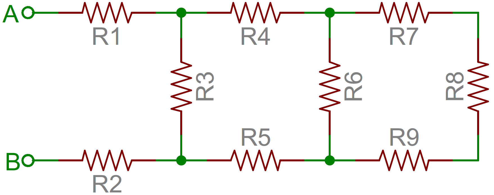

この手の問題を解くには、回路の一番奥から手をつけ、端子に向かって少しずつ単純化していく。
この例では、R7、R8、R9がすべて直列につながっているので、まとめて足し合わせられる。
この3本はR6と並列になっているので、これら4本の抵抗はR6‖(R7+R8+R9)という1本の抵抗にまとめられる。
すると回路はこうなる。

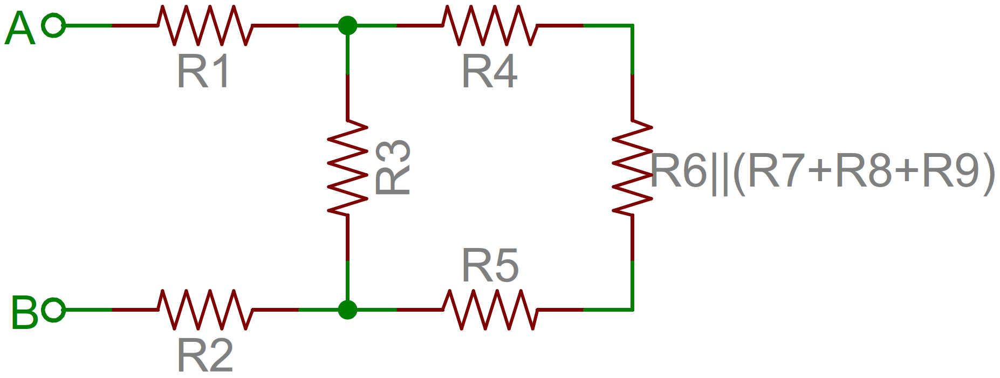

今度は、右側の4本の抵抗をさらに単純化できる。
R4、R5、そして先ほどまとめたR6〜R9の合成抵抗は、すべて直列につながっているので足し合わせられる。
そうしてできた直列部分は、R3と並列になっている。

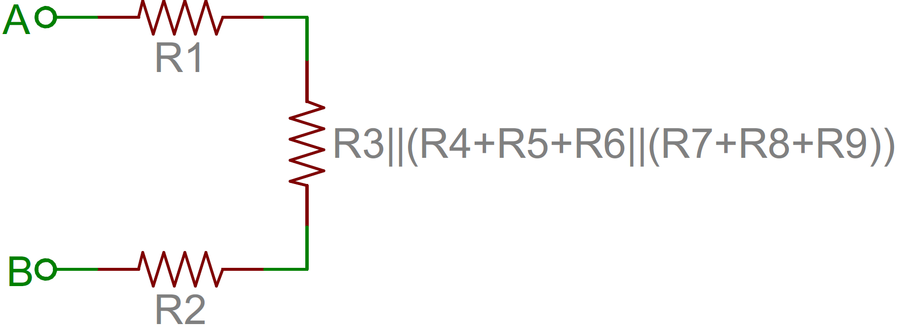

こうして、*A*端子と*B*端子のあいだに残るのは3本の直列抵抗だけになる。
あとは足し合わせるだけである。
つまり、この回路全体の合成抵抗は R1+R2+R3‖(R4+R5+R6‖(R7+R8+R9)) となる。

## 応用例

抵抗器は、これまでに作られたほぼすべての電子回路に登場する。
ここでは、抵抗器に大きく依存しているいくつかの回路の例を紹介する。

### LEDの電流制限

[LED](https://learn.sparkfun.com/tutorials/light-emitting-diodes-leds)に電力を加えたときに壊れてしまわないようにするうえで、抵抗器は鍵となる部品である。
LEDに**直列**に抵抗器をつなぐことで、両方の部品を流れる電流を安全な値に制限できる。

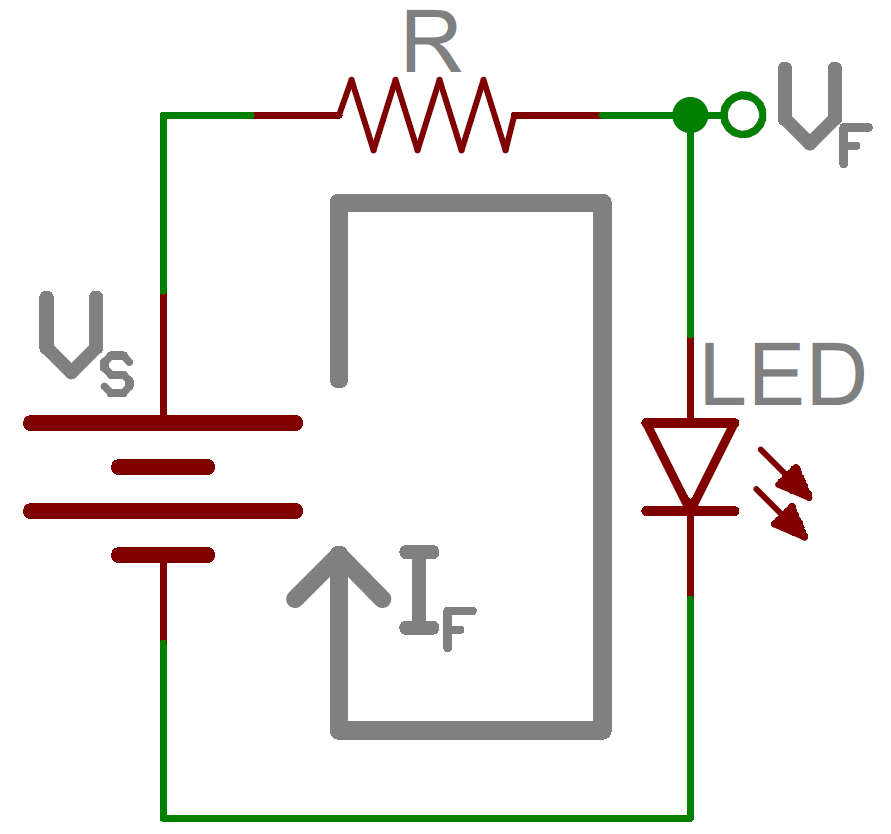

電流制限抵抗の値を決めるときは、LEDの2つの特性値、**標準順方向電圧**と**最大順方向電流**を確認する。
標準順方向電圧は、LEDを点灯させるのに必要な電圧であり、LEDの色によって（たいてい1.7Vから3.4Vの範囲で）異なる。
最大順方向電流は、基本的なLEDではたいてい20mA程度であり、LEDに流し続ける電流は常にこの定格以下に保つ必要がある。

この2つの値がわかれば、次の式で電流制限抵抗の値を決められる。

\\[ R = \frac{V_S - V_F}{I_F} \\]

_VS_ は電源電圧（電池や電源の電圧）であり、_VF_ と _IF_ は、それぞれLEDの順方向電圧と流したい電流である。

たとえば、9Vの電池でLEDを点灯させるとする。
赤色LEDであれば、順方向電圧はおよそ1.8V程度になる。
電流を10mAに制限したいなら、およそ720Ωの抵抗器を直列に入れればよい。

## 分圧回路

[分圧回路](https://learn.sparkfun.com/tutorials/voltage-dividers)は、大きな電圧を小さな電圧に変換する抵抗器の回路である。
2本の抵抗器を直列につなぐだけで、入力電圧のある割合の出力電圧を作り出せる。

R1とR2という2つの抵抗器を直列につなぎ、その両端に電源電圧（Vin）を接続する。
VoutからGNDまでの電圧は、次の式で計算できる。

\\[ V_{out} = V_{in} \times \frac{R_2}{R_1 + R_2} \\]

たとえばR1が1.7kΩ、R2が3.3kΩであれば、5Vの入力電圧をVout端子で3.3Vに変換できる。

分圧回路は、[フォトセル](https://www.sparkfun.com/products/9088)や[フレックスセンサー](https://www.sparkfun.com/products/8606)、[感圧抵抗（FSR）](https://www.sparkfun.com/products/9375)のような抵抗性のセンサーを読み取るのに非常に便利である。
分圧回路の一方をセンサーに、もう一方を固定の抵抗器にする。
2つの部品のあいだの出力電圧を、マイコン（MCU）の[アナログ-デジタル変換器](./analog-to-digital-conversion.md)に接続して、センサーの値を読み取る。

## プルアップ抵抗

[プルアップ抵抗](https://learn.sparkfun.com/tutorials/pull-up-resistors)は、マイコンの入力ピンを既知の状態にバイアスしたいときに使われる。
抵抗器の一方の端はMCUのピンに、もう一方の端は高い電圧（たいてい5Vか3.3V）につながる。

プルアップ抵抗がないと、MCUの入力は*フローティング*状態のままになりうる。
フローティング状態のピンがハイ（5V）なのかロー（0V）なのかは、保証されない。

プルアップ抵抗は、ボタンやスイッチの入力を扱うときによく使われる。
スイッチが開いているときは、プルアップ抵抗が入力ピンをバイアスする。
そしてスイッチが閉じたときには、ショートから回路を守る役割も果たす。

上の回路では、スイッチが開いているとき、MCUの入力ピンは抵抗器を通して5Vにつながっている。
スイッチが閉じると、入力ピンは直接GNDにつながる。

プルアップ抵抗の値は、特に厳密に決める必要はない。
ただし、5V程度の電圧をかけたときに電力を無駄に消費しすぎない程度には高い値にしておくべきである。
たいてい10kΩ程度の値がよく使われる。

## まとめ

抵抗器についての基礎が身についたところで、電子工作の他の基礎的な部品にも目を向けてみよう。
抵抗器だけがすべてではない。

- [コンデンサ](./capacitors.md)
- [ダイオード](./diodes.md)
- [トランジスタ](./transistors.md)
- [集積回路、IC](./integrated-circuits.md)

抵抗器の応用をさらに知りたいなら、次のチュートリアルもおすすめである。

- [分圧回路](./voltage-dividers.md)
- [プルアップ抵抗](./pull-up-resistors.md)

タグ: 部品、電気工学、技術

---

出典：[Resistors](https://learn.sparkfun.com/tutorials/resistors)（SparkFun Learn）を日本語に翻訳し、再構成した。
原文は [CC BY-SA 4.0](https://creativecommons.org/licenses/by-sa/4.0/) ライセンスで公開されており、本ページも同ライセンスの下で提供する。
