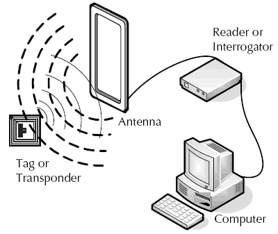
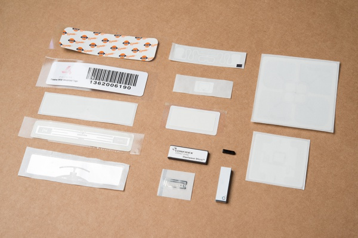
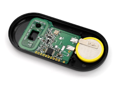

# RFID基礎

## はじめに

数か月前、近所の図書館でキオスク端末に本を置くだけで、5冊すべての貸し出し手続きができたことがある。
同じ頃、父は5万人以上が参加する[Bolder Boulder](http://www.bolderboulder.com/)というロードレースに出場した。
このレースでは、電子システムがランナーに紙のゼッケンを着けさせるだけで、父を含む数千人のタイムを記録していた。
迷子になったペットも、首元をスキャンするだけで身元を特定し、飼い主のもとへ返すことができる。
これらは、いったいどのようにして実現しているのだろうか。

その答えが[RFID](https://www.sparkfun.com/rfid)（**R**adio **F**requency **ID**entification、無線周波数識別）である。
このチュートリアルでは、RFIDがどのように機能するかという基礎を扱い、RFIDを使い始めるための手引きとする。

参考になるチュートリアル:

以下の概念に馴染みがなければ、続きを読む前にこれらのチュートリアルを確認しておくことをおすすめする。RFIDの基本的な理解に役立つはずである。

- [2進数](./binary.md)
- [電池とは何か](./what-is-a-battery.md)
- [電力](./electric-power.md)

## 基礎知識

### 基本的な仕組み

リーダーモジュールの中に、X線の目を持ったごく小さいハムスターが入っている、と考えたくなるかもしれないが、実際の仕組みはもう少し単純である。

RFIDは、**リーダー**が発する電波を使って、RFID**タグ**の存在を検出し、そこに記録されたデータを読み取る。
タグはカードや[ボタン型のケース](https://www.sparkfun.com/products/9417)、[小さなカプセル](https://www.sparkfun.com/products/9416)のような小型の物体に埋め込まれている。

画像提供：[EPC RFID](http://www.epc-rfid.info/rfid)

一部のシステムでは、これらのリーダーが電波を使ってタグに新しい情報を書き込むこともできる。

## RFIDシステムの種類

RFIDシステムには、パッシブ（受動型）とアクティブ（能動型）の2種類がある。
どちらの方式かは、タグの電源のとり方によって決まる。

### パッシブ

パッシブ型のRFIDシステムでは、タグは電池を使わない。
その代わり、動作に必要なエネルギーをリーダーから受け取る。
リーダーは数フィート程度の範囲にエネルギー場を発生させ、その範囲内にあるタグすべてにエネルギーを供給する。
タグはカードリーダーから電磁エネルギーを集めて起動し、「こんにちは」と自分の識別情報を返す。

パッシブタグには、高速（1秒間に10回以上）で読み取れるという利点がある。
非常に薄いため紙の層の間に挟むこともでき、非常に安価である（1万個以上の単位で1個0.05ドル未満）。

一般に、タグが小さいほど読み取り可能な距離は短くなる。

### アクティブ

アクティブ型のRFIDシステムでは、タグが読み取り距離を伸ばすための独自の電源を内蔵している。
アクティブタグは電池を持ち、たいていより大きなSMD部品を搭載している。
あらかじめ決められた時間が経過するたびに、タグは電波の「チャープ（短い信号）」を発する。
近くにあるリーダーは、このチャープを受信できる。
アクティブタグは、パッシブタグよりもはるかに長い距離（数十フィート）で読み取ることができる。

アクティブタグの欠点としては、電池を内蔵する分だけ大きくなること、電池が切れるとタグ自体が使えなくなるため寿命が限られること、タグ1個あたりのコストが高くなること、レポートの頻度がまちまちになることが挙げられる。

[RF Code](http://www.rfcode.com/)社のm130アクティブRFID資産管理タグ。

## RFIDの周波数帯

アクティブ・パッシブの区別に加えて、RFIDシステムは周波数帯によっても分類できる。

周波数帯やシステムによって、一度に1個のタグしか読み取れないものと、複数のタグを同時に読み取れるものがある。
リーダーの価格も、モジュールの周波数によって大きく変わる。
以前は、複数タグを同時に読み取れるリーダーは数千ドル、時には数万ドルもした。
このようなシステムは、ほとんどのホビイストや試作者にとって手の届かないものだった。
しかし状況はようやく変わりつつあり、複数タグ同時読み取り対応のリーダーはずっと手頃な価格になってきている。

次の表に、周波数帯とそれぞれの特性の概要をまとめる。

| 周波数帯                        | 別名                                                                        | 到達距離                  | 読み書き     | 複数タグの同時読み取り | タグの平均価格 |
| ------------------------------- | --------------------------------------------------------------------------- | ------------------------- | ------------ | ---------------------- | -------------- |
| 低周波（120〜150kHz）           | 「チップ／マイクロチップ」（動物用）、近接カード、HIDカード（いずれも商標） | 最大20cm（1フィート未満） | 読み取り専用 | 不可                   | 0.50ドル       |
| 高周波（13.56MHz）              | MiFare、NFC                                                                 | 最大1メートル             | 読み書き可能 | 不可                   | 1ドル          |
| 極超短波（433MHz、860〜920MHz） | 長距離RFID、給電式RFID                                                      | 最大100メートル           | 読み書き可能 | 可能                   | 0.05ドル       |

出典：[Wikipedia: Radio-frequency identification](https://ja.wikipedia.org/wiki/RFID)

## タグのメモリ

RFIDタグはメモリに多くのデータを保存でき、これがRFIDの大きな利点の一つになっている。
タグに保存される識別情報の種類は業界によってさまざまで、その詳細はこのチュートリアルの範囲を超える。
タグの記憶容量に関するより詳しい情報は、[Tag Data Standard](http://www.gs1.org/epc/tag-data-standard)や[Tag Data Translation Standard](http://www.gs1.org/epc/tag-data-translation-standard)を参照してほしい。

> [!NOTE]
> 一部のRFIDタグ（広く使われている「HID ProxCard II」ブランドのIDカードや、一部のペット用タグなど）は独自形式を採用している。学生証や商用の入退室管理システムのカードは、すべてのRFIDリーダーで読み取れるとは限らない。

### Gen2 UHF RFIDのメモリ規格

EPCglobalが策定した[v2.0.1規格](https://cdn.sparkfun.com/assets/learn_tutorials/6/1/3/Gen2_Protocol_Standard.pdf)は、Gen2 RFIDタグに関するあらゆる要件を定めている。
おおまかに言えば、タグのメモリはTID、EPC、ユーザーメモリの3つに分かれている。

#### タグ識別子メモリ（TID）

TID（Tag Identifier）は20バイト、つまり160ビットである。
これは、1,460,000,000,000,000,000,000,000,000,000,000,000,000,000,000,000通り（1.46×1048）ものタグIDが存在しうることを意味する。
人体を構成する原子の数よりも多い。さすがに[宇宙全体の原子の数](https://ja.wikipedia.org/wiki/%E8%A6%B3%E6%B8%AC%E5%8F%AF%E8%83%BD%E3%81%AA%E5%AE%87%E5%AE%99#%E5%86%85%E5%AE%B9%E7%89%A9%E8%B3%AA)には及ばないが。
すべてのRFIDタグは固有のTIDを持ち、TIDを書き換えることはできない。

#### Electronic Product Codeメモリ（EPC）

TIDは絶対的な識別には適しているが、Gen2 RFID規格は本来、多くの小売現場でバーコードを置き換えるために作られたものである。
食料品を買うとき、レジはそのタグのTIDが0xE242F3であるかどうかは気にしない。牛乳1ガロンなのか、ピーナッツバター1瓶なのかを気にする。
そこで登場するのがEPC（Electronic Product Code）である。
たいてい12バイトで、ユーザーが書き換えられ、UPC（バーコード）の代替として書き込むことを想定している。
牛乳のボトルにRFIDタグを貼り、EPCを`0 7874203641 0`と設定すれば、レジはそれを「Great Value社製の低脂肪・無乳糖牛乳 ハーフガロン」として識別する（[出典例](http://www.health.state.mn.us/wic/vendor/fpchng/upc/download/milkpdf.cfm)）。
タグ自体はその12バイトに何を書き込んでもかまわないので、ASCIIで`RufusTheDog`と書き込んでも構わないが、12バイト以内に収める必要がある。

#### ユーザーメモリ

ユーザーメモリの容量は0バイトから64バイトまで幅がある。
安価なタグほど、ユーザーメモリのバイト数は少ない傾向にある。
64バイトで何ができるだろうか。
先ほどの牛乳の例で言えば、ユーザーメモリは本来、賞味期限のような情報を記録することを想定していた。
EPCが「これは牛乳である」というグローバルな識別子であるのに対し、ユーザーメモリはその1本固有の情報（「8月15日までに販売」など）を記録する場所である。
ここでも、タグ自体は何を書き込むかを気にしないので、ユーザー設定（「このユーザーはパイロットシートを10度傾けるのを好む」など）を記録したり、世界最小の[デッドドロップ](https://ja.wikipedia.org/wiki/%E3%83%87%E3%83%83%E3%83%89%E3%83%BB%E3%83%89%E3%83%AD%E3%83%83%E3%83%97)として使ったりすることもできる。

#### パスワード

このほかにも、Accessパスワード、Killパスワードと呼ばれる書き込み可能なメモリ領域がある。
Accessパスワードは、タグの設定を無断で変更されるのを防ぐために使える（「見た目はサーロインステーキだが、レジではガムのパックと表示される」といった不正を防ぐ）。
Killパスワードは、タグを永久かつ不可逆的に無効化するために使う。

## トラブルシューティング

RFIDシステムを動作させる筐体や環境によっては、リーダーがタグのデータを正しく読み書きできない問題に遭遇することがある。
システムの動作を改善するために覚えておくとよいポイントを、いくつか紹介する。

- **電波干渉を避ける**：システムの近くに他の電波を発する機器があると、特に同じ周波数帯を使っている場合、RFIDシステムの性能に悪影響を及ぼすことがある。複数のRFIDリーダーを近くに置くと、システム同士が干渉し合うこともある。
- **クリーンな電源を使う**：他の多くの電子システムと同様、ノイズの多い電源や汚れた電源はRFIDシステムに異常な動作を引き起こすことがある。クリーンで安定化された電源の使用をおすすめする。
- **見通しを確保する**：リーダーとタグの間を遮る物がない、見通しの良い状態での読み取りは、結果を改善できる。
- **外部アンテナを使う**：どのシステムでも読み取り距離を伸ばせる。基板上のアンテナは出力と到達距離に限りがある。
- **タグを手で持たない（UHFシステムの場合）**：人間の体は基本的に水の袋のようなものである。タグを手に持つと読み取り距離が大きく低下する。金属や水分を含まない物にタグをテープで貼り付けるとよい。
- **タグの種類を変えてみる**：一般に、タグが小さいほど読み取り距離は短くなる。ガラスカプセル型を使っているならボタン型を、ボタン型を使っているならカード型を試してみるとよい。

## まとめ

RFIDの概念がわかったところで、次は自分のプロジェクトに組み込んでみる番である。

RFIDについてさらに詳しい情報は、次のリンクも参考にしてほしい（いずれも英語）。

- [GS1's Electronic Product Codes/RFID Standards](http://www.gs1.org/epc-rfid)
- [ThingMagic RFID](http://www.thingmagic.com/rfid-basics)
- [IdentiSource Card Identifier Guide](http://www.identisource.net/format_and_facility_codes_expl.cfm)
- [python RFID library and examples](https://github.com/AdamLaurie/RFIDIOt)

タグ: 概念、RFID、無線

---

出典：[RFID Basics](https://learn.sparkfun.com/tutorials/rfid-basics)（SparkFun Learn）を日本語に翻訳し、再構成した。
原文は [CC BY-SA 4.0](https://creativecommons.org/licenses/by-sa/4.0/) ライセンスで公開されており、本ページも同ライセンスの下で提供する。
