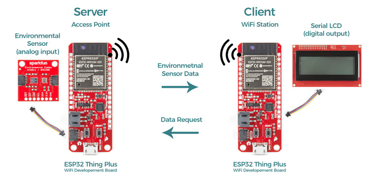
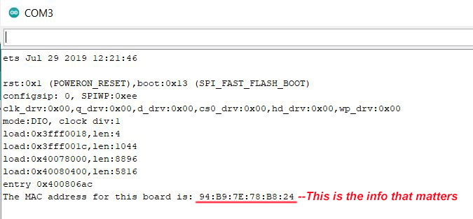
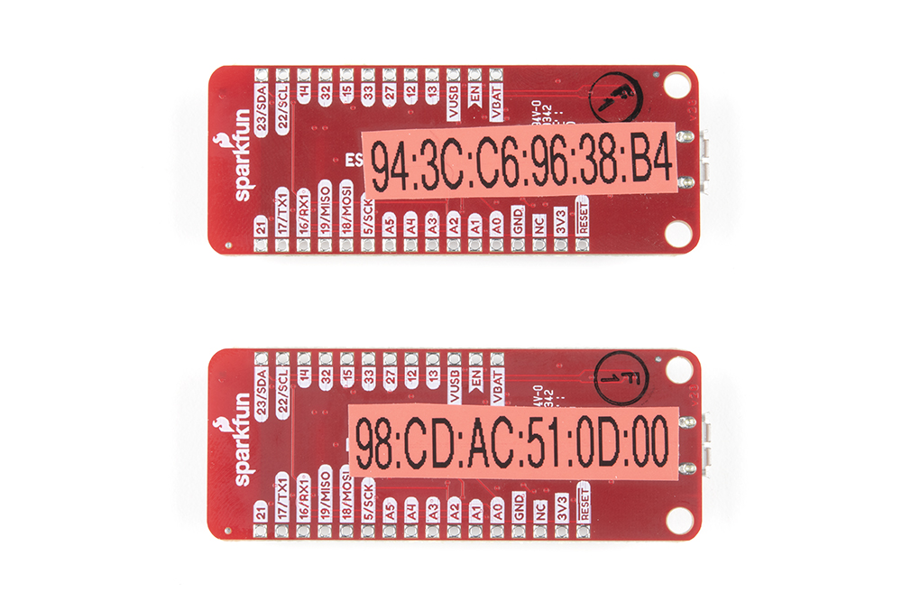
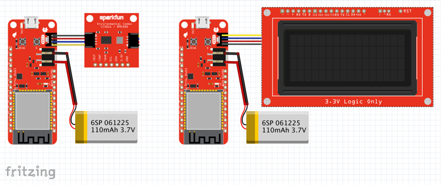
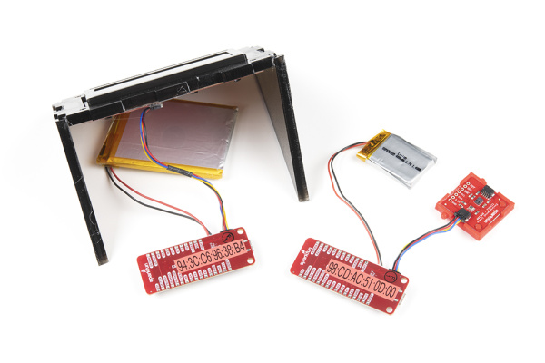
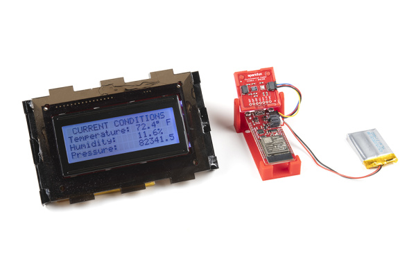

# WiFi経由でセンサーデータを送信する

## はじめに

[WiFi](https://www.sparkfun.com/wifi)は誰にとっても馴染み深いものである。
家庭のネットワークを支え、お気に入りの映画をストリーミングさせてくれ、コーヒーショップで他人と話さずに済むようにもしてくれる。
しかし、WiFiの使い道は、さまざまなアプリケーションを通じてインターネットにアクセスするだけにとどまらない。
このチュートリアルでは、独自のピアツーピアネットワークを構築し、ある場所でセンサーからデータを取得して、インターネット接続もルーターも使わずに、別の場所にあるLCD画面へそのデータを送る方法を紹介する。
これは、組み込みの物理コンピューティングの応用先から配線をなくしていくための、素晴らしい第一歩になる。



## プロジェクトの概要：温度・湿度・気圧をワイヤレスで監視する

このプロジェクトでは、環境センサーからデータを読み取り、別の場所にあるディスプレイへ送信する、単純なポイントツーポイントの閉じたWiFiシステムを作る。
はんだ付けなしでハードウェアを接続できる[Qwiic Connectシステム](http://www.example.com)を利用し、できるだけ単純な構成にする。
使用するハードウェアは、[ESP32 Thing Plus Wroom](https://www.sparkfun.com/products/15663)モジュール2台、[Qwiic Environmental Combo Breakout](https://www.sparkfun.com/products/14348)、[SparkFun Qwiic Single Relay](https://www.sparkfun.com/products/15093)、[Qwiicケーブル](https://www.sparkfun.com/products/15081)数本である（もちろん、それぞれに電池やACアダプタなどの電源も必要になる）。

## ステップ1：MACアドレスを確認する

WiFi経由でデバイスと通信するには、そのデバイスのMedia Access Control Address、いわゆるMACアドレスを知っておく必要がある。
各デバイスのMACアドレスを調べる、短くて簡単なArduinoスケッチを紹介する。I2Cスニファーの隣にある、便利なArduinoユーティリティスケッチ集の引き出しにしまっておくとよいだろう。

```cpp
/*
 * MAC Address Finder
 * WiFi対応の各基板でこれを実行すると、
 * MACアドレスを取得できる。これを
 * コードに書き込んでおけば、電源投入時や
 * 再起動後に、手動での操作なしで
 * 各部品を接続できるようになる。
 *
 * コードを書き込んだら、シリアルモニタを開き、
 * 基板のリセットボタンを押して、
 * MACアドレスを書き留めておこう。
 * （筆者はラベルライターで、各基板の裏面に
 * MACアドレスを貼り付けている。）
 */

#include "WiFi.h"

void setup(){
  Serial.begin(115200);

}

void loop(){
  WiFi.mode(WIFI_STA);
  Serial.print("The MAC address for this board is: ");
  Serial.println(WiFi.macAddress());
  while(1){     // ループをここで止め、情報が
    }           // 何度も表示されないようにする
}
```



*コードを書き込んだら、シリアルモニタを開き、基板をリセットして、MACアドレスを書き留めておく。*

> [!NOTE]
> 著者からのヒント：WiFi基板を扱い始めたばかりの頃、MACアドレスを調べて付箋に書き、それぞれの基板に貼り付けていた。もちろんその後、それらをまとめてバッグに放り込み、自宅の作業スペースからSparkFun本社へ移動して取り出してみると、付箋はすべてバッグの底で互いにくっついてしまっていた。まったく使い物にならない。それ以来、各基板の裏面にはラベルライターでタグを貼るようにしている。MACアドレスは変更できることがあるので、基板に油性ペンで直接書き込むのはおすすめしない。



*ラベルライターを使えば、恒久的に書き込むことなく各基板にMACアドレスを表示できる。*

## ステップ2：ハードウェアを接続する



先ほど触れたとおり、SparkFunのQwiic Connectシステムを使った作業は非常に簡単で、このプロジェクトで必要な接続は全部で6か所だけである。
片方のESP32 Thing Plusボード（送信側、つまりサーバー側の基板）にはSparkFun Qwiic Environmental Breakoutを、もう片方のESP32 Thing Plusボード（受信側、つまりクライアント側の基板）にはQwiic 20x4 SerLCD RGB Backlight Displayを接続する。
今回はEnvironmental ComboボードのうちBME280センサーしか使わないため、代わりに[Atmospheric Sensor Breakout - BME280](https://www.sparkfun.com/products/15440)を使っても、コードを変更することなくそのまま使うことができる。



*Qwiic部品を使えば、このようなプロジェクトを驚くほど手早く簡単に組み立てられる。*

## ステップ3：コードを書き込む

この例では、データ送信用と受信用の2つのArduinoスケッチを使う。

以下のスケッチをコピーし、Qwiic Environmental Comboを接続した送信側の基板に書き込む。
書き込む前に、スケッチの34行目に受信側基板のMACアドレスを入力しておくこと。たとえば、

```cpp
uint8_t broadcastAddress[] = {0xFF, 0xFF, 0xFF, 0xFF, 0xFF, 0xFF};
```

は、次のようになる。

```cpp
uint8_t broadcastAddress[] = {0x94, 0x3C, 0xC6, 0x96, 0x38, 0xB4};
```

#### 送信側の完全なコード

正しい基板（SparkFun ESP32 Thing Plus）が選択されていることと、正しいCOMポートに接続されていることを確認し、次のスケッチを書き込む。

```cpp
/* WiFi Peer-to-Peer example, Transmitter Sketch
 * Rob Reynolds, SparkFun Electronics, November 2021
 * This example uses a pair of SparkFun ESP32 Thing Plus Wroom modules
 * (https://www.sparkfun.com/products/15663, a SparkFun Qwiic Environmental
 * Combo Breakout (https://www.sparkfun.com/products/14348), and a SparkFun
 * Qwiic 20x4 SerLCD - RGB Backlight (https://www.sparkfun.com/products/16398).
 *
 * Feel like supporting our work? Buy a board from SparkFun!
 * https://www.sparkfun.com/
 *
 * License: MIT. See license file for more information but you can
 * basically do whatever you want with this code.
 *
 * Based on original code by
 * Rui Santos
 * Complete project details at https://RandomNerdTutorials.com/esp-now-esp32-arduino-ide/
 *
 * Permission is hereby granted, free of charge, to any person obtaining a copy
 * of this software and associated documentation files.
 *
 * The above copyright notice and this permission notice shall be included in all
 * copies or substantial portions of the Software.
*/

#include <esp_now.h>
#include <WiFi.h>

#include <Wire.h>            // I2Cバスでのシリアル通信の確立に使う
#include "SparkFunBME280.h"  // BME280用ライブラリをインストールしておくこと
BME280 mySensor;             // センサーを定義する


// 受信側のMACアドレスに置き換えること
uint8_t broadcastAddress[] = {0xFF, 0xFF, 0xFF, 0xFF, 0xFF, 0xFF};

// 送信するデータの構造体の例
// 受信側の構造体と一致させる必要がある
typedef struct struct_message {
  float a;
  float b;
  float c;
} struct_message;

// myDataという名前のstruct_messageを作る
struct_message myData;

// データ送信時に呼ばれるコールバック
void OnDataSent(const uint8_t *mac_addr, esp_now_send_status_t status) {
  Serial.print("\r\nLast Packet Send Status:\t");
  Serial.println(status == ESP_NOW_SEND_SUCCESS ? "Delivery Success" : "Delivery Fail");
}

void setup() {
  Serial.begin(115200);
  Serial.println("Reading basic values from BME280");

  Wire.begin();

  //**********BME280モジュールのセットアップ**********//
  if (mySensor.beginI2C() == false) //I2C経由で通信を開始する
  {
    Serial.println("The sensor did not respond. Please check wiring.");
    while(1); //停止する
  }

  // デバイスをWi-Fiステーションとして設定する
  WiFi.mode(WIFI_STA);

  // ESP-NOWを初期化する
  if (esp_now_init() != ESP_OK) {
    Serial.println("Error initializing ESP-NOW");
    return;
  }

  // ESPNowの初期化に成功したら、送信状態を取得するため
  // 送信コールバックを登録する
  esp_now_register_send_cb(OnDataSent);

  // ピアを登録する
  esp_now_peer_info_t peerInfo;
  memcpy(peerInfo.peer_addr, broadcastAddress, 6);
  peerInfo.channel = 0;
  peerInfo.encrypt = false;

  // ピアを追加する
  if (esp_now_add_peer(&peerInfo) != ESP_OK){
    Serial.println("Failed to add peer");
    return;
  }
}

void loop() {
  // 送信する値を設定する
  //strcpy(myData.a, "THIS IS A CHAR");
  myData.a = (mySensor.readTempF());
  myData.b = (mySensor.readFloatHumidity());
  myData.c = (mySensor.readFloatPressure());

  // ESP-NOW経由でメッセージを送信する
  esp_err_t result = esp_now_send(broadcastAddress, (uint8_t *) &myData, sizeof(myData));

  // 以下はテスト用で、シリアルモニタでデータを確認するためだけに使う
  Serial.print("Temperature in Fahrenheit: ");
  Serial.println(myData.a);
  Serial.print("Humidity: ");
  Serial.println(myData.b);
  Serial.print("Pressure: ");
  Serial.println(myData.c);

  if (result == ESP_OK) {
    Serial.println("Sent with success");
  }
  else {
    Serial.println("Error sending the data");
  }
  delay(2000); // 2秒ごとにデータを送信する
}
```

このスケッチの核心は、次の1行（103行目）である。

```cpp
esp_err_t result = esp_now_send(broadcastAddress, (uint8_t *) &myData, sizeof(myData));
```

受信側基板のMACアドレスはすでに変数`broadcastAddress[]`に設定してあり、`myData`の3つの変数もそれぞれ設定済みなので、`esp_now_send()`はこれらの`myData`変数をすべて受信側基板へ送信する。
（もちろん、ここで使っている3つより多くの値を送ることもできるが、わかりやすさとディスプレイのサイズの都合上、少なめに抑えている。）

これらのスケッチのもとになっているRui Santos氏の元のコードでは、受信側がデータを受信したことを送信側に知らせるための応答を返す。
テスト段階では非常に役立つので、このスケッチでもそのまま残してある。
このスケッチを書き込んだら、シリアルモニタを開いてみよう。
記録されているデータと、「Sent with success」というメッセージが表示されるはずである。
その後には、少し不穏な「Last Packet Send Status:   Delivery Fail」というメッセージも表示される。
これはデータを受信する側が何もない状態なので問題ない。
それではその状態を解消しよう。
もう1台のESP32 Thing Plusを用意し、Qwiicコネクタ経由でSerLCDを接続し、次のスケッチを書き込む（COMポートを、この新しい基板のものに変更するのを忘れないこと）。

#### 受信側の完全なコード

```cpp
/* WiFi Peer-to-Peer example, Receiver Sketch
 * Rob Reynolds, SparkFun Electronics, November 2021
 * This example uses a pair of SparkFun ESP32 Thing Plus Wroom modules
 * (https://www.sparkfun.com/products/15663, a SparkFun Qwiic Environmental
 * Combo Breakout (https://www.sparkfun.com/products/14348), and a SparkFun
 * Qwiic 20x4 SerLCD - RGB Backlight (https://www.sparkfun.com/products/16398).
 *
 * Feel like supporting our work? Buy a board from SparkFun!
 * https://www.sparkfun.com/
 *
 * License: MIT. See license file for more information but you can
 * basically do whatever you want with this code.
 *
 * Based on original code by
 * Rui Santos
 * Complete project details at https://RandomNerdTutorials.com/esp-now-esp32-arduino-ide/
 *
 * Permission is hereby granted, free of charge, to any person obtaining a copy
 * of this software and associated documentation files.
 *
 * The above copyright notice and this permission notice shall be included in all
 * copies or substantial portions of the Software.
*/

#include <esp_now.h>
#include <WiFi.h>

#include <SerLCD.h> //ライブラリはこちらから入手できる：http://librarymanager/All#SparkFun_SerLCD
SerLCD lcd; // デフォルトのI2Cアドレス0x72でライブラリを初期化する


// 受信するデータの構造体の例
// 送信側の構造体と一致させる必要がある
typedef struct struct_message {
    float a;
    float b;
    float c;
    float d;
} struct_message;

// myDataという名前のstruct_messageを作る
struct_message myData;


void setup() {
  // シリアルモニタを初期化する
  Serial.begin(115200);

  // デバイスをWi-Fiステーションとして設定する
  WiFi.mode(WIFI_STA);

  Wire.begin();
  //********** LCDディスプレイのセットアップ **********//
  lcd.begin(Wire); //I2C通信用にLCDを設定する

  lcd.setBacklight(50, 55, 255); //バックライトを明るい白に設定する
  lcd.setContrast(5); //コントラストを設定する。コントラストを上げるには0に近づける。

  lcd.clear(); //表示をクリアする（カーソルもホーム位置に戻る）
  lcd.print(" Current Conditions");
  lcd.setCursor(0, 1);
  lcd.print("Temperature: ");
  lcd.setCursor(0,2);
  lcd.print("Humidity: ");
  lcd.setCursor(0,3);
  lcd.print("Pressure: ");

  // ESP-NOWを初期化する
  if (esp_now_init() != ESP_OK) {
    Serial.println("Error initializing ESP-NOW");
    return;
  }

  // ESPNowの初期化に成功したら、受信パケットの情報を取得するため
  // 受信コールバックを登録する
  esp_now_register_recv_cb(OnDataRecv);
}

void loop() {

}


// データ受信時に実行されるコールバック関数
void OnDataRecv(const uint8_t * mac, const uint8_t *incomingData, int len) {
  memcpy(&myData, incomingData, sizeof(myData));

  // LCDディスプレイに何も表示されない場合は、シリアルモニタでの確認用にこれを使う
  Serial.print("Temperature F: ");
  Serial.println(myData.a);
  Serial.print("Humidity: ");
  Serial.println(myData.b);
  Serial.print("Pressure: ");
  Serial.println(myData.c);
  Serial.println();
  lcd.setCursor(13, 1);
  lcd.print(String(myData.a) + (char)223 + " F");
  lcd.setCursor(13, 2);
  lcd.print(String(myData.b) + (char)37);
  lcd.setCursor(13, 3);
  lcd.print(String(myData.c, 1)); // カンマの後の1は、小数点以下1桁までの表示に制限する
}
```

受信側のスクリプトで注目すべきなのは、`onDataRecv()`関数の中にあるこの行（86行目）である。

```cpp
memcpy(&myData, incomingData, sizeof(myData));
```

これは、受信したデータを`myData`にコピーし、表示できるようにする処理である。
受信側スケッチのデータ構造が、送信側スケッチのデータ構造と一致していることだけ確認しておこう（つまり、送信する各変数のデータ型が、受信側スケッチが期待しているデータ型と一致している必要がある）。

両方の基板にコードを書き込んだら、電源を入れると自動的に接続され、数秒後にはデータが届き始めるはずである。



*ルーターを使わずにWiFi経由で通信できるのは、速くて簡単である。*

## トラブルシューティング

LCDディスプレイに何も表示されない場合や、他に問題が起きているようであれば、いくつか確認できる点がある。
まず、送信側の基板（Environmental Sensorを接続したほう）をUSBケーブルでパソコンに接続し、シリアルモニタウィンドウを開いてみよう。
センサーが正しく動作し、WiFiモジュールがパケットを送信できていれば、シリアルモニタには次のような表示が見えるはずである。

```
Temperature in Fahrenheit: 74.46
Humidity: 22.21
Pressure: 84992.97
Sent with success
```

受信側の電源が入っていない場合は、次のようにも表示される。

```
Last Packet Send Status:   Delivery Fail
```

ここまで問題がなければ、受信側のESP32をパソコンに接続し、送信側を電池やACアダプタで動作させて、結果を確認してみよう。
シリアルモニタには、温度・湿度・気圧の読み取り値が表示されるはずである。
それでも問題が解決しない場合は、サポートチームに問い合わせてほしい。

## まとめ

このプロジェクトの狙いは、データをワイヤレスで送信する方法を示すことにあった。
このチュートリアルが単純である利点は、使用したセンサーボードを、比較的簡単に他の多くの[センサー](https://www.sparkfun.com/categories/23)に差し替えられる点である。
[SparkFun Ambient Light Sensor](https://www.sparkfun.com/products/15436)のような別のQwiicセンサーを追加すれば、LCDに表示するデータセットをもう一項目増やすこともできる。
使いたいセンサーの使い方ガイドに目を通してみるのがよい出発点になるだろう。

このプロジェクトで使ったSparkFunの部品についてさらに詳しく知りたい場合は、以下の使い方ガイドを参照してほしい（いずれも英語）。

- [CCS811/BME280 (Qwiic) Environmental Combo Breakout Hookup Guide](https://learn.sparkfun.com/tutorials/ccs811bme280-qwiic-environmental-combo-breakout-hookup-guide)：CCS811とBME280のコンボブレイクアウトボードを使い、温度、湿度、気圧、eCO2、tVOCなどさまざまな環境条件を検知する方法。
- [AVR-Based Serial Enabled LCDs Hookup Guide](https://learn.sparkfun.com/tutorials/avr-based-serial-enabled-lcds-hookup-guide)：AVRベースのQwiicシリアルLCDの使い方。
- [ESP32 Thing Plus Hookup Guide](https://learn.sparkfun.com/tutorials/esp32-thing-plus-hookup-guide)：ESP32 WROOMのWiFi/Bluetooth System-on-ChipをArduinoで使う、ESP32 Thing Plus（Micro-B）の使い方ガイド。

タグ: 概念、ディスプレイ、ESP32、プログラミング、プロジェクト、Qwiic、センサー、WiFi

---

出典：[Sending Sensor Data Over WiFi](https://learn.sparkfun.com/tutorials/sending-sensor-data-over-wifi)（SparkFun Learn）を日本語に翻訳し、再構成した。
原文は [CC BY-SA 4.0](https://creativecommons.org/licenses/by-sa/4.0/) ライセンスで公開されており、本ページも同ライセンスの下で提供する。
