# シリアル通信

組み込み電子工学とは、要するに回路（プロセッサやその他の集積回路）どうしを結びつけて、共生的なシステムを作り上げることである。
個々の回路が情報をやり取りするには、共通の通信プロトコルを共有していなければならない。
このデータ交換を実現するために、何百もの通信プロトコルが定義されてきたが、それらはおおむね、パラレル（並列）かシリアル（直列）かのどちらかに分類できる。

## パラレルとシリアル

パラレルインターフェースは、複数のビットを同時に転送する。
たいてい、8本、16本、あるいはそれ以上の配線からなる**バス**を必要とし、大量の1と0の波を一度に送り出す。

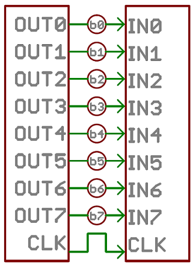

シリアルインターフェースは、データを1ビットずつ順番に流していく。
これらのインターフェースは、わずか1本の配線だけで動作することもあり、たいてい4本を超えることはない。

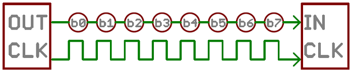

この2つのインターフェースは、車の流れにたとえるとイメージしやすい。
パラレルインターフェースは8車線以上あるメガハイウェイであり、シリアルインターフェースは田舎の2車線道路のようなものである。
一定の時間で見れば、メガハイウェイのほうがより多くの人を目的地に送り届けられる可能性があるが、その田舎の2車線道路も十分に役目を果たし、しかも建設費用はごくわずかで済む。

パラレル通信には確かに利点がある。
高速で、単純で、比較的実装しやすい。
しかし、それだけ多くの入出力（I/O）線を必要とする。
基本的な[Arduino Uno](./what-is-an-arduino.md)からMegaへプロジェクトを移行したことがある人なら、マイクロプロセッサのI/O線がいかに貴重で数が限られているかを知っているはずである。
そのため、私たちはしばしば、ピン数の節約と引き換えに速度をある程度犠牲にする、シリアル通信を選ぶことになる。

## 非同期シリアル

長年にわたり、組み込みシステムの特定のニーズに応えるために、数十種類ものシリアルプロトコルが作られてきた。
USB（ユニバーサル*シリアル*バス）やイーサネットは、コンピュータの世界でよく知られたシリアルインターフェースの一例である。
このほかにも、SPI、I2C、そして今日ここで取り上げるシリアル規格が非常によく使われている。
これらのシリアルインターフェースは、いずれも同期式か非同期式かのどちらかに分類できる。

同期式のシリアルインターフェースは、データ線に必ずクロック信号を組み合わせるため、同期式シリアルバス上のすべての機器がクロックを共有する。
これにより、より単純で、たいてい高速なシリアル転送が実現できるが、通信する機器の間にもう1本配線が必要になる。
同期式インターフェースの例としては、SPIやI2Cがある。

*非同期*とは、**外部のクロック信号の助けを借りずに**データを転送することを意味する。
この伝送方式は、必要な配線とI/Oピンの数を最小限に抑えるのに理想的だが、データの送受信を確実に行うために、多少の工夫が必要になる。
このチュートリアルで取り上げるシリアルプロトコルは、非同期転送のもっとも一般的な形式である。
あまりに一般的なため、たいていの人が「シリアル」と言うとき、実はこのプロトコルのことを指している（このチュートリアルを通じて、そのことに気づくはずである）。

このチュートリアルで扱うクロックを使わないシリアルプロトコルは、組み込み電子工学で広く使われている。
GPSモジュール、Bluetooth、XBee、シリアルLCDなど、外部デバイスをプロジェクトに追加したいなら、このシリアル通信の技を身につけておく必要があるだろう。

参考になるチュートリアル:

このチュートリアルは、次のようないくつかの、より基礎的な電子工学の概念の上に成り立っている。

- [回路図の読み方](./how-to-read-a-schematic.md)
- [アナログとデジタルの違い](./analog-vs-digital.md)
- [ロジックレベル](./logic-levels.md)
- [2進数](./binary.md)

これらの概念にあまり馴染みがない場合は、先にそちらを確認しておくとよい。

それでは、シリアル通信の旅に出かけよう。

## シリアルのルール

非同期シリアルプロトコルには、堅牢でエラーのないデータ転送を保証するための、いくつかの組み込みルールがある。
外部のクロック信号を使わない代わりに得られるこれらの仕組みは、次のとおりである。

- データビット
- 同期ビット
- パリティビット
- ボーレート

これらのさまざまな信号方式を通じて、シリアルでデータを送る方法はひとつではないことが分かるはずである。
このプロトコルは非常に柔軟に設定できる。
重要なのは、**シリアルバス上の両方の機器が、まったく同じプロトコル設定を使うようにする**ことである。

### ボーレート

ボーレートは、シリアル線を通じてデータが**どれだけ速く**送られるかを指定する。
たいてい、bps（ビット毎秒）という単位で表される。
ボーレートの逆数を取れば、1ビットの送信にかかる時間が分かる。
この値によって、送信側がシリアル線をどれだけの時間HIGHまたはLOWに保つか、あるいは受信側がどの周期で線をサンプリングするかが決まる。

ボーレートは、常識の範囲内であればほぼどんな値でもよい。
唯一の要件は、両方の機器が同じ速度で動作していることである。
速度がそれほど重要でない単純な用途でよく使われるボーレートのひとつが、**9600bps**である。
このほかにも1200、2400、4800、19200、38400、57600、115200といった「標準的な」ボーレートがある。

ボーレートが高いほど、データの送受信は速くなるが、転送速度には限界がある。
たいていのマイクロコントローラでは115200を超える速度を目にすることはあまりなく、これでも十分に速い。
これより速くしすぎると、クロックとサンプリング周期が追いつかなくなり、受信側でエラーが発生し始める。

### データのフレーム化

送信される各データブロック（たいてい1バイト）は、実際には*パケット*あるいは*フレーム*と呼ばれるビットのまとまりとして送られる。
フレームは、データに同期ビットとパリティビットを付け加えることで作られる。

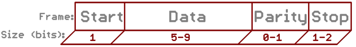

それでは、このフレームを構成する各部分を詳しく見ていこう。

#### データチャンク

すべてのシリアルパケットの中心となるのが、そこに含まれるデータである。
このデータのまとまりを、あえて*チャンク*とあいまいに呼んでいるのは、そのサイズが特に決まっていないからである。
1パケットあたりのデータ量は、5ビットから9ビットの間で自由に設定できる。
標準的なデータサイズはもちろん基本の8ビット（1バイト）だが、それ以外のサイズにもそれぞれ用途がある。
7ビットのデータチャンクは、7ビットのASCII文字だけを転送する場合など、8ビットより効率的なことがある。

文字の長さについて合意したら、両方のシリアル機器は、データの**エンディアン**についても合意する必要がある。
データは最上位ビット（msb）から送られるのか、それとも最下位ビット（lsb）からなのか。
特に明記されていない場合、たいていデータは**最下位ビット（lsb）から先に**転送されると考えてよい。

#### 同期ビット

同期ビットは、それぞれのデータチャンクと一緒に転送される、2つまたは3つの特別なビットである。
これらは**スタートビット**と**ストップビット**である。
その名のとおり、これらのビットはパケットの始まりと終わりを示す。
スタートビットは常に1つだけだが、ストップビットの数は1つまたは2つに設定でき（たいてい1つのままにされる）。

スタートビットは、アイドル状態のデータ線が1から0に変化することで常に示され、ストップビットは線を1に保つことでアイドル状態へと戻る。

#### パリティビット

パリティは、非常に単純で低レベルなエラーチェックの一種である。
奇数パリティと偶数パリティの2種類がある。
パリティビットを求めるには、データバイトの5〜9ビットすべてを足し合わせ、その合計が偶数か奇数かによってビットを立てるかどうかを決める。
たとえば、パリティが偶数に設定されており、`0b01011101`（1の数が5個で奇数）というデータバイトに追加する場合、パリティビットは`1`に設定される。
逆に、パリティモードが奇数に設定されていれば、パリティビットは`0`になる。

パリティは*任意*であり、それほど広くは使われていない。
ノイズの多い伝送路でデータを送る際には役立つことがあるが、データ転送を多少遅くしてしまい、送信側と受信側の両方にエラー処理の実装が必要になる（たいてい、受信に失敗したデータは再送しなければならない）。

#### 9600 8N1（具体例）

9600 8N1、すなわち9600ボー、データビット8、パリティなし、ストップビット1というのは、もっともよく使われるシリアルプロトコルのひとつである。
では、9600 8N1のパケットが実際にどのような形になるか、例を見てみよう。

[ASCII](./ascii.md)文字の「O」と「K」を送信する機器は、2つのデータパケットを作ることになる。
*O*（大文字）のASCII値は79であり、これは8ビットの2進数で`01001111`になる。
一方、*K*の2進数の値は`01001011`である。
あとは同期ビットを付け加えるだけである。

特に明記されてはいないが、データは最下位ビットから転送されると仮定されている。
それぞれのバイトが右から左へと読まれる形で送られていることに注目してほしい。

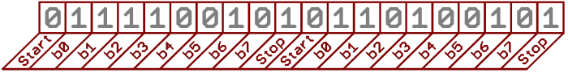

9600bpsで転送しているため、それぞれのビットをHIGHまたはLOWに保つ時間は1/9600bps、つまり1ビットあたり104マイクロ秒である。

送信される1バイトのデータごとに、実際には10ビットが送られている。スタートビット、8つのデータビット、そしてストップビットである。
そのため、9600bpsでは、実際には毎秒9600ビット、つまり毎秒960（9600÷10）バイトを送っていることになる。

これでシリアルパケットの構成方法が分かったところで、ハードウェアの話に進もう。
そこでは、これらの1と0、そしてボーレートが信号レベルでどのように実装されているかを見ていく。

## 配線とハードウェア

シリアルバスは、たった2本の配線、すなわちデータを送るための線と受け取るための線から成り立っている。
そのため、シリアル機器には2つのシリアルピン、つまり受信用の**RX**と送信用の**TX**が必要である。

ここで重要なのは、*RX*と*TX*というラベルは、その機器自身から見た呼び方だということである。
つまり、片方の機器のRXは、もう片方の機器のTXへとつなぐ必要があり、その逆もまた然りである。
VCCとVCC、GNDとGND、MOSIとMOSIのように同じ名前どうしをつなぐことに慣れていると奇妙に感じるかもしれないが、考えてみれば理にかなっている。
送信機は受信機と話すべきであり、別の送信機と話すべきではないからである。

両方の機器がデータを送信および受信できるシリアルインターフェースは、**全二重**または**半二重**のどちらかに分類される。
全二重とは、両方の機器が同時に送受信できることを意味する。
半二重通信では、シリアル機器は送信と受信を交互に行わなければならない。

シリアルバスの中には、送信側と受信側の機器間の接続がたった1本で済むものもある。
たとえば、SparkFunのシリアル対応LCDはひたすら「聞く」だけで、制御側の機器にデータを送り返す必要がない。
これは**単方向**（シンプレックス）シリアル通信と呼ばれるものである。
必要なのは、マスター側のTXからリスナー側のRX線への1本の配線だけである。

### ハードウェアでの実装

ここまでは、非同期シリアルを概念的な側面から見てきた。
必要な配線は分かった。
では、シリアル通信は実際に信号レベルでどのように実装されているのだろうか。
実は、その方法は多岐にわたる。
シリアル信号にはさまざまな規格が存在する。
ここでは、シリアル信号のハードウェア実装としてよく使われる2つの方式、ロジックレベル（TTL）とRS-232を見てみよう。

マイクロコントローラやその他の低レベルなICがシリアル通信を行うとき、たいていTTL（トランジスタ・トランジスタ・ロジック）レベルで行われる。
**TTLシリアル**信号は、マイクロコントローラの電源電圧の範囲内、たいてい0Vから3.3Vまたは5Vの間に収まる。
VCCレベル（3.3V、5Vなど）の信号は、アイドル状態の線か、値が1のビットか、ストップビットのいずれかを示す。
0V（GND）の信号は、スタートビットか、値が0のデータビットのいずれかを表す。

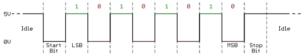

RS-232は、いくつかの古いコンピュータや周辺機器で見られる規格であり、いわばTTLシリアルを逆さまにしたようなものである。
RS-232信号はたいてい-13Vから13Vの範囲だが、仕様上は±3Vから±25Vまでの範囲が許容されている。
これらの信号では、低い電圧（-5V、-13Vなど）が、アイドル状態の線か、ストップビットか、値が1のデータビットのいずれかを示す。
高いRS-232信号は、スタートビットか、値が0のデータビットのいずれかを意味する。
これはTTLシリアルとはちょうど逆の関係になる。

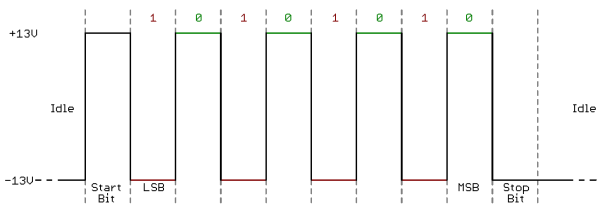

2つのシリアル信号規格を比べると、TTLのほうが組み込み回路への実装がずっと簡単である。
しかし、電圧レベルが低いため、長い伝送路では損失の影響を受けやすい。
RS-232や、あるいはRS-485のようなより複雑な規格のほうが、長距離のシリアル伝送には適している。

2つのシリアル機器を接続するときは、それぞれの信号電圧が一致していることを必ず確認すること。
TTLシリアル機器をRS-232バスに直接接続することはできない。
その場合は信号のレベルを変換する必要がある。

続いて、マイクロコントローラがパラレルバス上のデータをシリアルインターフェースとの間で変換するために使う道具、UARTについて見ていこう。

## UART

このシリアルというパズルの最後のピースは、シリアルパケットを作り出し、なおかつ物理的なハードウェア線を制御できる何かを見つけることである。
そこで登場するのがUARTである。

汎用非同期受信/送信機（UART）は、シリアル通信を実装する役割を担う回路のブロックである。
基本的に、UARTはパラレルインターフェースとシリアルインターフェースの間を取り持つ仲介役として働く。
UARTの片方の端には8本ほどのデータ線（といくつかの制御ピン）からなるバスがあり、もう片方の端には、RXとTXという2本のシリアル配線がある。

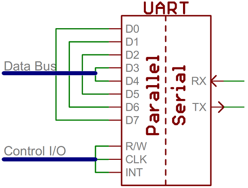

UARTは単体のICとしても存在するが、たいていマイクロコントローラの内部に組み込まれている。
自分のマイクロコントローラにUARTが搭載されているかどうかは、データシートを確認する必要がある。
UARTをまったく持たないものもあれば、1つだけ持つもの、複数持つものもある。
たとえば、おなじみのATmega328を採用したArduino Unoは1つのUARTしか持たないが、ATmega2560を採用したArduino Megaには、なんと4つものUARTが搭載されている。

UART（Universal Asynchronous Receiver/Transmitter）という頭文字のRとTが示すとおり、UARTはシリアルデータの送信と受信の両方を担う。
送信側では、UARTは同期ビットとパリティビットを付け加えてデータパケットを作成し、設定されたボーレードに従って正確なタイミングでTX線からそのパケットを送り出さなければならない。
受信側では、UARTは想定されるボーレートに応じた頻度でRX線をサンプリングし、同期ビットを見分けて、データを取り出さなければならない。

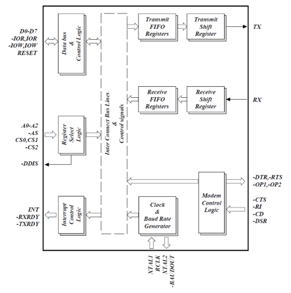

より高度なUARTは、受信したデータを**バッファ**に格納しておき、マイクロコントローラが取りに来るまでそこに保持する。
UARTはたいてい、先入れ先出し（FIFO）方式でバッファ内のデータを取り出す。
バッファはわずか数ビットのこともあれば、数千バイトに及ぶこともある。

### ソフトウェアUART

マイクロコントローラにUARTが搭載されていない（あるいは数が足りない）場合、シリアルインターフェースを**ビットバンギング**、つまりプロセッサが直接制御する方式で実現することもできる。
これは、ArduinoのSoftwareSerialライブラリのようなものが採用しているアプローチである。
ビットバンギングはプロセッサに大きな負荷をかけ、たいていUARTほど正確ではないが、いざというときには役に立つ。

## よくある落とし穴

シリアル通信についてはこれでほぼ一通り説明した。
最後に、経験レベルを問わずエンジニアが陥りやすい、よくある間違いをいくつか紹介しておこう。

### RXとTXの取り違え

単純なことのように思えるが、私自身も何度もやらかしたことのあるミスである。
ラベルを一致させたくなる気持ちは分かるが、シリアル機器どうしをつなぐときは、必ずRXとTXの配線を交差させること。

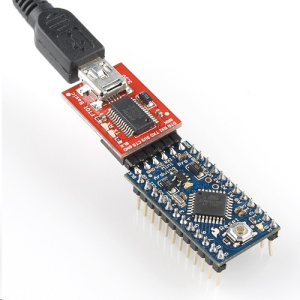

### ボーレートの不一致

ボーレートは、シリアル通信における「言語」のようなものである。
2つの機器が異なる速度で話していると、データが誤って解釈されたり、まったく受信されなかったりすることがある。
受信側がでたらめなデータしか受け取っていない場合は、まずボーレートが一致しているかを確認しよう。

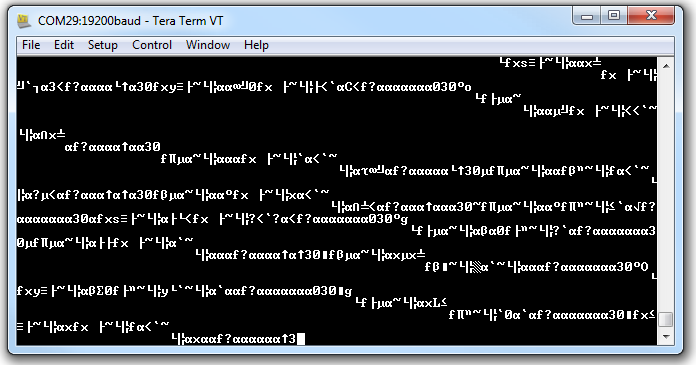

### バスの競合

シリアル通信は、1本のシリアルバス上でちょうど2つの機器だけが通信することを想定して設計されている。
同じシリアル線で2つ以上の機器が同時に送信しようとすると、バスの競合が起きることがある。

たとえば、GPSモジュールをArduinoに接続する場合、そのモジュールのTX線をArduinoのRX線に配線することになるだろう。
しかし、そのArduinoのRXピンは、Arduinoのプログラム書き込みや*シリアルモニタ*の使用時に使われるUSB-シリアル変換チップのTXピンにもすでに接続されている。
これにより、GPSモジュールとFTDIチップの両方が同時に同じ線で送信しようとする状況が起こりうる。

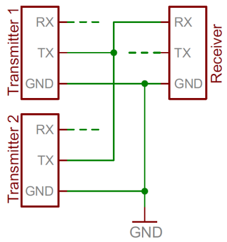

同じ線で2つの機器が同時にデータを送信しようとするのは望ましくない。
「うまくいって」も、どちらの機器もデータを送信できない結果に終わる。
最悪の場合、両方の機器の送信ラインが壊れてしまうこともある（まれではあるし、たいてい保護回路が備わっているが）。

逆に、1つの送信機器に複数の受信機器を接続するのは、比較的安全である。
仕様に厳密に沿っているとは言えず、経験豊富なエンジニアからは眉をひそめられるかもしれないが、動作はする。
たとえば、シリアルLCDをArduinoに接続する場合、もっとも簡単な方法は、LCDモジュールのRX線をArduinoのTX線につなぐことかもしれない。
ArduinoのTXはすでにUSBプログラマーのRX線に接続されているが、それでも送信ラインを制御している機器はひとつだけである。

このようにTX線を複数の機器へ分配するのは、ファームウェアの観点からは依然として危険を伴う。
どの機器がどの送信内容を受け取るかを選ぶことができないためである。
LCDが本来受け取るはずのないデータを受信してしまい、未知の状態に陥るよう命令されてしまう可能性がある。

一般論として、1本のシリアルバスには2つのシリアル機器、というのが原則である。

## まとめ

これでシリアル通信について新しい知識が身についたところで、探求できる新しい概念、プロジェクト、技術が数多く広がっている。

同期式の通信規格など、他の通信規格についてもさらに学びたいなら、次のような通信プロトコルも確認してみてほしい。

- [SPI（シリアルペリフェラルインターフェース）](./serial-peripheral-interface-spi.md)：マイクロコントローラをセンサー、シフトレジスタ、SDカードなどの周辺機器に接続するためによく使われる。
- [I2C](./i2c.md)：現在使われている主要な組み込み通信プロトコルのひとつであるI2Cの入門。

多くの技術がシリアル通信を大いに活用している。

- [GPS Basics（GPSの基礎）](./gps-basics.md)
- [Exploring XBees and XCTU（XBeeとXCTUの探求）](https://learn.sparkfun.com/tutorials/retired---exploring-xbees-and-xctu)

シリアル通信が実際に動いているところを見てみたい場合は、次のようなチュートリアルもおすすめである。

- シリアル通信の信号レベルを変換したい場合は、[ロジックレベルコンバータ](./bi-directional-logic-level-converter-hookup-guide.md)のチュートリアルを確認してほしい。
- [Using a Serial LCD（シリアルグラフィックLCDの使い方）](./serial-graphic-lcd-hookup.md)
- [Serial Terminal Basics（シリアルターミナルの基礎）](./terminal-basics.md)
- [OpenLog Hookup Guide（OpenLogの使い方）](https://learn.sparkfun.com/tutorials/openlog-hookup-guide)

タグ: 通信、概念

---

出典：[Serial Communication](https://learn.sparkfun.com/tutorials/serial-communication)（SparkFun Learn）を日本語に翻訳し、再構成した。
原文は [CC BY-SA 4.0](https://creativecommons.org/licenses/by-sa/4.0/) ライセンスで公開されており、本ページも同ライセンスの下で提供する。
