# シリアルグラフィックLCDの使い方

## はじめに

[Serial Graphic LCD Backpack](https://www.sparkfun.com/products/9352)（シリアルグラフィックLCDバックパック）の使い方ガイドへようこそ。
このチュートリアルでは、このバックパックの機能をフルに活用する方法を学ぶ。
まずハードウェアの基本概要から始め、続いてマイコンへの接続方法へと進む。
最後まで読めば、バックパックのすべての機能と、任意のホスト機器での実装方法が分かるはずである。

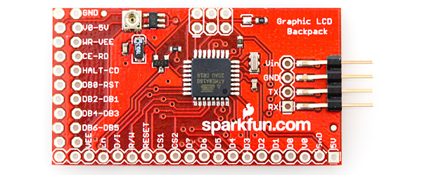

### 参考になるチュートリアル

このガイドを最大限に活用するには、事前に次のトピックを理解しておくことをおすすめする。
なじみのない概念があれば、目を通しておいてほしい。

- [Arduinoとは何か](./what-is-an-arduino.md)
- [シリアル通信](./serial-communication.md)
- [シリアルターミナルの基礎](./terminal-basics.md)
- [2進数](./binary.md)
- [16進数](./hexadecimal.md)
- [ASCII](./ascii.md)

## バックパックの概要

Serial Graphic LCD Backpackは、大型のグラフィック液晶ディスプレイ（LCD）に対して、シンプルなシリアルインターフェースを提供するために設計された。
文字の描画に加えて、直線や円、四角形を描いたり、個々のピクセルを設定したり解除したり、画面の特定のブロックを消去したり、バックライトを制御したりできる。
ピクセルの色と背景色を入れ替える反転モードも備えている。

SparkFunではこのバックパックを[単体でも](https://www.sparkfun.com/products/9352)販売しているが、[128x64ピクセルのグラフィックLCD](https://www.sparkfun.com/products/9351)や[160x128ピクセルのグラフィックLCD](https://www.sparkfun.com/products/8884)とセットになった製品も存在する。
このチュートリアルでは、両方のLCDを使ってバックパックの機能を紹介する。

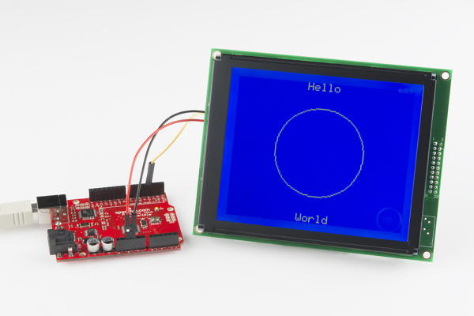

バックパックは、5V/16MHzで動作するATmega168マイコンによって制御されている。
この製品は主に組み込み用途を想定しているが、パソコンに接続してターミナルエミュレータから書き込むことも簡単にできる。
このチュートリアルでは両方の方法を扱う。

### 電源についての要件

バックパックには**最大7V**まで電圧をかけて電源供給できるが、その場合はバックパック上の電圧レギュレータへの負荷を減らすため、バックライトのデューティ比を下げるように注意する必要がある。
電圧レギュレータまわりの問題を避けるには、バックパックを6Vで駆動するのが最も無難である。
別の5V電源から給電しても問題ない。
ただし5V未満の電圧では、バックライトやディスプレイに不具合が生じることに注意してほしい。
パソコンのUSBポートやマイコンから電源を取る場合は、出力が確かに5Vであり、4.5Vのような低い値になっていないかを確認すること。

### その他のハードウェアの特徴

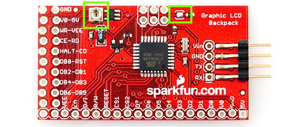

*コントラスト用ポテンショメーター（左）とはんだジャンパー（右）を強調した写真。*

#### コントラスト用ポテンショメーター

バックパックには、コントラストを調整するための小さな[ポテンショメーター](./resistors.md)が搭載されている。
出荷時にすでに調整済みだが、文字がはっきり見えない場合や好みに合わない場合は、自由に調整してかまわない。
LCDの文字が読めなくなった場合は、必ず最初にこのコントラスト用ポテンショメーターを確認すること。
非常に感度が高く、わずかにぶつけただけでもLCDのコントラストが崩れ、読めなくなることがある。

#### はんだジャンパー

バックパックには、どちらのディスプレイを使うかを決めるはんだジャンパーがある。
このジャンパーが閉じている（はんだ付けされている）場合は128x64ディスプレイ用のコードが動作し、開いている場合は160x128ディスプレイ用のコードが動作する。
このジャンパーは、どちらのLCDが取り付けられているかに応じて、製造時にはんだ付けされる。
ただし、自分の持っているLCDでこのバックパックを使いたい場合は、このジャンパーを適切に扱う必要がある。

#### TXライン

バックパックのTXラインは、将来のコード改訂やデバッグ、ユーザー開発のために最終設計に残されているが、執筆時点では利用されていない。

## LCDの概要

このチュートリアルの後半で使うファームウェアの仕組みをよりよく理解するために、これらのLCDがどう動作するかを簡単に説明しておこう。
まずは、LCD上のピクセルがどのようにマッピングされているかについてである。

グラフィックLCDは、次の図のようにデカルト座標でマッピングされている。

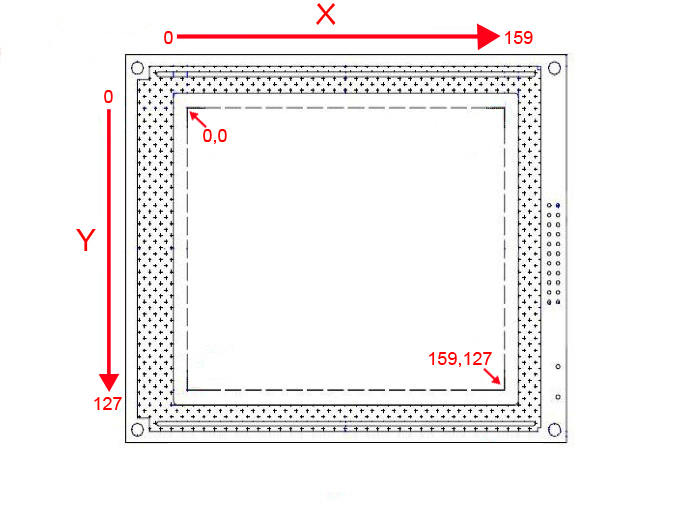

160x128ピクセルのLCDを使う場合は、次の図のようになる。

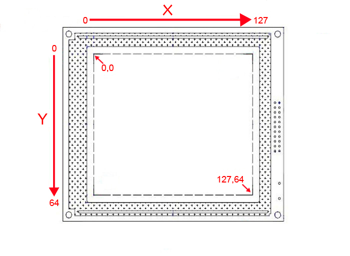

ASCII文字は、ユーザーが変更可能な2つの設定値であるx_offsetとy_offsetにもとづいて画面に表示される。
この2つの設定値は、**6x8ビット**の文字用スペースの左上隅のビット位置を定義する。
x_offsetとy_offsetを変更することで、画面上の任意の場所に文字を配置できる。

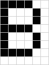

*文字用スペースに描かれた大文字の「B」。*

x_offsetとy_offsetを調整しない限り、文字は左から右へ、上から下へと表示されていく。
さらに、オフセットを変更すると文字全体の基準枠が変わる。
つまり、あるフォームの端まで書き込んで次の行に移る処理は、あらかじめ書き込み可能な位置と不可能な位置が決まっているわけではないため（画面の左端や下端に近い位置を除く）、シームレスに行われる。

バックスペースキーも機能し、ユーザーが設定した基準枠をできる限り維持しようとする。

バックパックには416バイトの入力バッファがあり、これは画面いっぱいに表示できる文字数に相当する。
一度に416文字を超えるデータを送信すると、バッファオーバーランが発生する可能性がある。
また、ファームウェアがバッファ全体を処理するのにかかる時間は、送信する文字と特殊コマンドの組み合わせによって変わる。
最適な動作を見つけるには、多少の試行錯誤が必要になるかもしれない。

## ASCIIコマンド

Graphic Serial LCD Backpackは、さまざまな方法で制御できるように設計されている。
その1つが[シリアルターミナル](./terminal-basics.md)を使う方法である。
パソコンを制御機器として使いたい場合に便利である。
また、ASCIIコマンドを使ってリアルタイムにバックパックへコマンドを送ることもできる。
これは、プロジェクトに組み込む前にLCDをテストしたい場合に役立つ。
以下に、ASCIIコマンドの一覧をすべて示す。

**注記：** キーボードから特殊なキー操作が必要になるASCII値を送る場面がいくつかある。
`< control 何らかの値 >`という表記が出てきたら、それはControlキーとその文字を**同時に**押す必要があるという意味である。
Macを使っている場合、これらのコマンドの一部はやや異なる方法で入力する必要がある。
Controlキーを使ってもうまくいかないコマンドがあれば、そのキャラクタの[Unicode版](http://en.wikipedia.org/wiki/Basic_Latin_%28Unicode_block%29)を試してみてほしい。

すべてのコマンドの先頭には「|」（ASCIIの10進数で124、16進数で0x7C）を付ける必要がある。
これは、続けてコマンド列が送られてくることをディスプレイに知らせるものである。
以下のコマンドの前には、必ず「|」を付けなければならない。
実際の「|」という文字そのものが画面に表示されることはない（また、表示することもできない）。

#### 画面のクリア

「\@（0x00）」を送信すると、書き込まれていたすべてのピクセルを画面から消去する。
通常モードで動作している場合はすべてのピクセルがリセットされ、反転モードで動作している場合はすべてのピクセルがセットされる。
「画面のクリア」コマンドの例としては、0x7C 0x00を送信するか、キーボードから「|」と\@を送信する。

#### デモモード

「\d（0x04）」を送信すると、デモ用のコードが実行される。
これはディスプレイの機能を示す一例として、ファームウェアに組み込まれている。
デモを見るには、0x7C 0x04を送信するか、キーボードから「|」と\dを送信する。

#### 反転モード

「\r（0x12）」を送信すると、160x128ピクセルディスプレイでは白地に青と青地に白、128x64ピクセルディスプレイでは黒地に緑と緑地に黒の間で表示が切り替わる。
反転モードを設定すると、新しい背景色で画面が即座にクリアされる。
反転モードを設定するには、0x7C 0x12を送信するか、キーボードから「|」と\rを送信する。
この設定は電源の入れ直しをまたいで保存される。
反転モードのままディスプレイの電源を切った場合、次に電源を入れたときも反転モードのままで起動する。

#### スプラッシュ画面

「\s（0x13）」を送信すると、電源投入時にSparkFunのロゴを表示するかどうかを切り替えられる。
このスプラッシュ画面には2つの役割がある。
1つは製品に自分たちの刻印を残すことであり、もう1つは、電源投入時に短い時間を確保し、ボーレートの誤った変更からディスプレイを復旧できるようにすることである（詳しくはボーレートの変更の項を参照）。
スプラッシュ画面を無効にするとロゴの表示は抑制されるが、遅延自体は残る。
スプラッシュ画面を無効にするには、0x7C、0x13を送信するか、キーボードから「|」と\sを送信する。

#### バックライトのデューティ比の設定

「\b（0x02）」に続けて0から100までの数値を送信すると、バックライトの明るさ（したがって消費電流）が変わる。
値を0に設定するとバックライトはオフになり、100以上に設定すると完全に点灯し、その中間の値では明るさもその中間になる。
コマンド列の中の数値は8ビットのASCII値である。
たとえばデューティ比を50に設定するには、0x7C 0x02 0x32を送信するか、キーボードから「|」、\b、「2」を送信する。

#### ボーレートの変更

「\g（0x07）」に続けて「1」から「6」までのASCII文字を送信すると、ボーレートが変更される。
デフォルトのボーレートは115,200bpsだが、バックパックはさまざまな通信速度に設定できる。

| 文字 | ボーレート |
|---|---|
| "1" | 4800 |
| "2" | 9600 |
| "3" | 19200 |
| "4" | 38400 |
| "5" | 57600 |
| "6" | 115200 |

たとえばボーレートを19,200bpsに設定するには、0x7C 0x07 0x33を送信するか、キーボードから「|」、\g、「3」を送信する。
ボーレートの設定は電源の入れ直しをまたいで保持されるため、19,200bpsの状態で電源を切った場合、次に電源を入れたときもその設定のままになる。

万一の場合は、ボーレートを115,200に戻すこともできる。
電源投入時の1秒間の遅延の間に、115,200bpsで任意の文字をディスプレイに送信すればよい。

#### X座標とY座標の設定

「\x（0x18）」または「\y（0x19）」に続けて新しい基準座標を表す数値を送信すると、X座標またはY座標が変更される。
X座標とY座標の基準値（ソースコード上ではx_offsetとy_offset）は、テキストジェネレータが画面上の特定の位置に文字を配置するために使われる。
先に述べたとおり、この座標は文字用スペースの左上のピクセルを指す。
オフセットが画面の右端から6ピクセル以内、あるいは下端から8ピクセル以内にある場合、テキストジェネレータは文字を部分的にではなく丸ごと表示できるよう、次の行に自動的に移る。
たとえばx_offsetを80（160x128ピクセルディスプレイの水平方向の中央）に設定するには、0x7C 0x18 0x50を送信するか、キーボードから「|」、\x、「P」を送信する。
各軸の長さを超える値を設定しようとした場合は、それぞれのオフセットの最大値に丸められる。

#### ピクセルの設定と解除

「\p（0x10）」に続けてxとyの座標、およびそのピクセルを設定するか解除するかを表す0か1を送信する。
画面上の任意のピクセルを、このコマンドで個別に設定したり解除したりできる。
たとえば座標(80, 64)のピクセルを設定するには、0x7C 0x10 0x50 0x40 0x01を送信するか、キーボードから「|」、\p、「P」、「@」、\aを送信する。
ピクセルを「設定する」とは、必ずしもそこに1を書き込むという意味ではなく、背景色の反対の色を書き込むという意味であることに注意してほしい。
つまり反転モードで動作している場合、ピクセルを設定すると実際にはそのピクセルはクリアされ、白い背景の中で目立つようになる。
そのピクセルを解除すると、背景と同じ白色に戻る。

#### 直線の描画

「\l（0x0C）」に続けて、線の始点と終点を表す2組の(x, y)座標を送信し、さらに直線を描くか消すかを表す0か1を送信する。
たとえば(0,10)から(50,60)まで直線を描くには、0x7C 0x0C 0x00（x1）0x0A（y1）0x32（x2）0x3C（y2）0x01を送信するか、キーボードから「|」、\l、\@、\j、「2」、「<」、\aを送信する。
その直線を消す（周囲の文字や図形はそのまま残す）には、同じコマンドの最後の\aを\@に変えて送信する。

#### 円の描画

「\c（0x03）」に続けて、円の中心を表すxとyの座標、円の半径を表す数値、さらに円を描くか消すかを表す0か1を送信する。
たとえば中心(80, 64)、半径10の円を描くには、0x7C 0x03 0x50 0x40 0x0A 0x01を送信するか、キーボードから「|」、\c、「P」、「@」、\j、\aを送信する。
その円を消す（周囲の文字や図形はそのまま残す）には、同じコマンドの最後の\aを\@に変えて送信する。
円は画面の外側にはみ出して描くこともできるが、実際に表示されるのはディスプレイの範囲内に収まるピクセルだけである。

#### 四角形の描画

「\o（0x0F）」に続けて、四角形の対角の2つの角を表す2組の(x, y)座標を送信し、さらに四角形を描くか消すかを表す0か1を送信する。
このコマンドは直線を描くコマンドと全く同じ形式だが、線の代わりに、指定した座標間の直線をちょうど囲む四角形が描かれる。
たとえば(0,10)から(50,60)までの直線を囲む四角形を描くには、0x7C 0x0F 0x00（x1）0x0A（y1）0x32（x2）0x3C（y2）0x01を送信するか、キーボードから「|」、\o、\@、\j、「2」、「<」、\aを送信する。
その四角形を消す（周囲の文字や図形はそのまま残す）には、同じコマンドの最後の\aを\@に変えて送信する。

#### ブロックの消去

「\e（0x05）」に続けて、消去したいブロックの対角の2つの角を表す2組の(x, y)座標を送信する。
これは四角形を描くコマンドとほぼ同じだが、四角形の中身が背景色に消去される点が異なる。
たとえば(0,10)から(50,60)までの直線を囲む矩形ブロックを消去するには、「0x7C 0x05 0x00（x1）0x0A（y1）0x32（x2）0x3C（y2）」を送信するか、キーボードから「|」、\e、\@、\j、「2」、「<」を送信する。

## 例1：FTDI Basicを使う

LCDを制御するコマンドが分かったところで、実際に試してみよう。
この例では、FTDI Basicを使ってLCDと通信し、制御を行う。

#### 必要なもの

- [128x64ピクセルのグラフィックLCD](https://www.sparkfun.com/products/9351)または[160x128ピクセルのグラフィックLCD](https://www.sparkfun.com/products/8884)のいずれか
- FTDI Basic - 5V または FTDI Cable
- Mini USBケーブル
- オス-メスのジャンパー線

#### ハードウェア

LCDに接続して表示を行う、もっとも簡単で手早い方法は、FTDI BasicやFTDI Cableを使うことである。
ジャンパー線を使って、次のようにFTDIとLCDを接続する。

| FTDI | グラフィックLCD |
|---|---|
| 5V | Vin |
| GND | GND |
| TXO | RX |

LCDを正しく配線できたら、FTDI機器をパソコンに接続する。
[ターミナルウィンドウを開こう](./terminal-basics.md)。
設定が正しいことを確認すること（ボーレート：115200、8-N-1-NONE）。
接続できたら、文字を入力してみよう。
入力した内容がすべてLCDに表示されるはずである。
画面のクリア、円の描画、特定のx, y座標への文字の表示といった特定のコマンドを実行するために押すべきキーについては、ASCIIコマンドの項を振り返って確認してほしい。

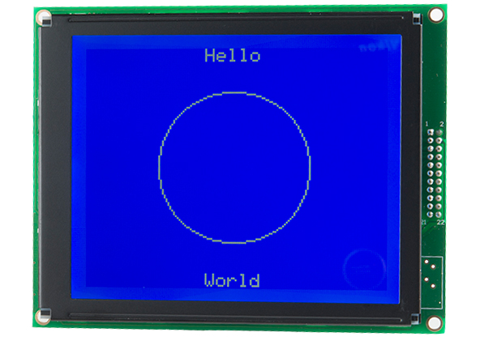

パソコンからLCDに話しかけるのも楽しいが、組み込み機器からLCDに情報を表示できるようになると、本当の面白さが始まる。
次の例では、Arduinoを使ってLCDに情報を表示する。

## ファームウェアの概要

ArduinoにLCDを接続する前に、少しファームウェアについて説明しておこう。
ファームウェアとは、バックパック上で動作するコードのことである。
LCDと、それと通信するマイコンとの間の橋渡し役、いわば翻訳者としての役割を果たす。
このファームウェアの上に、バックパックをさらに使いやすくするためのArduinoライブラリを用意した。

### バックパックのファームウェア

バックパックに付属するファームウェアは刷新されており、以前よりも滑らかに動作し、どんなプロジェクトにも素晴らしいグラフィック表示をもたらしてくれる。
特に凝ったことをしたいのでなければ、デフォルトのファームウェアだけでLCDに必要な機能はほぼ満たせるはずである。
とはいえ、内部の仕組みを理解しておく価値はある。
ファームウェアを見るには、[Serial Graphic LCD BackpackのGitHubリポジトリ](https://github.com/sparkfun/GraphicLCD_Serial_Backpack/)を訪れてほしい。
zipファイルをダウンロードするか、リポジトリをパソコンにクローンするか、あるいはGitHub標準のエディタで内容を確認することもできる。

Firmwareフォルダの中には、多数の.cファイルと.hファイルがある。
これらは、受け取った入力に応じてバックパックがLCDとどうやり取りするかを定めているファイルである。
ソースコードの改変はこのチュートリアルの範囲を超えるため、ここでは詳しく扱わない。
内部の機能を追加、削除、変更したい場合は、ここが該当する場所だということだけ覚えておいてほしい。

なお、バックパックのファームウェアを書き換えるにはプログラマが必要になる。
バックパックに搭載されているICは、多くのArduinoボードに使われているものと同じATmega328であるにもかかわらず、Arduino互換ではない。
ファームウェアの再書き込み方法についての詳細は、トラブルシューティングの項を参照してほしい。

### Arduinoライブラリ

Serial Graphic LCD Backpackをできるだけ簡単に使えるように、Arduinoライブラリを用意した。
このライブラリは[GitHubリポジトリ](https://github.com/sparkfun/GraphicLCD_Serial_Backpack/tree/V_1.0.1/Libraries/Arduino)から入手できる。
このライブラリは、前述のASCIIコマンドの一覧にある各コマンドに対応する関数を提供している。
ライブラリに付属するサンプルスケッチでは、各関数の使い方が示されており、LCD上でさまざまな用途にどう実装するかが分かる。
Arduinoライブラリのインストール方法について復習が必要な場合は、Installing an Arduino Libraryのチュートリアルを参照してほしい。

以下では、それぞれの関数を簡単な説明とともに紹介する。
ただし、これらの関数はいずれもASCIIコマンドの項で紹介したコマンドの上に成り立っている。
それぞれの詳細については、その項を参照するか、ライブラリファイル内のコメントを読んでほしい。

#### 表示用コマンド

- `printStr(char Str[78])` - 文字列をLCDに表示する。バッファのデフォルトサイズは78だが、ヘッダファイルで変更できる。
- `printNum(int num)` - 1つの数値をLCDに表示する。
- `nextLine()` - 文字表示における改行として機能する。

これら3つの関数が用意されているのは、バックパックとの通信にSoftware Serialライブラリのインスタンスがライブラリファイル内で宣言されているためである。
そのため、このライブラリを使っている間は、通常の`serial.print()`コマンドではLCDに文字を送信できない。

#### LCDの機能

- `clearScreen()` - LCD上のすべてのピクセルを消去する。
- `toggleReverseMode()` - 反転モードを切り替える。160x128ディスプレイでは白地に青、128x64ディスプレイでは黒地に緑になる。
- `toggleSplash()` - SparkFunのスプラッシュ画面のオンとオフを切り替える。スプラッシュ画面が有効か無効かにかかわらず、起動時の1秒間の遅延は残ることに注意。
- `setBacklight(byte duty)` - バックライトの明るさを設定する。引数として1つのint値を取る。範囲は0〜100で、0はオフ、100は最大輝度である。100を超える値を指定しても、最大値の100として扱われる。
- `setBaud(byte baud)` - バックパックのボーレートを設定する。引数として1つのint値（範囲は49〜54）を取る。
- `restoreDefaultBaud()` - LCDのボーレートをデフォルトの115200bpsに戻す。

#### カーソル位置の指定

- `setX()` - 画面上で文字が表示されるx位置を設定する。
- `setY()` - 画面上で文字が表示されるy位置を設定する。
- `setHome()` - xとyの両方を位置(0, 0)に戻す。

#### 描画

- `setPixel(byte x, byte y, byte set)` - LCD上の任意のピクセルを設定したり解除（背景色に戻す）したりする。
- `drawLine(byte x1, byte y1, byte x2, byte y2, byte set)` - 2つのx, y座標の間に直線を描く。
- `drawBox(byte x1, byte y1, byte x2, byte y2, byte set)` - 2つのx, y座標の間に四角形を描く。
- `drawCircle(byte x, byte y, byte rad, byte set)` - 指定したx, y座標を中心とし、指定した半径まで広がる円を描く。
- `eraseBlock(byte x1, byte y1, byte x2, byte y2)` - 指定した2つのx, y座標にまたがるブロックを消去する。
- `demo()` - ファームウェアに組み込まれた内部デモを起動する。

## 例2：Arduinoを使う

まずは、Arduinoから手早くLCDに文字を表示するシンプルな方法を紹介し、続いてLCDのファームウェアに組み込まれた特殊文字を活用する、より本格的な方法を紹介する。

#### 必要なもの

- Arduino互換ボード（RedBoardやArduino Unoをおすすめする）
- [128x64ピクセルのグラフィックLCD](https://www.sparkfun.com/products/9351)または[160x128ピクセルのグラフィックLCD](https://www.sparkfun.com/products/8884)のいずれか
- お使いのArduinoに適したUSBケーブル
- オス-メスのジャンパー線

### シリアルのパススルー

最初の例では、Arduinoに内蔵されている[UART](./serial-communication.md)を利用する。
そのため、LCDを接続したままArduinoにコードを書き込む際には注意が必要である。両者が同じラインを共有することになるからである。
ここでは少し順番を変えて、先にコードを書き込んでから、LCDを接続することにする。

わずか数行のコードで、Arduinoを経由してターミナルウィンドウに文字を送ることができる。
次のコードを新しいスケッチにコピーし、Arduinoに書き込む。

```cpp
void setup() {
  Serial.begin(115200);
}
void loop() {
  if(Serial.available() > 0){
    Serial.write(Serial.read());
  }
}
```

このコードは、ArduinoがRXラインで受信した内容を、そのままTXラインからSerial Graphic LCDへ送信する。
ASCIIの数値ではなく実際の文字をLCDに表示したい場合は、`Serial.print`ではなく`Serial.write()`を使う必要がある。

#### ハードウェア

次に、以下のようにLCDをArduinoに接続する。

配線が次のようになっていることを確認する。

| Arduino | グラフィックLCD |
|---|---|
| 5V | Vin |
| GND | GND |
| TX | RX |

LCDのTXラインには接続する必要がない。LCDに対して**データを送るだけ**だからである。

ここで、ターミナルウィンドウを（同じく115200で）開き、文字を入力してみよう。
今度もLCDに文字が表示されるはずである。バックスペースも問題なく機能する。

### Arduinoライブラリを使った例

最後の例では、Serial Graphic LCDライブラリを使ってすべての処理を任せてしまう。
このライブラリの重要な特徴の1つは、[Software Serial](http://arduino.cc/en/Reference/SoftwareSerial)ライブラリを使って、ArduinoがLCDと通信するための別のシリアルポートを作り出している点である。
先ほどの例の問題点は、内蔵のUARTを使っているため、コードを書き込むたびにLCDを取り外す必要があったことである。
開発中に何度も書き込みを行う場合、これはかなり面倒である。

#### ハードウェア

このセットアップは、先ほどの例のものをそのまま使い、ジャンパー線を1本だけ変更すればよい。
ArduinoのTXピンに接続していたジャンパー線を、Arduinoのデジタルピン3に移動する。
これは、Serial Graphic LCDライブラリがSoftware Serialライブラリを初期化する際に使用するピンである。

配線は次のようになるはずである。

| Arduino | グラフィックLCD |
|---|---|
| 5V | Vin |
| GND | GND |
| Pin 3 | RX |

図で確認したい場合は、以下の配線例を参考にしてほしい。

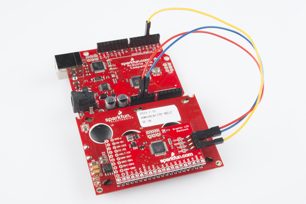

#### ファームウェア

まだの場合は、[Arduinoライブラリ](https://github.com/sparkfun/GraphicLCD_Serial_Backpack/tree/master/Arduino_Library)をダウンロードしてインストールするか、パソコンにクローンしてほしい。
ライブラリのインストール方法については、前述のファームウェアの詳細の項を参照すること。
インストールが済んだら、Arduino IDEを開き、ライブラリのサンプルスケッチへ移動する。

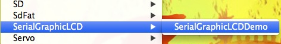

適切なシリアルポートとボードを選択し、サンプルスケッチをArduinoに書き込む。
書き込みが完了すると、ライブラリのデモが開始される。
ライブラリに含まれるほぼすべての関数の使用例が、一通り実行される。
あとは座って眺めているだけでよい。

## トラブルシューティング

### 表示に関する問題

- 文字が全く見えない場合は、バックパック上のコントラスト用ポテンショメーターが適切に調整されているか確認すること。調整には精密ドライバーが必要である。このトリムポットを調整する際は注意すること。回しすぎたり、強く力を加えすぎたりすると、トリムポットが壊れることがある。
- バックパックに**少なくとも5V**を供給していることを確認すること。それより低いとコントラストに問題が生じることがある。USBポートの中には4.7〜4.8V程度しか出力しないものもあり、LCDとバックパックを完全に駆動するには電圧が足りないことがある。LCDには6〜7Vで電源供給することをおすすめする。
- コントラストを適切に調整しても文字が全く見えない場合は、ボーレートに問題がある可能性がある。ボーレートを変更して、何に変更したか忘れてしまった場合は、Arduinoライブラリの`restoreDefaultBaud()`コマンドを使って、デフォルトの115200bpsに戻すことができる。Graphic Serial LCDライブラリをインポートするスケッチを作成し、setup内でこの復元用の関数を呼び出せばよい。

次のコードをArduinoにコピー＆ペーストし、LCDのRXピンがArduinoのデジタルピン3に接続されていることを確認したうえで書き込む。
画面に「Baud restored to 115200!」と表示されるはずである。

```cpp
#include <SparkFunSerialGraphicLCD.h> // Serial Graphic LCDライブラリをインクルードする
#include <SoftwareSerial.h>
LCD LCD;
void setup()
{
delay(1200); // 1秒間のスプラッシュ画面を待つ
LCD.restoreDefaultBaud();
}
void loop()
{
// loop内では何もしない
}
```

### ファームウェアの再書き込み

バックパックの動作がおかしいと感じたら、ファームウェアが原因である可能性がある。
その場合は、最新のファームウェアに更新することをおすすめする。
適切な道具があれば自分自身で行える方法を、ここで簡単に説明する。

最新版のファームウェアは[GitHub](https://github.com/sparkfun/GraphicLCD_Serial_Backpack)にある。
リンク先のリポジトリを訪れ、クローンするかzipファイルをダウンロードし、その保存場所を覚えておく。

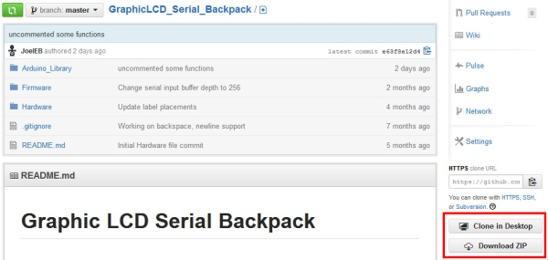

ファームウェアをバックパックに書き込む何らかの手段が必要になる。
[Atmel AVR MKIIプログラマ](http://www.atmel.com/tools/AVRISPMKII.aspx)の使用をおすすめするが、MKIIを持っていない場合は、Pocket AVR Programmerのような類似の製品を使うこともできる。
プログラマをパソコンに接続する。
Arduinoボードをプログラマとして使うこともできる。
これについての詳細や、ファームウェアの再書き込み全般については、Installing an Arduino Bootloaderのチュートリアルを参照してほしい。

この例では、Atmel AVR Studio（v4.18）を使って.hexファイルをバックパックに書き込む。
コマンドラインからAVRDudeを使って同じことを行うこともできる。
MacやLinuxを使っている場合は、それぞれのOS上でAVRコードを書き込む方法を調べるか、WineやVMWareのような仮想マシンを使ってWindows上でAVR Studioを動かす必要がある。

AVR Studioを起動する準備ができたら、プログラムを起動しよう。
使用しているプログラマを選択するよう求めるプロンプトが表示されるはずである。
AVR MKII、あるいは自分が使っているプログラマを選択する。

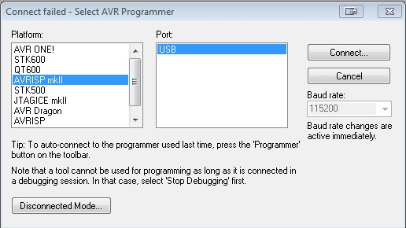

次に、書き込み先のチップを選択する。ATmega168Pを選択する。

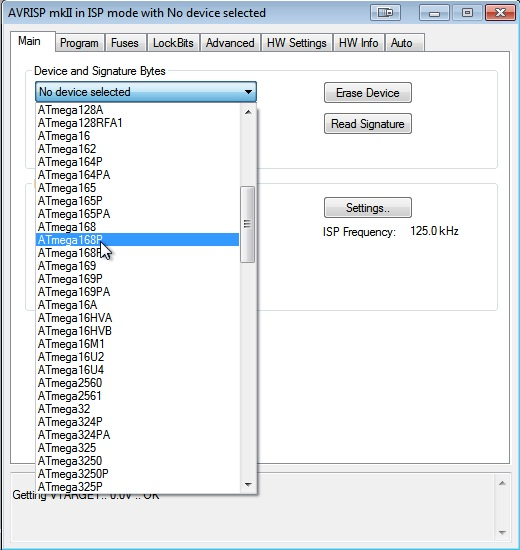

Programタブをクリックする。「Flash」の項目で、3つの点が描かれたボタンをクリックし、GitHubからダウンロードしたhexファイルを参照する。

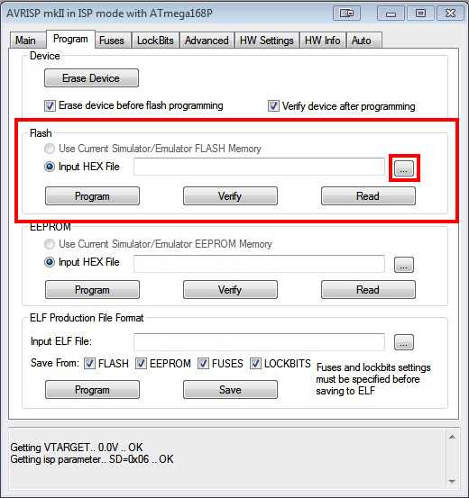

GitHubからダウンロードした際に付属する.hexファイルを参照する。

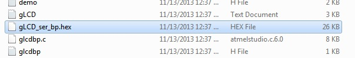

AVR Studioにhexファイルの場所を指定したら、プログラマをバックパックのISPヘッダーに接続し、「Program」をクリックする。

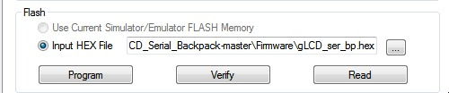

プログラムの下部に成功のメッセージが表示されるはずである。
表示されれば、新しいファームウェアがバックパックに書き込まれ、使用できる状態になっている。

## まとめ

これでひととおり完了である。
Serial Graphic LCDの仕組みと、さまざまな方法でLCDを制御する方法について理解できたはずである。
あとは実際に、洗練されたユーザーインターフェースを持つ素晴らしいプロジェクトを作ってみてほしい。
S-G-LCDバックパックについてのさらなる情報は、以下のリンクを確認してほしい。

- [Serial Graphic LCD Backpack GitHubリポジトリ](https://github.com/sparkfun/GraphicLCD_Serial_Backpack)
- [Serial Graphic LCD Backpack製品ページ](https://www.sparkfun.com/products/9352)
- [データシート（160x128 LCD）](https://www.sparkfun.com/datasheets/LCD/DS-G160128STBWW.pdf)
- [T6963Cマニュアル](https://www.sparkfun.com/datasheets/LCD/Monochrome/Datasheet-T6963C.pdf)
- [T6963アプリケーションノート](https://www.sparkfun.com/datasheets/LCD/Monochrome/T6963C-AppNote.pdf)
- [Graphic LCD VU Meters（グラフィックLCDを使ったVUメーター）](https://www.sparkfun.com/tutorials/120)

タグ: ディスプレイ、接続ガイド

---

出典：[Serial Graphic LCD Hookup](https://learn.sparkfun.com/tutorials/serial-graphic-lcd-hookup)（SparkFun Learn）を日本語に翻訳し、再構成した。
原文は [CC BY-SA 4.0](https://creativecommons.org/licenses/by-sa/4.0/) ライセンスで公開されており、本ページも同ライセンスの下で提供する。
