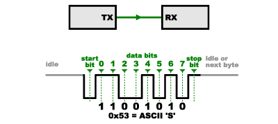
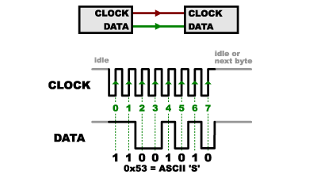
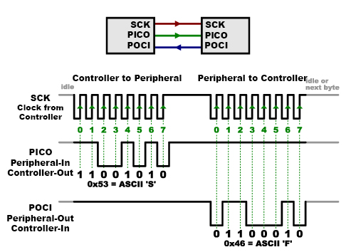
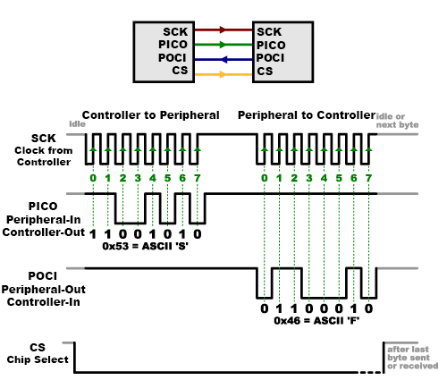
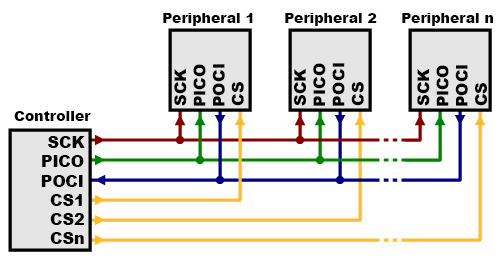
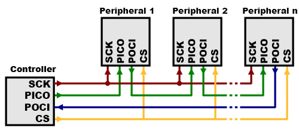

# SPI（シリアルペリフェラルインターフェース）

**SPI**（シリアルペリフェラルインターフェース）は、マイクロコントローラとシフトレジスタ、センサー、SDカードのような小型の周辺機器の間でデータをやり取りするために、よく使われるインターフェースバスである。
クロック線とデータ線を別々に持ち、さらに通信したい機器を選ぶための選択線も備えている。

参考になるチュートリアル:

このチュートリアルを読む前に知っておくと役立つ内容は、次のとおりである。

- [2進数](./binary.md)
- [シリアル通信](./serial-communication.md)
- [Shift registers（シフトレジスタ）](https://learn.sparkfun.com/tutorials/shift-registers)
- [ロジックレベル](./logic-levels.md)

## シリアルポートの何が問題なのか

TX線とRX線を使う一般的なシリアルポートは「非同期（asynchronous）」と呼ばれる。これは、データがいつ送られるかを制御する仕組みがなく、両側が正確に同じ速度で動作している保証もないためである。
コンピュータはたいてい、すべてを単一の「クロック」（コンピュータに搭載され、あらゆる動作を駆動するメインの水晶振動子）に同期させることを前提としているため、わずかにクロックの異なる2つのシステムどうしが通信しようとすると、これが問題になることがある。

この問題を回避するため、非同期シリアル通信では、各バイトにスタートビットとストップビットを追加し、受信側がデータの到着に合わせて同期を取り直せるようにしている。
両側は、あらかじめ伝送速度（たとえば9600ビット毎秒など）についても合意しておく必要がある。
伝送速度にわずかなずれがあっても、受信側は各バイトの先頭で同期を取り直すため、問題にはならない。

（ちなみに、上の図で「11001010」が0x53と一致していないことに気づいたなら、なかなか鋭い観察眼である。シリアルプロトコルではたいてい最下位ビットから先に送信されるため、もっとも小さいビットが一番左に来る。下位ニブルは実際には0011＝0x3であり、上位ニブルは0101＝0x5である。）

非同期シリアルは問題なく機能するが、各バイトに追加するスタートビットとストップビットのオーバーヘッドや、データを送受信するために必要な複雑なハードウェアといった負担がある。
また、自分のプロジェクトでも経験したことがあるかもしれないが、両側の速度が一致していないと、受信データは文字化けしてしまう。
これは、受信側が非常に特定のタイミング（上の図の矢印の位置）でビットをサンプリングしているためであり、受信側が誤ったタイミングを見ていれば、誤ったビットを読み取ってしまう。

## 同期式という解決策

SPIは少し異なる方式で動作する。
これは「同期式」のデータバスであり、データ用の線とは別に、両側を完全に同期させ続ける「クロック」用の線を持つ。
このクロックは発振する信号であり、受信側にデータ線上のビットをいつサンプリングすべきかを正確に伝える。
これはクロック信号の立ち上がり（ローからハイ）または立ち下がり（ハイからロー）のどちらかのエッジに対応しており、どちらを使うかはデータシートに明記されている。
受信側はそのエッジを検出すると、すぐにデータ線を見て次のビットを読み取る（下の図の矢印を参照）。
クロックがデータと一緒に送られてくるため、速度をあらかじめ指定しておく必要はないが、各デバイスにはそれぞれ動作できる最高速度がある（適切なクロックエッジと速度の選び方については、後ほど説明する）。

SPIがこれほど人気がある理由のひとつは、受信側のハードウェアが単純な[シフトレジスタ](./integrated-circuits.md)で済むという点である。
これは、非同期シリアルが必要とする本格的なUART（汎用非同期受信/送信機）に比べて、はるかに単純で（そして安価な）ハードウェアである。

## データの受信

> [!NOTE]
> SPIのピン名としてPICO/POCIという表記を見慣れないかもしれない。SparkFunは、コントローラとペリフェラルの間の信号を表すのに「Master」「Slave」という用語を使うのをやめようという、OSHWA（オープンソースハードウェア協会）の他のメンバーとの決議に加わっている。これらの用語は廃止されたものと見なされ、現在ではそれぞれ「controller（コントローラ）」「peripheral（ペリフェラル）」という用語に置き換えられている。
>
> | 旧称 | 新称 |
> | --- | --- |
> | Master | Controller |
> | Slave | Peripheral |
> | MISO | POCI |
> | MOSI | PICO |
> | SS | CS |
>
> 命名規則は、メーカーやプログラミング言語、企業、団体によって異なる場合がある。

一方向の通信にはこれでよさそうだが、では逆方向にデータを送り返すにはどうすればよいのだろうか、と思うかもしれない。
ここから少し話が込み入ってくる。

SPIでは、片側だけがクロック信号を生成する（たいていCLKまたはSCK、Serial ClocKと呼ばれる）。
クロックを生成する側を「コントローラ」、もう一方を「ペリフェラル」と呼ぶ。
コントローラは常にひとつだけ（たいていマイクロコントローラ自身）だが、ペリフェラルは複数存在することがある（これについては後ほど詳しく説明する）。

コントローラからペリフェラルへデータを送るときは、PICO（Peripheral In / Controller Out）と呼ばれるデータ線を使って送られる。
ペリフェラルがコントローラに応答を送り返す必要がある場合、コントローラはあらかじめ決められた回数だけクロックを生成し続け、ペリフェラルはPOCI（Peripheral Out / Controller In）と呼ばれる3本目のデータ線にデータを乗せる。

先ほどの説明で「あらかじめ決められた」という表現を使ったことに注目してほしい。
コントローラは常にクロック信号を生成する側であるため、ペリフェラルがいつデータを返す必要があり、どれだけの量のデータが返されるのかを前もって知っておかなければならない。
これは、任意のタイミングでどちらの方向にも任意の量のデータを送ることができる非同期シリアルとは大きく異なる点である。
実際には、SPIはたいてい非常に決まったコマンド体系を持つセンサーとやり取りするために使われるため、これは問題にならない。
たとえば「データを読み取る」というコマンドをある機器に送れば、その機器がたとえば常に2バイトを返してくることが分かっている、というような場合である
（可変長のデータを返したい場合は、まずデータ長を示す1〜2バイトを返し、その後コントローラが必要な分だけデータを取得するという方法もある）。

なお、SPIは「全二重」（送信線と受信線が別々にある）であるため、状況によっては送信と受信を*同時に*行うこともできる（たとえば、前回のセンサー値を取得しながら次の測定を要求する場合など）。
これが可能かどうかは、使用する機器のデータシートに記載されている。

## チップセレクト（CS）

もうひとつ知っておくべき線として、CS（チップセレクト）がある。
これは、ペリフェラルに対してデータの送受信を開始すべきタイミングを伝えるものであり、複数のペリフェラルが存在する場合には、どのペリフェラルと通信したいかを選択するためにも使われる。

CS線はたいてい通常時はHIGHに保たれており、これによってそのペリフェラルはSPIバスから切り離された状態になる（このような論理方式は「アクティブロー」と呼ばれ、イネーブル線やリセット線でよく使われる）。
ペリフェラルにデータを送信する直前に、この線をLOWにすることでペリフェラルが有効になる。
そのペリフェラルの使用が終わったら、再びHIGHに戻す。
[シフトレジスタ](./integrated-circuits.md)では、これは「ラッチ」入力に対応しており、受信したデータを出力線へと転送する役割を持つ。

### 複数のペリフェラル

複数のペリフェラルをSPIバスに接続する方法は2通りある。

1つ目は、一般的な方法として、それぞれのペリフェラルに個別のCS線を用意する方法である。
特定のペリフェラルと通信するには、そのペリフェラルのCS線をLOWにし、他のすべてのCS線はHIGHのままにしておく（2つ以上のペリフェラルを同時に有効化してしまうと、両方が同じPOCI線で応答しようとして、データが化けてしまう可能性がある）。
ペリフェラルの数が多いほど、CS線もたくさん必要になる。出力ピンが足りなくなってきたら、CS出力を増やせるバイナリデコーダICを使う方法もある。

2つ目の方法として、一部の部品は数珠つなぎ（デイジーチェーン）で接続することを想定しており、あるペリフェラルのPOCI（出力）を次のペリフェラルのPICO（入力）につないでいく。
この場合、1本のCS線が*すべて*のペリフェラルに接続される。
すべてのデータが送信し終わると、CS線がHIGHに戻され、すべてのチップが同時に有効化される。
この方式は、数珠つなぎにしたシフトレジスタやアドレサブルLEDドライバーでよく使われる。

このレイアウトでは、データはあるペリフェラルから次のペリフェラルへと溢れ出るように流れていくため、*特定の1つ*のペリフェラルにデータを送りたい場合でも、*すべて*のペリフェラルに届くだけのデータ量を送信する必要がある。
また、最初に送信したデータは、*最後*のペリフェラルに届くことになる点にも注意してほしい。

このタイプのレイアウトは、LEDの駆動のようにデータを受け取る必要のない、出力専用の用途でよく使われる。
このような場合、コントローラのPOCI線は未接続のままにしておいてよい。
とはいえ、コントローラにデータを返す必要がある場合は、デイジーチェーンのループを閉じる（上の図の青い配線）ことでも実現できる。
ただし、この方法を取る場合、ペリフェラル1からの戻りデータは、コントローラに届くまでに*すべて*のペリフェラルを通過することになるため、必要なデータを取得できるだけの十分な受信コマンドを送るようにすること。

## SPIのプログラミング

多くのマイクロコントローラには、データの送受信に関するあらゆる細部を処理してくれる、非常に高速なSPI専用の周辺回路が内蔵されている。
SPIプロトコル自体も十分にシンプルなので、I/O線を正しい順序で操作してデータを転送する独自のルーチンを自分で書くこともできる。

Arduinoを使っている場合、SPI機器と通信する方法は2通りある。

1. `shiftIn()`と`shiftOut()`というコマンドを使う方法。これらはソフトウェアで実装されたコマンドであり、どのピンの組み合わせでも動作するが、いくらか低速になる。
2. マイクロコントローラに内蔵されたSPI用ハードウェアを活用する、SPIライブラリを使う方法。上記のコマンドよりもはるかに高速だが、特定のピンでしか動作しない。

インターフェースを設定する際には、いくつかのオプションを選ぶ必要がある。
これらのオプションは、通信相手の機器の設定と一致している必要があるため、その機器のデータシートで何が必要かを確認すること。

- インターフェースは、最上位ビット（MSB）から先に送ることも、最下位ビット（LSB）から先に送ることもできる。ArduinoのSPIライブラリでは、これは`setBitOrder()`関数で制御する。
- ペリフェラルは、クロックパルスの立ち上がりエッジか立ち下がりエッジのどちらかでデータを読み取る。さらに、クロックがHIGHのときとLOWのときのどちらを「アイドル」状態と見なすかも選べる。ArduinoのSPIライブラリでは、これら両方の設定を`setDataMode()`関数で制御する。
- SPIは非常に高速（毎秒数百万バイト）に動作できるが、これは一部の機器には速すぎることがある。そのような機器に対応するため、データレートを調整できる。ArduinoのSPIライブラリでは、速度は`setClockDivider()`関数で設定し、コントローラのクロック（たいていのArduinoでは16MHz）を8MHz（÷2）から125kHz（÷128）までの範囲に分周する。
- SPIライブラリを使う場合、そのハードウェアはSCK、PICO、POCIという特定のピンに固定配線されているため、これらのピンをそのまま使う必要がある。専用のCSピンも用意されている（SPIハードウェアを機能させるには、少なくとも出力に設定しておく必要がある）が、ペリフェラル機器へのCSには、他の任意の出力ピンを使うこともできる。
- 古いArduinoでは、CSピンを自分で制御する必要があり、データ転送の前にLOWにし、転送後にHIGHに戻す。Dueのような新しいArduinoでは、データ転送の一部として各CSピンを自動的に制御できる。

## まとめ

これでSPIについての知識が身についたはずである。

### コツと注意点

- 高速な信号を扱うため、SPIは短距離（数フィート程度まで）でのデータ送信にのみ使うべきである。それより遠くまでデータを送る必要がある場合は、クロック速度を落とすか、専用のドライバーICの使用を検討すること。
- 思ったとおりに動作しない場合、ロジックアナライザーが非常に役立つ道具になる。Saleae USB Logic Analyzerのような高機能なアナライザーであれば、データバイトを解読して表示したり記録したりすることもできる。

### SPIの利点

- 非同期シリアルよりも高速である
- 受信側のハードウェアを単純なシフトレジスタで済ませられる
- 複数のペリフェラルに対応できる

### SPIの欠点

- 他の通信方式に比べて、より多くの信号線（配線）を必要とする
- 通信内容をあらかじめ明確に定義しておく必要がある（好きなタイミングで任意の量のデータを送ることはできない）
- コントローラがすべての通信を制御しなければならない（ペリフェラルどうしが直接会話することはできない）
- たいてい、それぞれのペリフェラルに個別のCS線が必要であり、ペリフェラルの数が多い場合には扱いにくくなることがある

さらに学びたいなら、次のような他の通信方式のチュートリアルも確認してみてほしい。

- [シリアル通信](./serial-communication.md)
- [アナログ-デジタル変換 (ADC)](./analog-to-digital-conversion.md)
- [I2C](./i2c.md)

タグ: 通信、概念

---

出典：[Serial Peripheral Interface (SPI)](https://learn.sparkfun.com/tutorials/serial-peripheral-interface-spi)（SparkFun Learn）を日本語に翻訳し、再構成した。
原文は [CC BY-SA 4.0](https://creativecommons.org/licenses/by-sa/4.0/) ライセンスで公開されており、本ページも同ライセンスの下で提供する。
