# 直列回路と並列回路

部品数の少ない単純な回路は、初めて電子工作に触れる人にとっても比較的わかりやすい。
しかし、部品の種類や数が増えてくると、とたんに話がややこしくなる。
電流はどこへ流れているのか。
電圧はどうなっているのか。
もっと単純に考える方法はないのか。
このチュートリアルは、そうした疑問に答えるためのものである。

まず、抵抗と電池という最も基本的な部品を使った回路で、**直列回路**と**並列回路**の違いを説明する。
そのうえで、コンデンサやインダクタ（コイル）のような別の種類の部品を直列や並列に組み合わせたときに何が起きるかを見ていく。

このチュートリアルで扱う内容:

- 直列と並列という回路構成がどのようなものか
- この構成の中で受動部品がどうふるまうか
- この構成の中で電源が受動部品にどう作用するか

回路を実際に組み立てる前に、次の基礎的なチュートリアルにも目を通しておくとよい。

- [電気とは何か](./what-is-electricity.md)
- [電圧、電流、抵抗とオームの法則](./voltage-current-resistance-and-ohms-law.md)
- [回路とは何か](./what-is-a-circuit.md)
- [コンデンサ](./capacitors.md)
- インダクタ
- [抵抗器](./resistors.md)
- [ブレッドボードの使い方](./how-to-use-a-breadboard.md)
- [テスターの使い方](./how-to-use-a-multimeter.md)

## 直列回路

### ノードと電流の流れ

本題に入る前に、**ノード**（節点）について触れておく必要がある。
難しいものではなく、2つ以上の部品がつながる電気的な接続点を指す言葉にすぎない。
回路図の上では、部品と部品のあいだをつなぐ配線がノードにあたる。

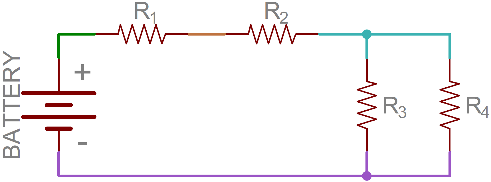

これが、直列と並列の違いを理解するための下地の半分にあたる。
残る半分は、**回路の中を電流がどう流れるか**を理解することである。
[電流](./voltage-current-resistance-and-ohms-law.md)は、回路の中で電圧の高いところから低いところへ流れる。
電流は、通れる経路があればそのすべてを使って、電圧が最も低い点（多くの場合グラウンドと呼ばれる）へ向かって流れようとする。
先ほどの回路を例にとると、電池のプラス端子からマイナス端子まで、電流は次の図のように流れる。

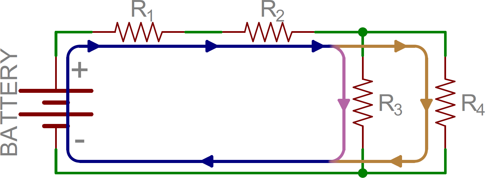

R1とR2のあいだのように、入ってくる電流と出ていく電流が同じ量になっているノードがある一方で、R2、R3、R4がつながる三又のノードでは、1本だった電流（青色）が2本に分かれている。
この違いこそが、直列と並列を分ける鍵である。

### 直列回路の定義

2つの部品が同じノードを共有し、なおかつ**同じ電流**が流れているとき、その2つは**直列**につながっているという。
抵抗を3つ直列につないだ回路を例に見てみよう。

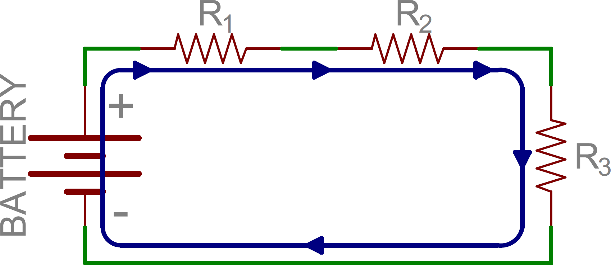

この回路で電流が流れる経路は1本しかない。
電池のプラス端子を出た電流は、まずR1を通り、続けてR2、R3へと流れ、最後に電池のマイナス端子へ戻る。
電流が通れる経路が1本しかないことに注目してほしい。
このとき、これらの部品は直列につながっているという。

## 並列回路

### 並列回路の定義

部品どうしが*2つの*ノードを共有しているとき、その部品は**並列**につながっているという。
抵抗3本を電池に並列につないだ回路図を見てみよう。

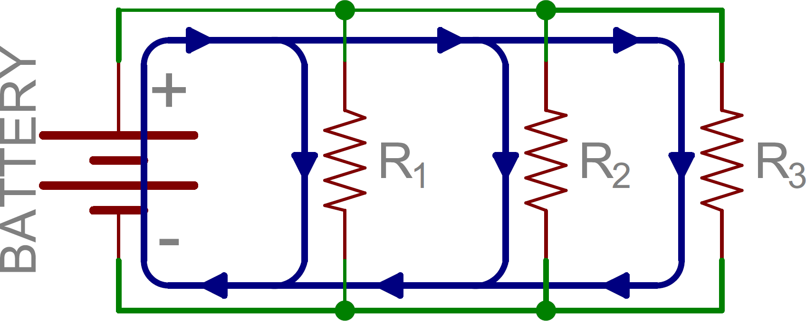

電池のプラス端子から出た電流は、R1にも、R2にも、R3にも流れる。
電池とR1をつなぐノードは、他の抵抗ともつながっている。
それぞれの抵抗のもう一方の端も同様に1つにまとまり、電池のマイナス端子へと戻っていく。
電池に戻るまでに電流が通れる経路は3本あり、このとき対応する抵抗どうしは並列につながっているという。

直列につながれた部品にはすべて同じ電流が流れるのに対し、並列につながれた部品にはすべて同じ電圧がかかる。
「直列と電流」「並列と電圧」が対応すると覚えるとよい。

### 直列と並列を組み合わせる

ここまでの構成は組み合わせられる。
次の図でも抵抗3本と電池を使っているが、電池のプラス端子を出た電流はまずR1を通る。
R1のもう一方の端でノードが分かれ、電流はR2とR3の両方へ流れられるようになる。
R2とR3を通った電流はその先でまた1つにまとまり、電池のマイナス端子へ戻る。

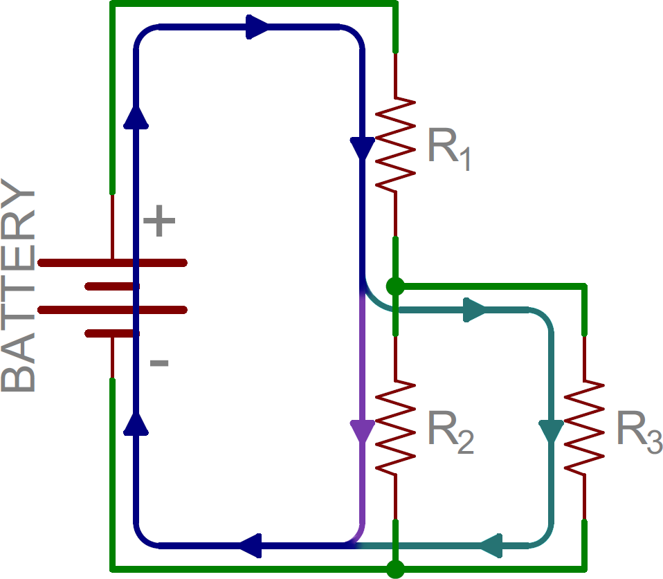

この例では、R2とR3が互いに並列につながっており、そのR2とR3の並列部分に対してR1が直列につながっている。

## 直列回路の合成抵抗を計算する

もう少し実用的な話をしよう。
抵抗を直列や並列につなぐと、そこを流れる電流の様子が変わる。
たとえば10Vの電源を10kΩの抵抗につないだ場合、[オームの法則](./voltage-current-resistance-and-ohms-law.md)から1mAの電流が流れることがわかる。

ここに、もう1本10kΩの抵抗を直列に追加し、電源電圧はそのままにしたとする。
抵抗値が2倍になった分、電流は半分になる。

つまり、電流が通れる経路は相変わらず1本のままで、その経路をより通りにくくしただけということになる。
どれだけ通りにくくなったかというと、10kΩ + 10kΩ = 20kΩである。
抵抗を直列につないだときの合成抵抗は、こうして**値をそのまま足し合わせる**だけで求められる。

これを一般化すると、任意のN個の抵抗を直列につないだときの合成抵抗は、それぞれの値の総和になる。

\\[ R_{合成} = R_1 + R_2 + \cdots + R_N \\]

## 並列回路の合成抵抗を計算する

では並列につないだ抵抗はどうか。
直列よりも少しだけ複雑だが、それほど難しくはない。
先ほどと同じく10Vの電源と10kΩの抵抗から始め、今度はもう1本の10kΩを直列ではなく並列に追加する。
これで電流が通れる経路が2本になる。
電源電圧は変わっていないので、オームの法則により最初の抵抗には相変わらず1mAが流れる。
しかし2本目の抵抗にも同じく1mAが流れるため、電源全体から見ると合計2mAとなり、最初の1mAから倍増する。
電流が倍になったということは、合成抵抗が半分になったことを意味する。

10kΩ‖10kΩ = 5kΩ（「‖」は「並列に」を表す記号）と言えるが、常に同じ値の抵抗が2本とは限らない。
そこで、任意の本数の抵抗を並列につないだときの合成抵抗は、次の式で求められる。

\\[ \frac{1}{R_{合成}} = \frac{1}{R_1} + \frac{1}{R_2} + \cdots + \frac{1}{R_N} \\]

逆数の計算が面倒なときは、抵抗が2本の場合に限り、「和分の積」と呼ばれる方法も使える。

\\[ R_{合成} = \frac{R_1 \times R_2}{R_1 + R_2} \\]

ただし、この方法が使えるのは1回の計算につき抵抗2本までである。
3本以上を組み合わせたいときは、まずR1とR2の並列合成値を求め、その結果と3本目の抵抗をあらためて「和分の積」で計算すればよい。
本数が多い場合は、逆数の式のほうが手間が少ないこともある。

## 実験その1：抵抗を直列につないでみる

用意するもの:

- 数本
- マルチメーター
- ブレッドボード

ここまでの説明どおりに実際に動くことを、簡単な実験で確かめてみよう。

まずは10kΩの抵抗を直列につなぎ、値がそのまま足し合わされる様子を見る。
[ブレッドボードを使って](./how-to-use-a-breadboard.md)図のとおりに抵抗を1本差し、テスターで抵抗値を測る。
10kΩと表示されることはわかりきっているが、これは「機材が壊れていないか」を確かめる意味もある確認作業だと思ってほしい。
世界が特に変わっていないことを確認できたら、同様にもう1本を、それぞれのリードがブレッドボード上で電気的につながる形で追加し、もう一度測ってみる。
今度はテスターがおよそ20kΩに近い値を示すはずである。

測定値が抵抗に表示された値とぴったり一致しないこともある。
抵抗には**誤差**（許容差）と呼ばれる特性があり、表示値に対して一定の割合だけ前後する可能性がある。
そのため9.99kΩや10.01kΩと表示されることもあるが、正しい値に近ければ特に問題はない。

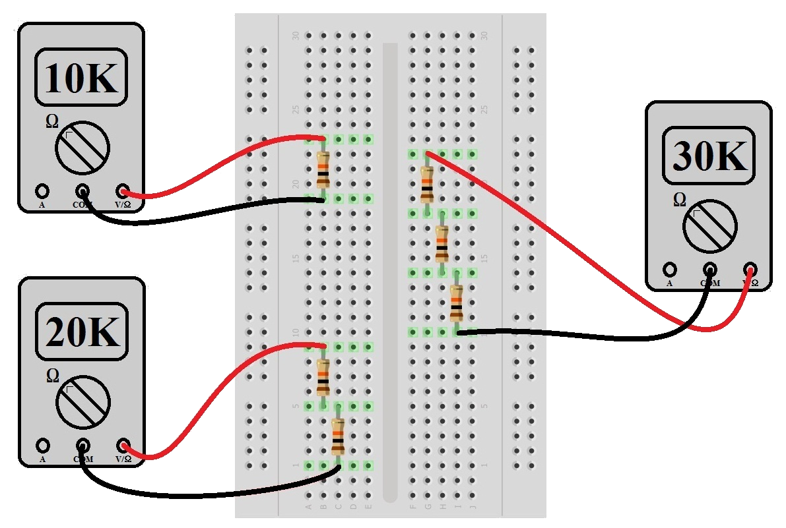

抵抗がなくなるか、次に何が起きるか完全に予想がつくようになるまで、同じ手順を繰り返してみてほしい。

## 実験その2：抵抗を並列につないでみる

続いて、**並列**につないだ場合を試す。
先ほどと同様に10kΩの抵抗を1本差す（単体で10kΩに近い値が出ることはもう納得してもらえたと思う）。
2本目の10kΩ抵抗を、それぞれのリードが電気的に同じ行につながるように注意しながら、1本目の隣に差す。
ただし測定する前に、「和分の積」または逆数の式を使って、新しい抵抗値がいくつになるはずかを計算しておく（ヒント：5kΩになる）。
そのうえで実際に測定する。
5kΩに近い値になっているだろうか。
なっていなければ、抵抗を差した穴が正しいかどうかを確認してほしい。

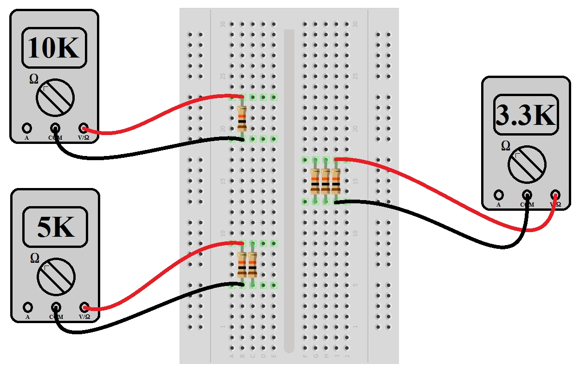

同じ実験を3本、4本、5本の場合でも繰り返してみよう。
計算値と測定値はそれぞれ3.33kΩ、2.5kΩ、2kΩに近くなるはずである。
思ったとおりの結果になっただろうか。
ならなければ配線を見直し、なったならここまでの内容は理解できている。

## 抵抗を直列や並列につなぐときの経験則

抵抗の組み合わせに工夫が必要になる場面もある。
たとえば特定の基準電圧を作りたいとき、必要になる抵抗比は「標準的な」値の組み合わせにならないことが多い。
非常に高い精度の抵抗を入手すること自体は可能でも、発注してから届くまでの日数や、特注品の価格を考えると現実的でないこともある。
そんなときは、手持ちの抵抗を組み合わせて必要な値を自分で作り出せる。

### コツ1：同じ値の抵抗を並列にする

同じ値*R*の抵抗を*N*本並列につなぐと、合成抵抗は*R/N*になる。
たとえば2.5kΩの抵抗が必要なのに、手元に10kΩしかないとする。
10kΩを4本並列につなげば、10kΩ/4 = 2.5kΩが得られる。

### コツ2：許容できる誤差を把握する

自分の回路がどこまでの誤差を許容できるかを把握しておく。
たとえば3.2kΩの抵抗が必要なとき、10kΩを3本並列につなぐと3.3kΩになり、必要な値との誤差は約4%になる。
回路の要求精度が4%より厳しい場合は、手持ちの10kΩ抵抗を一本ずつ測定し、その中から値の低いものを選ぶという方法もある（抵抗自体にも個体差があるため）。
理論上、手持ちの10kΩがすべて誤差1%のものであれば、3.3kΩまでしか近づけられない。
ただし、部品メーカーの製造誤差によって実際にはそれより低い値の個体が混じっていることもあるので、一通り測ってみる価値はある。

### コツ3：定格電力も直列接続と並列接続で変わる

抵抗を直列や並列につなぐときの考え方は、定格電力についても同じように働く。
たとえば2W定格の100Ωの抵抗が必要なのに、手元に1kΩで定格1/4W（¼W）の抵抗しかないとする。
1kΩを10本並列にすれば100Ω（1kΩ/10 = 100Ω）が得られ、定格電力も10×0.25W = 2.5Wになる。
きれいな解決策とは言えないが、急場をしのぐには十分である。

異なる値の抵抗を並列に組み合わせる場合は、合成抵抗と定格電力の両面で、もう少し注意が必要になる。

### コツ4：異なる値の抵抗を並列にする

値の異なる2つの抵抗を並列につないだときの合成抵抗は、必ず小さいほうの抵抗値より小さくなる。
2つの抵抗値のちょうど中間くらいになると考えてしまいがちだが、それは誤りである（1kΩ‖10kΩは5kΩ前後にはならない）。
並列合成抵抗は、常に値の小さいほうの抵抗に引き寄せられる。
このコツ4は、繰り返し頭に入れておく価値がある。

### コツ5：並列接続での電力損失

値の異なる抵抗を並列に組み合わせた場合、それぞれに流れる電流が異なるため、消費される電力も均等には分かれない。
先ほどの1kΩ‖10kΩの例で言えば、1kΩのほうには10kΩの10倍の電流が流れる。
オームの法則により[電力 = 電圧 × 電流](./voltage-current-resistance-and-ohms-law.md)なので、1kΩの抵抗は10kΩの抵抗の10倍の電力を消費することになる。

コツ4とコツ5からわかるのは、値の異なる抵抗を並列に組み合わせるときほど注意深く扱う必要があるということである。
一方、値が同じ場合にはコツ1やコツ3のような単純な近道が使える。

## コンデンサの直列接続と並列接続

コンデンサを組み合わせる考え方は、抵抗の場合とちょうど逆になる。
奇妙に聞こえるかもしれないが、これは事実である。

**コンデンサ**は、ごく近い間隔で向かい合った2枚の電極板であり、その基本的な働きは大量の電子を蓄えることにある。
静電容量が大きいほど、蓄えられる電子の量も多くなる。
電極板の面積を大きくすれば、電子が存在できる物理的な空間が増える分、静電容量は大きくなる。
逆に電極板の間隔を広げると、電極間の電界が弱くなる分、静電容量は小さくなる。

ここで、10µFのコンデンサを2つ直列につなぎ、どちらも充電済みだとする。

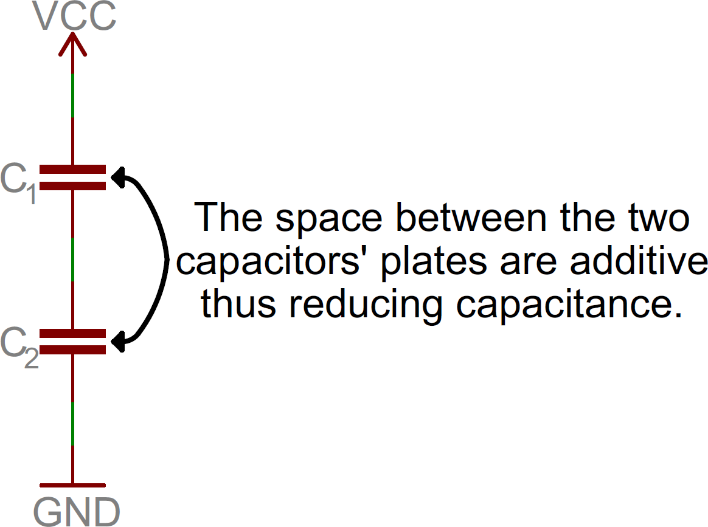

直列回路では電流の経路が1本しかないことを思い出してほしい。
したがって、下側のコンデンサから放電される電子の数は、上側のコンデンサに入っていく電子の数と同じになるはずである。
つまり、静電容量が増えたわけではない。

実際には、それどころか事情はもっと悪い。
コンデンサを直列につなぐと、2つのコンデンサそれぞれの電極間隔が足し合わされる形になり、実質的に電極板の間隔を広げたのと同じことになる。
そのため合成容量は20µFにも10µFにもならず、5µFになる。
つまり、コンデンサを直列につないだときの合成容量は、抵抗を並列につないだときと同じ計算式で求められる。
「和分の積」と逆数の式のどちらも、コンデンサの直列合成に使える。

コンデンサを直列につなぐことに意味がないように思えるかもしれないが、それだけではない。
直列にすることで、電池を直列につないだときと同じように、耐えられる電圧（定格電圧）は2倍になる。

**コンデンサを並列に**つなぐ場合は、抵抗を直列につなぐときと同じように、特別な計算をせずそのまま値を足し合わせるだけでよい。
これは、並列につなぐことで電極板の間隔を変えずに面積だけを実質的に増やしたことになるためである。
面積が増えれば、その分だけ静電容量も増える。

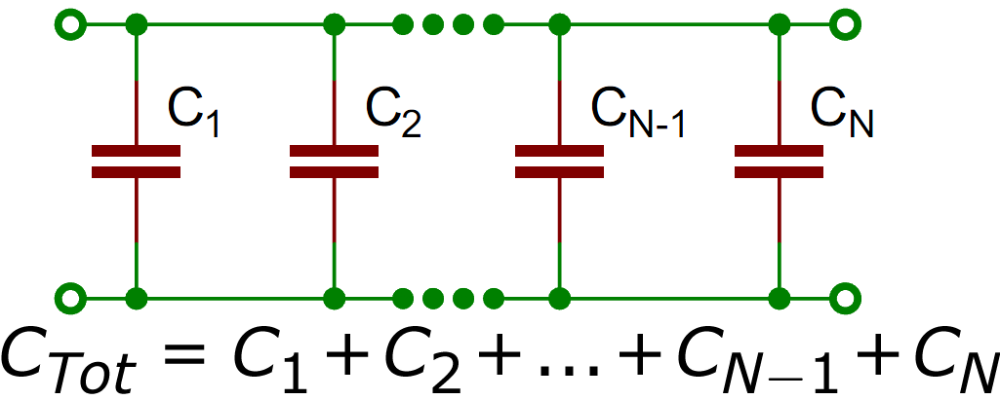

## 実験その3：コンデンサの充電を観察する

用意するもの:

- 10kΩの抵抗1本
- 100µFのコンデンサ3個
- 単3形3本用の電池ボックス
- 単3形電池3本
- ブレッドボード
- テスター
- クリップ付きリード線

直列や並列につないだコンデンサの動きを、実際に確かめてみよう。
テスターで静電容量を直接測るのは難しいため、抵抗の実験より少し手間がかかる。

まず、コンデンサが0ボルトの状態から充電されるときに何が起きるかを見ておく。
一方のリードから電流が流れ込み始めると、同じ量の電流がもう一方のリードから流れ出る。
コンデンサに直列の抵抗が入っていなければ、この電流はかなり大きくなりうる。
いずれにせよ、コンデンサの電圧が印加電圧と等しくなるまで電流は流れ続け、両者の電圧が等しくなった時点で電流はゼロになる。

上で述べたとおり、コンデンサに直列の抵抗がないと流れる電流は非常に大きくなり、充電にかかる時間もミリ秒単位、あるいはそれ以下と非常に短くなる。
この実験では充電の様子をじっくり観察したいので、10kΩの抵抗を直列に入れて、動きを目で追える速さまで遅くする。
ただしその前に、**RC時定数**について説明しておく必要がある。

\\[ \tau = R \times C \\]

この式が言っているのは、秒単位の時定数（記号τ、タウと読む）が、オーム単位の抵抗値とファラド単位の静電容量の積に等しいということである。

## 実験その3（続き）

この実験の最初の段階では、10kΩの抵抗1本と100µF（0.0001ファラド）のコンデンサ1個を使う。
この2つの組み合わせで、時定数は1秒になる。

\\[ \tau = 10\,\text{k}\Omega \times 100\,\mu\text{F} = 1\,\text{秒} \\]

100µFのコンデンサを10kΩの抵抗を通して充電すると、1時定数（この場合1秒）が経過した時点で、コンデンサの電圧は電源電圧のおよそ63%まで上昇する。
5時定数（この場合5秒）が経過すると、コンデンサは電源電圧のおよそ99%まで充電され、その電圧変化はおおむね下のグラフのような曲線を描く。

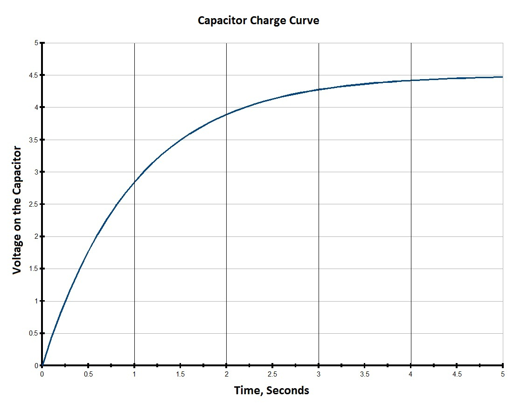

ここまでの内容を踏まえて、次の回路図のとおりに配線する（コンデンサの極性を間違えないように注意すること）。

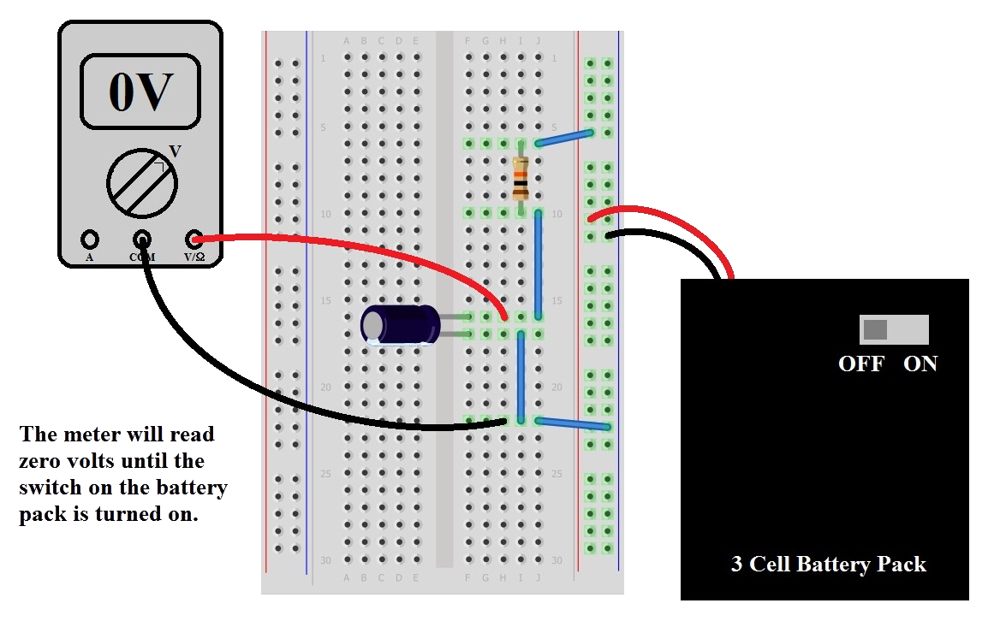

テスターを電圧測定モードにしたまま、スイッチを入れた状態で電池ボックスの出力電圧を確認する。
これが電源電圧であり、4.5V前後になっているはずである（電池が新しければ、もう少し高くなる）。
続いて、電池ボックスのスイッチが「OFF」になっていることを確認してからブレッドボードに接続する。
赤と黒のリード線を正しい位置に接続することにも注意する。
コンデンサの足にワニ口クリップでテスターのプローブを挟むと測定しやすい（足を少し開いておくとさらにやりやすい）。

配線に問題がなく、テスターも電圧測定モードになっていることを確認したら、電池ボックスのスイッチを「ON」にする。
5秒ほど経つと、テスターの表示は電池ボックスの電圧にかなり近い値になるはずであり、これで先ほどの式が正しいことが確認できる。
今度はスイッチを切ってみる。
電圧はほとんど下がらずに保たれているはずである。
これは、コンデンサを放電させる経路がなく、回路が開いたままになっているためである。
コンデンサを放電させるには、別の10kΩ抵抗を並列に接続すればよい。
5秒ほどで、電圧はほぼゼロに戻る。

## 実験その3（さらに続き）

ここからが本題である。
まず、コンデンサ2個を直列につないでみる。
これは抵抗を2本並列につないだときと似た結果になるはずだと述べた。
そうであれば、「和分の積」を使って次のように予想できる。

\\[ C_{合成} = \frac{100\,\mu\text{F} \times 100\,\mu\text{F}}{100\,\mu\text{F} + 100\,\mu\text{F}} = 50\,\mu\text{F} \\]

これが時定数にどう影響するだろうか。

\\[ \tau = 10\,\text{k}\Omega \times 50\,\mu\text{F} = 0.5\,\text{秒} \\]

この予想を踏まえて、1個目のコンデンサに2個目を直列に追加し、テスターがゼロボルト（またはそれに近い値）を示していることを確認してから、スイッチを「ON」にしてみる。
電池ボックスの電圧まで充電されるのにかかった時間は、およそ半分になっただろうか。
これは、合成容量が半分になったためである。
電子を蓄える「タンク」が小さくなった分、満タンになるまでの時間も短くなる。
念のため3個目のコンデンサも直列に追加して試してみるとよいが、結果はもう予想がつくはずである。

次はコンデンサを並列につないでみる。
これは抵抗を直列につないだときと同じだと述べたので、合成容量は200µFになるはずである。
そうすると、時定数は次のようになる。

\\[ \tau = 10\,\text{k}\Omega \times 200\,\mu\text{F} = 2\,\text{秒} \\]

つまり、並列につないだコンデンサが電源電圧の4.5Vまで充電されるのを目で確認するには、およそ10秒かかることになる。

証拠を示すために、この実験の最初に使った回路（10kΩの抵抗1本と100µFのコンデンサ1個の直列回路）に戻る。
このコンデンサはおよそ5秒で充電が完了することはすでにわかっている。
ここに2個目のコンデンサを並列に追加する。
テスターがほぼゼロボルトを示していることを確認し（ゼロでなければ抵抗を使って放電させる）、電池ボックスのスイッチを「ON」にする。
充電にかかる時間はかなり長くなったはずである。
予想どおり、電子の「タンク」が大きくなった分、満タンになるまでの時間が延びている。
納得できたら、3個目の100µFコンデンサも追加して、さらに長い充電時間を観察してみてほしい。

## インダクタの直列接続と並列接続

インダクタ（コイル）を直列や並列に組み合わせる必要がある場面はそれほど多くないが、まったくないわけでもない。
話を完結させるために、ここでも簡単に触れておく。

基本的には抵抗と同じように組み合わされる。
つまり、直列につなぐときは値をそのまま足し合わせ、並列につなぐときは「和分の積」で計算する。
やっかいなのは、複数のインダクタを近くに配置すると、意図してもしていなくても、磁界が互いに干渉し合ってしまう場合があることである。
そのため、複数のインダクタを組み合わせるよりも、単体の部品で済ませるほうが望ましい。
ただし、市販のインダクタの多くは磁界の干渉を防ぐシールドが施されている。

いずれにせよ、インダクタも抵抗と同じように足し合わされると理解しておけば十分であり、それ以上の詳細はこのチュートリアルの範囲を超える。

## まとめ

直列回路と並列回路の基礎を理解できたところで、関連するチュートリアルにも目を通してみてほしい。

- [分圧回路](./voltage-dividers.md)：もっとも基本的で、繰り返し登場する回路の1つが分圧回路である。ここで学んだ内容がそのまま土台になる。
- [Arduinoとは何か](./what-is-an-arduino.md)：回路の基礎を身につけたら、Arduinoのようなマイコンボードの学習に進むこともできる。
- [スイッチの基礎](./button-and-switch-basics.md)：このチュートリアルでは扱わなかったが、スイッチもほぼすべての電子工作プロジェクトに登場する重要な部品である。
- [LilyPadの基礎：導電糸で縫う](./lilypad-basics-e-sewing.md)：回路はブレッドボードと配線だけとは限らない。E-テキスタイルでは、導電糸を使ってLEDなどの電子部品を布や衣類に縫い込む。

タグ: 概念、電気工学

---

出典：[Series and Parallel Circuits](https://learn.sparkfun.com/tutorials/series-and-parallel-circuits)（SparkFun Learn）を日本語に翻訳し、再構成した。
原文は [CC BY-SA 4.0](https://creativecommons.org/licenses/by-sa/4.0/) ライセンスで公開されており、本ページも同ライセンスの下で提供する。
