# サウンドページの作り方

インタラクティブなアート作品を作る準備はできただろうか。

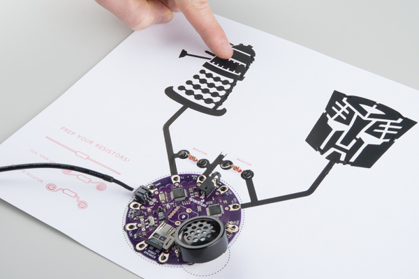

準備ができたなら、さっそく始めよう。

[Bare Conductive Paint](https://www.sparkfun.com/products/11521)のチューブを使い、形やシルエット、模様を描いていく。
インクを[LilyPad MP3ボード](https://www.sparkfun.com/products/11013)に接続してさえおけば、作品にタッチして反応させることができる。
シルエットの一つに触れると、スピーカーから音が鳴る。
塗料は確かに電気を通すが、心配は要らない。流れる電流はごくわずかで、感電することはない。

このチュートリアルは、ElectriCute!で紹介されたBare Conductive Paint Wallをもとにしている。

## 必要な部品

このチュートリアルに沿って進めるには、いくつかの部品が必要になる。

さらに、次のものも用意する。

- スポンジブラシ
- キャンバス（紙、厚紙など）
- ステンシル（シルエットを作りたい場合。もちろん自由に手描きしても構わない）

以降のガイドで参照しやすいよう、必要な部品には写真にラベルを付けてある。

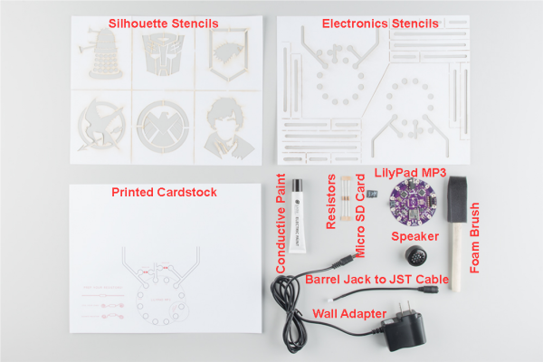

## 参考になるチュートリアル

サウンドページキットに取りかかる前に、そこで使われている技術について読んでおくとよい。

- [Arduinoとは何か](./what-is-an-arduino.md) — LilyPad MP3ボードはArduinoで動作する。ボードを別の用途にプログラムし直したい場合に役立つ
- [Getting Started with the LilyPad MP3 Player](https://learn.sparkfun.com/tutorials/getting-started-with-the-lilypad-mp3-player) — LilyPad MP3ボードがどんなものかを学べる。本来は導電性の糸を使い、ボード周囲のパッドに縫い付けて使うものだが、このチュートリアルでは代わりに導電性塗料を使う

## 電子部品を取り付ける

**重要：** 作業を始める前に、まずこの節の説明をすべて読んでおくこと。
塗料が完全に乾いてしまわないうちに電子部品を取り付ける必要があるため、比較的手早く作業を進めなければならない。
塗料が乾いてしまった場合は、電子部品を取り付ける際にあらためて塗料を足せばよい。

_このチュートリアルでは印刷済みの厚紙を使うが、壁のようなどんな面でも使うことができる。_

印刷済みの厚紙が手元にない場合は、アートワークをダウンロードできる。
ファイルをダウンロードし、厚紙や紙に印刷するだけでよい。

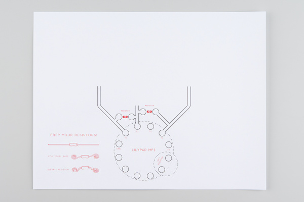

_印刷済みの厚紙_

このチュートリアルと同じ方法でステンシルを作りたい場合は、粘着力が強すぎないラベル用紙を購入する必要がある。
ここではonlinelabels.comのラベル用紙を使った。
あわせて、こちらで用意したステンシルをダウンロードし、ラベルシートに印刷する。
ステンシルを切り抜くにはX-Actoナイフを使えばよい（今回はたくさん作るためレーザー彫刻機を使った）。

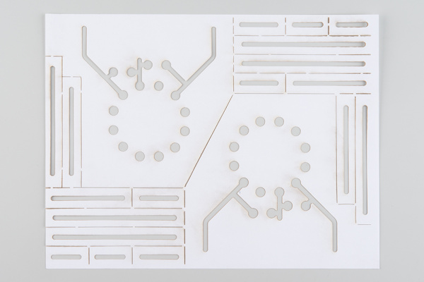

_電子部品用ステンシル_

### LilyPadのフットプリントを作る

最初に行うのは、電子部品を貼り付ける場所として、導電性インクでLilyPadボードのフットプリントを作ることである。

LilyPad MP3のフットプリント用ステンシルを、他のステンシルから切り離す。
フットプリントステンシルの台紙をはがし、輪郭に重ねて配置する。
トレースがページの上側を向くようにすること。これがシルエットとつながることになる。

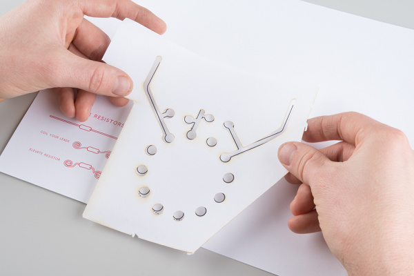

ステンシルの上に導電性インクを絞り出し、スポンジブラシでステンシルの内側を塗りつぶす。
ステンシルの隙間が完全にインクで覆われていることを確認すること。
むらがあると、電気の通りが悪くなってしまう。

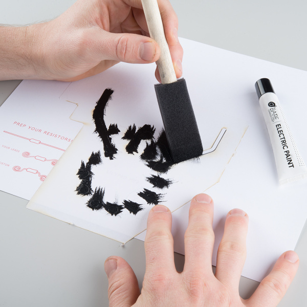

塗料がまだ濡れているうちに、ステンシルを慎重にページからはがす。

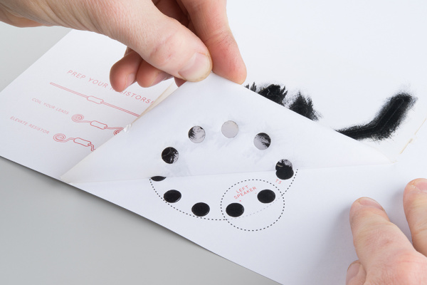

### LilyPadボードを配置する

塗料が乾いてしまっている箇所があれば、LilyPad MP3ボードを置く各丸印に導電性塗料を一滴ずつ足しておくとよい。

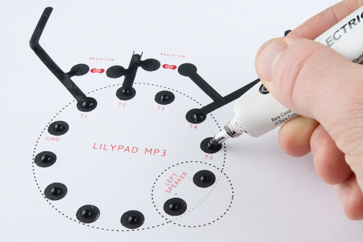

LilyPad MP3ボードの端にある穴が、ステンシルで作った塗料の丸印に重なるよう、慎重に配置する。

**重要：** SDカードスロット（「RIGHT SPEAKER」とラベル付けされた穴の近くにある）が下向きに、ヘッドホンジャックが上向きになっていることを確認すること。
「LEFT SPEAKER」というラベルは、厚紙上の「LEFT SPEAKER」の文字と向かい合うようにする。

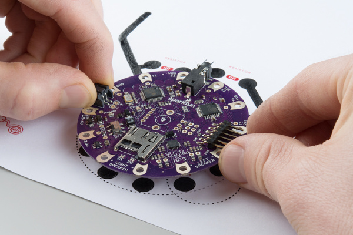

塗料を穴の中に少し押し込むようにする。
これにより、ボードから触れられるアートワークまで電気が流れるようにする。

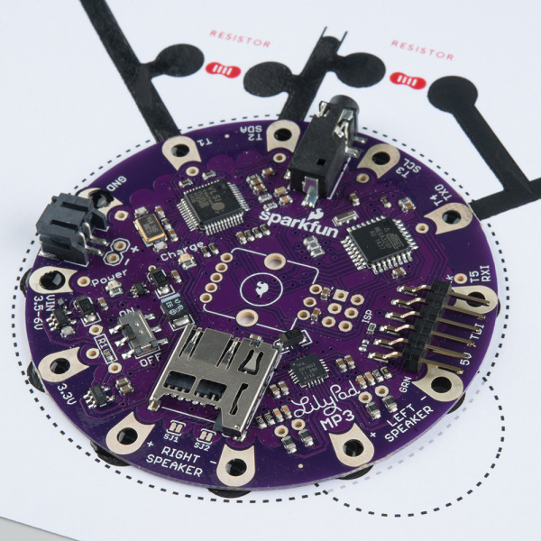

先ほど導電性インクで作ったトレースと、ボードとの間に良好な電気的接続を作りたい。
そこで、LilyPadボード周囲の12個の穴それぞれに、導電性塗料を一滴ずつ足す。

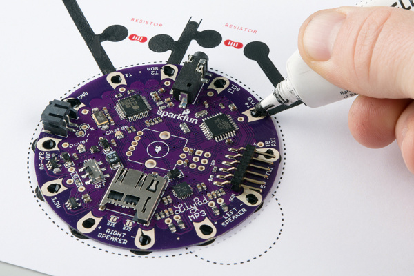

### スピーカーを追加する

本格的な音を出したい場合は、LilyPadボード上部のヘッドホンジャックに大型のスピーカーセットを接続することもできる（この場合、以下のステップは読み飛ばして構わない）。
LilyPad MP3ボードに小型スピーカーを追加して音を出すこともできる。

小型スピーカーを追加したい場合は、「LEFT SPEAKER」の各穴に導電性塗料を一滴ずつ足す。

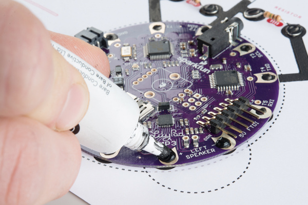

LilyPadの穴の中の塗料がまだ濡れているうちに、スピーカーのピンを「Left Speaker」とラベル付けされた穴に挿す。
スピーカーの+と-が穴の+と-に合っているかどうかは気にしなくてよい。

> **注意：** スピーカーを固定したい場合は、スピーカーの下にホットボンドを一滴垂らしてもよい。電子部品には影響しないので心配は要らない。

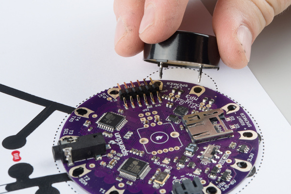

> **注意：** スピーカーは穴の中で少しぐらつく。次にスピーカーに触れる前に、塗料が完全に乾く（数時間かかる）まで待つこと。チュートリアルの残りの作業は進めてよいが、スピーカー周りの取り扱いには注意すること。

**重要：** スピーカーのピンが、LilyPadボード上の「5V FTDI」とラベル付けされたピンに触れないようにすること。

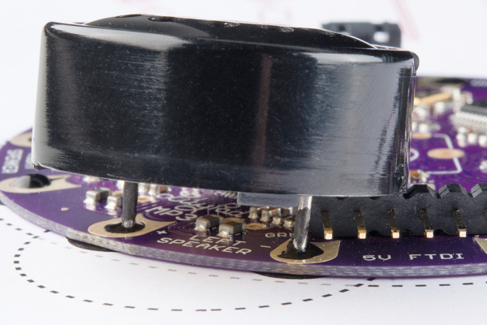

### 抵抗を追加する

ペンチ、ピンセット、あるいは指を使い、2本の抵抗のリード線の端を慎重に丸めて小さならせん状にする。

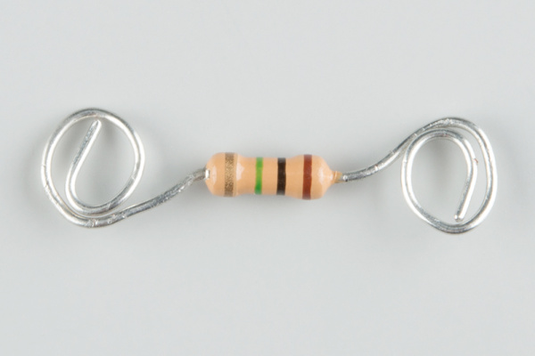

丸めた端を下向きに曲げ、平らにつぶして、抵抗本体が少し浮いた状態になるようにする。

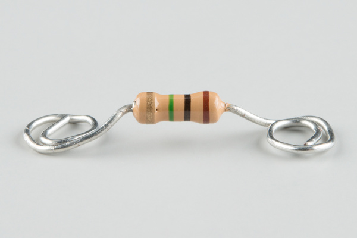

印刷済みの厚紙に赤色で示されている抵抗の設置位置を見つける。
抵抗の設置位置を囲む円形のパッドそれぞれに、塗料を一滴足す。

抵抗の一本を、T1のトレースとT2のトレース（このラベルはLilyPad MP3ボード上で確認できる）をつなぐように配置する。
印刷済みの厚紙を使っている場合、抵抗の設置位置は赤色で示されている。
2本目の抵抗は、T2のトレースとT4のトレースをつなぐように配置する。

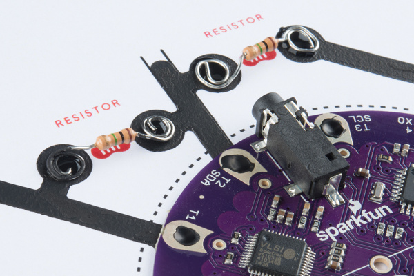

LilyPadボードのときと同様に、丸めた抵抗のリード線それぞれの上にも塗料を一滴足し、その場に固定されるようにする。

**待つ：** 次のステップに進む前に、塗料が乾くまで少なくとも15分待つこと。

## アートワークを作る

### シルエットを作る

次に行うのは、サウンドページに使う2つのステンシルを選ぶことである。
自分でステンシルを印刷したり、好きな絵を自由に作ったりしても構わない。何しろこれはアートなのだから。
ただし、次の点は必ず守ること。

1. 作成するものは、すべてインクで完全に塗りつぶされていること。むらのある部分は電気を通さない。
2. 作った形や絵は、先ほど作ったフットプリントから伸びるインクのトレースにつながっていること。つながっていなければ電気が通らず、タッチしても反応しない。

電子部品用のステンシルと同様に、シルエット用のステンシルもラベルシートで作った。
こちらで用意したものを印刷してもよいし、自分でステンシルを作っても構わない。

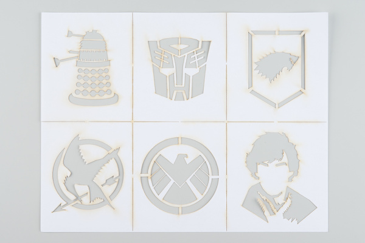

_シルエット用ステンシル_

ステンシルを一つ選び、シートから切り離して台紙をはがす。
ページ上の好きな位置に貼り付ける（LilyPadのフットプリントから伸びるトレースのどれかに近い位置にするとよい）。

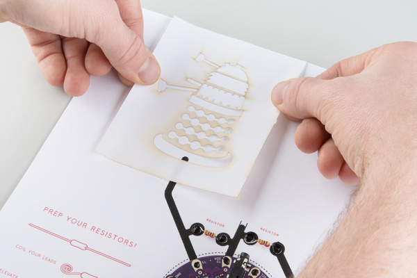

フットプリント用ステンシルのときと同様に、スポンジブラシでインクを塗り、ステンシルを完全に塗りつぶす。

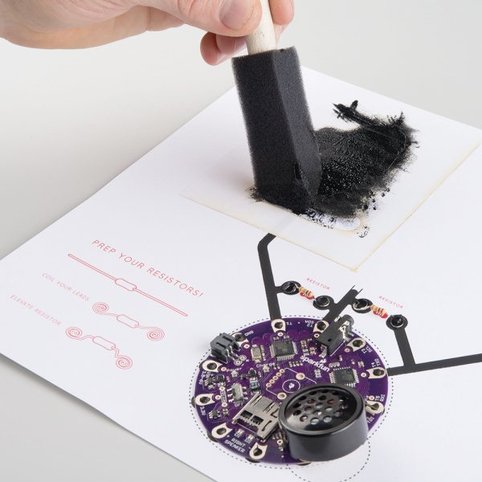

塗料がまだ濡れているうちに、すぐに（ただし慎重に）ステンシルをページからはがす。
ステンシルの一部が破れて残ってしまった場合は、ピンセットで慎重に取り除くとよい。

自分のステンシルアートを眺めて楽しんでほしい。

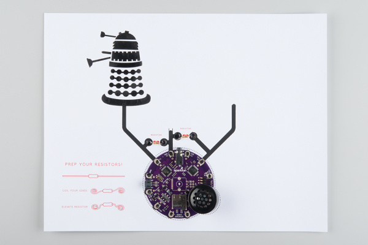

同じ手順を繰り返し、2つ目のシルエットを追加する。

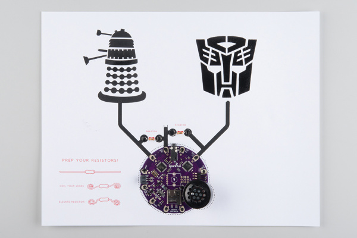

### 塗り残しを埋める

導電性塗料の一部がLilyPad MP3ボードにつながっていないと、そこに触れても音は鳴らない。

筆や導電性塗料のチューブを使い、シルエットの中の黒い部分（少なくとも、タッチできるようにしたい部分）をすべてつなげる。

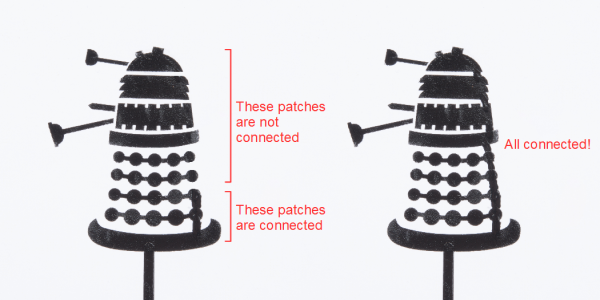

**待つ：** 次のステップに進む前に、塗料が乾くまで少なくとも15分待つこと。

### シルエットをトレースにつなげる

シルエットが、LilyPad MP3ボードにつながるトレースに（もちろん導電性塗料で）接続されていることを確認する。
たとえば下の画像のシルエットでは、顔の周りの塗料は導電性塗料でつながっている（目の上の部分を除く。ここは塗料でつなげない限りタッチしても反応しない）。
しかし、シルエット全体はまだトレースにつながっていない。

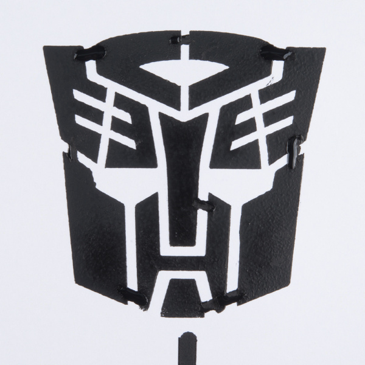

トレースとシルエットをつなぐために導電性塗料で線を引く必要がある場合は、直線用のステンシルを使うとよい。

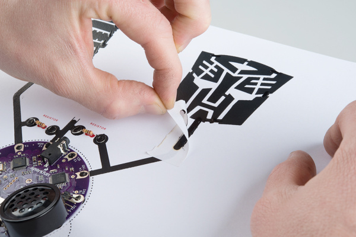

**待つ：** ここでもう一度、次に進む前に塗料が乾くまで少なくとも15分待つこと。その間、自分の作品を眺めて楽しんでほしい。

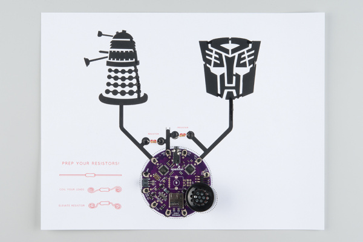

### 作品を保護する

作品を保護するために、透明のスプレー塗料のようなシーラーを使うことができる。
ただし、電子部品にかけすぎないよう注意すること。
たとえばSDカードの接点にかかってしまうと、LilyPad MP3ボードがカードを読み取れなくなることがある。
心配は要らない。透明なコーティングの上からでも、サウンドは問題なく起動できる。

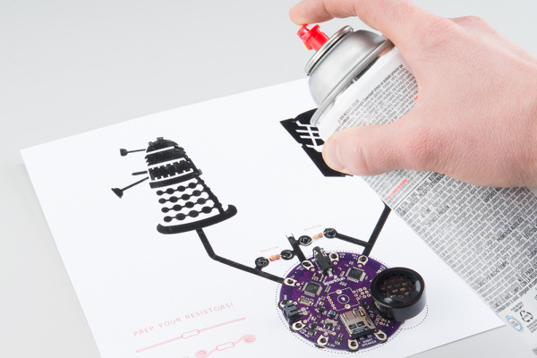

さらに、作品を額装すれば端を保護しつつ、きれいに飾ることもできる。

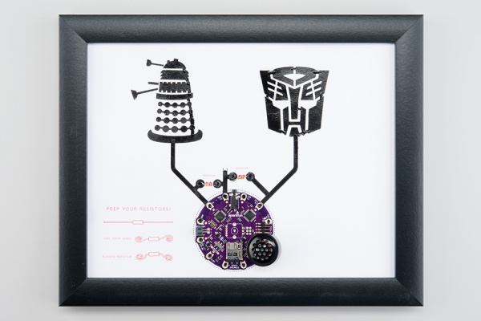

## サウンドを読み込む

作ったシルエットのステンシルに対応するサウンドクリップをいくつか用意した。
自分でサウンドクリップを作る方法を知りたい場合は、「[キットを改造する](#キットを改造する)」の節を参照してほしい。

### カードにサウンドを追加する

サウンドクリップのファイルをダウンロードする。

ファイルを展開する。

各サウンドクリップをダブルクリックして再生し、内容を確認する。
LilyPad MP3ボードが読み取りやすいよう、ファイル名は短く（4文字）してある。参考までに一覧を示す。

| ファイル名 | 内容             |
| ---------- | ---------------- |
| _bots.wav  | Autobots         |
| _dlel.wav  | Dalek            |
| _mkjy.wav  | Mockingjay       |
| _shld.wav  | S.H.I.E.L.D      |
| _shlk.wav  | Sherlock         |
| _wntr.wav  | Winter is coming |

[マイクロSDカードリーダー](https://www.sparkfun.com/products/13004)を使い、カードをコンピュータに挿す。
再生したい2つのサウンドクリップを選び、SDカードにコピーする。

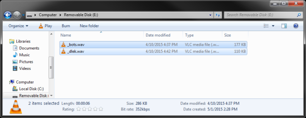

ここが**重要**である。2つのサウンドクリップの名前を変更し、先頭に番号を追加する必要がある。
LilyPad MP3ボードのT1に接続されたシルエットに対応させたいクリップの名前の先頭には「1」を、T4に接続されたシルエットのクリップの名前の先頭には「2」を追加する。

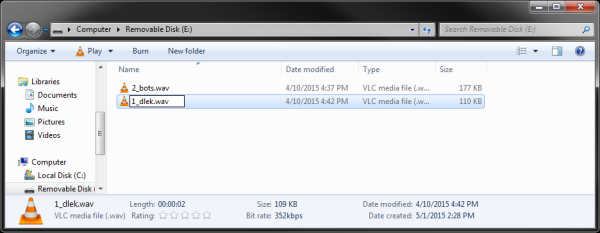

_サウンドクリップのファイル名の先頭に「1」と「2」を追加し、ページ上のシルエットと対応づける_

コンピュータからSDカードを取り出す。

### SDカードを挿入する

コンピュータからSDカードを取り外し、LilyPad MP3ボードに挿入する。

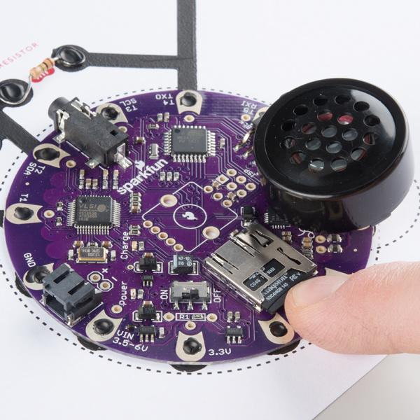

## 作品で遊ぶ

### 電源をつなぐ

[バレルジャックからJSTへの変換ケーブル](https://www.sparkfun.com/products/8734)を、LilyPad MP3ボードのJSTコネクタに接続する。

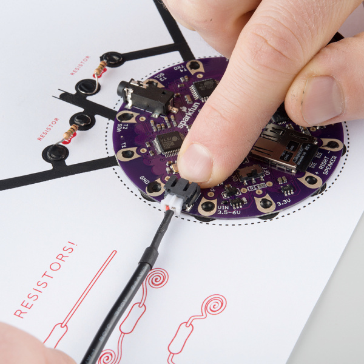

[ACアダプタ](https://www.sparkfun.com/products/12889)をJSTケーブルのバレルジャックに接続し、コンセントに差し込む。

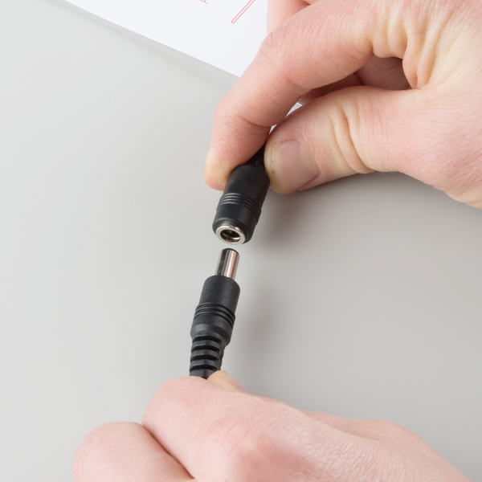

### 電源を入れる

LilyPad MP3ボード上の電源スイッチを見つけ、ONに切り替える。

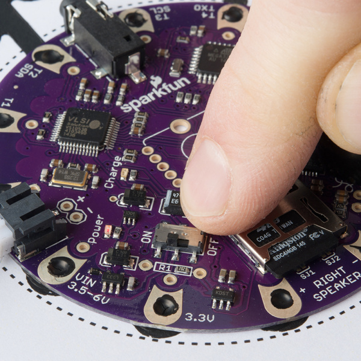

### 遊んでみる

シルエットの一つに触れてみる。
指を離すとすぐに、小さなスピーカーからすばらしいサウンドが聞こえてくるはずである。

### 音が聞こえない場合

こういうこともある。
シルエットに触れて指を離しても小さなスピーカーから音が聞こえない場合は、次の点を確認してほしい。

- スピーカーの下を慎重に確認し、スピーカー自体や塗料が「5V FTDI」とラベル付けされたポートのグラウンドピンに触れていないか確認する。スピーカーを一度取り外し、「5V FTDI」ピンにまで達している塗料の塊を取り除き、「LEFT SPEAKER」のパッドに塗料を追加してからスピーカーを戻す必要があるかもしれない。
- ヘッドホンをヘッドホンジャックに接続し、音が出るか確認してみる。
- 抵抗を揺らしてみて、導電性塗料のトレースにしっかり接続されているか確認する。

## キットを改造する

シルエット2つだけの音出しにはもう飽きただろうか。それなら続きを読んでほしい。
ここでは、キットをさらに活用するための改造方法を簡単に紹介する。

### もっと大きな音で

小型スピーカーが小さすぎる、頼りない、あるいは単に音量が足りないと感じる場合は、自分でスピーカーを用意することもできる。
LilyPad MP3ボード上部にある1/8インチのオーディオジャックは、標準的なヘッドホンやスピーカーのオーディオプラグに対応している。

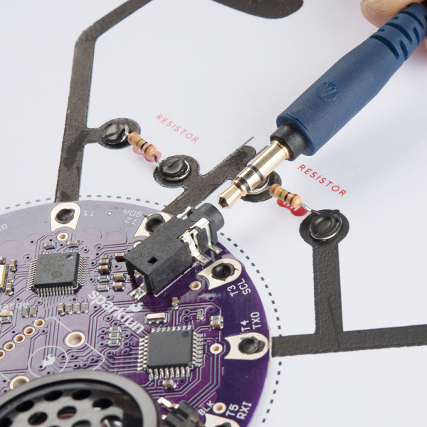

_音量を上げよう。_

### 3つ目のシルエットを追加する

実は、LilyPad MP3ボードは3つ目のシルエットにも対応している。
このチュートリアルではシンプルにするためシルエットを2つにとどめているが、3つ目を追加することもできる。
問題は、3つ目のシルエットを導電性塗料のトレースでT5に、さらに抵抗を挟んでT2につなぐ必要がある点である。
紙に穴を開けて他のトレースの裏側を通す方法と、下の画像のように2つ目のシルエットを迂回する方法のどちらかを選べる。

> **注意：** 3本目の[1MΩ抵抗](https://www.sparkfun.com/products/11853)が必要になる。

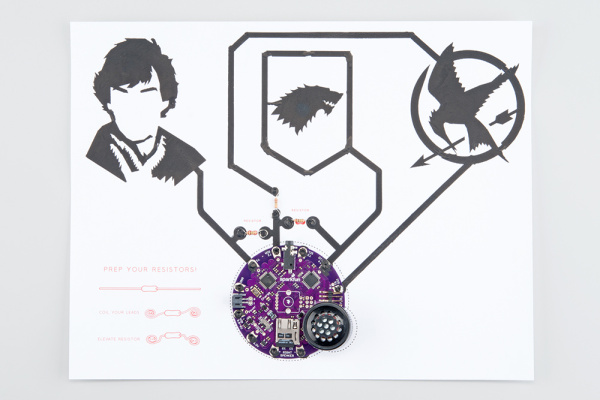

さらに、3つ目のサウンドクリップをSDカードにコピーし、ファイル名の先頭の文字が「3」になるよう変更する必要がある。

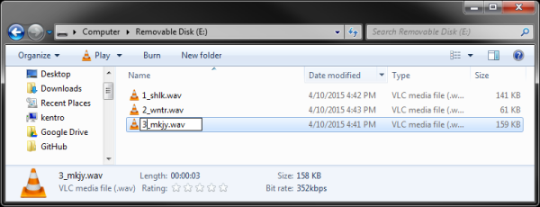

### 新しいサウンドを作る

自分だけのサウンドを作りたくなっただろうか。その方法を紹介する。

まず、何らかの音源を見つける、作る、あるいは録音する。
形式は何でも構わないが、この例ではWAVファイルをダウンロードすることにする。

[Audacity](http://sourceforge.net/projects/audacity/)をダウンロードしてインストールする。
Audacityの使い方を学びたい場合は、[こちらのチュートリアル](http://wiki.audacityteam.org/wiki/Category:Tutorial)を参照してほしい。

特にスピーカーを1つしか使わない場合は、音声をモノラルにすることを推奨する。
これは「Tracks → Stereo Track to Mono」から行える。

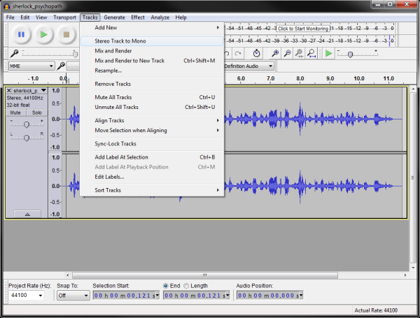

ファイルサイズを小さく抑えたい場合は、サンプリングレートを変更するとよい。
Audacityウィンドウの左下にある「Project Rate」から新しいサンプリングレートを選択する。
サンプリングレートが48000Hz以下であれば、そのクリップはLilyPad MP3で動作するはずである。

Audacityでは、音量の調整、フィルタの追加、オーディオクリップの任意の部分の切り出しも行える。

作業が終わったら、「File → Export Audio」または「Export Selected Audio」を選択する。
Exportウィンドウで「WAV (Microsoft) Signed 16 bit PCM」を選択する。
LilyPad MP3ボードはさまざまなファイル形式を再生できる。対応形式について詳しくは[Getting Started with the LilyPad MP3 Player](https://learn.sparkfun.com/tutorials/getting-started-with-the-lilypad-mp3-player)を参照してほしい。
新しいファイル名は、先頭が番号（1〜3、シルエットの番号に対応）で始まり、6文字以内になるようにすること。

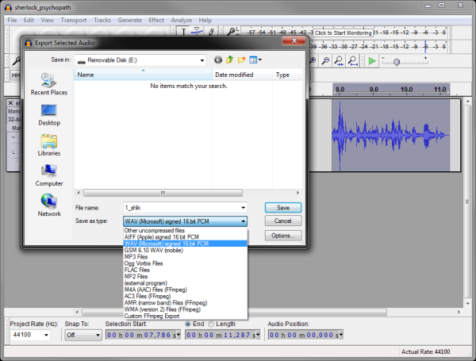

「Save」をクリックすると、ファイル情報を尋ねる別のウィンドウが表示されることがある。
入力してもよいし、「OK」をクリックしてそのまま保存しても構わない。
ファイルをマイクロSDカードにコピーし、LilyPad MP3ボードに挿入する。これで自作のサウンドが再生できるようになる。

### コードをカスタマイズする

LilyPad MP3ボードを再プログラムするには、[5V FTDIブレイクアウトボード](https://www.sparkfun.com/products/9716)が必要になる。

Arduino IDEをダウンロードしてインストールする。方法については[Arduino IDEのインストール](https://learn.sparkfun.com/tutorials/installing-arduino-ide)のチュートリアルを参照してほしい。

Sound Page Kitのソースコードをダウンロードする。

ファイルを解凍し、Sound_Page_Kit/Librariesにある3つのライブラリ（CapacitiveSensor、SdFat、SFEMP3Shield）をインストールする。
Arduinoライブラリのインストール方法については、[こちらのチュートリアル](https://learn.sparkfun.com/tutorials/installing-an-arduino-library)を参照してほしい。

Sound Page Kitに付属するコードは、Sound_Page_Kit/Firmware/Sound_Page_Kit/Sound_Page_Kit.inoにある。
このSound_Page_Kit.inoファイルをArduino IDEで開き、自由に改造してほしい。

LilyPad MP3ボードについてさらに詳しく知りたい場合は、[Getting Started with the LilyPad MP3 Player](https://learn.sparkfun.com/tutorials/getting-started-with-the-lilypad-mp3-player)を参照してほしい。

> **注意：** T4とT5のパッドを使うには、FTDIボードをLilyPad MP3ボードから外しておく必要がある。

## まとめ・参考資料

これがインタラクティブアートの世界への最初の一歩だったなら、この先はもっと面白くなっていく。

- より大規模な導電性塗料のプロジェクトに挑戦したい場合は、[Bare Conductive Touch Board](https://www.sparkfun.com/products/13298)を確認してほしい。アーティストのThomas Evans氏は[自身の作品](http://www.bareconductive.com/news/qa-art-and-decibels-by-thomas-evans/)の中でこれを使っている。
- 裁縫が好きなら、[LilyPad Design Kit](https://www.sparkfun.com/products/12073)を試してみるのもよいだろう。
- タッチによるインタラクションに興味があるなら、[Makey Makey](https://www.sparkfun.com/products/11519)にも目を通してみてほしい。
- アートプロジェクトを彩る道具は他にも数多くある。電気を通す[銅テープ](https://www.sparkfun.com/products/10561)、紙工作に華を添える[Chibitronics Circuit Stickers](https://www.sparkfun.com/products/13289)、何でも光らせられる[ELワイヤーとその関連部品](https://www.sparkfun.com/categories/226)などである。

### さらに参考になる資料

- [Sound Page Kit GitHubリポジトリ](https://github.com/sparkfun/Sound_Page_Kit)
- [GitHub上のオリジナルのCapacitiveSensorライブラリ](https://github.com/PaulStoffregen/CapacitiveSensor)
- [SFEMP3Shieldライブラリ](https://github.com/sparkfun/LilyPad_MP3_Player)はもともとLilyPad_MP3_Playerライブラリの一部だった
- [SdFatライブラリ](https://github.com/greiman/SdFat)はもともとWilliam Greiman氏によるArduinoのSdFatライブラリの一部だった

### 他のチュートリアル

次はどんなインタラクティブアート作品を作ってみたいだろうか。ヒントとして、次のチュートリアルも参考にしてほしい。

- [Dungeons and Dragons Dice Gauntlet](https://learn.sparkfun.com/tutorials/dungeons-and-dragons-dice-gauntlet) — LilyPad Arduino、LilyPad用加速度センサー、7セグメントディスプレイを使い、4面・6面・8面・10面・12面・20面・100面のダイスを仮想的に振れるレザーブレーサーを作る、遊び心あふれるオタク向けチュートリアル
- [ELasto-Nightlight](https://learn.sparkfun.com/tutorials/elasto-nightlight) — ELastoLiteのナイトライトで、もう暗闇を恐れる必要はない
- [Light-Up Father's Day Card](https://learn.sparkfun.com/tutorials/light-up-fathers-day-card) — 電子式の飛び出すカードでお父さんの日を照らそう
- [LilyTiny Plush Monster](https://learn.sparkfun.com/tutorials/lilytiny-plush-monster) — あらかじめプログラムされたLilyTinyマイクロコントローラーを使いながら、ぬいぐるみのモンスターを作る。MITのHigh-Low Tech LabでEmily Lovell氏、Jie Qi氏、Natalie Freed氏が制作したPlush Monster Activityをもとにしたプロジェクト

タグ: Arduino、E-Craft、LilyPad、ペーパー回路、プロジェクト

---

出典：[Sound Page Guide](https://learn.sparkfun.com/tutorials/sound-page-guide)（SparkFun Learn）を日本語に翻訳し、再構成した。
原文は [CC BY-SA 4.0](https://creativecommons.org/licenses/by-sa/4.0/) ライセンスで公開されており、本ページも同ライセンスの下で提供する。
