# SparkFunのトラブルシューティングのコツ

## はじめに

「動かない！」電子工作をしていると、よくこう口にすることになる。しかし心配はいらない。数多くのトラブルシューティングのコツを知っておけば、問題の診断は見た目よりもずっと簡単になる。
このチュートリアルでは、SparkFunのテクニカルサポート部門によく寄せられる、一般的なトラブルシューティングのコツと、よくある解決策のいくつかを紹介する。
これらのコツがすべてのケースやプロジェクトに当てはまるわけではないが、問題の原因を突き止めるための良い出発点になるはずである。

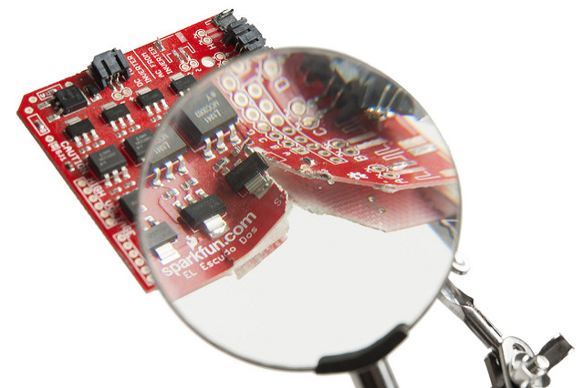

### 前提

SparkFunが製造する開発ボードやブレイクアウトボードは、たいてい[ポゴピン式の検査治具](https://learn.sparkfun.com/tutorials/constant-innovation-in-quality-control)でテストされ、梱包・出荷される前に技術者による品質検査を受けている。
ここでは、基板自体は最初から問題ないものとして話を進める。

- [Electronics Assembly](https://learn.sparkfun.com/tutorials/electronics-assembly)：SparkFunがSMD部品をどう組み立てているか。
- [Constant Innovation in Quality Control](https://learn.sparkfun.com/tutorials/constant-innovation-in-quality-control)：品質管理における最近の改善について。テストをより徹底させると同時に、より効率的で堅牢なものにしている。

### おすすめの道具

最低限、安価なマルチメーターは基本的なトラブルシューティングに欠かせない。セットアップによっては、追加の[工具](https://www.sparkfun.com/categories/46)や部品が必要になることもある。

### 参考になるチュートリアル

以下の概念に馴染みがなければ、いくつかのスキル系チュートリアルを確認しておくことをおすすめする。プロジェクトの複雑さによっては、トラブルシューティングに追加のスキルが必要になることもある。

- [はんだ付けの基本（スルーホール編）](./how-to-solder-through-hole-soldering.md)
- [配線の基本](./working-with-wire.md)
- [ブレッドボードの使い方](./how-to-use-a-breadboard.md)
- [回路図の読み方](./how-to-read-a-schematic.md)
- [シリアルターミナルの基礎](./terminal-basics.md)
- [テスターの使い方](./how-to-use-a-multimeter.md)

## まず何かを始めてみる

「無線モジュールのネットワークに接続した10,080個のアドレサブルLEDを、1枚の基板で制御して、それをサメに取り付けたいんです。ちなみに、電子工作は今まで一度もやったことがありません。」

ちょっと待ってほしい。大きく一歩下がって、突拍子もないプロジェクトに飛びつく前に、まずは単純なところから始めよう。あと、動物をプロジェクトに巻き込むのはやめてほしい。
SparkFunのテクニカルサポート部門には、こういった興味深い相談が寄せられることがある。上の例は、サポートに寄せられる質問を誇張して一般化したものである。
プロジェクトに飛び込む前に、まずは基礎から始め、どこで情報を探せばよいかを見ていこう。
まずは、関連するドキュメントを確認するところから始めるとよい。夢は大きく持ちつつ、こうした小さな一歩から始めよう。

### 製品ページとキットから始める

SparkFunでは、カタログに掲載している部品についての情報をできる限り提供しようと努めている。
製品の説明文を読むだけでなく、製品ページのドキュメントセクションもぜひ確認してみてほしい。
製品によっては、数多くの有用なリンクが用意されている。
たとえば、[SparkFun FTDI Basic Breakout --- 3.3V](https://www.sparkfun.com/products/9873)の製品ページを見てみよう。そこにリンクされている情報には、次のようなものが含まれる。

- 回路図
- Eagle設計ファイル
- 使い方ガイドや実験ガイド
- プロジェクトのチュートリアル
- ドライバ
- データシート
- ユーザーマニュアル
- GitHubリポジトリ

おすすめ製品の下までスクロールすると、その製品に関連する情報がある場合、「Product Help and Resources」というセクションが表示されることがある。
チュートリアルからテクニカルサポートのヒント、[Hackster.io](https://www.hackster.io/)上でその部品が使われたプロジェクトまで、さまざまな情報が含まれる。
さらに下（この画像には写っていない）には、ユーザーが投稿したコメントのセクションもある。

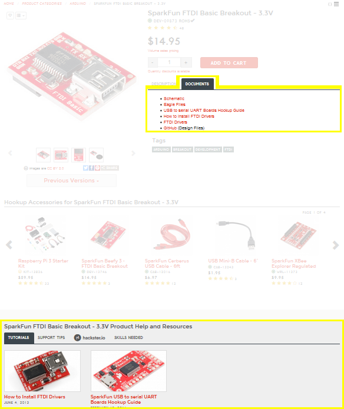

キットに使われている特定の開発ボードを確認してみるのも、始めるうえで参考になる。
それぞれのキットには、その製品を使い始めるのに役立つ基本的な例やプロジェクトが含まれている。
ハードウェアの電子工作やプログラミングをまだ経験したことがない場合は、SparkFun Inventor's Kit V3.3 for RedBoardやmicro:bit向けのキットを確認してみるとよい。これらのキットでは、部品をはんだ付けする必要はない。

### データシートとマニュアル

基板の複雑さによっては、PCB上に異なる仕様を持つ数多くの部品が搭載されていることもある。
たいていは、ブレイクアウトボードの主要なICについて考え、I/Oピンの**絶対最大定格**、そのチップ全体がどれだけの負荷に耐えられるか、そしてそのICが何をできるかを確認するようにしている。
データシートの読み方のコツについては、以前のチュートリアル「[How to Read a Datasheet](https://www.sparkfun.com/tutorials/223)」も参考にしてほしい。
ユーザーマニュアルには、製品の使い方についての実例やアプリケーションノートが載っていることもある。

### オンラインでの情報収集

SparkFunの[オンラインチュートリアル](https://learn.sparkfun.com/tutorials)や[YouTube動画](https://www.sparkfun.com/videos)、ブログ記事（[Enginursday](https://www.sparkfun.com/news/tags/enginursday)や[Engineering Roundtable](https://www.sparkfun.com/news/tags/engineering-roundtable)など）はどんどん増えているが、それ以外にもオンライン上には数多くの参考資料がある。役立ちそうなものをいくつか紹介する。

- SparkFun製ではない部品について
- [Instructables](http://www.instructables.com/index)
- [Hackster.io](http://www.hackster.io/)
- [Electronics Stack Exchange](http://electronics.stackexchange.com/)
- フォーラム（[SparkFun](https://forum.sparkfun.com/)、[Arduino.cc](https://forum.arduino.cc/)、[Raspberry Pi](https://www.raspberrypi.org/forums/)など）

インターネットに投稿されたものであれば、クラウドはすべてを知っている。ページ上部のサイト内検索だけでなく、さまざまな検索語を使ってオンラインの検索エンジンで調べてみると、誰かが自分と似たようなことをすでにやっていないか確認できる。
おそらく世界のどこかに、同じプロジェクト（あるいはそれに近いもの）にすでに取り組んだ人がいて、その情報をオンラインで公開しているはずである。

## ハードウェアの確認

指示どおりに進めたのに、部品やプロジェクトが期待どおりに動かない。使い方ガイドやチュートリアルに書かれているとおりに試してみたのに。
電子工作とプログラミングに取り組むということは、問題を診断し、部品を正しく機能させるための解決策を見つけるということでもある。心配しなくていい。誰にでも起こることであり、こうした課題があるからこそ学び、成長できる。
自分の回路で何が起きているのか、見つけ出していこう。

### 接続を確認する

その部品やプロジェクトはちゃんと接続されているだろうか。「接続を確認する」とはどういうことか、はっきりさせておこう。
よくあるトラブルシューティングの方法は、ハードウェアの接続と電源に、物理的な問題がないか確認することである。

#### ピン間に導通はあるか、接続はしっかりしているか

接続がゆるんでいると、回路が不完全になり、問題を引き起こすことがある。
配線が誤って接続されていたり、ゆるんでいたりする可能性を考えて、配線された接続をもう一度確認しておくのがよい。
以下の画像は、細い線をブレッドボードやメス型のヘッダーソケットに挿しただけの、試作時によく見られる不安定な電気接続の例である。
回路に少しの衝撃や振動が加わるだけで、接続が失われてしまうことがある。

| 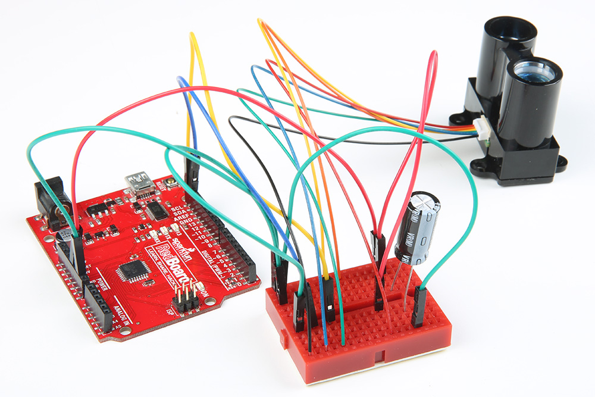 | 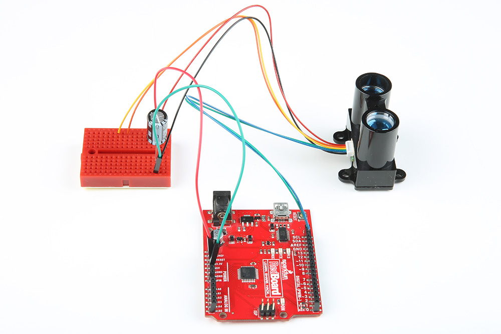 | 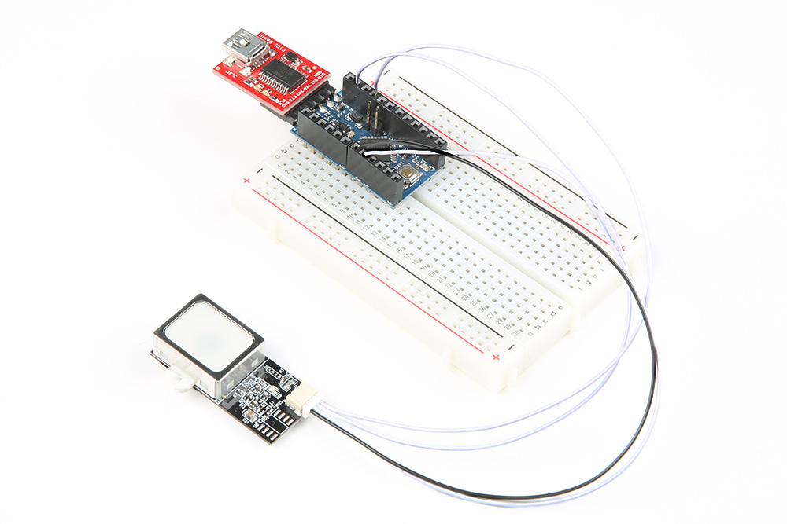 |
| --- | --- | --- |
| **やや信頼できる：** ブレッドボードに接続されたLidar | **信頼できない：** RedBoardとブレッドボードに接続されたLidar | **信頼できない：** Arduino Pro Mini 3.3Vのメスヘッダーに接続された指紋センサー |

ブレッドボードに接続された細い線は、製造方法や金属ストリップにかかった負荷の度合いによって、ゆるんでしまうことがある。
メスヘッダーに接続された細い線は、ソケットの公差の関係で、さらに不安定になりやすい。

より確実な接続にするには、配線をヘッダーピンにはんだ付けし、熱収縮チューブを追加するとよい。
[SparkFunのスナップ式プロト基板](https://www.sparkfun.com/products/13268)を使ってアダプタを作ることもできるし、[試作用基板](https://www.sparkfun.com/categories/301)を使ってカスタムシールドを作ることもできる。

#### 短絡していないか

[回路の短絡](./what-is-a-circuit.md)は、あるピンが触れてはいけない何かに触れていると、問題を引き起こすことがある。
部品が触れられないほど熱くなっていないか確認しよう。
ピンが短絡している場合は、電源を切り、ゆるんだ配線が触れてはいけない何かに触れていないか確認しよう。
基板を金属製のテーブルの上に直接置かないようにすること。

#### 配線やケーブルが不良ではないか

配線やケーブルが不良で、回路がつながらないこともある。
[導通測定に設定したマルチメーター](./how-to-use-a-multimeter.md)で回路を確認してみるとよい。それでもだめなら、別の配線やケーブルを試してみよう。

#### そのUSBケーブルはどこで手に入れたものか

ケーブルの中には、充電専用に設計されており、データ線がまったく接続されていないものもある。
また、ケーブル内部に微細な断線が生じていることもある。
別のUSBケーブルを試してみることをおすすめする。
あるお客様が、学校の実験室にあったUSBケーブルを使ってArduinoにコードをアップロードしようとしていた事例があった。4本のうち3本が損傷していて使い物にならなかった。4本目のケーブルだけが、そのデバイスで正常に動作した。
こうした場合は、新品の[USBケーブル](https://www.sparkfun.com/categories/71)を注文してみるのもよいだろう。

#### 部品を正しい極性で接続しているか

特定の極性を持つ部品は、正しい向きで接続しないと動作しない。
部品が正しく実装されているか確認しよう。これは、電池、集積回路、マイクロコントローラ、トランジスタ、電圧レギュレータ、電解コンデンサ、ダイオードなど、多岐にわたる。
詳しくは、[極性](./polarity.md)のチュートリアルを参照してほしい。

#### 基本的な接続方法どおりに接続したか

すべて正しく配線されているように見える場合は、最初に戻って基本的な接続方法を見直してみるとよい。
部品をいったん外し、それぞれの回路を配線し直してみることも、トラブルシューティングの助けになる。これによって、問題の範囲を絞り込みやすくなる。

2つの部品が似た名前だったり、見た目が同じだったりしても、実際には別物であることがある点にも注意してほしい。
たとえば、Arduino Mega 2560には「Arduino」という名前が含まれているが、Arduino Uno R3を使う回路をそのまま置き換えられるとは限らない。
気づきにくい細かな違いがいくつかある（ピンの配置が異なる、Software Serialに制約がある、ボード定義が異なる、など）。
場合によっては、ピンを再定義したり、回路を配線し直したりする必要が出てくることもある。

部品箱から正しい部品を取り出せているか、ICのラベルをよく確認しておこう。
たとえば、TMP36とBJTトランジスタは同じものではない。パッケージの見た目は同じでも、まったく別物である。これはSparkFun Inventor's Kitでもよく見られる混同である。
別の事例では、あるお客様が別のnチャンネルMOSFETを使っていた。そのnチャンネルMOSFETは見た目こそ同じだったが、仕様が異なっていたため、回路の中でトランジスタが完全にオンにならなかった。

### はんだ付けの接合部を確認する

#### はんだ付けの接合部は理想的で、十分な接続ができているか

そう、ここでも改めて接続を確認する。
ブレイクアウトボードを配線でブレッドボードに接続しようとしている場合、ブレイクアウトボードと配線の間の接続が十分かどうかを確認しておく必要がある。
以下の3枚の画像は、理想的とは言えないはんだ付けの例である。

1枚目の画像では、ヘッダーピンとブレッドボードをつなぐはんだ付けがまったくされていない。
ヘッダーピンのはんだ付けを助けるという目的ではよい方法だが、Pro Miniを他のブレイクアウトボードに接続しようとしている場合には不向きである。

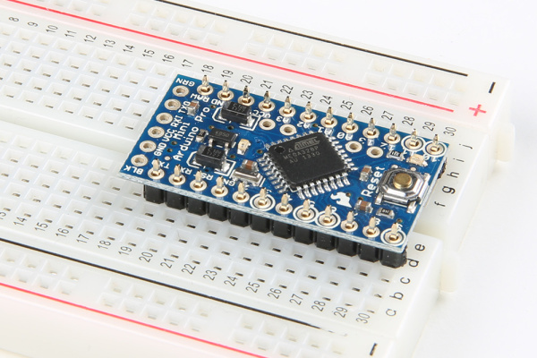

**信頼できない：** はんだ付けされていないPro Miniとヘッダーピンをブレッドボードに挿した状態

2枚目の画像にははんだが乗っているものの、接合部は理想的とは言えない。
30番の行に沿った最初のピンには、はんだがまったく乗っていない。
29番の行のピンには、ヘッダー側には多少はんだが乗っているが、基板とは接触していない。
28番の行のピンは問題ないが、はんだが多すぎる。はんだの塊がピンからはみ出している部分もある。
27番と26番の行のピンには、意図しないはんだブリッジができてしまっている。
25番の行のピンは、スルーホールパッドとピンの両方にはんだが乗っているように見えるが、接続はできていない。
理想的なはんだ付けの接合部と言えそうなのは、21番の行にあるRSTピンだけである。
それ以外のすべてのピンは、再加熱するか、はんだを追加するかして、十分な接合を作れるようやり直すべきである。
さらに、Atmega328P IC上のピン間にも、意図しないはんだブリッジができている。
意図しないはんだブリッジを取り除くには、はんだ吸い取り線を使い、次の質問も確認してみるとよい。

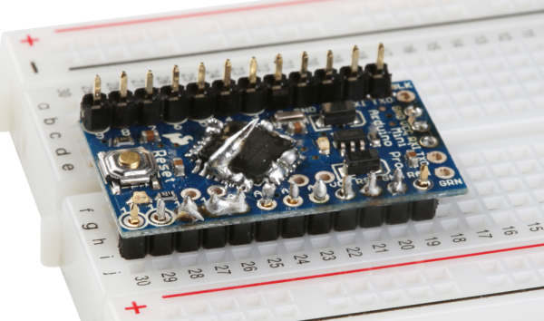

**信頼できない：** はんだ付けの状態が悪いPro Mini

3枚目の画像は、1×12のヘッダーがPro Miniに誤ってはんだ付けされている様子をはっきりと示している。
はんだは、ヘッダーの短いほうの側に付けるべきである。ピンを保持している黒いハウジングは、PCBとブレッドボードの間に来るべきである。
さらに、はんだの接合部がピンの長さを超えて広がってしまっている。
まっすぐなヘッダーピンの長さのせいで、このPro Miniはブレッドボードに完全には挿し込めない。

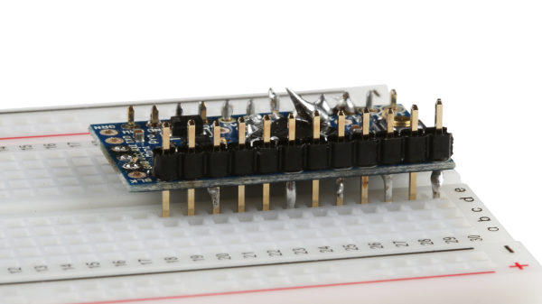

**信頼できない：** はんだ付けの状態が悪く、ヘッダーが誤った側に付いているPro Mini

解決策は、はんだを追加するか、しっかりと接続できるようにはんだ付けをやり直すことである。
以下の画像は、Pro Miniに理想的なはんだ付けができている例である。
はんだ付けと理想的な接合部についての詳しい情報は、[スルーホールはんだ付けのチュートリアル](https://learn.sparkfun.com/tutorials/how-to-solder-through-hole-soldering#soldering-your-first-component-)も参照してほしい。

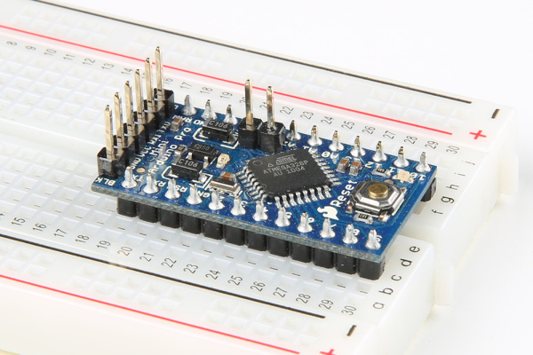

**信頼できる：** Arduino Pro Miniとまっすぐなヘッダーピンの間の理想的なはんだ付けの接合部

#### 本来はんだブリッジがあるべきでない場所に、ピンをつなぐはんだブリッジができていないか

回路によっては、基板の特定の箇所にあえてはんだブリッジを作りたい場合もある。
ICやヘッダーピンに意図しないはんだブリッジができている場合は、基板をやり直してそのはんだブリッジを取り除く必要がある。

以下は、「Simon Says」PTHはんだ付けキットで、意図せずできてしまったはんだの接合部の例である。

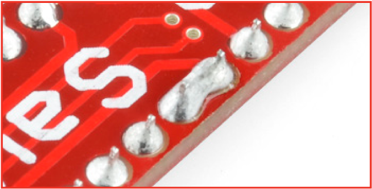

修正するには、はんだ吸い取り線を使ってはんだブリッジを取り除くとよい。
はんだ吸い取り線の使い方については、「Solder Jumpers」というラベルが付いた[こちらのトラブルシューティングのセクション](https://learn.sparkfun.com/tutorials/simon-says-assembly-guide#troubleshooting)も参考にしてほしい。

#### 基板に水溶性フラックスの残留物が残っていないか

水溶性フラックスを使っている場合は、基板に残った水溶性フラックスの残留物を必ず取り除くようにしよう。
これは、ピンの酸化や、デンドライト（樹枝状結晶）によるピン間の一時的な短絡を防ぐためである。
以下は、量産用のパネルに残った水溶性フラックスの残留物の画像である。

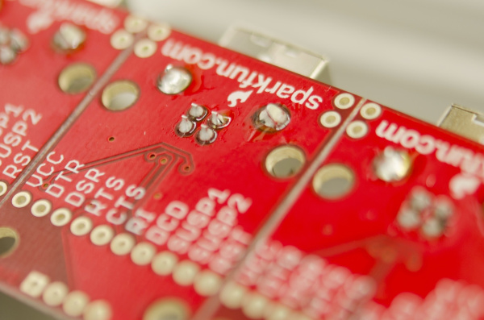

回路によっては、フラックスが残ったままでも問題なく動作することがあるが、シリアルUART経由で信号を送る回路（Arduinoへのコードのアップロードや、別のUARTへのASCII文字の送信など）やI2Cでは、汚れた基板が大きなトラブルの原因になっているのを見たことがある。
基板に残った水溶性フラックスによる問題は、避けておくに越したことはない。実際、[SparkFunが組み立てる基板は](https://learn.sparkfun.com/tutorials/electronics-assembly/washing)、この種のフラックスを使っている場合、洗浄されている。

水溶性フラックスの残留物を取り除くには、少量の脱イオン水かイソプロピルアルコールと、歯ブラシを使うとよい。
脱イオン水の代わりとしては、趣味の用途であれば、水道水よりもミネラル分を含まないボトル入りの水を先に試すとよいだろう。
とはいえ、水道水を使うと沈着物が生じ、後々問題を引き起こすこともある。
圧縮空気を使って、基板に残った余分なフラックスや水分を乾燥させよう。
[ヒートガン](https://www.sparkfun.com/products/10326)や[リワークステーション](https://www.sparkfun.com/products/10706)の温風を使って乾燥させることもできる。

特定の部品は水に弱いため、これらの部品を濡らさないよう注意する必要がある。水との接触を避けるべき部品の短い一覧を挙げる。

- キャラクタLCD
- 7セグメントLEDディスプレイ
- 電池
- GPSモジュール
- 無線モジュール
- 気圧センサー
- スライド式ポテンショメータ
- マイク
- スピーカー
- 心拍センサーIC

これらの内部に水が閉じ込められた状態で基板に電源を入れると、部品が損傷してしまう可能性が高い。

### 配線の長さ

#### 必要以上に長い配線を使っていないか

使用している導電材料によっては、導電糸や配線の抵抗が、ある一定の距離を超えると増加することがある。
これは導電糸で特に顕著であり、解決策としては[糸を二重にする](https://learn.sparkfun.com/tutorials/powering-lilypad-led-projects#conductive-thread-resistance)ことが挙げられる。

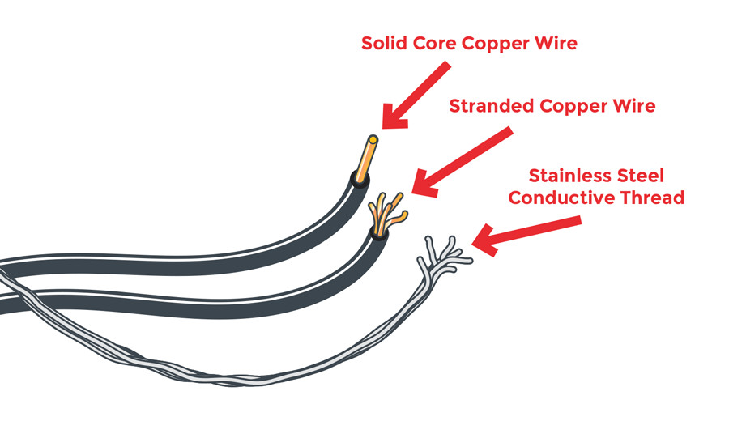

配線を数百フィートを超える距離で使う場合も、問題が生じることがある。
たとえば、ある長さを超えるとI2Cセンサーが正しく動作しなくなった事例がいくつかある。
I2Cはもともと[短い距離](./i2c.md)で使うことを想定して設計されているため、[一定のフィート数](https://forum.arduino.cc/index.php?topic=57604.msg414074#msg414074)を超えて使うと、センサーがデータを送信する際に問題が生じることがある。
解決策としては、[プルアップ抵抗を調整する](https://www.sparkfun.com/news/2366)か、データの送り方を工夫する（各センサーノードにマイクロコントローラを配置し、無線デバイスを追加するなど）ことが考えられる。

### 別のコンピュータで確認する

#### 別のパソコンで試してみたか

デバイスが正常に動作するかどうか、別のパソコンでも確認してみることをおすすめする。
あるお客様のノートパソコンではデバイスが動作しなかったのに、別のパソコンでは動作した、という事例があった。
そのパソコンの設定に何らかの問題があり、デバイスを正しく使えなくなっていたのである。

#### 使っているUSBハブやUSBポートに問題はないか

USBハブを経由せず、USBポートに直接接続してみてほしい。
デバイスが十分な電力を得られていなかったり、正しく通信できていなかったりする可能性がある。
また、一部のUSB-シリアル変換器をUSB 3.0で使うと問題が生じることもある。
別のパソコンでテストしてみてほしい。USB 3.0のポートではうまく動かなかったデバイスが、USB 2.0のハブでは動作した、という事例もいくつかあった。

### ロジックレベルを確認する

#### 3.3Vのセンサーを5Vの基板に接続できるか

すべての基板が同じロジックレベルの電圧を使っているわけではない。
たとえば、RedBoard Programmed with ArduinoやArduino Uno R3は5Vロジックを使用する。
しかし、ESP8266、SAMD21、Arduino Due、Raspberry Piのような他の基板では、I/Oピンは5V耐性を持たない。
接続する開発ボードとデバイスの間で、ロジックレベルが一致しているか、あるいは耐性があるか、必ず確認しよう。

信号を降圧するだけでよい場合は、[10kΩの抵抗3個で分圧回路を作る](https://learn.sparkfun.com/tutorials/retired---using-the-logic-level-converter#hardware-overview)という方法もある。
双方向の信号をやり取りする場合は、ロジックレベルコンバータ（[双方向ロジックレベルコンバータ](https://www.sparkfun.com/products/12009)、[PCA9306レベルトランスレータ](https://www.sparkfun.com/products/11955)、[TXB0104電圧レベルトランスレータ](https://www.sparkfun.com/products/11771)、[その他](https://www.sparkfun.com/categories/361)）を使えば安全に通信できる。
ロジックレベルについてさらに詳しくは、[ロジックレベル](./logic-levels.md)のチュートリアルも参照してほしい。

### 複数の基板を積み重ねる

#### 開発ボードの上に、複数の基板（Arduinoシールド、Raspberry Pi HAT、Beaglebone Capeなど）を積み重ねていないか

[複数の基板を積み重ねる](https://learn.sparkfun.com/tutorials/arduino-shields/what-is-a-shield)こと自体は可能な場合もあるが、それぞれの基板がどのピンを使っているかによる。
基板の設計ファイルや回路図、基本的なサンプルコードを確認し、それぞれのシールドがどのピンを使っているか確認してみよう。
複数の基板を開発ボードに積み重ねる場合、コード内でピンを再配線したり、再定義したり、シリアルアドレス（I2C、SPIなど）を変更したりする必要が出てくることもある。
複数の基板を使う場合は、それぞれのサンプルコードを組み合わせて、プロジェクトの中で動作するようにする必要がある。

### 設置場所の干渉を確認する

#### 特定の部屋や建物の中で部品が動作しない場合

空気中に[何か魔法](https://www.sparkfun.com/news/2482)がかかっているのか、あるいは[電子機器に幽霊](https://youtu.be/IY-WVie_b_U)でも取り憑いているのだろうか。もしかしたらそうかもしれない。あるいは、単純に別の場所でその基板を試してみるのもよい。
これは、[建物の中でGPS受信機を使う場合](https://learn.sparkfun.com/tutorials/alphanumeric-gps-wall-clock#lock-problems)によくあることである。
GPSのロック問題を避けるには、建物の外周に近い場所でGPS受信機を使う、屋外で使う、周囲の建物の影響を避けるために場所を変える、あるいは屋外まで延ばした外部アンテナを使うとよい。

建物の特定の場所で超音波センサーを使うと問題が生じたこともあった。
たとえば、[HC-SR04超音波センサー](https://www.sparkfun.com/products/13959)は建物のある場所では問題なく動作していたが、空調（HVAC）が発する音響ノイズが、ちょうどこのセンサーに干渉するような周波数になっていることがわかった。
このノイズを避けるため、建物の別の場所でセンサーを使う必要があった。

磁力計を使っていて、異常な読み取り値が出ることはないだろうか。
これは、周囲の環境にあるハードアイアン（永久磁化）やソフトアイアン（誘導磁化）が原因かもしれない。
ハードアイアンとソフトアイアンについてさらに詳しくは、廃番になった[9DOF Razorの古いチュートリアル](https://github.com/Razor-AHRS/razor-9dof-ahrs/wiki/Tutorial#extended-magnetometer-calibration)も参考にしてほしい。

### 電源を確認する

#### 電源は十分な容量を持っているか

自分のシステムが必要とする電力を供給できる電源を使っているか確認しよう。
たとえば、Arduinoで3個の[WS2812Bアドレサブル LED](https://www.sparkfun.com/products/13282)を点灯させるだけなら、5V/1Aの電源で十分だろう。
しかし、2本以上の[5mアドレサブルLEDストリップ](https://www.sparkfun.com/products/12026)を点灯させる場合は話が変わってくる。
このような[大規模な設置](https://learn.sparkfun.com/tutorials/building-large-led-installations)には、長い配線に対応できる強力な電源が必要になり、おそらく5mのセグメントごとに電力を追加供給する必要も出てくるだろう。

電源が十分な電力を供給できない場合、マイクロコントローラやシングルボードコンピュータがブラウンアウト（電圧降下による誤動作）を起こすことがある。
別の例として、[Raspberry Pi 3](https://www.sparkfun.com/products/13825)は、以前のモデルよりもわずかに多くの電流を消費する。
以前の世代のRaspberry Piでは5V/2Aの電源で動作していたが、Pi 3に十分な電力を供給するには[5.1V/2.5Aの電源](https://www.sparkfun.com/products/13831)が必要である。

#### モーターが起動するたびにArduinoが動作を止めてしまうのはなぜか

電源を確認してみよう。モーターが電圧降下を引き起こし、マイクロコントローラがブラウンアウトを起こしている可能性がある。
たいてい、ブラウンアウトやマイクロコントローラのリセットを防ぐため、モーター用に外部電源を別途接続することが推奨される。
基準を取るため、GNDはシステムの残りの部分と必ず接続しておくこと。
モーターとマイクロコントローラの両方に十分な電力を供給できる、より強力な電源を使うという方法もある。

#### コンセントに接続した電源では動作するのに、9V電池では動作しないのはなぜか

電池の化学的な種類やメーカーによって、コンセントに接続した電源とは放電特性が異なることがある。
9V電池は、他の種類の電池と比べて内部抵抗が高い。
また、内部抵抗はメーカーによっても異なる。
そのため、大電流を必要とする用途には、9V電池は理想的な電源とは言えない。
プロジェクトの電源には、他の[電池の種類](./battery-technologies.md)を検討してみるとよいだろう。

### 電源の入れ直し

#### コンセントに接続して数か月間は問題なく動いていたプロジェクトが、今は期待どおりに動かなくなった場合

電源を切ってから入れ直す、電源の再投入（パワーサイクル）を試してみよう。
リセットボタンがあれば、それを押すだけで済むこともある。
電源をコンセントから抜き、電源のVinを切り離し、数秒待ってから、電源をVinに再接続し、電源を再びコンセントに挿す、という手順が必要になることもある。
マルチメーターでACアダプタをテストし、まだ電力を出力しているか確認するか、正常に動作することがわかっているランプをコンセントに挿してみるのもよい。

### 発熱

#### モータードライバが触れると熱くなっているのは普通のことか

モータードライバとモーターを使う場合、発熱は正常なことである。
ドライバICにどれだけ負荷をかけているか、どんな電源を使っているかによっては、モータードライバの性能をフルに発揮させるためにヒートシンクが必要になることもある。
このようなブレイクアウトボードは、たいてい多少の放熱を助けるように設計されている。
ヒートシンクを追加する以外にも、[熱に対処する方法](https://learn.sparkfun.com/tutorials/stepoko-powered-by-grbl-hookup-guide/hardware-dealing-with-heat)はいくつかある。

### 静電気放電（ESD）

#### デバイスに触れる前に、自分自身をグラウンドに接続したか

特定のデバイスは[静電気](./what-is-electricity.md)に弱い。
人は動き回るうちに静電気を帯び、それが基板を通じて放電されることがある。
冬場、カーペットの上を歩いた後は特に注意が必要である。
金属製のキャビネットに触れて、自分自身をグラウンドに接続しておくようにしよう。
一部の基板は多少の軽い静電気には耐えられるが、ある程度を超えるとICが損傷することがある。

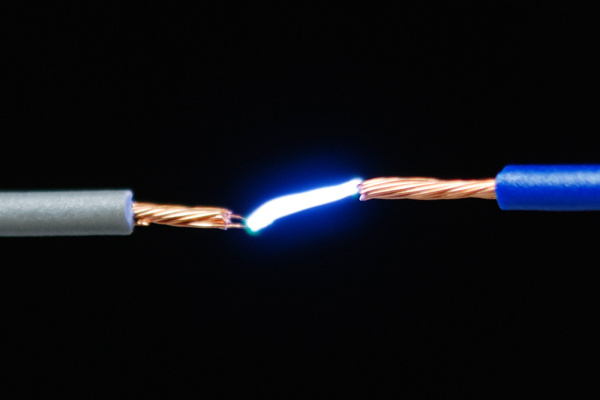

### 製品の限界

#### その部品を想定どおりの使い方で使っているか

製品が世に出ると、想定していなかった使われ方をすることがある。
たとえば、たいていLEDは光を発するものだと考えるだろう。しかし、[マイクロコントローラとLEDを使って光を検知する](https://www.sparkfun.com/news/2161)ことも可能である。

とはいえ、すべての部品が想定していないことまでこなせるとは期待しないでほしい。
たとえば、[XBee Series 1トランシーバー](https://www.sparkfun.com/products/11215)はデータをワイヤレスで送信できるが、[WiFiドングル](https://www.sparkfun.com/products/13677)のように映像を安定してストリーミングできるとは期待しないでほしい。仕様（データレートなど）がまったく異なる。

### 無線

#### 無線デバイスが無線ネットワークに接続できないのはなぜか

正しいWiFiネットワーク名とパスワードを使っているか確認してみよう。
認証情報を誤って入力している可能性もある。
WiFi対応デバイス（[SparkFun ESP8266 Thing Development Board](https://www.sparkfun.com/products/13711)など）に付属のサンプルコードでは、ネットワーク名とパスワードを手動で入力する必要がある。

別のパソコンで確認するのと同じように、WiFi対応デバイスを別のWiFiネットワークでテストしてみるのもよいだろう。
学校のネットワークでWiFi対応デバイスを使う場合、問題が生じることがある。
学校のネットワーク設定によっては、デバイスの接続を許可してもらうために、そのネットワークを管理する情報システム部門に問い合わせる必要があるかもしれない。
無線ルーターが故障していたり、無線対応デバイスと互換性がなかったりする可能性もある。

#### 金属製の筐体の中で無線デバイスが動作しないのはなぜか

無線デバイスを金属製の筐体（つまり[ファラデーケージ](https://ja.wikipedia.org/wiki/%E3%83%95%E3%82%A1%E3%83%A9%E3%83%87%E3%83%BC%E3%82%B1%E3%83%BC%E3%82%B8)）の中に入れると、電磁場が実質的に制限され、遮断されてしまうことがある。
送受信する信号を伝送できなくなる。
トランシーバーを金属製の筐体の外まで延ばせるよう、外部アンテナを使ってみてほしい。

## ソフトウェアの確認

世の中には数多くのプログラミング言語がある。このチュートリアルとトラブルシューティングの範囲では、Arduino IDE（統合開発環境）と、Arduinoの開発ボードにコードをアップロードする際によくある問題に焦点を当てる。
とはいえ、これらのコツの一部は、他の開発環境でのトラブルシューティングにも役立つかもしれない。

### FTDIドライバ

#### FTDIドライバをインストールしたか

FTDIを使うArduinoにアップロードしたことがない場合や、FTDIをパソコンに接続したことがない場合は、[最新のFTDIドライバをインストール](http://www.ftdichip.com/Drivers/VCP.htm)しておく必要がある。
自分のOS向けのドライバのインストール方法については、以下のチュートリアルを参考にしてほしい。このチュートリアルはFTDIの手順をもとにしている。より詳しいガイドについては、[FTDIのインストールガイド](http://www.ftdichip.com/Support/Documents/InstallGuides.htm)も参照してほしい。

- [How to Install FTDI Drivers](https://learn.sparkfun.com/tutorials/how-to-install-ftdi-drivers)

デバイスドライバは、開発ボードに搭載されているUSB-シリアル変換チップによって異なる点に注意してほしい。
異なるチップを使っている場合は、それぞれに対応するドライバをインストールする必要がある。以下は、その他のドライバの例である。

- [CH340](https://www.sparkfun.com/ch340)
- [CP2102](https://learn.sparkfun.com/tutorials/cp2102-usb-to-serial-converter-hook-up-guide#driver-installation)
- [CY7C65213](https://learn.sparkfun.com/tutorials/sparkfun-usb-uart-breakout-cy7c65213-hookup-guide#installing-drivers)

さまざまなドライバについてさらに詳しくは、こちらのブログ記事も参照してほしい。

- [What Drives your SparkFun Inventor's Kit?](https://news.sparkfun.com/2979)

#### ドライバがインストールされているかどうかはどう確認すればよいか

デバイスを接続した状態で、Arduino IDEのメニューから**Tools > Serial Port**を選択すると、いくつかのCOMポートが表示される。
デバイスを取り外してから、もう一度**Tools > Serial Port**を開くと、あるCOMポートが消えていることに気づくはずである。
この消去法によって、そのデバイスがどのCOMポートとして認識されているかを確認できる。
これは、デバイスマネージャーの*ポート（COMとLPT）*ツリーを確認したときにも同じように見える。

#### USB-シリアル変換器がシリアルデータを送信しているかどうかはどう確認すればよいか

FTDIや他のUSB-シリアル変換器が正しく動作しているか確認するには、シリアルのループバックテスト、あるいは[エコーテスト](https://learn.sparkfun.com/tutorials/terminal-basics/connecting-to-your-device)を行うとよい。
このテストを行うには、UARTのRxピンとTxピンの間をジャンパー線で接続する。

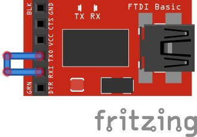

シリアルターミナル（Tera Termなど）を、**9600**ボー、8-none-1-noneの設定で開く。
シリアルターミナルに文字を入力すると、キーボードから送信した文字がそのまま画面にエコーバックされるはずである。
データが送信されているタイミングを示す、RxとTxのステータスLEDも点灯するはずである。

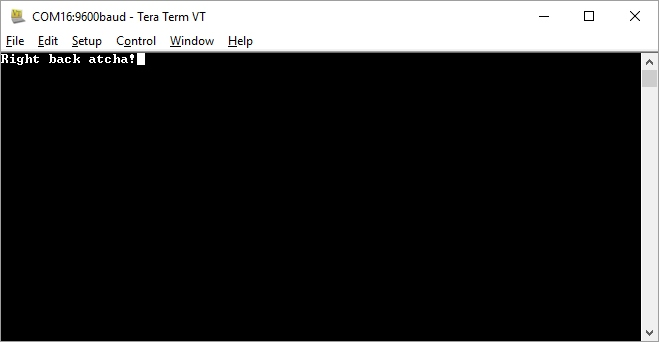

### Arduino IDEのバージョン

#### Arduino IDEに何か問題があるのか

Arduino IDEはバージョンごとに改善と恩恵をもたらしてくれるが、予期しないバグや、コードのコンパイルのされ方に違いが生じることもある。
エラー出力に警告がある場合、[たいていは無視してかまわない](https://forum.arduino.cc/index.php?topic=347693.0)。
コンパイルに問題がある場合、パソコン上のArduino IDEをアンインストールしてから再インストールする必要が出てくることもある。特定の[Arduinoファイル](https://forum.arduino.cc/index.php?topic=440638.msg3034559#msg3034559)を削除してみるという方法もある。

使用しているArduinoベースの開発ボードが特定のIDEバージョンを必要としない場合は、[より古いバージョンのArduino IDE（v1.6.5など）](https://www.arduino.cc/en/Main/OldSoftwareReleases#previous)にロールバックして試してみるとよい。
次のリリースが出るまでの間は、安定して動作するIDEにロールバックしてテストするのが解決策になることもある。

### ボードの選択

#### 正しいボード定義を選択したか

正しいボード定義を選択していないと、コードをアップロードできない。
正しいボードの選び方については、Arduinoに関連するドキュメントを確認してほしい。
Arduinoのボード定義の一覧は、**Tools > Board**の選択メニューから確認できる。

#### ボードの選択メニューに自分のArduinoボードが表示されないのはなぜか

Arduino IDE v1.6以降では、[ファイル構造の要件が変更された](https://playground.arduino.cc/Main/CustomizeArduinoIDE)ことによる問題が生じることがある。
これによって、Arduinoボードがデフォルトの一覧に表示されないことがある。

最新のSparkFun Arduino互換ボードの更新情報は、SparkFun Arduinoボードアドオンの GitHubリポジトリで確認できる。
このリポジトリには、SparkFunのArduino互換開発ボードのサポート情報と、ボードアドオンのインストール方法が含まれている。

- [SparkFun Arduino Board Add-On GitHub Repo](https://github.com/sparkfun/Arduino_Boards)

最新のボード定義をインストールしてもコードがコンパイルされない場合は、以前のバージョンのボードアドオンにロールバックしてみるとよい。
複数のバージョンがリリースされている場合、ボードマネージャーでそのボードをクリックすると、異なるバージョンを選べる小さなドロップダウンメニューが表示されるはずである。

### COMポートの選択

#### 正しいCOMポートを選択したか

**Tools > Serial Port**メニューで、正しいCOMポートを選択できているか確認する必要がある。
デバイスを接続した状態で、Arduino IDEのメニューから**Tools > Serial Port**を選択すると、いくつかのCOMポートが表示される。
デバイスを取り外してから、もう一度**Tools > Serial Port**を開くと、あるCOMポートが消えていることに気づくはずである。
この消去法によって、そのデバイスがどのCOMポートとして認識されているかを確認できる。
これは、デバイスマネージャーの*ポート（COMとLPT）*ツリーを確認したときにも同じように見える。

### インストール済みのArduinoライブラリ

#### サンプルコードがライブラリのインストールを必要としていないか

必要なライブラリをインストールしていないと、Arduinoはそのために定義されていない特定の関数を理解できない。
たいてい、サンプルコードのファイルの冒頭付近に、そのライブラリをインクルードしようとしている記述が見つかるはずである。
ライブラリを正しくインストールするには、次のチュートリアルを確認することをおすすめする。

- [Installing an Arduino Library](https://learn.sparkfun.com/tutorials/installing-an-arduino-library)

#### 必要なArduinoライブラリをインストールしたのに、まだコンパイルできないのはなぜか

Arduino IDEを再インストールしてみよう。
あるエンジニアは、あるライブラリで問題が発生した際に、Arduino IDEをアンインストールしてから再インストールすることで解決した例がある。
それでもだめなら、そのArduinoライブラリを再インストールしてみるとよい。
ダウンロードしたライブラリが破損していたり、誤ってインストールされてしまったりすることもあるため、その場合はライブラリを再インストールする必要がある。

### ブートローダーの破損、文鎮化したArduino

#### ブートローダーが破損している場合、Arduinoを復旧するにはどうすればよいか

別のArduinoマイクロコントローラやAVRプログラマーがあれば、ブートローダーを再インストールできる。
以下のチュートリアルは、ATmega328PのArduino Uno向けに書かれている。
別のAVRマイクロコントローラやArduino互換ボードを使っている場合は、ブートローダーを書き込む際に異なるボード定義を選ぶ必要があるかもしれない。

- [Installing an Arduino Bootloader](https://learn.sparkfun.com/tutorials/installing-an-arduino-bootloader)

#### ATmega32U4搭載のArduinoが、新しいコードをアップロードした後に動作しなくなった。何が起きたのか

たいていの場合、コードをアップロードする際に間違ったボード定義が選ばれていたか、COMポート通信を扱うレジスタに何らかの干渉が起きている。
ATmega32U4ベースのArduinoを復旧させる方法として、[ダブルリセット法](https://learn.sparkfun.com/tutorials/pro-micro--fio-v3-hookup-guide/troubleshooting-and-faq#ts-reset)がある。
最後の手段として、AVRプログラマーが必要になることもある。
異なるブートローダーを持つATmega32U4を復旧させるための、より詳しいヒントへのリンクについては、[こちらのコメント](https://learn.sparkfun.com/tutorials/pro-micro--fio-v3-hookup-guide/discuss#comment-56aa5cabce395f9f2d8b456d)を確認してみてほしい。

### 意味的なエラーとデバッグ

#### コンパイルは通るのに、コードが正しく動作しないのはなぜか

かなり漠然とした質問に聞こえるかもしれないが、おそらく意味的なエラー（セマンティックエラー）が原因である。
コードはコンパイルでき、構文エラーもないが、意図したとおりに動作するようには書かれていない可能性がある。
ハードウェアの接続と基板に問題がないと仮定すると、次のような原因が考えられる。

- ピンや変数が正しく初期化されていない。
- 変数が正しく計算・保存されていない。
- 間違った変数がシリアルモニタに出力されている。
- 配列[]の範囲外の値を使っている。
- ボーレートが一致していない。
- `delay()`関数が、あるコード行の実行を十分な速さで妨げてしまっている。
- コードの実行順序が正しくない。

考えられる原因は、プロジェクトの複雑さに応じてまだまだ挙げられる。
もっとも単純なデバッグ方法は、コードのある部分に到達したらLEDを点灯させる、というものである。
しかし、Arduinoのコードをトラブルシューティングするもっとも良い方法は、[serial.print()](https://www.arduino.cc/en/Serial/Print)関数を使って、一歩ずつ処理を追いながらデバッグすることである。
正しく使えば、この関数はより柔軟であり、あるコード行に到達したことを示すこともできる。

ボタンを押したときや、センサーがある値に達したときに、「この関数に入った」とシリアルモニタに出力したいこともあるだろう。
`serial.print()`関数は、センサーの出力範囲がどうなるかを把握するために、変数の値を確認するのにも使える。
計算結果を検証するのにも使える。
他の開発環境では、`serial.print()`を使わなくても、コードを一歩ずつ実行してシミュレートできるものもある。

## SparkFunトラブルシューティングチェックリスト

経験の程度にかかわらず、チェックリストを用意しておけば、失敗の頻度を減らし、問題をより速く解決できることがある。
プロジェクトのトラブルシューティングを行う際に、自分自身に問いかけるべき質問の一覧を示す。

### ハードウェアの確認

**接続を確認する**

- ☐ ピン間に導通はあるか、接続はしっかりしているか
- ☐ 短絡していないか
- ☐ 配線やケーブルが不良ではないか
- ☐ そのUSBケーブルはどこで手に入れたものか
- ☐ 部品を正しい極性で接続しているか
- ☐ 基本的な接続方法どおりに接続したか
- ☐ はんだ付けの接合部は理想的で、十分な接続ができているか
- ☐ 本来はんだブリッジがあるべきでない場所に、ピンをつなぐはんだブリッジができていないか
- ☐ 基板に水溶性フラックスの残留物が残っていないか

**配線の長さ**

- ☐ 必要以上に長い配線を使っていないか
- ☐ 別のパソコンで試してみたか
- ☐ 使っているUSBハブやUSBポートに問題はないか

**ロジックレベルを確認する**

- ☐ 3.3Vのセンサーを5Vの基板に接続できるか

**複数の基板を積み重ねる**

- ☐ 開発ボードの上に、複数の基板（Arduinoシールド、Raspberry Pi HAT、Beaglebone Capeなど）を積み重ねていないか

**設置場所の干渉を確認する**

- ☐ 特定の部屋や建物の中でその部品が動作しないことはないか

**電源**

- ☐ 電源は十分な容量を持っているか
- ☐ モーターが起動するたびにArduinoが動作を止めてしまうことはないか
- ☐ コンセントに接続した電源では動作するのに、9V電池では動作しないことはないか

**電源の入れ直し**

- ☐ コンセントに接続して数か月間は問題なく動いていたプロジェクトが、今は期待どおりに動かなくなっていないか

**発熱**

- ☐ モータードライバが触れると熱くなっているのは普通のことか

**静電気放電（ESD）**

- ☐ デバイスに触れる前に、自分自身をグラウンドに接続したか

**製品の限界**

- ☐ その部品を想定どおりの使い方で使っているか

**無線**

- ☐ 無線デバイスが無線ネットワークに接続できないことはないか
- ☐ 無線デバイスが金属製の筐体の中で動作しないことはないか

### ソフトウェアの確認

**FTDIドライバ**

- ☐ FTDIドライバをインストールしたか
- ☐ FTDIドライバがインストールされているかどうかをどう確認できるか
- ☐ FTDIがシリアルデータを送信しているかどうかをどう確認できるか

**Arduino IDEのバージョン**

- ☐ Arduino IDEに何か問題があるのか

**ボードの選択**

- ☐ 正しいボード定義を選択したか

**COMポートの選択**

- ☐ 正しいCOMポートを選択したか

**インストール済みのArduinoライブラリ**

- ☐ サンプルコードがライブラリのインストールを必要としていないか
- ☐ 必要なArduinoライブラリをインストールしたのに、まだコンパイルできないのはなぜか

**ブートローダーの破損、文鎮化したArduino**

- ☐ ブートローダーが破損している場合、Arduinoをどう復旧すればよいか
- ☐ ATmega32U4搭載のArduinoが、新しいコードをアップロードした後に動作しなくなった。ATmega32U4ベースのマイクロコントローラに何が起きたのか

## 確認、テスト、再確認

もしかすると、どこかの手順を急いでしまったのかもしれない。トラブルシューティングのチェックリストを見直してみよう。
あるいは、前提そのものが間違っていた可能性もある。自分の前提を確認してみよう。
めったにないことではあるが、基板そのものに何らかの不良（[墓石現象を起こしたSMD部品](https://learn.sparkfun.com/tutorials/constant-innovation-in-quality-control#pre-testing-for-jumpers)、はんだ不足、[不良なPCB](https://www.sparkfun.com/news/1161)など）がある可能性もある。

回路の電源をいったん切り、時間を置いてから戻ってくることも、別の視点から問題に取り組む助けになる。

## 助けが必要な場合

トラブルシューティングのチェックリストやテスト、再確認を一通り試しても、まだ問題が解決しない場合。
SparkFunフォーラムが、もっとも良い問い合わせ先だと考えている。コミュニティと最大限の情報やドキュメントを共有できるからである。
SparkFunフォーラムに投稿する際は、できる限り多くの情報を準備しておいてほしい。次のような情報を集め、フォーラムを閲覧することで、問題を解決できたお客様もいる。

- **SparkFunの部品番号（SKU）**：これは、請求書の商品一覧や製品ページで確認できる。

  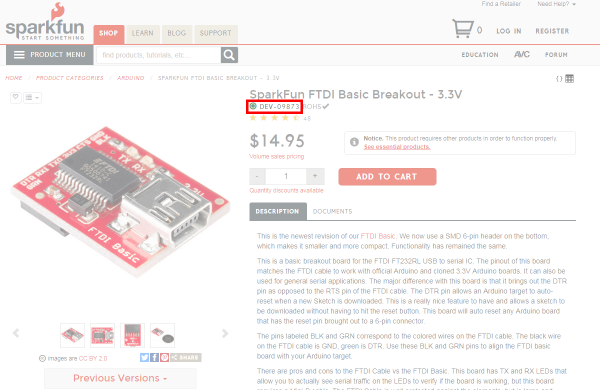

- **はんだ付けの接合部やセットアップの、高品質で鮮明な画像**：はんだ付けの接合部やセットアップの、高品質で鮮明な画像がいくつかあると役に立つ。ピントが合っていて、十分な明るさがあることを確認しよう。投稿する前に、回路の様子がきちんと見えるか写真を確認しておくこと。

  以下は、何が起きているのか見づらい、セットアップの不鮮明な画像の例である。とはいえ、そのチョコバーはおいしそうに見える。

  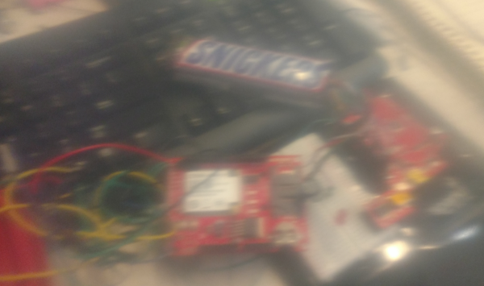

  以下の画像は、トラブルシューティングの助けになる、はんだ付けの接合部を鮮明に写したものである。

  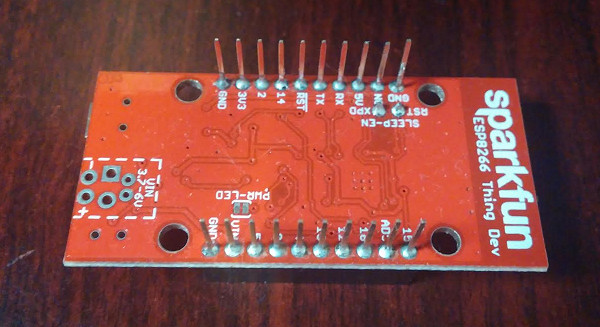

  以下の画像は、セットアップとピンの接続を鮮明に写したものである。配線は途中で切れているが、接続をたどれるはずである。とはいえ、同じ色の配線が複数ある場合、トラブルシューティングの妨げになることもある。

  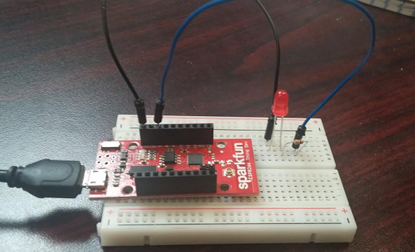

- **セットアップについての情報**：電源の電圧・電流設定、基板に電源が入っていたかどうか、基板への改造、システムに接続されている追加の部品、使用環境などが含まれる。

---

これらの情報を準備できたら、フォーラムに投稿してみよう。

[SparkFun Forums](https://forum.sparkfun.com/)

## まとめ

SparkFunの以下の資料もぜひ確認してみてほしい。

- [SparkFun Electronics GitHub Repo](https://github.com/sparkfun)
  - [SparkFun Fritzing Repo](https://github.com/sparkfun/Fritzing_Parts)
  - [SparkFun 3D Model Repo](https://github.com/sparkfun/3D_Models)
  - [SparkFun Arduino Boards Repo](https://github.com/sparkfun/Arduino_Boards/tree/master)
  - [SparkFun Technical Support Repo](https://github.com/SparkfunTechSupport/)

トラブルシューティングについてさらに詳しく知りたい場合は、次の関連ブログ記事も参考にしてほしい（いずれも英語）。

- [Soldering and Troubleshooting Homebrew PCBs](https://news.sparkfun.com/2295)
- [Enginursday: Troubleshooting a Simple Problem](https://news.sparkfun.com/2573)
- [Enginursday: Sparking Creativity in Troubleshooting](https://news.sparkfun.com/2746)
- [PCB Bring-Up with SparkFun and inspectAR](https://news.sparkfun.com/3268)

タグ: 概念、電気工学、スキル

---

出典：[SparkFun Troubleshooting Tips](https://learn.sparkfun.com/tutorials/sparkfun-troubleshooting-tips)（SparkFun Learn）を日本語に翻訳し、再構成した。
原文は [CC BY-SA 4.0](https://creativecommons.org/licenses/by-sa/4.0/) ライセンスで公開されており、本ページも同ライセンスの下で提供する。
