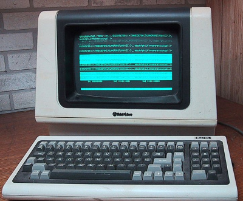
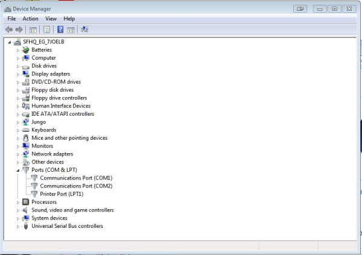
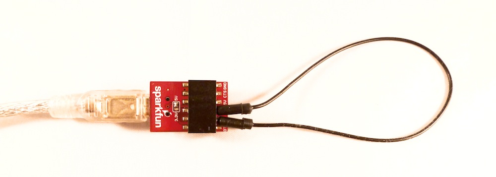
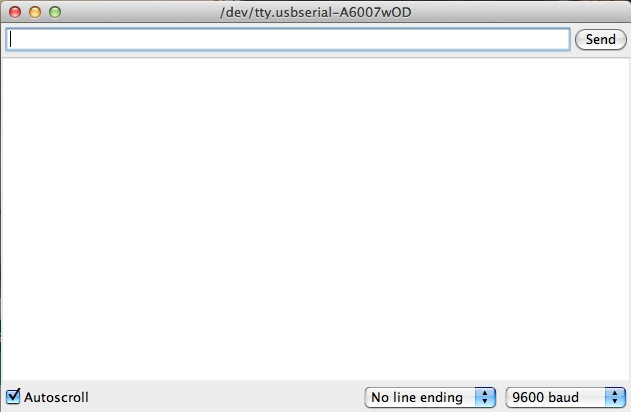
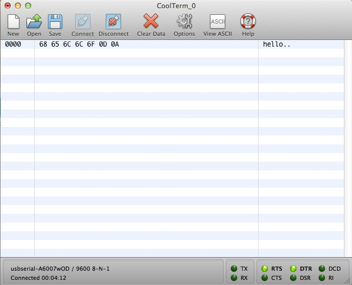

# シリアルターミナルの基礎

COMポート、ボーレート、フロー制御、TX、RX。
これらはすべて、電子工作、特にマイクロコントローラを扱うときによく飛び交う言葉である。
これらの用語や、それが使われる文脈に馴染みがない人にとっては、時に混乱を招くこともある。
このチュートリアルでは、これらの用語が何を意味し、それらがどのようにつながってターミナル上でのシリアル通信という全体像を作り上げているのかを解説する。

簡単に言えば、シリアルターミナルプログラムは、マイクロコントローラを扱う作業をはるかに簡単にしてくれる。
マイクロコントローラとの間で送受信されるデータを見ることができ、そのデータはトラブルシューティングやデバッグ、通信テスト、センサーの校正、モジュールの設定、データの監視など、さまざまな目的に使える。
ターミナルアプリケーションの使い方を一通り身につければ、電子工作やプログラミングの強力な武器になる。

このチュートリアルで扱う内容:

世の中には数多くのターミナルプログラムがあり、それぞれに長所と短所がある。
このチュートリアルでは、ターミナルとは何か、どのターミナルプログラムがどんな状況やOSに向いているか、そして各プログラムの設定方法と使い方について解説する。

参考になるチュートリアル:

このチュートリアルに入る前に、次の話題に馴染んでおくとよい。

- [シリアル通信](./serial-communication.md)
- [アナログとデジタルの違い](./analog-vs-digital.md)
- [2進数](./binary.md)
- [16進数](./hexadecimal.md)
- [ASCII](./ascii.md)
- [Installing FTDI Drivers（FTDIドライバーのインストール）](https://learn.sparkfun.com/tutorials/how-to-install-ftdi-drivers)
- [RS-232 vs TTL Serial Communication（RS-232とTTLシリアル通信の違い）](https://www.sparkfun.com/news/2461)
- [ロジックレベル](./logic-levels.md)
- [コネクタの基礎](./connector-basics.md)、特にUSBの節

## ターミナルとは何か

ターミナルエミュレータにはさまざまな呼び名があり、「ターミナル」という言葉自体もいろいろな意味で使われるため、人によって指しているものが異なり、混乱を招くことがある。
ここで整理しておこう。

### 簡単な歴史

「ターミナル」という言葉の由来を理解するには、それほど遠くない過去にさかのぼる必要がある。
コンピュータが大きく、かさばり、部屋全体を占領していた時代、コンピュータとやり取りする方法はごくわずかしかなかった。
パンチカードや紙テープのリールもそのひとつだったが、データの入力と取得に使われる[ターミナル](https://ja.wikipedia.org/wiki/コンピュータ端末)というものも存在した。
これらのターミナルにはさまざまな形状があったが、やがて後のパーソナルコンピュータの祖先のような姿になっていった。
多くはキーボードと画面から構成されていた。
文字だけを表示できるターミナルはテキストターミナルと呼ばれ、後にグラフィカルターミナルが登場した。
ターミナルエミュレータについて語るとき、参照されているのはこの過去のターミナルたちである。



### 現代のターミナル

今日のターミナルプログラムは、こうしたかつてのターミナルで作業していた体験を「エミュレート（模倣）」している。
これらはエミュレータ、アプリケーション、プログラム、ターム、TTYなどと呼ばれる。
このチュートリアルでは、単に「ターミナル」という言葉を使うことにする。
かつては特定の種類のコンピュータターミナルをエミュレートするものが多かったが、今日のたいていのターミナルはもっと汎用的なインターフェースを持っている。

現代のOSで作業する際は、こうしたアプリケーションの中で作業することを表すのに**ターミナルウィンドウ**という言葉がよく使われる。
他のチュートリアルやハードウェアの使い方ガイドを読んでいると、ターミナルウィンドウを開くよう求められることがよくあるはずだが、それは好みのターミナルプログラムのどれかを開けばよいという意味である。

また、多くのターミナルプログラムはシリアル通信以外にもさまざまな機能を備えている点も触れておく価値がある。
telnetやSSHのようなネットワーク通信の機能を持つものも多いが、このチュートリアルではそうした機能は扱わない。

### ターミナルとコマンドラインの違い

ターミナルはコマンドプロンプトではないが、両者はいくらか似ている。
Mac OSでは、コマンドプロンプトそのものが「ターミナル」と呼ばれているため、この言葉を使うとよく混乱が生じる。
いずれにせよ、ターミナルウィンドウでできることの一部はコマンドプロンプトでも実行できるが、その逆は成り立たない。ターミナルウィンドウの中でコマンドライン用の命令を実行することはできない。
コマンドラインインターフェースの中でシリアルターミナル接続を作る方法については、このチュートリアルの後半で扱う。
今はまず、この2つを区別できるようにしておこう。

## 基本用語

シリアルターミナルウィンドウを扱う際に知っておくべき用語をいくつか紹介する。
これらの用語の多くは、[シリアル通信のチュートリアル](./serial-communication.md)でさらに詳しく扱っているので、全体像をつかむためにもぜひそちらも読んでほしい。

**ASCII**：American Standard Code for Information Interchangeの文字コード化方式の略で、[ASCII](./ascii.md)はキーボード上の特殊文字を、多くのプログラムや機器が認識できる7ビットの2進数の整数に変換する。シリアルターミナルを扱う際は、ASCII表が非常に役立つ。

**ボーレート**：簡単に言えば、データがどれくらいの速さで送受信されているかを示す。9600が標準的な速度だが、機器によっては他の速度が使われることもある。通信の鎖でつながったすべての機器は同じ速度で「話す」必要があり、そうでなければどちらか一方でデータが誤って解釈されてしまうことを覚えておこう。

**送信（TX）**：Data OutやTXOとも呼ばれる。どの機器でもTX線はデータを送信するためのものであり、通信したい相手の機器のRX線に接続する必要がある。

**受信（RX）**：Data InやRXIとも呼ばれる。どの機器でもRX線はデータを受信するためのものであり、通信したい相手の機器のTX線に接続する必要がある。

**COMポート（シリアルポート）**：パソコンに接続する機器にはそれぞれ特定のポート番号が割り当てられる。これにより、接続された各機器を識別しやすくなる。ある機器にポートが割り当てられると、その機器を接続するたびに同じポートが使われる。

自分の機器は、パソコン上で**COM#**（Windowsマシンの場合）または**/dev/tty.usbserial-########**（Mac/Linuxコンピュータの場合）として表示される。ここで#の部分は固有の数字やアルファベットである。

**TTY**：TTYはテレタイプライター（teletypewriter）、あるいはテレタイプ（teletype）の略である。「ターミナル」がかつてのターミナルを指す言葉であるのと同じように、「テレタイプ」もそれに由来する。これは、ターミナル、そしてメインフレームに情報を入力するために使われていた電気機械式のタイプライターである。MacやLinuxでターミナルを扱う際は、「COMポート」の代わりに通信ポートを表す言葉としてttyがよく使われる。

**データビット、ストップビット、パリティビット**：ターミナルとの間で送受信されるそれぞれのデータパケットには、特定のフォーマットがある。このフォーマットはさまざまであり、ターミナルの設定を調整することで異なるパケット構成に対応できる。もっともよく見かける構成のひとつが8-N-1であり、これはデータビット8、パリティビットなし、ストップビット1を意味する。

**フロー制御**：フロー制御とは、送信側が受信側の処理速度を超える速さでデータを送りすぎないようにするために、機器間でデータの送信速度を制御する仕組みである。これらのチュートリアルで使われるたいていのアプリケーションでは、フロー制御を使う必要はない。フロー制御は、8-N-1-Noneという略記の中に含まれることもあり、これはフロー制御なしを意味する。

**キャリッジリターンとラインフィード**：キャリッジリターンとラインフィードは、キーボードのEnterキーを押したときに送信される[ASCII](./ascii.md)文字である。これらの用語はタイプライターの時代に由来する。キャリッジリターンは、紙を保持するキャリッジがその行の先頭に戻ることを意味していた。ラインフィード（改行とも呼ばれる）は、前の行に重ねて打たないよう、キャリッジを次の行へ移動させることを意味していた。

現代のキーボードで入力する際も、この考え方は変わらない。
Enter（あるいはReturn）を押すたびに、カーソルを次の行へ移動させ、その新しい行の先頭に戻すよう指示していることになる。

[ASCII表](./ascii.md)を確認すると、ラインフィードの文字は10（16進数で0x0A）、キャリッジリターンは13（16進数で0x0D）であることが分かる。
この2つの文字の重要性はいくら強調してもし足りない。
ターミナルウィンドウを扱う際は、Enterキーをエミュレートするためにこの2つの文字のどちらか（あるいは両方）が使われているかをよく意識する必要がある。
機器によっては、コマンドが送信されたことを認識するのにどちらか片方の文字だけを必要とするものもある。
さらに重要なのは、マイクロコントローラを扱う際、自分がどのようにデータを送っているかを意識することである。
5文字の文字列をマイコンに送る必要がある場合、各コマンドの後に10と13が送られることを考慮して、実際には7文字分を保持できる文字列が必要になることがある。

**ローカルエコー**：ローカルエコーは、シリアルターミナル側でも、通信相手の機器側でも（時には両方でも）変更できる設定である。この設定は、入力したものをすべてターミナルに表示するよう指示するだけのものである。この利点は、エラーが起きた際に、実際に正しいコマンドを入力できているかを確認できることである。ただし、ローカルエコーが裏目に出ることもあるので注意しよう。機器によっては、ローカルエコーを二重入力として解釈してしまうことがある。たとえば、ローカルエコーを有効にした状態で`hello`と入力すると、受信側の機器には`hheelllloo`と見えてしまうことがあり、これはおそらく正しいコマンドではない。たいていの機器はローカルエコーの有無にかかわらずコマンドを処理できるが、これが問題になりうることは覚えておこう。

**シリアルポートプロファイル（SPP）**：シリアルポートプロファイルは、Bluetooth機器とホスト/ペリフェラル機器の間でシリアル通信を可能にするBluetoothのプロファイルである。このプロファイルが有効になっていれば、シリアルターミナルを通じてBluetoothモジュールに接続できる。これは設定目的にも通信目的にも使える。このチュートリアルには直接関係しないが、プロジェクトでBluetoothを使いたい場合は知っておくとよいプロファイルである。

## 機器に接続する

ターミナルとは何か、そしてその周辺の用語が分かったところで、いよいよ機器を接続して通信してみよう。
このセクションでは、機器の接続方法、割り当てられたポートの調べ方、そのポートを通じた通信方法を紹介する。

### 必要なもの

この例では、次のものが必要である。

- FTDI Basic（5Vでも3.3Vでもよい）。手元にFTDIケーブルしかなければ、それでもよい。
- USB Mini-Bケーブル（FTDIケーブルを使う場合は不要）。
- ジャンパー線。たいていのFTDI製品はメスヘッダーを備えているため、オス-オスのジャンパーケーブルで十分なはずである。あるいは、両端の被覆を剥いた配線を使ってもよい。

### 機器を見つける

必要なものがそろったら、FTDI BasicをUSBケーブルに接続し、そのケーブルをパソコンに接続する。
この種の機器をパソコンに接続するのが初めてであれば、ドライバーのインストールが必要になることがある。
その場合は、[FTDIドライバーのインストールガイド](https://learn.sparkfun.com/tutorials/how-to-install-ftdi-drivers)を参照してほしい。
ドライバーが最新であれば、そのまま続けよう。

使っているOSによって、機器に割り当てられたポートを調べる方法はいくつか異なる。

#### デバイスマネージャー（Windows）

どのバージョンのWindowsでも、**デバイスマネージャー**というプログラムが用意されている。
デバイスマネージャーを開くには、スタートメニューを開き、検索欄に

```
devmgmt.msc
```

と入力してEnterキーを押せばすぐに開く。
あるいは、マイコンピュータを右クリックして「プロパティ」を選び、そこからデバイスマネージャーを開くこともできる（Windows 7の場合）。
複数のシリアル機器と頻繁に通信する予定であれば、デバイスマネージャーへのデスクトップショートカットを作っておくとよいだろう。

デバイスマネージャーを開いたら、「ポート」タブを展開する。
必要な情報はここにある。



この画像には、いくつかのCOMポートが表示されている。
まず知っておくべきなのは、COM1は**常に**本物のシリアルポート用に予約されており、USB用ではないということである。
両端にDB9コネクタが付いた、あの灰色のかさばるケーブルのことである。
たいていのコンピュータ（特にノートパソコン）にはもはやシリアルポートが搭載されておらず、より多くのUSBポートに置き換えられて時代遅れになりつつある。
それでも、OSは本物のシリアルポートを持つユーザーのために、COM1をそのポート専用に予約し続けている。

もうひとつ、たいていのコンピュータに表示される可能性が高いポートがLPT1である。
これはパラレルポート用に予約されている。
パラレルポートとケーブルはシリアルケーブルよりもさらに時代遅れになりつつあるが、それでも多くのコンピュータには（プリンターへの接続によく使われる）これらのポートが搭載されており、OSはそれに対応する必要がある。

これらを脇に置いておけば、実際に使う必要のあるポートに集中できる。
FTDIを接続すると、新しいCOMポートがリストに追加されるはずである。

たいてい、コンピュータは接続した機器を順に番号付けしていく。
たとえば、これがパソコンに接続する最初のシリアル通信機器であれば、COM2として割り当てられるはずである。
何台もの機器を接続してきたコンピュータでは、8台目、9台目としてCOM9のように割り当てられることもある（COM1のことを忘れないように）。

重要なのは、いったんある機器がコンピュータに関連付けられ、ポートが割り当てられると、その機器を接続するたびにコンピュータがそれを覚えているという点である。
そのため、たとえばCOM4が割り当てられたArduino基板があるなら、毎回デバイスマネージャーを開いてどのCOMポートにあるかを確認する必要はない。その機器は常にCOM4になるからである。
これはよい面も悪い面もある。
たいていの人は数十台以上のシリアル機器をパソコンに接続することはないが、中には*大量に*機器を接続する人もおり、コンピュータが割り当てられるポート数には上限がある（確か256だったと思う）。
そのため、古いCOMポートを削除する必要が出てくることもある。

複数の機器を持っていて、どれが今接続したばかりの機器か分からない場合は、その機器を一度抜いてどのCOMポートが消えるかを確認し、また接続し直せばよい。
そのCOMポートが再び現れれば、それが探していた機器である。

最後にもうひとつ、たとえ異なるドライバーを必要とする場合でも、すべてのシリアル機器はWindowsではCOMポートとして表示されるということも触れておく。
たとえばArduino UnoとFTDI Basicはそれぞれ異なるドライバーを必要とする技術的に異なる種類の機器だが、Windowsはそれらを区別しない。
どちらも同じように扱われ、気にする必要があるのはどのCOMポートに割り当てられているかだけである。
Mac OSとLinuxはこの点を少し異なる方法で扱う。詳しくは以下を読んでほしい。

#### コマンドライン（Mac、Linux）

Windowsと同じように、Mac OSとLinuxもパソコンに接続されたそれぞれの機器に特定のポートを割り当てる。
ただし、Windowsとは異なり、現在接続されているすべての機器を一覧表示できる専用のプログラムはない。
とはいえ心配は要らない。機器を見つけるためのシンプルな方法がちゃんとある。

Mac OS Xのデフォルトのコマンドラインインターフェースはターミナルである。
開くには、ユーティリティフォルダを開く。そこにターミナルのアイコンがあるはずである。
Linuxを使っているなら、コマンドラインウィンドウの開き方はすでに知っているものとする。

開いたら、次のコマンドを入力する。

```bash
ls /dev/tty.*
```

これで、パソコン上のすべてのシリアルポートの一覧が表示されるはずである。

いくつかのBluetoothポートも表示されることに気づくだろう。
これらの名前の中にあるSPPの部分に注目してほしい。それは、そのBluetooth機器がシリアルターミナルとも通信できることを示している。

注目すべき重要な機器は`tty.usbserial`と`tty.usbmodem`である。
この例では、FTDI BasicとArduino Unoの両方をパソコンに接続している。
これは、両者の重要な違いを示すためのものである。
先に述べたように、一部の機器はコンピュータとの通信方法によって扱いが異なる。
FDTI Basicに搭載されているFT232 ICは本物のシリアル機器であり、`usbserial`として表示される。
一方Unoは HID機器であり、`usbmodem`として表示される。
HID（ヒューマンインターフェースデバイス）プロファイルはキーボードやマウス、ジョイスティックなどに使われるものであり、シリアルデータを送れるにもかかわらず、HID機器としてコンピュータから少し異なる扱いを受ける。
いずれにせよ、シリアルターミナルに接続する際に探すべきなのはこれらの`tty.usb______`というポートである。

### エコーテスト

準備が整ったところで、いよいよFTDIと実際に通信してみよう。
それぞれのターミナルプログラムの詳細は以降のセクションで扱うが、この例ではCoolTermを使って説明する。ただし、どのターミナルでも同じことができる。

正しい設定（9600、8-N-1-None）でターミナルを開く。

ローカルエコーがオフになっていることを確認する。

ジャンパー線を使い、FTDI BasicのTX線とRX線を接続する。



さあ、何か入力してみよう。

入力したものはすべてターミナルウィンドウに表示されるはずである。
たいしたことではないが、これでターミナルとの通信ができていることになる。
データはキーボードからパソコンへ、USBケーブルを通じてFTDIへ、FTDIのTXピンから出て、RXピンに入り、再びUSBケーブルを通ってパソコンに戻り、最終的にターミナルウィンドウに表示されている。
信じられなければ、ジャンパーを抜いてもう一度入力してみてほしい。
ローカルエコーをオフにしていれば、何も表示されないはずである。これがエコーテストである。

#### おまけ

もし2枚のFTDI基板や似たようなシリアル機器を持っているなら、両方を接続してみるとよい。
片方のTX線をもう片方のRX線に、そしてその逆も接続する。
そして2つのシリアルターミナルウィンドウを開き（複数のターミナルウィンドウを同時に開くこともできる）、それぞれ異なる機器に接続する。
両方が同じボーレートと設定になっていることを確認する。
接続して、入力を始めてみよう。
片方のターミナルに入力したものが、もう片方のターミナルに表示され、その逆も起こるはずである。
これで、非常に単純なチャットクライアントを作り上げたことになる。

それでは、さまざまなターミナルプログラムを見ていこう。

## Arduino Serial Monitor（Windows、Mac、Linux）

Arduino統合開発環境（IDE）は、[Arduinoプラットフォーム](./what-is-an-arduino.md)のソフトウェア側を担っている。
そして、ターミナルを使うことがArduinoやその他のマイクロコントローラを扱ううえで非常に大きな部分を占めるため、Arduino IDEにはシリアルターミナルが同梱されている。
Arduino環境の中では、これはSerial Monitorと呼ばれている。

### 接続する

Serial Monitorは、どのバージョンのArduino IDEにも同梱されている。
開くには、Serial Monitorのアイコンをクリックするだけでよい。

Serial Monitorで開くポートを選ぶ手順は、Arduinoのコードをアップロードするためのポートを選ぶのと同じである。
*ツール → シリアルポート*に移動し、正しいポートを選択する。

開くと、次のような画面が表示されるはずである。



### 設定

Serial Monitorの設定項目は限られているが、たいていのシリアル通信のニーズには十分対応できる。
最初に変更できる設定はボーレートである。
ボーレートのドロップダウンメニューをクリックして、正しいボーレートを選択する。

Enterキーのエミュレーションも、キャリッジリターン、ラインフィード、両方、あるいはどちらもなし、に変更できる。

最後に、左下隅のチェックボックスで、ターミナルを自動スクロールするかどうかも設定できる。

### 長所

Serial Monitorは、Arduinoとシリアル接続をすばやく簡単に確立するのに優れた方法である。
すでにArduino IDEで作業しているなら、データを表示するために別のターミナルを開く必要は特にない。

### 短所

Serial Monitorは設定項目が少なく、高度なシリアル通信には物足りないことがある。

## HyperTerminal（Windows）

HyperTerminalは、XPまでのWindows OSで事実上標準的なターミナルプログラムだった。Windows Vista、7、8には同梱されていない。
Windows Vista、7、8を使っていて、どうしてもHyperTerminalが必要な場合は、インターネットを少し調べれば回避策が見つかるはずである。
とはいえ、より優れた代替ソフトのほうが手に入れやすいので、それについてはすぐ後で紹介する。

## Tera Term（Windows）

Tera Termは、Windows向けのターミナルプログラムの中でも特に人気の高いもののひとつである。
長年使われ続けており、オープンソースで、使い方もシンプルである。
Windowsユーザーにとって、もっともよい選択肢のひとつである。

Tera Termをインストールしたら、接続したいシリアルポートを選ぶ「TeraTerm: New connection」というポップアップが表示されるはずである。
「Serial」のラジオボタンを選び、ドロップダウンメニューから自分のポートを選択する。
Tera Termはデフォルトでボーレートを9600bps（8-N-1）に設定する。
シリアルの設定を調整する必要がある場合は、*Setup → Serial Port*に進む。

ローカルエコーを有効にしたい場合は、*Setup*メニューから*Terminal*を選択する。
ターミナル画面をクリアしたい場合は、*Edit*メニューにある「Clear buffer」または「Clear screen」コマンドを使う。

## RealTerm（Windows）

Tera TermはASCIIだけのシンプルなシリアルターミナル作業には優れているが、0〜255の範囲の2進数値の並びを送りたい場合はどうすればよいだろうか。
そのような用途には、RealTermがよく使われる。
RealTermは、2進数やその他の入力しにくいデータの並びを送信するために特別に設計されている。

RealTermでは、「Send」タブから2進数、16進数、10進数の値の並びを長く送信できる機能があり、これが他のターミナルプログラムとの大きな違いになっている。
「Display」タブの「Display As」の項目では、受信したデータを標準的なASCII文字として表示するか、16進数の値として表示するかなど、さまざまな表示形式を選べる。

RealTermは、より高度なターミナル用途に向いている。
特定のバイト列を送る必要がある場合はRealTermを、より基本的なターミナル作業にはTera Termを使うのがおすすめである。

## YAT - Yet Another Terminal（Windows）

YATは使いやすく機能豊富なシリアルターミナルである。
テキスト通信とバイナリ通信の両方に対応し、あらかじめ定義したコマンド、複数ドキュメントに対応したユーザーインターフェース、そのほか多くの付加機能を備えている。

## CoolTerm（Windows、Mac、Linux）

CoolTermは、どのOSを使っていても便利だが、Windowsほど選択肢の多くないMac OSでは特に重宝する。

設定を変更するには、歯車とレンチのアイコンのOptionsをクリックする。
ここでポート、ボーレート、ビットのオプション、フロー制御を選択できる。

左側のTerminalタブでは、Enterキーのエミュレーション（キャリッジリターン/ラインフィード）の変更、ローカルエコーのオンオフ、ラインモードとローモードの切り替えができる。
ラインモードはEnterキーが押されるまでデータを送信せず、ローモードは文字を直接画面に送信する。

CoolTermの優れた機能のひとつがHex Viewである。
送信しているデータの実際の16進数の値をASCII値の代わりに見たい場合、Hex Viewが大いに役立つ。



*ここでは「hello」と入力している。キャリッジリターンとラインフィードに対応する0Dと0Aが表示されていることに注目してほしい。*

Send String機能を使えば、文字列全体を16進数モードやASCIIモードで送信することもできる。

## ZTerm（Mac）

ZTermは、Macユーザー向けのもうひとつのターミナルの選択肢である。
CoolTermに比べると使いやすさでは劣るように見えるが、慣れてしまえば同じくらい便利である。

接続する際は正しいポートを選択する。
一度接続すると、次回起動時にはZTermが直前の接続を自動的に開こうとする。
これを避けたい場合は、ZTermを起動する際に**Shift**キーを押しながら起動すればよい。

接続後の設定変更は*Settings → Connection*から、接続後にポートを変更したい場合は*Settings → Modem Preferences*から行える。

マクロ機能も便利である。*Macros → Edit Macros*から、頻繁に入力するコマンドをマクロとして登録しておける。

## コマンドライン（Windows、Mac、Linux）

先に述べたとおり、コマンドラインインターフェースを使ってシリアル接続を作ることも*できる*。
大きな制約は、接続オプションの少なさである。
ここまで紹介してきたたいていのプログラムには、特定の接続に合わせて調整できる多くのオプションがあるのに対し、コマンドラインの方法はとっさに機器へ手早く接続するための手段に近い。
3つの主要なOSでの実現方法を紹介する。

### TerminalとScreen（Mac、Linux）

#### Mac

ターミナルを開く。
`ls /dev/tty.*`と入力して、利用可能なすべてのポートを確認する。

`screen`コマンドを使えば、シンプルなシリアル接続を確立できる。

`screen <ポート名> <ボーレート>`と入力して接続を作る。

ターミナルは空白になり、カーソルだけが表示される。これでそのポートに接続できている。

切断するには、`control-a`に続けて`control-\`と入力する。
本当に切断してよいか確認が表示される。

`screen`で制御できる他のオプションもあるが、この方法はコマンドラインに慣れている場合にのみ使うことをおすすめする。
すべてのオプションとコマンドの一覧は`man screen`で確認できる。

#### Linux

`screen`コマンドはLinuxでも使える。
Macの手順との違いはわずかである。

`screen`がインストールされていない場合は、`sudo apt-get install screen`で入手する。

接続方法はMacと同じである。

切断するには、`control-a`に続けて`shift-k`と入力する。

これだけである。

### MS-DOSプロンプト（Windows）

Windowsでコマンドラインにたどり着くもっとも速い方法は、スタートメニューをクリックし、検索欄に`cmd`と入力してEnterを押すことである。

これで空白のMS-DOSコマンドラインプロンプトが開く。

シリアルコマンドを実行するには、まずPowerShellに入る必要がある。
`powershell`と入力してPowerShellのコマンドモードに入る。

利用可能なすべてのCOMポートの一覧を見るには、次のように入力する。

```powershell
[System.IO.Ports.SerialPort]::getportnames()
```

必要なポートのインスタンスを、次のコマンドで作成する。

```powershell
$port = new-Object System.IO.Ports.SerialPort COM#,Baudrate,None,8,one
```

これで、そのCOMポートに接続し、データを送受信できるようになる。

```powershell
$port.open()
$port.WriteLine("some string")
$port.ReadLine()
$port.Close()
```

繰り返しになるが、この方法によるシリアル通信は、コマンドラインの上級者にのみおすすめする。

## コツと裏技

### COMポートの変更と削除（Windows）

機器を特定のCOMポートに割り当てたい場合がある。
たとえば、古いバージョンのTera Termでは、COM16番以下のポートにしか接続できなかった。
そのため、機器がCOM17にある場合は、接続できるように変更する必要があった。
この問題は新しいバージョンのTera Termでは解決されているが、それでも一定数以下のCOMポートしか許容しないプログラムは他にも数多く存在する。

これを回避するには、デバイスマネージャーを開き、変更したいポートを右クリックして「プロパティ」を選び、「ポートの設定」から「詳細設定」に進む。
そこには利用可能なすべてのCOMポートのドロップダウンメニューがあり、一部には「使用中」と表示されている。
たとえばCOM9をCOM3に変更したい場合、このメニューでCOM3を選んでOKをクリックするだけでよい。

**警告：** 古いポートを整理する際、COM1は絶対に選ばないこと。この方法は本当に必要なときだけ使うべきであり、頻繁に行うべきではない。

### TTYとCUの違い（Mac、Linux）

UnixやLinuxの環境では、それぞれのシリアル通信ポートに`tty.*`と`cu.*`という2つの側面がある。
Arduino IDEなどでポートを確認すると、1つのポートに対して両方が表示されることがある。

この2つの違いは、TTYデバイスが機器やシステムへの着信（call in）に使われるのに対し、CUデバイス（call-up）は機器やシステムからの発信（call out）に使われるという点である。
これにより、同時に双方向の通信（全二重）が可能になる。
ターミナルやその他のプログラムを通じてネットワーク通信を行う場合に特に重要になる知識だが、頻繁に出てくる疑問でもある。
このチュートリアルの目的においては、シリアル通信には常にttyのオプションを使うと覚えておけばよい。

### そのポートに接続できない

特定のポートには、一度に1つの接続しか開くことができない（ただし、異なるポートに接続する複数のターミナルウィンドウを同時に開くことはできる）。
そのため、Arduino Serial Monitorのウィンドウを開いたまま、別のターミナルプログラムで同じポートに接続しようとすると、接続できないというエラーが表示される。
ポートへの接続に問題がある場合は、まずそのポートが他の場所で開かれていないか確認しよう。

他の接続が開かれていないのに接続できない場合は、すべての設定（ボーレートなど）が正しいか確認すること。

### 接続はできているのにデータが見えない

正しいポートに接続できているのにデータが見えない場合、考えられる原因は2つある。
まずボーレートを確認しよう。
何度も同じことを言うようだが、ボーレートを一致させることがもっとも重要な設定である。ボーレートを確認しよう。

もうひとつの原因は、TXとRXの線が逆になっている可能性である。
TX→RX、RX→TXになっているか確認しよう。

### Arduinoのプログラミングとシリアル通信

Arduinoには専用の[UART](./serial-communication.md)（シリアルのTX線とRX線を指すもったいぶった呼び方）が1つある。
Arduinoは、この2本の線を通じてプログラムが書き込まれる。
そのため、Arduino（や他のマイクロコントローラ）を扱う際は、特にコードを開発していて頻繁にアップロードする必要がある場合、これらの線を使って他のシリアル機器と通信するのは避けたほうがよい。

UARTに別の機器を接続していると、パソコンからのデータがArduinoに正しく解釈されず、コードが意図どおりに動かなかったり、アップロードできなかったりすることがある。

同じルールがシリアルターミナルにも当てはまる。
プログラムしようとしているのと同じポートでターミナルを開いていると、うまくいかない。
Arduinoはそのポートと通信できないというエラーを出す。
その場合は、接続を閉じてから再度試してみよう。

これを回避する簡単な方法は、Arduinoに内蔵されているSoftware Serialライブラリを使って、外部とのシリアル通信専用の別のUARTを作ることである。
そうすれば、デフォルトのUARTをプログラミング用に開けたまま、別のポートで通信できる。

## まとめ

盛りだくさんの情報だった。
少なくとも、ターミナルウィンドウとは何か、その使い方、自分の環境に合ったターミナルプログラムの選び方、そしてそのインターフェースの操作方法は分かったはずである。
繰り返しになるが、ターミナルプログラムはシリアル機器やマイクロコントローラを扱ううえで非常に強力な道具である。
さあ、データを集めに行こう。

さまざまな種類の通信についてさらに知りたい場合は、次のチュートリアルも参考になる。

- [SPI（シリアルペリフェラルインターフェース）](./serial-peripheral-interface-spi.md)
- [I2C](./i2c.md)

シリアルターミナルを使う必要がある製品の例としては、次のような使い方ガイドがある（いずれも英語）。

- [OpenLog Hookup Guide（OpenLogの使い方）](https://learn.sparkfun.com/tutorials/openlog-hookup-guide)
- [Bluetooth Mate and BlueSMiRF Hookup（Bluetooth MateとBlueSMiRFの使い方）](https://learn.sparkfun.com/tutorials/using-the-bluesmirf)
- [RN-52 Audio Bluetooth Hookup（RN-52オーディオBluetoothの使い方）](https://learn.sparkfun.com/tutorials/rn-52-bluetooth-hookup-guide)

タグ: Arduino、通信、Raspberry Pi、スキル

---

出典：[Serial Terminal Basics](https://learn.sparkfun.com/tutorials/terminal-basics)（SparkFun Learn）を日本語に翻訳し、再構成した。
原文は [CC BY-SA 4.0](https://creativecommons.org/licenses/by-sa/4.0/) ライセンスで公開されており、本ページも同ライセンスの下で提供する。
