# ペーパー回路総合ガイド

ペーパー回路は、趣味の電子工作の世界でますます人気を集めている。
クラフト用の材料が手に入りやすくなり、新しい製品も次々と登場したことで、電子工作に踏み出そうとするクラフターにとって独特のエコシステムが生まれた。
このガイドでは、ペーパー回路の制作に使える材料と技法の全体像を紹介する。

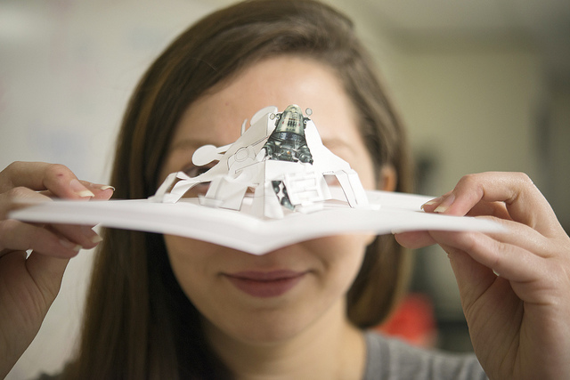

## ペーパー回路とは何か

**ペーパー回路**とは、[PCB](./pcb-basics.md)ではなく紙の上に組み立てられた、実際に機能する電子回路のことである。
グリーティングカードや折り紙から、絵画やデッサンといった伝統的なアート作品まで、題材の幅は広い。
ペーパー回路の特徴は、伝統的なファインアートの技法を使い、美しさと機能性を兼ね備えた回路を作り上げる点にある。

## 参考になるチュートリアル

制作を始める前に、次の概念に馴染んでおくとよい。

- 電気とは何か
- 回路とは何か
- 極性

## トレースを作る：概要

**トレース**とは、配線の代わりとなる経路のことで、プリント基板でよく目にするものである。
ペーパー回路では、紙の表面で部品同士をつなぐ配線の代わりとして導電性の材料を使う。
このチュートリアルでは、塗料、テープ、インクという3種類のトレースを扱う。

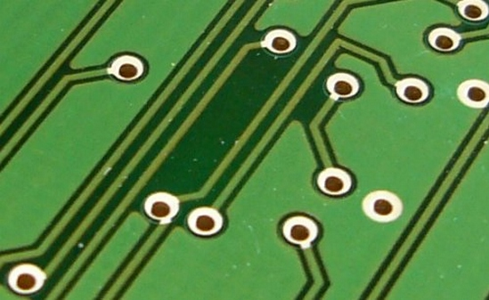

*このPCBの緑色の線が、基板の各部をつなぐトレースである。*

## 導電性テープのトレース

導電性テープは、ペーパー回路の制作を始める上で最も手軽な方法の一つである。
台紙をはがして、回路を通したい場所に貼り付けるだけでよい。
銅テープははんだ付けにも対応しており、塗料やインクの手法では得られない、部品とトレースの間の強固な接続を作ることができる。

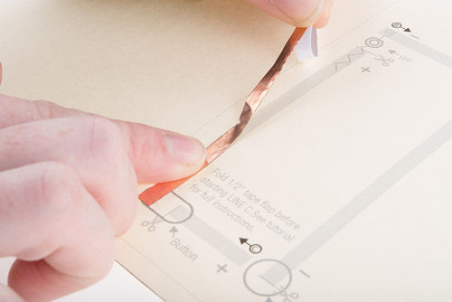

*銅テープとSparkFunのテンプレートを使ったプロトタイピング*

**難易度：** 初心者向け
**コスト：** 材料による（銅テープは1フィートあたり約0.06ドル、ファブリックテープは約0.79ドル）
**汚れやすさ：** 最小限

### 長所

- 乾燥時間が不要
- はんだ付け可能（銅テープのみ）
- 地元で手に入れやすい。銅テープはナメクジよけとしても使われるため金物店で売られていることが多く、ステンドグラス制作にも使われるため手芸店や趣味用品店にも置かれていることがある。ただし、すべてのテープが同じ品質とは限らない。手芸店のテープは扱いにくく、粘着面自体が導電性でないこともある。

### 短所

- 銅テープで紙のように指を切ることがあるため、扱いには注意が必要である。
- 滑らかな線や形を作るのが難しい。テープを細く切ることである程度対応できる。
- 導電性ファブリックテープは高価になりがちである。

### 銅テープ

ペーパー回路で最も一般的な導電性テープは、薄い銅のシートの片面に粘着剤を塗り、ロール状にしたものである。
メーカーによって幅にいくつかの種類があるが、5mm幅のテープは小さなクラフト作業でも扱いやすく、よく使われている。

### ニッケル・銅・コバルト製 幅1インチのファブリックテープ

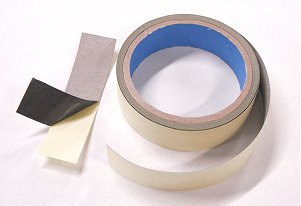

*画像：[LessEMF.com](http://lessemf.com/fabric.html#225)*

銅テープほど一般的ではないが、ニッケル、銅、コバルトでできた導電性ファブリックテープもある。
このテープは曲げやたわみに強く、折り目のあるプロジェクト（中央の折り目をまたいでトレースを通す必要のあるカードなど）に向いている。

### 手順

- 台紙をはがし、トレースを通したい場所に貼り付ける。その際、部品を配置する箇所にはテープの隙間を残すようにする。最も信頼性の高い回路にするには、部品同士の間はできるだけ一続きのテープでつなぐとよい。角を曲げる際は折りたたむ技法を使うか、必要に応じてテープ片同士をはんだ付けする。
- 銅テープの場合、曲げたリード線の上に透明テープを貼ってトレースに固定する。より確実に固定するにはんだ付けを使うとよい。ファブリックテープの場合は、導電性の接着剤を使うか、導電性の糸で縫い付けることを推奨する。

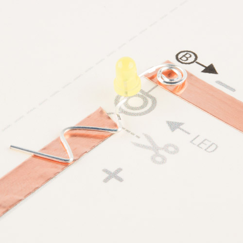

*LEDのために隙間を空けて銅テープを切っている様子に注目してほしい。*

### 制作例

*[Chibitronics](http://chibitronics.com/)によるこの赤面ロボットカードは、薄い銅テープでカード内側のメッセージの文字を形作りつつ、表面のLEDの回路も同時に作っている。*

Jie Qi氏の[Circuit Sketchbook](http://technolojie.com/circuit_sketchbook/)は、本の綴じ部分に導電性ファブリックテープを、表紙の内側に銅テープを使っている。

### さらに参考になる資料

- [Paper Circuits with Copper Tape](http://highlowtech.org/?p=2505) — MITのHigh-Low Tech LabでJie Qi氏が開発した、銅テープを使ったペーパー回路のもとになった資料の一つ。印刷用のテンプレートや技法も掲載されている。
- [Getting Started with Copper Tape for Electronics](https://www.youtube.com/watch?v=XKTPqtRwwXA) — 銅テープの扱い方、接続の作り方、角やカーブの折り方を紹介する動画。
- [Soldering Conductive Fabric](http://www.kobakant.at/DIY/?p=1718_) — KobakantのHannah Perner-Wilson氏による、さまざまな種類の生地へのはんだ付けの検証記録。

## 導電性塗料のトレース

導電性塗料は、電子工作をアート作品として仕上げるのに適した手法である。
筆や絞り出しボトルを使い、曲線や渦を描くように部品同士をつなぐトレースを作ることができる。
導電性塗料は、部品をトレースに「接着」するのにも使える。
この手法は、汚れやすさと乾燥にかかる時間の長さから、扱いに最も苦労することが多い。
慣れないうちは、根気よく練習を重ねることを推奨する。

**難易度：** 初心者〜中級者（複雑さによって変わる）。滑らかな線を引くのに苦労することがある。
**コスト：** 材料による。ほとんどの導電性塗料は10ドル程度から。
**汚れやすさ：** 中程度

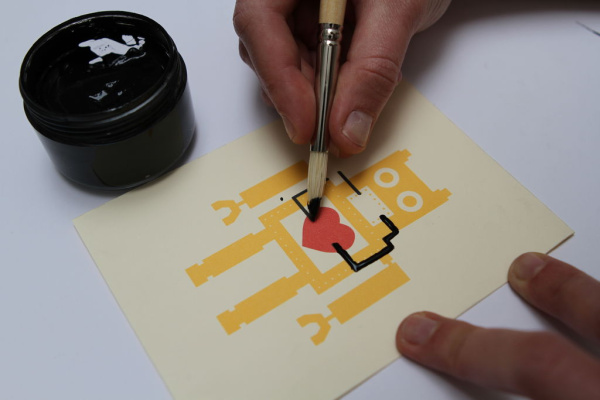

*Bare Conductive Paintを筆で塗っている様子。画像：[Instructables.com](http://www.instructables.com/id/Making-an-Electro-Card-using-Bare-Paint/)*

### 長所

- 他の水性塗料と同じように扱える。
- 乾燥後にアクリルなど他の塗料を重ね塗りでき、継ぎ目のないアート作品に仕上げられる。
- 既存のトレースの上に塗料を重ねやすく、接続不良のトラブルシューティングや修正がしやすい。

### 短所

- 完全に乾くまでは導電性を持たない。塗りの厚みや塗料の種類によっては、一晩かけて乾かす必要がある。ヘアドライヤーやヒートガンを使えば乾燥を早められる。
- 均一な線やトレースを引けるようになるには、ある程度の練習が必要になることがある。
- 銅ベースの塗料は酸化が早く、保存期間が短いことがある。
- 力が加わるとひび割れやすい。平らな面での使用に最も向いている。折り目や曲げの必要なプロジェクトに塗料でトレースを描くと、繰り返しの動きでたいてい壊れてしまう。

### Bare Conductive Electric Paint

Bare ConductiveのElectric Paintは、無毒で溶剤を含まない、水溶性のカーボンベース塗料である。
細い線を引くための絞り出しチューブと、筆やステンシルで使うための容器入りの両方が用意されている。

### CuPro-Cote Paint（LessEMF製）

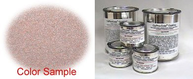

CuPro-Cote Paintは、ラテックス塗料に似た、銅を含む水性塗料である。
4オンスからガロン単位まで容量がある。
開封後は保存期間・作業可能時間が短いため、4オンスサイズを推奨する。

### 手順

- 回路のデザインを考える際は、まずトレースを通す場所を下書きする。塗る前に鉛筆やマーカーで経路を描いておくと、作業がずっと楽になる。
- 使用する部品を紙に接着しておく。小さな部品は、ピンセットで正確に配置するとよい。
- 筆や絞り出しボトルを使い、トレースに沿って、また回路上の部品のワイヤーやパッドの上に、慎重に塗料を塗っていく。テストする前に完全に乾かすこと。

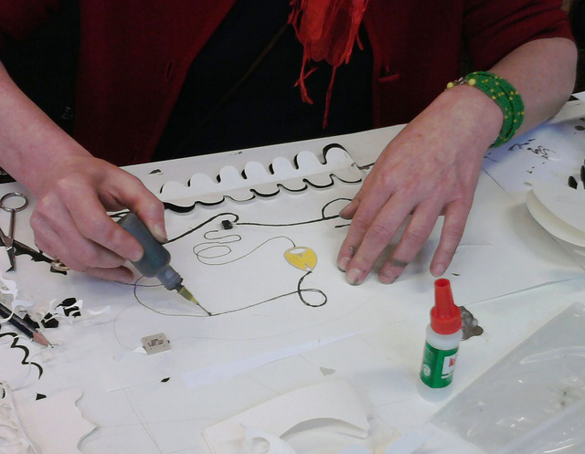

*MITで開催された[塗装式電子工作](http://softcircuitsaturdays.com/2010/05/09/paintable-electronics-workshop)のワークショップで、線に沿って慎重に導電性塗料を塗るアーティスト。*

### 制作例

[Electronic Popables](http://highlowtech.org/?p=5)は、導電性塗料と電子部品で作られたインタラクティブな飛び出す絵本である。

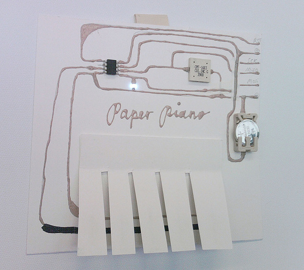

*[Hannah Perner-Wilson](http://www.plusea.at/?p=1069)氏による[Paper Piano](http://highlowtech.org/wiki/pmwiki.php?n=Main.PaperCircuits)*

### さらに参考になる資料

- [Painted Circuits](http://highlowtech.org/?p=1376) — MITのHigh-Low Tech LabによるCuPro-Cote銀塗料を使った塗装ガイド。
- [Diluting Electric Paint](http://www.bareconductive.com/make/diluting-electric-paint/) — Bare Conductive塗料の希釈方法を解説したチュートリアル。
- [Stencil Graphics with a Vinyl Stencil](http://www.bareconductive.com/make/tutorial-1/) — 導電性塗料用のビニールステンシルの作り方。
- [Connecting to Electric Paint](http://www.bareconductive.com/make/connecting-to-electric-paint/) — Bare Conductive製品向けの接続方法。
- [Conductive Paints and Inks](http://www.kobakant.at/DIY/?p=634) — Kobakantによるガイド。

## 導電性インクのトレース

導電性インクは、あらかじめインクを充填したペンとして販売されており、線を描くだけでトレースを作れるようになった。
ほとんどの導電性インクペンは、導電性塗料よりも速く乾く。
この手法は塗るのが最も簡単な一方、部品の接続にはやや苦労することがある。

**難易度：** 初心者〜中級者（インクにどんな部品を接続するかによる）
**コスト：** やや高め。ほとんどのペンは20ドル程度から。
**汚れやすさ：** 最小限

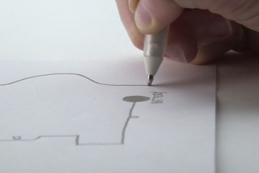

*Circuit Scribeペンで描いている様子。画像：Circuit Scribeの[Kickstarter](https://www.kickstarter.com/projects/electroninks/circuit-scribe-draw-circuits-instantly)ページより。*

### 長所

- 導電性塗料より速く乾く。
- 精密な線を引ける。
- 直感的に使える。

### 短所

- 部品の接続がやや難しいことがある（技法については「接続の作り方」の節を参照）。
- 使う紙の種類によっては、インクが定着しないことがある。写真用紙が最も相性がよい。
- 通常のペンやマーカーと見間違えて、電子工作以外のプロジェクトで誤って使ってしまうことがある。

### Circuit Scribe

Circuit Scribeは、ゲルインクペンのような書き心地の、無毒な銀の導電性インクペンである。
回路を精密な線で描いて見せる（そして光らせる）のに適している。

### AgIC Circuit Marker

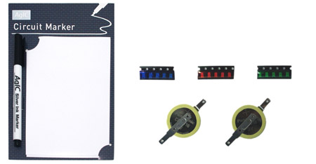

AgICは、マーカー形式で販売されているもう一つの銀ベースのインクである。
EPSON製の光沢写真用紙にしか使えないため、それに合わせてプロジェクトを計画する必要がある。

### 手順

- 鉛筆で回路を下書きする（導電性インクキットにステンシルが付属している場合はそれも使う）。インクはプリンタのトナーにうまく定着しないため、コンピュータで回路をデザインする場合は、直接なぞる線ではなく、塗りつぶす輪郭線として出力しておくこと。
- 導電性インクペンで慎重に線をなぞり、部品同士の間で経路が途切れないようにする。部品がトレースに接続する箇所には、大きめの円やパッドを残しておく。
- インクの線の上にテープ、導電性接着剤、あるいはサーキットステッカーを使って部品を取り付ける。

### 制作例

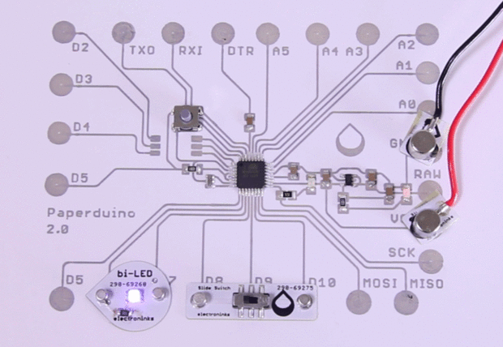

*[Paperduino 2.0](http://www.instructables.com/id/Paperduino-20-with-Circuit-Scribe/) — Circuit Scribeのインクと部品だけで作られた、丸ごと一つのArduino。画像：[Instructables](http://www.instructables.com/id/Paperduino-20-with-Circuit-Scribe/)*

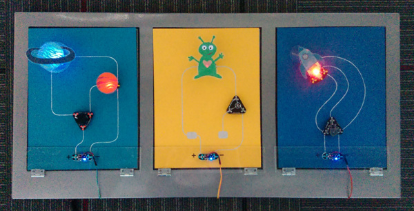

*SparkFunの教育チームが制作した、Circuit Scribeのモジュールとインクを使ったインタラクティブアート。*

### さらに参考になる資料

- [ElectronInks Resources](http://www.electroninks.com/resources/) — Circuit Scribeの開発元が提供する、無料でダウンロードできるワークブックなど、導電性インクを使うための情報。
- [123D Circuits: Circuit Scribe](http://123d.circuits.io/circuitscribe/) — AutoDeskによる、Circuit Scribeのテンプレート作成・シミュレーション用の無料オンラインエディタ。
- [Circuit Scribe Handouts](https://drive.google.com/open?id=0B57ZzMh8PXu1fmItcS1DWXBkME1OQUhqanZ3aG05M0ZZa19ZOUZMTEVBQzZ0Q1hJSHRaR2c&authuser=1) — SparkFun Educationによる、Circuit Scribeを使った制作用テンプレート。
- [AgIC Getting Started Guide](http://agic.cc/en/getting-started) — AgICマーカーでの描き方と、いくつかのサンプルテンプレート。

## 部品の選び方

トレースを作る方法をひととおり見てきたところで、回路に使う部品について見ていく。
すべての部品が、ペーパー回路のトレース材料とうまく組み合わせられるわけではない。
たとえばはんだ付けで接続したいなら、導電性インクよりも銅テープの方が適している。
プロジェクトに使う部品の候補をいくつか紹介する。

### スルーホール部品

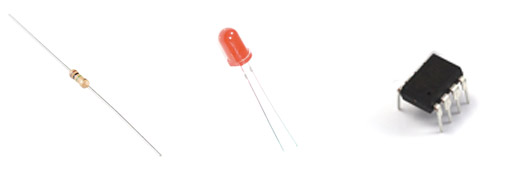

リード線の長いスルーホール部品（LEDなど）は、ペンチで曲げて紙の上に平らに置ける形にすれば、トレースとの接触面積も増やせる。
[ATtiny85](https://www.sparkfun.com/products/9378)のようにリード線が短い部品も、指やペンチで慎重に曲げれば平らにできる。

**組み合わせる材料：**

- Bare Conductive Electric Paint — 塗料を冷はんだ接合のように使う。この工程については[チュートリアル](http://www.bareconductive.com/make/connecting-to-electric-paint/)を参照してほしい。
- 銅テープ — リード線の上に透明テープを貼ってすばやく部品を固定するか、銅テープに直接はんだ付けする。
- 導電性ファブリックテープ — リード線の上から導電性の糸で縫うか、導電性接着剤で固定する。

### SMD部品

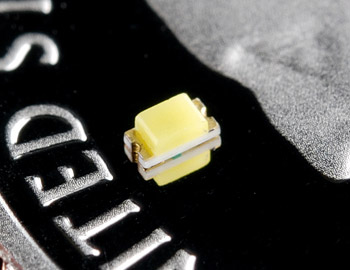

やや扱いにくいものの、表面実装部品（SMD）は薄型で、グリーティングカードのような小型・平面のプロジェクトに向いている。
部品を配置するにはピンセットが必要で、部品自体に書かれたラベルを読み取る目の良さも求められる。
SMD部品は、銅テープにはんだ付けする、パッドに導電性塗料を塗って接続する、あるいは銅テープにテープで貼り付けるといった方法で取り付けられる。
The ExploratoriumのTinkering StudioによるThis [チュートリアル](http://tinkering.exploratorium.edu/tinkering/2013/09/20/working-with-surface-mount-leds-in-paper-circuits)では、SMD LEDの取り付け方として、はんだ付けと透明テープの2種類の方法を紹介している。

**組み合わせる材料：**

- 銅テープ — はんだ付けするか、導電性接着剤で取り付ける。部品によってはテープで銅の上に貼るだけでも固定できる。
- 導電性塗料 — 瞬間接着剤で紙に固定し、部品のパッドの上から塗料を塗って接続する。High-Low Techによる優れた[チュートリアル](http://highlowtech.org/?p=1376)が、その工程を丁寧に解説している。
- 導電性インク — 瞬間接着剤で紙に固定する。その際、インクのパッドと部品のパッドの間に接着剤が入り込まないよう注意する。導電性接着剤やZ軸テープでインクに接続する。この手法は、Circuit Scribeの[Paperduino 2.0](http://www.instructables.com/id/Paperduino-20-with-Circuit-Scribe/step5/Placing-components/)プロジェクトで使われている。

### LilyPad部品

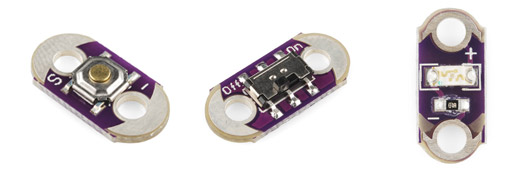

もともとe-textile用途向けに作られた[LilyPad](https://www.sparkfun.com/categories/135)の部品は、薄型で大きな導電パッドを持つため、ペーパー回路との相性がよい。
LilyPad部品は銅テープにはんだ付けするのが最も確実だが、Z軸テープで取り付けたり、パッドの上に透明テープを貼ってトレースに固定したりすることもできる。
なお、透明テープの手法を使う場合、十分な大きさのパッドを持ち確実に接触できるのは[ボタン](https://www.sparkfun.com/products/8776)と[スイッチ](https://www.sparkfun.com/products/9350)の基板だけである。

**組み合わせる材料：**

- 銅テープ — はんだ付けが最も確実だが、導電性テープ、接着剤、透明テープも選択肢になりうる。
- ファブリックテープ — 縫い付けるのが理想的だが、Z軸テープも使える。

### Chibitronics サーキットステッカー

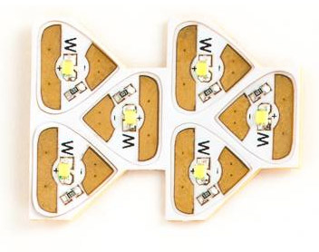

[Chibitronics](https://www.sparkfun.com/categories/tags/chibitronics)のステッカーには導電性の粘着剤が使われており、ペーパー回路のプロジェクトに適している。
ほとんどすべてのペーパー回路用トレースと組み合わせられるが、既製の部品を使うより高価になることがある。

**組み合わせる材料：**

- 銅テープ
- 導電性ファブリックテープ
- 導電性塗料

### Circuit Scribe モジュール

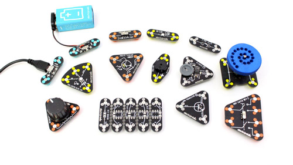

Circuit Scribeの[モジュール](http://www.circuitscribe.com/collections/modules)は、ここまで紹介してきた他の部品とは動作原理が異なり、磁石で接続する。
トレースに取り付けるには、紙の裏側に金属製のシートや面を用意する必要がある。
このチュートリアルで紹介してきた他のより恒久的な接続方法とは異なり、これは一時的な接続である。
小さなプロジェクト（グリーティングカードなど）には向かないサイズだが、壁掛けアートや構成を変えられる作品を作るのには面白い選択肢になる。

**組み合わせる材料：**

- 銅テープ
- 導電性ファブリックテープ
- 導電性インク

## 接続の作り方

トレースの作り方と、プロジェクトに使う部品を選べたところで、いよいよそれらを接続する番である。
ここでは、部品とトレースの間に電気的な接続を作るためのさまざまな技法を紹介する。

### テープ方式

透明テープは、ペーパー回路に部品を取り付ける手軽な方法だが、他の手法ほど確実ではない。
部品のリード線やパッドの上から慎重にテープを押さえ、銅テープに押し当てて固定する。
SMD部品の場合は、部品全体をテープで覆ってしまってもよい。

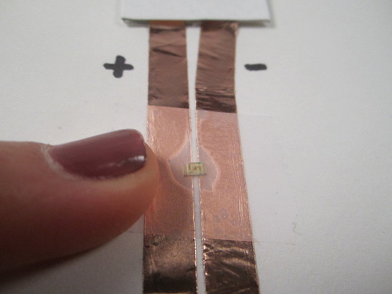

*SMD LEDをテープで覆う様子。画像：[Jie Qi氏](https://www.flickr.com/photos/jieq/6729196835/in/photostream/)のFlickrより。*

**組み合わせる材料：**

- 銅テープ
- スルーホール部品またはSMD部品

### Z軸テープ

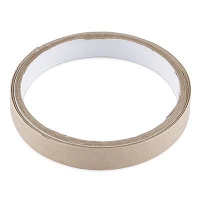

[Z軸テープ](http://solutions.3m.com/wps/portal/3M/en_US/Electronics_NA/Electronics/Products/Product_Catalog/~/3M-Electrically-Conductive-Adhesive-Transfer-Tape-9703?N=4294406280+5153906&Nr=AND%28hrcy_id%3A5CP6S9HG9Rgs_LXDB394ZN3_N2RL3FHWVK_GPD0K8BC31gv%29&rt=d)は、フレキシブル回路やPCBの接続・接合・接地のために設計された、扱いやすい感圧式の両面テープである。
小さく切ったテープを使い、部品を導電性トレースに取り付けることができる。

**組み合わせる材料：**

- 銅テープ
- タブのように表面積の広い部品（ワイヤーをらせん状や四角形に曲げると、接着剤がつかみやすい面を作れる）
- 広い面積の導電性インク（部品用のパッドを描き、そこにテープで取り付ける）

### 導電性塗料

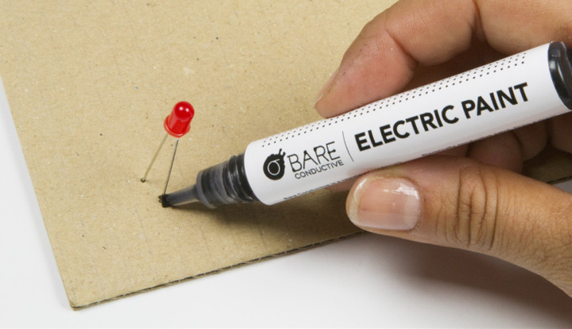

*画像：Bare Conductiveの[冷はんだ付けの方法](http://www.bareconductive.com/make/how-to-cold-solder-with-bare-paint/)より。*

導電性塗料は、接着剤や冷はんだ接合のように使い、部品をトレースに取り付けることができる。
まだ濡れている塗料に部品を押し込んで接続し、通電する前に完全に乾かす。

**組み合わせる材料：**

- 導電性塗料のトレース — 元のトレースがまだ濡れているうちに部品を取り付けると、最も確実な接続になる。
- 曲がらない面 — 塗料は繰り返し力が加わるとひび割れたり壊れたりすることがある。塗る前に部品のリード線を紙に貫通させておくと、ある程度ひずみを逃がせる。
- スルーホール部品とSMD部品

### 導電性接着剤・エポキシ

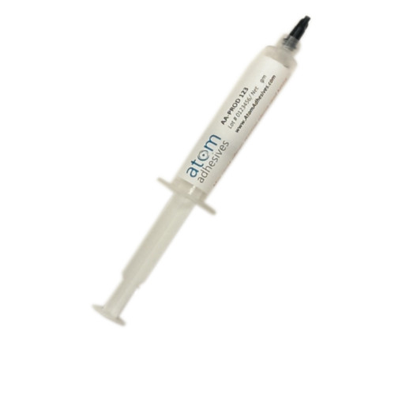

*[Atom Adhesives](http://www.atomadhesives.com/AA-DUCT-CG2-Electrically-Conductive-Silver-Filled-Epoxy-Adhesive?search=cg4)による導電性エポキシの例。*

導電性の接着剤やエポキシも、部品を接続するもう一つの選択肢である。
これらの製品は、ペーパー回路に部品を取り付ける方法の中でも比較的高価で、扱いも難しいことがある。
乾燥に時間がかかったり、加熱による硬化が必要だったりすることも多い。
汚れを抑え、位置合わせを正確に行うには、シリンジ入りのエポキシを探すとよい。
この種の接着剤を使う際は、必ずMSDS（安全データシート）を読み、パッケージの指示に従うこと。

**組み合わせる材料：**

- 銅テープ
- 導電性インク
- スルーホール部品とSMD部品
- LilyPad部品

### はんだ付け

はんだ付けは、ペーパー回路で作れる接続の中でも特に強固なものの一つである。
唯一の欠点は、銅テープにしか使えないことである。導電性塗料、インク、ほとんどのファブリックには、はんだ付けできない。
はんだ付けの方法がわからない場合は、はんだ付けの基本のチュートリアルを参照してほしい。

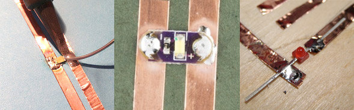

*銅テープに部品をはんだ付けする例（左から順に）：[Tinkering Studio](http://tinkering.exploratorium.edu/tinkering/2013/09/20/working-with-surface-mount-leds-in-paper-circuits)によるSMD LED、SparkFunによるLilyPad LED、[High Low Tech](http://highlowtech.org/?p=1653)による3mm LED。*

**組み合わせる材料：**

- 銅テープ
- スルーホール部品とSMD部品
- LilyPad部品
- サーキットステッカー

## プロジェクトへの電源供給

ペーパー回路のプロジェクトには、3Vのコイン型電池で手軽に電源を供給できる。
グリーティングカードのような小さなプロジェクトには、直径20mmまたは12mmの電池を推奨する。

一般的なコイン型電池の多くは、上面と側面がプラス極、テクスチャのある底面がマイナス極になっている。
このため、トレースへの取り付けが少し厄介になることがあるので、いくつかの手法を紹介する。

> **安全上の注意：** コイン型電池に直接はんだ付けしてはならない。電池を取り付ける際は、はんだ付け専用のタブ付き電池か、電池ホルダーを選ぶこと。

電池の使い方や電源についての参考になる例は、次のチュートリアルにもある。

- LilyPad Basics: Powering Your Project — LilyPadプロジェクトへの電源供給の選択肢、LiPo電池の安全な取り扱い、プロジェクトの電力制約の計算方法を学べる

### 自分で電池ホルダーを作る

手元にある材料で電池ホルダーを作るのは、手早く簡単にできる。
自作の電池ホルダーを作るいくつかの方法を紹介する。

**銅テープ式ホルダー：**

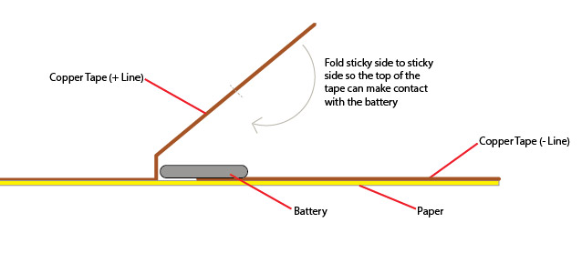

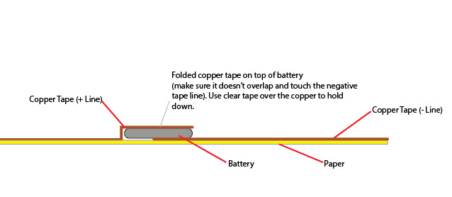

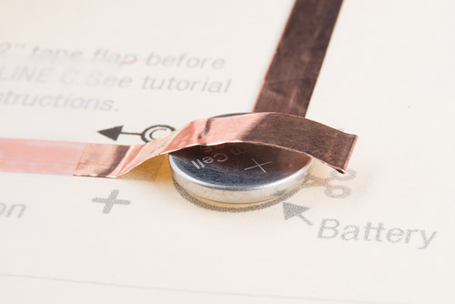

*SparkFunでは、ポップアップカードの[チュートリアル](https://learn.sparkfun.com/tutorials/tags/e-craft)すべてでこの銅テープの手法を使っている。*

**紙と銅テープ式ホルダー：**

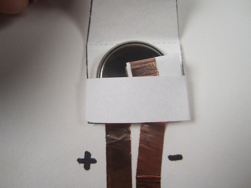

*画像：[Chibitronics](http://chibitronics.com/paper-battery-holder-tutorial/)*

Chibitronicsには、銅テープと紙で電池用のポケットを作る[チュートリアル](http://chibitronics.com/paper-battery-holder-tutorial/)がある。

**紙と導電性塗料式ホルダー：**

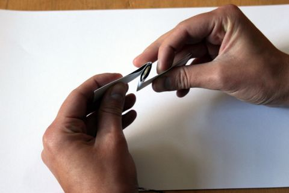

*画像：[Bare Conductive](http://www.bareconductive.com/make/paper-battery-holder-fold-holder/)*

Bare Conductiveには、紙の電池ホルダーについていくつかのチュートリアルがある（スイッチ付き、四角形、折りたたみ式、スリット式、三角形、露出型）。

### 電池ホルダーモジュール

電池ホルダーのモジュールは、銅テープにはんだ付けするか、導電性の接着剤や塗料で接着できる。
はんだ付けの前には、必ずホルダーから電池を取り外しておくこと。

### タブ付き電池

はんだ付け用のタブが付いた電池を購入することもできる。
これらははんだ付け、導電性接着剤での接着、場合によっては透明テープで押さえるだけでも回路に取り付けられる。
タブ付き電池を選ぶ際は、側面に絶縁材のあるものを探し、意図しないショートを避けるようにするとよい。

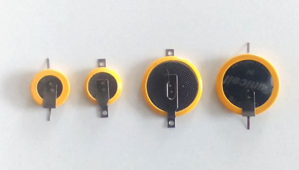

*タブ付き電池の例。*

> LED用のステッカー、基板、モジュールなど、ペーパー回路専用の部品の多くには、抵抗があらかじめ内蔵されている。既製のLEDを使って自分でペーパー回路用の部品を作る場合は、電圧要件の違いに応じて回路に抵抗を追加する必要があるかもしれない。

## まとめ・参考資料

このチュートリアルでは、実にさまざまな概念を扱った。
どこから始めればよいかわからない場合は、まず紙の切れ端で小さく試作し、自分のプロジェクトのアイデアにどの手法が向いているかを探ってみるとよい。
もう少し手順の決まったプロジェクトを探している場合は、次のチュートリアルも参考にしてほしい。

- Light-Up Father's Day Card — 電子式の飛び出すカードでお父さんの日を照らそう
- Let It Glow Holiday Cards — はんだ付け不要のペーパー回路で、ホリデーシーズンに光るカードを作る
- Light-Up Valentine Cards — はんだ付け不要のペーパー回路で、愛を光で伝える
- Bare Conductive Musical Painting — Bare Conductive Touch Boardと導電性塗料を使い、音の鳴る絵画を作る方法

ペーパー回路のデザインを探しているなら、次のような資料も参考になる。

- Paper Circuits Pin — 銅テープを配線代わりに使い、LEDを光らせる着用可能なe-craftアートの手早い制作プロジェクト
- Paper Circuits: Lotus Flower Pop Up Card — GESTEMで2014年5月9日に開催されたワークショップ「Have Fun with Paper Circuitry」で使われたテンプレート

紙だけにこだわる必要もない。段ボールでも回路を試してみてほしい。

- Enginursday: Cardboard Circuits — 手頃で消耗品として使える、単層のPCBのような設計

タグ: E-Craft、LED、光、LilyPad、ペーパー回路、スキル、はんだ付け、プロジェクトを始める

---

出典：[The Great Big Guide to Paper Circuits](https://learn.sparkfun.com/tutorials/the-great-big-guide-to-paper-circuits)（SparkFun Learn）を日本語に翻訳し、再構成した。
原文は [CC BY-SA 4.0](https://creativecommons.org/licenses/by-sa/4.0/) ライセンスで公開されており、本ページも同ライセンスの下で提供する。
