# トランジスタ

**トランジスタ**は、現代の電子回路の世界を動かしている部品である。
ほぼすべての現代的な回路において、制御の要となる重要な部品である。
目にする機会もあるが、たいていは[集積回路](https://learn.sparkfun.com/tutorials/integrated-circuits)のダイの奥深くに隠れている。
このチュートリアルでは、もっとも一般的なトランジスタであるバイポーラ接合トランジスタ（BJT）の基礎を紹介する。

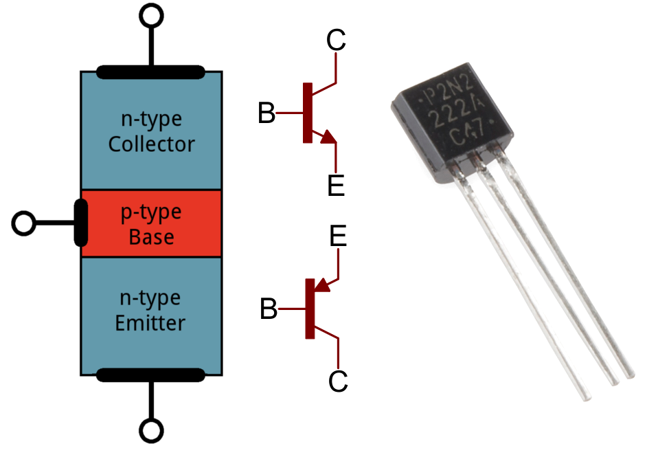

個別部品として少数使う場合、トランジスタは単純な電子スイッチや、[デジタル論理回路](https://learn.sparkfun.com/tutorials/digital-logic)、信号増幅回路を作るのに使われる。
数千、数百万、数十億という単位で使う場合には、トランジスタどうしが接続され、小さなチップに埋め込まれて、コンピュータのメモリやマイクロプロセッサ、その他の複雑なICを構成する。

このチュートリアルを読み終えるころには、トランジスタがどう動作するかについて幅広い理解が得られるはずである。
半導体物理や等価回路モデルにまで深入りはしないが、トランジスタが**スイッチとしても増幅器としても使える**ことを理解できる程度には掘り下げていく。

トランジスタには大きく分けて2種類ある。バイポーラ接合型（BJT）と金属酸化膜電界効果型（MOSFET）である。
このチュートリアルでは、理解しやすい**BJTに焦点を当てる**。
さらに、BJTにも**NPN**と**PNP**という2つのバージョンがある。
まずは的を絞り、**NPN**についてしっかり理解することに集中する。
NPNをきちんと理解できれば、そこからの違いを比較することで、PNP（さらにはMOSFET）の理解もぐっと楽になる。

参考になるチュートリアル:

- [電圧、電流、抵抗とオームの法則](./voltage-current-resistance-and-ohms-law.md) 電子工学の基礎を紹介している。
- [電気の基礎](./what-is-electricity.md) 電気を電子の流れとして説明している。
- [電力](./electric-power.md) トランジスタの主な用途の1つが増幅、つまり信号の電力を大きくすることであり、その仕組みを説明している。
- [ダイオード](./diodes.md) トランジスタもダイオードと同じ半導体部品であり、いわば2本のダイオードのアノードどうしを結びつけたようなものである。ダイオードの動作原理を理解しておくと、トランジスタの動作を理解するうえで大いに役立つ。

## 記号、ピン、内部構造

トランジスタは基本的に3端子の部品である。
バイポーラ接合トランジスタ（BJT）では、それぞれのピンを**コレクタ**（C）、**ベース**（B）、**エミッタ**（E）と呼ぶ。
NPN型とPNP型、それぞれの回路記号を以下に示す。

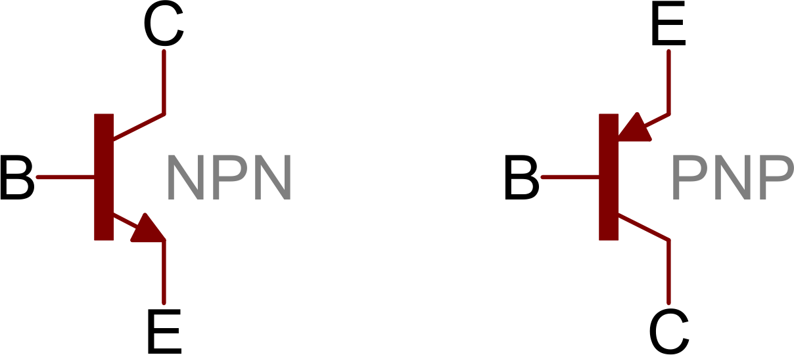

NPNとPNPの違いは、エミッタに付いている矢印の向きだけである。
NPNでは矢印が外を向き、PNPでは内を向く。
覚え方として、「NPN: Not Pointing iN（内を向いていない）」という語呂合わせがある。
少しひねくれた理屈だが、実際に役に立つ。

### トランジスタの内部構造

トランジスタは半導体を使ってその働きを実現している。
**半導体**とは、銅線のような純粋な導体でもなく、空気のような絶縁体でもない、その中間的な性質を持つ材料である。
半導体の導電性、つまり電子をどれだけ流しやすいかは、温度や電子の過不足といった要因によって変化する。
ここで、トランジスタの内部を少しだけのぞいてみよう。
量子物理学の深い話にまでは立ち入らないので安心してほしい。

#### 2つのダイオードとしてのトランジスタ

トランジスタは、いわば別の半導体部品である[ダイオード](./diodes.md)を拡張したようなものである。
ある意味で、トランジスタは2本のダイオードのカソード（あるいはアノード）どうしを結びつけたものだと考えられる。

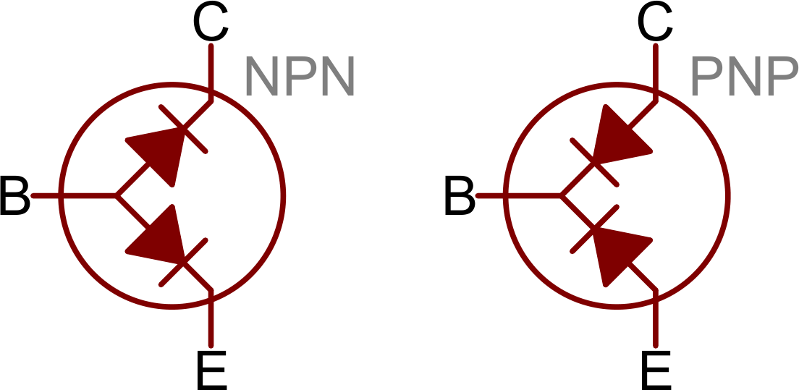

ここで重要なのは、ベースとエミッタをつなぐダイオードのほうである。
これは回路記号の矢印の向きと一致しており、トランジスタの中を**電流がどちらに流れるように意図されているか**を示している。

このダイオードによる表現は理解の出発点としては悪くないが、正確さにはほど遠い。
この模型だけをもとにトランジスタの動作を理解しようとしてはいけない（そしてもちろん、これをそのままブレッドボードで再現しようとしても動かない）。
3つの端子のあいだの相互作用を支配しているのは、もっと不思議な量子物理学レベルの現象である。

（ただし、この模型はトランジスタをテストしたいときには実際に役立つ。[テスター](./how-to-use-a-multimeter.md)のダイオード（または抵抗）測定モードを使って、BE間とBC間を測れば、この「ダイオード」が実際に存在するかどうかを確認できる。）

#### トランジスタの構造と動作

トランジスタは、3種類の異なる半導体材料の層を積み重ねて作られている。
これらの層の一部には電子が余分に加えられており（「ドーピング」と呼ばれる処理である）、別の層は電子が取り除かれている（「ホール」、つまり電子の欠如がドープされている）。
電子が*余分*にある半導体材料は**n型**（電子が負の電荷を持つことから*n*egativeのn）、電子が取り除かれた材料は**p型**（*p*ositiveのp）と呼ばれる。
トランジスタは、*n*の上に*p*、その上にまた*n*を重ねるか、あるいは*p*の上に*n*、その上にまた*p*を重ねることで作られる。

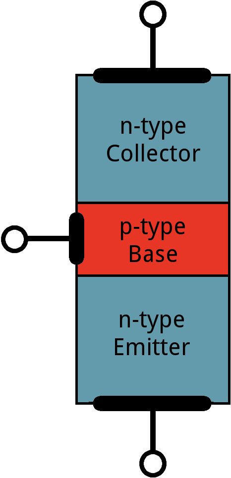

多少大まかに言えば、**電子はn領域からp領域へは、わずかな力（電圧）さえあれば簡単に流れる**が、p領域からn領域へ流れるのは非常に難しく（*大きな*電圧が必要になる）。
しかしトランジスタの特別なところ、つまり先ほどの2ダイオードモデルを時代遅れにしてしまう性質は、**ベース-エミッタ接合が順バイアスになっている限り（つまりベースがエミッタより高い電圧になっている限り）、p型のベースからn型のコレクタへも電子が簡単に流れられる**という点である。

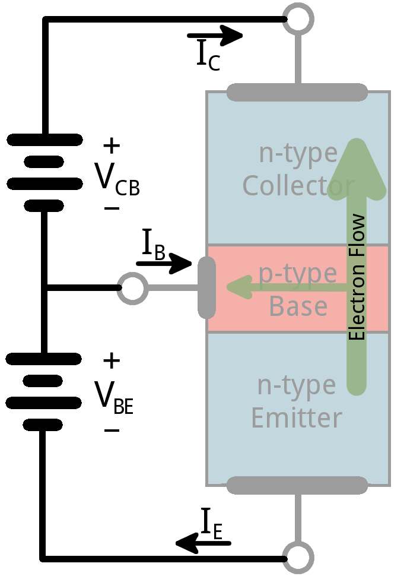

NPNトランジスタは、エミッタからコレクタへ電子を通すように設計されている（そのため慣用電流はコレクタからエミッタへ流れる）。
エミッタは電子をベースへ「放出（emit）」し、ベースはエミッタが放出する電子の量を制御する。
放出された電子のほとんどはコレクタに「集められ（collect）」、回路の次の部分へ送られる。

PNPも同じ考え方で、向きだけが逆に動作する。
ベースが電流を制御する点は同じだが、電流の向きが逆、つまりエミッタからコレクタへ流れる。
電子の代わりに、エミッタは「ホール」（電子が欠けている状態という概念上の存在）を放出し、それをコレクタが集める。

トランジスタは、いわば**電子のバルブ**（弁）のようなものである。
ベースのピンは、エミッタからコレクタへ流れる電子の量を調整するための取っ手のようなものだと考えられる。
このたとえをもう少し掘り下げてみよう。

## 水のたとえをさらに広げる

電気の概念に関するチュートリアルを読み進めてきたなら、[水](./voltage-current-resistance-and-ohms-law.md)のたとえにはすっかり慣れているだろう。
電流は水の流量に、電圧はその水をパイプに押し通す圧力に、抵抗はパイプの太さに相当する、というものである。

当然ながら、この水のたとえはトランジスタにも応用できる。
トランジスタは水の**バルブ**、つまり**流量を制御する**ための仕組みのようなものである。

バルブには3つの状態があり、それぞれがシステムの流量に異なる影響を与える。

### 1）オン（短絡回路）

バルブを完全に開くと、水は**自由に流れ**、まるでバルブがそこに存在しないかのように通り抜ける。


同じように、適切な条件のもとでは、トランジスタはコレクタとエミッタのあいだが**短絡回路**であるかのようにふるまう。
電流はコレクタから自由に流れ込み、エミッタから出ていく。

### 2）オフ（開放回路）

バルブを閉じると、水の流れを完全に**止める**ことができる。


同じように、トランジスタはコレクタとエミッタのあいだに**開放回路**を作り出せる。

### 3）線形の流量制御

バルブを精密に調整すれば、全開と全閉のあいだの任意の地点まで**流量を細かく制御**できる。

トランジスタも同じことができる。
回路を流れる電流を、完全にオフ（開放回路）と完全にオン（短絡回路）のあいだの任意の地点で**線形に制御する**のである。

水のたとえで言えば、パイプの太さは回路の[抵抗](./voltage-current-resistance-and-ohms-law.md)に相当する。
バルブがパイプの実効的な太さを細かく調整できるなら、トランジスタはコレクタとエミッタのあいだの抵抗を細かく調整できる。
つまりある意味で、トランジスタは**可変抵抗器**のようなものである。

### 電力を増幅する

もう1つ、少し無理やりだが役に立つたとえがある。
バルブをほんの少しひねるだけで、[フーバーダムの放水ゲート](https://ja.wikipedia.org/wiki/File:HooverDamFrontWater.jpg)の流量を制御できると想像してほしい。
そのつまみをひねるのに使うわずかな力が、その何千倍もの力を生み出す可能性を秘めている。
たとえとしてはやや無理があるが、この考え方はトランジスタにも当てはまる。
トランジスタが特別なのは、電気信号を**増幅**でき、低電力の信号をそれと相似形の、はるかに高い電力の信号に変えられるからである。

## 動作モード

[抵抗器](./resistors.md)が電圧と電流のあいだに線形な関係を強制するのとは違い、トランジスタは非線形な部品である。
トランジスタには、そこを流れる電流のようすを表す4つの異なる動作モードがある（トランジスタを流れる電流という場合、たいていは**NPNのコレクタからエミッタへ流れる電流**を指す）。

トランジスタの4つの動作モードは次のとおりである。

- **飽和（サチュレーション）**：トランジスタは**短絡回路**のようにふるまう。コレクタからエミッタへ電流が自由に流れる。
- **遮断（カットオフ）**：トランジスタは**開放回路**のようにふるまう。コレクタからエミッタへ電流は流れない。
- **活性（アクティブ）**：コレクタからエミッタへの電流が、ベース電流に**比例**する。
- **逆活性（リバースアクティブ）**：活性モードと同じく電流はベース電流に比例するが、向きが逆になる。電流はエミッタからコレクタへ流れる（トランジスタ本来の使い方ではない）。

トランジスタがどのモードにあるかを判断するには、3つのピンそれぞれの電圧と、それらの関係を見る必要がある。
ベース-エミッタ間の電圧（VBE）とベース-コレクタ間の電圧（VBC）によって、トランジスタのモードが決まる。

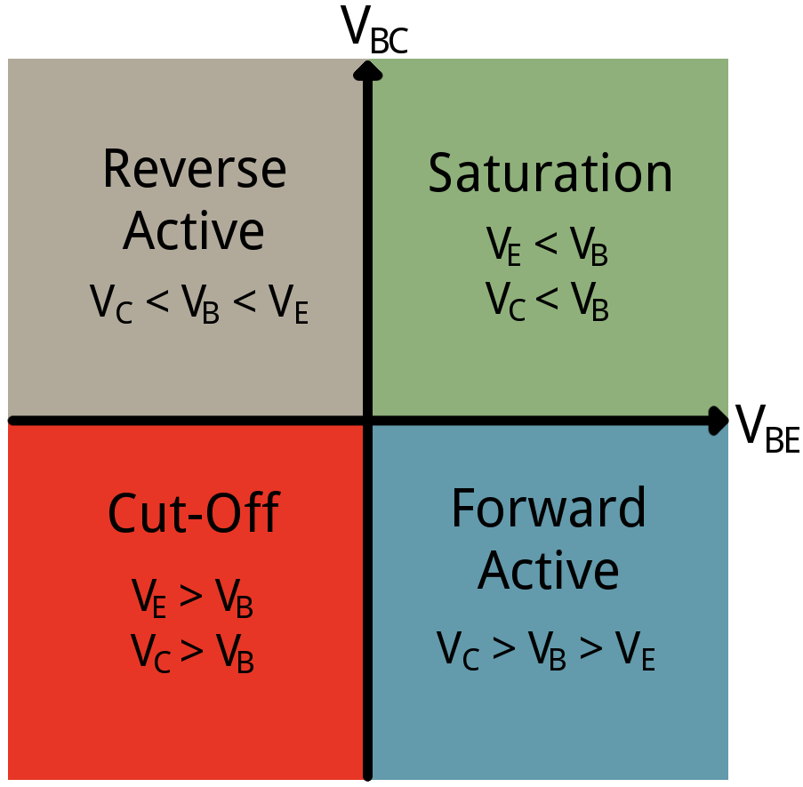

上の単純化した図は、各端子の電圧の正負がモードにどう影響するかを示している。
実際にはもう少し複雑である。

それぞれのモードを個別に見ていき、そのモードにするにはどうすればよいか、電流の流れにどんな影響があるかを確認していこう。

> [!NOTE]
> このページの大部分は**NPNトランジスタ**を前提にしている。PNPトランジスタの動作を理解するには、単純に極性、つまり「>」と「<」の向きを反転させればよい。

#### 飽和モード

**飽和**は、トランジスタの**オンモード**である。
飽和モードのトランジスタは、コレクタとエミッタのあいだが短絡回路であるかのようにふるまう。

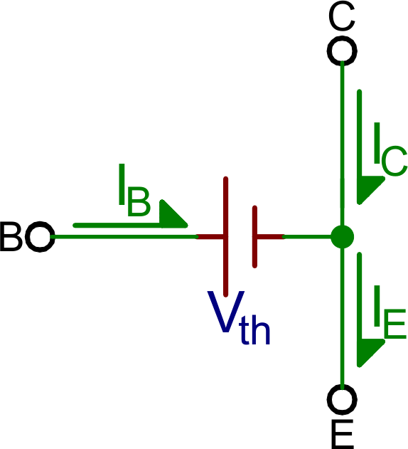

飽和モードでは、トランジスタ内部の2つの「ダイオード」がどちらも順バイアスになっている。
つまりVBEは0より大きく、*かつ*VBCも0より大きい必要がある。
言い換えると、VBはVEとVCの両方より高くなければならない。

実際には、ベース-エミッタ間の接合は[ダイオード](./diodes.md)そのものなので、飽和状態に入るにはVBEが**しきい値電圧**を超えている必要がある。
この電圧降下にはVth、Vγ、Vdなどいくつもの略称があり、実際の値はトランジスタによって（さらには温度によっても）異なる。
多くのトランジスタでは（室温で）この降下をおよそ0.6Vと見積もれる。

もう1つ、現実にはこうもいかないという話がある。
エミッタとコレクタのあいだの導通は完璧ではなく、両端のあいだにはわずかな電圧降下が生じる。
トランジスタのデータシートでは、この電圧を**CE飽和電圧VCE(sat)**として定義しており、飽和状態に必要なコレクタ-エミッタ間の電圧である。
この値はたいてい0.05〜0.2V程度である。
つまり、トランジスタを飽和させるには、VCがVEよりわずかに高くなっている必要がある（ただしどちらもVBよりは低い）。

#### 遮断モード

**遮断モード**は飽和の対極にある。
遮断モードのトランジスタは**オフ**の状態であり、コレクタ電流はなく、したがってエミッタ電流もない。
ほとんど開放回路のように見える。

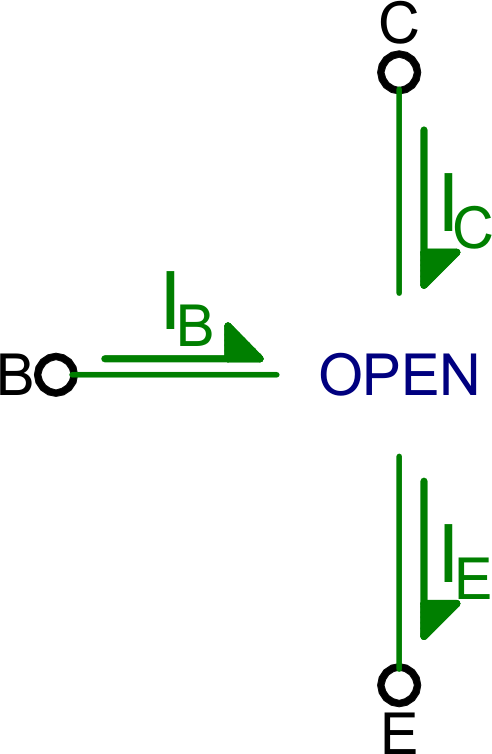

トランジスタを遮断モードにするには、ベース電圧がエミッタ電圧とコレクタ電圧の両方より低くなければならない。
VBCとVBEはどちらも負である必要がある。

実際には、VBEが0VからVth（およそ0.6V）のあいだであれば、遮断モードが成立する。

#### 活性モード

活性モードで動作させるには、トランジスタのVBEが0より大きく、VBCが負でなければならない。
つまりベース電圧はコレクタより低く、エミッタより高くなければならない。
これは同時に、コレクタがエミッタより高くなければならないことも意味する。

実際には、トランジスタを「オン」にするには、ベース-エミッタ間（VBE）に0より大きい**順方向電圧降下**（Vth、Vγ、Vdのいずれかで略される）が必要である。
たいていこの電圧はおよそ0.6Vである。

##### 活性モードでの増幅

活性モードは、トランジスタをもっとも強力な状態、つまり**増幅器**にするモードである。
ベースピンに入る電流が、コレクタからエミッタへ流れる電流を増幅する。

トランジスタの**利得**（増幅率）を表す略記が*β*である（*βF*や*hFE*と書かれることもある）。
βは、コレクタ電流（*IC*）とベース電流（*IB*）を線形の関係で結びつける。

```
IC = β × IB
```

*β*の実際の値はトランジスタによって異なる。
たいてい**100前後**だが、50から200、場合によっては2000程度まで、使用するトランジスタや流れる電流量によって幅がある。
たとえばβが100のトランジスタなら、ベースに1mAの電流を入力すると、コレクタには100mAの電流が流れることになる。

エミッタ電流IEについてはどうか。
活性モードでは、コレクタ電流とベース電流が素子に*流れ込み*、IEが流れ出る。
エミッタ電流をコレクタ電流と関連づけるもう1つの定数が**α**であり、共通ベース電流利得と呼ばれる。

```
IC = α × IE
```

αはたいてい1に*非常に*近いが、1より小さい値になる。
つまり活性モードでは、**ICはIEに非常に近いが、IEよりわずかに小さい**。

βからα、あるいはその逆を計算することもできる。

```
α = β / (β + 1)
```

たとえばβが100なら、αは0.99になる。
つまりICが100mAなら、IEは101mAになる。

#### 逆活性モード

飽和が遮断の対極にあるように、逆活性モードは活性モードの対極にある。
逆活性モードのトランジスタは導通し、増幅すら行うが、電流はエミッタからコレクタへ、逆向きに流れる。
逆活性モードの欠点は、β（この場合はβRと表記する）が*はるかに*小さいことである。

トランジスタを逆活性モードにするには、エミッタ電圧がベースより高く、ベースがコレクタより高くなければならない（VBE<0かつVBC>0）。

逆活性モードは、通常トランジスタを動作させたい状態ではない。
存在は知っておくとよいが、実際の設計に組み込まれることはまずない。

### PNPとの対応

ここまでの内容は、BJTの半分にすぎない。
PNPトランジスタはどうだろうか。
PNPはNPNとよく似た動作をし、同じ4つのモードを持つが、すべてが逆になっている。
PNPトランジスタがどのモードにあるかを知るには、すべての「<」と「>」を反転させればよい。

たとえばPNPを飽和させるには、VCとVEがVBより高くなければならない。
PNPをオンにするにはベースを低く引き、オフにするにはコレクタやエミッタより高くする。
そしてPNPを活性モードにするには、VEがVBより高く、VBがVCより高くなければならない。

まとめると、次のようになる。

| 電圧の関係 | NPNのモード | PNPのモード |
| --- | --- | --- |
| VE < VB < VC | 活性 | 逆活性 |
| VE < VB > VC | 飽和 | 遮断 |
| VE > VB < VC | 遮断 | 飽和 |
| VE > VB > VC | 逆活性 | 活性 |

NPNとPNPのもう1つの対照的な特徴が、電流の向きである。
活性モードと飽和モードでは、**PNPの電流はエミッタからコレクタへ流れる**。
つまり、エミッタはコレクタより高い電圧になっている必要がある。

## 応用例1：スイッチ

トランジスタのもっとも基本的な応用の1つが、回路の別の部分への電力供給を制御する、つまり電子スイッチとして使うことである。
遮断モードか飽和モードのどちらかで駆動することで、トランジスタはオンとオフの二値的な効果を持つスイッチとして働く。

トランジスタによるスイッチは、[論理ゲート](https://learn.sparkfun.com/tutorials/digital-logic)を作るための重要な構成要素であり、その論理ゲートがマイコンやマイクロプロセッサ、その他の[集積回路](https://learn.sparkfun.com/tutorials/integrated-circuits)を構成する。
以下にいくつかの応用回路を紹介する。

### トランジスタスイッチ

もっとも基本的なトランジスタスイッチ回路、NPNスイッチを見てみよう。
ここではNPNを使って高出力のLEDを制御する。

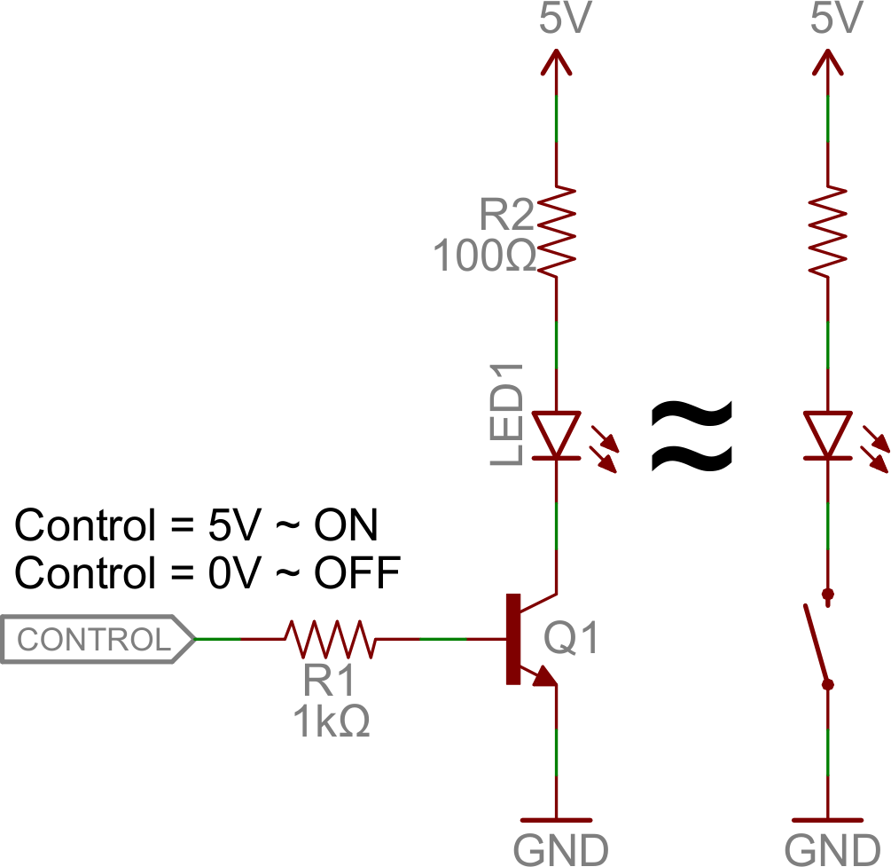

制御用の入力はベースに入り、出力はコレクタにつながり、エミッタは固定の電圧に保たれる。

[通常のスイッチ](./button-and-switch-basics.md)がアクチュエーターを物理的に切り替える必要があるのに対し、このスイッチはベースピンの電圧によって制御される。
[Arduino](https://learn.sparkfun.com/tutorials/what-is-an-arduino)のようなマイコンのI/Oピンをハイかローにプログラムすれば、LEDのオンとオフを切り替えられる。

ベースの電圧が0.6V（あるいはそのトランジスタのVth）を超えると、トランジスタは飽和し始め、コレクタとエミッタのあいだが短絡回路のようになる。
ベースの電圧が0.6Vより低いと、トランジスタは遮断モードになり、CE間が開放回路のようになるため電流は流れない。

上の回路は、スイッチであるトランジスタが回路のロー（グラウンド）側にあることから**ローサイドスイッチ**と呼ばれる。
一方、PNPトランジスタを使えばハイサイドスイッチを作れる。

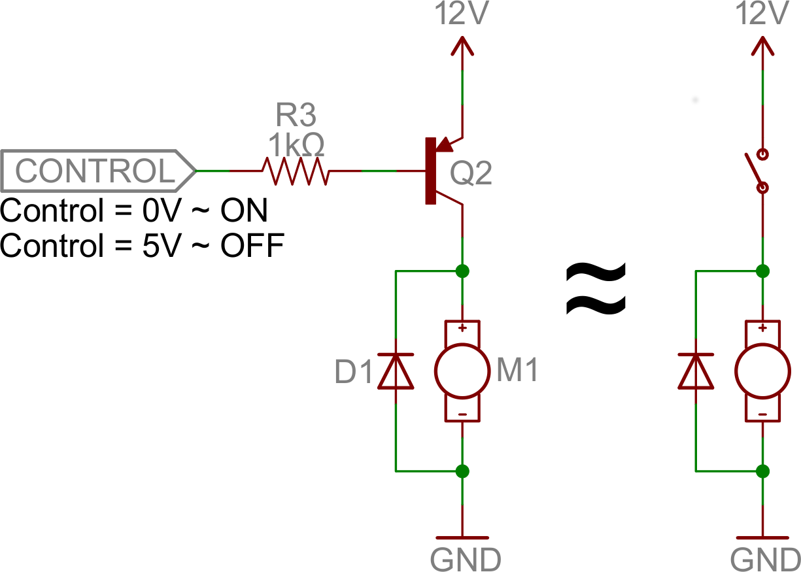

NPNの回路と似ているが、ベースが入力、エミッタが一定電圧につながっている点は同じである。
ただし今度はエミッタがハイ側につながり、負荷はグラウンド側でトランジスタに接続される。

この回路もNPN式のスイッチと同じようにうまく機能するが、1つ大きな違いがある。
負荷を「オン」にするにはベースをローにする必要があるという点である。
これは、特に負荷側の高電圧（この図でエミッタVEにつながるVCCが12Vの場合など）が制御入力側のハイレベルより高いときに問題を引き起こしかねない。
たとえば、5Vで動作するArduinoで12Vのモーターをオフに切り替えようとすると、この回路はうまく機能しない。
その場合、VB（制御ピンにつながる）は常にVEより低くなるため、**スイッチをオフにすることが不可能**になってしまう。

#### ベース抵抗を忘れずに

上のどちらの回路にも、制御入力とトランジスタのベースのあいだに直列の抵抗が入っていることに気づいただろう。
この抵抗を追加し忘れてはいけない。
ベースに抵抗のないトランジスタは、[電流制限抵抗](./resistors.md)のないLEDのようなものである。

トランジスタは、ある意味で単に2本のダイオードをつないだものであることを思い出してほしい。
負荷をオンにするには、ベース-エミッタ間のダイオードを順バイアスにする。
このダイオードをオンにするには0.6Vあれば十分であり、それ以上の電圧をかければかけるほど、より多くの電流が流れる。
トランジスタによっては、流せる電流の上限がわずか10〜100mA程度に定められていることもある。
定格を超える電流を流すと、トランジスタが壊れてしまうことがある。

制御用の電源とベースのあいだに入れる直列抵抗は、**ベースへの電流を制限する**役割を果たす。
ベース-エミッタ間の接合は心地よい0.6Vの電圧降下を得られ、残りの電圧は抵抗が引き受ける。
抵抗の値と、そこにかかる電圧によって、流れる電流が決まる。

抵抗は、電流を効果的に*制限*できるだけの大きさが必要だが、ベースに*十分な*電流を供給できる程度に小さくもなければならない。
たいてい1mAから10mA程度あれば十分だが、念のためトランジスタのデータシートを確認してほしい。

### デジタル論理回路

トランジスタを組み合わせれば、AND、OR、NOTといった基本的な[論理ゲート](https://learn.sparkfun.com/tutorials/digital-logic)をすべて作れる。

（注：近年では、BJTよりもMOSFETを使って論理ゲートを作ることのほうが多い。MOSFETのほうが電力効率に優れているため、より良い選択肢とされている。）

#### インバータ

**インバータ**（NOTゲート）を実装したトランジスタ回路を見てみよう。

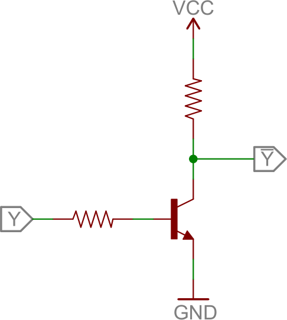

ベースに高い電圧が入るとトランジスタがオンになり、コレクタとエミッタが実質的につながる。
エミッタは直接グラウンドにつながっているため、コレクタもほぼグラウンド電位になる（実際にはVCE(sat)分、およそ0.05〜0.2V程度高くなる）。
逆に入力がローのとき、トランジスタは開放回路のように見え、出力はVCCまで引き上げられる。

（これは実は**共通エミッタ**と呼ばれる基本的な構成であり、この後もう少し詳しく取り上げる。）

#### ANDゲート

**2入力ANDゲート**を作るのに使われる2本のトランジスタの例を見てみよう。

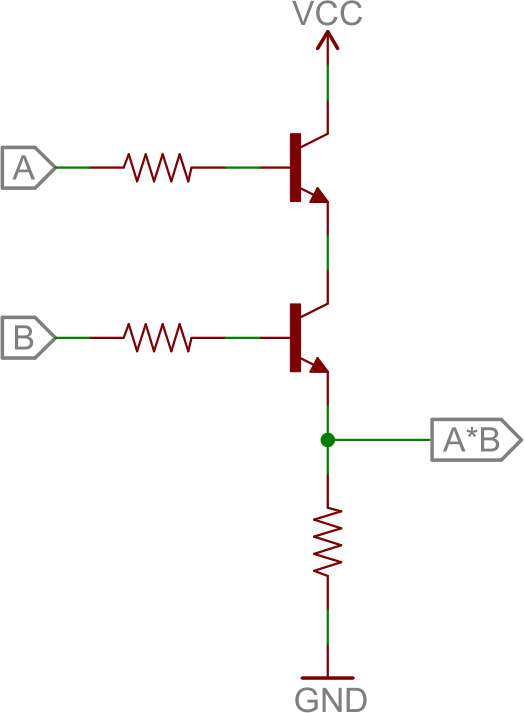

どちらか一方のトランジスタがオフなら、2つ目のトランジスタのコレクタにある出力はローに引かれる。
両方のトランジスタが「オン」（両方のベースがハイ）なら、回路の出力もハイになる。

#### ORゲート

最後に、**2入力ORゲート**を見てみよう。

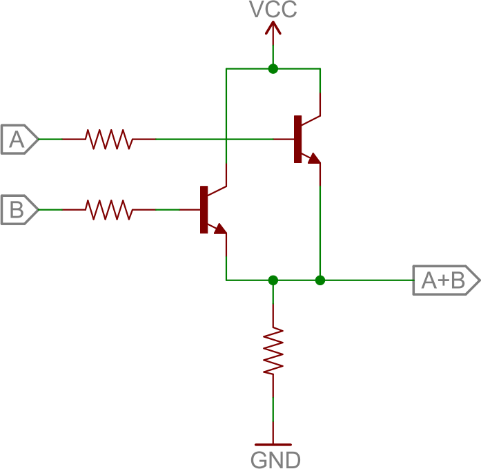

この回路では、AかBのどちらか（あるいは両方）がハイであれば、対応するトランジスタがオンになり、出力をハイに引き上げる。
両方のトランジスタがオフなら、出力は抵抗を通してローに引かれる。

### Hブリッジ

**Hブリッジ**は、モーターを時計回りにも反時計回りにも**駆動できる**トランジスタベースの回路である。
非常によく使われる回路であり、前進も後退もできる無数のロボットの原動力になっている。

基本的にHブリッジは、2本の入力線と2本の出力を持つ4本のトランジスタの組み合わせである。

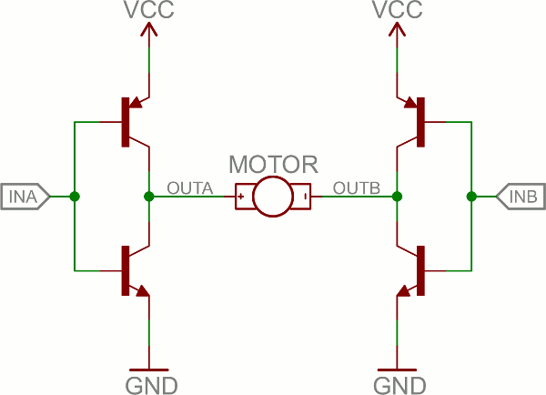

（注：実際によく設計されたHブリッジには、フライバックダイオードやベース抵抗、シュミットトリガーなど、もう少し多くの要素が加わっていることが多い。）

両方の入力が同じ電圧であれば、モーターへの出力も同じ電圧になり、モーターは回転できない。
しかし2つの入力が逆であれば、モーターはどちらかの向きに回転する。

Hブリッジの真理値表はおおよそ次のようになる。

| 入力A | 入力B | 出力A | 出力B | モーターの動き |
| --- | --- | --- | --- | --- |
| 0 | 0 | 1 | 1 | 停止（ブレーキ） |
| 0 | 1 | 1 | 0 | 時計回り |
| 1 | 0 | 0 | 1 | 反時計回り |
| 1 | 1 | 0 | 0 | 停止（ブレーキ） |

### 発振回路

**発振回路**は、ハイとローのあいだを周期的に行き来する信号を作り出す回路である。
発振回路は、単純にLEDを点滅させるものから、マイコンを動かすクロック信号を作るものまで、あらゆる回路で使われている。
発振回路を作る方法には、水晶振動子、オペアンプ、そしてもちろんトランジスタなど、さまざまなものがある。

ここでは、**非安定マルチバイブレータ**と呼ばれる発振回路の例を見てみよう。
**フィードバック**を使うことで、2本のトランジスタから互いに補い合う2つの発振信号を作り出せる。

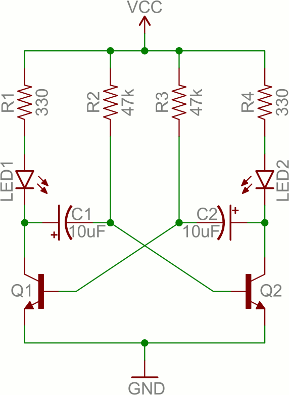

2本のトランジスタに加えて、この回路の本当の鍵となるのは[コンデンサ](./capacitors.md)である。
コンデンサが交互に充電と放電を繰り返すことで、2本のトランジスタが交互にオンとオフする。

この回路の動作を分析することは、コンデンサとトランジスタの両方の動作を学ぶうえで格好の題材になる。
まず、C1が完全に充電され（およそVCC分の電圧を蓄えている）、C2は放電済み、Q1はオン、Q2はオフの状態から始めるとしよう。
その後は次のように進む。

- Q1がオンだと、C1の（回路図上での）左側の板はおよそ0Vにつながる。これによりC1はQ1のコレクタを通して放電する。
- C1が放電しているあいだ、C2はより値の小さい抵抗R4を通してすばやく充電される。
- C1が完全に放電すると、その右側の板の電圧はおよそ0.6Vまで引き上げられ、Q2がオンになる。
- ここで状態が入れ替わる。C1は放電済み、C2は充電済み、Q1はオフ、Q2はオンになる。ここから同じ動きが逆側で繰り返される。
- Q2がオンになると、C2はQ2のコレクタを通して放電できるようになる。
- Q1がオフのあいだ、C1はR1を通して比較的すばやく充電される。
- C2が完全に放電すると、Q1が再びオンになり、最初の状態に戻る。

頭の中だけで追うのは難しいかもしれない。
C1、C2、R2、R3の値を選び（R1とR4は比較的小さく保つことで）、このマルチバイブレータ回路の速さを設定できる。

```
周期 T ≈ 0.693 × (R2×C1 + R3×C2)
```

コンデンサと抵抗の値をそれぞれ10µFと47kΩに設定すると、発振周波数はおよそ1.5Hzになる。
つまり、それぞれのLEDはおよそ1秒間に1.5回点滅することになる。

ここまで見てきたように、トランジスタを使った回路は*無数に*存在する。
しかしまだほんの入り口に触れたにすぎない。
ここで紹介した例は、主にトランジスタを飽和モードと遮断モードでスイッチとして使う方法を示したものだが、増幅についてはどうだろうか。
次は増幅の例を見ていこう。

## 応用例2：増幅器

トランジスタのもっとも強力な応用のいくつかは、増幅、つまり低電力の信号をより高い電力の信号に変える用途に関わっている。
増幅器は信号の電圧を増幅し、µVの範囲のものをより扱いやすいmVやVのレベルに変換できる。
あるいは電流を増幅し、[フォトダイオード](https://www.sparkfun.com/products/9541)が生み出すµA単位の電流を、はるかに大きな電流に変換するのにも使える。
電流を入力して、より高い電圧を出力する（あるいはその逆の）増幅器もあり、それぞれトランスレジスタンス増幅器、トランスコンダクタンス増幅器と呼ばれる。

トランジスタは、多くの増幅回路にとって鍵となる部品である。
トランジスタ増幅器には見渡す限りさまざまな種類があるが、幸いその多くは、いくつかの基本的な回路をもとにしている。
これから紹介する回路を覚えておけば、パターンマッチングによって、より複雑な増幅器も理解しやすくなるはずである。

### 基本構成

もっとも基本的な3つのトランジスタ増幅器は、共通エミッタ、共通コレクタ、共通ベースである。
この3つの構成では、いずれも3つの端子のうち1つが常に共通の電圧（たいていグラウンド）に固定され、残りの2つが増幅器の入力または出力になる。

#### 共通エミッタ

**共通エミッタ**は、もっともよく使われるトランジスタの構成の1つである。
この回路では、エミッタがベースとコレクタの両方に共通する電圧（たいていグラウンド）に固定される。
ベースが信号の入力、コレクタが出力になる。

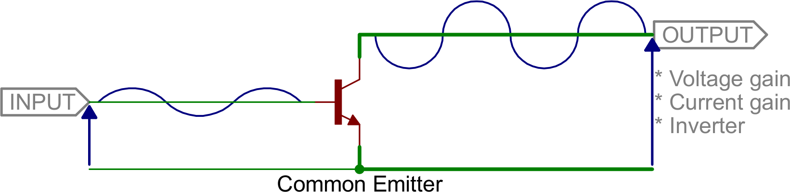

共通エミッタ回路がよく使われるのは、特に低周波での**電圧増幅**に適しているからである。
たとえば音声信号の増幅などに向いている。
1.5V程度の小さなピークトゥピーク入力信号があれば、もう少し複雑な回路を使ってはるかに高い電圧に増幅できる。

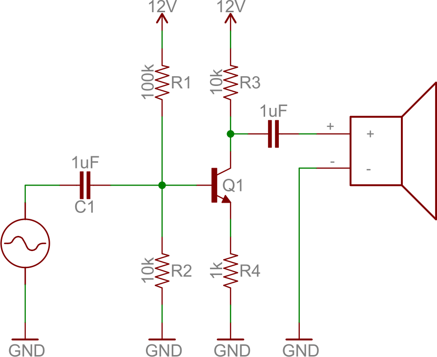

共通エミッタには1つ癖があり、それは入力信号を**反転**させてしまうことである（前の節のインバータと比べてみてほしい）。

#### 共通コレクタ（エミッタフォロワ）

コレクタピンを共通電圧に固定し、ベースを入力、エミッタを出力として使うと、共通コレクタになる。
この構成は**エミッタフォロワ**とも呼ばれる。

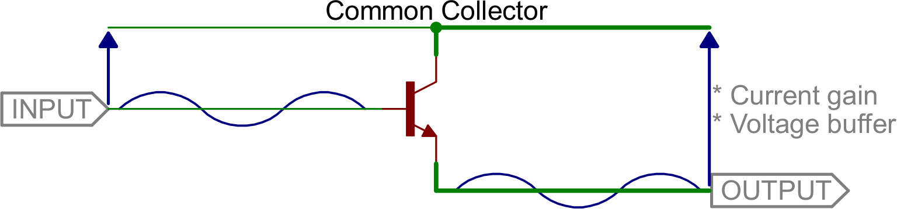

共通コレクタは電圧の増幅をまったく行わない（実際には、出力電圧は入力電圧よりも0.6V低くなる）。
そのため、この回路は**電圧フォロワ**と呼ばれることもある。

一方でこの回路は**電流増幅器**として大きな可能性を秘めている。
それに加えて、高い電流利得とほぼ1倍の電圧利得を組み合わせることで、優れた**電圧バッファ**にもなる。
電圧バッファは、負荷回路がそれを駆動している回路に望ましくない影響を与えないようにする役割を果たす。

たとえば、負荷に1Vを供給したいとき、簡単な方法として[分圧回路](./voltage-dividers.md)を使うこともできるし、エミッタフォロワを使うこともできる。

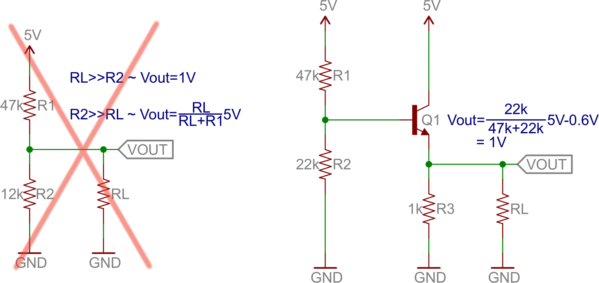

負荷が大きくなる（つまり抵抗が小さくなる）ほど、分圧回路の出力電圧は下がってしまう。
しかしエミッタフォロワの出力電圧は、負荷が何であってもほぼ一定に保たれる。
出力インピーダンスの大きい回路と違って、大きな負荷がエミッタフォロワを「重くする」ことはない。

#### 共通ベース

この節を締めくくるために共通ベースにも触れておくが、3つの基本構成の中ではもっとも使用頻度が低い。
共通ベース増幅器では、エミッタが入力、コレクタが出力になる。
ベースは両方に共通する。

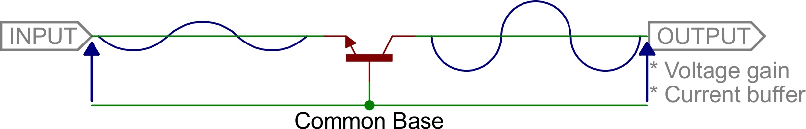

共通ベースは、いわばエミッタフォロワの逆のような存在である。
そこそこの電圧増幅器であり、入力電流と出力電流はほぼ等しい（厳密には入力電流のほうがわずかに大きい）。

共通ベース回路は**電流バッファ**として特に優れている。
低い入力インピーダンスで入力電流を受け取り、ほぼ同じ電流を、より高いインピーダンスの出力へ届けられる。

#### まとめ

この3つの増幅器構成は、より複雑な多くのトランジスタ増幅器の核となっている。
それぞれ、電流の増幅、電圧の増幅、バッファリングのどれかで真価を発揮する得意分野がある。

| | 共通エミッタ | 共通コレクタ | 共通ベース |
| --- | --- | --- | --- |
| 電圧利得 | 中 | 低 | 高 |
| 電流利得 | 中 | 高 | 低 |
| 入力インピーダンス | 中 | 高 | 低 |
| 出力インピーダンス | 中 | 低 | 高 |

### 多段増幅器

トランジスタ増幅器の多様さについては、まだまだ語り尽くせない。
ここでは、上で紹介した単段の増幅器を組み合わせるとどうなるかを示す例をいくつか紹介する。

#### ダーリントン接続

**ダーリントン接続**は、共通コレクタを2段重ねて、**高い電流利得**を持つ増幅器を作る構成である。

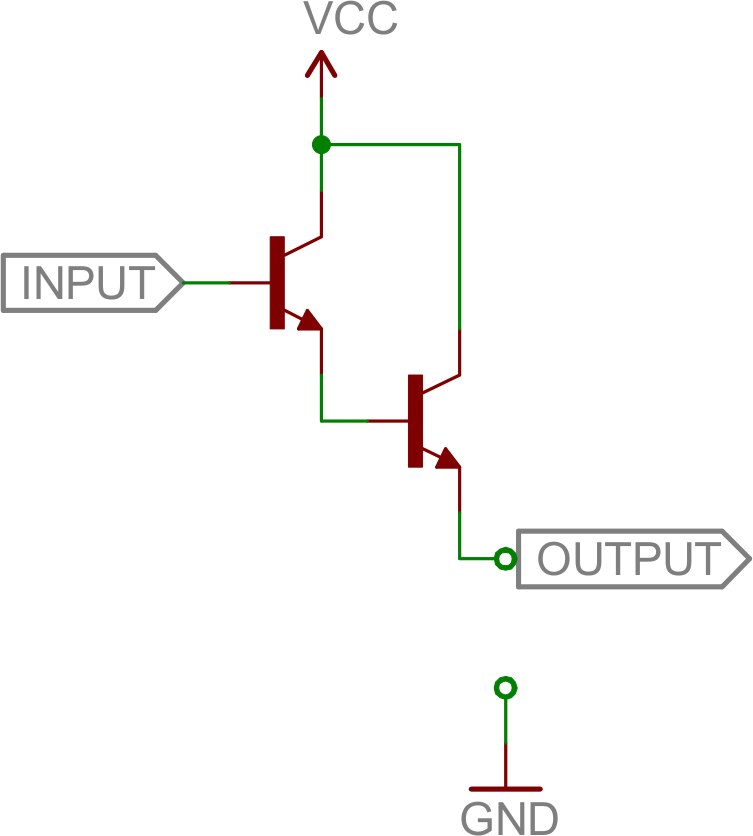

出力電圧は入力電圧と*ほぼ*同じ（1.2〜1.4V程度低くなる）が、電流利得は2つのトランジスタの利得の積になる。
つまりβ²であり、1万倍を超えることもある。

小さな入力電流で大きな負荷を駆動したいときには、ダーリントンペアは優れた道具になる。

#### 差動増幅器

**差動増幅器**は、2つの入力信号の差を取り、その差を増幅する回路である。
入力と出力を比較して次の出力を作り出すフィードバック回路にとって、重要な構成要素である。

差動増幅器の基本形は次のようになる。

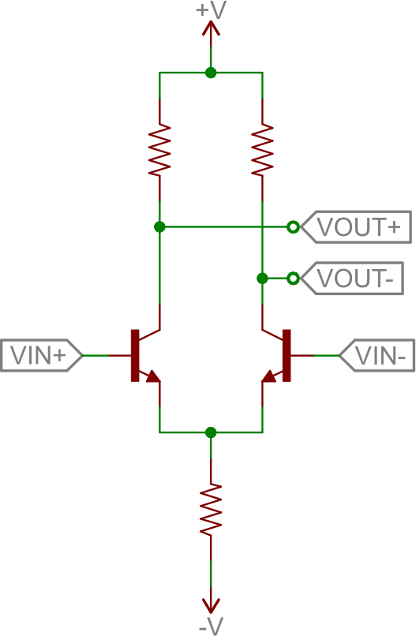

この回路は**ロングテールペア**とも呼ばれる。
これは2つの共通エミッタ回路を組み合わせ、互いに比較することで差動出力を作り出すものである。
2つの入力はそれぞれのトランジスタのベースに加えられ、出力は2つのコレクタ間の差動電圧として得られる。

#### プッシュプル増幅器

**プッシュプル増幅器**は、多くの多段増幅器の「最終段」として便利な回路である。
エネルギー効率の良い電力増幅器であり、スピーカーの駆動によく使われる。

基本的なプッシュプル増幅器は、どちらも共通コレクタとして構成されたNPNとPNPのトランジスタを使う。

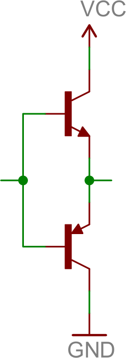

プッシュプル増幅器は電圧をほとんど増幅しない（出力電圧は入力よりわずかに低くなる）が、電流は増幅する。
正負両方の電源を持つ回路（バイポーラ電源回路）では特に有用であり、正電源から負荷へ電流を「プッシュ」し、負電源へ電流を「プル」して逃がすことができる。

バイポーラ電源を使っている（あるいは使っていない）場合でも、プッシュプルは増幅器の最終段として優れており、負荷に対するバッファとして機能する。

### すべてを組み合わせる（オペアンプの例）

多段トランジスタ回路の代表例として、[オペアンプ](https://www.sparkfun.com/products/9456)を見てみよう。
よく使われるトランジスタ回路を見分け、その役割を理解できれば、それだけで大きな武器になる。
ここでは、非常にシンプルなオペアンプである[LM358](https://www.sparkfun.com/datasheets/Components/General/LM358.pdf)の内部回路を見てみよう。

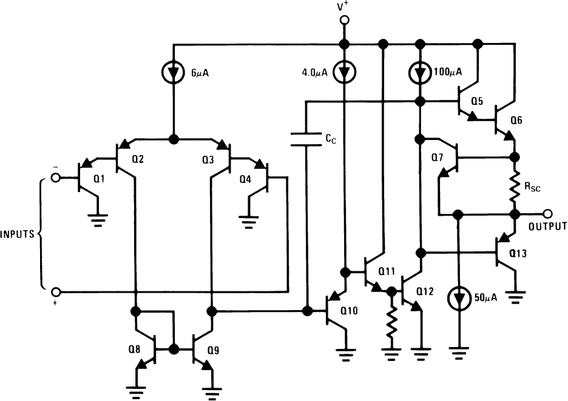

すぐに消化しきれないほどの複雑さがあるが、見覚えのある構成もいくつか見つかるはずである。

- Q1、Q2、Q3、Q4が入力段を構成している。**共通コレクタ**（Q1とQ4）が**差動増幅器**につながっているように見えないだろうか。PNPを使っているため上下が逆に見えるだけである。これらのトランジスタが増幅器の入力差動段を構成している。
- Q11とQ12は2段目を構成する。Q11は共通コレクタ、Q12は**共通エミッタ**である。この2本のトランジスタは、Q3のコレクタからの信号をバッファリングしつつ、最終段へ向かう信号に高い利得を与える。
- Q6とQ13は最終段を構成しており、こちらも見覚えがあるはずである（RSCを無視すれば）、**プッシュプル**である。この段が出力をバッファリングし、より大きな負荷を駆動できるようにしている。
- ここまで触れていない構成もいくつかある。Q8とQ9は**カレントミラー**として構成されており、一方のトランジスタを流れる電流量をもう一方にそのままコピーする。

このトランジスタの集中講義を終えた今、この回路のすべてを理解できるとは思っていないが、よく使われるトランジスタ回路を見分けられるようになっていれば、正しい道を歩んでいると言える。

## まとめ

トランジスタについてさらに深く学びたいなら、次のような資料もおすすめである。

- [*Getting Started in Electronics* by Forrest Mims](https://www.sparkfun.com/products/10764)：Mimsは電子工学をわかりやすく、実践的に説明する名手である。トランジスタについてもう一歩踏み込んだ入門書として一読の価値がある。
- [LTSpice](http://www.linear.com/designtools/software/)や[Falstad Circuit](http://www.falstad.com/circuit/)：無料で使える回路シミュレーションツールである。デジタル上で回路を実験することは、優れた学習方法であり、ブレッドボードの手間や部品を壊す心配なしにいろいろ試せる。ここで扱った回路もぜひ組んでみてほしい。
- [2N3904のデータシート](http://www.sparkfun.com/datasheets/Components/2N3904.pdf)：トランジスタについて学ぶもう1つの方法は、データシートを読み込むことである。2N3904は非常によく使われるトランジスタであり（PNP版の兄弟にあたるのが[2N3906](http://www.sparkfun.com/datasheets/Components/2N3906.pdf)である）、データシートを見て、見覚えのある特性を探してみてほしい。

電子工作についてさらに学びたいなら、次のようなチュートリアルもおすすめである。

- [集積回路](./integrated-circuits.md)：数千個のトランジスタを組み合わせて黒い箱に詰め込むと何ができるか。それがICである。
- [シフトレジスタ](https://learn.sparkfun.com/tutorials/shift-registers)：もっとも一般的な集積回路の1つである。わずかな入力だけで何十個ものLEDを点滅させる方法を学べる。
- [Eagleを使ったPCB設計](./how-to-install-and-setup-eagle.md)：新しく身につけたトランジスタの知識を、実際のPCB設計に活かしてみよう。
- [はんだ付けの基本](./how-to-solder-through-hole-soldering.md)：PCBを設計したら、はんだ付けの方法も知っておく必要がある。

タグ: 部品、電気工学、技術

---

出典：[Transistors](https://learn.sparkfun.com/tutorials/transistors)（SparkFun Learn）を日本語に翻訳し、再構成した。
原文は [CC BY-SA 4.0](https://creativecommons.org/licenses/by-sa/4.0/) ライセンスで公開されており、本ページも同ライセンスの下で提供する。
