# 熱抵抗を理解する

## はじめに

消費電力の小さいデバイスを扱っているうちは、熱の管理はさほど問題にならない。
しかしモーターやLEDストリップを追加し、プロジェクトの消費電流が増えてくると、部品が熱くなり始めることがある。
熱をきちんと管理しないと、部品が過熱し、寿命を縮めてしまう。
このチュートリアルでは、熱抵抗とは何か、それを熱管理にどう使うか、そしてプロジェクトの寿命を最大限に延ばす方法を扱う。

参考になるチュートリアル:

以下の概念に馴染みがなければ、続きを読む前にこれらのチュートリアルを確認しておくことをおすすめする。

- [電圧、電流、抵抗とオームの法則](./voltage-current-resistance-and-ohms-law.md)
- [テスターの使い方](./how-to-use-a-multimeter.md)

## 熱抵抗

電力損失が発生する熱にどう影響するかを理解するには、まず熱抵抗（Rθ）について理解する必要がある。
電気抵抗がオーム単位で電流の流れに抵抗するのと同じように、熱抵抗はケルビン毎ワット（あるいは摂氏度毎ワット）の単位で熱の流れに抵抗する。
熱抵抗を使えば、熱がある場所から別の場所へどれだけ伝わりやすいかに基づいて、さまざまな負荷のもとで特定の部品がどれだけ熱くなるかを見積もることができる。
電子回路の場合、熱は半導体接合のような発生源から始まり、最終的には周囲の空気へと放散されていく。

半導体の接合部が最大定格温度を超えると、壊れてマジックスモーク（部品を壊したときに出る煙）が出てしまう。
そうならないようにするには、そのデバイスがどれだけ効率よく電力を扱えるかを見ておく必要がある。

### オームの法則と熱抵抗

ヒートシンクから接合部まで、そしてその間のあらゆる場所の温度は、オームの法則を使って計算できる。
先ほど触れたとおり、電気抵抗は熱抵抗と非常によく似ている。
V = I×Rというオームの法則の電圧を温度（T）に、電流を電力（P）に置き換えると、次の式になる。

\\[ T = P \times R_\theta \\]

これに相当する熱回路は、以下のようになる。

- **T_Junction（TJ）**：接合部の温度
- **RθJC**：接合部からケースまでの熱抵抗
- **T_Case（TC）**：ケースの温度
- **RθCH**：ケースからヒートシンクまでの熱抵抗
- **T_Heatsink（TH）**：ヒートシンクの温度
- **RθHA**：ヒートシンクから周囲の空気までの熱抵抗
- **T_Ambient（TA）**：周囲の空気の温度

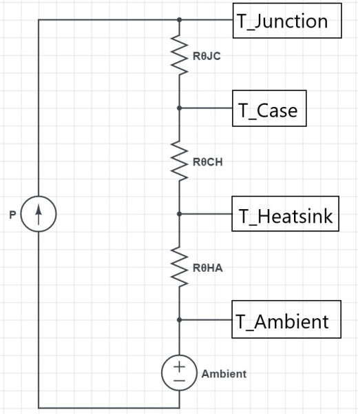

熱抵抗がどう使われるかをより深く理解するために、次の例を見てみよう。

- **消費電力**：2W
- **RθJC** = 4°C/W
- **RθCH** = 0.25°C/W
- **RθHA** = 6°C/W
- **TA** = 25°C

まず、オームの法則に相当する熱の式から始める。

\\[ T = P \times R_\theta \\]

ここで求めたいのは接合部の温度上昇なので、TはTJになる。
消費電力Pは2Wである。
熱抵抗は直列につながっているので、回路における直列抵抗と同じように、値を単純に足し合わせることができる。

\\[ T_J = P \times (R_{\theta JC} + R_{\theta CH} + R_{\theta HA}) = 2\text{W} \times (4 + 0.25 + 6)\text{°C/W} = 20.5\text{°C} \\]

接合部の温度は、周囲温度（この例では25°C）より20.5°C高いということなので、絶対温度は20.5°C + 25°C、つまり45.5°Cになる。

熱抵抗の値はどこで確認すればよいのだろうか。
電圧レギュレータやダイオード、トランジスタなどの半導体部品では、データシートに熱に関する情報の項目があり、ヒートシンクを使わない場合の接合部から空気までの熱抵抗（RθJA）や、ヒートシンクを使う場合の接合部からケースまでの熱抵抗（RθJC）が載っている。ヒートシンク自体にも固有の熱抵抗があり、これは次のセクションで扱う。
典型的な熱抵抗のデータは、以下の画像のような形で示されることが多い。

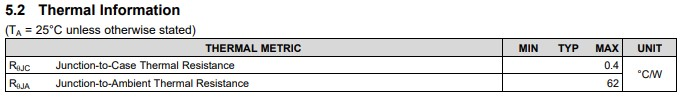

## 熱をどう伝えるか

### 金属フィン型ヒートシンク

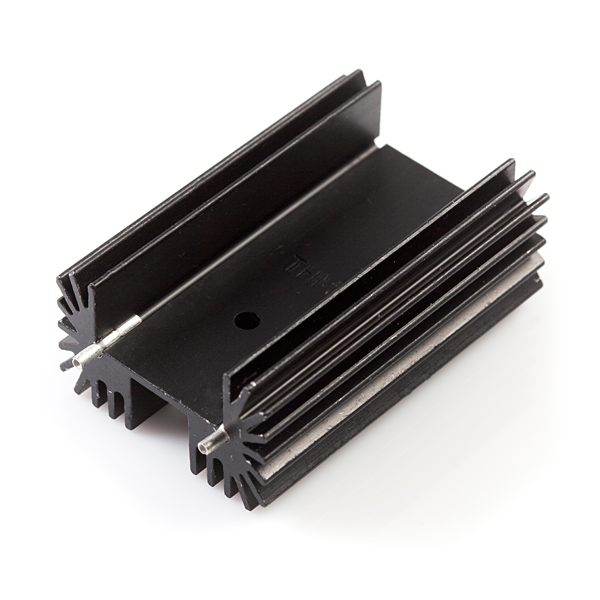

ヒートシンクにはさまざまな形やサイズのものがあるが、その目的はただ一つ、熱を空気へ伝えることである。
ヒートシンクの各フィンの役割は、空気と接する表面積をできるだけ大きくし、ヒートシンクから熱を奪うこと、ひいては半導体の接合部から熱を引き離す助けとなることである。
とはいえ、金属フィン型ヒートシンクの熱抵抗は、フィンのそばを流れる空気の量によって性能が変わるため、少しややこしいことがある。
典型的なヒートシンクのデータシートには、部品の寸法だけでなく、次のような熱特性のグラフも掲載されている。

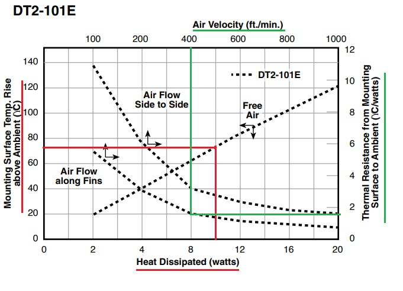

各プロット線の矢印は、それぞれが対応する軸を示している。
たとえば、赤くハイライトした部分は、無風状態（ファンなし）で10Wの電力を放散すると、ヒートシンクの温度が周囲温度よりおよそ78°C高くなることを示している。
一方、フィンに沿っておよそ400ft/minの風を流した場合、緑の線が示すように、同じ10Wの電力を放散したときのヒートシンクの熱抵抗はおよそ1.8°C/W、つまり周囲温度より18°C高くなる。

### ビア

設計にヒートシンクを追加する必要がある場合、たとえばスイッチモード電源のように部品をICにできるだけ近づけて配置することが重要な設計では、ビアが基板の片面から反対の面へ信号を伝えるだけでなく、熱を伝える役割も果たせる。

計算を自分でするのが面倒であれば、[Saturn PCB Design社のPCB Toolkit](https://saturnpcb.com/pcb_toolkit/)には、電気系エンジニアが使うさまざまな式を解いてくれる便利なツールがそろっている。
その中の一つのタブが、ビアの特性を扱うものである。

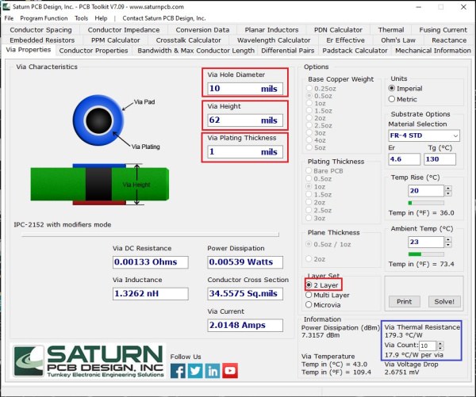

画像提供：[SaturnPCB](https://saturnpcb.com/pcb_toolkit/)

ビアの熱抵抗を求めるため、赤くハイライトした欄に、手元の基板の特性を入力した。
レイヤー数を2層に設定し、ビアの穴径を必要に応じて変更する程度で済むはずである。
ビアのめっき厚とビアの高さは、たいていの基板で標準的な値になっている。
「Solve」をクリックすると、右下の青い枠に熱抵抗が表示され、今回はビア1本あたり179.3°C/Wだった。
ビアが10本あれば、ビアの熱抵抗は17.9°C/Wまで下がる。
接合部の温度を計算する際は、ここでビア分の熱抵抗をもう一つ直列に追加し、他の熱抵抗と合わせて計算することになる。

### PCBによる放熱

PCB上で熱を伝える話になると、計算はあっという間に複雑になる。これが、ビアの熱抵抗にはSaturn PCBのツールを使うほうが簡単な理由の一つである。
PCB自体をヒートシンクとして使う場合は、さらに複雑になる。
表面積の関数である銅箔の熱抵抗だけでなく、ソルダーマスクや基材そのものの熱抵抗もあり、これらは周囲の孤立した銅箔パターンにも熱を伝えていく。
詳しい説明を読みたい場合は、[Texas Instrumentsのアプリケーションレポート](http://www.ti.com/lit/an/snva419c/snva419c.pdf)を参照してほしい。
もう少し読みやすい情報としては、Paul Bryson氏がこのテーマについて優れたブログ記事を書いており、興味深いヒントや知見が[こちら](http://www.brysonics.com/pcb-thermal-resistance-some-unexpected-results/)にまとめられている。

**おおまかな**目安としては、Paul Bryson氏の記事にある次のグラフを使うとよい。

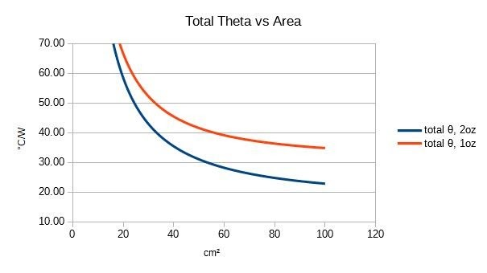

画像提供：[brysonics.com](http://www.brysonics.com/)のPaul Bryson氏

## 例：スルーホール実装のリニアレギュレータ

熱抵抗の計算が実際の世界でどれだけうまく機能するか見てみよう。
この例では、リニアレギュレータの[LM7805](https://www.sparkfun.com/products/107)と、[DC-DCコンバータ](https://www.sparkfun.com/products/15208)という2種類の異なる電圧レギュレータを使う。
データシートから得られる数値と実測値がどれだけ一致するか確認していく。

### リニアレギュレータ

低コストかつ低ノイズな電圧レギュレータの何が悪いというのだろうか。
リニアレギュレータは多くの用途に適した優れた選択肢だが、変換効率の面では見劣りする。
リニアレギュレータの基本的な設計は、次のようになる。

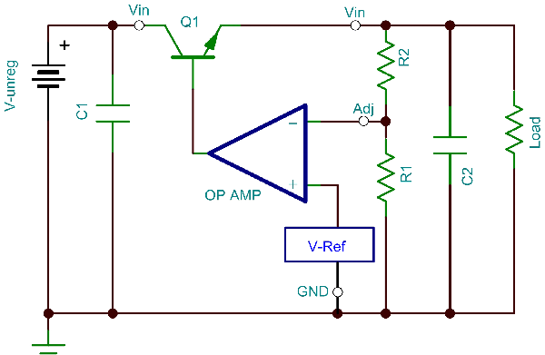

画像提供：[EE Times](https://www.eetimes.com/signal-chain-basics-part-19-exploring-and-understanding-linear-voltage-regulators/)

リニアレギュレータがどれだけ熱くなるかを求めるには、まず入力電力と出力電力が等しくなければならないという理解から始めよう。
理想的にはシステムの効率は100%になるはずだが、現実にはいくらか損失が生じ、その電力損失は熱（PD）として放散される。
これは次の式で表せる。

\\[ P_{in} = P_{out} + P_D \\]

つまり、消費電力は次のように表せる。

\\[ P_D = P_{in} - P_{out} \\]

電子回路において、電力は電圧と電流の積として表せる。
つまり、最初の式は次のように書き直せる。

\\[ P_D = (V_{in} \times I_{in}) - (V_{out} \times I_{out}) \\]

リニアレギュレータでは入力電流と出力電流が等しいので、この式は次のように簡略化できる。

\\[ P_D = I \times (V_{in} - V_{out}) \\]

次に、リニアレギュレータの熱特性を見てみよう。
LM7805には、使用しているTO-220パッケージについて、次のような熱抵抗が示されている。

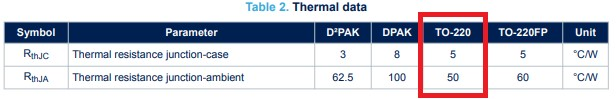

#### ヒートシンクなしの場合（RθJA）

最初の例として、負荷電流200mAのときにリニアレギュレータがどれだけ熱くなるかを見てみよう。
LM7805の出力電圧は5V、入力電圧はおよそ12Vとする。
これらの値を先ほどの電力損失の式に当てはめると、次のようになる。

\\[ P_D = 0.2\text{A} \times (12\text{V} - 5\text{V}) = 1.4\text{W} \\]

ヒートシンクなしでどれだけ熱くなるかを求めるには、接合部から空気までの熱抵抗（50°C/W）を使う必要がある。
熱抵抗のセクションの式を使い、周囲温度を23°Cと仮定すると、接合部の温度は次のように計算できる。

\\[ T_J = P_D \times R_{\theta JA} + T_A = 1.4\text{W} \times 50\text{°C/W} + 23\text{°C} = 93\text{°C} \\]

実際の値と比較するため、入力電圧を測定すると12.1V、負荷をかけた状態での出力電圧は4.90Vだった。
出力には、200mAに設定した定電流ダミー負荷を接続して測定した。
この実測値を使うと、消費電力は次のようになる。

\\[ P_D = 0.2\text{A} \times (12.1\text{V} - 4.90\text{V}) = 1.44\text{W} \\]

予想される接合部の温度は、次のようになる。

\\[ T_J = 1.44\text{W} \times 50\text{°C/W} + 23\text{°C} = 95\text{°C} \\]

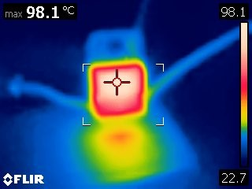

上のサーモグラフィ画像が示すとおり、負荷をオンにしてレギュレータの温度を上げていくと、およそ98°Cで安定した。
かなり近い値だが、数値には必ず余裕（マージン）を持たせるべき理由がよくわかる例でもある。
測定の精度の限界により、実際の電源電圧は計算に使った値よりわずかに高く、また負荷時の出力電圧の許容誤差は4%あるため、出力電圧は仕様の範囲内でも最低4.8Vまで下がりうる。

#### ヒートシンクを使う場合（RθJCを使用）

ここでヒートシンクを追加すると、接合部から空気までの熱抵抗の代わりに、接合部からケースまでの熱抵抗、およそ5°C/Wを使う必要がある。
使用しているヒートシンクのデータシートを見ると、無風状態でおよそ1.4Wの電力に対して25°Cの温度上昇が生じることがわかる。

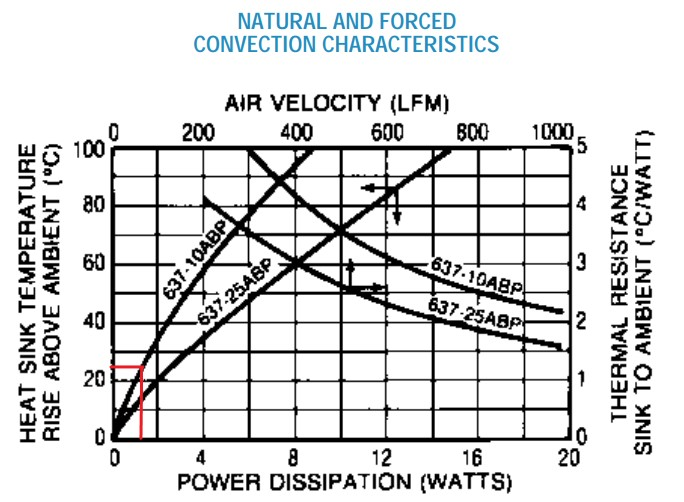

ヒートシンクのデータシートは熱抵抗ではなく温度上昇の形で示されているため、まず接合部からヒートシンクまでの熱抵抗を使って接合部の温度上昇を計算し、そこにヒートシンクの温度上昇と周囲温度を足し合わせて接合部の温度を求める必要がある。
熱伝導コンパウンドを使うと、ケースからヒートシンクまでの熱抵抗は下がる（およそ0.25°C/W）。使わない場合は、熱抵抗はおよそ1°C/Wと仮定する。
したがって、接合部の温度の式は次のようになる。

\\[ T_J = P_D \times (R_{\theta JC} + R_{\theta CH}) + T_{heatsink\ rise} + T_A \\]

\\[ T_J = 1.44\text{W} \times (5 + 1)\text{°C/W} + 25\text{°C} + 25\text{°C} = 56.64\text{°C} \\]

実際の電圧はヒートシンクなしのときと同じく、Vin = 12.10V、Vout = 4.90V、Iout = 200mAだった。
これは実際に放散する必要のある電力も同じ1.44Wになることを意味し、これによる接合部温度の計算値はわずかに56.64°Cまでしか上がらなかった。
電源と負荷をオンにしてから、温度が定常状態に落ち着くまで待ち、レギュレータの温度を測定するとおよそ54°Cだった。

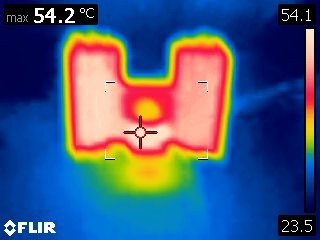

今回は、計算値よりも実測温度のほうが低かった。
おそらく誤差の原因は、無風状態でのヒートシンクの温度上昇を読み取った際の値にあり、25°Cではなく23°Cに近かった可能性がある。
最後の例では、表面実装タイプのレギュレータを使い、PCB自体をヒートシンクとして使った場合にどれだけ熱くなるかを見積もってみる。

## 例：表面実装のDC-DCコンバータ

ここで使う基板は[Buck-Boost](https://www.sparkfun.com/products/15208)で、[TPS63070 DC-DCコンバータ](https://cdn.sparkfun.com/assets/e/4/a/1/4/TPS63070_DataSheet.pdf)を搭載している。
基板は1.25×1.25インチで、1oz厚の銅箔を使用している。
その他の特徴として、レギュレータは基板の中央に配置されており、基板の95%以上が銅箔で覆われている。
このサイズのため、基板全体の面積を熱抵抗の計算に使い、ビアの熱抵抗の計算には41本のビアすべてを使うという前提を置くことにする。

まず、放散する必要のある電力を求める必要がある。
DC-DCコンバータでは入力電流と出力電流が等しくないため、リニアレギュレータのときと同じ式は使えない。
その代わり、データシートの効率グラフを使って見積もることができる。

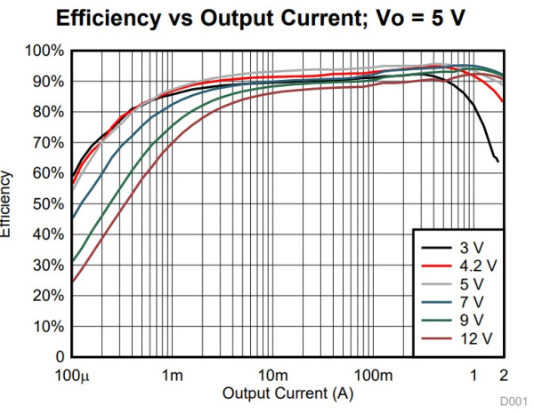

この効率グラフは、出力電流の関数として効率をプロットしたもので、入出力電圧によって値は変わる。
このテストでも、先ほどと同じく入力電圧12V、出力電圧5Vという条件を使う。
ただし今回は、負荷電流を1.0Aまで増やす。
上の5V用の効率グラフを使うと、効率はおよそ93%であり、電力損失は出力電力の7%程度になる。

出力電力は\\( P_{out} = V_{out} \times I_{out} = 5\text{V} \times 1.0\text{A} = 5\text{W} \\)であり、効率を\\( \eta \\)とすると消費電力は次のように見積もれる。

\\[ P_D = P_{out} \times \frac{1-\eta}{\eta} = 5\text{W} \times \frac{0.07}{0.93} \approx 0.38\text{W} \\]

熱抵抗については、先ほどのビア計算ツールを使い、ビアによる熱抵抗はツールで得られた値からおよそ4.4°C/Wと概算した。
PCBの熱抵抗を見積もるにあたっては、基板をテーブルから浮かせ、テーブル自体がヒートシンクにならないようにした。
ただし基板の裏面も空気に接することになるため、表面積は10.08cm²から20.16cm²へと2倍になる。
Buck-Boost基板の表面積をもとにすると、PCBの熱抵抗はおよそ65°C/Wと見積もれる。

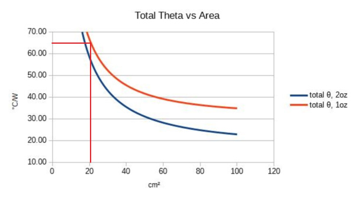

TPS63070のデータシートには、次のような熱特性が示されている。

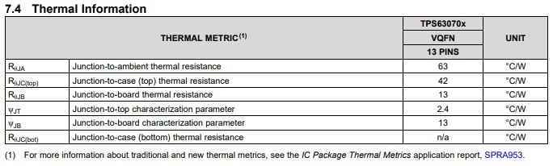

（画像をクリックすると拡大表示できる。）

接合部からケースまでの熱抵抗は該当しないが、接合部から基板までの熱抵抗はおよそ13°C/Wとして示されている。
これらの熱抵抗の値を、接合部の温度の式に当てはめてみよう。

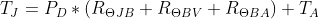

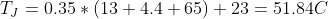

先ほどと同じように、ダミー負荷をオンにして、温度の上昇が止まるまで基板を加熱した。
以下に示すとおり、記録された温度はおよそ54°Cだった。

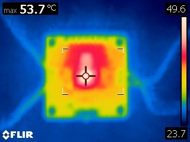

## まとめ

同じ計算は、さまざまな電力部品に応用できる。
たとえば、MOSFETのドレインとソース間の抵抗を見れば、さまざまな電流でどれだけ熱くなるかがわかる。
逆流防止用のダイオードであれば、順方向電圧降下と電流を使って計算できる。
これらの部品はすべて多少なりとも熱を発生させるが、これでその量を根拠を持って見積もれるようになったはずである。

身につけたスキルを早速試してみたい場合は、次のチュートリアルもおすすめである（いずれも英語）。

- [Simultaneous RFID Tag Reader Hookup Guide](https://learn.sparkfun.com/tutorials/simultaneous-rfid-tag-reader-hookup-guide)：RFID Tag Readerブレイクアウトを使い始めるための基本ガイドと、複数のRFIDタグを数フィート先から読み書きする方法。
- [ESP32 Thing Power Control Shield Hookup Guide](https://learn.sparkfun.com/tutorials/esp32-thing-power-control-shield-hookup-guide)：ESP32 Thing Power Control Shieldを使い始めるためのガイド。
- [Variable Load Hookup Guide - Revised](https://learn.sparkfun.com/tutorials/variable-load-hookup-guide---revised)：SparkFunのVariable Loadボードの組み立て方と使い方。電源の安定性や電池の寿命、安全遮断など、さまざまな電源の特性をテストできる。
- [Buck-Boost Hookup Guide](https://learn.sparkfun.com/tutorials/buck-boost-hookup-guide)：SparkFunのBuck-Boostボードの接続方法と使い方。
- [磁気浮上](./magnetic-levitation.md)：一般的な部品を使って磁気浮上回路を作る方法。

タグ: 概念、電気工学、電力

---

出典：[Understanding Thermal Resistance](https://learn.sparkfun.com/tutorials/understanding-thermal-resistance)（SparkFun Learn）を日本語に翻訳し、再構成した。
原文は [CC BY-SA 4.0](https://creativecommons.org/licenses/by-sa/4.0/) ライセンスで公開されており、本ページも同ライセンスの下で提供する。
