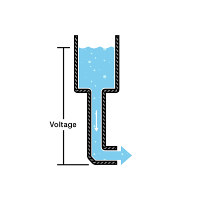
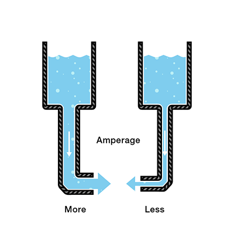
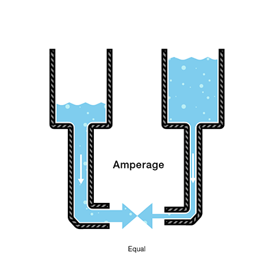
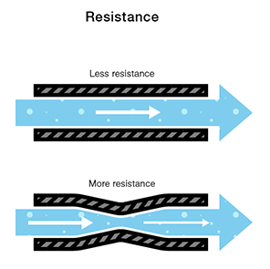
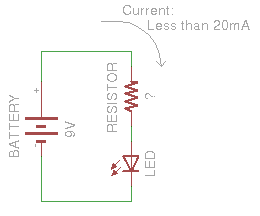
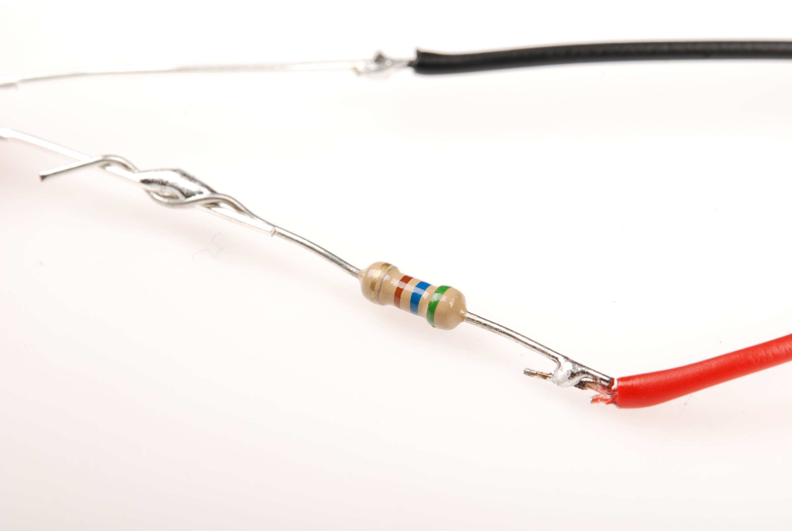

# 電圧、電流、抵抗とオームの法則

電気や電子工作の世界に足を踏み入れるとき、最初に理解しておくべきなのが**電圧**、**電流**、**抵抗**の3つである。
これらは電気を扱ううえでの基本的な構成要素であり、この3つを理解しなければ、回路を設計することも読み解くこともできない。

電圧、電流、抵抗は、最初はわかりにくく感じられるかもしれない。
理由は単純で、これらを肉眼で「見る」ことができないからである。
電線の中を流れているエネルギーも、テーブルの上に置かれた電池の電圧も、目には見えない。
空に走る雷は目に見えるが、それも雲から地面へのエネルギーの移動そのものではなく、その通り道の空気が起こす反応にすぎない。
このエネルギーの移動を捉えるには、テスター（マルチメーター）やスペクトラムアナライザー、オシロスコープといった計測器を使い、回路の中の電荷の動きを可視化する必要がある。
このチュートリアルでは、そうした計測器がなくても理解できる範囲で、電圧、電流、抵抗の基本と、3つの関係を説明する。

このチュートリアルで扱う内容:

- 電荷と、電圧、電流、抵抗の関係
- 電圧、電流、抵抗とは何か
- オームの法則とは何か、電気を理解するためにどう使うか
- これらの概念を確かめる簡単な実験

## 電荷

電気とは、電子の動きである。
電子が動くことで**電荷**が生まれ、その電荷を利用することで仕事をさせられる。
電球もステレオもスマートフォンも、電子の動きを利用して仕事をしているという点ではすべて同じであり、動作原理の根本は共通している。

このチュートリアルの3つの基本量は、電子の動き、より正確には電子が生み出す電荷を使って次のように説明できる。

- **電圧**は、2点間の電荷の差である。
- **電流**は、電荷が流れる速さである。
- 電流を妨げようとする材料の性質である。

つまり、電圧、電流、抵抗について語るとき、実際に語っているのは電荷の動き、すなわち電子のふるまいである。
**回路**とは、電荷がある場所から別の場所へ移動できるようにする閉じたループのことであり、回路上の部品を使うことで、この電荷の動きを制御し、仕事に利用できる。

電気を研究したバイエルンの科学者[ゲオルク・オーム](https://ja.wikipedia.org/wiki/ゲオルク・オーム)は、電流と電圧によって定義される抵抗の単位を示した人物である。
まずは電圧から見ていこう。

## 電圧

2点間に蓄えられた位置エネルギーの量を**電圧**と呼ぶ。
一方の点がもう一方より多くの電荷を持っているとき、その2点間の電荷の差を電圧と呼ぶ。
単位は**ボルト**であり、技術的には、1クーロンの電荷が通過する際に1ジュールのエネルギーを与える2点間の電位差として定義される（ここで意味がわからなくても心配はいらない、後で説明する）。
「ボルト」という単位名は、最初の化学電池を発明したとされるイタリアの物理学者[アレッサンドロ・ボルタ](https://ja.wikipedia.org/wiki/アレッサンドロ・ボルタ)にちなむ。
電圧は数式や回路図の中で記号「V」で表される。

電圧、電流、抵抗を説明するとき、よく使われるたとえが水タンクである。
このたとえでは、電荷は水の*量*、電圧は水の*圧力*、電流は水の*流量*に対応する。

- 水 = 電荷
- 圧力 = 電圧
- 流れ = 電流

地面から一定の高さにある水タンクを考える。
タンクの底にはホースが取り付けられている。

ホースの先端にかかる圧力が電圧に相当し、タンクの中の水が電荷に相当する。
タンクの水が多いほど電荷は大きく、ホースの先端で測られる圧力も高くなる。

このタンクは、一定量のエネルギーを蓄えて後から放出する電池と考えられる。
タンクの水を減らすと、ホース先端の圧力は下がる。
これは、懐中電灯の電池が減るにつれて明かりが暗くなるときのように、電圧が下がることに対応する。
同時に、ホースを流れる水の量も減る。
圧力が下がれば流れる水も減る、これが電流の話につながる。

## 電流

タンクからホースを通って流れる水の量が**電流**に相当する。
圧力が高いほど流量は多くなり、その逆も同様である。
水の場合は一定時間あたりに流れる水の体積を測るが、電気の場合は一定時間あたりに回路を流れる電荷の量を測る。
電流の単位は**アンペア**（通常は単に「アンプ」と呼ばれる）であり、1アンペアは回路上のある点を1秒間に6.241×10^18個の電子（1クーロン）が通過することと定義される。
数式の中でアンペアは記号「I」で表される。

同じ量の水が入った2つのタンクを考える。
それぞれの底からホースが伸びているが、一方のホースはもう一方より細い。

どちらのホースの先端でも圧力は同じだが、水が流れ始めると、細いホースのほうが太いホースより流量は少なくなる。
電気の言葉に置き換えると、細いホースを通る電流は太いホースを通る電流より小さいということになる。
もし両方のホースで流量を同じにしたいなら、細いホースのタンクの水（電荷）の量を増やす必要がある。

水を増やすと、細いホースの先端にかかる圧力（電圧）が上がり、より多くの水が押し出される。
これは、電圧を上げることで電流が増えることに対応する。

ここまでで、電圧と電流の関係が見えてきた。
しかし、もう1つ考慮すべき要素がある。
それがホースの太さであり、このたとえの中でホースの太さに相当するのが**抵抗**である。
モデルに、もう1つの項を加える必要がある。

- 単位：クーロン
- 単位：ボルト
- 単位：アンペア
- **ホースの太さ = 抵抗**

## 抵抗

再び、細いパイプと太いパイプを持つ2つの水タンクを考える。

同じ圧力であれば、細いパイプには太いパイプほどの水量を通せないのは道理である。
これが抵抗であり、細いパイプは、太いパイプのタンクと同じ圧力の水であっても、その流れを「妨げる」。

電気の言葉で言えば、これは電圧が等しく抵抗が異なる2つの回路に対応する。
抵抗が大きい回路ほど流せる電荷は少なくなり、つまり抵抗が大きい回路ほど流れる電流は小さくなる。

ここでゲオルク・オームの話に戻る。
オームは「1オーム」という抵抗の単位を、導体上の2点間で1ボルトの電圧が1アンペア（6.241×10^18個の電子）を押し流すときの抵抗として定義した。
この値は回路図の中でギリシャ文字「Ω」（オメガ、読みは「オーム」）で表されるのが一般的である。

## オームの法則

電圧、電流、抵抗を組み合わせて、オームは次の式を導いた。

\\[ V = I \times R \\]

- ボルト
- アンペア
- オーム

これが**オームの法則**である。
たとえば、電位1ボルト、電流1アンペア、抵抗1オームの回路があるとする。
オームの法則により、この関係は成り立つ。

太いホースのタンクで考えると、タンクの水量が1ボルト、ホースの「細さ」（流れへの抵抗）が1オームに相当し、オームの法則から流量（電流）は1アンペアとなる。

同じたとえで、今度は細いホースのタンクを見てみる。
ホースが細い分、流れへの抵抗は大きく、これを2オームとする。
タンクの水量はもう一方と同じなので、オームの法則から、細いホースのタンクの式は次のようになる。

電流はどうなるか。
抵抗が大きく電圧が同じであることから、電流の値は0.5アンペアになる。

抵抗が大きいタンクのほうが電流は小さい。
オームの法則の3つの値のうち2つがわかれば、残る1つを求められることがここからわかる。
これを実験で確かめてみよう。

## オームの法則の実験

この実験では、9ボルトの電池でLEDを点灯させる。
LEDは繊細な部品であり、流せる電流には上限がある。
それを超えると壊れてしまう。
LEDのデータシートには必ず「定格電流」が記載されており、これがそのLEDに流せる電流の上限を示す値である。

### 必要な部品

このチュートリアル末尾の実験を行うには、次のものが必要である。

- マルチメーター
- 9ボルト電池
- 入手できなければ、それに近い値のもの
- LED

> [!NOTE]
> LEDは「非オーム性」の部品として知られている。
> つまり、LED自体を流れる電流の式は V = I × R ほど単純ではない。
> LEDは回路に「順方向電圧降下」と呼ばれる電圧降下をもたらし、それによって流れる電流の量が変化する。
> ただし、この実験の目的はLEDを過電流から守ることであり、LED自体の電流特性は無視して、オームの法則だけを使い、LEDを流れる電流が20mAを安全に下回るように抵抗値を選ぶ。

ここでは、9ボルトの電池と、定格電流20ミリアンペア（0.020アンペア）の赤色LEDを使う。
安全のため、定格の上限ではなく、データシートに記載された推奨電流である18ミリアンペア（0.018アンペア）で駆動することにする。
LEDを電池に直接つなぐと、オームの法則の値は次のようになる。

抵抗がまだない状態でこれを計算すると、ゼロで割ることになり、電流は無限大という結果になる。
実際には無限大にはならないが、電池が供給できる限りの電流が流れてしまう。
これほどの電流をLEDに流したくはないので、抵抗が必要になる。
回路は次のようになる。

同じくオームの法則を使えば、望みの電流値を得るための抵抗値を求められる。
必要な値を代入し、抵抗について解くと、LEDの電流を定格以下に保つには、およそ500オームの抵抗が必要だとわかる。

500オームは市販の抵抗ではあまり一般的な値ではないため、この作例では代わりに560オームの抵抗を使っている。

抵抗の値を、LEDの定格電流を下回りつつ、LEDを十分明るく点灯させられる値に選べたことになる。
LEDと電流制限抵抗の組み合わせは、電子工作の趣味の世界でよく登場する。
オームの法則を使って回路を流れる電流量を調整する場面は、この先何度も出てくるだろう。
LilyPad LEDボードも、この考え方を実装した例の1つである。
この基板ではLEDと同じ基板上にあらかじめ抵抗が実装されており、電流制限のために抵抗を別途配線する必要がない。

### 電流制限抵抗はLEDの前段と後段のどちらに置くべきか

話をもう一歩進めると、電流制限抵抗はLEDのどちら側に置いても同じように機能する。

電子工作を学び始めたばかりの人の多くが、電流制限抵抗をLEDのどちら側に置いても回路が変わらず動作するという事実に戸惑う。

輪になって循環し続ける川を想像してほしい。
そこにダムを1つ設ければ、川全体の流れが止まる。
一部だけが止まるわけではない。
今度は、その川に水車を1つ置いて流れを緩めるとする。
水車を輪のどこに置いても、*川全体*の流れが同じように緩やかになる。

これは単純化した説明であり、実際には電流制限抵抗を回路の*どこにでも*置けるわけではない。
置けるのはLEDの*どちらか一方の側*であり、その範囲でなら機能するということである。

より厳密な説明としては、[キルヒホッフの電圧則](https://ja.wikipedia.org/wiki/キルヒホッフの法則_(電気回路))が関係する。
電流制限抵抗をLEDのどちら側に置いても同じ効果が得られるのは、この法則があるからである。

## まとめ

ここまでで、電圧、電流、抵抗の概念と、3つがどう関係し合っているかを理解できたはずである。
回路解析に使われる式や法則の大半は、オームの法則から直接導き出せる。
この単純な法則を理解することが、あらゆる電気回路の解析の土台になる。

電圧、電流、抵抗の先にある、より発展的な内容を学びたい場合は、次のチュートリアルも参照してほしい。

- [直列回路と並列回路](./series-and-parallel-circuits.md)
- [電力](./electric-power.md)
- [アナログとデジタル](https://learn.sparkfun.com/tutorials/analog-vs-digital)
- [抵抗器](./resistors.md)
- [発光ダイオード](./light-emitting-diodes-leds.md)
- [テスターの使い方](./how-to-use-a-multimeter.md)

タグ: 概念、電気工学、LED、プロジェクトを始める

---

出典：[Voltage, Current, Resistance, and Ohm's Law](https://learn.sparkfun.com/tutorials/voltage-current-resistance-and-ohms-law)（SparkFun Learn）を日本語に翻訳し、再構成した。
原文は [CC BY-SA 4.0](https://creativecommons.org/licenses/by-sa/4.0/) ライセンスで公開されており、本ページも同ライセンスの下で提供する。
