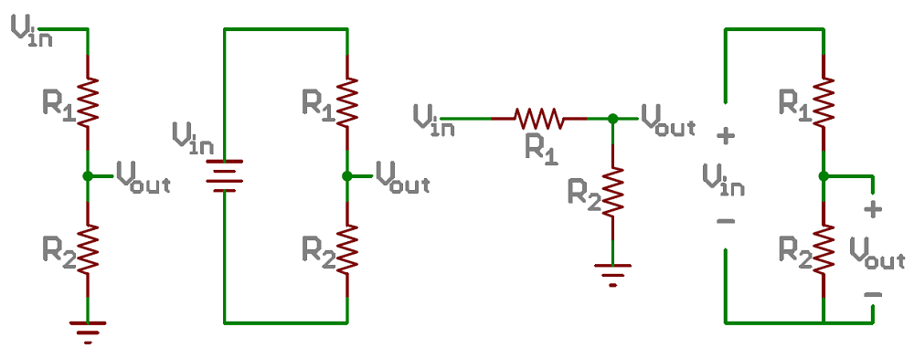
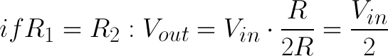
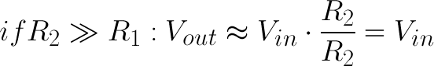
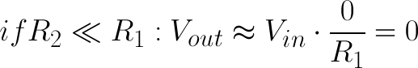
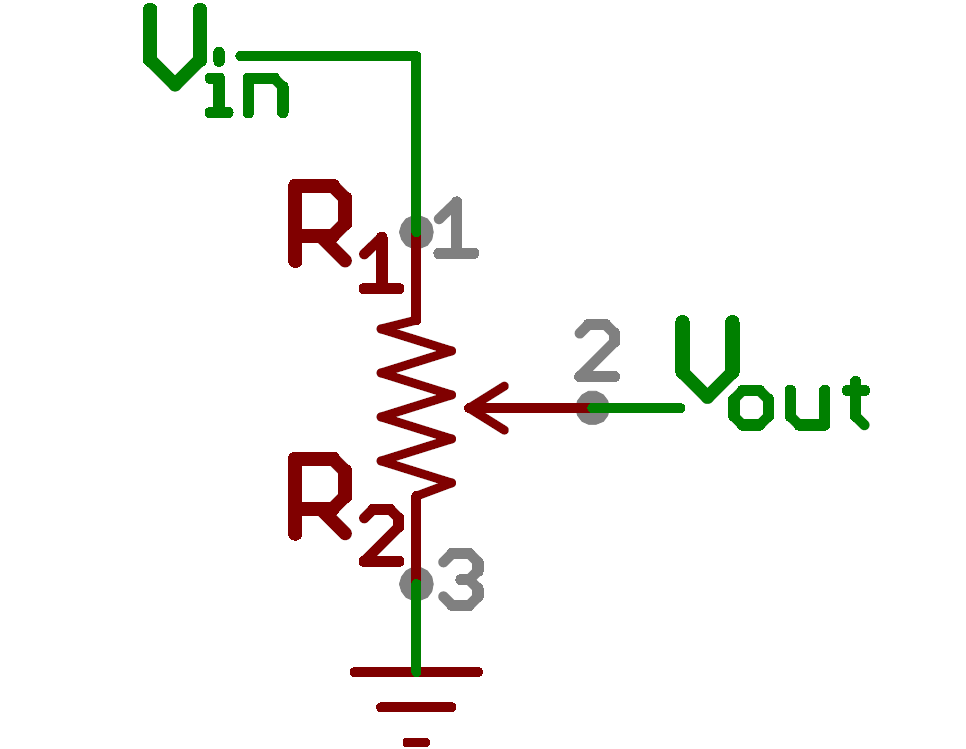
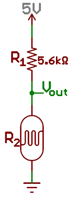
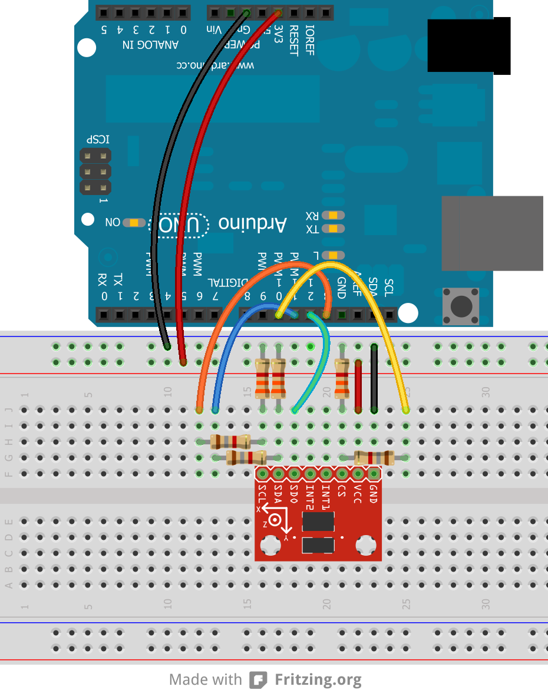

# 分圧回路

**分圧回路**は、大きな電圧を小さな電圧に変換する単純な回路である。
直列につないだ2本の抵抗と入力電圧だけを使って、入力電圧のある割合にあたる出力電圧を作り出せる。
分圧回路は、電子工作でもっとも基本的な回路の1つである。
[オームの法則](./voltage-current-resistance-and-ohms-law.md)を学ぶことがアルファベットを覚えるようなものだとすれば、分圧回路を学ぶことは、それを使って「<ruby>cat<rt>ネコ</rt></ruby>」という単語を綴れるようになるようなものである。

このチュートリアルで扱う内容:

- 分圧回路がどのような見た目をしているか
- 出力電圧が、入力電圧と2本の抵抗によってどう決まるか
- 実際の分圧回路がどうふるまうか
- 分圧回路の実践的な応用例

参考になるチュートリアル:

- [回路とは何か](./what-is-a-circuit.md)
- [直列回路と並列回路](./series-and-parallel-circuits.md)
- [電圧、電流、抵抗とオームの法則](./voltage-current-resistance-and-ohms-law.md)
- [アナログとデジタルの違い](./analog-vs-digital.md)
- [テスターの使い方](./how-to-use-a-multimeter.md)
- [ブレッドボードの使い方](./how-to-use-a-breadboard.md)
- [アナログ-デジタル変換](./analog-to-digital-conversion.md)

## 理想的な分圧回路

分圧回路には、重要な要素が2つある。
回路そのものと、その式である。

### 回路

分圧回路は、直列につないだ2本の抵抗に電源電圧をかけるだけの回路である。
描き方はいくつかあるが、どれも本質的には同じ回路になる。

入力電圧（Vin）に近いほうの抵抗をR1、グラウンドに近いほうの抵抗をR2と呼ぶことにする。
R2にかかる電圧降下をVoutと呼び、これがこの回路の目的である「分圧された電圧」にあたる。

回路の構成はこれだけである。
Voutが、私たちの求める分圧された電圧であり、これが入力電圧のある割合になる。

### 式

分圧回路の式では、上の回路にある3つの値、つまり入力電圧（Vin）と2本の抵抗値（R1とR2）がわかっていることを前提とする。
これらの値がわかれば、次の式で出力電圧（Vout）を求められる。

\\[ V_{out} = V_{in} \times \frac{R_2}{R_1 + R_2} \\]

**この式は覚えておくとよい。**
この式は、出力電圧が**入力電圧**と**R1とR2の比**に**正比例する**ことを示している。
この式がどこから導かれるのか気になる場合は、このチュートリアルの末尾にある導出の節を参照してほしい。
ただし今は、まずこの式をそのまま覚えてしまってかまわない。

### 簡略化した見方

分圧回路を扱ううえで覚えておくと便利な、いくつかの一般化されたパターンがある。
これらは、分圧回路をぱっと評価するのに役立つ簡略化である。

まず、**R1とR2が等しい**場合、出力電圧は入力電圧のちょうど**半分**になる。
これは抵抗の実際の値に関係なく常に成り立つ。

R2がR1よりも*はるかに*大きい（少なくとも1桁以上大きい）場合、出力電圧は入力電圧にかなり近くなる。
このときR1にかかる電圧はごくわずかになる。

逆に、R2がR1よりはるかに小さい場合、出力電圧は入力電圧に比べてごくわずかになる。
入力電圧のほとんどはR1にかかることになる。

## 応用例

分圧回路には無数の応用があり、電気工学者が使うもっとも一般的な回路の1つである。
ここでは、分圧回路が使われている代表的な場面をいくつか紹介する。

### ポテンショメータ

**ポテンショメータ**は、調整可能な分圧回路を作るのに使える可変抵抗器である。

ポットの内部には1本の抵抗体と、それを2つに分けて動く「ワイパー」があり、ワイパーを動かすことで両側の抵抗の比を調整できる。
外部にはたいてい3本のピンがあり、2本は抵抗体の両端に、残る1本はワイパーにつながっている。

外側の2つのピンを電源につなぐと（片方をグラウンドに、もう片方をVinに）、中央のピンの出力（Vout）は分圧回路と同じようにふるまう。
ポットを一方向いっぱいに回すと出力電圧はゼロに近づき、反対方向に回すと出力電圧は入力電圧に近づく。
ワイパーが中央の位置にあるときは、出力電圧は入力電圧のちょうど半分になる。

ポテンショメータにはさまざまなパッケージがあり、それ自体にも多くの応用がある。
基準電圧を作る、ラジオの選局を調整する、[ジョイスティック](https://www.sparkfun.com/products/9032)で位置を測るなど、可変の入力電圧が必要なあらゆる場面で使われている。

### 抵抗性センサーを読み取る

現実世界のセンサーの多くは、単純な抵抗性の部品である。
[フォトセル](https://www.sparkfun.com/products/9088)は、感知した光の量に応じて抵抗値が変わる可変抵抗器である。
[フレックスセンサー](https://www.sparkfun.com/products/8606)や[感圧抵抗（FSR）](https://www.sparkfun.com/products/9375)、[サーミスタ](https://www.sparkfun.com/products/250)なども同様に可変抵抗器の一種である。

マイコン（少なくとも[アナログ-デジタル変換器](./analog-to-digital-conversion.md)、ADCを備えたもの）にとって、電圧はとても測りやすい量である。
しかし抵抗はそう簡単には測れない。
そこで、このような抵抗性センサーにもう1本抵抗を追加して分圧回路を作れば、その出力電圧を測ることで、逆算してセンサーの抵抗値を求められる。

たとえばフォトセルの抵抗値は、明るい場所では1kΩ程度、暗い場所では10kΩ程度まで変化する。
これに、ちょうど中間くらいの固定抵抗（たとえば5.6kΩ）を組み合わせると、この分圧回路から広い範囲の出力が得られる。

| 明るさ | R2（センサー） | R1（固定） | 比 R2/(R1+R2) | Vout  |
| ------ | -------------- | ---------- | ------------- | ----- |
| 明るい | 1kΩ            | 5.6kΩ      | 0.15          | 0.76V |
| 薄暗い | 7kΩ            | 5.6kΩ      | 0.56          | 2.78V |
| 暗い   | 10kΩ           | 5.6kΩ      | 0.67          | 3.21V |

明るいときと暗いときで、およそ2.45Vの変化幅になる。
たいていのADCにとっては、十分な分解能である。

### レベルシフト

より複雑なセンサーになると、[UART](./serial-communication.md)、[SPI](./serial-peripheral-interface-spi.md)、[I2C](./i2c.md)のような、本格的なシリアルインターフェースで測定値を送ってくることがある。
こうしたセンサーの多くは、消費電力を抑えるために比較的低い電圧で動作する。
しかし、そうした低電圧のセンサーが、より高い電源電圧で動作するマイコンとやり取りする場面も少なくない。
これが**レベルシフト**の問題であり、その解決策の1つが分圧回路である。

たとえば[ADXL345加速度センサー](https://www.sparkfun.com/products/9836)の最大入力電圧は3.3Vなので、これを（5Vで動作する）Arduinoとやり取りさせるには、5Vの信号を3.3Vまで落とす必要がある。
ここで分圧回路の出番である。
5Vの信号をおよそ3.3Vまで分圧できる比率の抵抗を2本用意するだけでよい。
こうした用途には、1kΩから10kΩ程度の範囲の抵抗がよく使われる。

ただし、この方法は一方向にしか使えない点に注意してほしい。
分圧回路だけでは、低い電圧を高い電圧に昇圧することはできない。

### やってはいけない使い方

12Vの電源を5Vに落とすために分圧回路を使いたくなるかもしれないが、**分圧回路を負荷への電力供給に使ってはならない**。

負荷が必要とする電流は、そのままR1にも流れることになる。
R1にかかる電流と電圧は電力を生み、それは熱として放出される。
その電力が抵抗の定格（たいてい⅛Wから1W程度）を超えると、発熱が深刻な問題になり、かわいそうな抵抗器を溶かしてしまいかねない。

その効率の悪さについては言うまでもない。
基本的に、ある程度以上の電力を必要とするものへの電源供給に、分圧回路を使うべきではない。
電圧を落として電源として使いたい場合は、電圧レギュレータやスイッチング電源を検討してほしい。

## 補足：式の導出

分圧回路についてもっと知りたいなら、ここでオームの法則から分圧回路の式がどう導かれるのかを見ていこう。
これは分圧回路の使い方を理解するうえで必須ではないが、興味があれば、オームの法則と代数を使った小さな演習として楽しんでほしい。

Voutの電圧を測りたいとする。
オームの法則を使って、この電圧を求める式をどう組み立てればよいか。
Vin、R1、R2の値がわかっているとして、Voutをこれらの値で表す式を求めてみよう。

まず、回路に流れる電流I1とI2（それぞれの抵抗を流れる電流）を書き出すところから始める。

Voutを計算するのが目標なので、この電圧にオームの法則を適用してみよう。
関わる抵抗と電流はそれぞれ1つずつなので簡単である。

\\[ V_{out} = I_2 \times R_2 \\]

R2の値はわかっているが、I2はどうか。
これは未知の値だが、少しだけ手がかりがある。
**I1はI2に等しい**と仮定できる（これは実は大きな仮定である）。
これで何がわかるだろうか。
ひとまずこの点は保留しておこう。
これで回路は、I1とI2をどちらも*I*として表せる、次のような形になる。

\\[ V_{out} = I \times R_2 \\]

Vinについては何がわかっているか。
Vinは、直列につながれたR1とR2の両方にかかる電圧である。
直列の抵抗は足し合わされるので、次のように言える。

\\[ V_{in} = I \times (R_1 + R_2) \\]

これは、オームの法則のもっとも基本的な形、Vin = I × Rにほかならない。
ここで _R_ を _R1 + R2_ に戻すと、次のように書ける。

\\[ I = \frac{V_{in}}{R_1 + R_2} \\]

そしてIはI2に等しいので、これを先ほどのVoutの式に代入すると、

\\[ V_{out} = V_{in} \times \frac{R_2}{R_1 + R_2} \\]

これが、分圧回路の式である。
出力電圧は入力電圧のある割合になっており、その割合はR2をR1とR2の和で割ったものである。

## まとめ

電子工作でもっともよく使われる回路の1つの要点をつかんだところで、さらに学べることはまだたくさんある。

Arduinoのようなマイコンが、分圧回路の作るアナログ電圧をどう読み取るのか知りたくないだろうか。

- [アナログ-デジタル変換器](./analog-to-digital-conversion.md)

分圧回路とADCの組み合わせは、電子工作の世界で多くのことを可能にしてくれる。
次のようなチュートリアルもあわせて参照してほしい。

- [加速度センサー](./accelerometer-basics.md)や[ジャイロセンサー](./gyroscope.md)の一部にはアナログ出力のものがあり、使える値として読み取るにはADCが必要になる。
- [パルス幅変調](https://learn.sparkfun.com/tutorials/pulse-width-modulation)は、アナログ入力とは逆の、いわばアナログ出力に相当する仕組みである。
- [INA169](https://learn.sparkfun.com/tutorials/ina169-breakout-board-hookup-guide)のようなICを使うと、ADCで電流を検出できる。
- 分圧回路と[ADC](./analog-to-digital-conversion.md)を組み合わせれば、トリムポットやジョイスティック、スライダー、感圧抵抗など、さまざまなセンサーや可変部品を読み取れる。
- Arduinoの [`map()`](https://www.arduino.cc/reference/en/language/functions/math/map/) 関数は、ADCの値を別の範囲に変換してくれる。
- [電池残量警告インジケーター](https://learn.sparkfun.com/tutorials/uh-oh-battery-level-indicator-hookup-guide)の製作例では、分圧回路を使って電池の電圧低下を知らせている。

タグ: 概念、電気工学

---

出典：[Voltage Dividers](https://learn.sparkfun.com/tutorials/voltage-dividers)（SparkFun Learn）を日本語に翻訳し、再構成した。
原文は [CC BY-SA 4.0](https://creativecommons.org/licenses/by-sa/4.0/) ライセンスで公開されており、本ページも同ライセンスの下で提供する。
