# 電池とは何か

電池とは、1つ以上のセルが化学反応を起こし、回路の中に電子の流れを生み出す装置の集合体である。
すべての電池は、アノード（「－」側）、カソード（「＋」側）、そして電解質（アノードやカソードと化学的に反応する物質）という3つの基本的な要素から構成される。

電池のアノードとカソードが回路に接続されると、アノードと電解質の間で化学反応が起きる。
この反応によって電子が回路を流れ、再びカソードへと戻り、そこで別の化学反応が起きる。
カソードやアノードの物質が消費され、あるいは反応にこれ以上使えなくなると、電池は電気を生み出せなくなる。
この状態が、いわゆる電池が「切れた」状態である。

使い切ったら捨てなければならない電池は**一次電池**と呼ばれる。
充電できる電池は**二次電池**と呼ばれる。

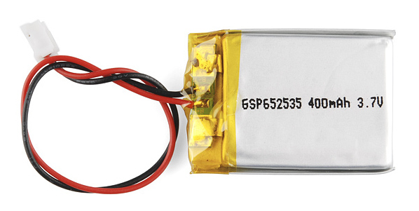

電池がなければ、クアッドコプターは壁につながれたままになり、車は手回しクランクで動かさなければならず、Xboxのコントローラーも（懐かしい時代のように）常にケーブルをつないでおく必要があっただろう。
電池は、電気的な位置エネルギーを持ち運び可能な容器に蓄える手段を提供してくれる。

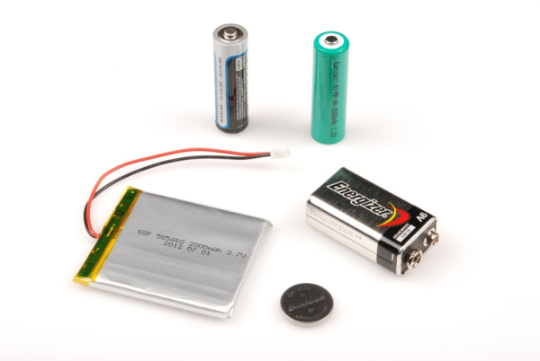

現代的な電池の発明は、しばしば[アレッサンドロ・ボルタ](https://ja.wikipedia.org/wiki/アレッサンドロ・ボルタ)の功績とされている。
実はその始まりは、カエルの解剖にまつわる意外な偶然の出来事だった。

このチュートリアルで扱う内容:

- 電池がどのように発明されたか
- 電池を構成する部品
- 電池の仕組み
- 電池を説明する際によく使われる用語
- 回路の中で電池を使うさまざまな方法

参考になるチュートリアル:

このガイドを読み始める前に、知っておくとよい概念がいくつかある。

- [電気とは何か](./what-is-electricity.md)
- [電圧、電流、抵抗とオームの法則](./voltage-current-resistance-and-ohms-law.md)
- [回路とは何か](./what-is-a-circuit.md)
- [直列回路と並列回路](./series-and-parallel-circuits.md)
- [電力](./electric-power.md)
- [交流と直流の違い](./alternating-current-ac-vs-direct-current-dc.md)

## 歴史

### 「バッテリー」という言葉

歴史的に、「バッテリー（battery）」という言葉は、大砲の一群（バッテリー）のように、「ある機能を果たすために似たものを一連にまとめたもの」を表すのに使われてきた。
1749年、[ベンジャミン・フランクリン](https://ja.wikipedia.org/wiki/ベンジャミン・フランクリン)は、自身の電気実験のためにつなぎ合わせた一連のコンデンサを指して、初めてこの言葉を使った。
その後、この言葉は電力を供給する目的でつなぎ合わされた電気化学セルの集まり全般を指すようになった。

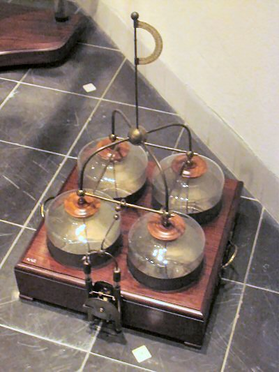

### 電池の発明

1780年のある運命的な日、イタリアの物理学者であり医師、生物学者、哲学者でもあった[ルイージ・ガルヴァーニ](https://ja.wikipedia.org/wiki/ルイージ・ガルヴァーニ)は、真鍮のフックに取り付けられたカエルを解剖していた。
鉄製のメスでカエルの脚に触れると、脚がぴくりと動いた。
ガルヴァーニは、そのエネルギーは脚そのものから来ていると考えたが、彼の同僚科学者であった[アレッサンドロ・ボルタ](https://ja.wikipedia.org/wiki/アレッサンドロ・ボルタ)はそうは考えなかった。

ボルタは、カエルの脚の反応は実際には液体に浸された異なる金属によって引き起こされていると仮説を立てた。
彼はカエルの死骸の代わりに塩水に浸した布を使って同じ実験を繰り返し、同様の電圧が得られることを確かめた。
ボルタは1791年にこの発見を発表し、その後1800年に、最初の電池である[ボルタ電堆](https://ja.wikipedia.org/wiki/ボルタ電堆)を作り上げた。

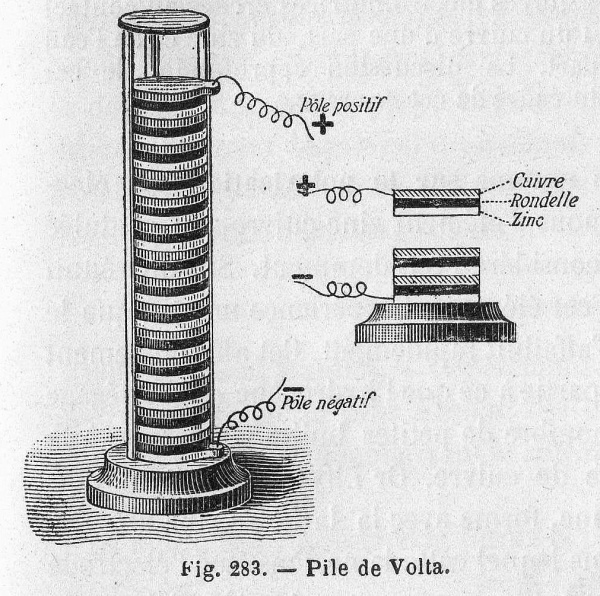

ボルタの電堆には2つの大きな問題があった。
積み重ねた重みによって電解質が布から漏れ出してしまうことと、材料の特定の化学的性質により、寿命が非常に短かった（およそ1時間程度）ことである。
その後の200年間は、ボルタの設計を改良し、これらの問題を解決することに費やされることになる。

### ボルタ電堆の改良

スコットランドの[ウィリアム・クルックシャンク](https://ja.wikipedia.org/wiki/William_Cruickshank_(chemist))は、ボルタ電堆を横向きに寝かせることで「トラフ電池」を考案し、漏れの問題を解決した。

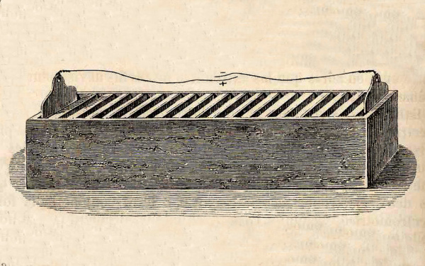

もうひとつの問題である短い寿命は、不純物による亜鉛の劣化と、銅の表面に水素の泡が蓄積することが原因だった。
1835年、[ウィリアム・スタージャン](https://ja.wikipedia.org/wiki/%E3%82%A6%E3%82%A3%E3%83%AA%E3%82%A2%E3%83%A0%E3%83%BB%E3%82%B9%E3%82%BF%E3%83%BC%E3%82%B8%E3%83%A3%E3%83%B3)は、亜鉛を水銀で処理することでこの劣化を防げることを発見した。

イギリスの化学者[ジョン・フレデリック・ダニエル](https://ja.wikipedia.org/wiki/%E3%82%B8%E3%83%A7%E3%83%B3%E3%83%BB%E3%83%95%E3%83%AC%E3%83%87%E3%83%AA%E3%83%83%E3%82%AF%E3%83%BB%E3%83%80%E3%83%8B%E3%82%A8%E3%83%AB)は、水素と反応する2つ目の電解質を使うことで、銅のカソード表面での水素の蓄積を防いだ。
ダニエルの2種類の電解質を使う電池は「ダニエル電池」として知られ、誕生したばかりの電信網に電力を供給する非常に普及した解決策となった。

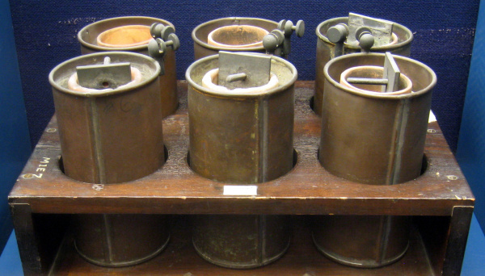

### 最初の充電式電池

1859年、フランスの物理学者[ガストン・プランテ](https://ja.wikipedia.org/wiki/ガストン・プランテ)は、硫酸に浸した2枚の鉛のシートを丸めて使う電池を作り出した。
電池を流れる電流の向きを逆にすることで、化学的な状態を元に戻すことができ、これが最初の充電式電池となった。

その後1881年、[カミーユ・アルフォンス・フォール](https://ja.wikipedia.org/wiki/Camille_Alphonse_Faure)は、鉛のシートを板状に成形することでプランテの設計を改良した。
この新しい設計により電池の製造が容易になり、鉛蓄電池は自動車で広く使われるようになった。

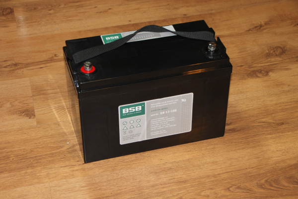

### 乾電池

1800年代後半までは、電池の電解質は液体の状態だった。
そのため電池の輸送には細心の注意が必要であり、たいていの電池は一度回路に接続したら動かすことを想定されていなかった。

1866年、[ジョルジュ・ルクランシェ](https://ja.wikipedia.org/wiki/ジョルジュ・ルクランシェ)は、亜鉛のアノード、[二酸化マンガン](https://ja.wikipedia.org/wiki/二酸化マンガン)のカソード、そして電解質として[塩化アンモニウム](https://ja.wikipedia.org/wiki/塩化アンモニウム)溶液を使う電池を作った。
ルクランシェ電池の電解質はまだ液体だったが、この電池の化学方式は乾電池の発明にとって重要な一歩となった。

[カール・ガスナー](http://www.worldofchemicals.com/32/chemistry-articles/carl-gassner-inventor-of-dry-cell-battery.html)は、塩化アンモニウムと石膏（プラスターオブパリ）からペースト状の電解質を作る方法を編み出した。
彼は1886年、ドイツでこの新しい「乾電池」の特許を取得した。

これらの新しい乾電池は「マンガン乾電池（亜鉛-炭素電池）」と一般に呼ばれ、大量生産され、1950年代後半まで絶大な人気を誇った。
炭素は化学反応そのものには関与していないが、亜鉛-炭素電池の中で電気伝導体としての重要な役割を果たしている。

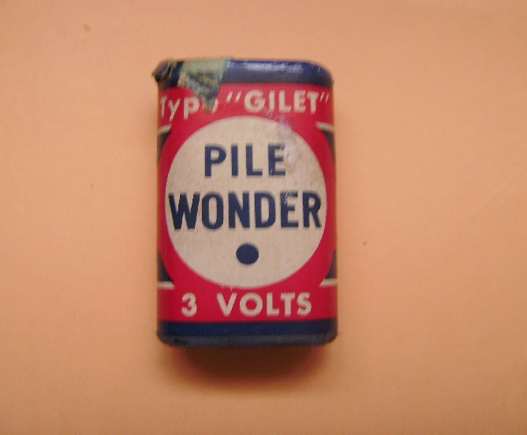

1950年代、ユニオン・カーバイド社（のちに「エバレディ」、さらに「エナジャイザー」として知られるようになる）のルイス・アーリー、ポール・マーサル、カール・コルデシュは、1899年に[ヴァルデマール・ユングナー](https://ja.wikipedia.org/wiki/Waldemar_Jungner)が考案した電池の化学方式をもとに、塩化アンモニウムの電解質を[アルカリ性](https://ja.wikipedia.org/wiki/アルカリ性)の物質に置き換えた。
アルカリ乾電池は、同じ大きさのマンガン乾電池よりも多くのエネルギーを蓄えることができ、保存期間も長かった。

アルカリ電池は1960年代に人気を高め、マンガン乾電池を追い抜き、それ以来、消費者向けの標準的な一次電池となっている。

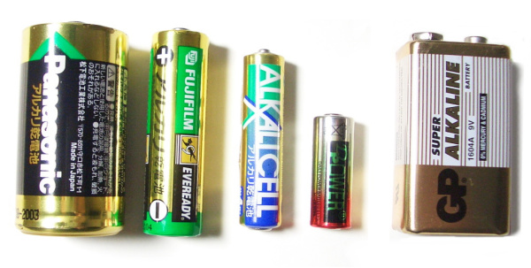

### 20世紀の充電式電池

1970年代、[COMSAT](https://ja.wikipedia.org/wiki/COMSAT)は通信衛星向けにニッケル水素電池を開発した。
この電池は、加圧された気体の状態で水素を蓄える。
[国際宇宙ステーション](https://ja.wikipedia.org/wiki/国際宇宙ステーション)をはじめ、多くの人工衛星が今もニッケル水素電池に頼っている。

1960年代後半から複数の企業が行ってきた研究の成果として、[ニッケル水素電池（NiMH）](./battery-technologies.md)が生まれた。
NiMH電池は1989年に消費者市場に投入され、充電式のニッケル水素セルよりも小型で安価な代替品となった。

日本の[旭化成](https://ja.wikipedia.org/wiki/旭化成)は1985年に最初のリチウムイオン電池を製作し、ソニーは1991年に最初の商用リチウムイオン電池を作り出した。
1990年代後半には、リチウムイオン電池向けに柔らかく柔軟な外装が開発され、これが「リチウムポリマー」あるいは「LiPo」電池の誕生につながった。

もちろん、これ以外にも実に多くの電池の化学方式が発明され、製造され、そして時代遅れになっていった。
現代の主流となっている電池の技術についてさらに読みたい場合は、[電池の技術のチュートリアル](./battery-technologies.md)を確認してほしい。

## 構成要素

電池は**アノード**、**カソード**、**電解質**という3つの基本的な要素で構成されている。
電解質だけでは不十分な場合、アノードとカソードが接触しないようにするために**セパレータ**が使われることも多い。
これらの構成要素を収めるため、電池にはたいてい何らかの**外装**がある。

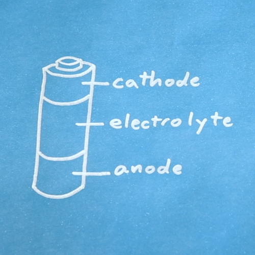

アノードとカソードはどちらも**電極**の一種である。
電極とは、回路の中の部品に電気が出入りする際に通る導体のことである。

### アノード

回路に接続された機器の中では、電子は**アノードから**外へ流れ出る。
つまり、従来の意味での「電流」は**アノードへ**流れ込むということである。

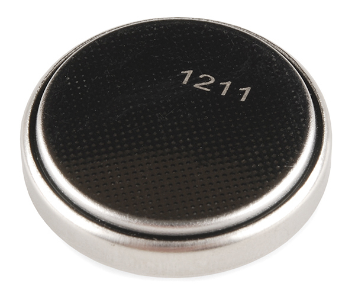

電池の中では、アノードと電解質の間の化学反応によって、アノードに電子が蓄積される。
これらの電子はカソードへ移動したがるが、電解質やセパレータを通り抜けることはできない。

### カソード

回路に接続された機器の中では、電子は**カソードへ**流れ込む。
つまり、従来の意味での「電流」は**カソードから**流れ出るということである。

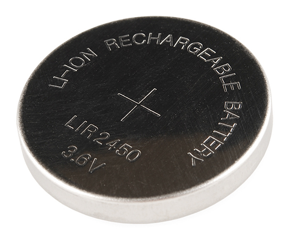

電池の中では、カソードの内部や周辺で起きる化学反応が、アノードで生み出された電子を消費する。
電子がカソードに到達する唯一の経路は、電池の外部にある回路を通ることである。

### 電解質

電解質とは、たいてい液体やゲル状の物質で、アノードとカソードでそれぞれ起きる化学反応の間でイオンを運ぶことができる。
また電解質は、アノードとカソードの間を電子が直接流れるのを妨げる役割も持っており、そのおかげで電子は電解質の中ではなく外部の回路を通って流れやすくなっている。

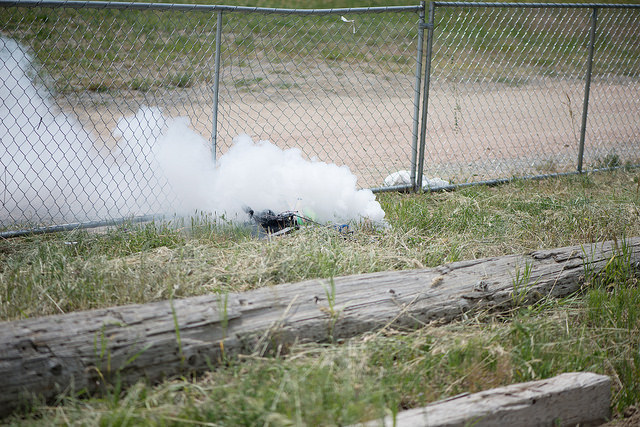

電解質は電池の動作にとって非常に重要である。
電子は電解質を通り抜けられないため、アノードとカソードをつなぐ回路という形の電気的な導体を通らざるを得なくなる。

### セパレータ

セパレータは、アノードとカソードが接触して電池内で短絡（ショート）が起きるのを防ぐ、多孔質の素材である。
セパレータには、綿、ナイロン、ポリエステル、厚紙、合成ポリマーフィルムなど、さまざまな素材が使われる。
セパレータは、アノード、カソード、電解質のいずれとも化学的に反応しない。

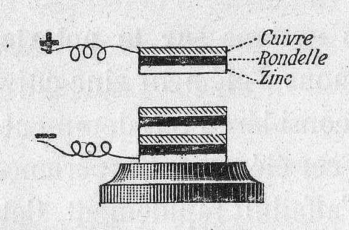

電解質中のイオンは正に帯電しているものも負に帯電しているものもあり、大きさもさまざまである。
特定のイオンだけを通し、他は通さないように作られた専用のセパレータも存在する。

### 外装

たいていの電池には、内部の化学成分を封じ込めておく何らかの方法が必要である。
外装は「ハウジング」や「シェル」とも呼ばれ、電池の内部構造を保持するための単純な機械的構造にすぎない。

電池の外装には、プラスチック、鋼鉄、柔らかいポリマーラミネートのパウチなど、ほぼどんな素材でも使うことができる。
一部の電池は、いずれかの電極に電気的に接続された導電性の鋼鉄製外装を使っている。
一般的な単3形アルカリ電池の場合、鋼鉄製の外装はカソードに接続されている。

## 動作の仕組み

電池が動作するには、たいてい複数の化学反応が必要である。
少なくとも1つの反応がアノードの内部または周辺で起こり、1つ以上の反応がカソードの内部または周辺で起こる。
いずれの場合も、アノードでの反応は**酸化**と呼ばれる過程で余分な電子を生み出し、カソードでの反応は**還元**と呼ばれる過程でその余分な電子を消費する。

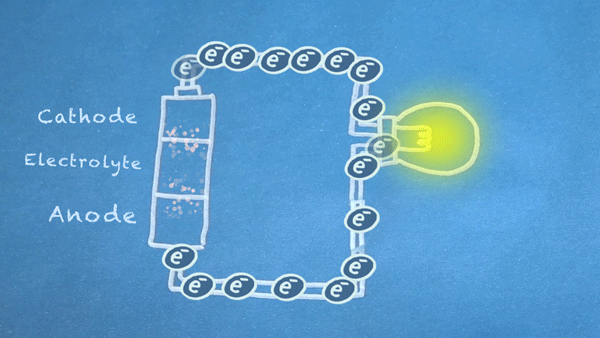

つまり本質的には、ある種の化学反応、すなわち還元酸化反応（[レドックス反応](https://ja.wikipedia.org/wiki/酸化還元反応)）を2つの部分に分離しているのである。
レドックス反応は、化学物質の間で電子が移動する際に起こる。
この反応における電子の動きを、電池の外へと導くことで、私たちは回路に電力を供給することができる。

### アノードでの酸化

レドックス反応の最初の部分である酸化は、アノードと電解質の間で起こり、[電子](https://ja.wikipedia.org/wiki/電子)（e-と表記される）を生み出す。

酸化反応の中には、[リチウムイオン電池](https://ja.wikipedia.org/wiki/リチウムイオン二次電池)のように[イオン](https://ja.wikipedia.org/wiki/イオン)を生み出すものもあれば、一般的な[アルカリ電池](https://ja.wikipedia.org/wiki/アルカリ乾電池)のようにイオンを消費するものもある。
いずれの場合も、イオンは電子が通れない電解質の中を自由に移動できる。

### カソードでの還元

レドックス反応のもう半分である還元は、カソードの内部または周辺で起こる。
酸化反応によって生み出された電子は、還元の過程で消費される。

リチウムイオン電池のように、酸化反応によって生じた正に帯電したリチウムイオンが還元の過程で消費される場合もあれば、アルカリ電池のように、還元の過程で負に帯電したイオンが生み出される場合もある。

### 電子の流れ

たいていの電池では、回路に接続されていない状態でも、一部またはすべての化学反応が起こりうる。
これらの反応は、電池の[保存期間](https://ja.wikipedia.org/wiki/シェルフライフ)に影響を与えることがある。

たいていの場合、これらの反応が最大の勢いで進むのは、アノードとカソードの間で電気を通す回路が完成しているときだけである。
アノードとカソードの間の抵抗が小さいほど、より多くの電子が流れることができ、化学反応もより速く進む。

これは、電池内で短絡（意図しないものも含む）を起こすことが、いかに危険であるかを示している。
リチウムイオン電池は、短絡が起きると過熱し、煙を出したり発火したりすることが知られている。

このように動いている電子を、「[負荷](https://ja.wikipedia.org/wiki/電気的負荷)」と呼ばれるさまざまな電気部品に通すことで、私たちは何か役に立つことを実現できる。

### 電池切れ

電池内の化学物質は、最終的に[平衡状態](https://ja.wikipedia.org/wiki/化学平衡)に達する。
この状態になると、化学物質はもはや反応しようとしなくなり、その結果、電池はそれ以上電流を生み出せなくなる。
この時点で、電池は「切れた」と見なされる。

一次電池は、切れたら廃棄しなければならない。
二次電池は、電池に逆方向の電流を流すことで充電できる。
充電は、化学物質が一連の反応を経て元の状態に戻ることによって行われる。

## 用語集

電池の電圧、容量、電流供給能力などについて語るとき、よく使われる共通の用語がある。

### セル

セルとは、電解質によって隔てられた1組のアノードとカソードのことで、電圧と電流を生み出すために使われる。
電池は1つ以上のセルから構成される。
たとえば単3形電池1本は1つのセルである。
自動車用バッテリーは、それぞれ2.1Vの6個のセルを含んでいる。

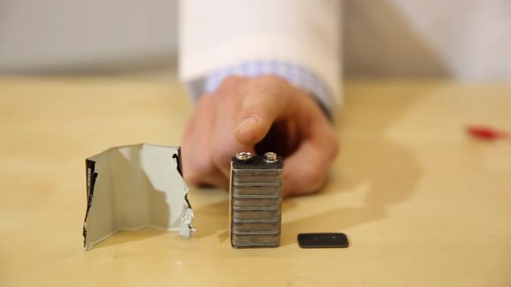

### 一次電池

一次電池は、元に戻すことのできない化学反応を利用している。
そのため、電池が切れたら廃棄しなければならない。

### 二次電池

二次電池は充電することができ、化学的な状態を元に戻すことができる。
「充電式電池」とも呼ばれ、これらのセルは何度も使うことができる。

### 公称電圧

電池の公称電圧とは、メーカーが表示している電圧のことである。

たとえば、アルカリ単3形電池は1.5Vと表示されている。
実際にテストされたアルカリ電池は、およそ1.55Vから始まり、放電が進むにつれて徐々に電圧が下がっていくことが分かっている。
この例では、「1.5V」という公称電圧は、電池の最大電圧、つまり使い始めの電圧を指している。

一方、クアッドコプター用のあるLiPoバッテリーパックでは、放電曲線がおよそ4.2Vから始まり、放電が進むにつれておよそ2.8Vまで下がっていくことが示されている。
たいていのリチウムイオン電池やLiPo電池に表示されている公称電圧は3.7Vである。
この場合、「3.7V」という公称電圧は、放電サイクル全体を通じた電池の平均電圧を指している。

### 容量

電池の容量とは、特定の電圧でその電池が供給できる電荷の量を示す指標である。
たいていの電池は、アンペア時（Ah）またはミリアンペア時（mAh）で定格が示される。

たいていの電池の放電グラフは、電圧を容量の関数として示している。
自分の回路に十分な容量の電池かどうかを判断するには、許容できる最低電圧を見つけ、それに対応するmAhまたはAhの定格を確認するとよい。

### Cレート

多くの電池、特に高出力なリチウムイオン電池では、電池の特性をより明確に示すため、放電電流を「Cレート」として表す。
Cレートとは、電池の最大容量に対する放電速度の比率である。

1Cとは、電池を1時間で放電しきるのに必要な電流量である。
たとえば、400mAhの電池が1Cの電流を供給する場合、それは400mAを意味する。
同じ電池での5Cは2Aになる。

たいていの電池は、大きな電流を取り出すほど容量が減少する。

> [!NOTE]
> 一般的な助言として、LiPo電池は1C以下で充電すべきとされている。

MITには、この概要よりもさらに踏み込んだ、電池の仕様と用語についての優れたガイドがある。

## 使い方

### 単セル

一部の回路は単セルの電池だけで動かせるが、その電池が十分な電圧と電流を供給できることを確認しておこう。

電圧が回路にとって高すぎる、あるいは低すぎる場合は、たいてい[DC/DCコンバータ](./voltage-dividers.md)が必要になる。

### 直列

電池の端子間の電圧を高めるには、セルを直列に接続するとよい。
直列とは、セルを端から端へと積み重ね、あるセルのアノードを次のセルのカソードに接続することを意味する。

電池を直列に接続すると、合計の電圧が増加する。
動作電圧を求めるには、すべてのセルの電圧を足し合わせればよい。
容量は変わらない。

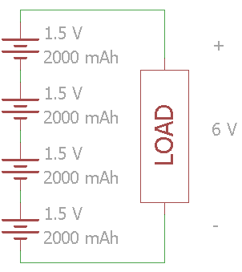

アルカリ電池を使うたいていの消費者向け電子機器では、電池は直列に積み重ねられている。
たとえば、[単3形電池2本用のホルダー](https://www.sparkfun.com/products/9547)を使えば、プロジェクトの公称電圧を3Vまで高めることができる。

> [!NOTE]
> リチウムイオン電池やLiPo電池を直列に接続して充電する場合は、セル間の電圧を均等に保つため、「バランサー」と呼ばれる専用の回路を必ず使う必要がある。バランサーを内蔵し、安全な充電を可能にする充電器もある。

### 並列

単セルの電圧が負荷にとって十分であれば、電池を並列に追加することで容量を増やすことができる。
これは同時に、取り出せる電流（Cレート）も増加させることに注意してほしい。

電池を並列に接続する際は注意が必要である。
すべてのセルは同じ公称電圧、同じ充電レベルでなければならない。
電圧に差があると、短絡が起きて過熱し、最悪の場合は発火する可能性がある。

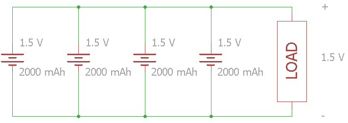

### 直列と並列の組み合わせ

電圧と容量の両方を増やしたい場合は、直列と並列を組み合わせることができる。
この場合も、短絡を防ぐため、並列に接続する電池どうしの電圧レベルが同じであることを必ず確認すること。

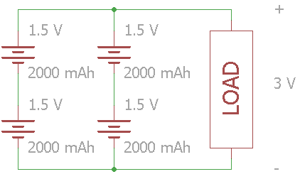

特にリチウムイオン電池を使った大型のバッテリーパックでは、直列と並列の構成を「S」と「P」を使って表すことがよくある。
上の回路の構成は2S2Pである。
実際の例として、現代の電気自動車は、直列と並列に接続された膨大な数の電池群を使っている。

## まとめ

これで、電池がどのように発明され、どのように動作するかについて理解できたはずである。
電池はプロジェクトに電気エネルギーを供給する方法のひとつであり、持ち運び可能な電源が必要な場合には非常に役立つ。

電池についてさらに詳しく知りたい場合は、次のようなチュートリアルも参考になる。

- [電池の技術](./battery-technologies.md)
- [プロジェクトへの電源供給](./how-to-power-a-project.md)
- [回路とは何か](./what-is-a-circuit.md)

タグ: 概念、電気工学、電力

---

出典：[What is a Battery?](https://learn.sparkfun.com/tutorials/what-is-a-battery)（SparkFun Learn）を日本語に翻訳し、再構成した。
原文は [CC BY-SA 4.0](https://creativecommons.org/licenses/by-sa/4.0/) ライセンスで公開されており、本ページも同ライセンスの下で提供する。
