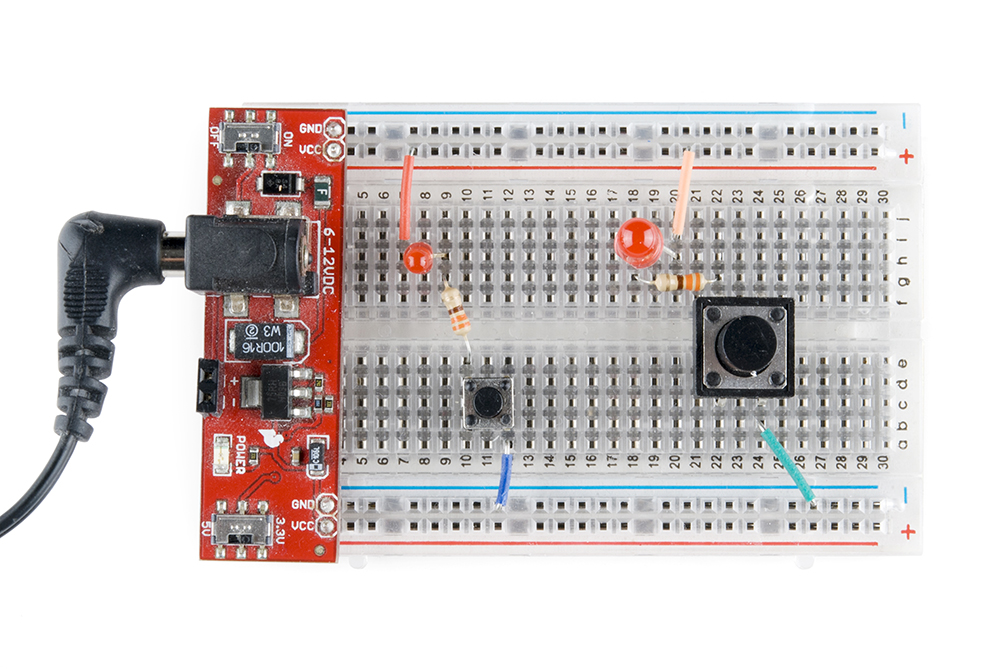
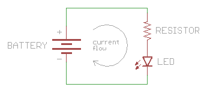

# 回路とは何か

電子工作の世界に足を踏み入れて最初に出会う概念の1つが**回路**である。
このチュートリアルでは、回路とは何かを説明し、あわせて**電圧**についてもう少し詳しく見ていく。

参考になるチュートリアル:

- [電気とは何か](./what-is-electricity.md)
- [電力](./electric-power.md)
- [電圧、電流、抵抗とオームの法則](./voltage-current-resistance-and-ohms-law.md)
- [交流と直流の違い](./alternating-current-ac-vs-direct-current-dc.md)
- [極性](./polarity.md)

## 回路の基礎

### 電圧とその働き

電池や壁のコンセントには、決まった数の**ボルト**があると聞いたことがあるだろう。
これは、電池や、コンセントにつながる送電網が生み出す電気的な**ポテンシャル**（電位）を表す量である。

そのボルトはすべて、使われるのを待って「そこにある」状態だが、1つ落とし穴がある。
**電気が何か仕事をするには、その電気が動ける状態になっている必要がある**のだ。
膨らませた風船のようなものだと考えるとよい。
口をつまんでいるあいだは、中の空気は何かをする*ことができる*状態にあるだけで、実際に外へ出してやるまでは何もしない。

風船から出る空気とは違い、電気は銅線のような、電気を通せる材料の中しか流れられない。
電池や壁のコンセントに電線をつなぐと（**警告**：壁のコンセントの電圧は危険なので、実際に試してはいけない）、電気が流れる道筋を与えたことになる。
ただし、その電線がどこにもつながっていなければ、電気には行き先がなく、やはり動かない。

では、何が電気を動かすのか。
**電気は、電圧の高いところから低いところへ流れようとする。**
これは風船とまったく同じで、風船の中の圧縮された空気は、風船の内側（圧力が高い）から外側（圧力が低い）へ流れようとする。
電圧の高いところと低いところのあいだに電気を通す道筋を作れば、電気はその道筋に沿って流れる。
そして、その道筋の途中にLEDのような何か役に立つものを入れておけば、流れる電気がそのために仕事をしてくれる。
LEDが点灯するというわけだ。

では、電圧の高いところと低いところはどこにあるのか。
ここで知っておくと役立つのが、**あらゆる電源には2つの側がある**という点である。
電池の両端にある金属のキャップや、壁のコンセントにある2つ（かそれ以上）の穴が、これにあたる。
電池のような[直流（DC）](https://learn.sparkfun.com/tutorials/alternating-current-ac-vs-direct-current-dc/direct-current-dc)の電源では、この2つの側はしばしば**端子**と呼ばれ、それぞれ**正極**（「+」）、**負極**（「-」）と名付けられている。

なぜあらゆる電源に2つの側があるのか。
これは「電位」という考え方に戻る話であり、電気を流すには電圧の差が必要だからである。
奇妙に聞こえるかもしれないが、比べる対象が2つなければ「差」というもの自体が存在しない。
どんな電源でも、正極側は負極側より電圧が高く、これがまさに私たちの求めている状態である。
実際、電圧を測るときは、負極側を0ボルトとし、正極側をその電源が供給できる電圧として表すのが通例である。

電源はポンプのようなものだと考えられる。
ポンプには必ず2つの側があり、何かを送り出す出口と、何かを吸い込む入口がある。
電池も発電機も太陽電池も、同じしくみで動いている。
内部の何かが電気を出口（正極側）へ向けて送り出す仕事をしており、電気が装置から出ていった分だけ空白ができるため、負極側はその空白を埋めるために電気を吸い込む必要がある[^franklin]。

ここまでの内容をまとめる。

- 電圧は電位にすぎず、電気が何かに役立つには実際に流れる必要がある。
- 電気が流れるには道筋が必要であり、それは銅線のような電気を通す導体でなければならない。
- 電気は電圧の高いところから低いところへ流れる。
- 直流の電源には常に2つの側があり、正極と負極と呼ばれ、正極側のほうが負極側より電圧が高い。

### もっとも単純な回路

これで、電気に仕事をさせる準備が整った。
電源の正極側から、発光ダイオード（LED）のような何か仕事をするものを経由して、電源の負極側へ戻るように接続すれば、電気、すなわち**電流**が流れる。
そして、電流が流れる道筋の途中に、電流が流れることで役立つことをしてくれるもの、たとえば光るLEDを入れておける。

**電気を流し、何か役に立つことをさせるために必ず必要となるこの円環状の道筋のことを、回路と呼ぶ。**
回路とは、始点と終点が同じ場所にある道筋のことであり、これはまさに今組み立てたものそのものである。

## ショート回路と開放回路

### 「負荷」とは何か

回路を組み立てる理由は、電気に何か役立つことをさせるためである。
そのために私たちは、電流の流れを利用して光ったり、音を鳴らしたり、プログラムを動かしたりするものを回路の中に組み込む。

こうしたものは**負荷**と呼ばれる。
何かを背負って「重荷を負う（load down）」のと同じように、電源を「負荷で重くする」からである。
人が重すぎる荷物を背負うと大変なのと同じで、電源にも負荷をかけすぎると電流の流れが遅くなってしまう。
しかし人と違って、回路には負荷が軽すぎるという問題もありうる。
軽すぎる負荷は、逆に電流を流しすぎてしまい（荷物を何も背負わずに全力疾走するようなものだと考えるとよい）、部品や電源そのものを焼き切ってしまうことがある。

電圧、電流、負荷については、次のチュートリアルである[電圧、電流、抵抗とオームの法則](./voltage-current-resistance-and-ohms-law.md)で詳しく学べる。
ここでは、回路の2つの特別なケースである**ショート回路**（短絡）と**開放回路**について見ていく。
この2つを知っておくと、自分の回路のトラブルシューティングをするときに大いに役立つ。

### ショート回路（短絡）

電源の正極から負極まで、電線だけを直接つなぐと**ショート回路**（短絡）と呼ばれる状態になる。
これは非常によくない状態であり、実際に試してはいけない。

一見すると最高の回路に見えるかもしれないが、なぜこれがよくないのか。
電流は電圧の高いところから低いところへ流れようとし、その途中に負荷を入れておけば、LEDを点灯させるといった役立つことをさせられることを思い出してほしい。

電流の経路にきちんと負荷が入っていれば、回路を流れる電流はその負荷が消費する分に制限され、たいていはごくわずかな量にとどまる。
しかし、電流の流れを制限するものを何も入れていないと、電流を遅くするものが何もなくなり、電流は限りなく大きくなろうとする。

電源が無限に電流を供給できるわけではないが、供給できる限りの、場合によってはかなり大きな電流を流そうとする。
これにより電線が焼け焦げたり、電源が壊れたり、電池が消耗したり、その他さまざまな厄介なことが起きる。
たいていの電源にはショート回路が起きたときに最大電流を制限する安全機構が組み込まれているが、必ずあるとは限らない。
すべての住宅や建物に[ブレーカー](https://ja.wikipedia.org/wiki/ブレーカー)が備わっているのも、配線のどこかでショート回路が起きたときに火災を防ぐためである。

これに近い問題として、回路の一部に誤って過大な電流を流してしまい、部品を焼き切ってしまうケースもある。
これは厳密にはショート回路ではないが、それに近い。
たいていは、**抵抗**の値を間違えたことで、LEDのような別の部品に過大な電流が流れてしまうことで起きる。

要点はこうだ。
**部品が急に熱くなったり、突然焼き切れたりしたときは、すぐに電源を切り、ショート回路が起きていないか確認すること。**

### 開放回路

ショート回路の反対にあたるのが**開放回路**である。
これは、回路のループがどこかで完全にはつながっていない状態を指し、その意味では回路としてまったく機能していないとも言える。

先ほどのショート回路とは違い、この「回路」で何かが壊れることはないが、回路自体も動作しない。
電子工作を始めたばかりの人にとって、どこで断線しているかを見つけるのは難しいことが多く、特に[ブレッドボード](./how-to-use-a-breadboard.md)を使っていると配線がすべて隠れてしまうため、なおさら見つけにくい。

**回路が動作しないときは、開放回路が原因であることが多い。**
たいていは、接続不良や配線の緩みが原因である（ショート回路も回路全体の電力を奪ってしまうことがあるので、あわせて確認するとよい）。

**ヒント：** 回路のどこが開放状態になっているかなかなか見つからないときは、**テスター**（マルチメーター）が非常に役立つ道具になる。
電圧測定モードにしておけば、通電中の回路のさまざまな地点の電圧を確認しながら、電圧が届かなくなっている場所を突き止められる。

## まとめ

ここまでで、回路とは何かをもっとも基本的な形で学んだ。
学習を進めていくと、複数のループや、より多くの部品を含む複雑な回路にも出会うことになる。
しかし、どれほど複雑な回路であっても、ここで学んだ単純な1ループの回路と同じ規則に従っている。

電子工作の旅はまだ始まったばかりである。
次に学ぶとよい話題をいくつか挙げる。

- [配線の基本](./working-with-wire.md)も身につけておくとよい。
- [マルチメーター](./how-to-use-a-multimeter.md)を使えば電圧、電流、抵抗を測定でき、うまく動かない回路の原因を探るときに大いに役立つ。
- 回路にはさまざまな大きさ、形、構成がある。[直列回路と並列回路](./series-and-parallel-circuits.md)のチュートリアルでは、回路をもう一歩先まで見ていく。

ここからは、回路でよく使われる部品についてのチュートリアルを挙げる。

- [発光ダイオード](./light-emitting-diodes-leds.md)のチュートリアルでは、1つまたは複数のLEDを点灯させる方法を紹介している。
- [抵抗器](./resistors.md)は、回路でもっとも広く使われる部品の1つである。
- [コンデンサ](./capacitors.md)も、ほとんどの回路で使われている。ダイオードも同様である。

タグ: 概念、電気工学

[^franklin]: 電気は電源の正極側から負極側へ流れる、と最初に書いたのはベンジャミン・フランクリンである。しかしフランクリンには、実際には[電子がその逆方向に流れている](http://www.allaboutcircuits.com/vol_1/chpt_1/7.html)ことを知るすべがなかった。原子レベルで見ると、電子は負極側から出て正極側へ戻っていく。真実が発見されるまでの何百年ものあいだ、技術者たちはフランクリンの説に従ってきたため、今日でもこの「誤った」慣習がそのまま使われ続けている。実用上はこの違いは問題にならず、誰もが同じ慣習を使ってさえいれば、正しく動作する回路を組み立てられる。

---

出典：[What is a Circuit?](https://learn.sparkfun.com/tutorials/what-is-a-circuit)（SparkFun Learn）を日本語に翻訳し、再構成した。
原文は [CC BY-SA 4.0](https://creativecommons.org/licenses/by-sa/4.0/) ライセンスで公開されており、本ページも同ライセンスの下で提供する。
